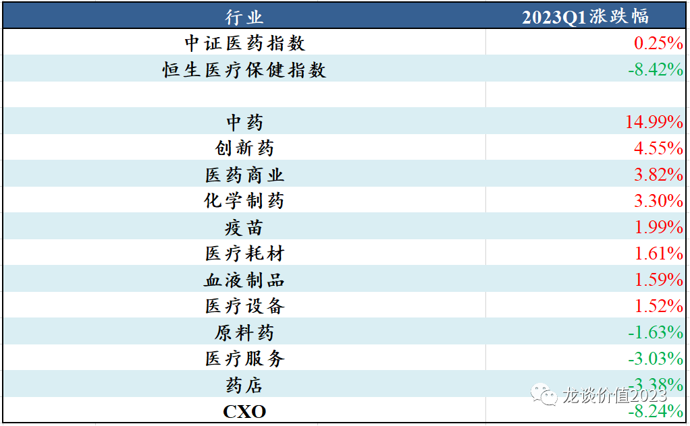
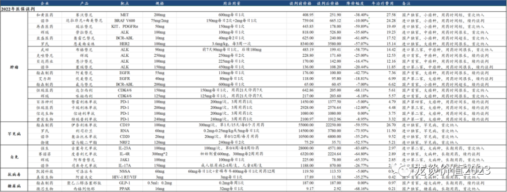
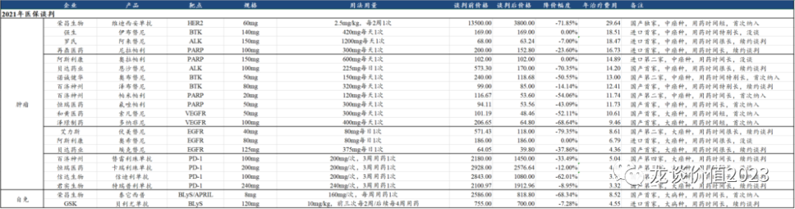
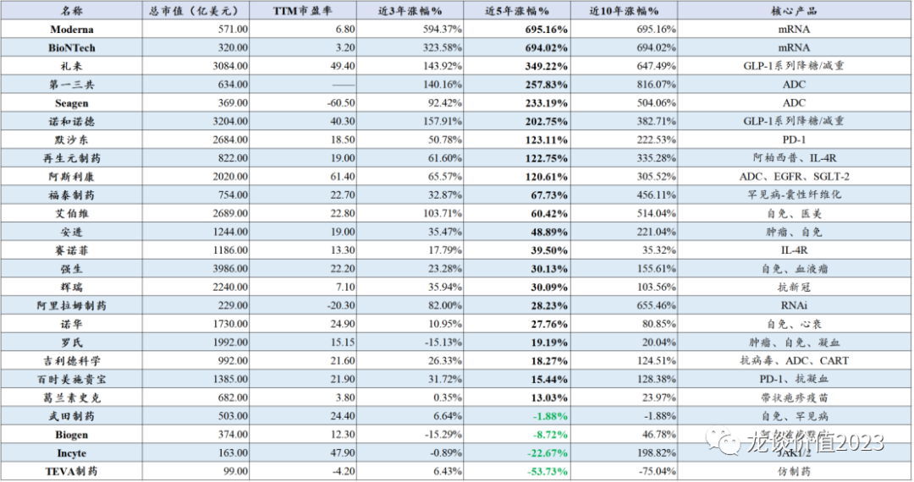
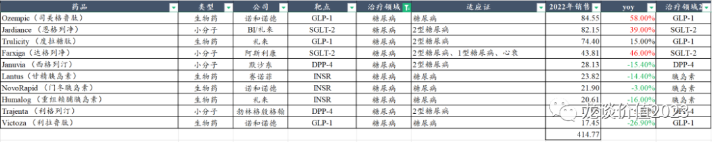
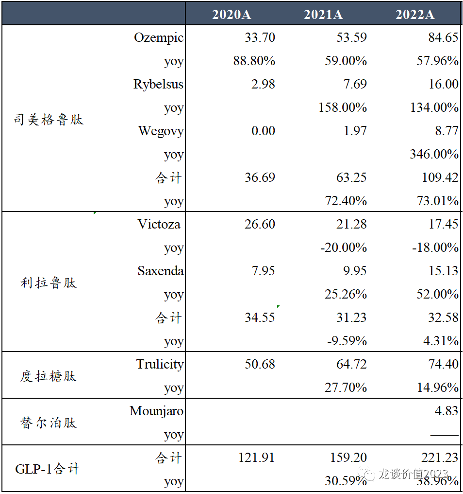
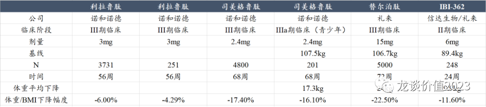
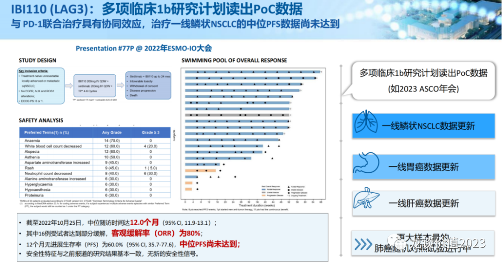
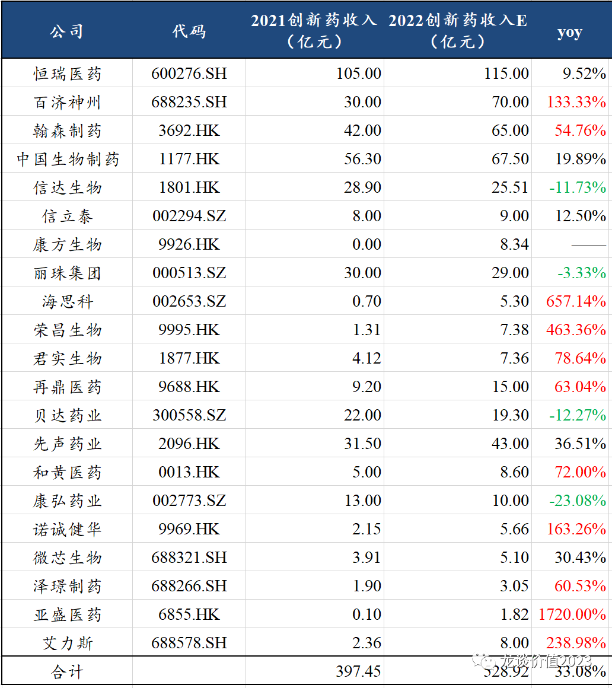

# 再战二季度，医药行业新变化

二季度之初，财报季开启，复盘完一季度，来谈谈对行业最新的观点和近期的一些变化。一季度整个行业经历了比较大幅度的波动，尤创新药、CXO、中药等子行业都是如此，港股波动幅度尤其大（惯例了），AI相关板块的热炒则是让医药行业短期看起来毫无吸引力，行业关注度快速下降，在这个时点我们又该如何看待这个行业？

***01***

**摒弃赛道思维**

过去三年盛行赛道投资的模式，在一个高景气赛道里沿着产业链挖掘投资机会，不论是光伏、新能源车，还是医药里的CXO、创新药都是比较典型的，这种研究和投资的模式是比较高效率和比较容易形成共识的，直到今年年初创新药和CXO板块的大涨依然是沿着这种思路，但市场已经在变化。

今年以来医药行业里表现最好的是中药，其次是创新药、医药商业，表现最差的是CXO和连锁药店、医疗服务。

创新药行业从去年10月份到今年2月份不到4个月的时间里的加速上涨，经历了四轮逻辑的催化，第一轮是百济泽布替尼验证相较伊布替尼的优效，中国确实可以研发出全球顶级的创新药；第二轮是医保谈判中给予一些竞争格局较好、产品力较强的品种以比较好的价格，同时大家关注度比较高的PD-1单抗的价格也比较稳定，医保降价方面的压力有所减缓；第三轮是康方的AK112以50亿美元交易对价授权Summit、科伦的7款ADC以合计94.75亿美元的交易对价授权默沙东、和黄的呋喹替尼以11.3亿美元的交易对价授权武田制药，国产创新药国际化逻辑重塑。第四轮是国际大药企财报发布，一些重磅品种的销售数据刺激国内相关企业，此时行业已经是强弩之末。

回顾这轮创新药的行情，市场上的大多投资人还是以赛道投资的方式去投，一拥而上挖掘创新药公司里各种潜在的催化，但创新药行业的逻辑不会一夜之间变化，创新药的盈利依然需要长期的验证，创新药的研发和商业化兑现需要以几年为维度去看，随后就是在AI的热度下又一哄而散，创新药大量的标的暴跌30%-50%，尤其是一些港股后排的小biotech涨的时候没跟上，跌的时候却屡创新低。

CXO更不必说，包括我在年初也犯了这个错误，认为国内创新药行业和美股的XBI指数企稳以后，后续融资数据即将看到拐点，CXO行业也会领先于融资数据实现企稳，但实际上这还是传统的赛道投资的方式，包括对估值的认知也停留在过去几年的惯性思维里，结果就是亏损出局。CXO行业所面临的供给端的过剩和需求端的压力仍在加码，谈行业的出清和基本面的拐点为时尚早，因此在短期跟随创新药行业反弹后，随后就是在康龙、药明生物等公司利润端低于预期之下，在一系列的大规模减持之下，行业又回到接近新低。

在2019年以来的这轮CXO行业的超级景气周期以前，医药行业是没有很强的赛道投资的风格的，医药投资人是比较擅长挖掘细分行业和公司的α的，医药里很多曾经的长牛股，如当年的爱尔、恒瑞、高新、华东、金域、片仔癀也不曾是以赛道投资的方式涨起来的。

是时候摒弃赛道投资、回归个股基本面投资了。

创新药看起来很炫，以上讲到的从医保谈判到国际化的逻辑也依然成立，但这并不能构成行业全面上涨的逻辑，原因是创新药是重磅产品驱动。

医保谈判的回暖是客观存在的，但这种回暖并不是2022年医保谈判才有的，在2021年医保谈判中维迪西妥单抗作为独家品种也是谈出了非常好的价格，2022年医保谈判中比较出众的则是和黄/AZ的赛沃替尼和亚盛医药的奥雷巴替尼。

在医保谈判中能具有议价权的前提，是产品力强+竞争格局好，且病种越大，给医保基金的支付压力越大，降价压力一般也越大。医保局的谈判专家的专业性我认为是没问题的，医保局的谈判结果实际上是在给我们展示创新药企业真实的产品力和议价能力。

（注：年用药费用为直接按单日/单次用药费用进行年化计算，由于部分品种平均用药时长只有几个月，实际单个患者年用药费用可能没有那么高）

在此前多篇文章中我们曾多次强调，创新药长期来看一定是极致的分化，只有少数的公司可以成功转型成为平台型的biopharma而持续做大，需要的是很强的研发和BD能力、以及很强的国际视野，很多公司的管线怎么看都是滞后于前沿技术的，就是国际视野比较差。还有一部分创新药公司是具有较强的产品周期，一轮核心产品放量期之后很难做出第二曲线，如A股曾经创新药标杆企业贝达药业就是在核心单品埃克替尼达峰后近两年业绩压力较大，要知道贝达已经是biotech里把商业化做的非常好的了，其他很多一两个重磅单品的公司后续也会面临类似的问题。再有一类就是典型的、大多数的biotech的宿命，就是产品研发失败或者竞争力不足，现金烧的差不多以后尘归尘土归土，这类公司可能会跌破现金价值，完全没有估值的锚，因为他们账上的现金并不会具有清算价值，而是会继续白白烧掉。

***02***

**创新药投资方向，跟随新技术**

（截至2023.03.21）

创新药投资是跟随新技术和重磅产品的方向，过去十年海外头部药企中涨幅最大的是第一三共，10年累计涨幅达到800%多，第一三共现在已经以DS-8201为首的ADC平台而闻名，股价仍在屡创新高，其在2019年3月以13.5亿美元首付款+55亿美元里程碑付款将DS-8201授予阿斯利康后的一年半里股价上涨180%（期间2020年7月由以10亿美元首付款+50亿美元里程碑付款将DS-1062授权给AZ），在2022年8月DS8201读出III期临床数据以来涨幅超过30%。

其也全面带动了全球ADC药物的研发热情，ADC药物研发的靶点逐渐从HER2扩展开来，从单抗ADC到双抗ADC，科伦药业2022.05授权Trop2-ADC给默沙东，2022.07授权Claduin18.2-ADC给默沙东，2022.12授权7个ADC给默沙东，验证ADC平台价值，也既默沙东合计用2.57亿美元首付款+115.64亿美元里程碑付款买下科伦药业的9个ADC药物海外权益，另外默沙东支付科伦博泰的全球研发费用，自Trop2-ADC授权以来科伦药业股价接近翻倍，确立国内ADC药物龙头地位。

内卷已经开始，稍微大一点的肿瘤药企业和biopharma手里没有几个在研的ADC分子都不好意思出来见人，行业颇有种上一轮肿瘤免疫研发热情的样子。创新药的扎堆研发虽然可以一定程度上促进行业资本投入快速聚集和推动技术进一步发展，但随之而来的内卷和淘汰赛也是残酷的。ADC药物的研发难度也绝不仅仅是抗体+linker+细胞毒素排列组合那么简单，研发的门槛还是比较高，国内目前已经有多家pharma或者biotech（包括大家耳熟能详的头部药企）的多个ADC药物失败或暂停，此前相对集中的HER2靶点也将迎来DS-8201的正面竞争。

近五年欧美大药企中股价表现最好的是礼来和诺和诺德两大糖尿病+减重药物王者，主要得益于GLP-1系列药物的迭代和爆发，2022年全球销售额前10款降糖药合计销售415亿美元，其中GLP-1占据半壁江山，司美格鲁肽一枝独秀，SGLT-2在心血管获益下也实现高增长。

司美格鲁肽在2022年合计实现109.42亿美元销售额，同比增长73%，其中减重适应症销售8.77亿美元同比增长346%，这是在司美格鲁肽产能受限的情况下实现的销售规模。礼来开发的GLP-1/GIP双靶点激动剂替尔泊肽在上市7个月实现近5亿美元销售，放量速度远超前一代GLP-1，将是一个足以挑战司美格鲁肽的潜在重磅炸弹药物。

GLP-1在国内也已经开始内卷，司美格鲁肽专利2026年到期（国内专利挑战成功，预计最快2025年上市），目前已经有华东医药、丽珠集团和联邦制药三家进入III期临床；双靶点激动剂的开发难度较大，3-4年内国内主要玩家应该只有信达生物和礼来两家。

阿尔兹海默症和NASH同样是近年全球创新药重点突破的方向，但国内目前研发偏早期，可选标的较少，NASH比较值得关注的是GLP-1能否成功，一旦有所突破，将再次大幅提升GLP-1的天花板。

肿瘤免疫领域同样值得期待，过去几年肿瘤免疫领域的CD47、TIGIT和PD-L1/TGFβ等靶点的全面溃败，使得该领域海内外大量的药企和在研管线陷入迷茫期，但诺华最新启动PD-1+TIGIT+化疗头对头K药+化疗一线治疗NSCLC的注册临床，BMS和信达生物将在ASCO发布LAG-3的Ib/II期临床数据，信达生物还将在ASCO发布TIGIT的Ib期数据，肿瘤免疫是否迎来新的突破？

创新药行业经历前一轮全面的估值修复后，将会是剧烈的分化行情：大量没有存在感、产品缺乏竞争力的小biotech的估值会跌破净现金，下跌90%后依然有再跌90%的风险。Biopharma则是在产品进入密集商业化阶段后，也逐渐开始对控费用、减亏或扭亏有了更多的要求；多家经营现金流充沛的低估值传统药企重新进入关注范围内，在行业融资不易的阶段，传统药企的充沛现金流可以有充足的空间挑选biotech的管线做BD。

（以上统计不含生物类似药）

国产创新药的收入体量还非常有限，2023-2024年是诸多新药密集上市兑现的时间，预计国产创新药行业仍将维持30%-40%的行业增速，预计到2023年国产创新药合计占用国家医保基金的金额仍然不到医保基金全年支出的2%，还是非常小的体量，对行业发展可以多一点信心。

*风险提示：本文仅讨论行业/公司经营情况，投资需综合考虑公司经营、估值、管理层等多方面因素，建议读者审慎参考，本文不作为投资依据，不建议大家根据本文做出投资计划。*
