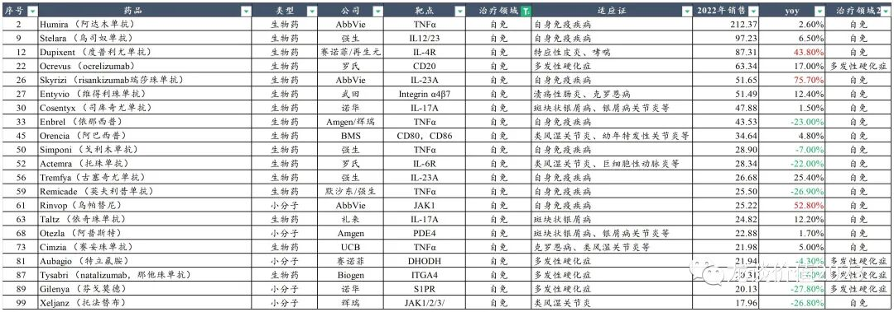
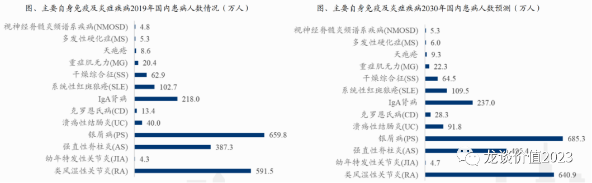
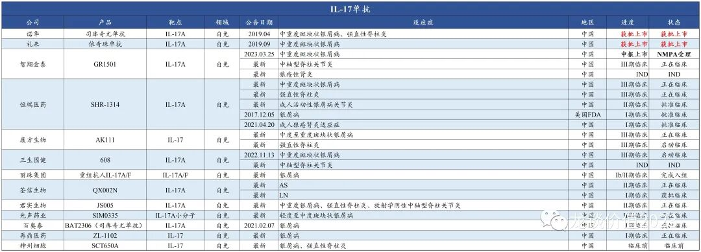
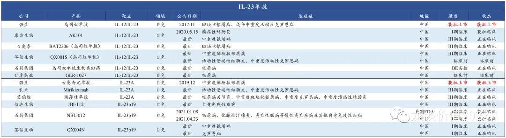
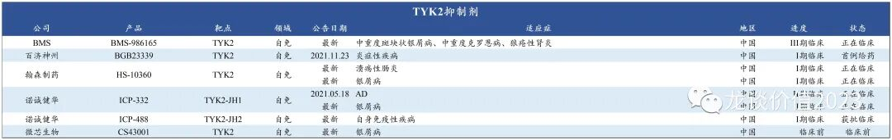
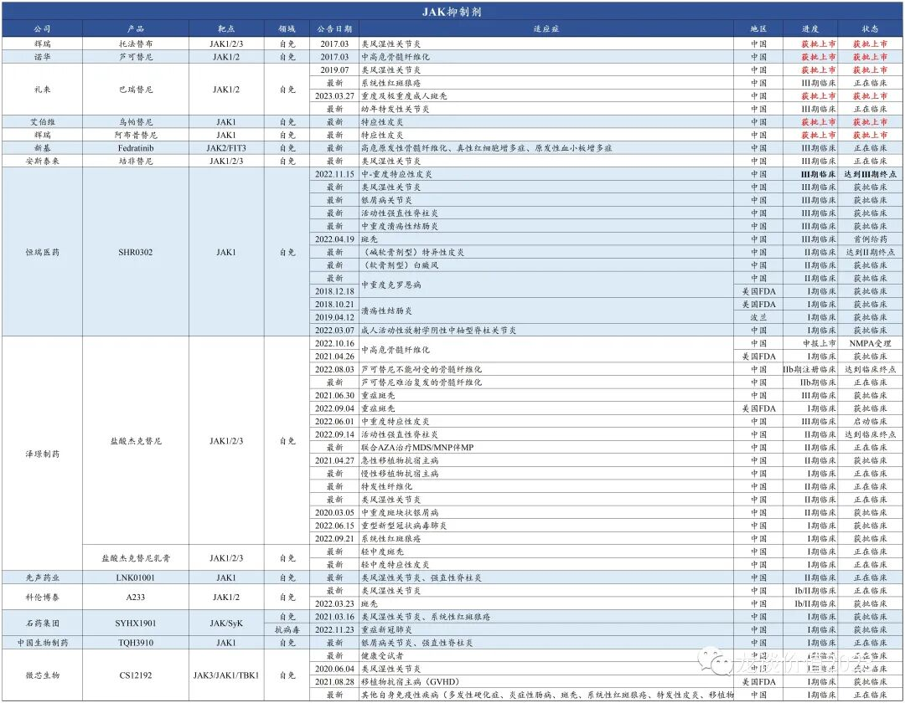
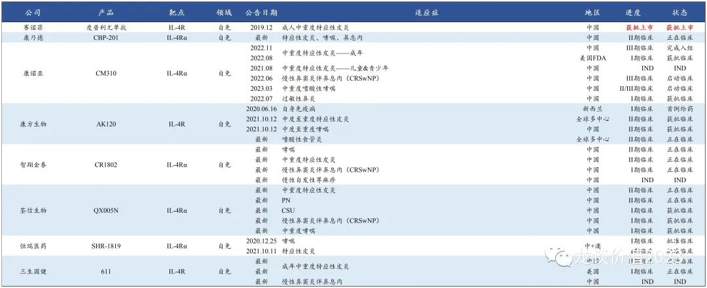
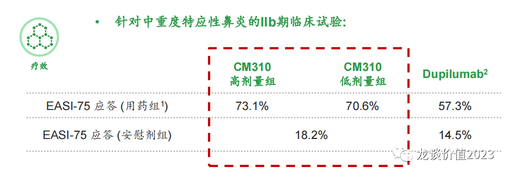
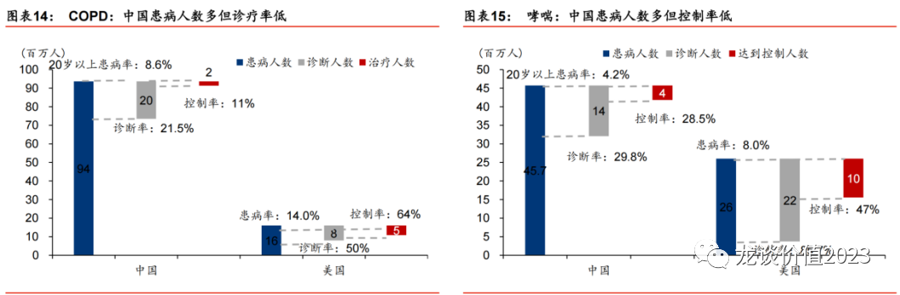
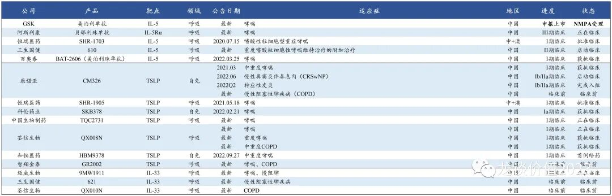

# 一个快速爆发的创新药领域

过去几年国内投资创新药行业最主要的目光都在肿瘤药行业，原因是肿瘤药的细分癌种多、未满足需求庞大，很多药物可以通过小适应症或末线治疗的快速审批实现上市，并通过off labal来实现放量，也有一些国产的me too药在国际大药企已经教育好的市场实现高速增长，国产肿瘤药行业蓬勃发展。

但与此同时快速爆发的另一个行业——自身免疫病药物领域，其潜在市场空间不弱于肿瘤，但竞争格局相对来说要好于肿瘤药行业，同时这个领域的发展更早期、空白市场更大、患者群体更多，非常值得关注。

从全球市场来看，**2022年全球药品销售额TOP100中共有22个自免类药物，合计实现974亿美元销售额，**平均每个药物实现44亿美元销售额，而2021年全球药品销售额TOP100中则是有21个自免药物实现936亿美元销售额。自免是仅次于肿瘤药（2022年TOP100中有27个肿瘤药实现1139亿美元销售额）的第二大药物领域。

其中阿达木单抗已经是第11年蝉联全球药王，累计销售额突破1800亿美元，也是全球第一款年销售额突破200亿美元的常规治疗药物（除新冠疫苗），一款药物的年销售额达到1400亿人民币，可见其恐怖之处。

但以上自免类的重磅药物在国内却大多鲜为人知，尤其是在2-3年前，对于创新药投资人来说，自免行业药物在中国市场能否真正做大做强是非常值得怀疑的，毕竟全球200亿美元销售额的阿达木单抗在国内也不过销售区区小几亿元，那时国内药企对于自免类药物的研发热情也远不及行业内卷的今天。

几个重磅品种的放量已经越来越让大家意识到这个领域的潜在空间和市场价值：

- 全球药王阿达木单抗，在原研纳入医保、国产生物类似药陆续上市后进入放量期，原研+国产已经小几十亿的销售体量；
- 诺华的司库奇尤单抗2020年纳入医保，2022年国内销售额已经达到30-40亿元的体量，2022年底的医保谈判中又解除了对强直性脊柱炎的支付限制，进一步打开市场空间；
- 度普利尤单抗2022年国内销售额18亿元，这仅仅是度普利尤单抗纳入国家医保目录的第二年；
- 与度普利尤单抗同样用于特应性皮炎适应症的JAK1抑制剂，辉瑞和艾伯维的两款产品在纳入医保后，对今年国内市场销售分别定下了10亿左右的销售目标，加上度普利尤单抗今年国内预计超过30亿元的销售额，则今年2-3年的时间，国内特应性皮炎的创新生物药和小分子药的市场空间就将达到50亿元，这还仅仅是个开始。

**更重要的是，国内药企前瞻性布局自免领域重磅靶点的公司也将逐渐进入兑现期，部分大品种商业化在即，自免领域将会成为下一个国产新药快速爆发、竞争格局好于肿瘤、头部公司先发优势更加显著的创新药领域，是未来国内投资创新药避不开的一个重点赛道。**

**①RA/PS/AS三大病种**

自身免疫及炎症疾病范围非常广泛，且患者群体非常庞大，上图中的三大病种——类风关（RA）、银屑病（PS）和强直（AS）合计约1600万患者，无法治愈、需要长期用药，传统治疗方案疗效差、副作用高，过去受限超高的生物药价格，慢性病医生治疗习惯的调整和慢病患者用药习惯的改变都需要时间，这三大类疾病的患者如果全部长期使用生物制剂治疗，则将带来千亿级别的市场空间。

由于国内阿达木单抗生物类似药竞争者较多，这里就不再梳理阿达木单抗生物类似药的玩家，IL-17和IL-23是近年全球增长较快的自免药物靶点，尤其是IL-17A的司库奇尤单抗在国内的放量速度远快于阿达木单抗，诺华在国内的销售非常成功，远好于艾伯维。国内进度最快的是智翔金泰的IL-17A单抗已经申报上市，其次是恒瑞医药和康方生物的多个适应症处于III期临床，另外有三生国健和丽珠集团即将启动III期临床。

IL23A是2022年全球自免重磅药物中增速最快的一个品种，且瑞莎珠单抗以12周的给药周期销售金额远超8周给药的古塞奇尤单抗，瑞莎珠单抗销售额已经超越50亿美元，在乌司奴单抗专利到期后有望接棒成为下一个百亿级别的IL-23单抗。国内市场信达生物的IL-23单抗研发进度遥遥领先，目前已经启动中重度特应性皮炎的III期临床。

IL23/12单抗则是有三家进入III期临床，其中百奥泰和荃信生物均为乌司奴单抗的生物类似药，荃信生物也将该产品的国内商业化权益授权给了华东医药。

TYK2是下一个潜在的自免领域重磅靶点，国产有多家非上市公司布局，上市公司中有百济、翰森、诺诚健华和微芯生物等四家布局，均还处于I/II期临床阶段。

**②皮肤类自免疾病**

皮肤类自免疾病主要是银屑病（PS）、特应性皮炎（AD）、系统性红斑狼疮（SLE），国内银屑病患者约为600万人，系统性红斑狼疮患者约100万人，特应性皮炎患者约有1亿人，AD患者中绝大部分是轻度（普通湿疹），中重度特应性皮炎约有1000万人。

银屑病和中重度特应性皮炎对患者的生活质量影响较大，主要体现在外观难看从而直接影响形象，痒、抓挠后进一步扩散及引发水肿和疼痛等，国内很多患者对于强直性脊柱炎、类风湿性关节炎等疼痛为主要症状的疾病容忍度较高，对严重影响外观形象的疾病容忍度偏低。

皮肤科自免疾病的治疗主要有三类，分别是膏剂（化药、中药等，如1类新药本维莫德、JAK1膏剂）主要用于面积较小的轻中度病变（3个巴掌以下面积），口服化药（如JAK1）、生物药（IL-4R、IL-17、IL23）主要用于中重度病变，以上三类新药的竞争格局均明显好于TNFα靶点（主要是阿达木单抗生物类似药），且皮肤科药物放量速度较快。

JAK抑制剂布局厂家数量较多，开发了包括血液瘤和自免两类适应症，JAK1的选择性更强，主要做特应性皮炎适应症，pan-JAK抑制剂在做特应性皮炎适应症时可能会更多面临安全性方面的担忧，国内目前已经有艾伯维的乌帕替尼和辉瑞的阿布昔替尼获批上市且均已经纳入国家医保目录，国产厂商中进展最快的JAK抑制剂是泽璟制药的JAK1/2/3抑制剂杰克替尼，已经提交上市申请，而进展最快的JAK1抑制剂则是恒瑞/瑞石的SHR0302，以上两款产品均同时开发了片剂和乳膏两种剂型。

但由于JAK1抑制剂的安全性问题使得巴瑞替尼、乌帕替尼等JAK抑制剂被FDA给了黑框警告，因此在特应性皮炎的竞争中IL-4R是主导地位，2022年度普利尤单抗全球销售额已经超过80亿美元（60%以上销售为AD贡献），且仍维持了40%以上的增速，预计今年将突破百亿美元销售额，这还远不是度普利尤单抗的终点，COPD适应症开发成功使得其潜在峰值进一步提升，国内市场赛诺菲预计达必妥也可以实现80亿-100亿的峰值，这还是与国产厂商共享市场的情况下。

国内IL-4R单抗竞争者中，康诺亚为绝对领先地位，预计今年上半年将进行AD适应症、今年底到明年初进行慢性鼻窦炎伴鼻息肉适应症的NDA，2024年上市后有望在2024年底医保谈判中纳入国家医保目录，并在2025年与达必妥展开正面竞争，另外康诺亚还开发了过敏性鼻炎适应症，过敏性鼻炎国内也是上亿患者人群，潜在市场有望再造一个中重度特应性皮炎适应症。

其他在IL-4R进展较快的国内公司主要是康方生物（今年开III期）、智翔金泰、恒瑞医药、荃信生物（准备港股IPO）、三生国健。

**③系统性红斑狼疮（SLE）**

系统性红斑狼疮国内100万患者，多发于20-40岁女性，在脸部形成明显红斑，更会累及心脏、关节、肾脏、神经、血液、肌肉等组织，严重伤害体内多器官，是自免中少数明显影响寿命的病种，治疗需求较强，且对更具疗效的创新药有较强需求。

SLE目前治疗方案不多，除传统激素类药物外，目前已经获批上市的产品主要是GSK的贝利尤单抗和荣昌生物的泰它西普，泰它西普现在也在进行全球多中心III期临床，未来有望拓展海外市场。除此以外在SLE适应症目前处于II/III期临床的主要是艾伯维的JAK1抑制剂以及部分在研自免适应症的BTK抑制剂（诺诚健华等）。

**④呼吸类炎症性疾病**

呼吸类炎症性疾病主要有哮喘和COPD，国内患者基数庞大，分别达到近5000万和近1亿患者人群，但国内COPD诊疗率只有2%，远低于美国的32%，国内哮喘诊疗率只有8.5%，远低于美国的40%。哮喘与慢阻肺的诊疗率同样是与经济水平高度相关。

哮喘和COPD的治疗方案主要分为两个方向，化药方面主要是呼吸科吸入制剂，海外主要是粉雾剂和气雾剂，通过将小分子药物吸入肺部实现扩张支气管而缓解疾病，目前海外上一代主流用药普遍专利到期，但本身呼吸科吸入制剂的生产壁垒较高，尤其是粉雾剂和气雾剂的工艺壁垒更高，国内竞争格局比较好，健康元将有首个国产的茚达特罗粉雾剂和首个国产沙美特罗替卡松（舒利迭）仿制药上市或申报上市，2022年健康元呼吸科产品贡献了超过10亿元收入同比翻倍，过去讲的健康元呼吸科吸入制剂的逻辑真正进入兑现期。

另一个方向是生物药，主要是IL-4R、IL-5、TSLP、IL-33等靶点，近期海外刚刚获批上市首个TSLP单抗，是第一个也是唯一一个与嗜酸性粒细胞水平无关，且能在广泛人群中减少严重哮喘患者恶化的生物制剂。

IL-4R在上文中已经有介绍，IL-5对哮喘的治疗效果没有非常出众，国内开发者也并不多，恒瑞医药、三生制药和百奥泰三家基本全面布局自免重点靶点，因此也都做了IL-5单抗。

TSLP单抗国内康诺亚依然是遥遥领先，且将IL-4R与TSLP呼吸科适应症均授权给了石药集团；除此以外还有恒瑞、科伦博泰、中生、荃信生物、和铂、智翔金泰等公司布局，基本处于I期临床。

IL-33是COPD领域下一个潜在重磅靶点，海外有赛诺菲/再生元和AZ处于III期临床，安进/基因泰克处于II期临床，国内企业中只有迈威生物进入I期临床。

......

以上就是国内自免药物领域最值得关注的方向和公司，还有部分重点靶点如FcRn、CTLA-4融合蛋白、PDE4、IL-1β等靶点没有具体介绍，以后有机会再做进一步的梳理。

*风险提示：本文仅讨论行业/公司经营情况，投资需综合考虑公司经营、估值、管理层等多方面因素，建议读者审慎参考，本文不作为投资依据，不建议大家根据本文做出投资计划。*
