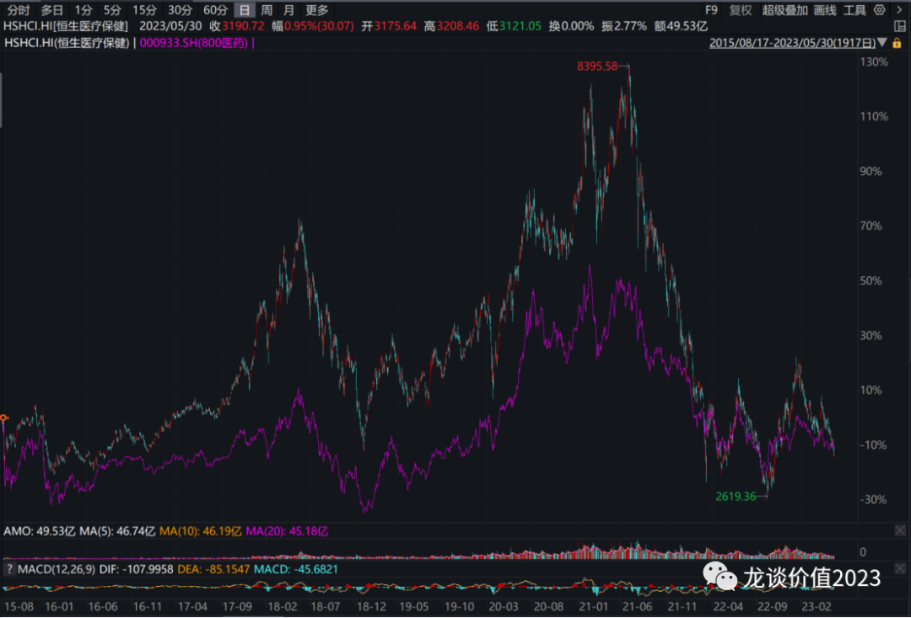
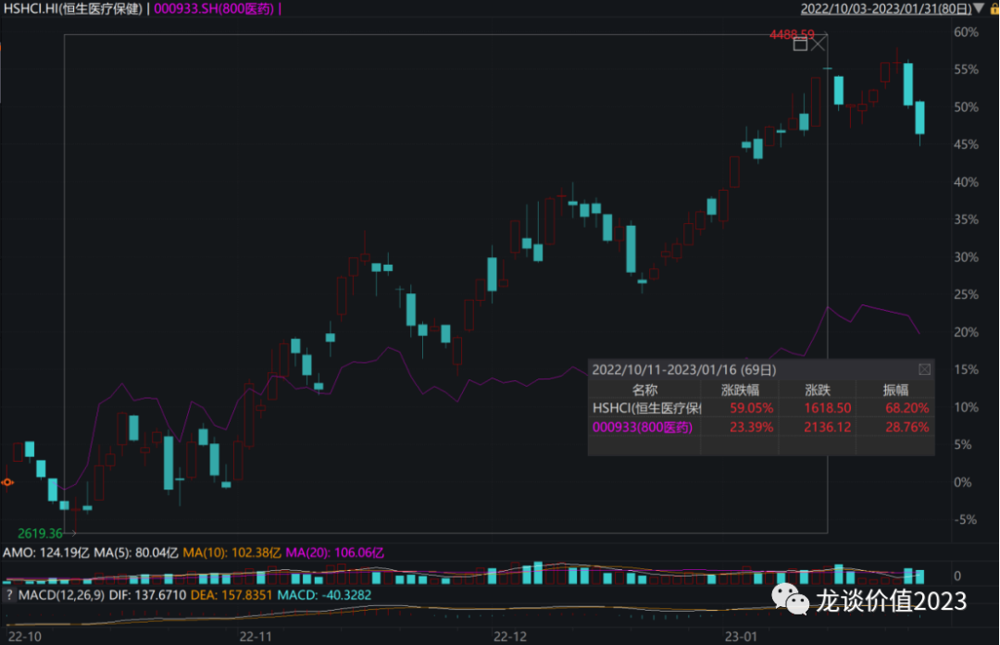
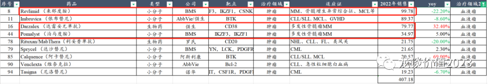
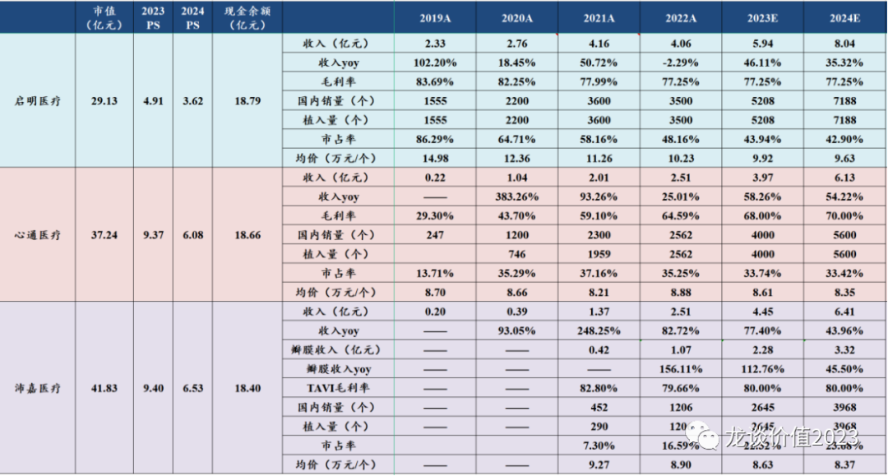

# 又到了遍地黄金的时候

港股市场近期的大跌让人胆战心惊，事后分析可以找到很多宏观的因素来解释，但在悲欢时找更悲观的信息也毫无意义，今年宏观分析在港股市场基本是后视镜解释为主，前瞻性预判能力有限，因此我们要做的还是尊重基本的客观规律，在遍地黄金的时候增加信心。

***01***

**港股市场是否值得投资？**

首先要来解释一点，港股市场是否真的如很多人想的那样完全是垃圾市场、一文不值？还是以我们最熟悉的医药行业来看，下图是恒生医疗保健指数与中证医药指数2015年8月以来的历史走势。

由图可见每一轮医药的大行情里，恒生医疗保健非但没有缺席，反而涨幅要远远大于中证医药指数，但二者最终殊途同归回到同一位置，从而表现出来在回撤的时候恒生医疗的跌幅也要远大于A股的中证医药指数，其中的个股也必然就同样如此了。

再以去年底到今年初的这一波行情为例，2022年10月到2023年1月中旬的这轮行情里，恒生医疗最大涨幅是60%，而中证医药的最大涨幅只有24%。2022年10月至今的涨幅来看，恒生医疗的涨幅是15.4%，中证医药的涨幅是8.8%。

**由此可见，港股市场并非是毫无价值的市场，其从中长期来看是非常遵从价值回归的市场，优质的头部资产在港股市场同样可以在行情好的时候获得不错的溢价（如当年的药明生物、金斯瑞生物等）。**

**只是其波动幅度远大于A股，短期趋势性极强，是情绪的放大器，涨跌都会更加极致，投资人想要在港股市场赚钱需要逆人性的操作，难度很大，潜在回报也会很丰厚。**

***02***

**港股医药方向梳理**

**（1）创新药**

创新药是港股医药行业的核心板块，大家都知道港股创新药总体质地水平要远好于A股，过去两三个月的表现确实远不如A股传统药企转型以及科创的公司表现好，尤其是康宁杰瑞、康诺亚近期挨个“暴雷”，又是对行业信心的较大打击。

从大的方向来判断，我们更倾向于选择产品临近商业化或已经有部分产品商业化贡献现金流的企业，原因是行业的低谷还要持续很长时间，在总体市场融资环境低迷、且很难出现2020年那种鸡犬升天式的行情的背景下，产业也进入了新的发展阶段，尤其是CDE的审批持续趋于严格和规范，biotech以一己之力把项目推进到商业化阶段、并独立组建商业化团队推广的难度越来越大，概率越来越低，而我们过去讲过，大多的biotech都是昙花一现，只有少数的pharma可以长牛。

标的上，选择一些有代表性的供大家参考（以前没写过的标的稍具体一些，写过的标的简略一些）：

①金斯瑞生物科技：

金斯瑞旗下传奇生物是非常优秀的细胞治疗龙头企业，BCMA-CART在2017年即授权给强生，海外市场传奇与强生分别占50%的权益，而国内市场传奇与强生分别占70%和30%的权益。前段时间其BCMA-CART（Carvykti）在二到四线MM的III期临床数据发布且显示可以降低74%的患者死亡风险，目前已经在欧盟提交新适应症的上市申请，且后续也将在美国、日本递交上市申请。强生对该产品的期许是50亿美元峰值的超级重磅产品，在全球血液瘤市场MM适应症也确实撑起了多款超重磅药物。

除了传奇生物以外，金斯瑞另外三款业务分别是生命科学服务——全球基因合成龙头、产业链延伸潜力较大，蓬勃生物的生物药与CGT CDMO——国内生物药/CGT CDMO头部企业之一、借助传奇和生命科学业务有强大技术积累，百斯杰工业酶业务。蓬勃生物在年初进行了C轮融资，投后估值15亿美元，考虑股权激励等执行后的投后估值约为19亿美元。百斯杰则是前几天刚刚高瓴领投了一笔融资，投后估值24亿元。

②信达生物：能持续长大的biopharma，管线布局虽然以国内市场为主，但比较有国际视野，国内比较领先的GLP-1/GCGR双靶激动剂在减重领域的价值过去半年已经广为人知，除此以外公司在非肿瘤领域的IL-23p19、IGF-1R、黄嘌呤氧化酶抑制剂、PDE4、眼底病多个双抗等的布局也独具差异化。

③康方生物：优秀的肿瘤免疫双抗管线+自免管线，AK112由于海外合作方summit启动全球多中心III期临床而暂不披露数据，但不影响其产品申报上市，AK104销售高速放量趋势依然延续；大家预期不高的是其国内前三的自免管线，拥有IL-17A（2022年底启动III期）、IL-23/IL-12（2023年NDA）、IL-4R（2023Q3启动III期）三大靶点。

④诺诚健华：诺诚健华是首个重磅海外授权被退回的企业，股价经历较大幅度的回撤，公司账上净现金70亿，国产唯二的BTK抑制剂之一，今年美国r/r MCL的注册II期有望读出数据和NDA，肿瘤管线在注册临床的有CD19、pan-FGFR、pan-TRK，非肿瘤管线有TYK2-JH1和TYK2-JH2在早期临床，BTK自免适应症基本已经没有预期，估值相对比较有安全边际，向上需要等待一些大的催化。

⑤和黄医药：呋喹替尼美国三线结直肠癌已经于近期完成了上市申报，预计今年底到明年初会看到FDA的审批结果，国内明年还会新增一个二线胃癌，呋喹替尼的价值将逐渐体现，公司账上10亿美元现金，还有持股50%的参股公司上海和黄有个30亿销售的顶级现金流中药品种麝香保心丸。

⑥康诺亚：CM310由于CDE要求更多的安全性数据而延后了申报上市的时间，CDE的审批趋严是行业趋势，增加了些许不确定性，但对于行业内公司的影响是一致的，也就是不影响总体的竞争格局，投资人损失的是延后半年的时间成本，股价表现上对悲观预期的宣泄显然是要多于半年时间成本的，对于有持仓的投资人来说短期比较痛苦，对于之前没上车的投资人来说未必不是机会。

**（2）医疗器械**

行业β角度今年最值得关注的港股创新器械赛道是神经介入，几家神经介入领域biotech这两年均处于新产品陆续推出+行业需求高增长+国产替代加速的三重刺激，脑科学、归创神介业务、沛嘉神介业务、心玮的神经介入业务过去三年复合增速分别是57%、242%、92%、250%，均是爆发式增长，且预计未来几年仍将有至少30%-50%的高增长。

①微创脑科学：公司2020年推出Numen弹簧圈、Bridge椎动脉雷帕霉素靶向洗脱支架、U-track颅内支撑导管等，2022年推出Numen Silk三维电解脱弹簧圈、Diveer颅内球囊扩张导管、Neurohawk颅内取栓支架、X-track颅内远端导管等4款重磅新产品，2023年将有Tigertriever支架取栓装置、W-track颅内血栓抽吸导管、球囊保护导引导管、Q-track21微导管等4款缺血性脑卒中和通路类产品，产品集中上市也将带来收入端持续的高增长，尤其是在行业增速更快、潜在市场空间更大的缺血性脑卒中行业，微创脑科学2022开始有产品陆续上市，成长潜力巨大。

②归创通桥：归创当前仅35亿元的市值，账上现金26.5亿元，公司有神经介入和外周两个业务线，神经介入收入体量仅次于微创脑科学，外周血管介入收入体量仅次于先瑞达，收入从2020年的0.28亿增长至2022年的3.34亿。公司研发投入规模和管线行业领先，同样是产品密集收获期，2023年将有蛟龙二代颅内取栓支架、颅内血栓抽吸导管、二代弹簧圈、二代外周药球、外周静脉支架及其他多款配套耗材上市，2024-2025年将上市的产品更加丰富。

TAVR三傻中的两傻（心通、启明）股价已经新低，沛嘉由于其两条业务线、TAVR业务快速放量而免于新低，但也是跌幅巨大。手术量来看2023年一季度启明、心通、沛嘉的植入量预计分别在1050台左右、850台左右、550台左右，4月份植入量环比3月份基本都是略微下降2%-5%，原本每年春节后就是可择期手术最集中的时间，今年又有疫情后需求集中爆发的催化，2-3月的手术量比较不错，二季度单月环比3月有小幅下滑是正常趋势，后续还要继续跟踪手术量的边际变化。

（市占率仅为以上3家国产厂商经股介入TAVR的份额）

**（3）医疗服务**

港股医疗服务的代表性企业是海吉亚医疗，熟悉我的朋友都知道海吉亚医疗一直是我非常关注的一家医疗服务企业，其在相对重资产、管理和扩张难度较大的肿瘤专科/综合医院领域做成行业标杆，自然有其独特之处。一直以来医疗服务行业投资除了看“赛道”以外，管理层是对企业长期发展趋势影响最大的因素，也是对于投资人来说比较难以量化评价的东西。海吉亚上市已经接近3年，很多东西已经可以量化的来评价。

海吉亚医疗与投资人的沟通一直是比较顺畅的，每次朱董事长出来交流都会强调“用好投资人的每一分钱”，其上市以来不论是自建医院还是并购也都确实体现了这点，收购医院质量、并购后整合效率都做的不错，苏州永鼎医院在并购前的2020年收入仅4.92亿元，海吉亚医疗2021年5月收购后进行一系列的整合，供应链和事业部导入，员工涨薪，增加周末、午间门诊，增加床位，增加肿瘤放疗设备，今年公司争取永鼎做到10亿收入，三年复合增速达到27%，对于一家已经相对成熟的综合医院来说是非常了不起的增长，验证了公司极强的并购项目、整合和输出管理的能力。

现有医院内生增长方面，永鼎和广济今年才导入放疗设备，海吉亚最擅长的肿瘤相关业务今年会有很好的增长，两家医院预计今年都还会有较快增长。自建方面，单县海吉亚二期、重庆海吉亚二期今年陆续投入使用，去年3月开业的聊城海吉亚维持高速增长，今年还有德州海吉亚即将交付。并购方面，宜兴海吉亚的并购已经公告，预计公司今年还将落地1-2笔并购，可能会包含一笔收入体量较大（超过当时的永鼎）的项目并购，也将增强公司今明年的业绩增长确定性。

除海吉亚医疗以外，固生堂是港股另一家比较优秀的连锁医疗企业，中医馆的异地扩张并不容易，核心竞争力是医生资源，固生堂可以搞定各地医生资源的问题，吸引优秀的中医专家愿意到固生堂多点执业进行坐诊，解决了中医馆连锁扩张主要难题，从而使得其扩张具备可复制性，成长性得以验证。今年来看公司虽然指引30%的业绩增长，但4-5月的增长达到50%，疫情后对中医药的需求依然旺盛。

*风险提示：本文仅讨论行业/公司经营情况，投资需综合考虑公司经营、估值、管理层等多方面因素，建议读者审慎参考，本文不作为投资依据，不建议大家根据本文做出投资计划。*
