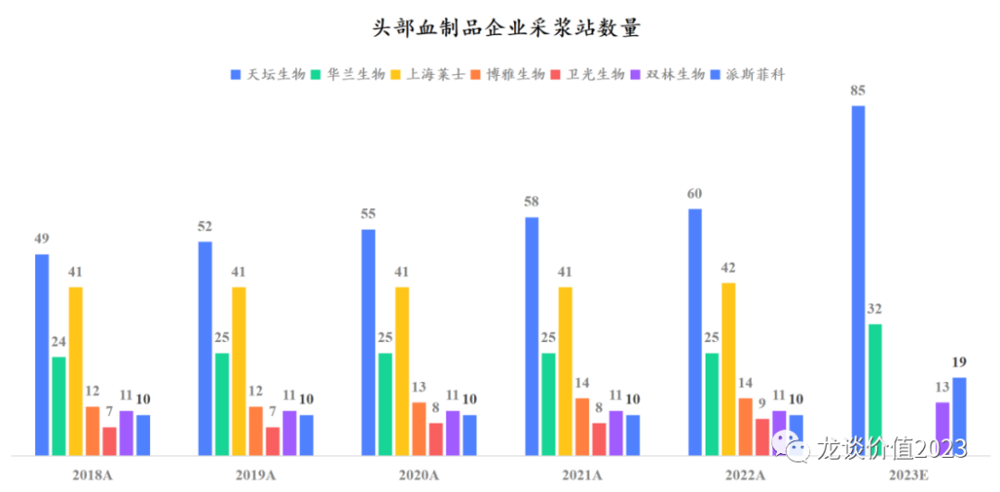
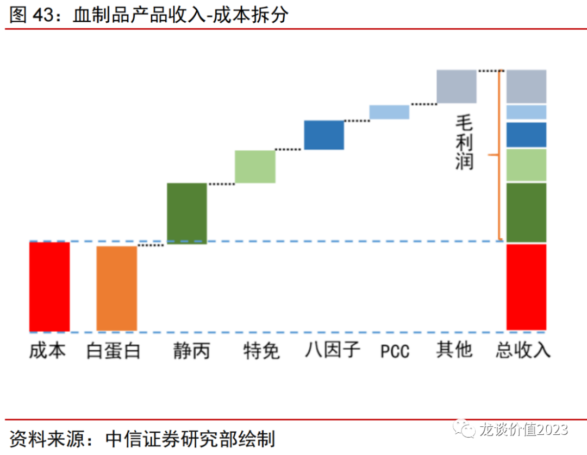
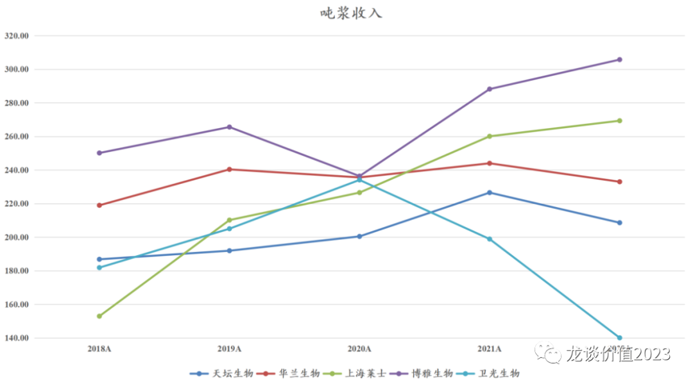

# 行业性拐点已至

今天来谈一下血制品行业的观点，背景是行业浆站资源扩张和行业整合逻辑进入加速兑现期，从而使得大家将会在未来两年看到行业龙头公司业绩明显提速。

***01***

**浆站扩张**

单个浆站的采浆量一般会有上限，除个别区位因素和运营效率非常高的浆站外大多数单采血浆站的采浆量也就是在30-40吨，比较好的可以做到50吨，有个别极端的情况可以做到100吨，但只是个例。因此相比于提升单个浆站的采浆效率，增加浆站是增加采浆量的主要驱动力。

但采浆站的扩张并不容易，2018-2022年这5年间国内头部血制品企业的采浆站数量几乎是停滞状态，而2023年开始进入快速扩张期：

注：①上图数据为截至每年底的实际在运营浆站数量，不包含在建浆站；②双林生物与派斯菲科已经合并为派林生物，为方便对比而单独列示；③2023年浆站数量为预测至2023年底的在运营浆站数量。

2023年开始情况将会有较大变化：

天坛生物：2018年浆站49家，过去几年每年增加2-3家，截至2022年底在运营浆站60家，贡献了2035吨的采浆量。截至2023年Q1其在运营浆站数量已经提升至70家，且在建浆站32家，合计102家浆站，且公司表示到2023年底这在建的32家浆站要达到接近验收的状态，其中6月还会有几家浆站开始运营，因此我们简单预计到年底可能会有80-90家浆站可以投入采浆，到2024年有望看到大部分在建浆站开始运营采浆，新建浆站投入采浆后需要2-3年时间爬坡，以此可以推算公司未来几年的采浆量规模，100多家浆站、单站采浆量30吨以上，也既在不考虑卫光生物的重组和其他并购重组的情况下，仅现有浆站可以贡献3000吨以上的浆量。

华兰生物：公司过去5年仅增加了1家浆站，但2022年在河南大本营新获准设置7家浆站，这些新建浆站将陆续在2023年投入使用，使得2023-2024年华兰生物的在运营浆站从25家增加到32家。华兰生物的采浆量今年一直稳定在1100吨左右，新浆站将带来公司采浆量上一个新台阶。

派林生物：广东双林目前在运营11家浆站+在建2家浆站，派斯菲科在运营10家浆站+在建9家浆站，另外还有新疆德源的6个浆站托管给派林生物，合计是27家在运营浆站+11家在建浆站，双林和派斯菲科的11家在建浆站也将在2023年逐渐投入使用，未来一两年派林生物的浆站数量也将增加至38家。

博雅生物：博雅生物近年采浆站数量从12个增加到14个，2022年采浆439吨，华润入主后对十四五的规划是30家浆站、1000吨采浆量，不过在新建浆站方面进度缓慢，目前不太好判断扩张节奏。

***02***

**行业整合**

浆站资源的扩张除了通过获准建设新浆站以外，还有就是行业并购整合，在当前没有新的血制品企业的情况下，原有血制品企业也进入并购整合期，这个领域由于本身具有很强的政府审批门槛、资源品属性和严格的监管要求，因此天生就是适合国企运营的行业。

在十三五以前的行业发展中，国有龙头企业的发展优势并不明显，上一轮行业扩张主要是以民营企业的扩张为主，其中虽然有稳健踏实的华兰生物等公司，但也有一系列资本运作导致的行业乱象，例如典型的上海\*\*、江西\*\*。

这一轮的行业扩张则是很明显的以国有企业为主，部分原有经营不善、无法续证的血制品企业/浆站也可以通过纳入国企的体系来盘活，因此我们可以看到去年以来天坛生物先收购了西安回天，今年国药中生又成立合资公司实际控股了深圳卫光，其他民营资本控制的血制品企业中，博雅生物的实控人由高特佳转变为华润医药，派林生物的实控人由浙民投转变为陕西省国资委。实际上十四五期间很多省份也都有新建浆站和本地血制品企业的需求，通过收购或盘活原有资产的方式可以一定程度上实现该目的。

***03***

**产品种类补充**

血制品生产成本中70%左右为原材料成本，主要是血浆采集成本，而血制品收入则是取决于企业能从血浆中提取出的血制品的种类以及收率：

从个产品可以贡献的收入来看，白蛋白和静丙合计可以贡献200万左右的吨浆收入，按照吨浆生产成本100万左右计算，企业只要实现白蛋白和静丙两个产品的生产销售，基本就可以实现50%左右的毛利率，也是所有血制品企业的基础品种。而特免（乙免、狂免、破免）、凝血八因子、PCC（凝血酶原复合物）、纤原等产品的差异则是会带来各家企业的吨浆收入和毛利率有较大差异，纤原过去大家认为是小品种，但实际上博雅生物依靠纤原贡献的100万的吨浆收入实现总体吨浆收入超过300万，在血制品行业遥遥领先，各家血制品企业也都提升了对该品种的关注度。

提取血制品种类的差异使得各家血制品企业的吨浆收入呈现较大差异：

注：以上吨浆收入计算是以当年血制品收入/当年采浆量，与实际情况略有差异，仅代表大致趋势，非实际情况，实际当年血制品收入大致取决于前一年后三个季度+当年第一个季度的采浆量。

除卫光生物外其他血制品企业的吨浆收入基本呈现稳中有升的趋势，随着时间推移，各家企业或多或少会有通过工艺改进提高收率或通过研发增加新产品种类。

天坛生物：2021年成都蓉生的血源凝血八因子获批上市，2022年成都蓉生的重组人凝血八因子、层析静丙、人纤维蛋白原和兰州血制的人凝血酶原复合物提交上市申请，目前还有成都蓉生的皮下注射人免疫球蛋白、静注巨细胞病毒人免疫球蛋白、新冠病毒免疫球蛋白、重组人凝血七因子以及上海血制的人纤维蛋白原在临床试验，另外有长效重组凝血八因子、重组凝血九因子等在临床前研究。血源凝血八因子、重组人凝血八因子、纤原、层析静丙等重要产品在近年陆续上市，将显著提升天坛生物的吨浆收入和吨浆利润。按照2021年天坛生物采浆量1809吨、2022年采浆2035吨、2022年血制品收入42.44亿元计算，天坛生物的吨浆收入在225万元左右，纤原满产可以贡献70-100万的吨浆收入，目前只有成都蓉生将在今年拿证，对总体的吨浆收入不会有那么大的贡献，也会是可观的一块增量，另外还有层析静丙、八因子、PCC等增量产品。预计重组人凝血八因子未来会替代血源八因子成为主流，天坛生物可能是国产第二家供应商，未来有望达到10亿以上销售额。

华兰生物：华兰生物包括其母公司和华兰重庆，部分小品种以前只在母公司生产、华兰重庆没有批件，2022年华兰重庆获得狂免、乙免的药品批件，2023年华兰重庆获得人凝血八因子、人凝血酶原复合物的药品批件。后续在研产品还有皮下注射人免疫球蛋白、高纯静丙、人血管性血友病因子以及华兰重庆的人纤维蛋白原等处于临床前研究。

***04***

**产能建设**

血制品产能建设资本开支大、审批严格。

天坛生物目前成都蓉生的永安血制1200吨产能已经投产，还有上海血制云南项目和兰州血制分别1200吨产能在建，加上原有的武汉血制500-600吨、贵州血制300吨、西安回天500吨，合计可以达到5000吨的产能。

华兰生物征地350亩新建华兰生物医药研发及智能化生产基地目前在规划中。

博雅生物规划的新建产能需要到2027年建成，建设周期非常长，后续几年会有些产能压力。

总体来看，行业性的新建单采血浆站增加是主要的业绩增长驱动力，且龙头企业具有非常强的获取新浆站、资本开支扩张产能的能力，新产品的推出则将拉动吨浆产出的提升，未来几年业绩提速的概率较高，在当前的经济环境下是难得的确定性。

*风险提示：本文仅讨论行业/公司经营情况，投资需综合考虑公司经营、估值、管理层等多方面因素，建议读者审慎参考，本文不作为投资依据，不建议大家根据本文做出投资计划。*

<!-- wxmp-comments-begin -->

---

## 留言（0 条，含回复共 0 条）

_暂无留言_

<!-- wxmp-comments-end -->
