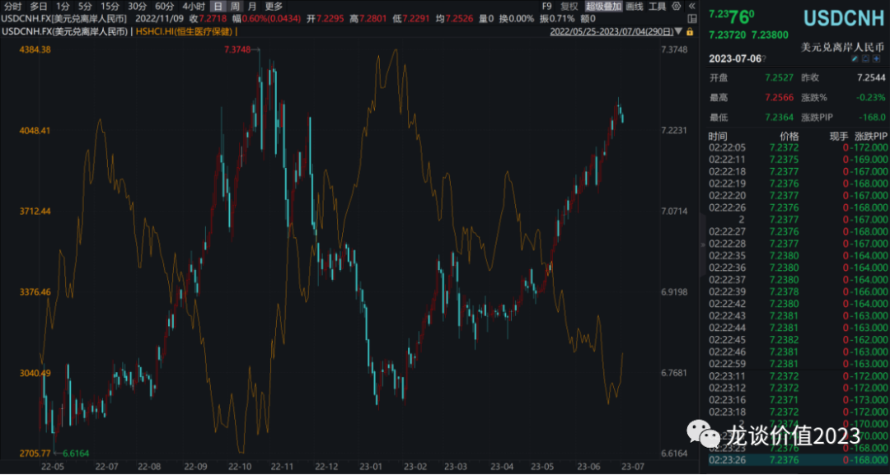
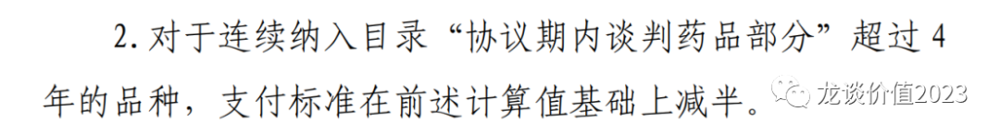
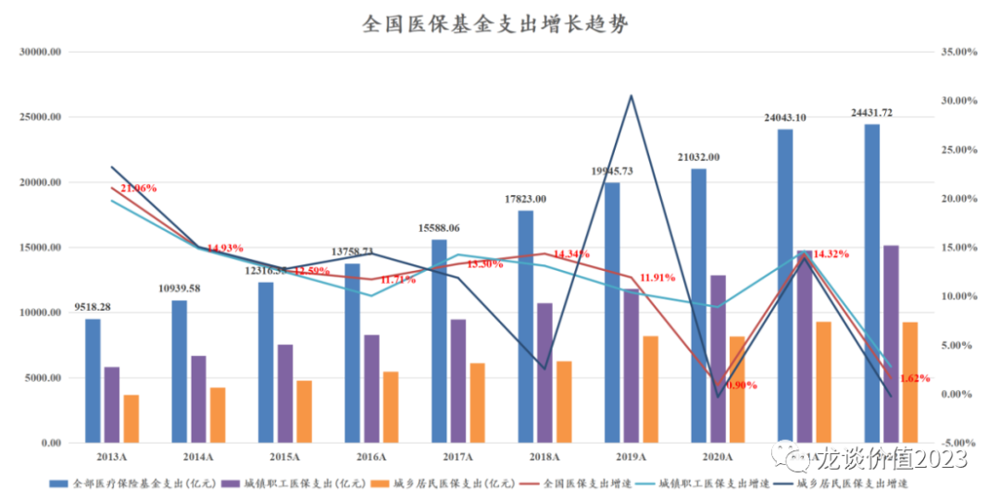
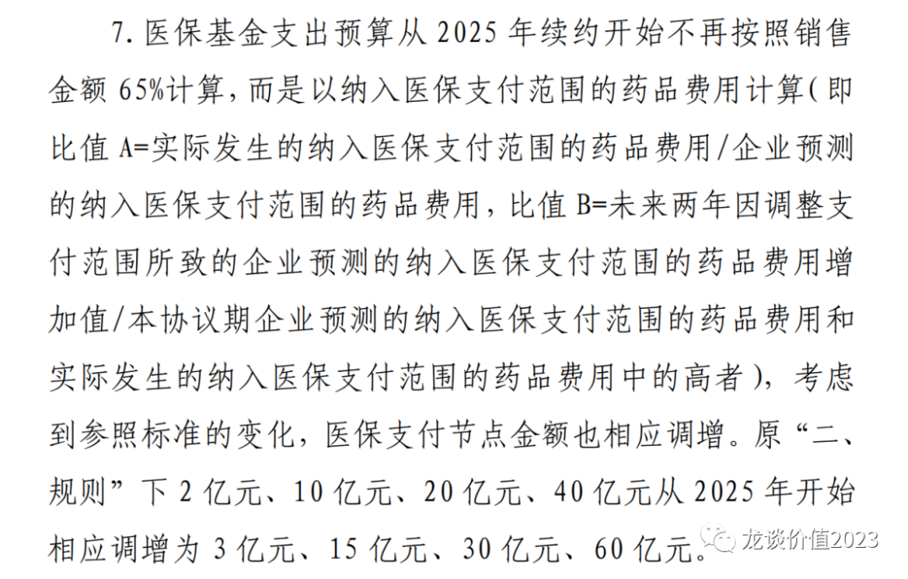
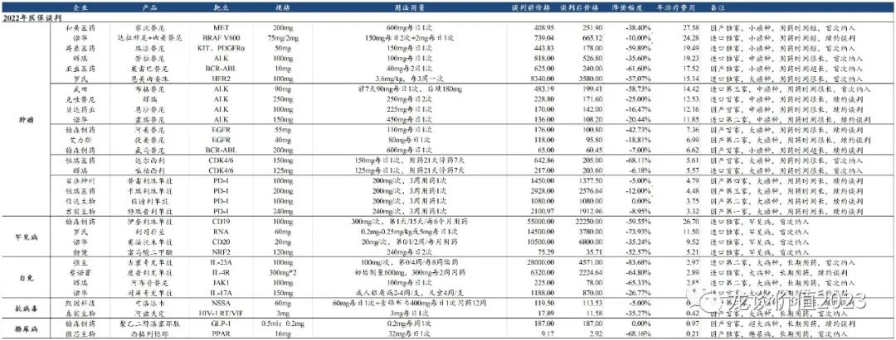

# 一年一度，重磅利好

大家好，我是龙哥。

每年630是个比较重要的时间点，对于新药/新适应症参加当年医保谈判的时间点就卡在630，也就是说每年的6月30日以前获批的产品都可以在当年参加医保谈判，而630之后获批的产品只能参加次年的医保谈判。由此我们也看到，近年的630之前基本都会有创新药的批量上市，药监局会在这个时间点前尽量把能批的新药批下来，以方便药企参加当年的医保谈判。

原本630之前应该是创新药行业比较好的催化剂集中落地的时间点，但我们看到近一年的创新药行业、尤其是公司质地明显更高的港股创新药行业，其股价涨跌的核心矛盾是美联储加息以及汇率，汇率的波动与恒生医疗保健指数乃至整个港股的走势呈现高度的相关性：

这也使得即使有诸多创新药产品密集获批，港股创新药标的的股价依然纹丝不动，直到今天有更大的消息——政策面的边际变化出现。

《谈判药品续约规则（2023 年版征求意见稿）》发布后，我们一伙买方的医药投资人马上进行了讨论，分歧也比较大，其中主要的分歧在于文件中的一段话：

这段话如果按表面意思来看，就是在参加医保谈判累计超过4年后的品种，医保支付的标准会在原本计算值基础上减半，换句话说就是医保支付价格减半，也就意味着可能要求产品本身价格减半，这是一个非常恐怖的鬼故事，如果在医保谈判经历了几轮降价后还要再腰斩，对行业的打击可想而知。

但从逻辑上来讲这种可能性非常小， 原因在于我们此前已经多次提到，医保局方面对于创新药的态度已经有明确的边际变化，去年医保局曾公开在官方公众号发文表述其支持创新的多种举措，医保局在今年又发文2022年对创新药的医保支出接近500亿，如果按照医保支付65%的比例计算大致就是770亿的规模，而2022年我国医药工业的产值超过2.6万亿，创新药占比不到3%，2022年我国医保支出2.44万亿，创新药占比仅有2%。

在这种背景下，医保局完全没有动力以比较极端的方式去打压国产创新药，尤其是在此前的医保谈判和集采已经导致我国创新药研发投入开始出现下滑，而行业十四五规划提出医药研发投入要实现10%以上的年化增长。

最终我们也通过与监管部门和企业端的沟通基本确定，以上对于支付标准减半的说法，指的是对于降价幅度减半，也就是说在基于续约文件中对于每次续约后降价幅度的要求之下，参加医保谈判满4年后（也既2轮谈判），降价压力会减半，实际上是比较符合当前对于创新药降价压力稍微放松的趋势的，政策面趋缓的趋势进一步明确，对于行业来说确实是不错的利好。

另外一点变化就是对于医保支付节点金额的调整，从原本的2亿、10亿、20亿、40亿到2025年调整为3亿、15亿、30亿、60亿，这种调整基于的原则是，过去的药品费用计算的是医保支付的金额，而2025年后调整的金额是药品实际销售额，按照65%的医保支付比例计算，以上支付标准实际上没有发生大的变化。但此前多数人对于原本的2亿/10亿/20亿/40亿的金额的认知也是药品实际销售额，所以这项调整实际上也是超预期的。

今年的医保谈判续约文件中最主要的变化就是以上两点，都是偏温和、偏利好的。但对于行业的投资，还是要多强调一些，我们过去梳理的国内医保谈判结果来看，降价幅度也好、创新药总体定价中枢也好，主要影响因素还是竞争格局和患者基数，对于竞争格局差、患者基数大的药物的价格必然会被压到很低，对于竞争格局好、患者基数大的药物在首次纳入医保的价格也会降到一个医保基金相对能接受的、不那么高的价格，对于竞争格局好、患者基数小的药物有可能会谈出一个很好的价格。

还是以2022年医保谈判的部分品种为例，可以看到能谈到年用药费用15万以上的（2倍人均GDP以上）都是同靶点独家品种，而能谈到1-2倍人均GDP的品种基本也是同类竞争者不超过3家、或者进口产品，有3家竞争、患者群体非常大的品种会更明显的被压价。

因此我认为，医保谈判的大趋势实际上已经基本明确，一些具体规则还在逐渐修正的更加科学和合理，对于创新药的降价趋势，可预测性也在提升。

创新药价格体系和峰值预测最大的影响因素依然是竞争格局，目前来看情况也在发生变化，过去对于me too产品无限批准的情况可能会逐渐收紧，今年以来我们已经看到包括PD-1和三代EGFR等热门靶点出现后排公司被拒或申报困难的情况，行业的出清可能已经接近。

*风险提示：本文仅讨论行业/公司经营情况，投资需综合考虑公司经营、估值、管理层等多方面因素，建议读者审慎参考，本文不作为投资依据，不建议大家根据本文做出投资计划。*
