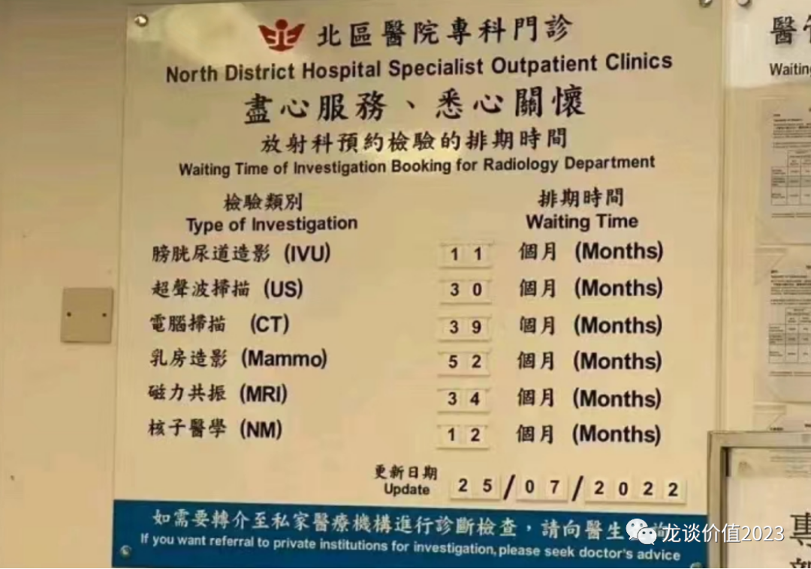
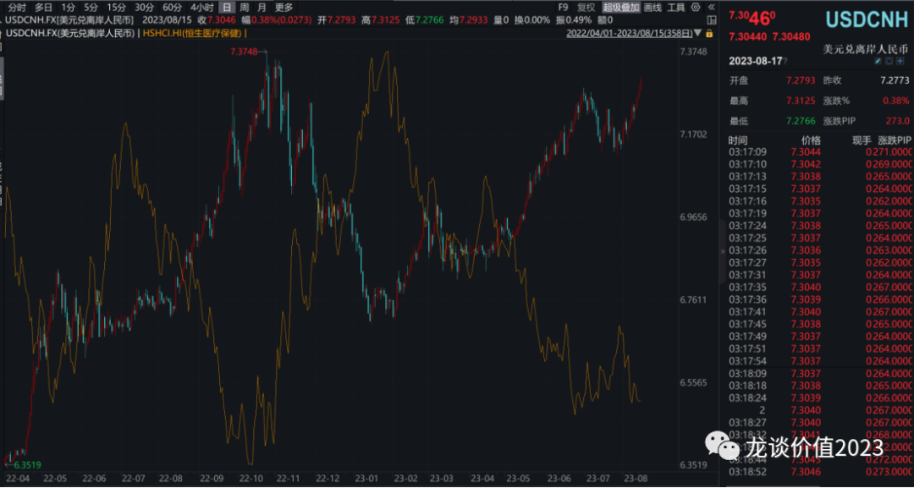
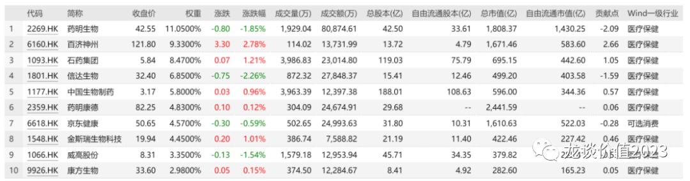

# 行业底部的黑天鹅

最近对于ff的市场关注度很高，对医药行业的影响确实很大，理论上确实有必要来分析看看对行业的影响，但此前半个月一直没发文，因此也有不少读者朋友在后台问。

这个问题实际上很简单，就是在这件事情刚开始演绎的时候，市场上大多数人都是基于短期看到的一些个例进行线性外推，对于未来事件的演绎和可能带来的结果，实际上是很难做预判的，这也是为什么很多jjjl在第一时间选择砍仓医药的持仓以应对这种不确定性。

那么站在当前时点，我们依然不能说已经可以看清这件事情的全貌，但至少有些话已经可以出来和大家聊聊。

***01***

**给医生尊重与理解**

我把这条放在所有内容最前面，因为在投资以外，医疗行为本身就是一直在我们身边，引发医患之间的对立对于我们老百姓来说百害而无一利，ff有其道理，但不代表老百姓就要敌视、丑化医生。

①大多普通医生的收入并不高：一位医生朋友（上海头部大三甲的外科副主任）给我发了他的工资单，不考虑奖金的话，月收入1万，到手2000出头，据说他们科室主任到手3000块。奖金怎么来？只能起早贪黑的做手术。上海，头部大三甲，科室主任/副主任，到手2000-3000，各位能理解吗？

医生收入那么低、怎么我看病还那么贵？这是正常人都会有的疑惑。

首先，对于大医院里某些做植介入类手术的科室，主任年收入千万也并不难，手底下的医生（没错就是给你亲自接门诊、做手术的医生）哼哧哼哧的干活，赚着白菜的钱，操着\*\*的心，换谁谁不崩溃？但不行，患者还得要求他们讲求服务意识，态度要好、技术要好、费用要低。抱歉，咱们矛头都指错了。

②劝人学医、天打雷劈：这句话好经典，学医的不学医的都知道，本硕博10多年的寒窗苦读+N年的实习规培，博士头衔光鲜亮丽，挂号费5元谢谢惠顾，不过好在一线城市普通号现在25块，毕竟小区门口理发店中专的剪发师剪个寸头都要20-30块了。

如果你觉得医生都是吸金利器，那逻辑就很简单，你愿不愿意让你的孩子学医？愿不愿意在支持他在18岁考上大学后、再支持本硕博8-10年的学业、再支持毕业后N年的收入微薄，以及日常的生活不规律、夜不归宿（夜班、紧急手术），日常的吃射线、肿瘤高发（血管介入、放射科），日常的被院长主任、被监管、被患者及家属骂成狗。

③不要再等到供需严重失衡时再转向：人口老龄化现在人人都知道，人口老龄化带来医疗需求增加也人人都知道，但需求增加的不仅是药械，还有医护。但现在的ZC环境、舆论环境对医护是何种态度，大家也都清楚，如果出现供给减少、需求持续扩张，最终吃亏的是广大老百姓。当身处下图所示的环境里，才能体会当前中国医疗的高效与普惠。

***02***

**医药投资判断**

回到咱们的正题，这种ZC环境下的医药投资怎么做？简单来说就是“行业底部的黑天鹅”。

2021年6月25日（恒生医疗保健指数最高点）到2023年7月28日（j委j委发文关于医疗ff），恒生医疗累计跌幅60%，最大跌幅67%，均创历史新高，在一轮新冠疫情的泡沫退潮后的跌幅，让人胆战心惊，但也意味着新的机会的孕育。

**（1）长期不悲观，但需关注结构分化**

在这个环境下，再出ff的消息导致行业扰动，谈不上很乐观，但也绝不应该在这个时候把行业一棍子打死的悲观。

复盘来看，医疗ff不是第一次，2006年和2013年分别进行过两次影响力较大的医疗ff，但两轮ff的市场背景都是全市场大牛市的起点，我们在当前时间点无法对全市场行情做判断，因此不能去说是否会复制当年那种表现。

但复盘06年，反商业贿赂对行业增长短期的确有所扰动，但也的确不影响长期合理需求的爆发，且确实带来了行业向正确的方向发展。

复盘06年各子行业在ff、降价、监管趋严、审批放缓等因素下业绩的影响趋势，从二级市场表现看，医药板块2006年涨幅位列28个申万一级行业的23名，2006年全部A股涨幅118%，医药板块涨幅67%，确实是明显跑输大盘。但从各个子行业来看，中成药、原料药的收入端增速明显大幅下台阶，从30%左右降到5%-10%，化学制剂、生物制品从15%上到25%-35%增速，中药饮片从-20%上到+40%左右，医疗器械行业增速基本稳定。当时基数低、但更符合产业趋势的专科化药、生物制品、医疗器械等许多都是长牛的起点，最有代表性的是大家熟知的恒瑞医药，01-06年经历5年多的震荡后，06年正式启动百倍牛股的征程。

站在当前时点，同样是要寻找在这轮产业变革中可以受益的子领域与公司。

**创新药是整个医药产业里难得的有增量的子领域，且具有最强的出海逻辑，也已经有多个产品验证全球竞争力（泽布替尼、CARVYKTI、呋喹替尼），诸多新兴技术领域的国际授权来自国内biotech。与此同时，GLP-1系列药物掀起降糖、减重、心血管获益、NASH非酒精性脂肪肝、阿尔兹海默症、降尿酸等众多超大疾病领域的突破。**

全球创新药行业处于融资底部、技术集中突破的黎明，很多人过去几年投CXO行业的思维定式认为融资是创新药行业产业周期的最大驱动因素，实际上技术创新永远是创新药的最大驱动因素，国内自2018年的港股18A以来呈现的资本驱动，也将逐渐回归到技术驱动的正途。

投资创新药无非还是两条路，要么投资波动大、潜在回报率更高的个股，要么投资ETF，但不论个股还是ETF，标的和方向的选择都至关重要。

**方向上，对创新药的投资我始终认为港股优先于A股****，**港股受流动性、汇率影响很大，过去半年多一直是很大的宏观负面因素，恒生医疗保健指数与汇率高度负相关，但可以看到，即便是在ff的影响下，在汇率创新低的时候，恒生医疗指数还未创新低，或许本身就意味着持续影响一年半的宏观因素也已经是强弩之末，影响可能在钝化，而每次短期的边际转向也都会带来股价的剧烈表现。

标的上，在当前ff+宏观的不确定性之下，ETF的投资体验可能会阶段性的好于个股，对于已经跌了60%以上的恒生医疗指数，这个时间段很难熬，但能长期赚钱的投资，难道不都是在很逆人性的时候下的注？

比较典型的标的像**159892****恒生医药ETF**，场外的有**016970华夏恒生香港上市生物科技联接A**；其跟踪指数（恒生香港上巿生物科技指数）的主要持仓基本全面覆盖了国内最优秀的一批biotech/biopharma。

个股层面的投资也一直坚持原有的观点，国内创新药投资选股无非就是两个思路，一个是典型的大单品逻辑，例如GLP-1系列是可预期的未来5-10年最大的大单品，是一定不容错过的重点领域，再例如自免领域是可预期的未来会出现诸多大单品的领域，还有抗肿瘤、眼科等领域。另一个是创新药国际化逻辑，经常有投资人比喻摸着日本药企的石头过河，日本药企国际化的成功让人印象深刻，国内创新药出海也已经初具规模和亮点。

**对于我们的“老朋友们”这里也做个简单更新（市值排序）：**

**①恒瑞医药：**TSLP单抗海外授权，交易对价是2150万美元首付款+350万美元短期里程碑付款+10.25亿美元研发及销售里程碑付款+销售分成，恒瑞自年初2月份授权SHR2554（EZH2抑制剂）后今年第二笔海外授权，后续还有多款产品的BD授权在谈。恒瑞的国际化转变思路，license授权的方式更高效、快速回笼部分资金、降低ZZ风险。**国内大单品**，ADC平台优势较强，SHR-A1811有望与DS-8201成为国内HER2-ADC双雄，GLP-1单靶、小分子、双靶布局最为全面。

**②信达生物：**2023Q2产品收入约14亿+35%，PD-1恢复高增长。**国内大单品**，国产第一的GLP-1双靶（降糖减重效果好，开了NASH、降尿酸等适应症），国产第一的LAG-3、IL-23p19、VEGF/CR1眼科双抗、IGF-1R、PCSK9。

**③金斯瑞生物科技：****创新药国际化**，传奇生物BCMA-CART在2023Q2销售1.17亿美元同比增长487.5%、环比增长62.5%超预期，全年预计实现1000人份、约4.6亿美元销售，创新药海外授权之光。

**④科伦药业：**科伦博泰Trop2-ADC二线三阴乳腺癌的国内III期临床达到终点。**创新药国际化**，下半年默沙东将启动多个Trop2-ADC+帕博利珠单抗（IO+ADC）的全球多中心III期临床，是下一个创新药海外授权之光的候选人。

**⑤康方生物：国内大单品+创新药国际化**，AK104国内首款PD-1/CTLA-4双抗高速放量，AK112国内首款PD-1/VEGF双抗在前几天刚刚申报NDA，AK112以50亿美元的总交易对价位列国内创新药license out之巅。下半年还将有AK101（IL-23/12）申报上市，以及IL-4R启动III期临床，AK104读出一线胃癌、一线宫颈癌数据。

**⑥再鼎医药：国内大单品**，FcRn赶在630之前获批上市可以参加今年的医保谈判，是自免领域下一个顶级大单品，Argenx靠这一款产品价值300亿美元。再鼎也是为数不多搭建起高效率商业化体系的biotech之一，预计未来5-8年有十几款创新药商业化。

**⑦和黄医药：创新药国际化**，呋喹替尼三线结直肠癌美国FDA的PDUFA日期为2023年11月30日，有望成为下一个经过全球多中心III期验证而获批上市的创新药国际化标杆产品。

**⑧康诺亚：国内大单品**，IL-4R虽然因需要更多安全性数据把申报上市时间延后半年，但不影响其竞争格局和IL-4R作为自免大单品的逻辑，CDE审批收紧可能导致IL-4R最终竞争格局好于大家的预期，但还需观察其商业化团队的稳定性。

**⑨亚盛医药：创新药国际化**，Bcl-2+BTKi用于一线SLL/CLL的国际多中心III期临床已经获得FDA批准，亚盛自身的资金实力恐怕难以承担这样一个投入大、时间久的大临床，license授权或许已经不远。

**（2）短期战术上客观重视ff的阶段性影响**

市场普遍认为ff对行业短空长多，长期的“多”到什么程度没人说得清，但短期的“空”到什么程度确实在逐渐显现，最直接的影响会体现在多个方面：

①设备招标大幅放缓或延后，我们已经在部分设备的招标数据上看到边际变化，8月以来的招标同比大幅下降。

②创新药新品进院、推广延后，学术会议和科室会全面暂停，很多企业的销售放假或集中做合规培训。

③利益品种压力较大，尤其是辅助用药和部分竞品集采降价后的替代品种，例如某些伪创新的me too新药，竞品集采后反而可以高速放量，核心原因不是其产品力优势，而是其“投费用能力”的优势。

④可延期手术、可选手术的延期或干脆不做，高耗短期用量下滑。

⑤各地内部举报和内部文件频繁传出，行业从消息舆论到部分企业被“点名”都在持续有影响。

**以上影响，有些是短期影响，且会直接体现在今年三四季度的业绩上，很多公司短期1-2个季度的业绩会有明显的波动和miss。有些会形成长期趋势，再次倒逼部分企业做出转变。当然，最终对行业的影响可能不仅限于此，还需继续跟踪观察。**

*风险提示：本文仅讨论行业/公司经营情况，投资需综合考虑公司经营、估值、管理层等多方面因素，建议读者审慎参考，本文不作为投资依据，不建议大家根据本文做出投资计划。*

‍
