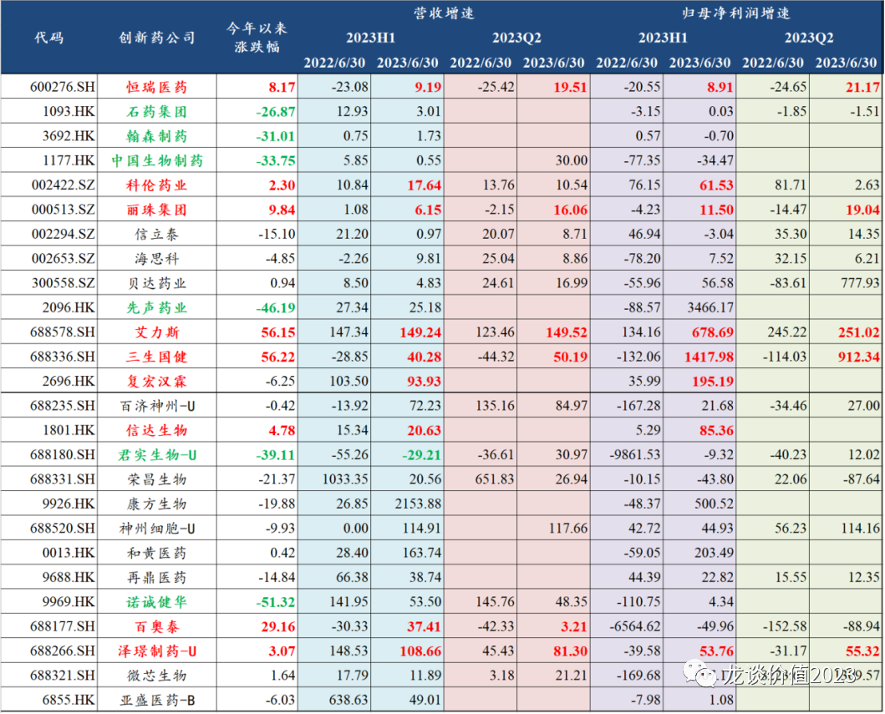
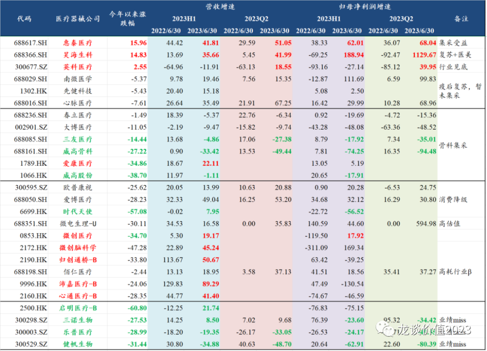
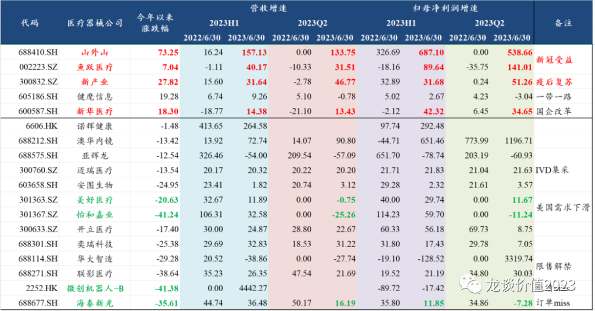
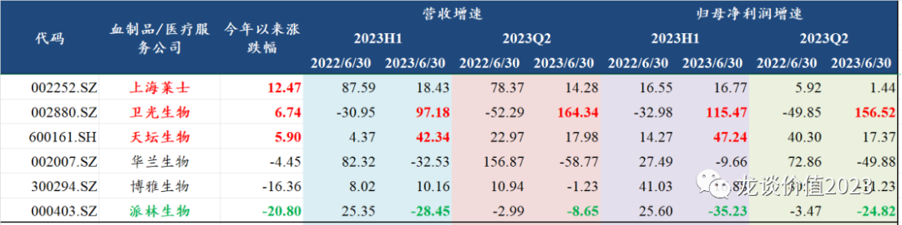
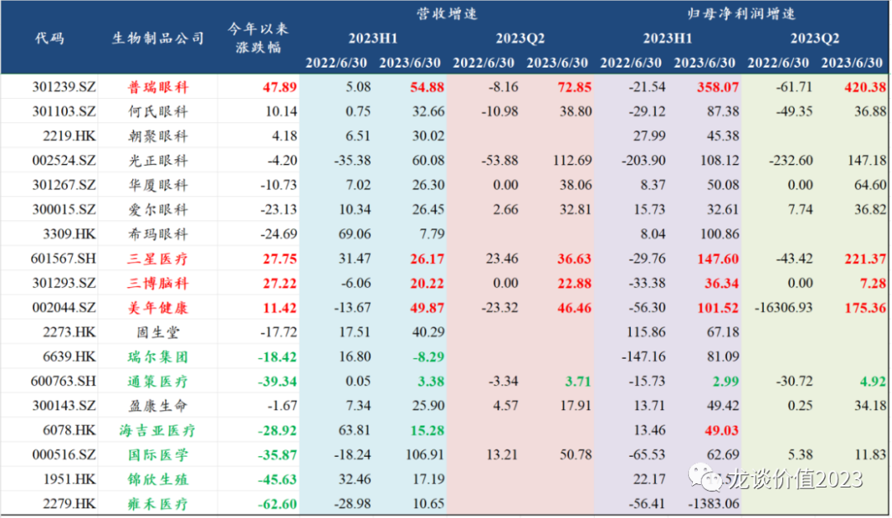
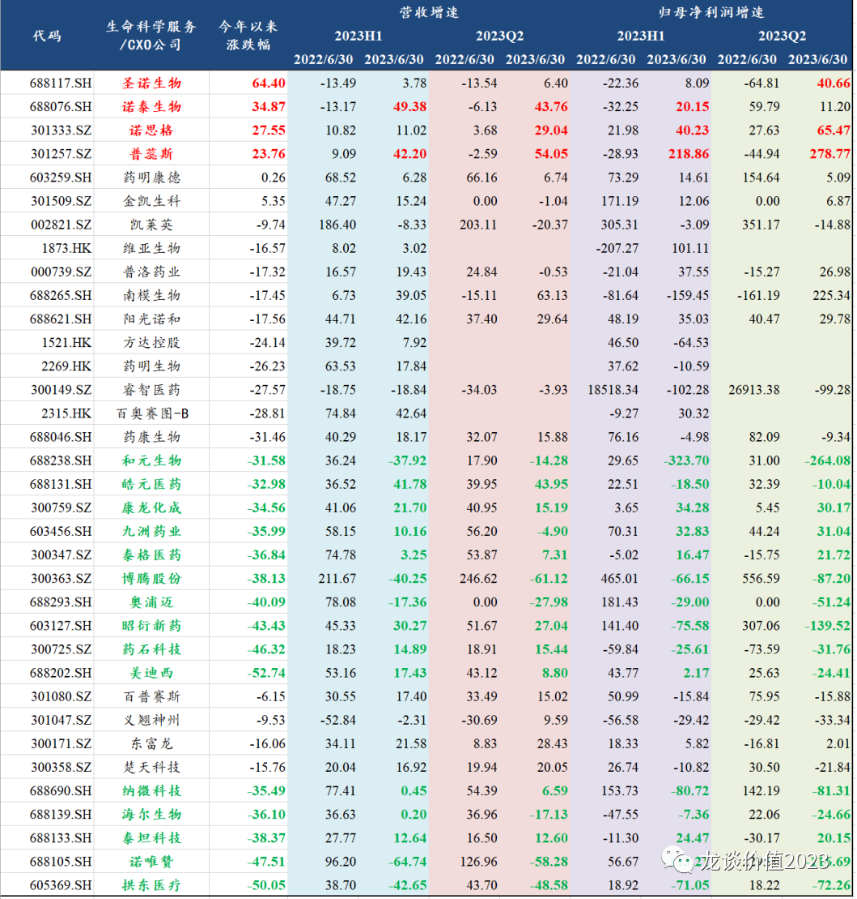
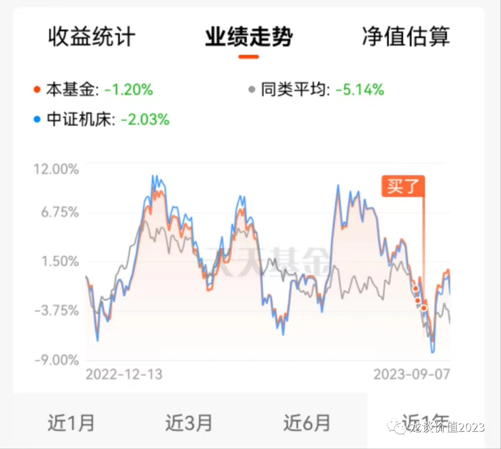
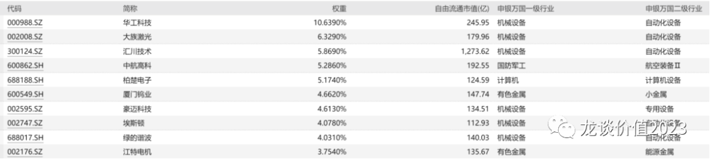
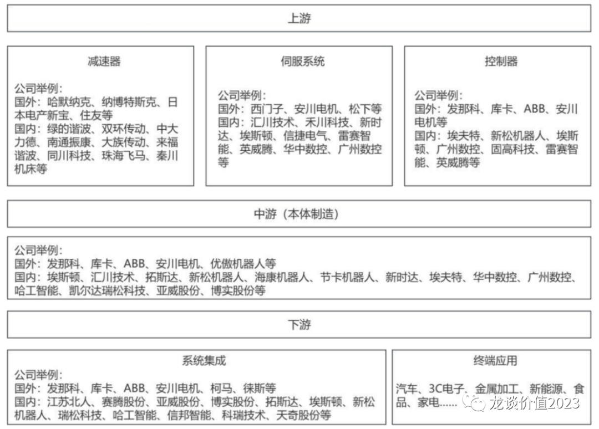

# 半年度总结，新方向

大家好，我是龙哥。

半年报披露完毕，有一些可圈可点的地方，最近也在学习一些医药和医药以外的新方向，和大家聊一聊。

***01***

**医药半年报总结**

总结医药的半年报，可以归纳为以下关键词：

Ø创新药放量+降本控费提效，收入、利润双改善

Ø常规诊疗复苏（高值耗材、常规诊疗用药、医疗服务），Q2收入利润同比环比高增长

Ø新冠受益高增长（药店、中药、医疗设备）、Q4开始将面临连续3个季度的高基数

Ø消费医疗普遍降级（眼科、齿科），但医美新产品爆发力很强（华东少女针、昊海海魅）

Ø生物制药产业链上游景气度下滑直接反映在订单和业绩（CXO、生命科学上游）

具体行业来看：

**（1）创新药行业**

总体呈现PD-1后第二阶段的创新药高速放量期，但各家商业化能力、执行力与产品本身都有差异，很难一概而论。具体而言：

①对于产品进入商业化阶段的创新药企业，业绩与股价高度相关，也既今年行业估值并未有所提升，核心是业绩驱动。

②PD-1头部三家都有新的增长点，重回升势，本质上是执行力、创新研发能力的体现，且三家公司均为行业最典型的“降本控费提效”，全行业呈现裁员、精简/集中管线。PD-1时代的粗犷式发展结束。

③恒瑞之外的头部几家传统药企，尤其是过去“抵抗集采”的公司，创新药转型滞后，阶段性大品种驱动的业绩增长开始乏力，亟待新品种的商业化兑现。

④生物类似药的两家从业绩到股价均表现较好，biosimilar的国内快速放量+国际化逻辑超预期。

⑤诺诚健华（出海预期砍掉）、先声药业（新冠药商业化低于预期）、君实生物（新冠药商业化低于预期）跌幅较大；百济神州产品高速放量但股价滞涨，TIGIT失利，后续需要新的大品种承接。

⑥销售大超预期的典型α是艾力斯（三代EGFR）。

**（2）高值耗材行业**

医疗耗材行业（A股）年初以来-18.4%（仅次于CXO和药店），如考虑港股，则跌幅还要远大于此。与年初基于疫后复苏和政策出清的判断，业绩方面基本契合，但股价有巨大偏离。原因来看：

①集采并未出清，高耗的政策环境与创新药大有不同，创新器械界定、创新器械支付方式均尚未清晰。

②神经介入与TAVR行业呈现业绩高增长、股价大幅下跌，业绩涨的是渗透率提升、国产替代率提升、疫后复苏，股价跌的是竞争格局恶化与港股环境/高耗政策环境。

③始终不看好的骨科，仍在受集采冲击，但集采影响真正出清的第一家公司——爱康医疗，有望在今明年重回30%增长中枢。

④微创医疗除以上宏观流动性/港股与政策面因素外，还有公司治理因素——基于行业疫后复苏和几块新业务高增长而看好，但公司治理带来负的α。

**（3）医疗设备行业**

医疗设备指数年初以来-13%，与中证医药基本持平。设备各子行业情况差异巨大，均需要个例讨论。

①业绩表现较好的主要是常规诊疗相关的IVD（非新冠受益标的）、新冠受益的部分设备（ICU血透设备、呼吸机/制氧机）、以及国企改革。

②诺辉健康与澳华内镜今年收入大幅增长，但股价相对滞涨，市场有一些担忧，要在更长的时间里验证业绩持续性。

③怡和嘉业与美好医疗因美国Q2开始需求下滑而出现业绩断崖，美国去年需求端的高增核心是飞利浦召回后空出的市场，今年需求开始下滑。

④开立医疗是业绩表现依然优秀，但去年涨幅较多，消化估值+医疗ff短期影响为主，基本面无本质变化。

**（4）血液制品行业**

疫情拉动静丙需求大幅提升，2022Q4-2023Q1业绩高基数，但天坛生物2023H1新增16个浆站至76个，2023Q2开始其他血制品品种开始高速放量，采浆量增加+新产品上市+产能增加+需求增加多重逻辑陆续兑现。

**（5）医疗服务行业**

类似高值耗材行业同样是常规诊疗复苏，业绩表现不如高值耗材，但政策环境明显好于高值耗材，总体股价表现远好于医疗服务，眼科医疗表现明显好于口腔，上市时间晚一些的小公司业绩和扩张弹性更大，其中普瑞眼科业绩弹性最大；海吉亚医疗2023H1收入增速15%低于预期，主要是没考虑到2022年有5个点的核酸检测收入，另外重庆和单县二期投入使用时间略晚，二者影响短期业绩增速，但不影响中长期逻辑。

**（6）生命科学上游/CXO**

上半年只有国内小临床CRO公司业绩边际加速，主要是疫后复苏、院内放开，逻辑类似常规诊疗相关药耗及医疗服务。圣诺、诺泰、药明、金凯、凯莱英等GLP-1产业链CDMO标的总体明显跑赢行业，业绩上还没有显著贡献，主要是主题投资为主。

Q2业绩已经是过去式，可以总结行业现状和趋势，但Q3由于医疗ff的存在，很多情况还要观察，短期业绩端、尤其是涉及到招标采购的医疗设备受影响最明显，部分可做可不做、可延期的手术也有推迟的迹象，部分新产品的入院同样不可避免的会推迟。

但正如上一篇文章所言，目前是《行业底部的黑天鹅》，行业已经连续3年下跌，除DRGs以外绝大多数的利空都已经反映在股价中，中长期把握产业趋势，在医疗ff的变革中，产品力强、执行力强的企业一样能走出来。短期则是要战术性重视医疗ff的影响，进一步拓展能力圈。

.......

***02***

**新方向**

大家知道医药已经跌了3年，龙哥对家庭资产投资的话语权每况日下，医药行业目前的情况就是这样，医药以外，为了提升龙哥的家庭地位，近期学习了一下龙嫂投的几个方向，和大家浅聊两句。

机床指数——持有的主要是50只业务涉及机床整机及其关键零部件制造和服务的公司，机床其实就是制造机器和机械的机器，是制造业最上游的设备、零部件。

这个板块的亮点就在于高端制造的beta，他的下游大部分都是偏中国高端制造的环节，比如重仓股华工科技，主要生产的光电器件、激光加工设备、敏感元器件。这些都是我国制造业转型升级的重要方向，其中不少标的都是机器人板块的上游。

机器人最近有个重大变化，也是带动最近整个指数往上的重要原因，拓普集团在今年中报中透露，公司研发的机器人直线执行器和旋转执行器，自2024年一季度开始进入量产爬坡阶段，初始订单为每周100台。本年度完成 4 套生产线的安装调试，形成年产 10 万台的一期产能，后续将年产能提升至百万台。

执行器是可以类比于新能源车中的动力电池，是人形机器人最核心、通用的部件，可以理解为人型机器人的关节部分，之前大家预期特斯拉人形机器人在2024年开始少量试产，2025年大规模量产，现在有可能提前到2024年一季度开始爬产，其进度和预计量产数量超出市场对产业发展预期。

机器人制造一方面和汽车产业链高度重叠，国内的汽车产业链可能受益；并且机器人的智能化是AI应用的终极形态，整体就是汽车高端制造+AI双向加成，这两块都是我国在寻求突围的方向，有可能是我国制造业升级的重大机会。

因此，机床指数一方面有高端制造机器人beta的正向催化，并且目前股价仍然从底部爬坡，在今天弱势行情下还能上涨1.26%，走出独立的行情，说明基本面的变化的确足够强劲。目前主要关注的是专门跟踪这个指数的**机床ETF（159663），场外联接A类（017573），场外联接C类（017574）。**

最后说一下，提升家庭地位是假，拓展能力圈是真，投资要不断的进化。

*风险提示：本文仅讨论行业/公司经营情况，投资需综合考虑公司经营、估值、管理层等多方面因素，建议读者审慎参考，本文不作为投资依据，不建议大家根据本文做出投资计划。*
