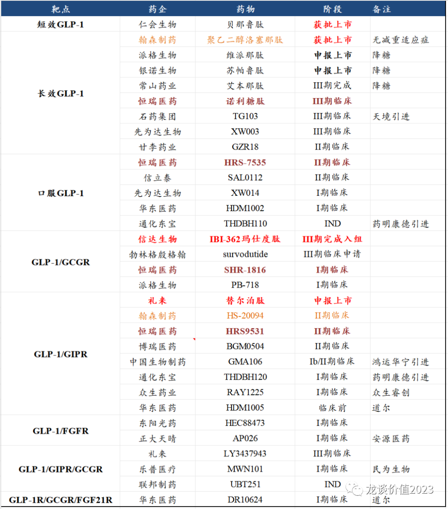
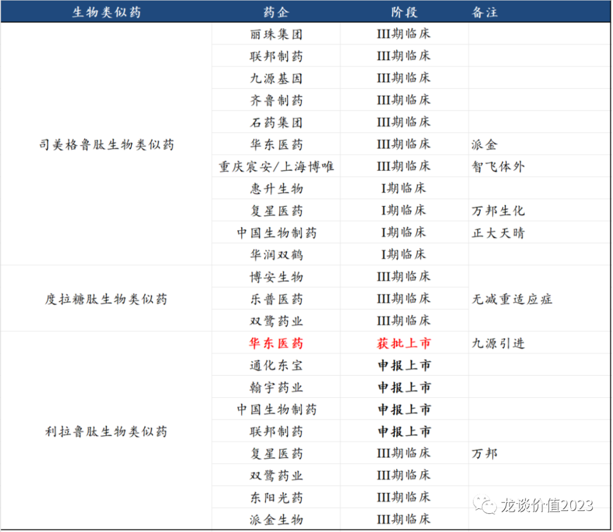
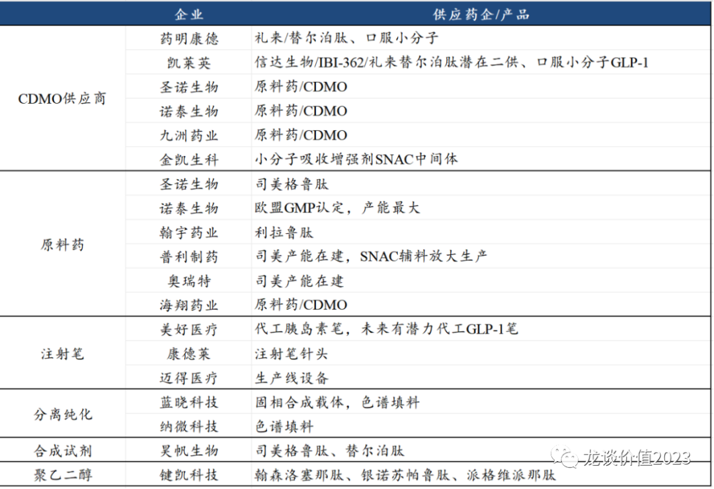

# 大起大落后的方向

大家好，我是龙哥，好久不见。

最近基本都在外面调研，医药行情大起大落，尤其是几乎已经人尽皆知的减重药，由于在前期分析创新药板块时已经多次提及减重药领域，在本轮主题炒作中并没有再刻意发文引导大家去追，但在这个炒作降温、大家可以理性看待的时候，可以再来聊一聊当下的医药行业和减肥药行业，虽然短期减重药大起大落，不妨碍我们对医药行业中期崛起的观点。

***01***

**减肥药故事很大，但也并不那么完美**

在讨论减肥药投资逻辑之前，要先提及一点，就是国内创新药的投资逻辑，创新药行业投资本质上是科技股投资，而国内的创新药投资在大多数情况下投的都是海外创新药的映射，也就是说在海外某创新药领域取得重大突破后国内相关产业链的跟随。

这种映射在最早的小分子靶向药、上一轮的PD-1为首的免疫治疗相关投资中都非常显著。但也是由于这种基于科技映射的投资模式，使得我们总是可以去复盘每一轮的投资过程和结果，实际上至少在医药领域，海外创新药映射到国内的商业化总是不尽如人意，而海外创新药的国内供应链基本可以明确获益。

那么着眼当下，我们有以下几个观点：

①GLP-1为代表的减重药板块截至上周五，主题炒作已经扩散到最最边缘的标的（乐普、泰恩康），蹭到点关系就能炒，所有卖方在周末全面开会大肆鼓吹减重药行情，在当前的存量市场上，所有出现这种特征后的板块主题炒作基本都是进入后期或尾声。此前我们判断炒到乐普可能就临近尾声，原因是乐普布局总是很慢的跟随，基本什么主题都能靠上、但都是最后才炒到，这次也没什么不同，乐普的股价已经快速跌回原点。

②GLP-1相关板块的炒作并非瞎炒，板块本身有产业逻辑，我们要感谢礼来/诺和诺德为首的海外GLP-1龙头企业对板块的拉动，让医药板块从3年前的疫情高光时刻、到2021年下半年以来连续2年多的下跌、再到现在重新回到大家关注范围内，让医药行业以外的投资人再次看到医药板块里也有很多结构性的、很炫的投资机会（当然，实际上内部结构性机会远不止于此），部分中长期看好的标的也因此带动了股价较大的涨幅，是今年比较艰难的医药行情里少数几个较大的板块性机会。

③GLP-1由于是代表医药里的中长期产业趋势之一的大药，预计相关的行情会反复演绎，今年Q4到明年国内外的催化剂还会比较多，国外的催化剂主要是礼来和诺和诺德11月初的三季报业绩会、年底到明年上半年新适应症的报产，国内的催化剂主要是信达生物IBI-362的II/III期临床数据披露和报产，有以上催化剂在，即使板块大部分纯主题炒作的标的可能难回新高，但真正能长期获益的标的，必然还是有机会持续走出来，就像PD-1单抗的研发哪怕是众所周知的卷王，也毕竟在国内诞生恒瑞、百济、信达、君实四家曾经的千亿市值药企，且帮助部分公司组建了强大的肿瘤药销售团队，而GLP-1虽然同样卷，一方面监管已经在收紧，不会再低门槛的批那么多同质化竞争的产品上来，另一方面GLP-1的减重等适应症更偏消费医疗属性，先发优势和品牌效应会更明显，因此，即便最终板块的兑现大概率依然不及海外那么炫，但仍是值得期待爆发的领域。

④GLP-1在多适应症上的卓越表现实际上会利空其他慢病药物，例如首先胰岛素、DPP-4和其他降糖药物都会被GLP-1部分替代，而除内分泌和减重以外，在消化科（NASH、降尿酸）、肾科（糖尿病肾病）、眼科（糖网）、心内科（心衰、降血脂）、神经科（阿尔兹海默症）、妇科（多囊卵巢综合征）、呼吸科（睡眠呼吸障碍综合征）等等，都会形成对相关产品的直接竞争或间接影响需求，不至于完全替代，但影响程度都不容小觑。

标的上，其他很多文章和小作文应该写的很多了，不多赘述，有问题我们可以留言单独讨论，只强调一点，国内基本只用看前三，海外供应链公司则是看具体所处环节和价值量（具体产业链公司价值量和弹性我们都有测算，感兴趣的投资人朋友可以私信交流讨论）。

***02***

**医药行业砥砺前行**

对于整体医药行业，我依然维持我今年以来的观点：对于A股医药行业，虽然回调幅度也不小，但总体估值并没有显著低估，更多是个别个股的机会；对于港股医药行业，回调幅度更大更极端，创新药和创新器械标的的总体质地又明显高于A股同行业标的，流动性和国际宏观因素对估值的压制已经充分反映，因此不论是精选biotech、押注部分头部pharma还是投指数，都是合适的。这里再和大家简单梳理下港股的情况，A股的个股标的则是会在下一篇文章中梳理。

①指数基金，还是一直给大家说的**159892恒生医药ETF**（场外投资者也可选**恒生医药ETF联接基金016970**）。

我个人一直倾向于港股也要精选股，像今年恒生医疗指数跌了25%，而我重仓港股的医药组合做到了持平左右，但港股波动之大、选股难度大是众所周知的，选错股票很容易亏百分之七八十，这是绝大多数投资人都完全无法接受的回撤幅度，因此在当前的位置分批定投指数基金并不失为好的策略。

②头部pharma，港股头部pharma有几家我们以前经常谈到的，翰森制药、中国生物制药和石药集团，其中石药集团预计会把他的创新药、生物类似药资产逐渐注入到A股平台新诺威中，港股石药集团投资价值进一步降低，我们则重点关注前两家，前两家也都是有一些边际变化的。

翰森制药是比较早转型创新药的pharma，收入体量相对小一些，但由于创新药转型最早，截至2023H1其创新药收入占比已经超过60%，预计2024年创新药收入占比将超过70%。公司账上有235亿现金、44亿有息负债，净现金接近200亿，且经营现金流始终非常充裕，在当前创新药一二级市场融资均非常艰难的情况下，充沛的现金和现金流，也给传统药企很多低价买优质产品管线的机会。另外翰森制药有首款国产长效GLP-1聚乙二醇洛塞那肽，在研的GLP-1/GIPR双靶激动剂在国内进展也是仅次于信达和恒瑞。

中国生物制药自2022年底以来，有地舒单抗、贝伐珠单抗、利妥昔单抗、曲妥珠单抗、重组人凝血八因子、长效升白（艾贝格司亭）等6款生物类似药/创新药获批，ALK、PD-L1、PI3K、帕妥珠单抗等5款创新药/生物类似药申报上市，理论上是自2018年安罗替尼后的又一轮新产品密集兑现期。此外中国生物制药宣布了10亿的回购，主要用于股权激励，但我也和公司沟通过，公司回应也会考虑回购股份部分注销，具体情况再看公司实际执行情况。

③biotech公司，对于个股更新不做太多赘述，可见我此前一篇文章《》，时隔2个月总体变化不大，一些小的边际变化，如在三季度的医疗ff后我们发现很多临床刚性用药企业的业绩稳定性非常强，虽也有受影响、但影响非常可控；再如强生披露的三季报显示传奇生物的BCMA-CART单三季度收入1.52亿美元，预期全年销售额也将从4.6亿美元上调至5亿美元；还有科伦博泰/默沙东的Trop2-ADC启动全球多中心III期临床，亚盛医药国内外启动BTK+Bcl-2联合疗法国际多中心III期临床，恒瑞医药再达成部分海外创新药授权等。

总体来看，我们对医药中长期并不悲观，医药在大类行业中的比较优势也并不差。今年的行情表现总体远不及年初的预期，这也是自疫情中医药的高光时刻后板块第三年的下跌，对信心的打击巨大，看着连创新低的大盘指数我也会很郁闷，人力无法对抗市场，只能通过自己的方式适应市场环境、活下去、等待下一轮基本面与估值的共振。

*风险提示：本文仅讨论行业/公司经营情况，投资需综合考虑公司经营、估值、管理层等多方面因素，建议读者审慎参考，本文不作为投资依据，不建议大家根据本文做出投资计划。*
