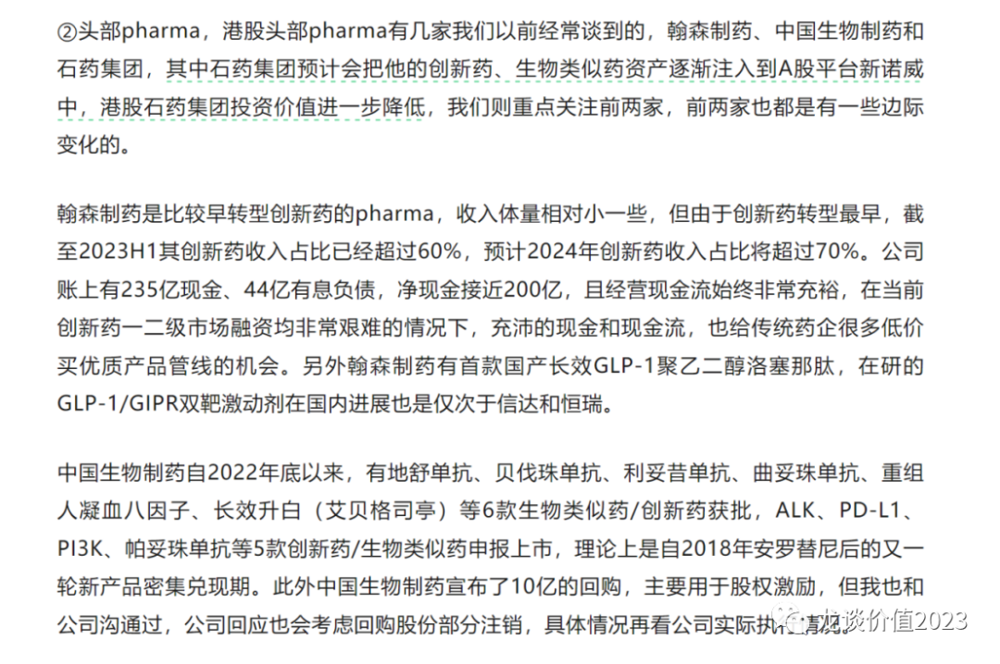
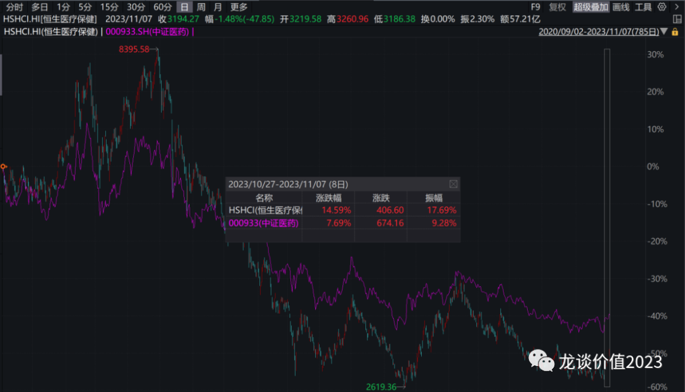
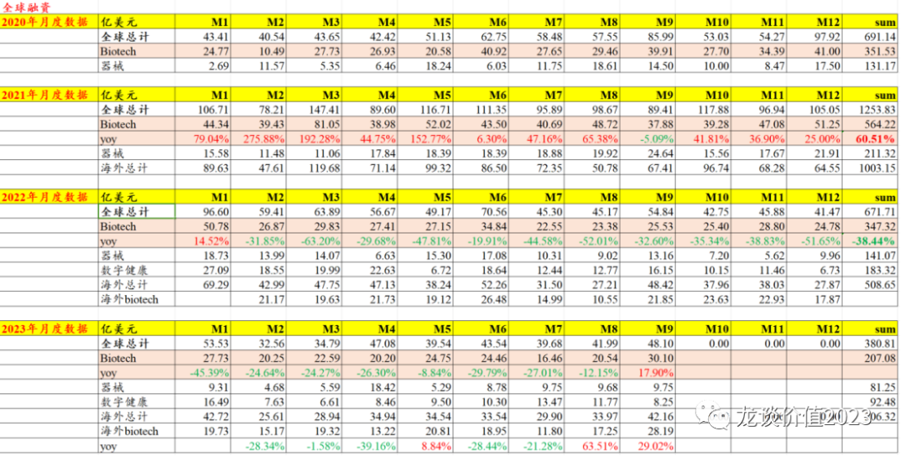
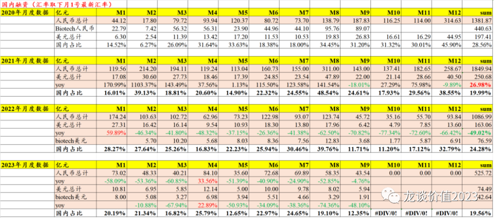
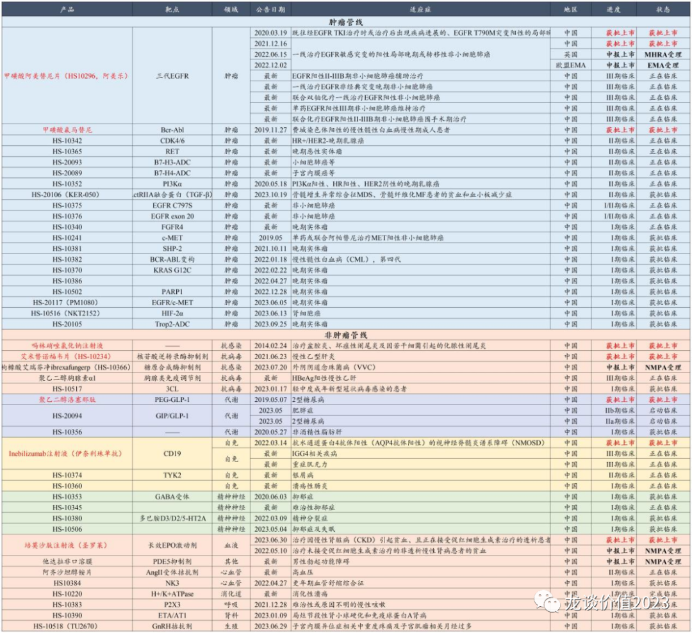

# 大象狂奔

大家好，我是龙哥。

在10月20日的文章里，我们特别提到两家传统药企——翰森制药和中国生物制药，两家公司在上周以来快速的涨超30%，是港股头部医药股里表现最亮眼的两家，除了当时简单更新的两家药企的情况，我们再来谈谈背后的逻辑。

***01***

**便宜是王道**

港股市场过去两年被吐槽最多的就是跌起来完全没有底，其实不是港股没有底，只是港股的底在流动性极其紧张的情况下确实非常极端，但我们一直说，判断市场的底部通常是靠常识，我们无法把握多数公司的底部，但很多违反常识的行为是比较容易判断的，比如某业绩50%增长、市值却跌到净现金的细分领域高耗公司，再比如今天聊的大药企。

对于业绩相对稳定的大药企来说，已经跌到有很不错的股息率水平的估值，在过去的市场环境里确实是想都不敢想的，港股确实给了这样的机会，而恰好公司又有一些边际向好的变化。

过去几篇文章我们反复强调恒生医药ETF（159892），同样是如此，港股医药虐我千百遍，我待港股如初恋，尊重常识，尊重所学所思所想，即便板块已经有一定反弹幅度，我们依然认为，港股大部分的创新药、高值耗材标的，无论在基本面质地还是估值都要远好于A股。

***02***

**融资环境依然紧张，现金为王**

由以上两个图可见，相比于海外创新药融资（上图）已经逐渐有企稳迹象，国内创新药融资（下图）仍然呈现非常大的压力。

过去我们说中国创新药的爆发“成也资本市场、败也资本市场”，国产创新药的爆发起点是港股18A和科创板第五套规则允许未盈利biotech上市开始，但随后各种低门槛的PPT公司的上市和一二级市场一起推高到严重泡沫化的高估值，使得创新药的二级投资环境被严重破坏，创新药研发10年不如资本攒一个局上市融资赚的多，限售股解禁就是马上清仓减持，终究成为反噬创新药行业的重要因素。

现在又走到了另一个极端，科创板对于未盈利生物科技公司融资的收紧、减持新规的出台、港股流动性问题导致的估值压缩等等问题，进一步影响了一二级市场创新药融资，其一是影响了已上市biotech公司的一级投资基金的退出，从而影响该部分一级资金的复投，其二是二级市场估值的压缩形成的一二级估值倒挂，进一步影响了一级市场投资热度。国内创新药一级市场投融资的寒冬尚未过去。

在当前的市场环境下，现金为王显得尤其重要，对于有充沛的在手现金、融资能力以及经营现金流的传统大药企而言，过去几年的发展虽然远不及一众biotech/biopharma靓丽，在当前时点，我们认为却是到了新的发展阶段。

过去一年时间我们看到越来越多的biotech公司将临床后期或即将商业化的产品的商业化权益授权给大药企，现阶段的biotech已经无力像第一代借助时代红利和资本市场发展起来的biotech那样组建庞大的产能和商业化团队，大药企在临床、注册、生产、商业化的全方位的优势开始被放大，正如我们过去对行业的判断，行业进一步的分工和分化已经到来，biotech更多承担早期研发的责任，大药企则要承担临床、注册、商业化的责任。

***03***

**研发管线价值重估**

以翰森制药的研发管线为例，其在肿瘤、免疫、代谢领域均已经搭建起了颇具竞争力的在研管线。

在肿瘤领域，目前全球肿瘤领域突破性进展最多的ADC药物，公司有3款在研产品进入临床阶段，包括2款国内第一、全球进度靠前的ADC产品，且近期还将其中一款ADC药物授权给了海外MNC；在公司比较具有优势的EGFR突变NSCLC领域则是进行了第四代EGFR、EGFR20外插、EGFR/c-MET双抗等靶点的布局。

在自免领域，公司在研的TYK2抑制剂国内领先，武田制药在去年12月曾以40亿美元首付款+20亿美元销售里程碑付款合计60亿美元的交易对价拿下一款银屑病IIb期临床成功的TYK2抑制剂，是近年全球自免领域最具潜力的新靶点之一，2024年该国内大药企也将启动TYK2抑制剂的III期临床。

在代谢领域，公司不但拥有国产首个获批上市的长效GLP-1激动剂，且其在研的GLP-1/GIPR双靶激动剂国内进度也是比较靠前，仅次于礼来和信达生物，与恒瑞医药进度并列，且预计也会在2024年启动III期临床。

过去市场对于大药企的现有产品线以较高的重视程度，却忽视了大药企已经快速崛起且开始大放异彩的在研创新药管线，而大药企也开始频频出现的license out授权，便是其早期在研管线开始变现的重要表现。

***04***

**慢病药商业化团队**

创新药行业近年最重要的四大产业性机会，第一是肿瘤ADC药物的突破，第二是GLP-1为代表性的减重药及多适应症的突破，第三是阿尔兹海默症药物的突破，第四是非酒精性脂肪肝药物的突破，每一个领域都是庞大的患者人群和未满足临床需求、巨大的市场空间。除此以外，在国内市场，自免领域也开始进入黄金爆发期。

而以上5个领域中，除肿瘤药以外，代谢、自免、中枢神经和NASH都是慢性病，长期用药黏性与一般的肿瘤药大有不同。

肿瘤药的销售最核心的是产品力，大多肿瘤患者的生存期和用药周期相对较短，无法形成长期的患者积累和持续用药，对于患者来说也难以形成品牌效应，过去几年快速成长为biopharma的几家biotech公司几乎都是依靠在某个新兴的肿瘤大品种领域快速突破而崛起，肿瘤药放量速度快是至关重要的前提条件。

而慢病药物除了产品力本身以外，对于品牌力、患者教育、渠道下沉都要极高的要求，这对于新兴的biotech来说是很大的挑战，尤其是想要建立基层销售团队更是难上加难，而传统药企普遍有成熟的慢病药推广团队，在下一阶段的多个治疗领域的竞争中，也会凸显其优势，我们看到即便是在肿瘤药领域前期销售做的非常好的biopharma也有意愿把慢病药管线的商业化对外合作。

......

前文提到的2家pharma只是此前在港股低估最明显、且有边际变化的两家，更多的pharma都在迎来积极的边际变化。

过去一年多投指数基金、尤其是恒生医疗的指数基金，最大的问题就是其指数基金的权重股包含大量的传统药企、CXO和互联网医疗，而这些公司普遍处于景气下行期，这就导致很多因看好部分港股创新药而配置恒生医疗ETF的投资人反而享受不到这些biotech的α，而站在当前时点，我们认为pharma的价值在提升，头部CXO因海外创新药融资的回暖也开始看到询单的恢复性增长，行业指数基金（**159892恒生医药ETF/恒生医药ETF联接基金016970**）应该回到大家的视野里了。

*风险提示：本文仅讨论行业/公司经营情况，投资需综合考虑公司经营、估值、管理层等多方面因素，建议读者审慎参考，本文不作为投资依据，不建议大家根据本文做出投资计划。*
