# 巨头盛会

大家好，我是龙哥。

昨天去参加了国内创新药领军企业恒瑞医药的研发日，和大家聊一聊，我先做个总结，后面附上部分图片和纪要。

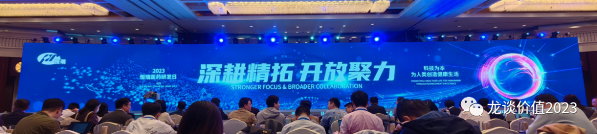

**1、重组合、轻产品**

总体来看今年的研发日相较此前的研发日来说，对管线的详细介绍少了一些，不再像此前的研发日那样对大量的分子和临床项目进行细致的分拆，如最核心的管线之一——A1811也只是简单介绍了开的几个临床和拿了4个突破性疗法认定，总体上市更加强调公司的战略和产品组合，当然，过去也很强调产品组合，只是现在更加强调“工具箱”的战略价值，下面这个图特别有代表性，恒瑞对于产品组合的可探索空间确实有独到优势。

**2、聚焦**

过去恒瑞强调8大疾病领域，而目前的恒瑞聚焦到肿瘤、代谢、自免/呼吸三大疾病领域，并在未来拓展神经领域，以上4大领域成为恒瑞最重要的领域。

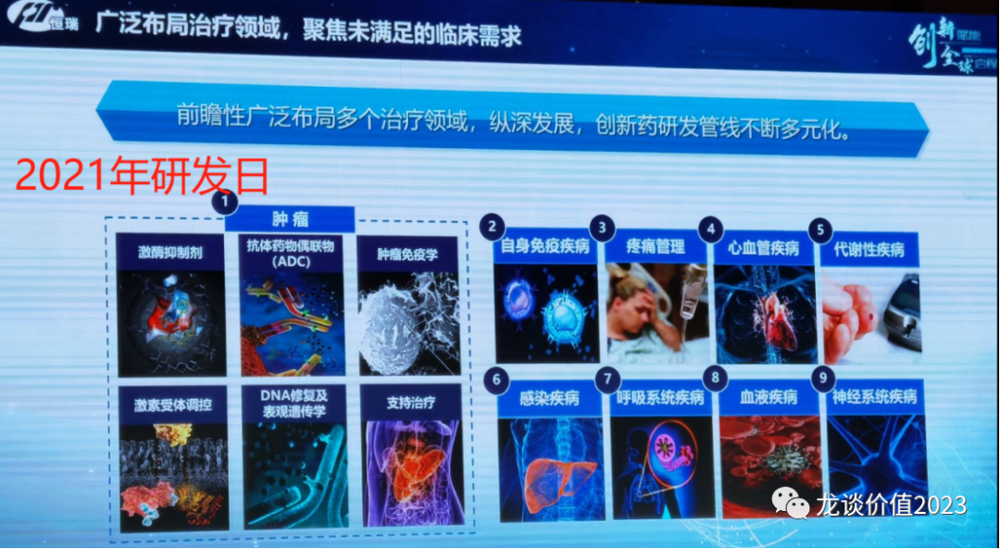

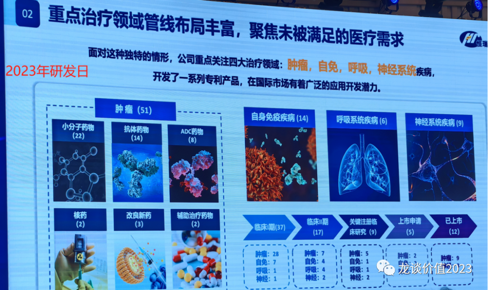

肿瘤还是公司最核心的管线，51款在研肿瘤药物，也再次强调了在乳腺癌领域的强大统治力——覆盖能想到的所有乳腺癌治疗领域；自免在研18款药物（10个大分子+8个小分子），代谢12款产品覆盖血糖管理和体重管理全靶点全解决方案——胰岛素（短效、长效、超长效）、SGLT-2、DPP-4、双复方、三复方、GLP-1注射剂、口服GLP-1、GLP-1/GIPR、GLP-1GCGR、胰岛素/GLP-1。

**3、BD**

恒瑞过去备受诟病的就是BD，license in的几个产品基本是不尽如人意的，缺少有亮点的大品种、且进展颇为不顺。BD总换了江宁军以后，今年恒瑞医药国际市场BD有巨大变化，2023年国际市场合作总金额超过40亿美元，“立足中国、放眼全球”。

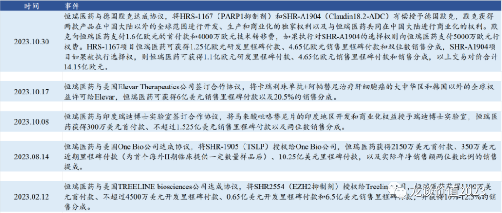

**4、临床试验**

目前有270+个临床试验在进行，2000+人的临床团队、500+临床试验经验积累，每月管理17000名患者；采用创新的临床设计——如JAK1抑制剂采用无缝II/III期临床设计使得临床时间缩短1年多。

2023年合计12个新药/新适应症（含改良新药）的NDA，2024-2025年还会有25个新药/新适应症获批，恒瑞医药新产品的密集爆发期。

**5、专家谈**

公司请的三位临床专家介绍肿瘤、自免、代谢三大领域，其中肿瘤领域尤其重点介绍恒瑞的PD-1+阿帕替尼一线肝癌的双艾组合的巨大突破，全球最领先的22个月的mOS、也给恒瑞积攒了国际多中心注册临床的经验。

代谢领域尤其介绍当前糖尿病的高发、与并发症的关系、肥胖用药如何改善并发症等，其中提到两点，第一是GLP-1停药一年后大概反弹2/3的已下降体重，因此需要长期用药；第二是体重反复涨跌也会影响预期寿命，目前没法服务于所有超重人群，只能优先服务有严重并发症的人群，其认为不应该允许减重药大规模滥用。

**总体来看，过去一年多，恒瑞医药精简了大量的管线，即便如此仍然有270多个临床项目，在产品和临床项目上都做了聚焦，重点领域从8个收窄到3-4个，核心是“深耕精拓”。而海外业务全面转变，从过去成立海外子公司的自主模式全面转向BD授权模式，认识到自己短中期内能力和资金的局限性，立足国内、放眼全球，BD快速回笼现金流，并获得国际MNC的战略合作。恒瑞以上的这种进步是值得肯定的，其在肿瘤、代谢、自免领域，已经在国内构建了绝对优势的管线。**

**部分纪要：**

**孙飘扬（公司战略布局）：**

疾病领域介绍：

重点布局中国特色癌种药物研发，延长中国病人五年生存率。如肝癌、胃癌、食管癌国内高发，再如肺癌国内主要是EGFR、海外主要是KRAS，另外国内肠癌近年增长较快、超过胃癌排在前三位；早筛、治疗、康复方面的差异使得国内肿瘤五年生存率40%远低于美日的66%。

代谢异常患者比例加速爬升，2030年糖尿病病人将达1.6亿人，中国肥胖率2025年翻倍至30%接近美国。我们的肥胖和海外不一样，海外的肥胖是全身胖，我们是肚子胖。血脂，脂蛋白国内外标准不同，是目前风险较大的因子，降低脂蛋白可以大大降低心血管风险；甘油三酯比海外高，是中国人特有的问题。

心肺领域疾病生活受限严重，需要疗法创新，国内吸烟人群的占比比美国高40%，加上前几年的空气污染问题，COPD发病率是美国的2倍，成人哮喘患者总数是美国的2倍。

老年退行性疾病，人口老龄化挑战，阿尔兹海默症国内65岁以上已经10%发病率（发病程度不同），900万患者，给家庭带来的负担很重；帕金森患者超过300万，每年新增10万，随着疾病进展越来越不好，也给家庭带来很重负担；膝骨关节炎患者超过1亿，每年新增超过300万；

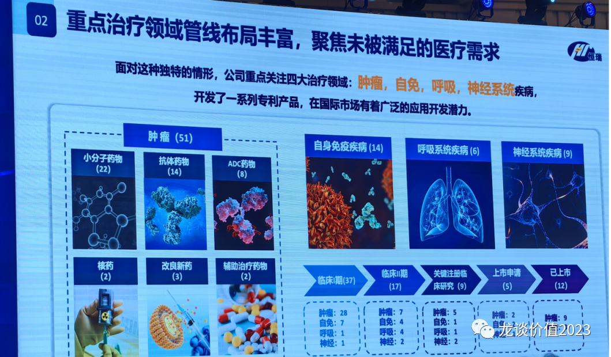

技术平台：

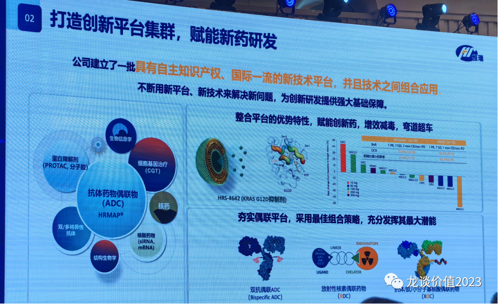

ADC药物要解决耐药的问题；核药第一个产品进临床后有不错表现，第二个产品也推向临床；随着技术平台不断扩大、能力不断提升，才能解决临床上不能解决的问题。

首先聚焦国内市场未满足的重大需求，我们已经有13个药上市；同时欢迎对外合作，寻找有全球化能力的公司合作，有临床价值的新药带到全球去，2023年国际市场合作总金额超过40亿美元。我们集中精力把国内市场做好，避免国内国外同时\*\*。

**戴宏斌（转型升级 实现价值）：**

——做更好的新药， 惠及更多的患者，是我们的初心和行动的指南。

未来2-3年抓好3方面工作，持续商业化创新，发挥产品组合优势，深耕肿瘤，拓展自免、代谢（未来拓展神经），人才/组织/文化三大要素整合好，形成强大的执行力。

持续商业化创新，打造恒瑞新模式：医学/市场双引擎驱动，协同好医学价值与品牌价值，在临床实践中形成我们自己的标准，全渠道商业化覆盖，数智化赋能。着眼新、特、优。2023年发表期刊影响因子830.25，全年预计比去年翻一倍。患者为中心的全病程管理生态，合规有序的整合，最终是为了解决临床问题。

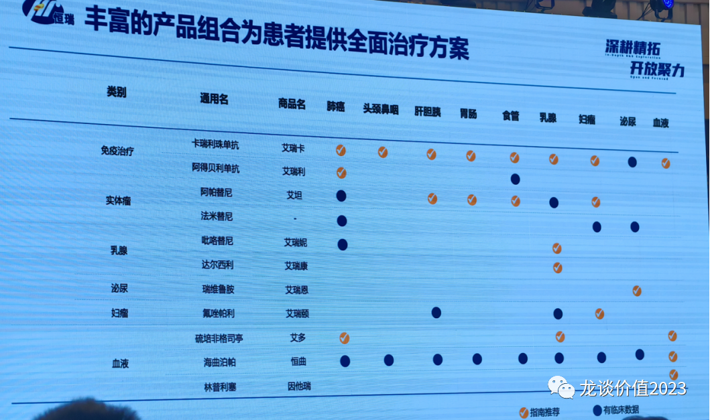

肿瘤：2023-2025年肿瘤新发450万左右。

自免：11个产品覆盖四大科室。

代谢：12大产品构建终身血糖管理和体重管理方案，全靶点覆盖。

**张连山（夯实创新基石 开创科技前沿）：**

肿瘤：

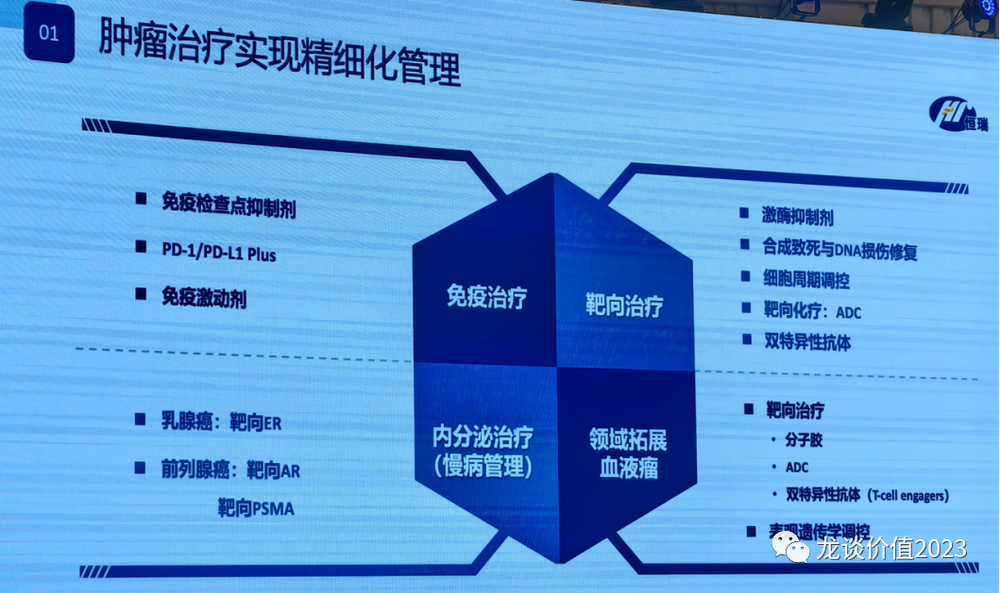

免疫检查点抑制剂是基石，我们是全球第一个没有Fc功能的PD-L1分子，也是全球最安全的PD-L1，我们也可能是唯一还在做PD-L1/TGFβ的公司。PD-1/IL-2V融合蛋白，只激活PD-1阳性T细胞而不激活其他免疫细胞，体现出更好的安全性。

肿瘤慢病化最好的是在乳腺癌、前列腺癌，内分泌治疗。产品迭代：PARP1抑制剂（HRS1167），CDK4抑制剂（HRS6029）。

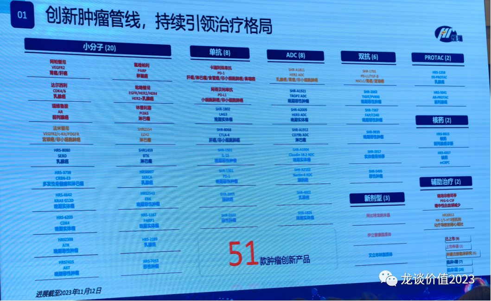

慢病：

明年是自免和代谢疾病的大年。我们是全世界所有糖尿病公司里布局最完善的；三复方已经申报，患者只需要一天吃一粒药；我们将会是中国做胰岛素做的最好的，一周一次的胰岛素已经报I期。减肥是一方面，血糖的控制更重要。

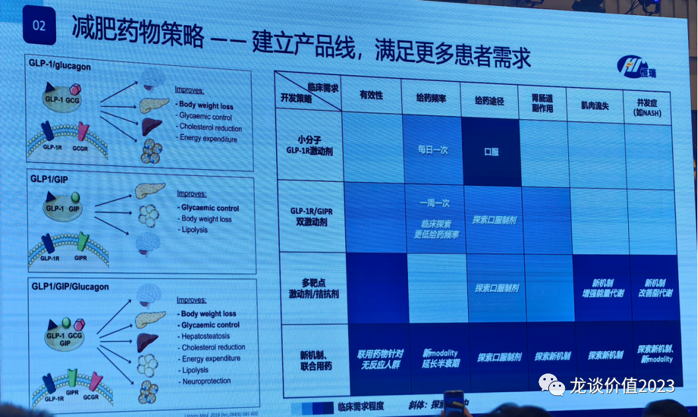

自身免疫：小分子做靶点发现和分子优化，大分子做把靶点组合和技术平台。

脑卒中：预防用药是关键。

布局前沿靶点，深耕差异化，打造恒瑞特色产品管线。

**纪立农教授（北大人民医院糖尿病中心主任）**

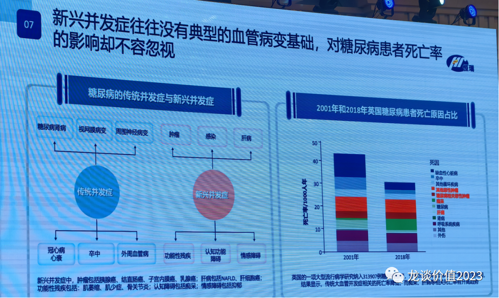

儿童青少年2型糖尿病的发病率全球居首，达到每十万人730多人，主要就是肥胖导致，并且青少年糖尿病普遍存在心血管病变等并发症。

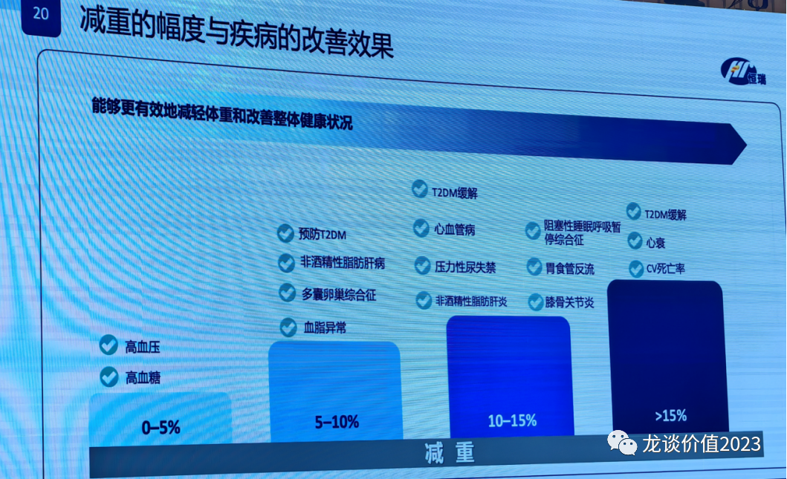

GLP-1停药一年后大概反弹约2/3的已下降体重，因此需要长期用药。

世界健康大会决议，糖尿病80%的诊断率、80%的血糖控制率、80%的血压控制率，100%的1型糖尿病可负担胰岛素和自我血糖监控。

**江宁军（战略驱动创新 聚力国际格局）：**

我国每年新发肿瘤患者数量是美国的2倍，5年生存率40.5%VS美国68%，要求提升15%的五年生存率。

恒瑞策略：

稳健的临床开发战略：验证性临床找到最适合的患者群，创新临床试验设计，提速降本增效；以临床需求为导向，深耕精拓；全线推进，270+临床试验多维度创新探索，14个已上市分子、20+个III期临床阶段的分子、20+个II期临床分子、40+个I期临床分子，东西多，工具箱，可以打出各种各样的创新组合。

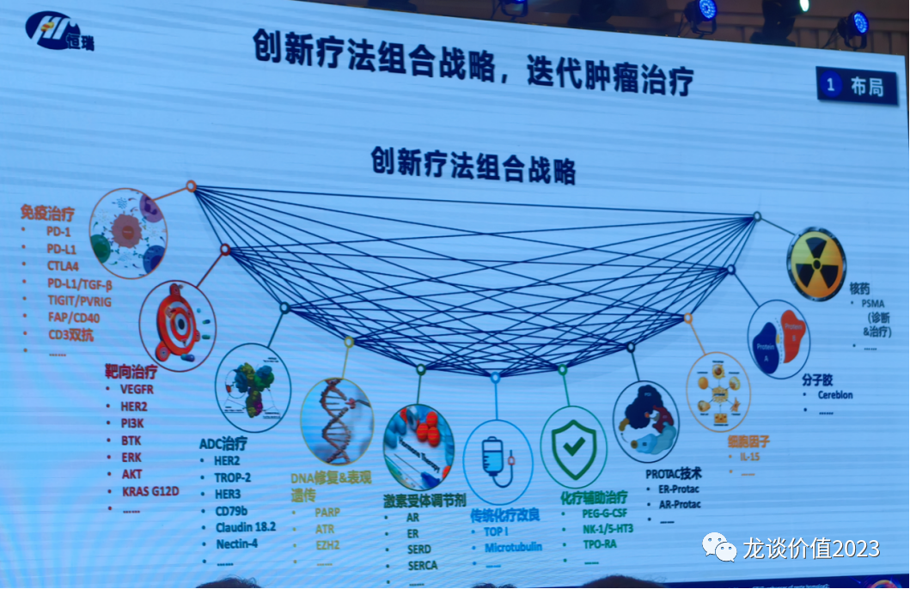

肿瘤：创新疗法组合；乳腺癌你能想到的我们全都有。

SHR-A1811：7个II期临床和4个III期临床在做，整体ORR率45.9%。获得4个突破性疗法认定，单药HER2+乳腺癌、单药HER2低表达乳腺癌、单药HER2+结直肠癌。

恒瑞合计有8个产品获得突破性疗法认定。

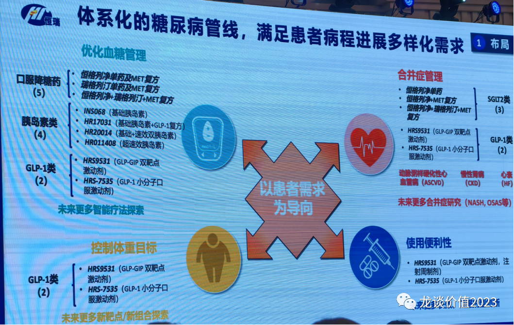

代谢：体系化的糖尿病管线，短效、长效、超长效胰岛素；中期并发症出来后需要很好的合并症管理；终生陪伴，提高依从性。

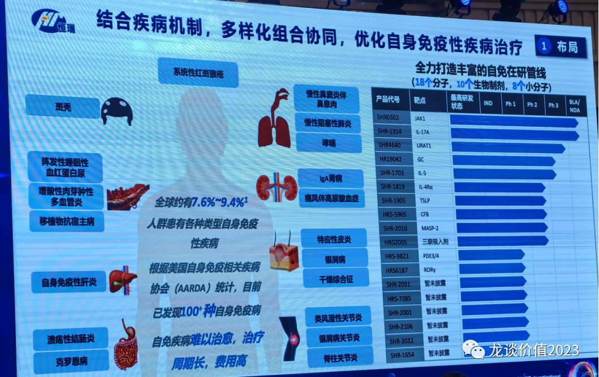

自免：10个大分子、8个小分子，覆盖很多的自免性疾病。

创新临床设计：无缝II/IIII期设计，把II期加入到III期中成为注册临床的一部分，加快进程、降低花费，临床缩短了1年多的时间。

全面广泛覆盖：覆盖500+临床试验机构、2000+医疗机构专业科室、4000+临床试验合作研究者、每月管理17000临床患者。自建的、全流程的、多职能专业临床团队，2000+人的临床研发团队，500+临床试验经验积累。2018年至今，62项临床试验的138次核查0次严重缺陷。

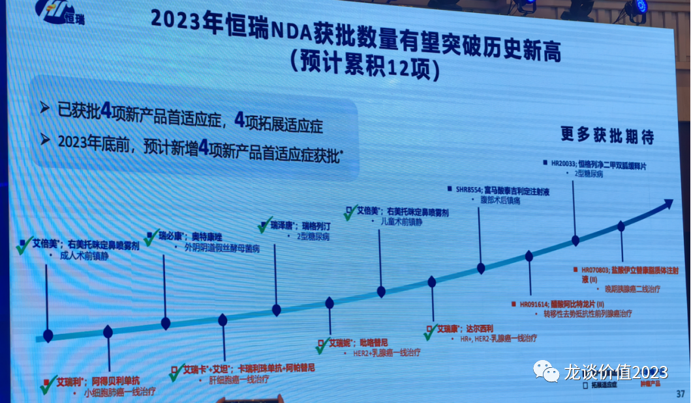

2023年预计12个NDA，未来2024-2025年还有25款新产品或拓展适应症获批，立足中国、放眼全球。

*风险提示：本文仅讨论行业/公司经营情况，投资需综合考虑公司经营、估值、管理层等多方面因素，建议读者审慎参考，本文不作为投资依据，不建议大家根据本文做出投资计划。*
