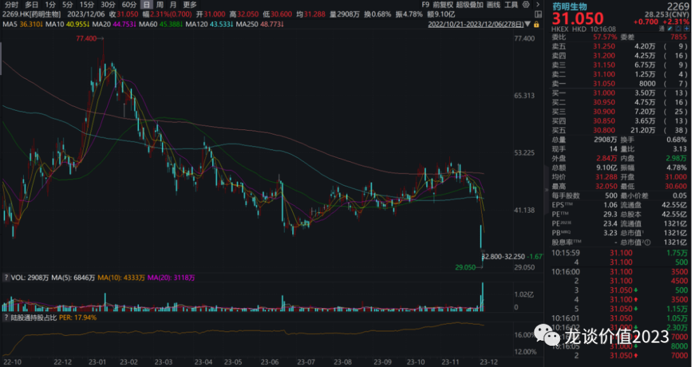
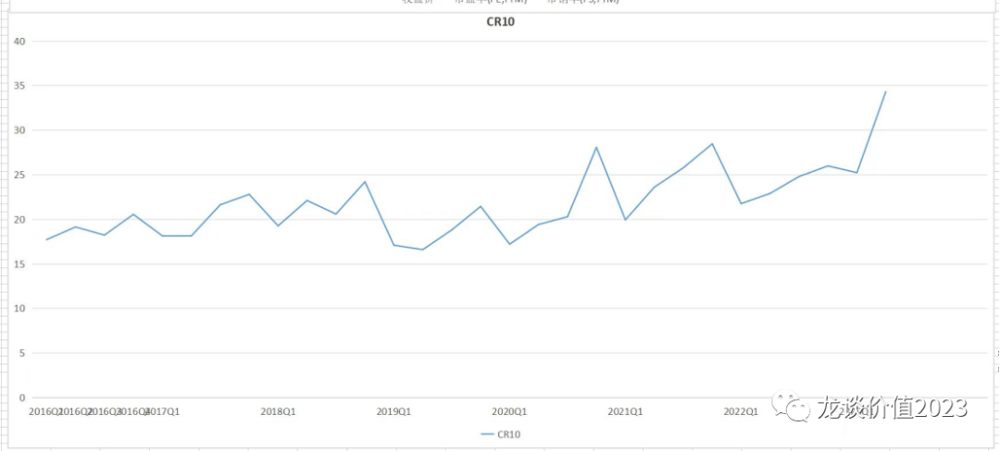
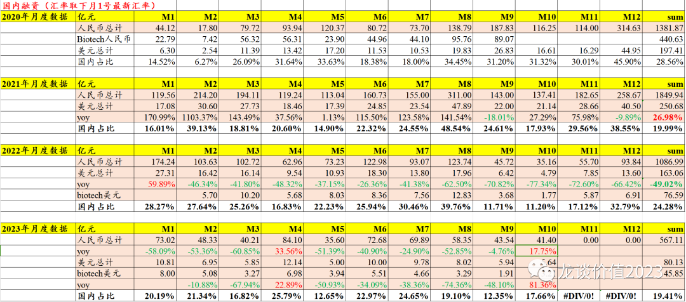
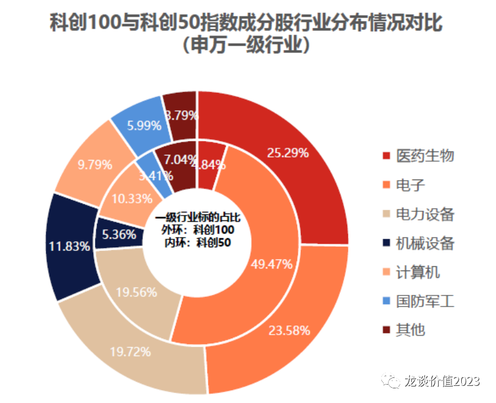
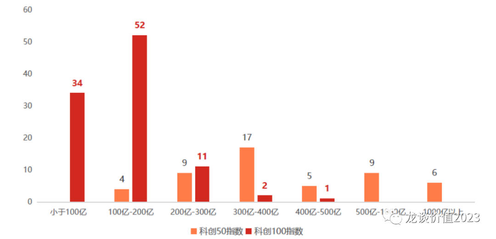
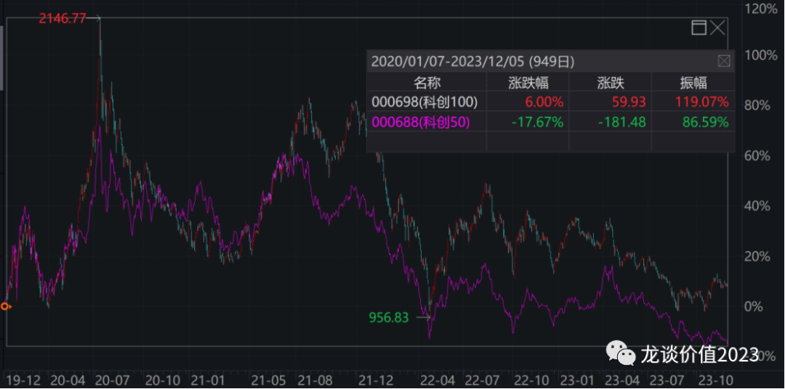

# 危中有机

周一早上，药明生物发布最新业务更新PPT并开电话会，下调了全年的业绩指引。此前指引是全年收入增长30%，意味着全年扣除新冠相关订单后的常规业务收入增速要达到60%，而最新调整后对全年常规业务的增长指引为36%，意味着全年收入增长10%出头，也意味着全年的收入预期直接从接近200亿下调到170亿，大幅下调30亿（-15%）的收入指引。

其影响是药明生物股价在周一周二两天暴跌30%，同时带动整个A股和H股的CXO行业股价集体暴跌，也间接导致了港股的医药相关ETF的大跌，并间接导致创新药板块跟随大跌，这一系列的连锁反应，使得部分投资人对医药行业的投资信心、对创新药的投资信心再度受到一些打击。

***01***

**CXO早已走下神坛**

生物药CDMO在很多投资人看来，是在竞争格局和进入壁垒要相较小分子CDMO更高的赛道，如果该领域的行业龙头都遭遇很大的增长压力，其他领域岂不是压力更大，因此药明生物一直是CXO行业增长的最后的信仰，最后的信仰崩塌，对行业冲击必然不小。

上一轮CXO的爆发是创新药的技术周期与国内企业全球竞争力提升的共振，新冠带来的研发投入爆发是其中的重要驱动力，是在回顾上一轮产业趋势时无法剔除去看的核心因素。受益于新冠的公司，将用几年的时间寻找其他品种来弥补新冠订单的缺口，未受益于新冠的公司，则是要用几年的时间来承受行业产能过剩之下的价格竞争和产能出清。在国内外企业共同的内卷之下，在全球医药领域投融资退潮之下，CDMO/CMO快速的回归制造业本质。

***02***

**Pharma重新崛起**

在当前的投融资环境下，美元加息周期结束，尚未进入降息周期，利率维持高位，全球创新药融资底部企稳但也还没有形成上升趋势，国内创新药投融资则是依然很差。创新药biotech投融资环境较差，使得biotech不得不缩减研发开支、缩减和聚焦管线。在这样的背景之下，我们看到了这样的一幕：**美国TOP10的大药企季度研发投入创历史新高。**

在这个近十几年来美国利率最高的环境里，高风险的创新药投融资大幅下滑，带来的是经营现金流的重要性显著提升，传统大药企的竞争力快速凸显和强化。

而国内市场，面临的是比海外更恶劣的创新药投融资环境，科创板暂停第五套规则，港股18A由于估值非常低、与一级估值出现明显倒挂，也很难进行融资。如我们此前所言，“成也资本市场、败也资本市场”。

在当前的环境下，我们看到了一些积极的变化，创新药投资开始回归本质：

①在估值泡沫化的时候I/II期临床的管线甚至临床前的管线都可以拿出来给估值，而当前市场环境下，只有III期及以后管线以及成功率较高的II期管线才会给估值——**泡沫化的估值持续回归**。

②大多港股小biotech失去流动性，失去交易价值，只有核心管线成功或对外授权能带来股价短期大幅波动——**大多数biotech长期看都是毫无投资价值**。

③融资环境艰难，越来越多公司跌到净现金，而对于管线没有商业化竞争力的公司甚至会跌破净现金——市场认为他未来几年的研发开支也将是无效的投入。

④执行力强、核心管线有竞争力的biopharma走出显著的超额收益——**创新药要投产品周期、不再幻想全行业β的上涨**。

⑤国际化开始进入第二阶段，国产创新药不论是license还是合作开发模式，的确出现密集的海外获批上市——**创新药国际化进入首个兑现期**。

以上变化对我们投资思路的转变具有很重要的意义，过去我们说创新药投资投的是创新+国际化，而创新和国际化二者本质上是同一件事，“真创新”一定会做国际化，而国际化就要求得是“真创新”。

**而现在我们认为创新药投资投的是现金流+国际化，有现金流活下去和真创新同样重要。**

在前面的两篇文章里我们写到了对pharma投资的逻辑，**四点核心因素是低估值+现金为王（生存+license）+管线重估+慢病优势**（《[**大象狂奔**](http://mp.weixin.qq.com/s?__biz=MzkyMzQ3MDc3Mw==&mid=2247483782&idx=1&sn=e49550a7f5d715edc6217d701956d6ce&chksm=c1e5df5cf692564a6f0399c58fac98ecf9b3cc4d79b94707c54133ff71fa0dc548b711ebdab8&scene=21#wechat_redirect)》、《[**大起大落后的方向**](http://mp.weixin.qq.com/s?__biz=MzkyMzQ3MDc3Mw==&mid=2247483772&idx=1&sn=7345a576fcba5589232ae4a9262f639d&chksm=c1e5dfa6f69256b064d3dba0b1dae7928e88d845347dad361a272c0518cba1a60dfef20fdcbf&scene=21#wechat_redirect)》），这几点因素驱动我们去挖掘更多的pharma公司。**除此前提到的翰森制药、中国生物制药以及将创新药资产注入A股新诺威的石药集团以外，也对更多的传统pharma进行了调研和梳理，这里再列举几家低估值pharma公司：**

**三生制药：**今年约70亿收入，包括独家品种特比澳超过40亿收入，市占率最高、品牌优势最强的米诺地尔“曼迪”今年销售预计在12亿左右，还有自免生物药子公司三生国健今年收入在10亿左右（持股81%，并表），剩余的几亿收入则是少量已经经过集采的传统品种以及生物药CDMO的少量收入。核心品种特比澳和曼迪的增长趋势比较清晰，特比澳预计明年双位数增长，曼迪尚未有指引、但预计也会是20%+的增长，集采品种占比很低，三生国健重回增长且在研管线进入后期，IL-17A将报产。公司20多亿利润和经营现金流，估值7.5倍左右，账上现金接近80亿、净现金约30亿。

**绿叶制药：**今年约60亿收入，除紫杉醇脂质体在8月以来的医疗ff中还受到一些影响外，其他品种集采影响基本出清，血脂康稳定增长，中枢神经领域一系列产品进入兑现期，包括①利培酮微球：用于精神分裂症，2021年国内获批、今年6000万左右，2023年1月在美国以505b（2）获批，美国销售规模不会很大，主要搭建美国销售体系，预计国内1亿美元+美国1亿美元+其他区域0.5亿美元，合计2.5亿美元峰值。②利斯地明透皮贴剂：阿尔兹海默症2021年国内和欧盟获批，贡献2.8亿收入。③若欣林：1类新药治疗抑郁症，预计国内20亿以上峰值、今年国内大几千万，美国505b（2）申报NDA获得FDA受理。④罗替戈汀微球：1周一次治疗帕金森，国内NDA，替代现有每天用药1-2次的产品，1个月1次给药的剂型在I期临床。⑤帕利哌酮缓释混悬注射液：用于精神分裂症、1个月给药一次VS利培酮双周给药，国内2类新药、美国505b（2），对标海外销售40亿美元+的帕利哌酮长效制剂，预计国内+海外峰值超过30亿。另外公司的戈舍瑞林微球国内获批上市（商业化权益给了百济神州），进口原研的戈舍瑞林植入剂国内销售额高达40亿，公司是独家竞品且给药方式更佳。另外公司还有一系列肿瘤、代谢、眼科领域的生物药在控股子公司博安生物（港股独立上市）。绿叶制药在高投入、高负债（高财务费用）之下表观利润较低，中枢神经产品线放量和降负债的操作将带来利润加速释放。

传统pharma普遍有一些历史遗留问题，否则也不太可能以这么低的估值作为风险折价，这也意味着当边际变化出现的时候，估值的弹性也就伴随出现。

......

最后再多说一点，因为我讲港股的药械公司多一些，包括之前讲的ETF也是港股居多，很多读者想问A股的标的，这里可以给大家一个选择——科创100ETF。

过去大家对科创板指数关注比较多的是科创50，但科创50的行业分布高度集中在电子行业（见上图内环），电子行业的权重占比达到50%，另外还有电力设备20%、计算机10%，且科创50以科创板大市值权重股为主......

而科创100的结构要均衡的多，医药是第一大行业占比25%，电子占24%，电力设备20%，机械设备12%，计算机10%，基本可以覆盖各个新兴技术领域在科创板的核心标的，科创100成分股市值主要分布在50亿元至280亿元之间，其中市值规模低于200亿元的样本占比86%，样本市值的中位数约为130亿元，相比科创50更加偏中小市值。

20年1月以来至2023.12.5，科创100上涨6%，而科创50下跌17%，科创100的表现更多更好。而且从历史表现来看，每次上涨的弹性都更大。

科创100ETF中规模最大、流动性最好的就是**科创100ETF华夏（588800）**，供大家参考。

*风险提示：本文仅讨论行业/公司经营情况，投资需综合考虑公司经营、估值、管理层等多方面因素，建议读者审慎参考，本文不作为投资依据，不建议大家根据本文做出投资计划。*
