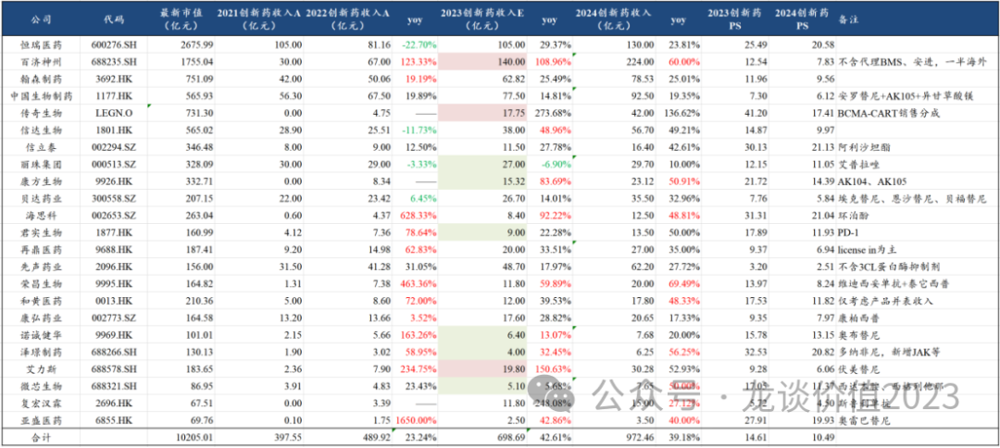
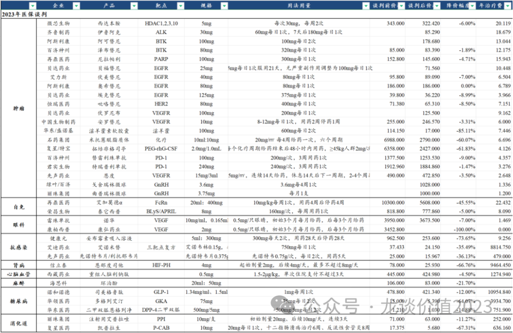
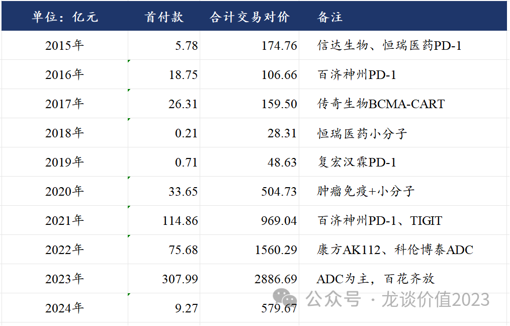
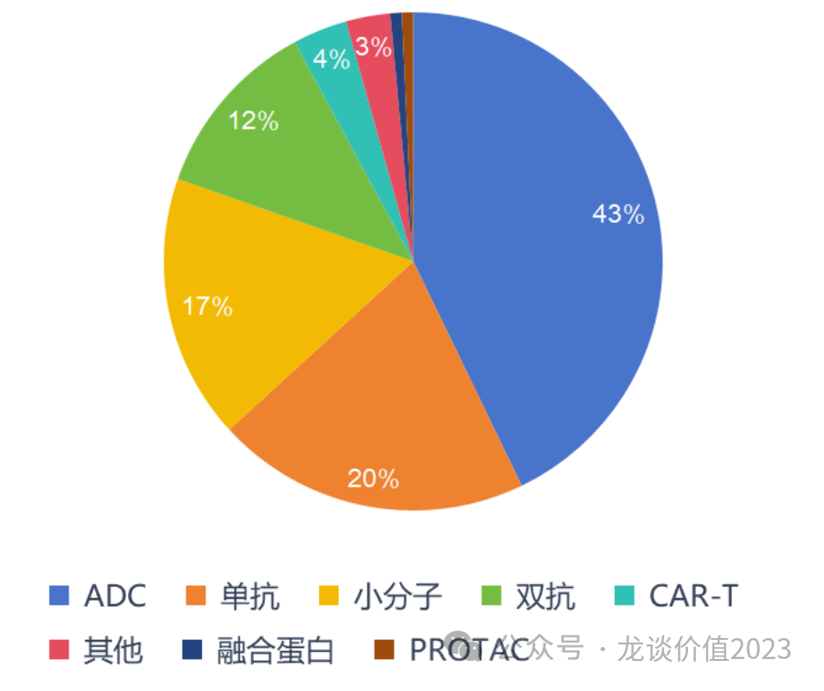
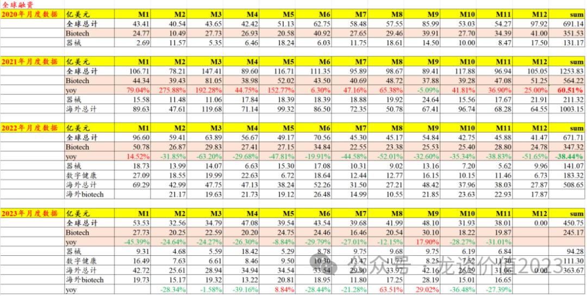
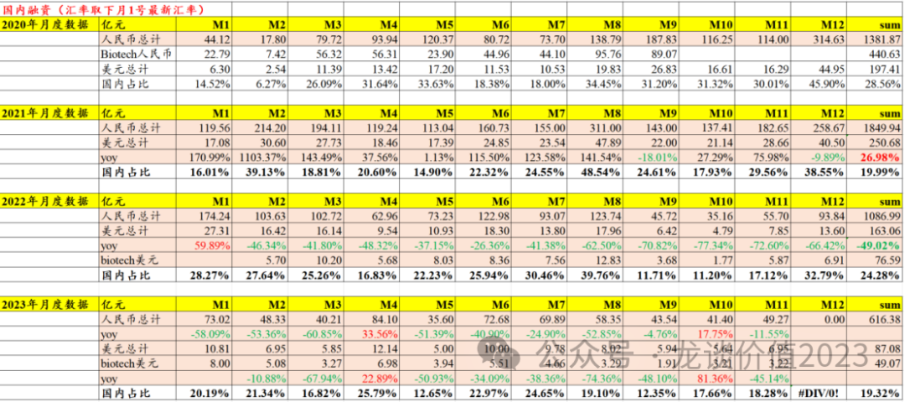
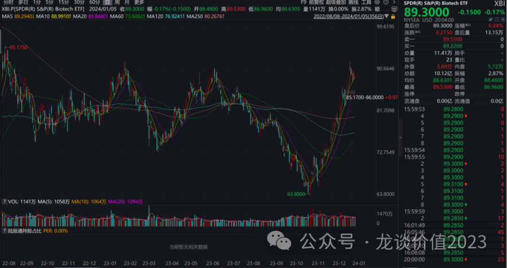
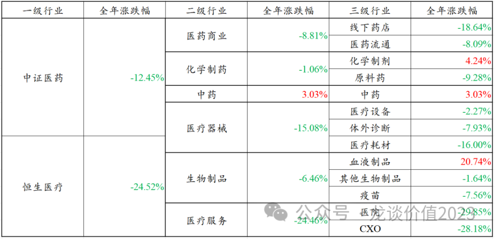
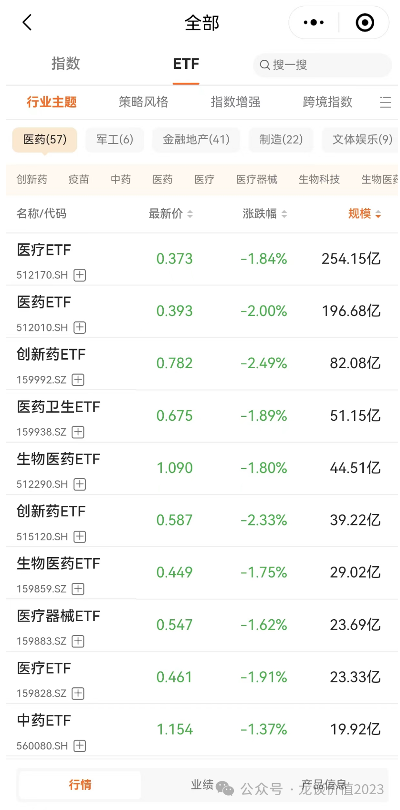

# 惊涛骇浪2023年总结

大家好，我是龙哥。

2023年的医药行业是让人又爱又恨，爱在行业发生了非常多的积极正面的边际变化，不论是创新药医保谈判政策的持续温和、创新药海外license out授权的百花齐放、国内创新药销售持续放量，还是减重药、ADC等细分领域在研发和商业化的持续兑现。而与此同时，全球创新药一二级市场融资依然低迷，创新药板块在2023年经历两轮大的起伏，巨幅的波动使得想要将收益落袋为安也是不易。在此我们对23年的医药行业做个简单的总结。

（点击链接可见近1-3年医药各子行业指数表现）

......

**创新药国内销售持续放量**

注：以上只考虑创新药产品销售，不含仿制药、BD授权收入等，23-24年销售额均为个人预测，未必准确，仅供参考；红底标注为23年销售超预期，绿底标注为23年销售低于预期。

**2023年创新药国内销售放量最超预期的公司是艾力斯**，在2023年也实现了超过翻倍的涨幅，年初预期伏美替尼在2023年的销售在14-15亿，实际全年应该接近20亿，且在临床使用的经验和口碑也在持续提升，公司对伏美替尼的销售峰值预期为50亿元。另外，上周Arrivent Biopharma递表申请纳斯达克IPO，该公司成立于2021年，2023年4月Arrivent的B轮投后估值3.6亿美元，其核心产品就是2021年自艾力斯BD引进的伏美替尼。

**另外两个销售超预期的公司分别是百济神州和传奇生物，且都是其核心产品（泽布替尼、Carvykti）在美国的销售超预期**，传奇生物的BCMA-CART在海外的销售超预期核心原因是涨价，在美国提价3%左右、欧洲提价8%左右，这个在国内市场可能是很让人诧异的事情，国内市场药品上市定价基本就是生命周期的最高价，而欧美市场的创新药可以根据供需关系和成本情况做提价。

销售低于预期的公司普遍是因为国内医疗FF的影响，例如我们虽然预计KF生物全年合并报表的产品收入会低于我们年初的预期，但预计依然可以完成公司对外的指引，只是由于医疗FF前其销售表现非常亮眼，我们给了更高的预期；而LZ集团、JS生物、NCJH、ZJ制药、WX生物等公司的销售低于预期，有医疗FF的影响、有竞品的影响，普遍在股价中也有所反映。

总体来看23年国内创新药企的创新药增长情况还是很不错的，仅以上统计的23家公司的创新药销售收入合计接近700亿，同比增长超过42%，且预计24年仍将维持较高的行业增速。**总体上国际市场表现明显好于国内，大病种表现明显好于小病种，治疗性药物明显好于辅助治疗药物，传统利益品种总体表现较弱。**

......

**医保谈判持续温和**

对于每年的医保谈判，看平均降幅和谈判成功率的意义并不太大，核心看两个东西，第一个是重点首次纳入医保时的年用药费用水平，由于后续有简易续约的规则，这个首次纳入的价格就显得至关重要，不像以前由于续约的降价还很不可控、即使一开始进医保有个很高的价格也没用，因此首次纳入医保的价格如果可以较高，就意味着医保对其长期价值和长期价格中枢的肯定，这个和平均降幅的相关度并不高，因为各家都已经习惯已上市先定很高的价格、通过赠药的方式销售，然后医保谈判有个很大的表观降幅，让医保面子上好看；第二个是看续约价格的降幅，现在有简易续约规则的约束，降幅基本有限，但简易续约的降价上限依然高达25%，降价25%意味着量要增长33%才能达到不下滑，因此简易续约的降价幅度影响理论上依然存在。观察核心品种首次纳入的年用药费用水平以及续约产品的降价水平，是判断医保谈判对行业影响的两个核心的角度。

①代表性品种：华领医药用于2型糖尿病的多格列艾汀年用药费用3935元、降价64%，但实际上该药物的定价大概是去年医保谈判的、同为国产糖尿病领域新靶点作用机制的、微芯生物的西格列他那的接近一倍，去年西格列他那谈判的年用药费用则是2130元、降价68%；再鼎医药引进的艾加莫德作为一款自免罕见病药物，按1年用药5个月计算的年用药费用高达22万，是非肿瘤药的医保谈判价格天花板；健康元的妥布霉素吸入溶液是国产首仿（公司定位是2类新药），医保谈判降价74%，用满一年的年用药费用是9.26万，在抗感染药物中是一枝独秀的用药价格水平；艾迪药业的国产首款三复方抗艾滋药物艾诺米替医保谈判价格8810元的年用药费用，降价幅度仅35.5%；石药集团的米托蒽醌脂质体作为一款改良型化疗药也仅降价60%、年用药费用6.7万，远高于一般的化疗药物；已经有多个竞品的ALK抑制剂，国产第二家的齐鲁制药的伊鲁阿克谈出了18.7万的年用药费用也是非常惊艳，远高于去年恩沙替尼的12万出头的年用药费用。总体来看本次医保谈判的首次纳入医保的国产新药的价格普遍是比较高的水平。

②续约降幅：**今年100个续约的品种中有70个都是以原价续约，31个品种因销售额超出预期的品种需要降价，平均降幅也仅有6.7%**，这还包含18个品种新增适应症、但其中只有1个触发了降价机制，**也既18个品种中有17个是原价增加适应症**，由此可见今年的续约价格确实非常温和。这其中的个别代表性品种，例如治疗性用药的百济神州的泽布替尼降价1.9%，再鼎的尼拉帕利降价4.7%，中国生物制药的安罗替尼降价3%，微芯生物西达本胺降价6%，先声药业的恩度降价3.5%，荣昌生物泰它西普降价5%，即便是销售大超预期的司美格鲁肽也仅仅降价12%。而相对竞品较多或者偏辅助治疗的注射用艾普拉唑降价11.3%、环泊酚降价21%。**意味着今年的医保谈判在不同临床价值的品种之间仍然有明显的谈价上的倾斜。**

当然，今年还是有多个重磅品种选择不进医保，包括第一三共的8201在内的一系列创新ADC药物及包括康方的AK104在内的一系列国产差异化创新的新药均选择不进医保，哪怕在医疗FF的环境下，企业依然在综合考虑进不进医保对价格和利益的影响程度，**与医保的议价权或选择不进医保的能力是靠产品创新带来的，进医保不是唯一的解决方案**，这件事在持续发生。

另外，今年医保谈判还有一个重要的变化，就是对中药品种（包含大量中药注射剂）的支付标准几乎是全面放开，中药注射剂等中药品种放开医保支付范围，一方面是鼓励中医药在常规诊疗中的占比提升，增加对中药的使用（没有疫情的话早就开始扶持了，包括中医院医保额度增加、不参加DRG/DIP），另一方面是这些中药品种过去几年做了一些质量体系的完善，中医药管理局成立，中药企业主动向医保局申请等。很多政策的影响需要长期观察。

......

**海外BD授权百花齐放**

**中国创新药历年license out海外交易金额**

从中国创新药历年的海外授权情况来看有以下几个特点：

①2019年及以前的创新药海外授权以个例为主，主要是几个PD-1单抗，唯一最具差异化优势和国际竞争力的是传奇生物的BCMA-CART，该项目直到现在依然是国产新药出海的“国货之光”，传奇生物的该BCMA-CART的全球销售峰值预期高达80亿美元。

**②创新药出海分别在2020年和2023年大爆发，分别代表肿瘤免疫和肿瘤ADC两大赛道的爆发**，2020-2021年的海外授权包括CD73、CD47、PD-L1、PD-1、TIGIT等等肿瘤免疫靶点，这两年的国内创新药海外授权基本是以单抗和小分子为主，其他分子种类极少；2022-2023年则是ADC分子的海外授权爆发式增长，国产首个ADC的海外授权是2021年8月荣昌的维迪西妥单抗授权Seagen，随后的2022年，礼新、科伦、石药进行了多款ADC分子的授权，2023年则是出现了高达13笔中国ADC分子海外授权，除此以外。肿瘤免疫时代国内开始海外授权处于行业高峰、证伪前夕；ADC时代国内开始追赶全球一线水平，在全球创新药行业地位显著提升。

**中国创新药出海授权按分子种类总交易对价**

③2023年以来的海外license out授权，除了ADC药物的全面爆发外，在**单抗、双抗、双抗ADC、小分子、CAR-T、siRNA、AI技术平台、PROTAC等领域呈现百花齐放**，例如2022年底康方生物以5亿美元首付款、合计50亿美元交易对价授权的PD-1/VEGF双抗，2023年底百利天恒以8亿美元首付款+76亿美元里程碑付款合计84亿美元交易对价授权的EGFR/HER3双抗ADC，金斯瑞传奇生物再将DLL3-CART授权诺华，映恩生物、宜联生物分别有多款ADC分子进行海外及国内授权，传统药企中恒瑞、翰森均将其ADC分子授权给国际MNC，亘喜生物以12亿美元总交易对价被阿斯利康收购，信瑞诺以35亿美元总价被诺华收购。

④肿瘤免疫时代全球及国内以PD-1为代表的肿瘤免疫靶点的火热研发投入，成就了药明生物收入增长30倍、股价最高上涨18倍的传奇，**肿瘤ADC时代有望成就ADC CDMO龙头药明合联成为下一个CXO领域的超级成长股**，虽然在当前的全球创新药融资环境下难以复制药明生物当年的表现，但预计仍会是未来几年CXO行业最具活力和成长性的公司。

**⑤创新药出海获得一定规模的首付款和里程碑付款可提供新药研发资金支持、摊薄国内创新药研发成本。**中国创新药海外授权累计拿到了600亿元的首付款，总的交易对价超过7000亿元，再加上MNC对国内药企的股权投资提供的资金，相当于为国内创新药研发提供了上千亿的资金支持，摊到过去3-4年里就是每年两三百亿的资金，这是什么概念呢，整个中国所有上市的创新药公司（A股、港股、美股）在2022年合计的研发投入是638亿元，这其中还包含了仿制药、生物类似药以及制药以外业务的研发投入。上文我们统计的国内主要的已上市创新药公司合计创新药销售规模在2023年也仅有700亿，略高于22年的研发投入规模。

......

**全球创新药融资依然低迷**

国内及海外的创新药一级市场融资在整个2023年依然非常低迷，23年下半年以来基本是底部震荡的态势，海外已经有企稳迹象，XBI指数也在23年Q4以来出现了较大幅度的反弹，二级市场的企稳才能带动一级市场的回暖，而国内二级市场的股价及IPO都还没出现回暖，传导到一级市场则是预计还会底部震荡。

**在此融资环境下，有现金流的传统pharma和现金充裕、有大品种商业化的biopharma都会迎来竞争格局的优化和出清的过程，充裕的现金流可以从行业寒冬中找寻各种license和并购的机会。**

......

**板块涨幅**

23年各板块的涨跌幅情况来看，中证医药和恒生医疗在全年的表现均较差，其中恒生医疗尤其是一枝独秀的差，全年最大跌幅30%、23年1月份高点以来最大回撤40%，多个权重股跌幅在40%-50%乃至更多，港股创新药板块尚且可圈可点，CXO、医疗服务、互联网医疗、高值耗材等板块基本都是跌幅巨大。

**从A股各子板块来看，23年仅有血液制品、化学制剂（创新药、传统仿制药）、中药三个板块收得全年正收益，医院、CXO和药店跌幅靠前（三个靠资本开支拉动高增长的板块）。**

**创新药和血液制品是我们2023年的公众号文章中主要讲的两个板块，也是在当前的医药行业中为数不多的有产业逻辑的方向之二。**我们在23年挖掘血制品行业类似在22年挖掘软镜行业，共同的特点就是——故事讲了很多年、miss了很多次，真正到了产业逻辑兑现的时间反而很多投资人不信、或没有重视边际变化的到来，从而带来预期差。《**[行业性拐点已至](http://mp.weixin.qq.com/s?__biz=MzkyMzQ3MDc3Mw==&mid=2247483723&idx=1&sn=74f4dc11969a7ac7272d6fea5e755a26&chksm=c1e5df91f69256871ab53f0f18248869297207e1744776a39412e739799c634312108b4e0471&scene=21#wechat_redirect)**》

在板块涨跌幅的基础上，最后再聊聊行业ETF，有个看ETF非常方便的小程序大家可以试试看，就是红色火箭（首次登录有小红包），选标的、看历史表现、历史持仓、对比财务指标和历史估值都很方便。

医药行业合计57个ETF基金，规模最大的医疗ETF最新规模仍然有250亿以上，但该基金过去3年跌幅超过50%，其成分股主要是A股的CXO、医疗服务和医疗器械这三大板块，也是过去3年医药行业跌幅最大的三大板块，重仓股除迈瑞以外无不是起步腰斩、多则80%跌幅。

买ETF的投资人习惯越跌越买、微笑曲线，但在遭遇这种产业出现估值业绩双杀的情况时，越跌越买并不是好的选择，基本面仍然是投资的第一要素。这种过去几年由市场、医药主题公募共同给大家洗脑的医疗服务、CXO是顶级商业模式之下，居然让此前估值严重泡沫化、基本面显著恶化的板块，成为第一大的医药行业ETF标的。

*风险提示：本文仅讨论行业/公司经营情况，投资需综合考虑公司经营、估值、管理层等多方面因素，建议读者审慎参考，本文不作为投资依据，不建议大家根据本文做出投资计划。*
