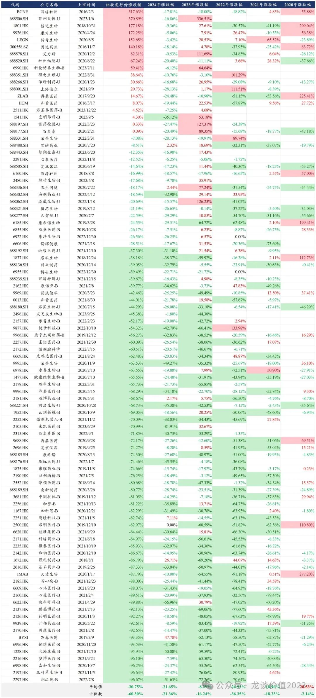

# 赚钱有多难

大家好，我是龙哥~

统计了自2016年百济神州在美股上市以来，我国创新药、创新器械公司在A股、港股、美股三地上市后的股价表现情况。

数据统计合计96家A/H/美股创新药械上市公司，最新价相较发行价平均跌幅-30.75%，中位数跌幅-60.30%，也既，假如对这些创新药械公司进行打新并持有至今，平均亏损60%。

2020-2024年这5年间，这96家公司的年度涨跌幅中位数均为负，中位数跌幅最大的是2022年，中位数跌幅-36%。只有2020年的医药牛市里涨跌幅平均值可以为正，但这年的中位数也是-2%。

最新价相较发行价累计涨跌幅为正的公司合计18家占比18.75%；2020-2024年的年度涨跌幅为正的比例分别为44.90%、26.03%、14.77%、37.5%、6.25%。

创新药械赚钱真的很难。

注：涨幅超过50%为红底标注，跌幅超过30%为绿底标注（跌幅超过30%需要上涨50%才能回到原点）。

*风险提示：本文仅讨论行业/公司经营情况，投资需综合考虑公司经营、估值、管理层等多方面因素，建议读者审慎参考，本文不作为投资依据，不建议大家根据本文做出投资计划。*
