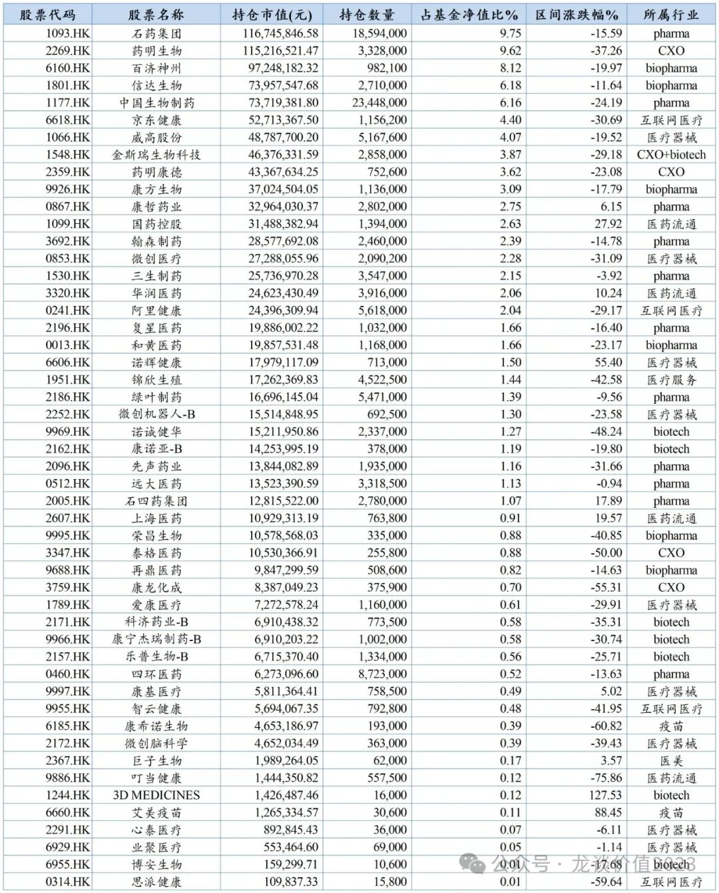
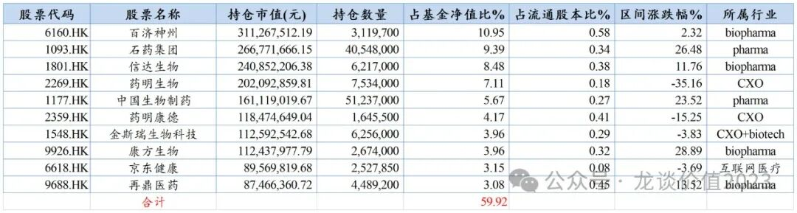
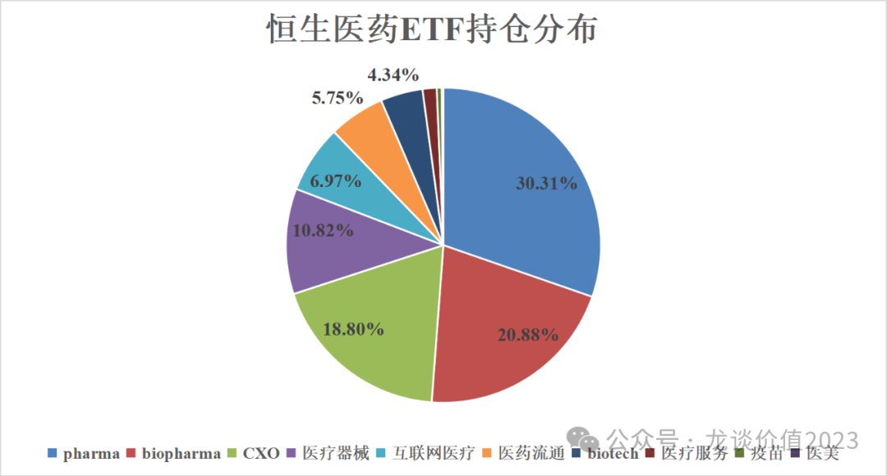

# 真相

大家好，我是龙哥。

大家投港股的时候，经常遇到的问题，个股波动幅度巨大、一般人难以接受如此大幅度的波动，但投ETF又苦于对其指数成分股并不完全满意，这里就港股医药主流ETF的重点持仓方向和标的简要梳理。

以恒生医药ETF (159892)为例，其持仓目前公布到2023年年报的只有前十大重仓股，完整的持仓尚未公布，目前能看到的完整持仓还是2023年中报，就以2023年中报完整持仓和2023年报前十大重仓股为例来看：

**2023年中报完整持仓**

**2023年年报前十大重仓股**

......

从行业分布来看，我们把港股的制药板块分为传统pharma、新兴biopharma和新兴biotech三类，**分别占恒生医药ETF（159892）持仓权重的30.31%、20.88%和4.34%**，整个传统pharma大多处于转型创新的不同阶段，这部分全部归为创新药板块的话，合计占55.5%左右，是港股医药ETF的主要持仓行业。

CXO板块合计占18.80%，其中占比3.87%的金斯瑞生物科技被我归到了CXO板块，但要注意的是，**到2024年金斯瑞合并报表中接近一半的收入将由其创新药业务子公司——传奇生物贡献**，生命科学贡献超过三分之一的收入，而预计CDMO业务仅贡献约10%出头的收入。除金斯瑞外的CXO持仓主要是药明系两家公司。

医疗器械板块是过去1年多医药行业里表现最差的子板块，集采、行业红海竞争、医疗ff、医保支付政策尚未完全清晰等因素影响，该板块的9家公司占比合计是10.82%。

除此以外，阿里健康、京东健康为首的互联网医疗企业占6.97%的权重，国控、华润、上药三大流通巨头为首的医药流通占4.34%的权重，还有医疗服务的锦欣生殖、医美的巨子生物占少量权重。

***01***

**创新药**

对创新药板块我们总体还是偏积极的，在年初的文章《[**惊涛骇浪2023年总结**](http://mp.weixin.qq.com/s?__biz=MzkyMzQ3MDc3Mw==&mid=2247483843&idx=1&sn=fd650908f06ea46804d29e93e7ef6682&chksm=c1e5df19f692560f259db8f9f293471b7a9f49526cb17933ca586df990678f4a8ee6a2a556d3&scene=21#wechat_redirect)》中，对创新药海外授权、国内医保谈判、国内销售情况、一级市场融资等做了梳理，我们认为一个健康的创新药二级市场投资组合，本身就该是以头部商业化能力强的Pharma+部分执行力和管线优秀的biopharma+少量管线极具创新能力的biotech构成，很多人只想投天马行空的、极具弹性的创新药biotech，这类投资组合应该去选择一级市场投资、或更应该选择去美股投资。

近两三个月我们全面梳理了A股和港股老牌pharma的情况，**对于A股多数、H股绝大多数传统pharma的估值已经仅有1.5-2倍PS**，即便在当前的政策环境下成长压力大了很多，但总体增速普遍还是要比欧美大多老牌MNC的增速要高一倍以上，欧美老牌MNC长期估值中枢大概在5倍PS左右（礼来、诺和诺德等有超级重磅新品的公司除外），国内这些传统pharma仅看股息也已经可以有一定水平的回报。更重要的是，经历了2018年以来这5年的仿制药集采，各家传统pharma的仿制药业务受集采的影响已经大多实现出清，部分药企过去5-10年布局的创新药、难仿药、生物类似药陆续进入商业化兑现期。

**对于biopharma，虽然各家的新药放量节奏有所差异，但总体还是处于创新药密集商业化爆发的阶段**，如市场关注度极高的减肥药，信达生物的玛仕度肽将在24年底到25年初上市进行商业化销售，预计是信达下一个潜在重磅大品种，也是国内GLP-1双靶中唯一可以在司美专利到期前的窗口期实现商业化市场教育的品种；再如国内创新药在欧美商业化放量的传奇生物/金斯瑞生物、和黄医药、百济神州，都处于业绩爆发期，也有望在未来1-2年逐渐看到扭亏和现金流转正；还有如康方生物等国内商业化品种密集落地、海外临床持续推进的头部公司。国内市场，创新药、生物类似药商业化放量实现扭亏的公司，去年已经有艾力斯和复宏汉霖两家，艾力斯持续超预期的销售也拉动其股价在去年实现非常好的表现。

对于biotech，大部分没能在上一波红利期转型biopharma的公司，除非是有非常有竞争力的技术平台（例如个别未上市的ADC领域的biotech），大部分公司还是长期都会存在扭亏和资金方面的压力，有投资价值的公司需要在茫茫biotech海里筛选。

***02***

**CXO行业**

3月6日昨晚，漂亮国参议院国土安全事务委员会对涉及药明系、华大系的《生物安全法案》投票以14:1通过，后续将提交参议院、众议院投票，CXO板块涉及到的ZZ风险进一步提升。过去我们也一直认为，CXO这种ZZ风险将长期存在、始终无法证伪，且有可能会被作为大国博弈的牺牲品。当前局势依然不明，我们没法做确定性的判断，对该板块也只能是规避为主。

困难的地方在于，几乎所有港股医药ETF都会包含药明系为权重股，但好的地方是，目前药明系在ETF中的权重占比已经显著下降，到2023年年报，药明康德+药明生物在恒生医药ETF中的权重下降至11%，而2024年以来两家公司均又有40%的股价下跌，在ETF中的权重占比预计进一步下降，可能已经降至8%以下，且ZZ风险持续释放。

***03***

**医疗器械**

恒生医药ETF在2023年年报前十大重仓股中已经没有医疗器械公司，但从23年中报全部持仓来看，9家医疗器械公司还是贡献了10.82%的权重，占比较高的主要是威高股份、微创医疗、诺辉健康、微创机器人等4家，这四家公司在2023年下半年的表现普遍不佳，预计也使得器械板块在ETF中的占比进一步下降，其中威高股份的经营总体比较稳定，只是威高骨科受集采影响阶段性的明显拖累业绩，诺辉健康也在持续验证自己的商业化和现金流。

某WC系的表现更加可圈可点，作为跟踪该公司多年的医药投资人，近两年给我的感觉就是“像遛狗一样遛投资人”，集团公司层面对外交流一塌糊涂，业绩持续的miss永远归为外部因素，无序扩张、超高费用率、巨额亏损让人胆战心惊，作为中国高值耗材+手术机器人行业龙头，如此表现着实让人失望。但好在，经历前期股价的巨幅下跌，在ETF中的权重应该也已经极低，影响有限。

***04***

**其他板块**

互联网医疗一直是我比较关注但始终未曾下手的板块，核心原因是该板块的估值体系我还是难以把握，当然我个人还是看好互联网医疗未来在线上诊疗、线上卖药的渗透率提升的趋势的，线上诊疗可以一定程度上减轻地区医疗资源严重不平衡的问题，线上卖药可以大幅削减商业渠道的加成、减轻患者和医保负担，这点想必有试过在互联网平台和线下药店买同一款药的人都会深有感触，线下药店价格高50%-100%是常态。

至于以三大国有分销巨头为主的医药流通板块，则是主要从股息的角度考虑就好，三大巨头的H股普遍在3%-5%的股息率、且行业地位相当稳固。

*风险提示：本文仅讨论行业/公司经营情况，投资需综合考虑公司经营、估值、管理层等多方面因素，建议读者审慎参考，本文不作为投资依据，不建议大家根据本文做出投资计划。*
