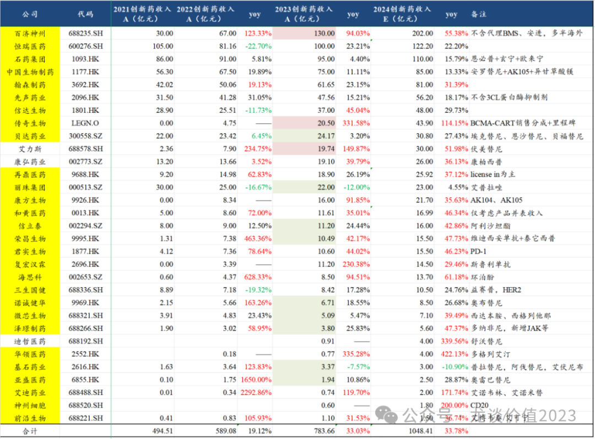
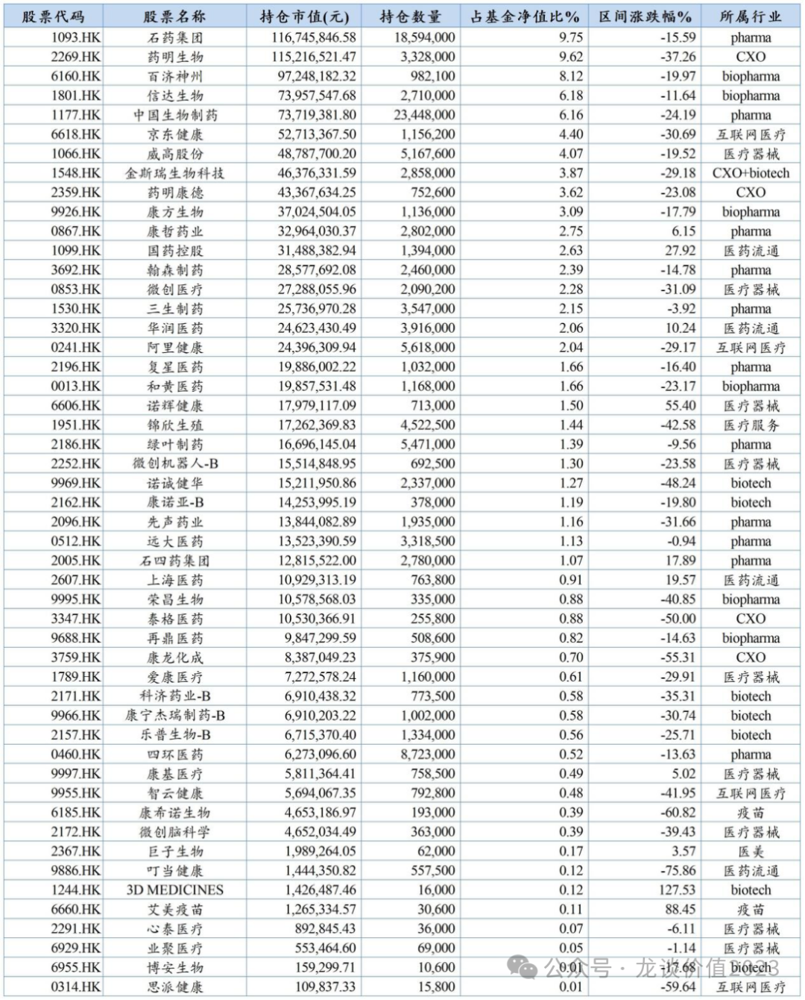
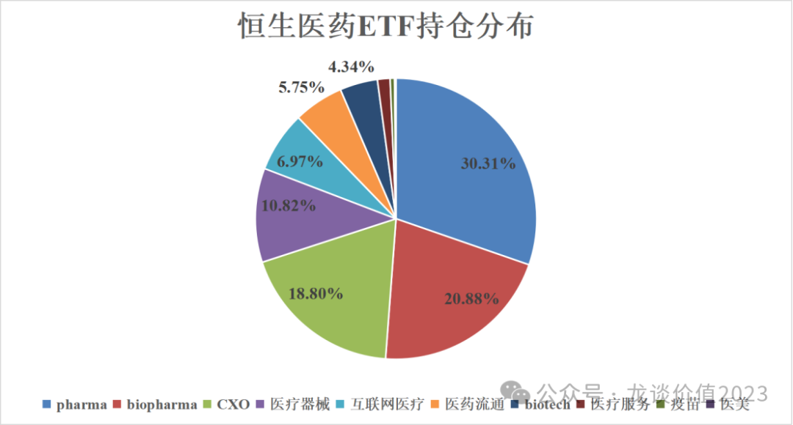
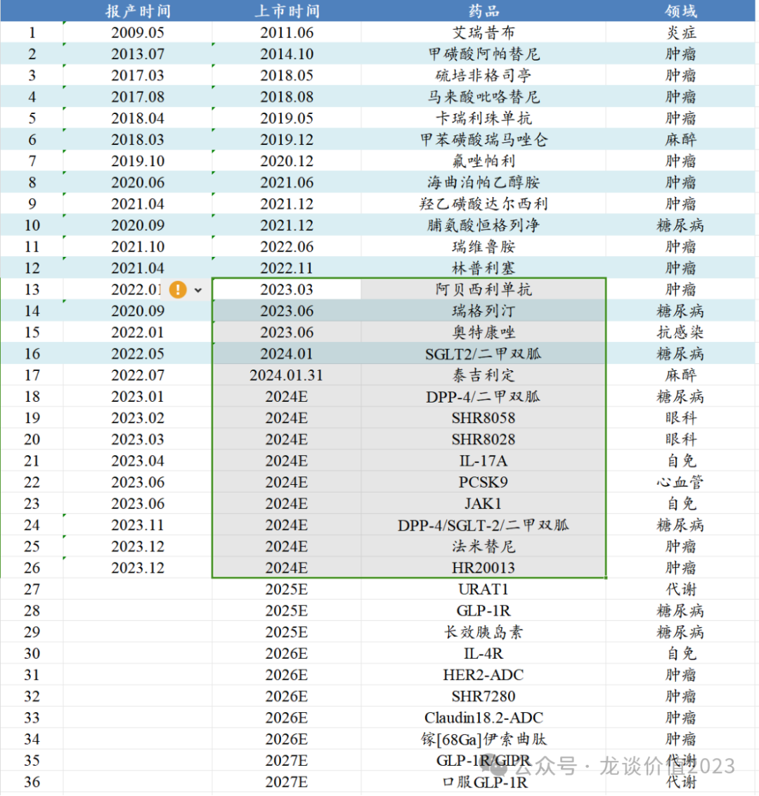
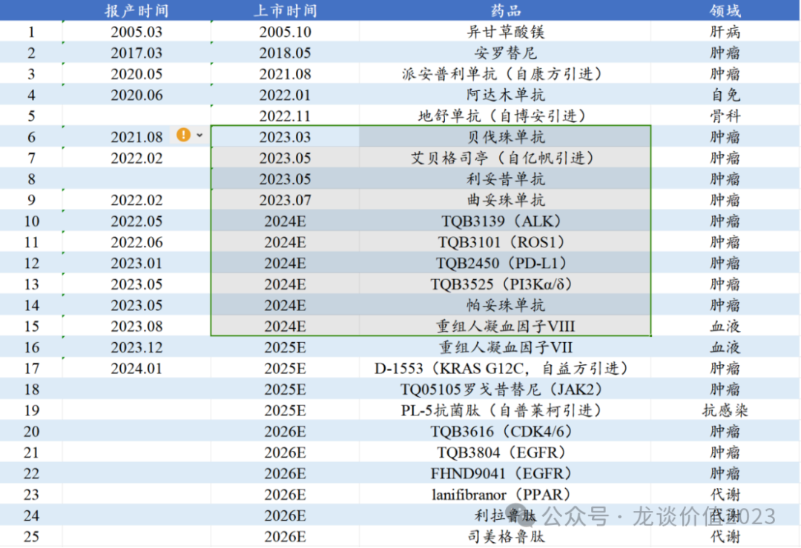
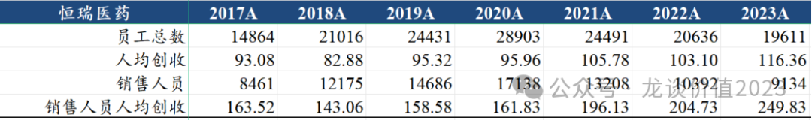
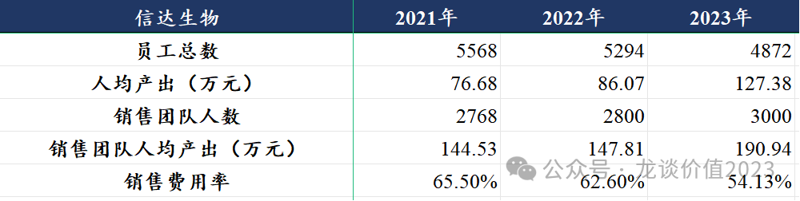
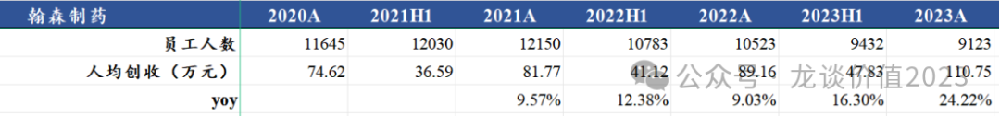
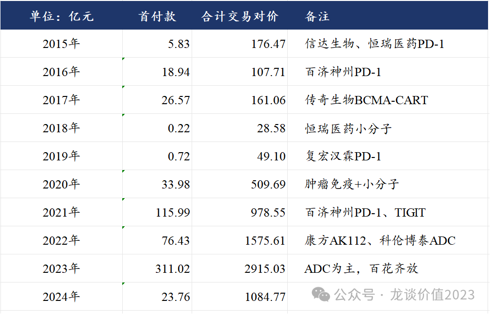

# 新趋势

大家好，我是龙哥。

在上周的文章里我们重点分析了医药行业近期主要的政策面变化《**[真·反转](http://mp.weixin.qq.com/s?__biz=MzkyMzQ3MDc3Mw==&mid=2247483881&idx=1&sn=a8503ed8723c3ae9c0e7b7dba53ccd6e&chksm=c1e5df33f69256250af91554fe38561560c23a9eb4a34fa1b4e41ab5b20530bc52056e95e8ba&scene=21#wechat_redirect)**》（点击跳转文章链接），政策面对于创新药行业来说大概率不会是主要的压制因素，在这个23年年报和24Q1一季报披露大半的时间点，我们根据当前已经看到的财报情况和与上市公司交流的情况，再来聊聊政策面以外更多的行业趋势。

***01***

**创新药持续放量**

（公司名标黄底表示已披露2023年年报，白底则尚未披露年报）

首先上来最干货的东西——中国创新药企业创新药销售额，以上统计剔除生物类似药、剔除仿制药、剔除产品授权收入，是比较纯正的创新药收入（除了石药集团，难以界定创新药收入，为预估值，可能有较大偏差）。

上图可见具有一定规模的创新药销售体量的公司主要还是集中在H股，前文我们曾在《[**真相**](http://mp.weixin.qq.com/s?__biz=MzkyMzQ3MDc3Mw==&mid=2247483870&idx=1&sn=90ad0e5fef83511fd47fbb12a4e54c56&chksm=c1e5df04f69256127244b3aa5989faa9139b75d37807ca3dd2415264af0ceea373379517a9d6&scene=21#wechat_redirect)》（点击跳转文章链接）中分析了**159892恒生医药ETF的持仓，涉及其中一众创新药公司，作为配置H股创新药一揽子组合的品种**。

**从行业总量来看，上市公司的创新药收入体量自2022年的接近600亿增长到2023年的超过780亿、同比增长33%左右，预计24年将进一步增长34%左右至1000亿以上**，行业增长还是非常快，我们也多次提到，近3-5年是国产创新药行业总量快速爆发的时间，商业化放量会催生多个如百济神州、信达生物、艾力斯这样的新兴biopharma，带来一些好的投资机会，而过了这个阶段再想突破重围成长为pharma的难度会进一步加大。

具体到标的来看：

**①头部公司里增长最亮眼的当属百济和传奇两大创新药出海的国货之光：**

即便22年以来有诸多国产新药分子的海外授权被退回，依然不减创新药出海的热度，全球新药研发来看重磅品种的出现本身就颇具偶然性和稀缺性，批量的出海、少量的大品种是符合逻辑的。

**②肺癌EGFR一个靶点成就翰森、贝达、艾力斯三大龙头：**

国内年度新发肺癌已经超过100万，而国内新发肺癌患者中约40%以上是EGFR突变的NSCLC，在EGFR靶点上的研发和竞争、以及未来可以成就的公司，相信不仅限于此，在EGFR/c-MET双抗（贝达、翰森）、EGFR TKI+MET TKI（和黄）、HER3-ADC（恒瑞）、TROP2-ADC（科伦博泰）、PD-1+VEGF（信达）、PD-1/VEGF（康方）等靶点和分子种类上的一众国产企业都在布局一二线治疗EGFR突变的NSCLC适应症。

**③传统pharma进入新品种的又一次密集商业化阶段：**

例如：恒瑞：

中国生物制药：

**④biotech销售表现分歧很大：**

如艾力斯、复宏汉霖、迪哲医药、艾迪药业等产品放量或早期放量表现较好，如和黄医药、海思科、康方生物等表现平稳，如贝达药业、诺诚健华、泽璟制药、亚盛医药等始终在miss的路上。

**⑤竞品集采的me too新药增长承压：**

典型的如信立泰、丽珠集团。竞品集采的me too新药在医保谈判时承受更大的降价压力，销售放量也受到竞品集采约束。

**⑥多个biotech产品线从1到N扩张：**

典型的如贝达药业从埃克替尼包打天下到5个商业化品种，泽璟制药从一个多纳非尼到未来2年3-4个商业化品种，海思科从一个环泊酚到未来1-2年4-5个商业化品种，康方生物从1个卡度尼利到未来1-2年4-5个商业化品种，另外还有信立泰、再鼎等新产品线快速扩张。

***02***

**裁员降薪？降本增效？**

2023年国内创新药械行业最有代表性的主题是什么？——裁员降薪。

据我们对AH股所有已披露财报的biotech、创新器械公司的梳理来看，大半公司都在进行裁员降薪，上文所述的销售放量（23年行业33%增长）是在全行业动荡的裁员降薪、医疗FF之下完成的，实属不易。

裁员降薪带来短期的阵痛，研发端和销售端都会带来一些影响，医疗FF更是直接冲击入院和销售，除个别头部pharma外，大部分药企都认为医疗FF是长期趋势，需要对应的做出销售团队的改革——从带金销售到学术推广。

以上间接带来降本增效的获益：

恒瑞医药：销售人员人效从2018年的143万大幅提升至2023年的250万+74.6%。

信达生物：销售费用率为产品销售费用率，不考虑授权收入。

翰森制药：人均创收自2020年的75万提升至2023年的111万+48.4%。

从传统big pharma到biopahrma的销售费用率都有不同程度的下降，2023-2024Q1大部分pharma也都体现出利润增速高于收入增速的表现。过去我们始终认为中国创新药企业由于销售费用率显著高于欧美创新药企业，使得其成熟期的净利率、P/Peak Sales估值都应该大幅低于海外，而国内销售模式的转变和费用率的持续下降，有望带来对未来净利率和P/Peak Sales估值预期的变化。

***03***

**出海逻辑持续加码**

创新药海外授权在2023年迎来新一轮的爆发，2023年中国创新药行业一级市场融资（不含二级IPO、定增）合计接近400亿元，而创新药海外license out居然贡献了311亿元的首付款和接近3000亿元的总交易对价，2023年底以来更是陆续有亘喜生物、信瑞诺、普方生物三家biotech分别被国际MNC以12亿美元、35亿美元、18亿美元的交易对价收购，**创新药一二级市场的寒冬，却成了部分具有出海能力的biotech的狂欢时刻**。

*风险提示：本文仅讨论行业/公司经营情况，投资需综合考虑公司经营、估值、管理层等多方面因素，建议读者审慎参考，本文不作为投资依据，不建议大家根据本文做出投资计划。*

<!-- wxmp-comments-begin -->

---

## 留言（15 条，含回复共 30 条）

- **陈慧流氓牛～读好书，减肥～** 👍13 · 2024-04-22 17:15
  好久不见，甚是想念[鼓掌][鼓掌]
  - ↳ **作者** · 2024-04-22 17:19
    终于恢复可以留言了[愉快]
- **阿宝** 👍6 · 2024-04-22 17:28
  龙哥，经过近4年的医药资本寒冬，你认为创新药企业的出清结束了吗？投资创新药太难了，依然在苦熬，啥时候是个头啊[捂脸][捂脸]
  - ↳ **作者** · 2024-04-22 17:43
    出清必然是没结束的，很多冗余的管线的竞争依然比较显著，GLP-1又堆了100多个临床出来，类似当年的PD-1，所以还是要选股为主，很难说再有鸡犬升天。
- **方健** 👍6 · 2024-04-22 17:35
  龙哥，恒瑞的年报和季报能不能简单点评下
  - ↳ **作者** · 2024-04-22 17:41
    年报和一季报只能说一般般吧，去年106亿的创新药收入是含税的，不含税的报表收入大概99-100亿，为了表面数据好看公布含税收入......人效提升倒是挺不错，恒瑞是比较早进行营销改革的，后面也有机会先走出来ff的影响吧。
- **Destiny** 👍5 · 2024-04-22 17:43
  黎明前的黑暗，静待美联储降息。
  - ↳ **作者** · 2024-04-22 17:50
    降息预期确实也是中期的核心矛盾，XBI指数回调快2个月了基本也是单边下跌，但毕竟XBI前面涨这么多呢，AH是涨没涨多少，跌的时候跟着飞快......我们创新药标的总体质地不如美股，很多都是映射，更靠估值的波动。
- **邹吉超** 👍4 · 2024-04-22 17:45
  现在风不在这里，地板都熬裂了，看着隔壁分红的中药眼馋。
  - ↳ **作者** · 2024-04-22 17:53
    高股息是一方面，国企、流通、中药、成熟pharma是医药里高股息的主要方向，分红是股东回报重要的一方面，且是短期大家非常重视的因素，这也正常，是对长期错误定价的纠偏——很多公司全生命周期的净现金流还不如成熟企业一年的，估值却更高，也确实该纠偏。但分红不是唯一的股东回报因素。
- **火山** 👍4 · 2024-04-22 17:45
  医药太难办了，抛弃吧
  - ↳ **作者** · 2024-04-22 17:51
    多行业、跨市场配置的投资人早就放弃医药了，哪能等到现在才抛弃[捂脸]
- **迷雾** 👍3 · 2024-04-22 17:27
  龙叔，可以看一下药名生物吗？唉，再稍微跌一下就破净了，你觉得是情绪错杀还是？
  - ↳ **作者** · 2024-04-22 17:45
    药明生物目前1.23倍PB，确实挺离谱，大家担心的点在于不知道生物安全法案到底落地到什么程度，药明系这么庞大的产能如果失去美国的订单，不论是折旧摊销压力还是内卷竞价压力，对行业、对药明系都是难以预测的，当前的药明系去参与也是赌一把最终生物安全法案影响可控。
- **一辉** 👍3 · 2024-04-22 18:03
  有人分析&nbsp;&nbsp;恒瑞创新药收入&nbsp;&nbsp;剔除出pd1&nbsp;&nbsp;&nbsp;其他的单个创新药产品收入比较低
  - ↳ **作者** · 2024-04-22 18:06
    这还用分析吗，上市了15个新药一共卖了100亿，PD-1现在体量也不大了
- **长线** 👍2 · 2024-04-22 17:35
  CXO怎么看
  - ↳ **作者** · 2024-04-22 17:55
    CXO如果从订单趋势来看23年还在快速下行，24年可能属于接近底部，大的行业性的业绩反转没那么快。但CXO里有景气度比较高的细分，主要是ADC CDMO和多肽CDMO。
- **沉默是金** 👍2 · 2024-04-22 17:37
  支付端口头松绑，需求端无限增长。
  - ↳ **作者** · 2024-04-22 17:38
    是不是口头松绑，看医保谈判的价格说话，而不是口头说口头松绑
- **翻石头选手** 👍2 · 2024-04-22 21:34
  龙哥，怎么看诺辉健康的审计问题
  - ↳ **作者** · 2024-04-22 23:52
    这个要等年报，估计会调减一些，具体调减多少不知道
- **六爻** 👍1 · 2024-04-22 17:14
  像益方生物这种下有底的，会不会有反转了？
  - ↳ **作者** · 2024-04-22 17:47
    不好评价，就是一个贝福替尼的销售分成可能能贡献多一点估值，KRAS G12C现在确实难给上估值，TYK2分子还要看数据，URAT1和SERD看他临床规划就知道公司信心也没那么强。
- **程彪** 👍1 · 2024-04-22 19:16
  龙哥请帮忙看一下贝达药业。谢谢！
  - ↳ **作者** · 2024-04-22 23:55
    贝达文中也有提到，产品线从1到N，真的希望给点力吧，不然收入被艾力斯反超就难看了。。。
- **berlin0320** 👍1 · 2024-04-22 23:18
  终于可以留言了。龙哥提到了传奇，现在金斯瑞这个打折打的有点狠啊，还是有什么原因
  - ↳ **作者** · 2024-04-22 23:50
    金斯瑞的CXO业务有中美XX风险吧，再就是集团控股公司
- **禁止的鱼** · 2024-04-22 22:59
  龙哥，请问如何看泽璟制药啊？
  - ↳ **作者** · 2024-04-22 23:51
    泽璟也是商业化做的挺差的，后面一个是看新品种尤其杰克替尼的商业化，再就是看双抗三抗像DLL3的数据

<!-- wxmp-comments-end -->
