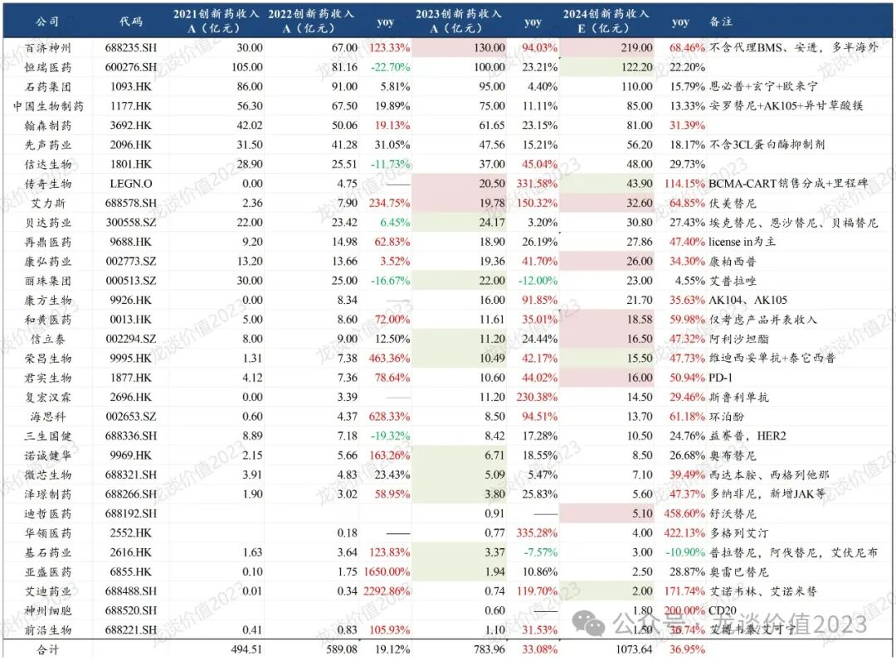
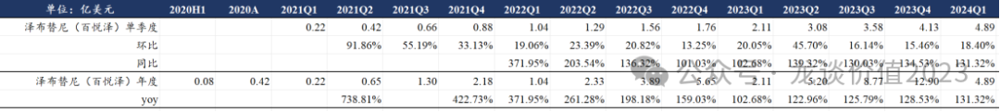
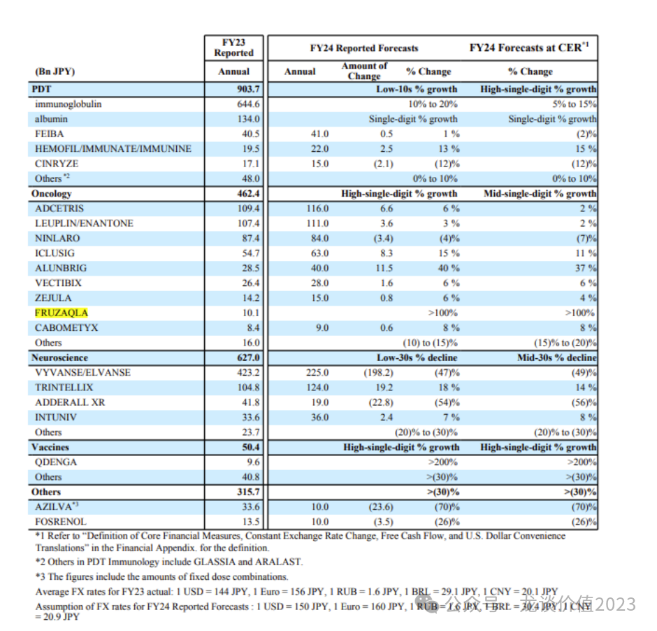
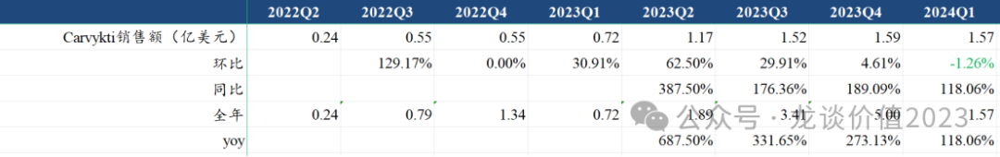
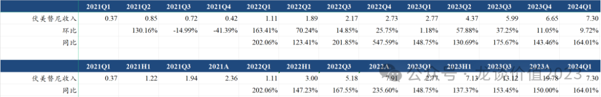
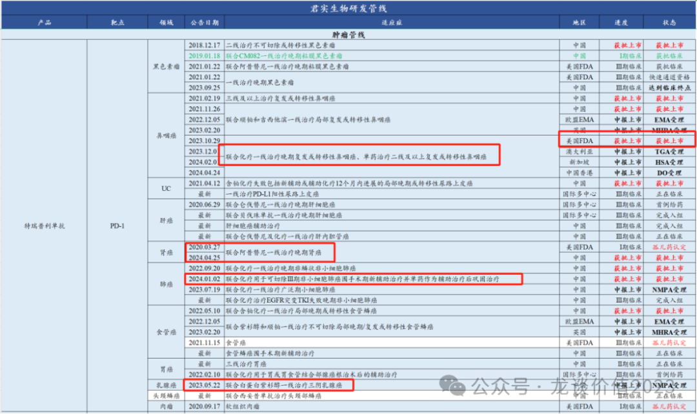

# 超预期的公司越来越多

大家好，我是龙哥。

除了诺诚健华以外的创新药行业一季报已经大致披露完毕，诺诚健华将在下周一披露一季报，咱们就不等了，来聊聊创新药行业的一季报。

**创新药行业2023年报来看：**

23年全年销售显著超预期的公司严格来说只有3家，包括出海的百济神州、传奇生物和国内为主的艾力斯，大部分创新药的国内销售在23年由于受到反腐对进院和放量的冲击而低于预期，偏利益品种的先声药业、丽珠集团、信立泰等受影响尤其大，销售比较佛系的荣昌生物、诺诚健华、微芯生物、泽璟制药、亚盛医药等各有各的问题。

但其中最重要的变化在于，相比于前两年的创新药销售低于预期主要是竞争恶劣和医保谈判降价（尤其PD-1单抗等）导致的业绩miss，**当前价格方面的影响已经相对较小，竞争压力仍然存在但绝大多数品种并没有PD-1这么夸张的竞争，biotech公司的销售miss主要还是和公司本身销售能力、执行力有较大关系**。

......

**创新药行业24Q1季报来看：**

**（1）国际化表现继续亮眼**

首先遥遥领先的是百济神州，百济神州在昨晚披露了24Q1的业绩，并在今早开了业绩说明会，泽布替尼全球销售势不可挡，Q1单季度销售同比增长131%、环比增长18.40%至4.89亿美元，全球销售额有望突破24亿美元/超过170亿人民币，已经是历史上国产药品单品销售峰值的2倍有余，当然这还远不是泽布替尼的巅峰。

其次是和黄医药，刚好今天武田制药披露了最新的财报，披露数据显示呋喹替尼在其财报周期（2023Q2-2024Q1）实现了101亿日元的销售额，大概对应6500万-7000万美元，按23Q4销售额约为1510万美元计算，24Q1实现了5000万-5500万美元销售额，放量速度也是远超市场预期。另外再4月26日欧盟人用药品委员会（CHMP）建议批准呋喹替尼用于三线结直肠癌的适应症，预计近期就可以看到呋喹替尼在欧盟的获批，下半年还有望在日本获批。

国产新药出海的3家里，唯一在Q1表现较为不佳的是传奇生物，BCMA-CART在去年底以来在欧洲和美国都有新产能投放，但是销售额环比出现下滑。

**（2）国内大单品公司展现潜力**

艾力斯在23年销售火爆、24年增长预期不低的情况下进一步超预期，除了收入端的超预期，艾力斯一季度利润率达到了离谱的41.2%，且产品尚未达峰，其中有研发费用削减的因素，但大单品的盈利能力确实让人震惊。

康弘药业24Q1超预期，已经是连续3个季度超预期，康柏西普23年医保谈判未降价后火力全开的销售，但应该是其达峰前的倒数第一/第二年，竞争格局将快速恶化，目前来看后续品种的承接还看不到。

迪哲医药Q1销售环比增幅57%超预期，EGFR这个靶点成就了贝达药业、翰森制药、伏美替尼三家公司，但也没有止步于此，迪哲医药有望成为第四家。肺癌国内新发患者数已经超过100万/年，而EGFR突变在其中的占比超过40%，也既每年有超过40万的新发患者+近百万的存量患者，是超级庞大的患者群体，有成为国内肿瘤药第一大靶点的趋势。

**（3）从1到N的拓展带来业绩加速**

信立泰在Q4-Q1也开始出现销售端的显著复苏，创新药数量从1到N的突破。类似的还有贝达药业，但贝达药业24Q1的销售.......一般般吧，中国最早的创新药公司之一，在肺癌优势领域被艾力斯反超了，要我说，奇耻大辱！

君实生物Q1销售略超预期，全年创新药销售预期小幅上调，君实生物的销售也是让人一言难尽，经历几年的艰难困境，在PD-1多个独家适应症获批或申报的背景下，以及PD-1美国上市销售的销售分成，应该会有一轮显著的加速增长。

再鼎医药刚披露的一季报也是表现还不错，艾加莫德上市3个季度，23Q3-23Q4都是500万美元左右销售额，24Q1实现1320万美元销售额环比大幅增长，也是23年底医保谈判成功以较高价格纳入医保的代表性品种之一，其他品种环比23Q3-Q4也都有不同程度的修复。

**总体来看，超预期的公司主要是三类，一类是国际化，独家或具有显著竞争优势品种的高速放量，如百济、和黄，传奇后续也还有潜力实现较好的表现；另一类是大单品公司包括艾力斯、康弘、迪哲，超预期的趋势具有较好的持续性；还有一类是产品线或适应症扩张的公司包括信立泰、君实生物、再鼎医药。除了收入端超预期外，反腐的环境下大部分公司的费用率有显著下降，利润端也有较好的改善。**

......

**另外点名几家24Q1低于预期的重点公司：**

HR医药Q1收入环比增长10%，预计创新药放量速度依然偏低。

RC生物Q1销售继续弱势，公司延续佛系、但费用支出依然很大，销售miss但控费力度不足。

AD药业Q1抗HIV药物销售略低于预期，但其放量初期季度波动正常，还可以继续跟踪。

*风险提示：本文仅讨论行业/公司经营情况，投资需综合考虑公司经营、估值、管理层等多方面因素，建议读者审慎参考，本文不作为投资依据，不建议大家根据本文做出投资计划。*

<!-- wxmp-comments-begin -->

---

## 留言（19 条，含回复共 43 条）

- **口天吴** 👍3 · 2024-05-09 17:08
  医药这跌的太惨了，没有之一
  - ↳ **作者** · 2024-05-09 17:14
    申万一级行业，医药已经从倒数前三倔强反弹到倒数第8了[叹气]和好的没法比，和差的比，还是比电子和计算机好的
  - ↳ **作者** · 2024-05-09 19:08
    最近两三周的超额还是很明显的
- **吴永文** 👍2 · 2024-05-09 17:45
  龙哥，诺辉健康到底是不是造假呀公司也没个人出来回应，看起来很麻烦啊[流泪][流泪]
  - ↳ **作者** · 2024-05-09 17:56
    我再了解了解情况，可以下篇文章再来问一下
  - ↳ **作者** · 2024-05-09 19:07
    如果只是减计部分收入，没有实质性问题，建议公司趁着最近港股行情好的时候赶紧复牌……
- **陆文瀚** 👍2 · 2024-05-09 22:43
  龙哥&nbsp;AD企业是哪家啊
  - ↳ **作者** · 2024-05-09 22:54
    艾迪呀
- **禁止的鱼** 👍1 · 2024-05-09 17:20
  龙哥，如何看待生物类似物出海前景啊，如百ao泰
  - ↳ **作者** · 2024-05-09 17:29
    生物类似药出海，放量短平快，又符合我们制造业大国的定位。就是天花板有点低，看品种。
  - ↳ **作者** · 2024-05-09 17:30
    国内做生物类似药的几家，百奥泰，复宏汉霖，神州细胞，进度上和销售放量都还不错。
- **cheng** 👍1 · 2024-05-09 18:24
  医药行业里个股机会还是挺多的，买着买着，医药又成持仓第一权重行业了
  - ↳ **作者** · 2024-05-09 18:41
    是的，也要细选
- **王坡** 👍1 · 2024-05-09 19:36
  信达也没什么亮点吗？
  - ↳ **作者** · 2024-05-09 22:03
    信达生物23年报业绩不错的，也显著减亏，Q1只公布了一个17亿的产品收入，是正常水平，没啥其他信息。
- **XX莲** 👍1 · 2024-05-09 20:52
  龙哥，启明停牌这么久，有什么消息吗？幸好买的不多
  - ↳ **作者** · 2024-05-09 22:05
    他之前因为资金占用停牌，我好久没跟踪了，不知道啥情况
- **流年催流水** · 2024-05-09 17:09
  能聊聊华东医药吗？
  - ↳ **作者** · 2024-05-09 17:59
    短期似乎没什么看点，利拉我是不觉得能有太大的增量，管线来看效率低了点，医美也显著降速，医美全行业估值都杀的比较低了。
- **张建坤** · 2024-05-09 17:13
  龙哥，一季度超预期的创新药企，能带领临床前研发走出低谷吗
  - ↳ **作者** · 2024-05-09 17:16
    一二级市场的确都在回暖，不过你说的这靠几家biotech带行业也不现实啊，还是要靠资本市场的信心恢复。
- **李大媛** · 2024-05-09 17:17
  龙哥，金斯瑞怎么看
  - ↳ **作者** · 2024-05-09 17:58
    金斯瑞如果看各项业务，都还不错，生命科学去年还不错，给的今年的指引也挺乐观，传奇一季度miss些也不是就不行了。现在主要大家担心的是涉及到一些中美zz因素不太好解读。
- **Cyanine** · 2024-05-09 17:29
  海思科和科伦，这两家股价最近为什么那么猛
  - ↳ **作者** · 2024-05-09 17:32
    科伦药业，三大业务，原料药中间体在川宁，核心产品kuku涨价，业绩炸裂。大输液，去年下半年以来的呼吸道疾病，输液需求也还不错。创新药业务，科伦博泰是下一个国产新药出海之光，股价也kuku涨。
- **隐隐** · 2024-05-09 17:34
  科技都起来了，港股创新药还在地板上趴着呢，据去年底还有二三十个点呢。[撇嘴]
  - ↳ **作者** · 2024-05-09 17:34
    ETF起不来，主要是CXO的原因[流泪]头部的优秀创新药公司都反弹不少了，很多都今年转正了。
- **BO** · 2024-05-09 17:45
  龙哥&nbsp;有空讲讲爱博的一季报&nbsp;如果诺辉有最新消息也可以讲讲哈&nbsp;好久没讲医疗器械了
  - ↳ **作者** · 2024-05-09 17:52
    器械我最近也看的很多，主要是器械都是一个个的细分赛道和小公司为主，不像创新药直接梳理整个行业。
    爱博的一季报挺好的，隐形眼镜应该是继续超预期，人工晶体应该也还不错，不过集采在Q2应该会有点影响，后面就是硅水凝胶的隐形眼镜和PR，继续做产品线拓展。
    诺辉暂时我这也没消息。
- **Cyanine** · 2024-05-09 17:47
  龙大，信立泰不止阿利沙坦，还有恩那度斯司他在卖
  - ↳ **作者** · 2024-05-09 17:54
    嗯嗯，这个表做的比较久了，有些公司只更新数据忘记更新品种，信立泰这两年陆续会上比较多新品种。
- **研磨师** · 2024-05-09 17:49
  益方生物的贝福替尼会不会在Q2超预期呢？看最近的数据，比艾力斯的好很多啊，不过销售能力就看贝达能不能跟得上了
  - ↳ **作者** · 2024-05-09 17:55
    这我没法盲猜啊，看到数据再说呗，贝达这边挺有信心的，医保谈判价格也很好。
  - ↳ **作者** · 2024-05-09 17:55
    但贝达miss也不是一次两次了[撇嘴]
- **聂士飞** · 2024-05-09 20:50
  医药个股没能力选，还是投恒生医药ETF比较省心
  - ↳ **作者** · 2024-05-09 22:03
    投ETF弹性肯定要弱，但投ETF也相对会有底吧。
- **张朝晖** · 2024-05-09 21:43
  龙哥，锦欣生殖和海吉亚有跟踪么
  - ↳ **作者** · 2024-05-09 22:07
    海吉亚医疗有跟踪，经营层面24年比23年底的预期还是要好一些的，只是现在医疗服务全行业杀估值比较明显，内部横向对比一下吧，就是如果爱尔这些的估值继续往下到和海吉亚差不多或者仅略高于海吉亚，那他就很难说估值性价比了。
  - ↳ **作者** · 2024-05-09 22:08
    从中期来看医疗服务这种持续经营的商业模式和优秀的现金流，我认为哪怕增速显著降速，也该是估值下有底的，具体就是根据长期复合增速和股东回报情况判断估值底。
- **Shawn** · 2024-05-09 22:05
  龙哥，我还拿着昭衍新药和凯莱英，三年多了，很难受，有希望吗？[流泪]
  - ↳ **作者** · 2024-05-09 22:10
    不知道你为啥会把CXO拿到现在，但既然拿到现在了，又都还算是各领域比较优秀和稳健的公司，行业应该处于底部了，至少情况比半年前、一年前要能看到希望。但还是要提示，要及时关注中美ZZ因素对CXO行业的影响，包括对药明系的潜在影响会不会扩散，这是有些不确定性的。
- **张立超** · 2024-05-09 23:47
  龙哥，健康元呼吸药有点增长放缓迹象，化药和精神科也接力不上，未来是否还值得拿，都拿了4年了，就围绕我的成本上上下下的。
  - ↳ **作者** · 2024-05-10 00:13
    他不是增长放缓，主要是左沙丁胺醇集采短期影响，后面看舒利迭和吸入妥布霉素这些新的大品种吧，公司对这块指引还挺乐观的。

<!-- wxmp-comments-end -->
