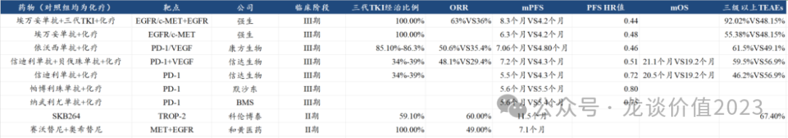
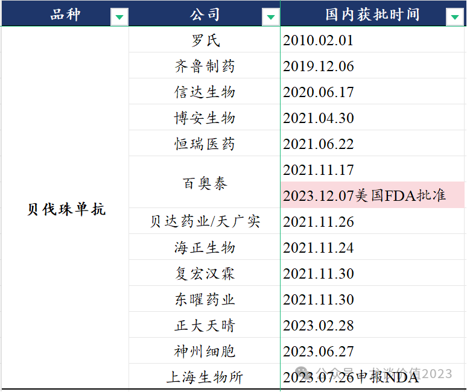
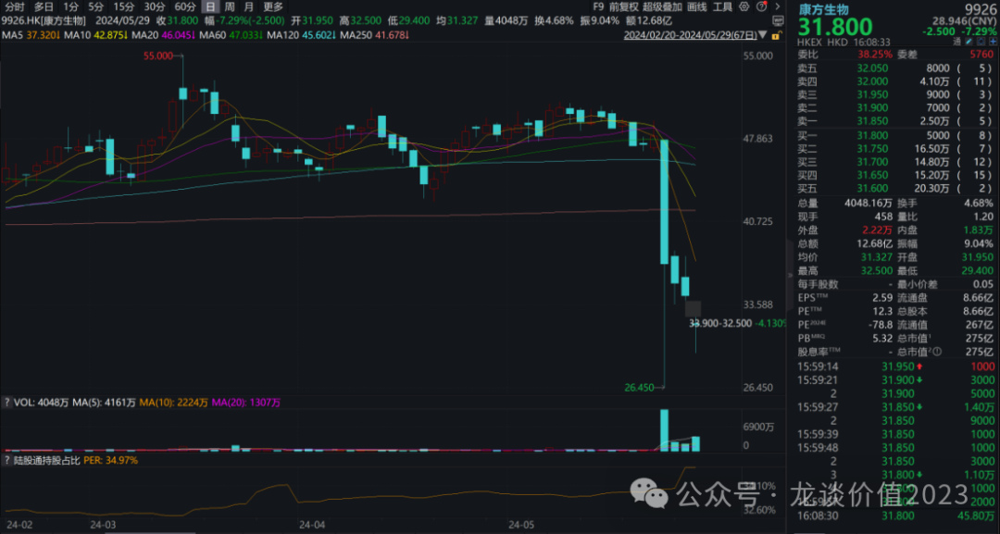
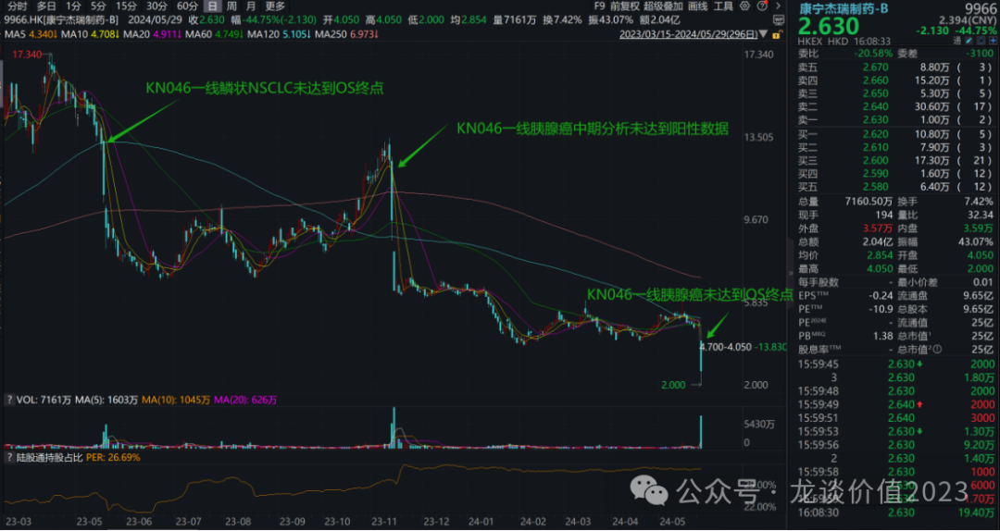
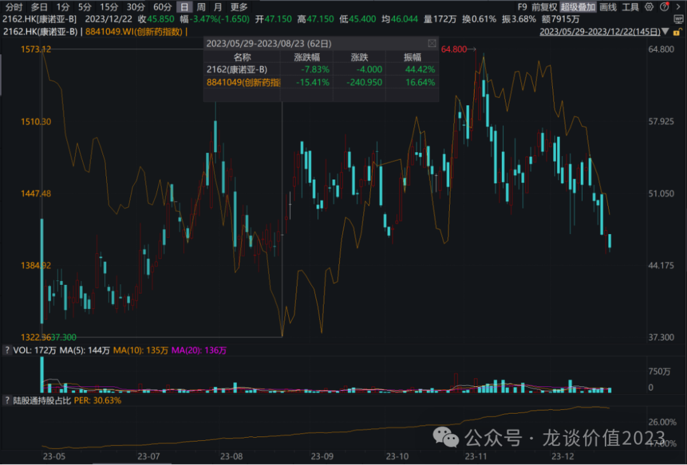

# 谨慎乐观

大家好，我是龙哥。

这两天创新药行业波动很大，尤其是“两康”——康方生物、康宁杰瑞两家国产双抗头部公司出现一些变化，不但两家公司股价大跌，而且对整个创新药行业乃至医药行业带来负面影响。

这里我们先聊聊两家公司的情况，然后再谈一下对行业的影响及对未来的展望。

***01***

**康方生物的负反馈**

康方生物自2022年12月将AK112（PD-1/VEGF双抗）以5亿美元首付款、合计50亿美元交易对价授权给summit后，一直是国产创新药之光之一，AK112国内和海外挑战K药的潜在重磅炸弹机会，让众多投资者非常关注康方生物的一举一动，国内也陆续有多家biotech公司的PD-1/VEGF双抗IND和进入临床阶段。

5月24日一早我们看到了康方生物AK112首次发布用于TKI耐药的EGFR+NSCLC的III期临床数据，这个数据对比如下图所示：

注：强生和信达生物的III期临床都是2组实验组，为方便对比，均将其分两行呈现。科伦博泰与和黄医药都是II期单臂的数据，且和黄的数据是MET高表达人群的数据。

**（1）看数据**

从数据本身来看，大家担心的问题主要有几点：

①ORR：II期临床是60%+，III期临床即便有下降，此前最低的预期也有53%，实际只有50.6%，略高于信达生物的48.1%。

②PFS：II期临床是8个月+，III期临床下降到7.06个月，还不如信达生物的7.2个月。

③OS：数据没披露，电话会交流也仅说看到OS获益趋势，还没有看到实在的有统计学意义的OS获益。

④三级以上TEAEs：高达61.5%的三级以上不良反应，要高于信达4药联用的55.38%，双抗相比单抗联用没有更好的安全性数据。

这里我们要解读四点：

第一，各个临床入组的患者基线不同，互相之间并不是头对头，例如最重要的一个指标是三代EGFR经治比例，强生、和黄/AZ都是选择100%入组三代TKI耐药人群，而国内的临床入组比例各有差异，最高的康方入组到85%-86%应该是更加接近未来国内EGFR TKI耐药NSCLC患者人群的基线的，其次科伦博泰的II期临床入组比例是59%，信达生物则是34%-39%。除了三代TKI经治比例外，影响因素还有T790M突变比例、平均年龄、其他慢性病和并发症等等差异，入组患者基线的差异，使得各临床数据之间并不具有横向对比的价值。

第二，有PFS的HR值的情况下，PFS的绝对值和ORR的绝对值的重要性都显著下降，PFS受基线影响较大，而HR值更加客观，依沃西的HR值0.46从以上数据对比来看是非常优秀的表现，强生的埃万妥单抗+三代TKI+化疗的组合是目前唯一有更优PFS的疗法，但其有92%的三级以上不良反应发生率，且没有达成OS获益，而强生主要推的埃万妥单抗+化疗的组合的HR值是0.48，PFS是6.3个月，略逊于康方的数据，当然，强生入组患者100%是奥希替尼耐药患者，因此PFS的绝对值没有直接横向对比的意义。

第三，三级以上不良反应发生率以及四级乃至五级（致死）的发生率可以作为药物对患者综合获益的评估指标之一，但最终落实到临床结果上，是直接体现在OS能否获益上，因此OS获益水平是评价AK112临床数据到底如何优秀的重要指标之一，但可惜康方生物并未披露OS数据，其OS数据尚未成熟，且后续很可能也不会再披露完整的OS和HR值，仅是在电话会上夏瑜总表示看到明显的OS获益趋势，两条曲线拉的很开，仅此而已。

第四，由于III期临床相较II期临床的数据有较大幅度的下调，导致其相比ADC的竞争的不确定性被放大，科伦博泰的SKB264不但在II期中展现出11个月的遥遥领先的PFS，在ASCO最新公布的PD-L1+SKB264用于一线NSCLC也展现出非常优秀的数据，Q3W组达到15.4个月的mPFS，也既AK112未来在TKI耐药肺癌、一线肺癌的潜力都要准备好迎接ADC或PD-1/L1+ADC组合的考验。

那么总结就是，ORR和PFS比预期低，但PFS的HR值非常好，但OS获益又比预期差，同时潜在竞品数据又超好。

**（2）数据对基本面/估值的影响**

其影响又可以归纳为对国内和海外的影响：

对国内，AK112在该适应症上未表现出与信达的PD-1+贝伐珠的本质差异——PFS HR值接近、OS都没达到终点，则意味着其定价可能很难显著超出PD-1+贝伐珠很多，PD-1现在大家都知道年治疗费用3-4万，而贝伐珠虽然目前价格还较高，但国内已经高达13家竞争者，贝伐珠的国内销售额在2023年已经突破百亿，预计2025年前后可能就会迎来集采，价格也会有显著下降，因此AK112的定价很可能会在15万以内，未来谈医保的价格不排除会谈到10万以内（纯个人猜测，非公司口径，仅供参考），那么销售峰值也将对应下调，当然也不排除公司对AK112仍极其有信心、坚持定很高的价格例如20万或更高，那么能否谈医保、能覆盖多少患者群体又是另一码事。

因此，总结对国内的影响就是下调AK112的销售峰值，从而对国内估值部分有所影响。

对海外，我们交流下来买方和卖方普遍是认为康方生物原本包含的100亿左右的海外部分预期的估值应该要至少砍掉40%-50%，原因是上述临床数据使得对其战胜PD-1的信心大打折扣。而更具代表性的Summit（包含的估值全部是AK112的海外权益）在该数据发布前的市值是30亿美元，上周五以来最低、最悲观时是腰斩跌到不到15亿美元，而昨晚又反弹回到20亿美元，相较数据发布前仍跌去三分之一，从外资对Summit的交易可以大致判断外资认为AK112海外的估值大概要砍掉30%-50%。

**（3）看短期股价波动**

从股价波动角度，周五当天早盘出现了极其严重的恐慌性杀跌，其中可能包含的因素有：①对数据miss的担忧，影响康方的国内和海外估值，尤其是海外估值影响程度是有分歧的，有机构认为海外估值该全剁掉。

②某配股机构因涉及内幕交易而被清盘，全面清仓其持有的包括康方、信达、博泰等biotech。

③由股价加速下跌引发的跟随市场的负面解读暴增，形成负反馈。

康方生物当前的股价和估值，有几个因素可以参考：

2022年12月康方生物在AK112海外重磅授权之前的、不含海外预期的估值是240-250亿元左右（授权拿到5亿美元首付款）。2023年1月康方生物最高点估值是420亿元左右，时隔一年后2024年3月创下本轮新高的估值是440亿元左右。

港股通的持股比例，在5月23日（数据披露前一天）、5月24日（暴跌当天）、5月27日（周一）、5月28日（周二）分别为33.92%、33.93%、33.97%、34.97%，也既在本轮暴跌三分之一的情况下港股通每天都是净加仓，换句话说就是本轮暴跌中股价的主导方应该还是HK的外资主导。

***02***

**康宁杰瑞之殇**

一年时间，帽子戏法，无需多言。

***03***

**行业影响**

对于创新药的投资而言，虽然我过去一年的时间里大多数时间都在给大家聊头部的biopharma和big pharma，但也经常讲**159892恒生医药ETF**，为什么呢，因为创新药的投资多数时候都是高风险的，尤其是多数投资人也并不会很分散的买一堆pharma/biotech，而是大多买那么三两只自己最看好的，而一旦遇到类似这种明星股暴雷，往往会导致账户被重伤，这次的康方生物、康宁杰瑞就又是一个警示。

分批拉开价差去买ETF或者定投ETF的策略从长期来看至少不会大亏，赶上一波行情还是蛮有机会赚钱的，而创新药不用担心一直没有行情、只用担心买的位置不好——在当前创新药行业难得的、几年维度的政策蜜月期和行业性的高速放量期。

下图是我们之前整理的**恒生医药ETF159892**的持仓结构，创新药在其中占比超过50%，之前最大的问题是CXO和互联网医疗的占比偏高，而因为CXO板块的持续大跌，预计CXO在持仓中的占比应该已经有进一步的显著下降，CXO对其影响，未来还是比较有可能持续减弱。

回到行业本身，今年这个行业表现与23年5月何其相似，相似点：①ASCO数据发布，去年ASCO亮眼数据不多，今年数据不少但如博泰等大多前期有预期，利好落地。②23年是biotech明星股之一康诺亚暴雷——CM310延后半年申报，24年是biotech明星股之一康方生物暴雷——AK112数据miss，期间还有康宁杰瑞在23年5月和24年5月分别失败一个大III期临床，股价均暴跌。2023年5月底开始到2023年7月底医疗ff对行业股价影响又持续了一个月，板块大跌了整整3个月。

事件对于医药投资人来说，接受创新药研发阶段的波动是必修课，尤其是对于FIC/BIC的品种原本就该是高风险、高收益（但切忌买到预期已经全面拉满的高风险、低收益标的）。

但对于非医药或者非创新药的投资人来说，浓眉大眼的明星股的暴雷，康方这种biopharma里被作为白马股的标的单日暴跌40%+，对其心理上的冲击是非常巨大的，带来的影响就是在一段时间里对创新药会是非常保守和谨慎，且会很担心手上持有的其他创新药标的出现类似的风险暴露。

也因此，无论是去年的6-8月还是今年，艰难时刻必然要经历，但这里我还是想给大家一些信心，画画饼。创新药行业始终很卷，超额收益来自超额认知+前瞻判断、提前获知消息、恐慌杀跌时的常识三者之一或全部，跟随市场解读行业和公司没太大意义。

正如我上一篇文章《[**超预期的公司越来越多**](http://mp.weixin.qq.com/s?__biz=MzkyMzQ3MDc3Mw==&mid=2247483908&idx=1&sn=1e88d3da4d12a97d45f4980f10663896&chksm=c1e5dcdef69255c85318c5474c73a5fe7f50627bb7c6a593e749bdf1d1e0a5ce759832020525&scene=21#wechat_redirect)》所言，从一季度来看国内创新药公司中业绩超预期的标的越来越多，全年来看2024年国产创新药收入规模将首次突破1000亿、达到1100亿左右，行业维持35%-40%的总量的高增长，其中必然会诞生很多机会。

除了收入端的高增长外，国内第一代的biotech头部公司中，复宏汉霖、神州细胞通过生物类似药的大规模销售已经实现扭亏，而2025年，我们将有望看到百济神州、信达生物、康方生物、和黄医药中的多家甚至全部实现扭亏，行业头部公司全面进入正反馈阶段——产品销售可以覆盖包括研发在内的所有费用支出，对于行业来说也是一个极其重要的里程碑，创新药将不再被作为“只吸血、不创造价值”的行业！

***风险提示：本文仅讨论行业/公司经营情况，投资需综合考虑公司经营、估值、管理层等多方面因素，建议读者审慎参考，本文不作为投资依据，不建议大家根据本文做出投资计划。***

<!-- wxmp-comments-begin -->

---

## 留言（18 条，含回复共 37 条）

- **范征** 👍5 · 2024-05-30 13:28
  龙哥，现在医药行业基本位于上证2600的位置，好多个股即将新低，而上证目前3100.。。风格化越来越严重，市场除了高股息狗都不买，极致抱团，太恶心了。请问您觉得医药行业出现那个催化剂才会出现转折点呢？反腐边际放缓或者结束会是其中之一吗？该怎么跟踪呢？谢谢
  - ↳ **作者** · 2024-05-30 13:31
    这个在之前的文章里也有提及，追求股东回报（成长/分红/回购）不会是短期的，会是长期趋势。当然我也认为股东回报不是单纯的高股息，是要平衡成长、估值与确定性，从正常逻辑来说经济增速放缓之下大公司的强者恒强是一个趋势，企业从成长期到成熟期提高股息率也是一个趋势。
  - ↳ **作者** · 2024-05-30 13:33
    那对于医药行业呢，现在最大的问题还是，创新药械短期是无法提供确定性、股息、回购的，所以我在文章末尾也写到，头部公司的密集扭亏，是有里程碑意义的。
- **虞涛** 👍4 · 2024-05-30 13:18
  龙哥，我踩中了康方，康宁，康诺亚，康哲，诺辉，长期套牢百济神州，长期定投恒生医疗，[破涕为笑]。真的是怕了港股了。。。
  - ↳ **作者** · 2024-05-30 13:36
    百济我过去不太看好，但公司大力控费的话，可能临近扭亏，还是可以重点关注他后续管线的进展的
- **符传明** 👍4 · 2024-05-30 13:52
  合成生物，新cxo的替代逻辑？川宁，华润是未来cxo的合成生物之王？
  - ↳ **作者** · 2024-05-30 14:10
    [撇嘴][撇嘴]
- **流年** 👍3 · 2024-05-30 13:17
  科伦药业怎么样，下有大输液保底，上有合成生物，创新药提供想像力
  - ↳ **作者** · 2024-05-30 13:35
    这个不就是去年初我们讲科伦的逻辑，川宁的合成生物还是故事阶段，抗生素原料药中间体格局相对稳定对川宁更有意义，大输液是科伦基本盘，贡献非常好的现金流，相对稳定。创新药在博泰，ASCO数据表现比较亮眼。
- **六爻** 👍3 · 2024-05-30 13:37
  贝达能不能杀出一条血路呢
  - ↳ **作者** · 2024-05-30 13:38
    他们这执行力和效率，感觉是被杀出一条血路的那个。艾力斯收入都超过他们了，真是耻辱。
- **禁止的鱼** 👍2 · 2024-05-30 13:43
  龙哥，如何看待海思科？管线惊喜连连
  - ↳ **作者** · 2024-05-30 13:44
    嗯，确实，几个重点管线集中兑现，可以往前翻几篇文章看下
- **老鱼** 👍2 · 2024-05-30 13:58
  龙哥，启明医疗以后这么看
  - ↳ **作者** · 2024-05-30 14:12
    这还看啥，被訾总玩坏了，也不知道啥时候能复牌。
- **琼琼** 👍2 · 2024-05-30 14:02
  南微医学怎么看？
  - ↳ **作者** · 2024-05-30 14:12
    集采完业绩稳定下来再看？
- **迷雾** 👍2 · 2024-05-30 14:11
  龙哥，药名生物杀到1pb了，为什么美国给了8年时间，还跌的这么狠，继续创新低
  - ↳ **作者** · 2024-05-30 14:15
    说是8年时间，没有美国新增订单，老订单逐渐退出，你说这估值咋给呢
- **赵财** 👍2 · 2024-05-30 14:13
  龙哥，怎么看这两天某激光企业的全球创新产品在医疗上的应用前景
  - ↳ **作者** · 2024-05-30 14:16
    我没去那个调研，这两天都在策略会上聊公司呢，听去调研的人说挺牛的，但这股价走的挺像是配合炒作出货的，有点恶劣。
- **Bryan** 👍2 · 2024-05-30 14:21
  感谢龙哥及时雨的文章，医药仓位拿了1/3的ETF，没暴雷的时候弹性好，其实做做T亏损都还不多的，现在越来越觉得要无论从投资体验还是最终收益角度看，都更应该多买ETF甚至全部买ETF!
  龙哥知道沛嘉什么情况吗？8000KW的事情实际应该没多复杂，管理层什么心思？
  - ↳ **作者** · 2024-05-30 14:22
    tavr三傻我基本放弃了，看好神经介入不如看归创
- **灵感自在** 👍1 · 2024-05-30 14:09
  龙大，这个位置的器械应该很有性价比了吧，特别是发光这块进口替代，海外扩张都很确定，你怎么看？安图，鸡蛋，感觉都很便宜，分红回购也不输价值股了
  - ↳ **作者** · 2024-05-30 14:14
    安图今年对行业观点连续几次变化，最近又说4月来国内受政策层面影响很大，发光增速大幅放缓。IVD现在还是定性的问题。
- **求索者** 👍1 · 2024-05-30 14:32
  最近两康、加斯科连续炸，创新药最重要的还是确定性。
  - ↳ **作者** · 2024-05-30 14:36
    加科思算炸吗，就小biotech就这样，创新药最重要的也不是确定性，玩确定性的就去搞pharma，搞迈瑞，搞公用事业，创新药玩的要么是行业贝塔，要么是高弹性。
- **高山景行** 👍1 · 2024-05-30 15:11
  龙哥，创新药九死一生，那类似于康宁杰瑞主要管线失败，基本结局就是烧完手中现金，等着死亡吗？
  持有康方，这次暴跌把前期盈利全部抹平，暂不亏损。康宁杰瑞只有迷你仓，暴跌前基本不亏现在打算直接割掉。突然有个操作层面的疑问，想问问龙哥和其他投资者，如果重仓大家一般会怎么办？
  - ↳ **作者** · 2024-05-30 18:20
    交易上要么设置止损价，要么就是有能力分析企业基本价值，然后用真金白银投票
- **ʚ飞火流星ྀིɞคิดถึง** 👍1 · 2024-05-30 16:01
  懂了，医药股不买带康字的，少很多雷[捂脸]
  - ↳ **作者** · 2024-05-30 18:22
    康方，康宁，康哲，康诺亚，前些年还有过康弘[撇嘴][撇嘴]
- **花呗** 👍1 · 2024-05-30 18:04
  龙哥，和黄最近也跌了十几个点，明天也在大会公布数据，是不是有内幕提前走人了
  - ↳ **作者** · 2024-05-30 18:25
    这个主要是跟着行业β回调吧，和黄底部起来一度涨了70%+，回调个十几个点对创新药来说还不是洒洒水啦。
- **江传席** 👍1 · 2024-05-30 18:59
  龙哥，网上已有康方112产品上市的说明书了，里面有最新OS曲线图，到2023年12月份HR0.8，你怎么看？张力教授6月1号可能会公布最新OS数据，这OS趋势到时加上海外112-03国际数据，有或什么预判，谢谢！
  - ↳ **作者** · 2024-05-30 20:34
    对，后面几天还在继续跌就是因为这个，OS没有显著获益，只是有个获益趋势，这个是50%的成熟度的数据，HR值的区间还非常大，随着数据进一步成熟，还会收窄，但我了解的是公司应该不会更新OS数据了，如果能更新的话当然更好了。
- **Bryan** 👍1 · 2024-05-31 08:39
  龙哥，康方应该逆转了[嘿哈]
  - ↳ **作者** · 2024-05-31 08:40
    是的，电话会上夏瑜总疯狂暗示303马上要发数据了

<!-- wxmp-comments-end -->
