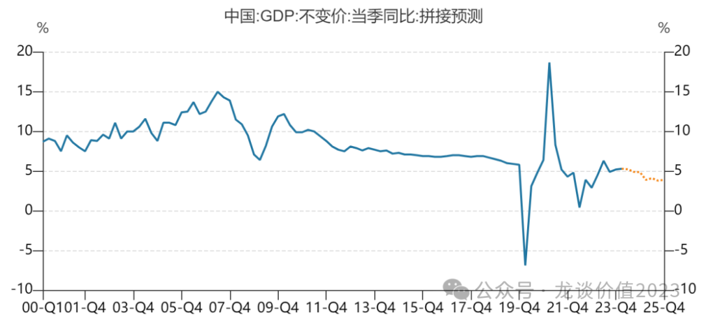
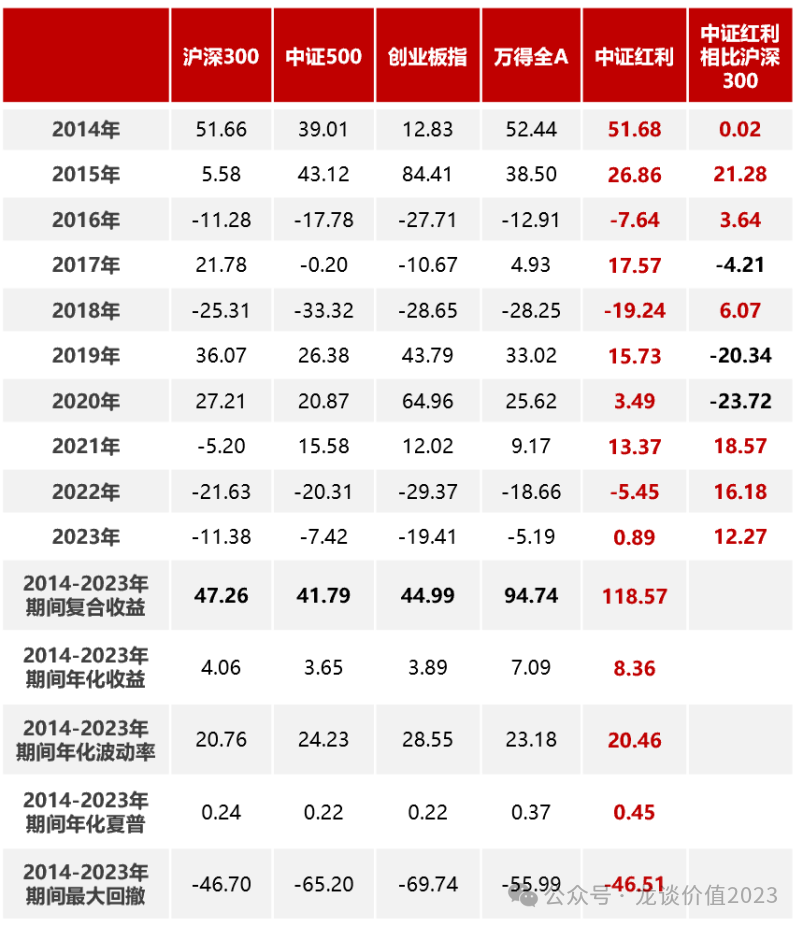
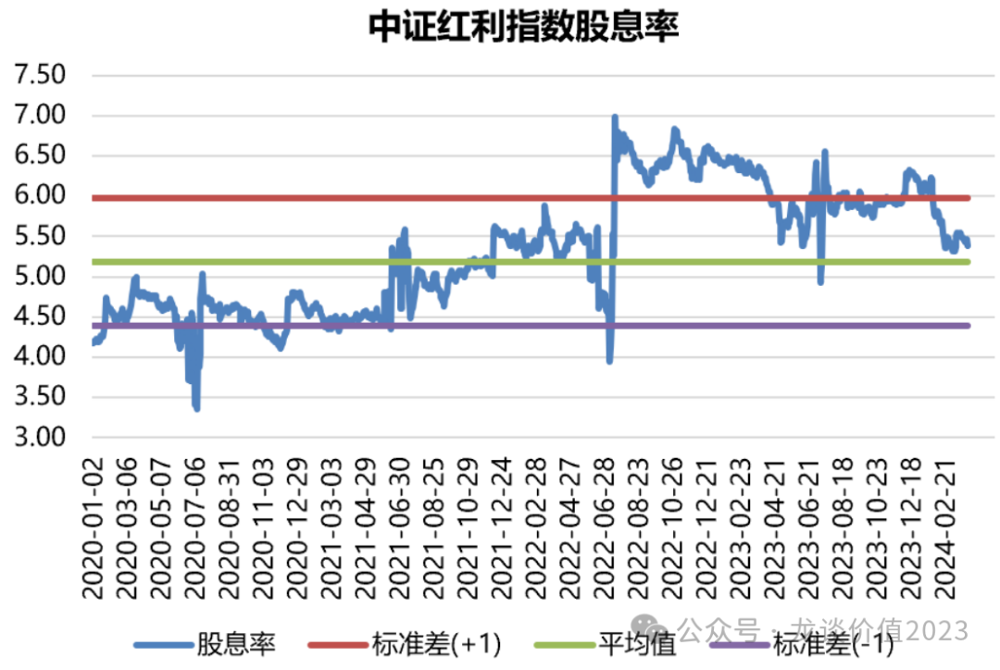
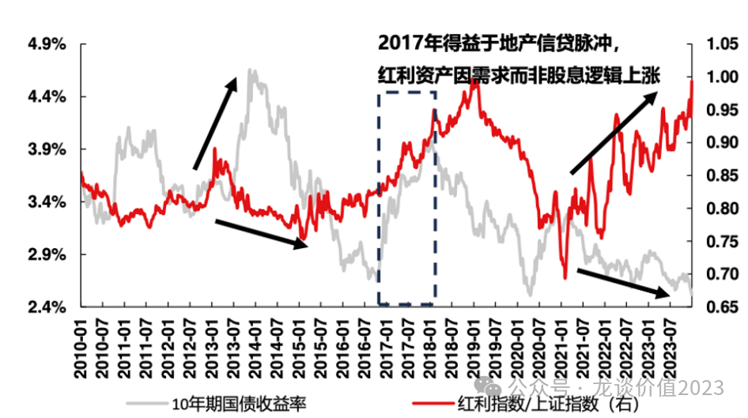
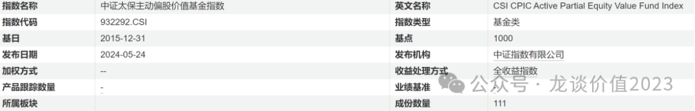
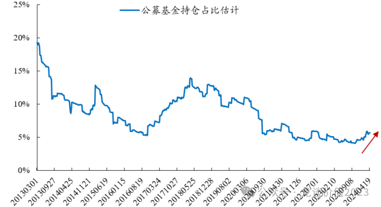
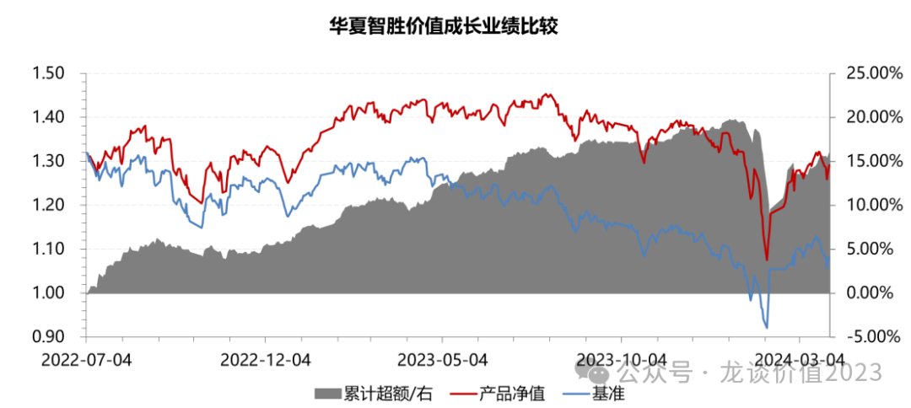

# 新思路、新趋势

大家好，我是龙哥。

在此前的文章中我们写到一个基本的理论，就是这一轮的高股息风格的演绎、小市值/微盘股的暴跌，实际上对于A股长期投资范式是会带来深刻影响的，他带来的是市场对于投资公司的本质——追求股东回报——的重视程度大幅提升。

但之前没具体聊这个事，因为红利策略上半年涨幅确实太大，高位预期一致的时候去讲反而容易误导大家，最近回调幅度比较大，反而可以和大家聊聊这方面的观点。

高股息、大规模回购、高成长都是可以带来股东回报的因素，在不同的估值水平、不同的行业景气度和宏观环境下，市场风格可能发生一些变化，导致不同股东回报因素影响下的估值差异，但其本质还是在于成长+分红/回购的综合评估。

这里又涉及到另一个策略，就是与量化相结合的红利策略，很多人谈到量化可能认为就是高频交易割韭菜，实际上远不止如此，由于我身边有不少朋友做相关的工作，我也真实感受到量化在基本面选股中的重要价值，当股东回报策略/红利策略与量化相结合，我们看到一个新的赛道。

***01***

**回归价值投资的本质**

价值投资最开始由哥伦比亚大学的本杰明·格雷厄姆创立，由伯克希尔·哈撒威公司的CEO沃伦·巴菲特的进一步发扬光大，其本质是实业投资思维在股市上的应用，以获取企业发展、扩大促使股票上涨所产生的收益。

投资上市公司，目前A股市场大多数投资者都是以投机的心态参与，持有一个公司的时间不会很长，希望企业基本面的改善或者和某种概念的共振带来企业估值的提升从而赚到较高的资本利得。

而对于真正的价值投资者来说，买入股票就成了公司的股东，和高管、基层员工一起扎扎实实办公司、创造财富、造福社会。随着公司愈加健康、盈利能力愈强，股东自然获得丰厚回报。

其中的区别在于买入是为了成为股东，和一级市场的股权投资类似，投资公司是通过给予资金的支持，成为股权的持有者，等待公司进一步发展壮大，给股东创造较好的分红/回购的回报，而这种回报，是周期相对较长的，企业不太会短期就兑现较高的回报，但是长期来看如果公司的前景很好、盈利能力持续提升，未来股息率和回购规模持续扩大，则可以带来潜在的远期回报，且在有效的市场环境下这种远期回报往往也不会真的到很远期才兑现、而是随着公司基本面的发展而持续兑现。

中国2000年以后经济高速发展，很多企业在短期的爆发性很强，酝酿了非常多短期增速快速提升或者概念主题投资的机会，而目前中国经济已经进入了经济的降速期，企业短期的爆发性成长的机会难以维持，概念主题的机会也在减少。

在这种时代大背景的变迁之下，对股票市场的投资哲学也在发生变化，短期的投机赚钱的概率越来越低，就好像潮水退去，就会发现谁在裸泳，很多曾经高光的企业在时代浪潮下可能被淘汰，很多故事说的天花乱坠的公司被不断证伪，包括我们医药行业在内，2020年以来的医药牛市也使得A股和H股上市了很多鱼龙混杂的公司，而4年过去，很多公司已经原形毕露。

对于这一点，国家已经指明了未来A股市场的发展方向。

4月12日，国务院印发新“国九条”《关于加强监管防范风险推动资本市场高质量发展的若干意见》，旨在建立健全监管制度、培育引入长期资金、促进金融服务实体，为资本市场改革指明了方向和路径。从上市端、投融资端、退市端三方面加强对上市公司进行考核与监管，强调上市公司质量。

未来真正注重股东回报的优质公司的投资价值将长期提升，而低质量、损害股东利益的公司将逐步退市。

这种时代大背景之下，回归价值投资的本质，投资于真正能盈利增长，带来良好股东回报的好公司，让“投机”回归为真正的投资，是在这个市场上生存下去、并能有一定回报的重要方式。

***02***

**红利策略具备长期超额**

巴菲特在投资实践中，不乏对高股息的股票或者是具有较强分红能力公司的一些投资，他长期持有并且获得比较丰厚的股息回报的一些股票，例如其重仓的早已失去成长性的可口可乐仍在持续创造价值。

红利策略长期来看在A股市场的表现非常突出，从2014-2023年十年时间，复合回报8.36%，显著高于其他的A股宽基指数，2024年以来上涨则是10.97%。**红利策略跑赢大盘并非短期风格使然，而是长期存在的趋势**。

历史表现复盘来看，红利指数在震荡市的表现非常好如2021年、2023年，在单边的熊市回撤也相对较小，拉长看是用更小的波动创造了更高的回报。

从基本面来看，房地产的下行将持续制约中国的经济复苏的力度，内需的疲弱带来对外需的依赖度较高，而外需的增长具有较高的不稳定性，L型的经济复苏很可能是复苏微弱+反复震荡的，在这种情况下，权益市场可能在震荡状态的时间长于历史。

资本市场当前面临的另一大问题是长期利率的下降，非标投资的退出，高回报率的产品非常稀缺，较多银行、保险早年间发售的一些产品的利率很高，现在难以再找到收益率达到原定产品利率承诺的资产，而高股息率的股票，是全市场来看具有稀缺性的高回报的资产，即便过去2年红利策略上涨较多，中证红利指数的股息率仍然超过5%，大幅高于2.3%的10年期国债和2.51%的30年期国债。

所以我们看到，**每一次长期国债利率的下行都伴随着红利策略超额收益的提升。**

目前我国受制于美国的高利率，利率下降的幅度还不够，但是若9月份美国开启降息，我国利率的下降空间打开，长期利率进一步下降，如此红利策略的超额收益很可能进一步放大。

即便红利策略过去2年表现较好，长期红利策略的拥挤度也远远没达到拥挤的程度，直观上可以看到，公募基金经历大部分都是偏成长的基金经理，偏价值的基金经理只是小部分，根据中证的基金指数分类，成长型基金有775只，价值型基金只有111只，数量差仍然差距较大，这种投资风格的变迁还需要漫长的时间。

整体来看公募基金对于红利策略持仓比例仍然在历史的低位，过去半年才开始慢慢提升。

观察红利策略的拥挤度有个不错的指标，就是看中证红利的股息率是否已经下降到接近长期国债利率的水平，那才是真正的拥挤了，目前还在5%以上，说明并不存在明显的高估。

**整体来看，红利策略的长期复合回报较高，并且更适合震荡市，当下在经济L型复苏下，市场维持震荡市的概率较高，并且叠加长期利率的下降，红利策略的投资价值较为凸显，并且目前远远未达拥挤时刻。**

***03***

**高股息+多维度数据分析：更前瞻的红利策略**

巴菲特认为的价值投资中就有寻求股息+时间，并且深谙盈利和管理两方面的逻辑框架。巴菲特的红利投资策略并不是简单的追求高股息率，他既考虑企业盈利，也考虑管理层，同时考虑现金流和时间。

目前红利策略核心的指数——中证红利指数（000922.CSI），是从沪深市场中选取100只现金股息率高、分红较为稳定的标的，尽管这个指数的历史表现已经相当不错，但是只看分红是远远不够的。

指数的编制逻辑是选取过去三年连续现金分红且过去三年股利支付率的均值和过去一年股利支付率均大于0且小于1的股票，再按照过去三年平均现金股息率由高到低排名，选取排名靠前的100只上市公司证券作为指数样本。整体就是选择过去3年现金分红率较高的个股，但是历史的分红水平并不代表未来的分红。

**企业分红=分红能力\*分红意愿**

通过历史的分红水平可以找出分红意愿高的公司，但是未来分红能力更多取决于公司的经营情况，需要结合公司其他维度的财务状况综合分析，这样相比采用历史静态的股息率线性外推，具有更强的前瞻性，可以达到增强的效果。

也因此，最近关注到一个红利增强产品——**华夏红利量化选股（A类021570、C类021571）**，基金经理是孙然晔，他在多因子选股上的投资经验非常丰富。在2014年开始在美国美银美林从事量化研究工作，2017年就职全美资管规模第二的一线对冲基金 AQR Capital 从事核心量化开发及投资组合研究工作，19年加入华夏基金，非常擅长采用多维度的基本面数据、海量的舆情等更加精细化的数据，采用先进的AI算法，选出更具有竞争力的股票。

他自2022年7月4日合管华夏智胜价值成长产品以来，截至2024年3月31日相对业绩比较基准累计超额收益15.80%。

对于华夏红利量化选股这只产品，基金经理采用中证红利指数作为业绩基准，以高股息策略为核心，并结合多维度的基本面、资金面、技术面数据，采用先进的模型算法预测未来收益，优选出在未来分红水平更强的股票，相比静态的中证红利指数，将通过优选个股争取获取更好的净值表现。

整体来看，高股息策略长期来看投资价值较高，而叠加上多维度的数据分析的红利增强策略，可以更好的结合企业分红、盈利能力分析和公司治理分析，将更加具有前瞻性，适应于市场的未来变化，可以给大家作为参考。

*风险提示：本文仅讨论行业情况，投资需综合考虑经营、估值、管理层等多方面因素，建议读者审慎参考，本文不作为投资依据，不建议大家根据本文做出投资计划。*

<!-- wxmp-comments-begin -->

---

## 留言（9 条，含回复共 20 条）

- **嘀嗒** 👍3 · 2024-06-19 12:12
  龙哥，爱尔这么一直往下是为啥
  - ↳ **作者** · 2024-06-19 12:27
    估值业绩双杀，业绩下调比较明显，在今年并入50家体外医院的情况下也就勉强做双位数增长，内生一塌糊涂，估值还有27-28倍。
- **1** 👍3 · 2024-06-19 12:14
  中证红利不才回撤5个点吗
  - ↳ **作者** · 2024-06-19 12:26
    嗯，中证红利到今年是9.6%，最近回调5个多点
- **momo** 👍2 · 2024-06-19 11:56
  近日，记者从相关方面获悉，康方生物自主研发的全球首个肿瘤免疫双特异性抗体新药卡度尼利单抗注射液（PD-1/CTLA-4）的价格将下调，单支价格从原来的13220元降为6166元，降幅为53.4%。
  
  
  有创新的，不也照样腰斩，终于发现，所谓的保护创新药，都是放屁
  - ↳ **作者** · 2024-06-19 12:29
    这个是康方生物主动下调价格以准备进医保，之前康方是有赠药的，这次调价相比赠药后的价格下降并没有那么多，不要看个消息就无脑喷。
- **隐隐** 👍1 · 2024-06-19 12:40
  爱龙哥！请问龙哥如何看待现在的医药和医疗etf行业？或者去万民远总这类的主动基金？[破涕为笑]
  - ↳ **作者** · 2024-06-19 12:45
    行业β一时半会起不来，etf就只能定投，就这样[捂脸]主动基金投资有一个大的前提，业绩一定是规模的敌人，任何领域，包括基金投资，要想有超额，就要避开扎堆。
  - ↳ **作者** · 2024-06-19 12:45
    我个人倾向于指数基金或者指数增强
- **禁止的鱼** 👍1 · 2024-06-19 13:11
  龙哥，请问如何看待药品比价政策的短期、长期影响？
  - ↳ **作者** · 2024-06-19 13:14
    目前来看对药店应该是潜在的负面影响，药店的价格要和挂网价、进院价、线上价去比价，倒不是一定要比最低价，但比平均价的话也是潜在负面的。另外我想看看互联网医疗的价格能不能往上走，像京东健康毛利率也才20%出头、还有10%的仓储配送成本，如果线上能提价，互联网医疗可能还能看看变化。
- **求索者** 👍1 · 2024-06-19 14:23
  龙哥这是要转向红利了吗？医药不搞了?
  - ↳ **作者** · 2024-06-19 14:32
    不会，医药里也有红利，理解投资的本质对看任何行业都很重要呀
- **饶鑫** · 2024-06-19 15:12
  港股里的民营医院龙哥看好哪个？我看估值也不便宜啊
  - ↳ **作者** · 2024-06-19 15:57
    海吉亚还行，按现金流贴现来算
- **Bryan** · 2024-06-19 15:45
  其实港股互联网也可以看作一种优质红利，或者说红利只是类型特征，根本还是企业价值，只是我们以前经济增长习惯了成长股投资，现在阵痛期自然就有点均值回归的感觉。
  龙哥，诺辉有什么小道消息嘛[捂脸]，我发现我港股踩坑是真多
  - ↳ **作者** · 2024-06-19 15:58
    是的，港股大量的低估值红利股。
    诺辉审计到后期了，应该快结束了吧。
- **詹姆士** · 2024-06-20 21:08
  请问龙哥A类，C类基金有啥区别？
  量化交易的本质不就是高抛低吸吗？
  谢谢
  - ↳ **作者** · 2024-06-20 21:26
    A类是偏长期持有的，长期持有的费用率低，但短期持有的赎回费很高。短期持有就买C类。
  - ↳ **作者** · 2024-06-20 21:26
    量化投资，高频量化交易只是其中一种，量化用于短中长期选行业、选个股也是很有价值的。

<!-- wxmp-comments-end -->
