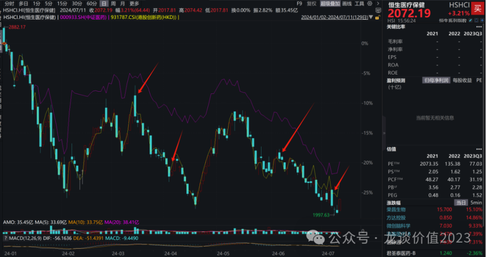
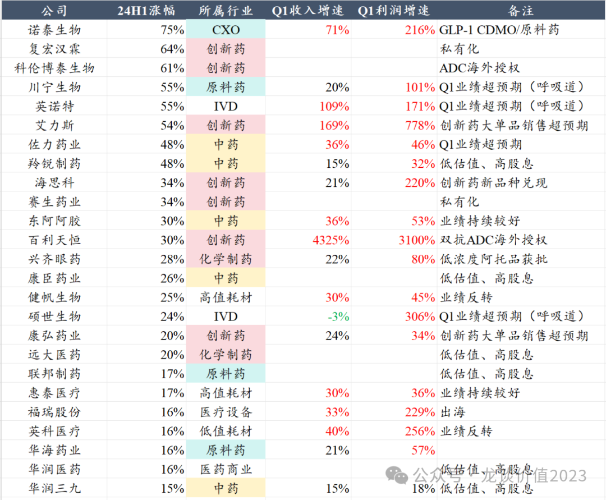
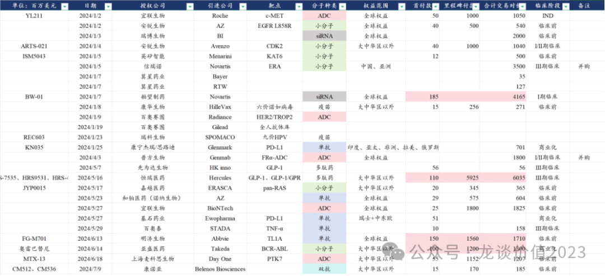
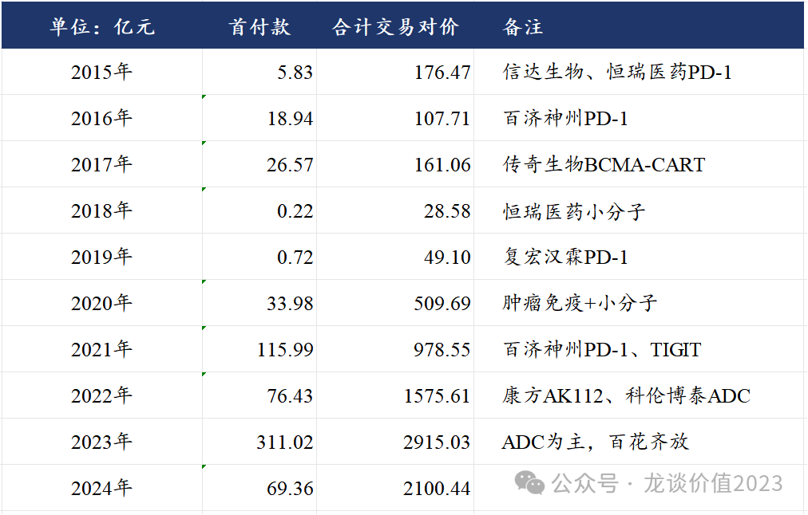
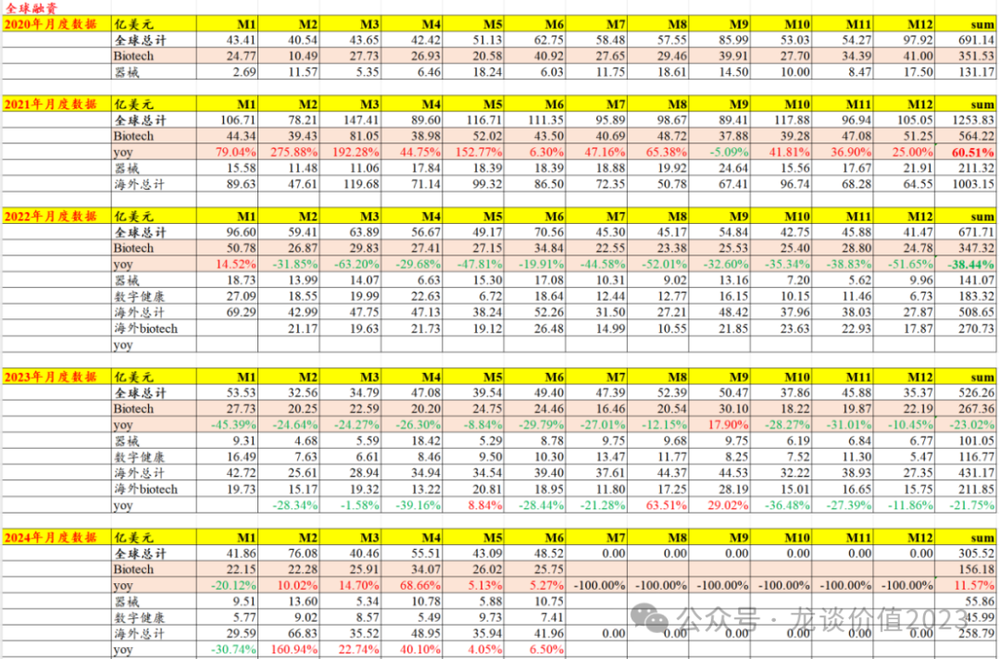
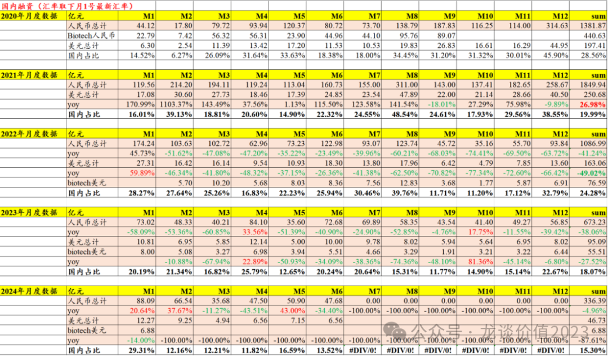
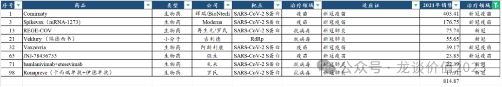
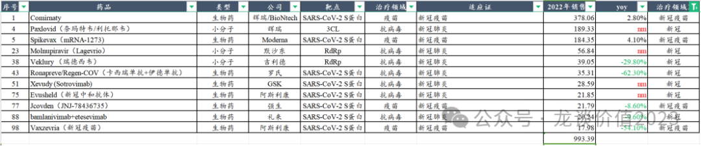
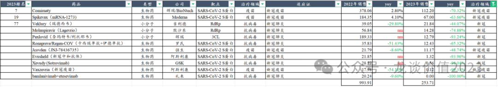

# 半年度总结，可以乐观一点

上周五，国务院总理主持召开国务院常务会议，审议通过了《全链条支持创新药发展实施方案》，这个文件相信大家不陌生，在3月份曾经有网传的文件内容，当时不少人认为文件内容太理想化、太乐观，甚至很多怀疑文件的真实性，而目前文件已经正式审议通过，以此为引，我们来总结下医药行业艰难的上半年。

***01***

**上半年医药政策之殇**

今年医药行业的政策面利好满打满算出现过4次，分别是：

①3月13日市场传出全链条支持创新药发展的征求意见稿，当日板块即有所反映，但当晚各方解读后认为文件内容太乐观、太理想，财政能给多少钱不确定，初步意见稿到定稿还需要较长时间等，3月14日医药行业大幅高开后高开低走并成为阶段高点，此后1个多月AH医药指数分别跌10%、20%。

②4月7日北京、广州、珠海同时发布创新药领域支持政策，类似以上全链条支持创新药发展实施方案的试点，但随后清明节后开市A股医药板块反而低开低走跌2%，随后AH反弹2天后继续下跌创新低。

③6月6日国务院发布2024年的深化医药卫生体制改革文件，其中首次提到了“制定关于全链条支持创新药发展的指导性文件”，这是首次官方口径提到该文件的制订，后AH医药指数均单边下跌10%左右。

④7月5日上周五盘中传闻全链条支持创新药发展文件将落地，医药行业大涨，随后周五晚确实落地，周一反而板块暴跌创新低。

总体来看今年医药股价与政策面的相关度偏低，政策利好出台反而容易是阶段高点，每当给大家期待的时候反而股价是背道而驰给大家巨大的失望。

究其本质，国内很多投资人对医药行业的“反转”始终有比较多的认知偏差，例如总认为当前行业的艰难处境全部是来自于政策的打压、只要政策支持了就可以反转，**医药行业跌了这么多，必然是内部本身就存在很多问题，又岂会因为一张A4纸就能真正反转？**

政策面对创新药的支持力度，这两年实际上在逐年递增，从过去我们多次分析的医保谈判结果就可看出，但除了行业原本的低效内卷之下的产能过剩，再比如涉及到CXO海外逻辑的破坏，**属于政策面和常规逻辑分析都无法预判的黑天鹅，严重冲击了今年的医药指数，****如恒生医药ETF（159892）等在前期也深受影响**。再比如忽视创新药行业的本质——巨大的分化，九死一生，极少数的成就以成百上千的biotech铺路......

***02***

**上半年行业表现较好公司**

A股+H股的国内医药企业在上半年股价涨幅超过15%的公司都在这里了。

由于H股不披露一季报，**A股股价表现来看总体与Q1业绩表现的相关度较高，且行业总体在Q1呈现比较显著的利润端表现显著好于收入端，**预计主要是医疗反腐、行业性的裁员和降本控费及提高人效带来的利润率提升。

其中，创新药+化学制药行业今年涨幅靠前的标的分布比较复杂，最核心的还是大单品销售/出海超预期，个别是新产品横向兑现逻辑。

- 私有化：复宏汉霖、赛生药业
- **大单品超预期：**艾力斯、康弘药业、兴齐眼药
- **创新药海外授权/ADC：**科伦博泰生物、百利天恒
- **新产品兑现：**海思科
- 低估值：远大医药

国内有创新药商业化的上市公司满打满算也要三四十家，创新药海外授权的更是大几十家，但从每年的复盘来看，真正每年能跑出来的公司一只手就能数得过来，大多数biotech在第一轮的产品爆发后也没有能力开发下一代的管线，行业长期都将是淘汰赛。

***03***

**上半年创新药海外授权**

上半年中国创新药海外授权总体数量和总交易对价还是比较可观的，**相比于前两年更多的临床阶段甚至商业化阶段产品的海外授权，今年以来则更多的临床前的分子进行海外授权**，这也使得首付款的规模大幅缩减、里程碑付款规模较大，而我们知道首付款是真正切实拿到手的现金，里程碑付款是有较大不确定性的......

**从项目类型来看24年的创新药海外授权的分子种类更加丰富多样**，小分子、单抗、双抗、ADC、疫苗、多肽、siRNA等均有涉及，这是个比较好的现象，我们也是更期待行业可以百花齐放而不是都拥挤在几个热门靶点和分子种类上。

***04***

**上半年医疗健康融资数据**

这个融资数据可见，**海外医疗健康领域的一级市场融资已经有了比较显著的修复**，而国内医疗健康领域一级市场融资在经历前两年远大于海外市场的下滑后，到24年上半年同比仍未转正，全球市场则是已经实现双位数增长。

除了这个融资数据以外我还想说一点，

**2021年：**

**2022年：**

**2023年：**

这几年的新冠疫情，海外大药企可谓是赚的盆满钵满，**2021-2023年这三年海外大药企通过新冠药+新冠疫苗赚了超过2000亿美元的现金**，这种大的疫情反而成为海外药企疯狂赚钱的机会。

而国内市场我们知道，做新冠药+疫苗的企业，除了国药、科兴、智飞、君实（海外授权）外，**几乎最终都是悉数亏钱的亏钱、计提减值的计提减值，不但没能助力行业腾飞，反而给很多药企和疫苗企业增添了巨大的负担，**这些影响并未在医保数据、行业融资数据里体现出来，但却客观存在并此消彼长的在拉大国内药企与海外的差距。

***05***

**展望下半年**

**①政策面：**关注后续将发布的全链条支持创新药发展实施方案的正式文件内容，尤其是其中最重要的关于中央财政对创新药支付端补贴能否真的出现在正式文件里，这点是最重要、也最可能被删掉的一条，如果没有真金白银的投入在支付端，则实施方案对行业总体的影响程度会大打折扣，但总归来说政策面在ff的背景下对创新药还是在努力做的友好的，创新药的新质生产力的定位也是比较靠前的。

第二是关注Q2又开始愈演愈烈的医疗FF，对常规诊疗、设备采购的影响客观存在，到7月底8月初将是这轮ff的一年整，关注是否会有个阶段性的总结。当然，ff对行业的深远影响我认为是长期的。

**②业绩层面：**这两天业绩预告很多大幅下滑和亏损的医药公司，叠加极少数能超预期的公司，属于蹚地雷阵的几天，大多业绩表现很差的医药公司的业绩在这几天基本发的差不多了，即使后续真实业绩发布可能还会有些miss的，总归是度过了最艰难的时刻。可能很多人想博弈三季度业绩的同比高增长（23Q3-Q4由于医疗ff导致的基数很低），这个逻辑我认为是偏弱的，比较难骗到主流大资金单纯因为这个逻辑来参与，业绩层面预计大概率是少数赛道部分公司的个股性机会。

**③股价层面：**如文初所提的今年4次行业政策面利好而板块反映偏负面，这次我认为会好于前几次：其一是位置不同，这次是在年内低位附近，而今年A股申万医药跌20%+、恒生医疗跌接近30%，虽然跌的多不一定是涨的理由，但相对来说市场预期已经降低了很多。其二是全链条支持创新药的文件假设在8月前后落地，叠加11月的医保谈判，下半年政策面相对更偏落地而不是上半年主要是给方案，大家或许可以看到更多政策面的决心。

**④方向层面：**首先在行业β的配置方面，从去年以来我的观点就出现了较大转变，在2020-2021年的时候经常和大家聊医药主动管理基金的情况，到这两年基本都是和大家聊ETF，也一直在和大家讲**恒生医药ETF（159892）**，指数化投资必然是未来的趋势，在市场的毒打之下会有越来越多的投资人意识到这点。

其次在细分领域选择上，创新药行业我不怀疑他蕴含的投资机会，但选股的难度确实是很大，我还是建议大家关注的是很快进入扭亏和财务可以正循环的头部公司，这些公司公司除了财务上的优势外，更重要的是形成了相对成熟的biopharma的体系、具有持续开发下一代分子和进化的能力，而大多数的小biotech只能短期参与一下，除非是有很强的行业β，否则也是十赌九输。

*风险提示：本文仅讨论行业/公司经营情况，投资需综合考虑公司经营、估值、管理层等多方面因素，建议读者审慎参考，本文不作为投资依据，不建议大家根据本文做出投资计划。*

<!-- wxmp-comments-begin -->

---

## 留言（13 条，含回复共 24 条）

- **ฅ*panda** 👍5 · 2024-07-12 12:19
  根据世界各地经验，少子化趋势一旦形成，人为因素很难逆转。这一因素，将在未来继续对中国的宏观经济，产业结构，微观需求产生深刻影响。目前来看，大部分普通人虽然已经感受到人口变化的影响，例如人口红利的消失，部分劳动优势产业链外迁，但仍然显著低估了这一力量的长期效果。
- **大庆** 👍3 · 2024-07-12 12:11
  医药跌的人大半条命都快没了[裂开]
- **赵宏阳** 👍3 · 2024-07-12 12:12
  为什么国内的疫苗企业会没怎么赚到钱呢，能展开聊聊吗
  - ↳ **作者** · 2024-07-12 12:36
    疫苗只有国药、科兴、智飞赚到钱了，原因没法详谈.....总之就是只有做的最快的能赚钱，智飞勉强赶上，康希诺做的最早但只喝了点汤，其他的基本都是亏损累累
  - ↳ **作者** · 2024-07-12 12:55
    智飞的存货和应收不只是新冠，这就是另一回事了，是整个行业的问题，全行业都是应收规模巨大，就是对下游完全没有议价权，很弱势。
- **郭文爵** 👍3 · 2024-07-12 12:35
  疫情国内药企亏钱，但核酸是赚钱的啊……[闭嘴]
  - ↳ **作者** · 2024-07-12 12:39
    核酸其实赚的也不多，个别几家赚钱了，尤其是ICL机构最后基本都是一兜子的坏账。最赚钱的是往海外卖抗原和手套的，这个真的血赚，像九安、英科
- **宇文大爷** 👍2 · 2024-07-12 13:16
  癌股市场恒瑞算是创新药的龙头吗？
- **魏小魏** 👍1 · 2024-07-12 12:12
  请教下片仔癀这样的200了，长线价值可有了？
  - ↳ **作者** · 2024-07-12 13:19
    片仔癀的估值我不太好评估，只能说如果从巴菲特和段永平的选股模式下片仔癀可能是医药里为数不多能被他们定义为好生意的公司吧。
- **无眠** 👍1 · 2024-07-12 12:16
  老师，CⅩO行业下半年开始会好起来吗？
  - ↳ **作者** · 2024-07-12 12:37
    行业大的β应该很难，个别细分赛道比如多肽CDMO和ADC CDMO已经很强了
- **求索者** · 2024-07-12 13:15
  大部分都是家创新药，能打的产品没几个，继续拿住亚盛[呲牙]，逆风局熬过去了，顺风局开打了
  - ↳ **作者** · 2024-07-12 13:17
    低效率伪创新很多，很多公司跌的很合理.....
- **禁止的鱼** · 2024-07-12 13:18
  龙哥，药店是不是跌得有点过于悲观了啊？一心堂、健之佳、老百姓这种不到0.5倍PS、8-10倍PE了，比价、门诊统筹、医保检查背景下，集中度提升、处方外流的逻辑应该会加速？
  
  
  - ↳ **作者** · 2024-07-12 13:21
    PS是挺低的，一级市场并购估值都已经低于这个PS了，PE嘛肯定是失真的，你看中报那下滑幅度，全年盈利预测都要大幅下修的，药店过了两年好日子，尤其是去年开始还有统筹医保放开药店支付这种好事，现在也开始进入政策逆风期了
- **翻石头选手** · 2024-07-13 12:14
  基本面是反转了，股价低迷的原因主要还是资金面太差，存量博弈阶段，太难给估值扩张了
  - ↳ **作者** · 2024-07-13 20:46
    资金面的解释只能做短期解释，中期跌这么多核心还是基本面不行。
- **六爻** · 2024-07-13 17:48
  益方的几条管线还能成功吗？
  - ↳ **作者** · 2024-07-13 20:48
    益方最好的结果就是被收购
- **沈** · 2024-07-14 00:17
  康方有望头对头打败K药且管线丰满，为啥估值这么低啊？
  - ↳ **作者** · 2024-07-14 21:30
    我也觉得估值偏低，不过毕竟还只是有望，而且现在ADC的竞争压力也客观存在。
- **郭文爵** · 2024-07-14 12:13
  大佬能说下周末热点金瑞斯和传奇的事吗？如果卖了，感觉短期是利好但长期看给出海药企起了个不好的头，说明老美先打压后收割我们优质资产的方法是有用的。
  - ↳ **作者** · 2024-07-14 21:31
    绝大多数biotech最好的宿命就是被MNC并购。

<!-- wxmp-comments-end -->
