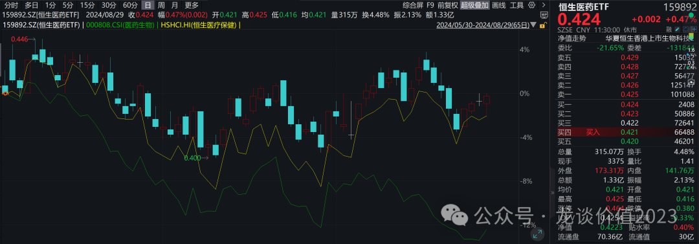
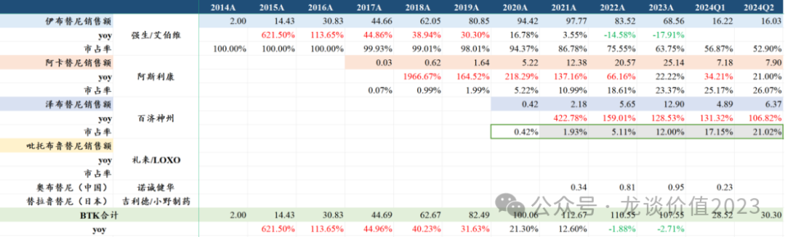

# 最重要行业拐点

大家好，我是龙哥。

过去半年可以看到，医药行业内部出现了非常明显的分化，整个化药/生物药行业或者说创新药行业的头部公司，相较其他子板块来说表现也相对突出，最近尤其让人印象深刻的是迈瑞医疗与恒瑞医药股价的背道而驰和恒瑞医药市值终于重新超过迈瑞医疗。其中这两家公司的对比不在今天的讨论之列、本文也无意说明两家公司市值高低的对错与否，我们仅从产业趋势的角度来谈谈当前整个医药行业各个子板块的情况。

全行业来看，创新药进入新周期，互联网医疗、CXO极限低估值但基本面驱动力不足，高值耗材政策压力下只能看细分领域，药店进入政策敏感期，医疗设备ff重灾区，恒生医疗保健指数/恒生医药ETF（159892）相较A股医药指数终于开始走出显著超额。

***01***

**创新药行业历史性拐点**

创新药是这两年我们讨论的内容的主题，其中有一个最重要的因素，也是我们所有判断的一个基本前提——创新药行业已经基本形成了相对成熟、完整的定价体系——基于国家医保谈判、其中枢围绕人均GDP和竞争格局、临床价值的定价体系。

由于定价体系的完善，以及包括医保谈判、临床补贴在内各方面对创新药的支持政策陆续出台，行业在业绩层面、估值层面陆续开始反映，因此从去年开始我们提出一个基本的判断——一批头部pharma开始进入新一轮的产品兑现期，对应的就是业绩层面、尤其是创新药收入会开始看到显著加速增长，同时由于ff和内部管控带来的费用率的下降，利润端可能体现出比收入端更好的表现。

这点在我们当时重点提的几家公司如恒瑞医药、翰森制药、中国生物制药上都有显著体现：

- **恒瑞医药：**2024H1营收136.01亿+21.78%，Q2单季度营收76.03亿+33.95%，剔除产品授权收入和利润贡献外Q2产品收入63.33亿元+11.6%，归母净利润9.83亿元同比下降8%，上半年创新药（含税）收入是66.12亿元+33.25%、环比增长16.5%。
- **翰森制药：**2024H1营收65.06亿元+44.23%，其中产品收入51.03亿元+13.83%，包括创新药产品收入为36.29亿元+30%，仿制药收入为14.74亿元-13.14%，上半年归母净利润合计27.26亿元+111.47%，净利率高达41.89%，剔除授权贡献的12亿元外的产品贡献的归母净利润约为15.34亿元+21%，略高于产品收入增速13.83%。
- **中国生物制药：**2024H1收入158.74亿元+11.14%，毛利率82.08%同比提升0.28%，剔除出售资产收益后的归母为14.43亿元+14.63%，由于中国生物制药的生物类似药和创新药进入密集上市期，拉动其新产品收入快速增长，上半年创新产品收入61.3亿+15%、仿制药收入97.44亿+9%，创新产品收入占比38.6%。

并且除了产品端收入的高增长外，恒瑞医药、翰森制药这两家率先实现创新药转型的传统pharma，都已经实现了很好的创新药海外BD授权贡献的收入和利润，虽然就BD授权收入当期而言是一过性的，但未来如果海外研发有所推进，将有更高的价值体现。

**除以上三家头部的pharma以外，二线的pharma也普遍进入一轮产品兑现期，**如绿叶制药今年预计6个新产品上市、截止目前已经获批5个，尤其是帕利哌酮大品种提前2年在美国获批上市，2022年底以来绿叶制药新获批中枢神经领域5个、肿瘤领域4个重点新品种；再比如海思科、信立泰、贝达药业等公司的密集的新产品申报注册和上市，都将带来或者已经带来业绩的显著加速。

**除了以上对传统pharma的判断外，从今年往后展望，创新药行业又一个历史性的、最重要的拐点在2025年即将出现——****头部biopharma的密集扭亏和进入正向循环。**

- **百济神州：**2024H1实现营收119.96亿元+65.44%，产品收入119.08亿元+77.82%，Q2单季度产品收入65.83亿元+69.29%，泽布替尼上半年销售收入突破10亿美元达到11.26亿美元，全球市场份额持续攀升，美国市场份额更甚。上半年研发费用65.22亿元、研发费用率54.36%同比下降26.76%，销售及管理费用62.09亿元、费用率51.75%同比下降20.35%，因此上半年实现归母净利润-28.77亿元亏损收窄44.87%，Q2单季度归母为亏损9.69亿元，剔除股权激励和折旧摊销后历史首次实现经营性扭亏，预计2025年将实现经营性扭亏。

- **信达生物：**2024H1收入39.52亿+46.3%，其中产品收入38.11亿元+55.10%，毛利率82.90%同比提升1.58%，研发费用率35.41%同比提升1.25%，管理费用率8.09%同比下降5.55%，销售费用率47.55%同比下降2.33%，自2021年以来公司员工人数终于重回增长，上半年人均产出75.1万元同比增长43%，销售团队人均产出127.05万元+55%，人效显著提升。公司下半年将有ROS1抑制剂获批，今年底到明年初将有IGF-1R和GLP-1/GCGR两款国产独家产品获批，下半年还会有IL-23p19这款自免大品种申报上市，总体开始进入新一轮的重磅产品兑现期，公司预计2025年实现ebitda扭亏。
- **康方生物：**2024H1收入10.25亿-72.13%，其中产品收入9.39亿+23.95%，卡度尼利收入7.06亿元+16.5%，在没有医保覆盖+医疗ff的背景下做到该增长已经实属不易，其他产品（AK105+AK112+普特利单抗分成）合计贡献2.34亿元收入+53.66%，产品授权收入0.85亿元、包含与Summit扩大合作协议贡献的8000万元付款。毛利率92.05%同比下降5.85%，但其中产品毛利率91.32%同比提升1.51%，上半年净利润-2.49亿元，环比23H2显著减亏。预计到2024年底公司将有5款自有品种（AK105+AK104+AK112+AK101+AK102）+1款BD分成品种商业化，贡献未来2年的持续高增长动力，公司也有望在2025年实现经营性扭亏。
- **传奇生物：**Q2单季度Carvykti销售1.86亿美元同比+59%、环比+18.47%恢复增长，此前已经连续2个季度环比基本没增长，Q2美国销售1.67亿美元+46.5%、欧洲销售0.20亿美元+567%，美国收入占比89.78%。传奇Q2单季度收入1.87亿美元，其中产品销售分成0.93亿美元，收到里程碑付款和诺华首付款确认收入部分合计是0.94亿美元。上半年经调整净亏损1亿美元，预计下半年亏损进一步收窄，预计2025年BCMA-CART商业化实现扭亏。
- **再鼎医药：**2024H1收入1.88亿美元+42.53%，其中艾加莫德贡献0.36亿美元，Q2单季度收入0.23亿美元、环比增长76%，上半年净亏损1.34亿美元同比收窄21.31%。再鼎医药过去1年陆续有ROS1抑制剂、舒巴坦钠度洛巴坦钠、艾加莫德三款重磅产品上市，未来1-2年还将有KRAS G12C、TF-ADC、KarXT等重磅产品NDA或上市，以及FGFR2b的III期数据读出，同样处于第二轮的产品密集上市阶段，且产品的质地和销售潜力都远高于第一批上市的几个分子，公司预计2025年底实现扭亏、2026年实现全面扭亏。
- **和黄医药：**产品收入合计2.43亿美元+140%（固定汇率增长145%），其中和黄医药合并报表部分的产品收入为1.28亿美元+59.55%，国内部分，呋喹替尼销售0.61亿美元+8%（固定汇率+13%），索凡替尼销售0.254亿美元+12%（固定汇率+17%），赛沃替尼收入0.259亿美元+18%（固定汇率+22%），呋喹替尼海外销售1.31亿美元大超预期，上半年实现盈利2580万美元（含3380万美元里程碑付款），公司有望提前到2024年实现经营性扭亏。

以上6家公司除再鼎医药是license in的模式外，百济神州、传奇生物、和黄医药均已经实现海外产品商业化，康方生物则是重磅产品海外授权，另外科伦博泰依靠重磅产品海外授权收入也在2023年和2024H1实现扭亏。信达生物短期尚未实现产品国际化，但目前搭建起的早期管线有多款分子具有潜在国际竞争力，未来也必将开启出海之路。

除以上6家港股头部biopharma以外，A股和H股的部分biopharma，如艾力斯、神州细胞、博安生物、复宏汉霖等也已经实现经营性盈利，尤其是艾力斯以单一大品种三代EGFR实现了40%的惊人的净利率水平。

创新药行业的边际变化已经悄然在头部企业中显现，除石药集团外大部分积极转型的传统药企已经陆续走出困境，头部biopharma也在陆续迎来新的新品研发和商业化的突破，过去多年的资本市场的助力、政策面的支持，在基本面和股价上都已经陆续反映。

以上pharma/biopharm主要集中在港股，因此即便这一轮港股医药跌幅如此之大，过去一年多我还是坚持和大家讲港股医药多过A股，基本面在股价的反映可能会迟到、但不会缺席。当然，可惜的是并没有一个ETF可以只覆盖那么少数的头部公司，只能通过**恒生医药ETF（159892）**等来配置，表现弱于以上头部个股，这其中还有其他子行业拖累的因素我也将在下文简述。

***02***

**其他细分子行业**

**①互联网医疗：行业增速放缓显著，关注股东回报变化。**

阿里健康、京东健康在过去几年都是巨大的跌幅、对恒生医疗指数也带来了巨大的负面贡献，而着眼当前，互联网医疗企业的增速放缓已经在股价中充分反映，京东健康当前650亿市值、560亿现金类资产，经营现金流40-50亿/年，短期虽然缺乏基本面显著改善的驱动力，但未来如果在股东回报方面有所改善，则也有较大修复空间，互联网巨头腾讯、阿里、京东都在肉眼可见的加大股东回报力度。

**②CXO：地缘政治因素持续压制，风险充分释放。**

CXO也是过去几年对恒生医疗、对A股医药指数带来巨大负贡献的板块，如受地缘政治因素影响担忧较深的药明生物已经跌到不到1倍PB，其核心业务之一ADC-CDMO分拆出的子公司药明合联维持订单、管线、业绩的超预期高增长，CXO经历这3年的洗牌，虽然地缘政治因素使得其未来仍然难以判断，但市值体量的大幅收缩使得其至少也很难再成为医药行业大的风险点。

**③高值耗材：政策风险尚未出清，关注细分赛道高成长公司。**

行业前段时间出现的ybj直接在公众号对某细分领域国产小龙头发问询函的事件，其背后的本质，在于高值耗材行业尚未形成类似创新药这样的成熟定价体系，对于创新器械和仿制器械并没有明确的划分和单独的定价机制，使得哪怕是类似Castor这样的品种也一概被当做仿制器械一般、与其他普通主动脉支架一起统一价格体系。这其中我们认为主要关注的还是有横向拓展能力的眼科耗材、神经介入/外周介入、CGM等领域的细分赛道小龙头，仍处于阶段性的行业高增长、公司新产品密集兑现期。

**④医疗设备：ff重灾区，企稳尚需时间。**

设备行业在过去1年里持续的低于预期，成为医疗ff以来实质上受冲击最大的细分领域，实际上也并不冤枉——本身就是医疗fb的重灾区，叠加医院预算、cz资金的紧张等，双重暴击。过去半年医疗设备行业持续的在讲以旧换新的政策支持，但实际股价表现大幅弱于预期，其在2022年底的贴息贷款中刚刚给我们展现过这种一过性的政策支持对业绩和股价的影响——实际上只有少数高景气的方向真正创造价值，时隔一年再讲一次类似的逻辑，本身就显得很蠢。

**总体来看，我们对港股医疗的观点仍然显著乐观于A股医疗，****恒生医药ETF（159892）****仍是配置港股医疗的选择，个股方面也有上文提到的诸多头部公司可选，期待2025年前后的创新药历史性拐点，可以给行业带来新的发展机遇和投资机会**。

*风险提示：本文仅讨论行业/公司经营情况，投资需综合考虑公司经营、估值、管理层等多方面因素，建议读者审慎参考，本文不作为投资依据，不建议大家根据本文做出投资计划。*

<!-- wxmp-comments-begin -->

---

## 留言（7 条，含回复共 14 条）

- **范征** 👍4 · 2024-08-29 13:25
  龙哥，信达、康方、白鸡现在基本只有持有价值，并不符合买入点，他们根据管线折现（三期）基本已经涵盖在了现有市值里面，所以创新药其实并不是很好的买点，尤其是信达，基本就没怎么跌，而康方的黑天鹅估计也很难参与吧，所以创新药别看走的这么好，其实参与难度极高，性价比也不高了。。
  - ↳ **作者** · 2024-08-29 13:46
    怎么说呢，就是当大家都看到基本面向好已经出现的时候，那必然不是特别低估的机会，看买点的话，那这个时候就找依然特别低估的机会吧，行业这位置也基本只有头部公司股价还可以，但实际上二线公司也有一些明确基本面企稳的。
- **daibing** 👍4 · 2024-08-29 13:27
  手里就港股医药和互联网了，死磕吧。
  - ↳ **作者** · 2024-08-29 13:47
    互联网这个位置股东回报做的好，可能机会比医药还更好一些，不过也要看基本面的变化，AI对互联网的潜在助力，医药这边创新药的爆发
- **Tay** 👍4 · 2024-08-29 13:31
  只投创新药ETF叠加降息预期，会不会有更多超额？
  - ↳ **作者** · 2024-08-29 13:47
    差不多的，恒生医疗里现在其他板块基本也快跌没了，我回头再梳理下指数权重变化
- **清** 👍4 · 2024-08-29 13:49
  CXO会有修复行情吗
  - ↳ **作者** · 2024-08-29 13:54
    比较难有很大的吧，这政治风险解决不了啊，所以我都说了两年了，就看需求爆发的细分领域，GLP-1相关的CDMO，和ADC的CDMO
- **emo** 👍4 · 2024-08-29 14:23
  神州细胞的捐赠会是常态吗？
  - ↳ **作者** · 2024-08-29 14:32
    一直是啊，那个捐赠，计入营业外支出，所以神州细胞还不能看扣非净利润，只能看归母口径
- **上水** 👍4 · 2024-08-29 15:42
  龙哥，绿叶制药那么好，为何股价没反应那？是否还存在隐患？
  - ↳ **作者** · 2024-08-29 16:26
    资产负债表有一些压力，公司这几年新产品陆续上市和放量，也开始降债
- **畅言** 👍3 · 2024-08-29 17:57
  请教:&nbsp;恒生医疗和恒生医药，2个ETF持仓前10相差无几，价格为啥差好多[撇嘴]
  - ↳ **作者** · 2024-08-29 18:55
    价格和发行的位置有关，不用看价格的

<!-- wxmp-comments-end -->
