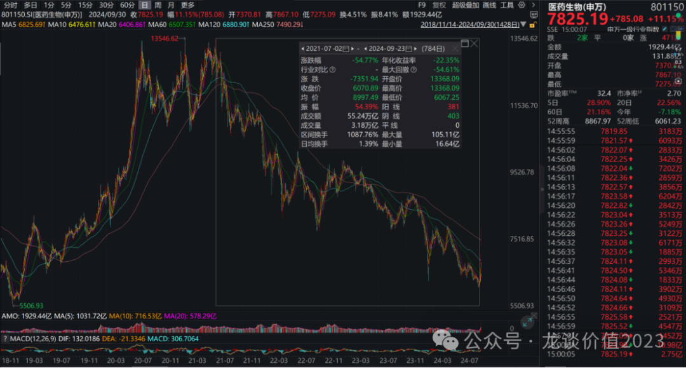

# 日子也是好起来了

大家好，我是龙哥。

自2019年初的上一轮医药牛市，终止于2021年7月1日，2021年7月2日开始了一轮长达3年零3个月的漫长下跌，对这个日期的印象如此深刻，也是有当时特殊的意义在——当时市场坚挺到7月1日。

严格意义上来说，上一轮的医药牛市经历了上图中的3个高点，第一个高点是包括新冠疫苗和相当一部分制药企业的高点，时间是2020年8月；第二个高点是医疗服务在内的大部分医药股的高点，时间是2021年2月；第三个高点则是那一轮医药淘汰赛中仅剩的CXO板块的高点，时间是2021年7月1日。

自2021年7月2日，至2024年9月23日，A股784个交易日，累计达到55%的指数跌幅——大量公司跌幅在60%-80%乃至更多，而2020年7-8月见顶的板块和公司，更是经历了超过4年的漫长熊市，因此，不论是下跌时间还是下跌幅度，都是过去十几年里仅有的一次，而港股医疗更不用多说，跌幅更甚，当然，企稳时间略早于A股。

这一轮的下跌是如此的漫长、幅度是如此的巨大，不仅是医药行业，整个A股和港股都是如此，尤其是在全球主流股票市场一片牛市的环境中。多少投资人都憋着一口气。

9月24日，大奇迹日，A股仅用了5个交易日收复了近2年的跌幅，恒生指数9个交易日收复2年半的跌幅，牛市初期已然成型，未来纵然还有惊涛骇浪，希望已经出现，每一份坚守都是有意义的。

......

感慨说完，进入正题，聊几个方向。

**1、ETF请坚守**

过去2年我在公众号讲的个股越来越少，更多的提到ETF基金，在大熊市中定投ETF是为数不多的风险可控的权益投资。有的读者买的早、没有底部定投，亏损幅度高达50%，这个确实也比较无奈。有的读者买的晚一些，且坚持定投（尤其恒生医疗ETF），在前面港股医疗稍稍向上的时候就已经盈利，能和我一起坚持定投港股医疗ETF的投资人不太可能到目前还没有转盈利。

定投ETF是普通非专业投资人长期来看为数不多的能从市场躺赢赚钱的方式。

而站在当下，市场环境有了大幅回暖，当初承受逆向投资的巨大痛苦拿到的带血的筹码，请一定要珍惜，不要在熊市中煎熬了那么久、刚一上涨就全交出去了。哪怕是对收益率满足了想要兑现，也要根据市场疯狂的程度来分批兑现——正如买入时那样。后续还会再写一篇更详细的文章拆分一下医药相关ETF的持仓结构。

**2、短期对利好更敏感一些**

几年的熊市，使得大部分投资人对利好已经趋于钝化，在大熊市的环境中，大家对利好都是极致的内卷和提前埋伏，利好落地就是出货的思想非常常见，如今攻守易型，这种思想也应该有所转变。基于短期利好催化，可以关注几个方面：

①贷款增持：BR医疗，全A股大股东使用专项贷款增持的第一家，预计较有可能一字板，本身持股结构就非常集中，筹码不多，因此主要看市场情绪，基本面无法解释估值。

②BD交易：SY集团（刚公布未来2年的50亿港元回购，回购+分红预计约8%股东回报率，12倍PE，短期20亿美金交易对价与AZ的BD授权。

③1个月后医保谈判：KF生物（AK104、AK112都有望谈判，今年最值得关注的一家医保谈判）。ZGSW制药，pharma里今年有较多新品种参与国谈。

④诺贝尔医学奖mRNA相关主题：主要是CXO相关，JSR生物、YM系、KLY、BT股份、HY生物等等。

**3、短期内需修复预期**

①本身有不错的产品力和出海能力，过去受国内业务对估值和成长预期压制较大的标的，是有长期逻辑、可以长期配置的标的。重点是之前看好的核心公司SDTS、MR医疗、AB医疗。

②内需里的中高端可选消费医疗的改善潜力，也既过去消费升级逻辑下的眼科、齿科医疗服务及配套的耗材、以及医美等，细分行业龙头包括AE眼科、HX眼科、TC医疗、OP康视、AB医疗、HH生科、SD天使等等，但医疗服务短期上涨过后估值已经快速回到40倍上下，我认为未来再回到50-70倍的中长期估值中枢的概率并不高，其中估值相对偏低的OP康视（25倍PE）、SD天使（国内外分部估值）。

而前期作为超跌反弹标的选择的ZF生物、CC高新等，远期需求逻辑太差，在第一轮暴涨后预计后续持续性不会太好。

③关注Q4设备采购需求的修复，即便最终全年设备采购目标完不成（市场也早已预期完不成），Q4也大概率看到显著的改善，如果能配合反腐的影响减弱则弹性更大，这其中建议关注MR医疗、AH内镜、SWS等，短期优先选小公司，长期优先选大公司。

**4、长期看服务型内需**

参照欧美日的发展历史，预计未来内需需求方向会与过去地产链、人口红利驱动的内需方向有较大差异，人口老龄化的长期趋势带来的应该是服务型消费的提升，在医疗领域反映为医疗服务、连锁药店、医美等，过去复盘日本医疗行业时，除出海的制药、器械公司外，医疗领域长期表现最好的当属连锁药店行业。

但国内独特的政策风险使得尤其是医疗服务和药店行业受到医保、监管的长期压力，而国内又缺乏差异化高端医疗服务（如和睦家，已退市）的上市公司，HJY医疗、GS堂等偏中低端且依赖医保，短期反弹弹性也较大，中长期仍要持续看政策面的脸色。

未来互联网医疗可能替代连锁药店成为有长期成长逻辑的可选方向，可重点关注JD健康，经营效率较高，在手现金和经营现金流较好，虽然也逃不脱总量逻辑，但相比连锁药店好在目前并不依赖医保、且双寡头格局。

**5、创新与国际化**

创新药与国际化是过去半年多医药行业主要演绎的有持续性的方向，被挖掘的比较充分，也是医药资金持仓较为集中的方向，短期表现显著弱于市场总体，也符合我们的判断，也是经历前期的分化后内需标的和出海标的的估值差距较大。

而内需标的估值快速修复后，逻辑较好的出海标的则是可能会有跟随——从估值合理到泡沫化，这种市场偏好的变化，我认为比较可能出现在这轮系统性暴涨后的一轮大的回调之后，短期则是仍有较大可能持续跑输市场。

**6、高股东回报**

类似国际化方向，此前被挖掘的较为充分，短期弹性偏弱、甚至可能是资金净流出。

这其中则建议选择重点指数成分股，指数基金预计仍将是本轮行情重要的参与手段——①过去几年来看定投ETF的表现远好于投资个股，散户资金有路径依赖；②政策资金的入市主要是通过宽基指数ETF；③反应较慢、提升仓位显著较慢的险资，后续提升仓位可能也会较多选择ETF。

**7、短线炒作资金记忆：上一轮的牛股**

上一轮牛市里弹性最大、流动性好的细分行业龙头：CXO里的一众公司，生物制品里的几个疫苗龙头、长春高新等，医疗服务里的爱尔眼科、通策医疗等，连锁药店里的益丰药房，医疗器械里的微创系（微创+心脉+脑科学+机器人）等等。这里面大多数逻辑都已经比较差，只有少数公司后续还值得关注，因此对这些标的且炒且慎重。

*风险提示：本文仅讨论行业/公司经营情况，投资需综合考虑公司经营、估值、管理层等多方面因素，建议读者审慎参考，本文不作为投资依据，不建议大家根据本文做出投资计划。*

<!-- wxmp-comments-begin -->

---

## 留言（21 条，含回复共 45 条）

- **春风十里** 👍2 · 2024-10-08 01:39
  昭衍新药是不是迎来了它的高光时刻？可以常拿吗？
  - ↳ **作者** · 2024-10-08 01:42
    啥高光时刻也不太可能高光过21年了，只能说行业企稳了是能享受行业β的。
- **Deundre_Lee** 👍2 · 2024-10-08 06:20
  龙哥，jd健康不依赖医保怎么说？他医保只能个账支付不应该反倒是一种限制吗？
  - ↳ **作者** · 2024-10-08 08:32
    现在O2O逐渐放开医保支付，B2C还没放开，可以说是限制因素，但相对于花医保钱，还是不花医保更好，你看看花医保钱比较多的，哪个不是被拿捏的不要不要的，之前药店活的多好，突然就行业性崩盘。
  - ↳ **作者** · 2024-10-08 08:32
    再换句话说，由于他们还没放开医保，未来趋势应该还是逐渐放开的，意味着是有增量的。
- **小侯** 👍2 · 2024-10-08 09:10
  龙哥，贝达药业怎么看？有创新药出海预期
  - ↳ **作者** · 2024-10-08 10:20
    短期是系统性的鸡犬升天，不好评价短期股价。
    基本面角度，贝达这几年从研发到商业化都是持续miss，确实是让投资人们很失望，收入被后起之秀艾力斯超越，恩沙替尼的出海也是延后了很多、也没太大价值了，复盘贝达的历史就是一家头部biopharma如何慢慢掉队的过程。
  - ↳ **作者** · 2024-10-08 10:21
    好的地方是，贝达这两年确实进入一轮新产品放量期，表观的业绩层面，总归是会好看一些的。
- **阿宝** 👍2 · 2024-10-08 12:40
  金斯瑞生物咋搞得？拿了那么久就这点反弹[大哭]
  - ↳ **作者** · 2024-10-08 13:33
    金斯瑞确实太弱了，可能是传奇生物也没怎么涨，金斯瑞的估值受传奇影响比较大。
- **雨泽** 👍1 · 2024-10-08 01:25
  龙哥终于等到你，能谈一下微创医疗吗
  - ↳ **作者** · 2024-10-08 01:34
    如果市场环境大幅回暖，作为其估值最大压制因素的微创的债务问题可以得到很大程度的缓解，可能形成正反馈的。
    当然也还是要看几项业务发展的情况，我还是认为可以考虑根据发展阶段去买他最优秀的几个子公司，集团的垃圾资产比较多。
- **Bryan** 👍1 · 2024-10-08 01:37
  哎，牛市能赚钱，但感觉牛市反而更难选股交易，全面匆匆上涨，没用好的买点和时机[汗]
  - ↳ **作者** · 2024-10-08 01:40
    前面给了那么多买点呀，股票市场最难的也不是选股和买点，还是最难在卖点[捂脸]
  - ↳ **作者** · 2024-10-08 01:43
    所以我说现在难啊[捂脸]，一则我是左侧交易型选手，早早买了，布局好的医药股都50%利润，已经开始逐步要卖飞了；二则现在大部分股票我已经下不去手了，又担心大牛市仓位不够。ETF&nbsp;9.27不小心卖了一次，后面不到11月份高点不卖了。
- **赵东亮律师** 👍1 · 2024-10-08 01:52
  龙哥，乐普生物怎么样？
  - ↳ **作者** · 2024-10-08 08:43
    EGFR-ADC做鼻咽癌确实市场小了点，要看头颈鳞癌或者TF-ADC的胰腺癌的情况吧，头颈鳞癌的入组有点慢，胰腺癌还在比较早期。
- **BO** 👍1 · 2024-10-08 03:13
  龙哥&nbsp;诺辉健康应该没救了吧&nbsp;感觉已经可以归零了&nbsp;这一块&nbsp;[捂脸]
  - ↳ **作者** · 2024-10-08 08:44
    目前是比较难判断，财务总监离职、更换审计师，雪上加霜，复牌最快估计也到明年了。
- **xwf** 👍1 · 2024-10-08 07:06
  已经盈利15%
  - ↳ **作者** · 2024-10-08 08:33
    [强][强][鼓掌]
  - ↳ **作者** · 2024-10-08 08:48
    这一波只要坚持一直定投的都赚钱了，整个账户三年已经盈利7个点了
- **聂士飞** 👍1 · 2024-10-08 07:22
  恒生医药ETF与恒生医疗差不多吧
  - ↳ **作者** · 2024-10-08 08:33
    嗯，差不多一样，就创新药ETF持仓结构差别稍大一些。
- **JMTerry** 👍1 · 2024-10-08 07:38
  终于熬出头了[苦涩]
- **😄** 👍1 · 2024-10-08 09:03
  联影医疗逻辑有变化么
  - ↳ **作者** · 2024-10-08 10:16
    那得看你说的是啥逻辑啊
- **滕野** 👍1 · 2024-10-08 13:00
  龙大，泰格医药对比其他cxo是不是要好一些？
  - ↳ **作者** · 2024-10-08 13:31
    β重于α，泰格，凯莱英，康龙都可以的，泰格的优势是有资本的杠杆。这种市场还是考验交易的。
- **lzzzzzzzz** 👍1 · 2024-10-08 21:55
  龙大，cro还能恢复往日荣光吗
  - ↳ **作者** · 2024-10-08 23:35
    新冠+供给不足产业链转移这种历史性机遇恐怕难以复制
- **emo** 👍1 · 2024-10-08 22:03
  天坛生物也为啥也比较弱
  - ↳ **作者** · 2024-10-08 23:36
    血制品本身跌的不够，加上产业周期见顶
- **ONE** 👍1 · 2024-10-08 23:12
  恒瑞今年大概率达到公司2019年最高点的营收和利润，而且海外业务也有些好的迹象。价格会不会重回历史巅峰？
  - ↳ **作者** · 2024-10-08 23:37
    回到那个估值是有比较大难度的
- **雨泽** · 2024-10-08 01:34
  7、短线炒作资金记忆：上一轮的牛股
  这段说的意思是，不要关注这些股票么
  - ↳ **作者** · 2024-10-08 01:39
    意思是，这些股票由于是上一轮的牛股，很多资金在里面赚过大钱，对这些票有很深的记忆，行情好起来的时候肌肉记忆就会优先去搞这些票。但能不能有持续性是另说。
- **三言两语** · 2024-10-08 07:59
  疫苗股在深深的谷底，行情不好的时候，看那个都不是必须消费。人二倍体也从康华扩展到康泰还有其他准备入局的。这种是不是也改变估值预期了？
  - ↳ **作者** · 2024-10-08 08:48
    只能说预期需求端也能有改善，但就像你说的，康华这种核心矛盾也不只是需求端，还有供给端的恶化，康泰、智飞、成大的进入，这个没法改善，远期逻辑还是比较差，再就是康华的大股东也有问题。
- **洋** · 2024-10-08 08:57
  龙大，HK创新药ETF和恒生医药ETF，孰优孰劣
  - ↳ **作者** · 2024-10-08 10:16
    差别真的没多大，大头都是创新药+CXO，就是恒生医药多点器械和互联网医疗，之前创新药表现最好，这波CXO和互联网医疗最强。
- **曙色朦胧** · 2024-10-08 11:12
  请问健康元呼吸领域有爆发的可能吗
  - ↳ **作者** · 2024-10-08 11:49
    这几年已经卖的很不错了，只是两个大品种都集采了，后面还得是看品种放量周期的
- **临岳煜锋** · 2024-10-08 15:48
  您好像没分析过中药板块，是不感兴趣吗？
  - ↳ **作者** · 2024-10-08 15:51
    中药我看的稍微少一些，主要看一些中药otc。这个文章里对常规的院内药品耗材提的都不多，还是基于当下的弹性的考虑，倒不是说不行，一些pharma在这波系统性上涨之前我也都觉得挺不错的，有一定的成长、有股东回报。

<!-- wxmp-comments-end -->
