# 长期思维模式的转变

大家好，我是龙哥。

经过前期“长达一周多”的疯牛后，市场逐渐回归理性，大量板块和公司出现大幅度的回调，来得快、去得也快。

这个时候又要回到老生常谈的问题，到底什么样的投资模式、什么样的公司，能让大家在这个市场上真正赚到钱。

而此前的文章我们已经多次强调，长期思维模式的转变带来的投资框架的转变在A股已经在逐渐发生，所谓的红利板块的市场阶段性表现，最大的意义并不只是阶段性的风格偏好，更重要的是使得市场上大量投资人，不论过去的风格是短线交易、趋势投资、长期价值投资，都意识到上市公司回归本质是要做股东回报。

**长期股东回报率=分红/回购+成长，要么高成长、要么高分红/回购（注销）**，二者都没有的话就会陷入流动性枯竭、无人问津。

因此，在市场出现大幅回撤后，我们还是来聊聊回归价值投资的本质，我们也确实看到，红利板块在这轮回调中展现出非常强的韧性，回撤幅度显著小于宽基指数。

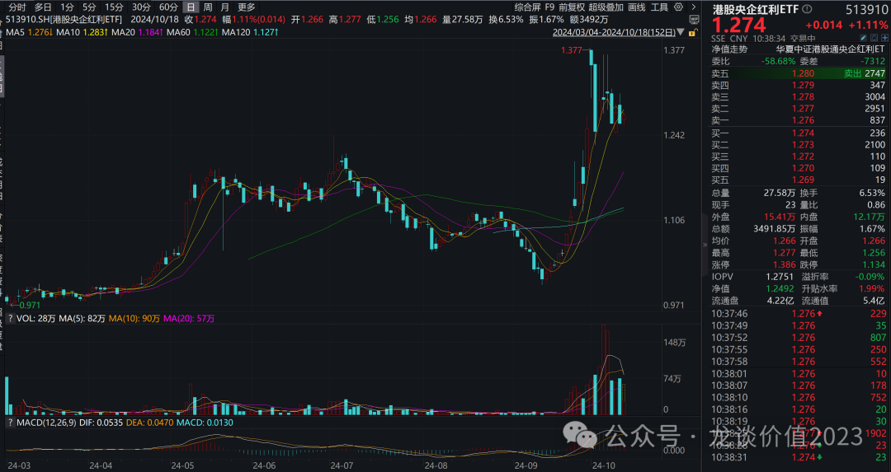

***01***

**红利的本质是“真”价投**

价值投资和其他投资本质区别在于获取收益的方式不同，不是通过交易波动的资本利得来赚钱，而是长期持有，比如巴菲特倡导长期持有策略，他认为投资者应该准备好持有股票至少十年。

如果从从10年以上的角度来看公司的价值，股票的定价可以采用股利贴现模型，基本公式为：

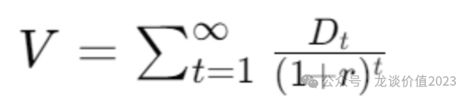

其中：

- V代表股票的内在价值。
- Dt是在时间 t预期支付的股利。
- r是贴现率，通常使用股票的要求回报率或资本成本。

根据股利贴现模型，股票的价值并不取决于每年的增速，甚至增速的变化，而且也不是短期这一两年的股息，而是取决于每年的分红和采用的折现率，理解上也很简单，我投资这个公司，每年拿着分到的股利，然后需要未来的股利折现到现在。

分母端来看，折现率从14年以来进入下行通道，最新10年期国债收益率为2.1%，而参考日本1990年到16年，26年间利率从8%下降到了负利率，在经济增速整体中枢下降的过程中，利率下降是大势所趋，未来5-10年，我们也有可能面临0利率；

伴随无风险收益率的下行，在企业盈利没有改变的假设下，通过股利贴现模型，整体股票投资的价值正在系统性增长；

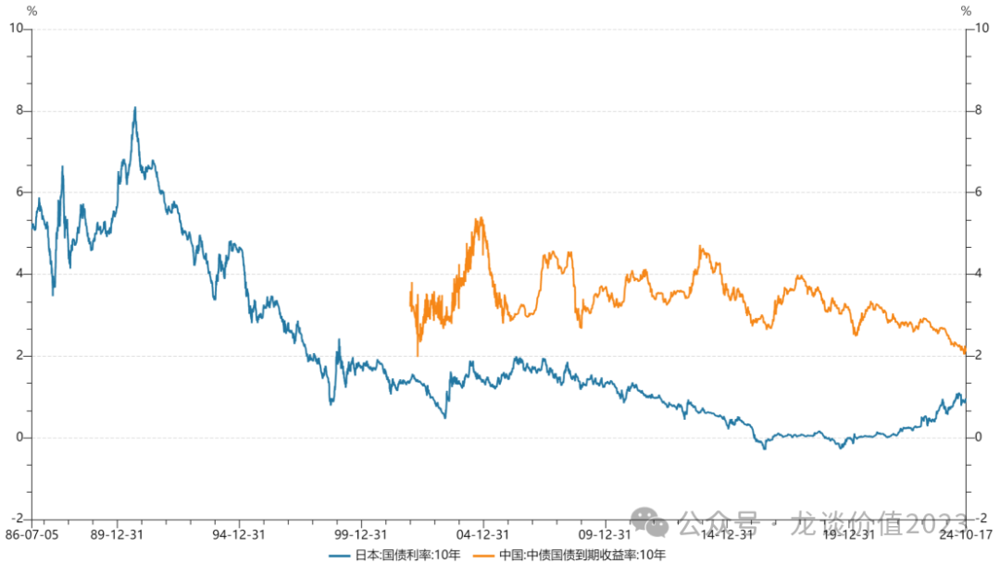

分子端，股息的支付，股息越高公司的价值越高，而且从理论上看，4%股息率的公司的价值应该是2%股息率的公司的两倍。

根据股利贴现模型，价值最高的股票就应该是股利最高的股票，也就是高分红策略，目前这个策略的价值还没有被市场充分定价，大部分投资者仍然在把大量的时间在分析短期月度、季度、年度的业绩，而不是从十年的维度评估企业的长期价值，还并没有真正从行动上认可高分红策略，这也代表这个策略仍然有投资价值。

而在这个策略天然有抄底止盈的属性，一般股息率较高的公司，意味着估值较低，如果估值大幅度上涨，股息率也会降低，从而被调出高分红策略。

比如我们看到中证红利指数的估值的最高点是在15年的1.5倍，PE最高11倍，对比动辄几十倍的科技股，红利策略整体的下行风险是比较可控的。

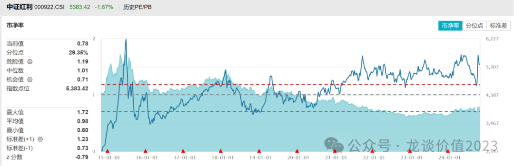

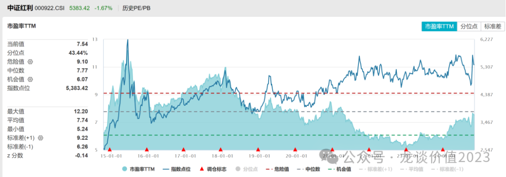

***02***

**港股红利股股息率显著更高**

根据股利贴现模型，更高的股息率代表更高的企业价值，对于A股和港股，目前**AH溢价仍然有146，处于过去3年的较高水平，**这代表港股的估值更低，相比A股跌的更加透彻。

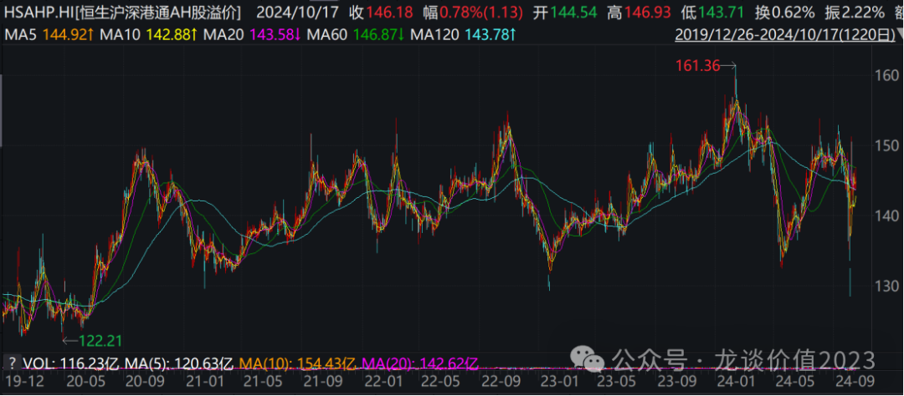

截止最新，中证红利的股息率是4.86%，但是**恒生的港股通高股息已经仍然有6.7%**，港股相比较于A股的股息率更高，投资价值更加突出。

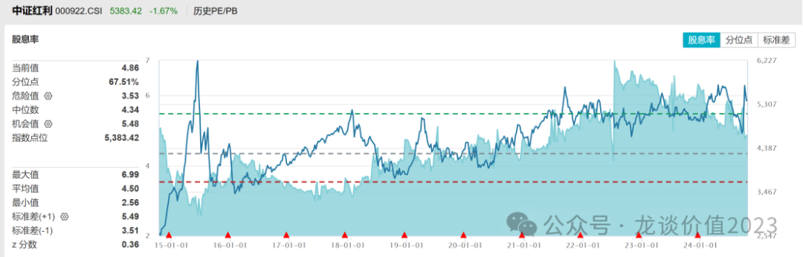

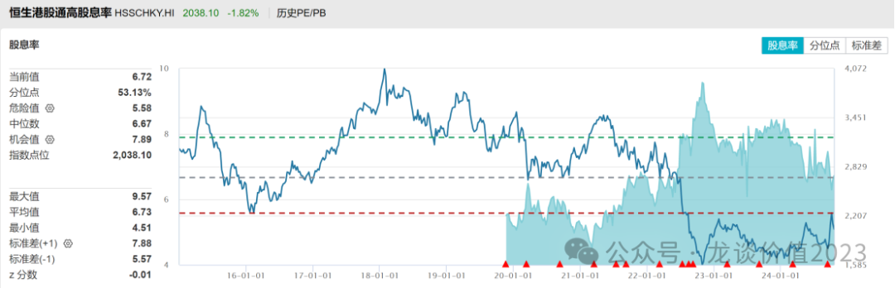

***03***

**如何获得更加靠谱的股息**

股利贴现模型有一个非常重要的假设，就是公司必须有稳定的盈利和股利支付历史，也就是说业绩稳定，并且非常靠谱，有良好的社会责任，会努力将高比例的分红持续进行下去。

从历史数据来看，央企分红总额从2014年的5147.16亿元增长到2022年的11079.43亿元，连续多年占据A股市场的半壁江山，体现了央企在分红的持续性和稳定性明显好于其他企业。

国资委为了提升中央企业控股上市公司质量，2024年1月，国资委在中央企业、地方国资委考核分配工作会议上明确了央企市值管理考核新要求，包括增加反映价值创造能力的针对性考核指标；

央企控股上市公司开始积极行动，将市值管理纳入考核指标，并作为2024年重点任务，通过回购、股权激励、分红、并购分拆等工具进行价值经营，从而实现市值管理；具体包括采取市场化手段提升ROE，提高分红回报。

整体来看，央企的分红回报更加可持续和稳定，并且根据最新的政策导向，分红对于央企的考核也在增强，稳定性得到进一步保障。

根据这个思路我在全市场寻找同时投资央企、港股、红利策略的基金，找到一个很好的指数：**港股通央企红利931233.CSI（也有对应的ETF可以投，港股央企红利ETF 513910）**，这个指数的编制规则有几个关键点：

1、在中证港股通综合指数样本中选成分

2、计算每月的日换手率中位数作为月换手率，剔除过去 12个月或过去 3 个月平均月换手率不足 0.1%的证券

3、选取中央企业实际控制的上市公司证券；

4、选取过去三年连续分红且过去三年股利支付率的均值和过去一年股利支付率均大于 0 且小于 1 的上市公司证券作为待选样本；

5、在上述待选样本中，按照过去三年平均股息率由高到低排名，选取排 名靠前的 50 只证券作为指数样本。

目前这个指数的股息率有6.76%，并且有央企加成，未来持续高分红的可能性更高。

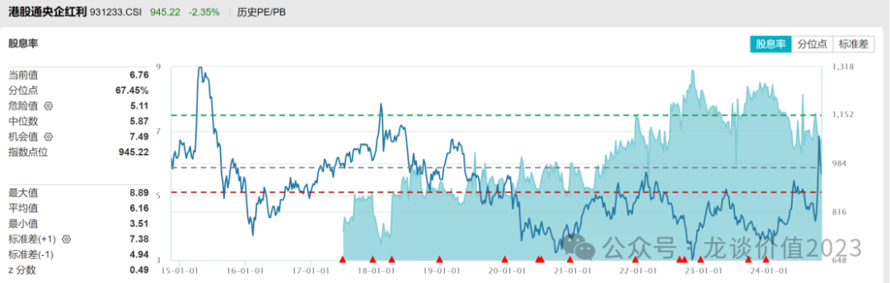

从往年实际的情况下来，整体分红率在5-8%之间，整体分红的稳定性较高。

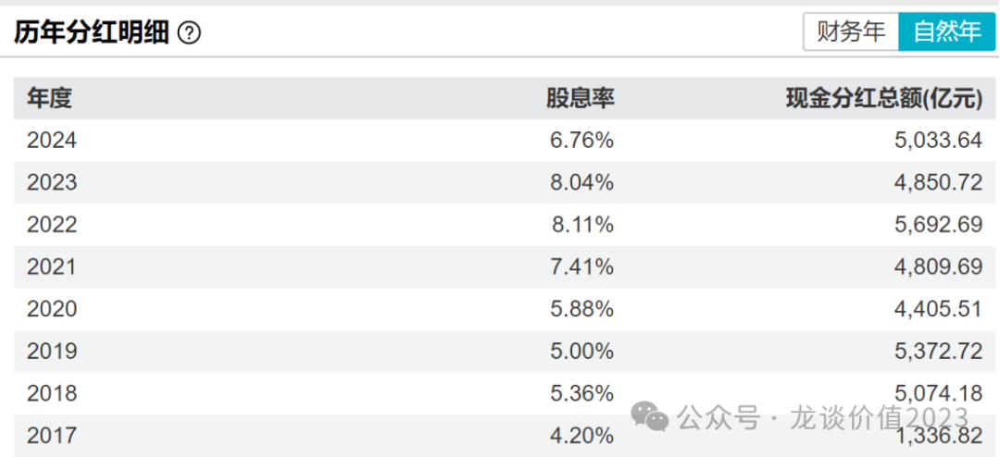

**跟踪这个指数的基金中，****港股央企红利ETF（513910）规模最大，流动性最好。**

从成分股看，包括了较多央企的资源股，金融股，公用事业股票，整体这些行业比较具有公用事业的属性，在国家的经济发展上，也属于是支柱性质的，不论未来整个经济有如何的变化，这些行业不太会被颠覆，更有可能保持稳定的盈利。

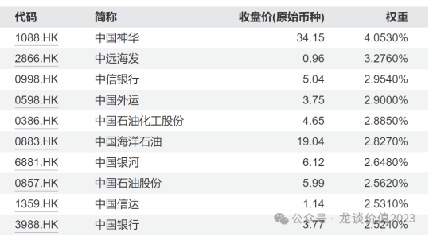

整体来看，A股市场的波动很大，应对大的波动，只能用持续的耐心和坚定的信心投资于长期有效的策略，高分红策略背后的本质的价值投资策略，在利率下行的大背景下，高分红策略的有效性正在提升，而港股的股息率更高，央企进一步保障了分红的可持续性和稳定性，华夏中证港股通央企红利ETF从2月7日成立以来已经上涨24.9%，在最近市场暴涨后回撤很小，进一步体现了这个策略的有效性，值得长期关注。

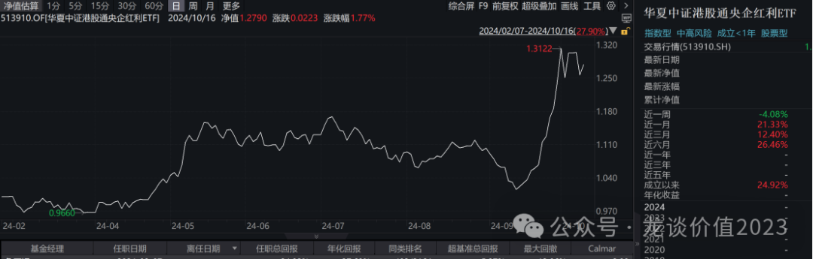

***风险提示：本文仅讨论行业/公司经营情况，投资需综合考虑公司经营、估值、管理层等多方面因素，建议读者审慎参考，本文不作为投资依据，不建议大家根据本文做出投资计划。***

<!-- wxmp-comments-begin -->

---

## 留言（11 条，含回复共 22 条）

- **晓风残月** 👍8 · 2024-10-18 13:33
  龙哥，迈瑞最近8连跌怎么看
  - ↳ **作者** · 2024-10-18 13:35
    迈瑞就是定性和短期定量可能是相反的结论，定性来说他是A股医药行业非常少数有长期逻辑、能出海、愿意做股东回报的行业龙头，是有长期关注和投资价值的。短期的定量就是渠道库存压力比较大，短期业绩不好预测，要看公司还能调控成什么样。
- **阿白** 👍6 · 2024-10-18 13:42
  能讲讲对石药的看法吗，资本运作有点看不懂
  - ↳ **作者** · 2024-10-18 13:50
    其实就是想抬估值，资本运作以外就回归本质看利润增长和股东回报就好，其他的都是浮云
- **口天吴** 👍5 · 2024-10-18 13:31
  不说恒生医疗了啊龙哥，太弱了医疗，尤其恒生医疗
  - ↳ **作者** · 2024-10-18 13:33
    上一篇不是讲的医疗嘛，下一篇会再集中讲港股医疗
- **老赵** 👍5 · 2024-10-18 13:33
  不谈医药啦[破涕为笑]
  - ↳ **作者** · 2024-10-18 13:36
    讲啊，上周不是刚发了篇医药的梳理，这波回调以后可以在里面找公司去买啊
- **Old Lee** 👍4 · 2024-10-18 13:40
  龙哥，叫他们看看药明生物的走势，老是质疑医药的回暖力度
- **Bryan** 👍4 · 2024-10-18 13:41
  就是不知道什么时候香港能调整红利税二次征收的问题，我现在都好怕我的港股持仓分红...其实回购注销优于分红...A股极少回购注销的...
  - ↳ **作者** · 2024-10-18 13:50
    港股回购还挺多的，有分红有回购，AH溢价除了有流动性的因素，也和你说的红利税有关。
  - ↳ **作者** · 2024-10-18 13:51
    是的，今天我手里的中联重科-H就回购大涨啦~，同时A/H上市的且溢价大的，我现在都倾向买H~
- **Poplar.** 👍4 · 2024-10-18 13:57
  龙哥，拿了欧普康视多年，后期能重回高点吗？谢谢
  - ↳ **作者** · 2024-10-18 13:59
    要回历史高点恐怕有难度，还是看经济总量的情况，总量能起来，消费医疗也可以有不错的表现
- **幸运丰** 👍4 · 2024-10-18 14:13
  龙哥，能说啥云顶新耀吗，耐赋康能进医保吗？大概多少钱进？
  - ↳ **作者** · 2024-10-18 14:20
    云顶前期的商业化还挺超预期的，本来我觉得肾病患者一般支付能力比较差的。医保我估计会争取进，价格应该也会不错，类比再鼎那个fcrn去年也谈了很高的价格进的医保
- **Max Wang** 👍3 · 2024-10-18 13:52
  买513910也有股息拿吗？&nbsp;最近ETF价格也随大盘涨了
  - ↳ **作者** · 2024-10-18 14:04
    etf一般拿到分红是再投资的
- **黄磊** 👍3 · 2024-10-18 13:53
  好久不见龙哥！创新药有哪些好标的可以关注呀！！zyxy，KLHC等跌的惨不忍睹，还可以布局吗？[抱拳][抱拳][抱拳]
  - ↳ **作者** · 2024-10-18 13:56
    CXO我这波都没咋买，确实错过了，但我还是不太能讲清楚逻辑，我还是倾向于创新药出海的公司，创新药出海的头部公司还是挺清楚的，再就是一些业绩企稳、现金流好的pharma
- **张涛** 👍3 · 2024-10-18 14:24
  龙哥，请问下文中的图片是哪个网站的数据？
  - ↳ **作者** · 2024-10-18 14:52
    都是wind的数据

<!-- wxmp-comments-end -->
