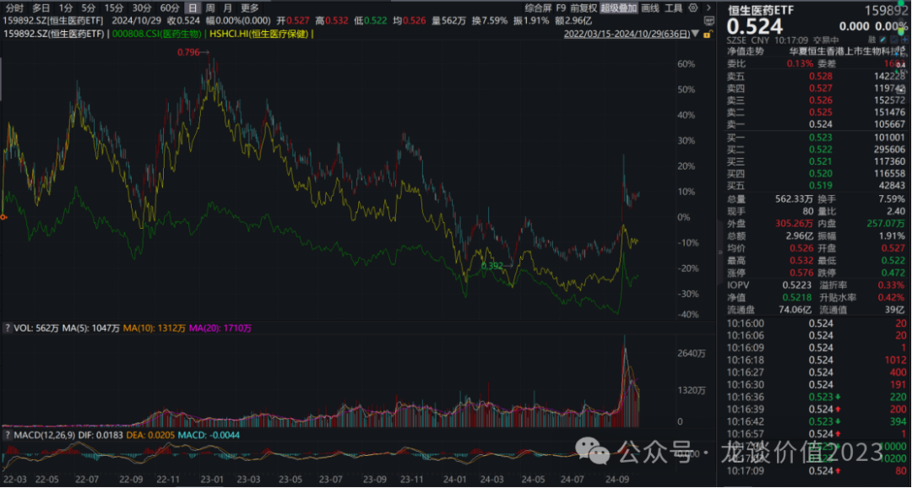
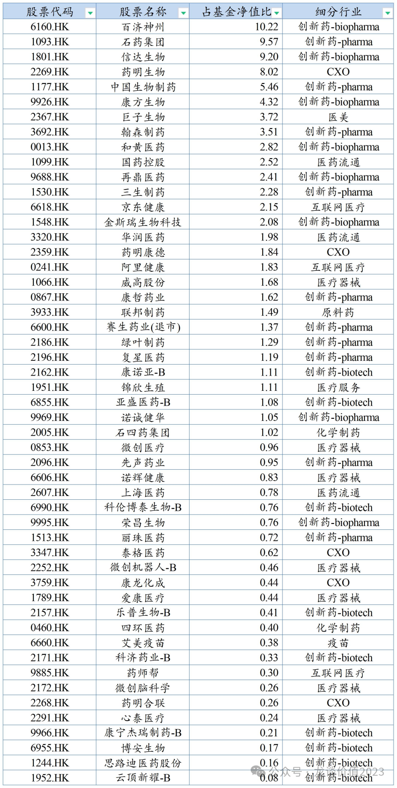
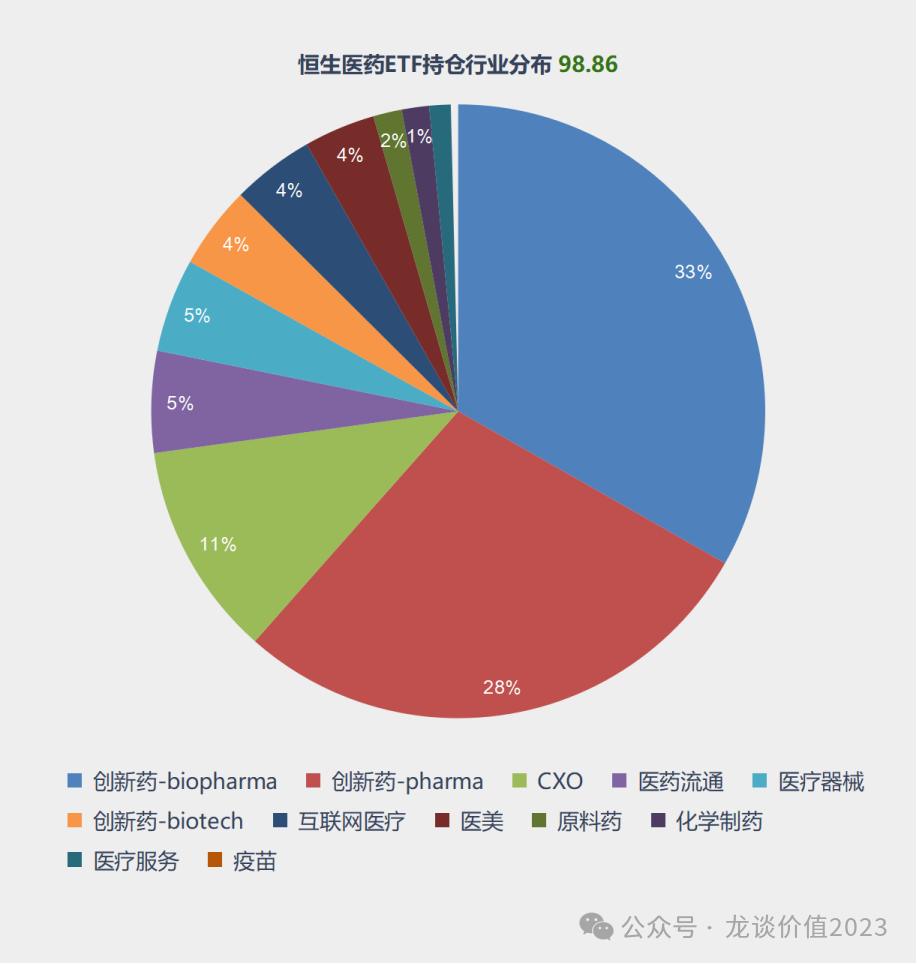
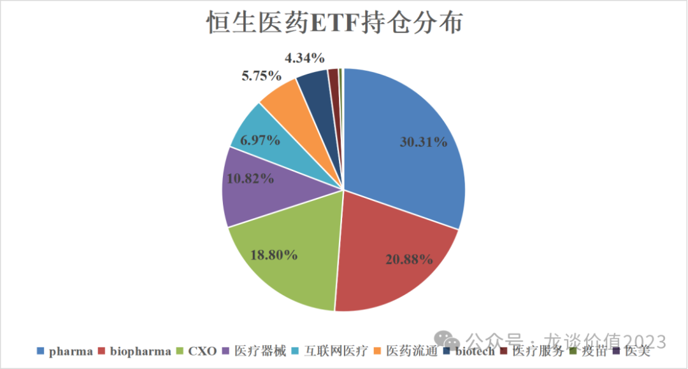
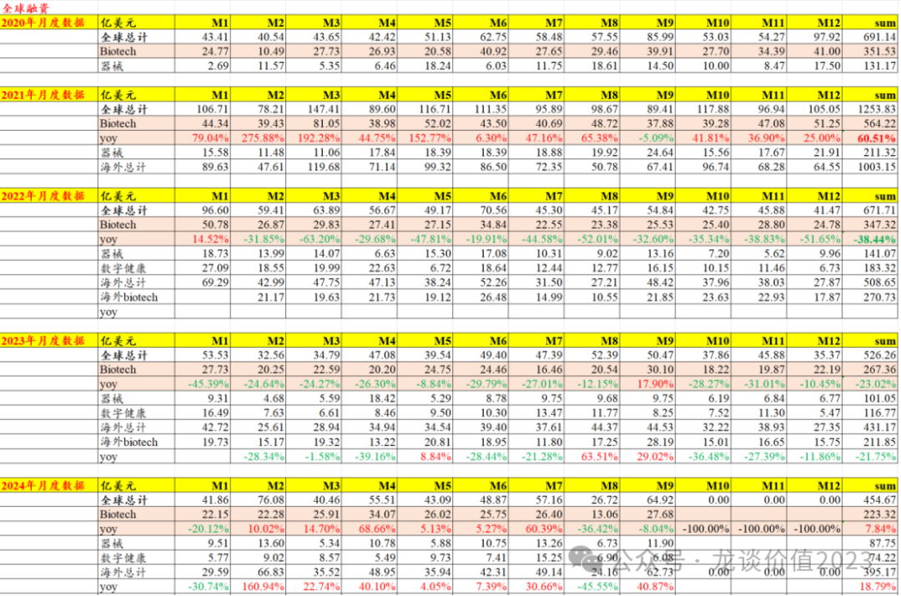
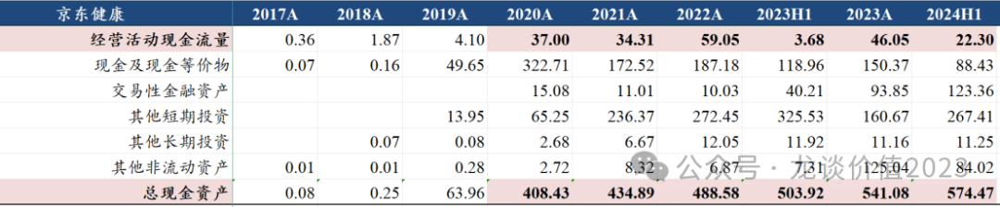

# 最好的医药投资标的

大家好，我是龙哥。

上篇文章给大家说到，要写一篇详细分析港股医药ETF持仓的文章，为什么会有这个想法呢，主要是几个原因：

第一是从长期来讲，我认为被动指数投资的时代已经到来，再牛的股票，由于个人投资者一些比较差的交易习惯，也可能导致小赚大亏，而**定投ETF长期来看胜率很高**，如果再加上一些逆市场、反人性的操作，则可以进一步提升超额收益；

第二也是比较有感触，在前面如此惨烈的医药大熊市里，还是有**不少读者坚持跟着我的文章买ETF，市场稍有反弹就已经盈利**，而买个股的读者里则是很多还在等待行情出现大的反转......

**第三是拉长时间会发现（2022年3月低点至今），恒生医药ETF（159892）是显著跑赢恒生医疗保健指数，同时也跑赢了A股的申万医药指数**......

......

我们还是以**159892恒生医药ETF**的持仓为例分析，其截至2024年中报的全部持仓如下：

截至2024年中报按行业分布来看：

我们可以与今年初的文章中写到的2023年中报全部持仓结构做一个对比：

**①创新药**

创新药占比（pharma+biopharma+biotech）由2023年中报的30.31%+20.88%+4.34%合计为55.53%，提升到2024年中报的65.13%，其中我把金斯瑞的行业分类从CXO调整成为biopharma，主要原因是目前金斯瑞核心资产是创新药业务——传奇生物，即使剔除掉这2%的金斯瑞，创新药的占比也提升了7.52个百分点。

而创新药内部也发生了巨大的变化，2023H1的创新药持仓中，pharma占比高达30.31%，biopharma占比是20.88%，biotech是4.34%，而2024H1的持仓中，biopharma（主要是头部5家，百济、信达、康方、和黄、再鼎）的占比居然提升到了32.86%，而我们知道在过去一年中这5家biopharma不论是股价还是基本面，大多都是有非常不错的表现，尤其是百济、康方、和黄在出海方面的持续超预期。Pharma+化学制药的占比由30.31%下降至29.38%还算稳定，biotech的占比则是从4.34%下降至4.31%也还算稳定。

过去一年多，龙哥大多数的文章都在讲创新药领域，而我们对创新药领域强调的就是创新药国际化，现在可以看到，是否能国际化已经成为限制创新药公司市值天花板的最核心因素，港股这一批创新药出海的头部公司跑出了非常显著的超额收益，成为继PD-1和EGFR国内内卷过后的一批优秀国际化biopharma。

与此同时，在去年的10月开始，龙哥也率先给大家讲传统pharma进入新的产品周期的逻辑，转型较早的港股pharma如当时重点讲的一线的翰森制药、中国生物制药，都已经在业绩、股价、研发管线上开始持续兑现，而今年我们也看到更多的二线的pharma如绿叶制药等也在进入新的产品兑现周期，也将会在后续更多的文章中给大家介绍。

**②CXO**

CXO行业5家公司（药明系3家+泰格+康龙，不含金斯瑞）的权重从2023H1的18.80%下降至2024H1的11.18%（含金斯瑞是13.26%），期间，CXO板块经历了进一步的杀业绩、杀逻辑（生物安全法案），可以说是产业下行期+zz风险集中暴露，使得这个中国在全球医药行业最具竞争力的细分领域被打成过街老鼠。

目前，生物安全法案尚未落地，后续仍会有波折，但全球创新药融资、尤其是海外医疗领域融资的企稳已经非常显著，后续随着美国进入降息周期，创新药融资压力将会进一步减弱，至少在2个压制因素中，产业下行的因素已经在大幅缓解，也因此，充满博弈的zz因素稍有变化，估值波动幅度也会非常巨大。

因此至少在当前时点，CXO已经不像去年底今年初那样成为指数最大的拖累因素，反而可能是重要的弹性来源。

**③医疗器械**

一般创新医疗器械都和创新药并称，美股近十几年器械板块牛股也是层出不穷，曾经的国内医疗器械领域也是一堆的黄金赛道，而现在黄金赛道一个个的在集采、消费降级冲击下，在部分头部上市公司自己作死下，经历了巨幅的下跌，几个头部公司的市值跌到过去不敢想的低，医疗器械板块的市值占比也由10.82%进一步萎缩至4.87%。

医疗器械板块，尤其是港股器械以医疗耗材为主，目前仍未解决的问题就是定价机制的问题，我们一直强调一点，创新药和仿制药的定价机制完全不同，目前已经形成了创新药医保谈判和仿制药带量采购的定价机制，而直到今天，即使审评审批方面有创新器械绿色通道，但在支付端对于创新器械和仿制器械并没有任何定价机制上的区分，如心脉的Castor也是被要求和其他胸主动脉支架放在同一个价格体系里竞价。

与此同时，器械的出海，虽然各家目前都在努力去做，但收入占比普遍还是在个位数到勉强双位数之间，对估值的贡献也普遍还非常有限，这方面做的比较好的行业龙头迈瑞医疗也并不在港股（A股医疗领域的稀缺资产）。

因此，医疗器械领域的萎缩，本质上是产业逻辑尚未打通，我们当前对器械领域并不悲观，但也不是无脑左侧抄底，还是需要看到定价机制的理顺。

**④互联网医疗**

对于互联网医疗，是我们观点发生较大变化的一个板块，能选出京东健康这样的公司，是出于基本的价值投资的常识、和在熊市中的防守思维。

如上图，我们研究发现，京东健康作为一个双寡头垄断的互联网医疗行业龙头之一，在手现金高达564亿（2024中报），同时每年的经营现金流高达40亿-50亿元，公司少有资本开支，因此经营现金流近乎就是自由现金流→大部分转化为在手现金，且公司还有双位数以上的增长，即便公司当前不分红，待到成长性进一步放缓，其进行股东回报（分红/回购）也只是时间问题，可以参照京东集团也是在成长性大幅减弱后开始进行分红，公司的行业地位和积累现金的恐怖速度，使得在合适的位置买入会具有非常高的安全边际，且一旦市场环境好转，其估值修复弹性会比较大。也因此，互联网医疗成为港股医疗领域除创新药以外我们最关注的一个方向。

互联网医疗在恒生医药ETF中的持仓占比，由6.97%下降至4.28%，这一轮行情过后预计还会有显著的提升，我们认为也是符合未来的产业发展趋势，大家可以回顾一下10月8号的文章《**[日子也是好起来了](http://mp.weixin.qq.com/s?__biz=MzkyMzQ3MDc3Mw==&mid=2247483973&idx=1&sn=0a988a8e2bcd495bb77f7b3d53490dd4&chksm=c1e5dc9ff692558942e27f3838b3bd47f0baf26f79959a229762bd7dbe57494bcc4cef25ccb5&scene=21#wechat_redirect)**》里的第4条——长期看服务型内需。

**⑤医药流通**

港股的医药流通就是国控、华润、上药三大龙头，权重占比从5.74%下降到5.28%，总体还是稳定，作为医药行业的总量逻辑，未来的成长性比较有限，基本就是靠行业集中度提升维持有限的增长+持续的分红/回购来回报股东，属于医药的基本盘。

***风险提示：本文仅讨论行业/公司经营情况，投资需综合考虑公司经营、估值、管理层等多方面因素，建议读者审慎参考，本文不作为投资依据，不建议大家根据本文做出投资计划。***

<!-- wxmp-comments-begin -->

---

## 留言（15 条，含回复共 30 条）

- **饶鑫** 👍8 · 2024-10-29 14:18
  信达生物把创新药带沟里去了
  - ↳ **作者** · 2024-10-29 14:24
    没有一点作为行业头部公司的觉悟。。。。
  - ↳ **作者** · 2024-10-29 14:34
    已经清仓，当这五年的时间喂了狗，哈哈哈
- **生而自由20151021** 👍8 · 2024-10-29 15:21
  从昨天开始就在犹豫，信达生物已经跌这么多了，坚守了这么多年，行业最低谷时期都熬过来了，是否留着博一下明年的减肥药或者是363等市场看好管线的BD，一直到今天中午的电话会，让我彻底放弃了信达生物，决定清仓，存在情绪使然的部分，也有跟自己投资理念相悖的原因，自认为没有能力博市场短线的能力，因此只想选一些自认为靠得住能长期坚守和持股的公司作为投资标的。没大赚却也起码没亏钱，亏的是五年的坚守和研究，亏的是对中国创新药的信心，就当喂了狗吧。能力有限，以后只看美股，外加百济神州一家，百济如果也靠不住，那就只看美股生物科技。
  - ↳ **作者** · 2024-10-29 15:22
    周末到今天，看到很多长期投信达的投资人，对信达彻底失望。
- **大斌子** 👍5 · 2024-10-29 14:00
  龙哥怎么看信达贱卖子公司这个动作，小散守了2年很受伤了
  - ↳ **作者** · 2024-10-29 14:17
    不是贱卖，说白了就是给两位核心管理层送福利，前面投入那么多，现在直接来摘桃子，吃相太难看了，引发比较恶劣的影响。
- **徐海东** 👍5 · 2024-10-29 14:46
  对恒瑞医药三季报和准备赴香港二次上市怎么看？
  - ↳ **作者** · 2024-10-29 14:48
    三季报中规中矩。赴港上市二级市场已经用股价投票，恒瑞到港股上市，AH溢价可能会让大家怀疑A股估值合理性吧。
- **黄磊** 👍5 · 2024-10-29 15:04
  看去看来觉得还是买点龙哥说的恒生医药ETF好！[抱拳][抱拳][抱拳]
- **禁止的鱼** 👍5 · 2024-10-29 15:06
  龙哥，如何看兴齐眼药未来哈
  - ↳ **作者** · 2024-10-29 15:14
    兴齐主要是跟产品放量，也没啥技术含量，就像当年的长春高新一样。当然未来竞争格局、需求端都是不如当年的高新的。
- **小米粥** 👍4 · 2024-10-29 14:11
  龙大，信达的事情估计会引发投资者对在港上市药企的不信任吧
  - ↳ **作者** · 2024-10-29 14:16
    这个不至于吧，某yu的道德水平本身就是大家都知道的比较低的，只是没想到他会这么直接，都不遮掩一下，把投资人当傻子
- **JMTerry** 👍4 · 2024-10-29 14:14
  信达的操作有点迷
- **Bryan** 👍4 · 2024-10-29 14:16
  龙哥，医药ETF一直是底仓，还是再咨询一些个股的问题，
  1.&nbsp;海吉亚医疗目前最大的问题是激增的应收吧？这些应收大头是地方政府医保应支付的嘛？是地方医保歧视民营医院，还是就是地方医保没钱？本次化债对此有改善嘛？
  2.&nbsp;金斯瑞今年一直走的不好，我觉得是显著低估的，是因为美股映射的传奇也走得不好（业绩落地复核预期，这轮没涨也不太明白）？还是因为要失去传奇的控制权，公司变的鸡肋，市场不知道如何定价了？
  3.&nbsp;对于金斯瑞，康方这种，美股有映射的传奇和summit，有条件的话，你会选港股还是美股呢？
  - ↳ **作者** · 2024-10-29 14:19
    1、海吉亚除了苏州和重庆以外，其他医院都还是很后线的城市，这些城市基本也可以认为CZ和YB不分家，穷就都穷，都没钱付，这确实是个问题。
    2、我理解是恰恰相反，如果金斯瑞能顺利卖掉传奇，反而股价会暴涨，就是现在不愿意卖，拿不到现金，也没有股东回报，反而很弱。
  - ↳ **作者** · 2024-10-29 14:20
    要分情况，康方不仅是一个AK112，可以康方和SMMT一起选，而金斯瑞只有传奇，看基本面肯定是选传奇。
- **@Sunny** 👍4 · 2024-10-29 14:27
  创新药ETF被深套，成本近1元[流泪][流泪][流泪]
  - ↳ **作者** · 2024-10-29 14:33
    如果买入并持有的话就会难一点，会和你买入的时间点关系很大，ETF还是适合分散投
- **余荣宗** 👍3 · 2024-10-29 14:09
  请教一下，加港股创新药ETF和恒生医疗ETF有什么区别，怎么选，谢谢。
  - ↳ **作者** · 2024-10-29 14:15
    之前说过好多次啦，没太大区别，主要就是恒生医药ETF里多一些器械、互联网医疗和流通，这些从当前位置看也都没啥下跌空间，占比也低，关键时候，比如前面那波，反而能贡献弹性
- **阿白** 👍3 · 2024-10-29 14:27
  百济神州老师今年能拍多少利润呀
  - ↳ **作者** · 2024-10-29 14:31
    百济今年还做不到扭亏哦，短期是在控费减亏，但百济主要还是看欧美的产品销售爬坡情况
- **晓风残月** 👍3 · 2024-10-29 14:57
  明天迈瑞开奖
  - ↳ **作者** · 2024-10-29 14:58
    今晚开奖，我自己感觉Q3会很不好，之前聊的专家口径就不说了，就说一点很异常的，你看迈瑞这么多年的业绩会都是发业绩第二天收盘后开会，只有这次是明早盘前开业绩交流会，给人的感觉就是业绩太差了，盘前交流一下好稳定股价。
- **虞淦军YU Ganjun** 👍3 · 2024-10-29 16:23
  龙哥，您对云顶新耀的评价如何？
  - ↳ **作者** · 2024-10-29 16:29
    阶段性的销售还不错，给的明年的指引很高，但能不能完成还要跟吧，肯定是有难度。长期看的话不好说，我们对纯国内的创新药公司都相对谨慎。
- **丁蟹不炒股** 👍2 · 2024-10-29 16:11
  最近好几家公司可以拉黑；避免踩雷还是买etf。
  先健科技有什么利好么，最近几天连续大涨？
  - ↳ **作者** · 2024-10-29 16:30
    先健科技是铁基支架要发临床数据了吧

<!-- wxmp-comments-end -->
