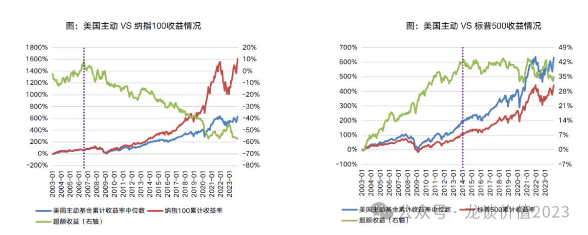
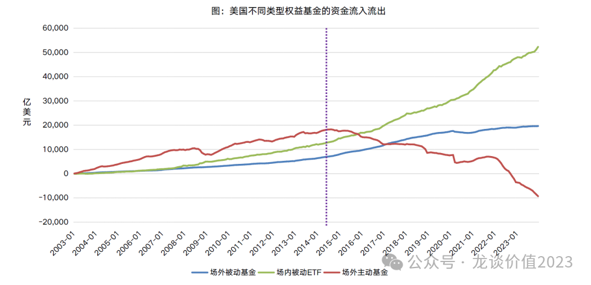
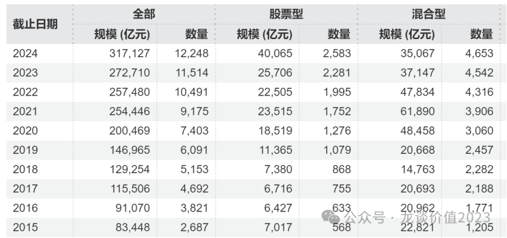
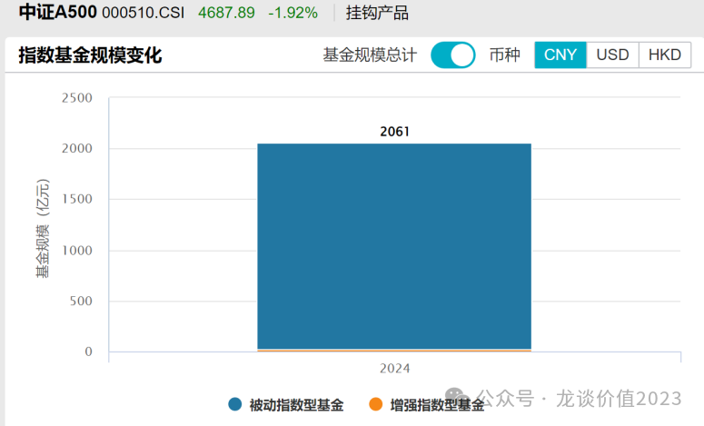
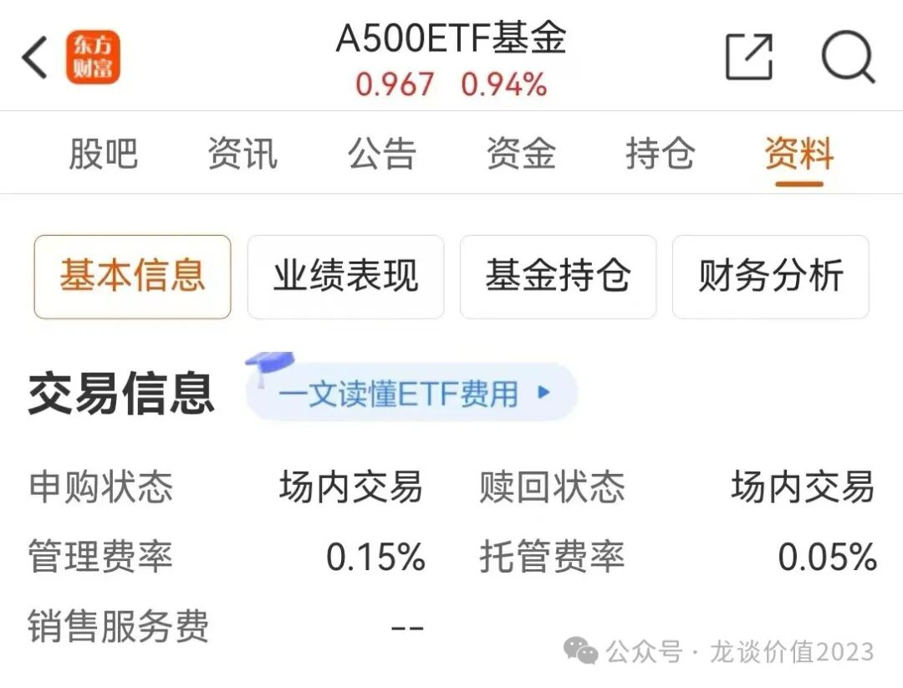
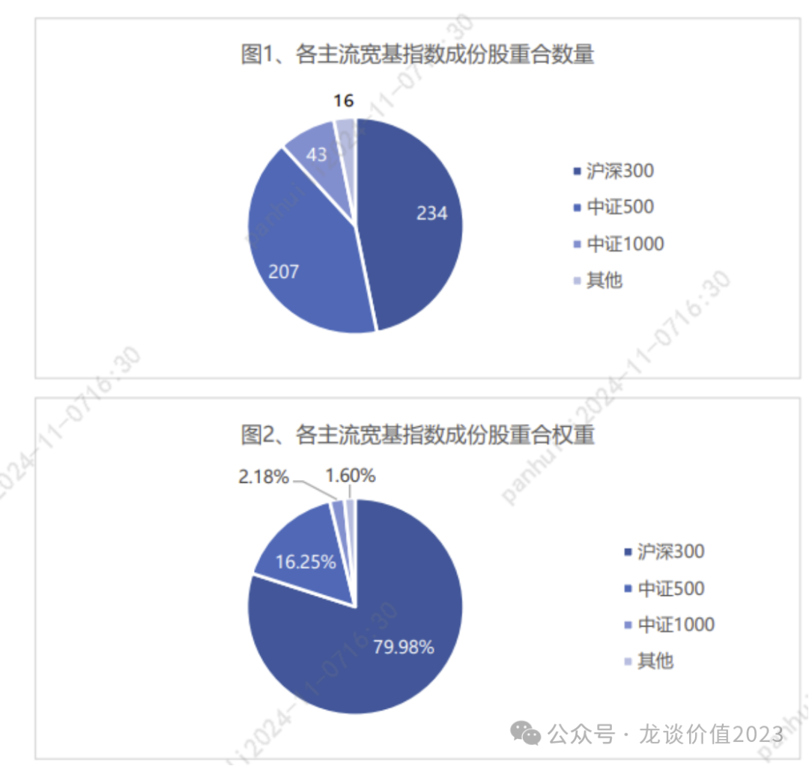
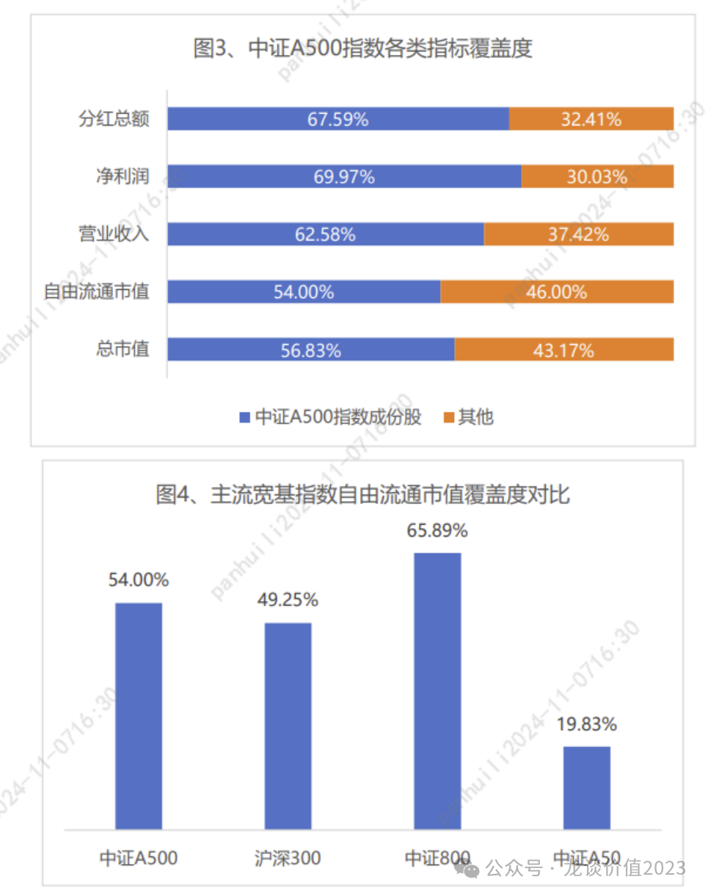
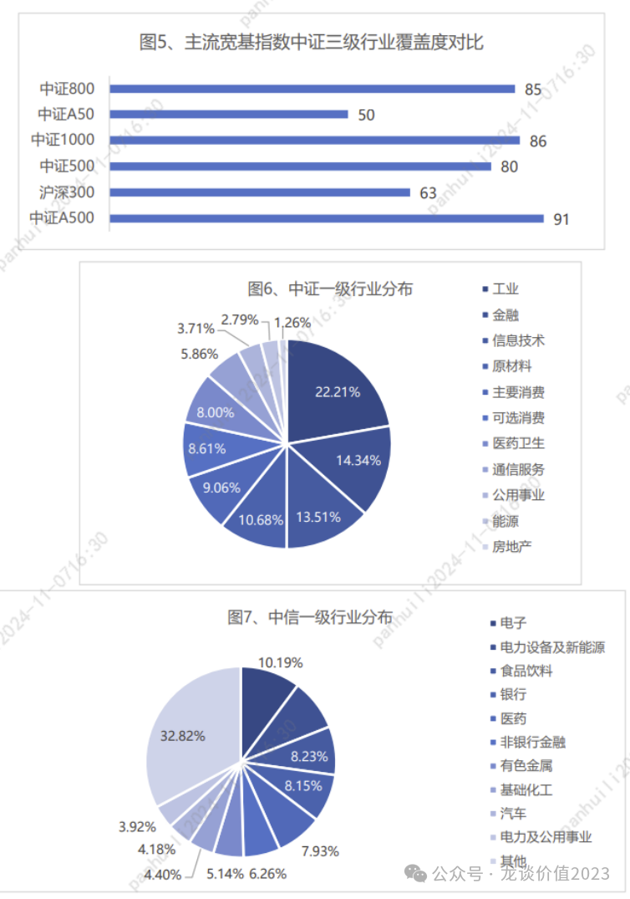
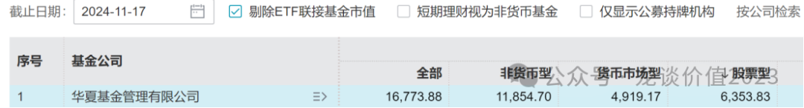

# 长期投资趋势

大家好，我是龙哥。

最近研究了一下美国资管行业的发展趋势，结合国内目前的情况给大家聊聊，这篇文章应该会对大家思考长期投资标的的选择有比较大的意义。

***01***

**对市场的判断**

以今年9月份为分界线，权益市场正在经历反转而非反弹。9月份前居民端和机构端都经历了一段严峻的资产荒：从居民段来看，居民存款增速持续走高，资金更多地用于配置保险等稳健型资产以及偿还贷款；从机构端来看，期限利差和信用利差收敛到了历史低位，资金也更多地转向了风险收益更加稳健的资产。

9月份，政策的变化成为了股票市场的催化剂，政策相对以往偏保守的状态有了非常明显的改变，使得资金大量涌入股市。股市成交量在10月8日创下天量3.48万亿。尽管近期情绪稍微有所收敛，两市成交额依旧在2万亿附近，最近基本处在2万亿以上的水平。百度指数、热搜指数显示A股热度持续维持在积极的状态。

我认为未来一两季度内，股市中枢可能会不断抬升，但波动不可避免，近期美国大选的落地，国内的应对政策也会成为市场关注的焦点。未来一到两个季度，市场倾向于是波动向上的，慢牛的市场结局正在打开。

***02***

**指数投资将成为主流**

根据海外市场的经验，**2007年之后，美国主动权益基金收益率中位数持续跑输纳指100；2014年之后，美国主动权益基金收益率中位数不再跑赢标普500**。

美国权益基金的发展历史表明，随着资本市场的成熟和有效性提高，超额收益会系统性下降，被动投资将成为大多数资金的选择。

•美国主动权益基金资金净流出的拐点恰好是2014年，也就是其整体相对于标普500不再有超额收益的时候。

所以增量资金大部分流入被动基金，尤其是场内被动ETF，主动基金的超额收益将明显降低。

国内基金市场，截至2024三季报，主动权益基金继续净赎回4%左右，被动指数基金大幅净申购10%，目前权益基金47%左右是指数基金。

自22年公募主动权益基金开始规模缩水，进入存量时代，持续被净赎回，而指数基金从22年以来逆势扩张（股票型基金中较多是指数基金）：

而目前指数扩容趋势仍然在继续，9月底开始发行的A500指数，目前市场合计规模已经达到2061亿，目前第二批ETF仍有不少在募集中，后续增量资金相关可观。

指数基金的另一个优势是偏低的费率，我们以前讲的医疗领域的ETF的综合费率普遍是在0.5%-0.6%左右，已经显著低于主动权益基金1%以上的管理费，而我们研究本次发行的A500ETF可以看到，如**512050的A500ETF基金**，11月8日成立，募集规模20亿，**管理费率仅0.15%**，相比目前市场上规模较大的宽基指数沪深300ETF的0.50%的管理费也有明显的成本优势，上周五11月15日第一个交易日，单日申购就达到28.23亿份。

***03***

**A500-新的宽基指数**

A500指数由于在编制方案上与传统宽基指数相比采取了一些差异化方法，导致其在最终的选股结果上也产生了一些相对于传统宽基指数的鲜明特征。

①编制方案特点

A500指数的编制方案与传统宽基指数“大同小异”，“同”是指市值在其编制过程中依然发挥着举足轻重的作用，例如要求成份股在“样本空间内总市值排名前1500”；“异”指的是A500指数并不是“唯市值论”，在此之外至少还纳入了以下考量：一是扩大细分行业覆盖度，并重点纳入行业龙头公司，前者体现在“优先选取三级行业自由流通市值最大的公司作为指数样本”，后者体现在“对主板证券，在所属中证三级行业内自由流通市值占比不低于2%”。

第二是与整个A股市场在中证一级行业上做到行业中性，体现在“在剩余待选样本中，从各中证一级行业按照自由流通市值选取一定数量证券，使样本数量达到500只，且各一级行业自由流通市值分布与样本空间尽可能一致”。

第三是为后续吸引外资参与跟踪A500指数的基金投资做好制度性准备，体现在“对于样本空间内符合可投资性筛选条件的证券，剔除中证ESG评价结果在C及以下的上市公司证券”，以使指数能够被大部分外资机构打上“ESG”标签，以及“属于沪股通或深股通证券范围”，使非QFII或者额度用尽的QFII机构可以通过沪股通或深股通投资。

②成份股基本特点

编制方案的“大同小异”带来的结果是，A500指数依然能够在宽基指数的整体框架当中进行评估和对比，但与其他宽基指数相比其成份股具有一定的特殊性。

第一是指数成份股构成同时包含沪深300、中证500和中证1000指数的成份股。下图可见，A500指数只有不到一半的成份股与沪深300指数重合，但是这234只的合计权重达到接近80%，因此A500与沪深300指数的走势相关性整体较高，差异主要由中证500、中证1000指数成份股所决定。

而A500指数之所以会包含较多数量的中证500、中证1000指数成份股，并将一部分沪深300成份股剔除，正是其特殊的编制方案所造成的。此外，还有16只归类为“其他” 的股票，并非市值小于中证1000成份股，而是由于沪深300指数编制方案中的主观性因素所遗留的，市值较大但既未被纳入沪深300，也未被纳入中证500的股票。

第二是指数对A股市场的覆盖度相对较高。A500指数以不到A股市场全部股票10%的成份股数量，覆盖了接近57%的A股总市值，54%的自由流通市值，63%的营业收入，以及70%的净利润和68%的分红总额，体现了对我国整体资本市场较强的代表性，及其成份股较好的基本面情况。

横向对比来看，A500指数的自由流通市值覆盖度高于市场关注较多的主流宽基指数沪深300和中证A50，但略低于成份股数量更多的中证800指数。

③行业分布特点

A500指数的行业覆盖度在宽基指数中最高，行业分布较为均衡，其编制方案决定了其对中证三级行业的覆盖度领先于其他主流宽基指数，在93个三级行业中覆盖了91个，甚至高于成份股数量更多的中证1000指数。

在其他行业分类分布上也较为均衡，以中信一级行业划分前五大行业分别为电子、银行、电力设备及新能源、食品饮料和医药。

另外A500指数具有极为鲜明的行业中性属性。由于在指数编制方案中进行了行业中性处理，A500指数与中证全指相比在中证一级行业上的权重分布十分接近，偏离度绝对值的均值仅为0.44%，显著低于其他主流宽基指数，哪怕是用更为细分的中信一级行业替代计算也处于最低水平，因此可以认为A500指数是中证全指的“缩小版”或者“优选版”，是对整个A股市场的行业无偏暴露并且相对更优的估计。

***04***

**如何选择产品**

①选择指数大平台公司

买指数要选择大平台的公司，指数产品的管理具有规模效应，一方面规模大有利于降低跟踪误差的管理，并且指数管理的经验丰富也可以进行精细化管理，降低指数基金的隐形管理成本，以及就是有大量的资源投入到做市商，保证产品的流动性较好。这也是为什么我们比较关注华夏基金——目前国内股票型基金管理规模排名第一，**昨天512050的成交额更是突破24亿元，流动性非常充裕。**

②分红条款

A500ETF基金（512050）设置了分红条款，基金管理人可于每年二月、五月、八月、十一月最后一个交易日对基金相对标的指数的超额收益率进行评价，当收益评价日核定的基金累计报酬率超过标的指数同期累计报酬率时，可进行收益分配，基金的收益分配对于个人而言一方面免税，另一方面是止盈的动作，更加有利于长期的收益积累。

*风险提示：本文仅讨论行业/公司经营情况，投资需综合考虑公司经营、估值、管理层等多方面因素，建议读者审慎参考，本文不作为投资依据，不建议大家根据本文做出投资计划。*

<!-- wxmp-comments-begin -->

---

## 留言（1 条，含回复共 5 条）

- **Bryan** 👍7 · 2024-11-19 16:26
  龙哥，
  1.&nbsp;怎么评估医保基金预付制度落地对民营医院，医疗机构现金流，应收的改善？只是能收到的提前收到，还是能减少应收？包括化债落地是否也能传递改善？
  2.&nbsp;怎么看小罗伯特肯尼迪这个任命？能否通过？通过了能多大程度搅动美国的医疗体系？
  - ↳ **作者** · 2024-11-19 16:33
    1、符合条件的城市的符合条件的医疗机构，可以在年初提前收到1个月的医保预付款，对现金流的改善是会有的，但需要注意的是，符合条件的城市和医疗机构，本身医保的压力可能就没有那么大，而真正压力巨大的后线城市，又并不符合本次预付的条件。因此，虽然说是利好，但确实有局限性。
  - ↳ **作者** · 2024-11-19 16:34
    2、在医保预付的背后，我认为要看医保局的本质想做什么事，他实际上想做的是，通过这一个月的预付资金，让医疗机构配合他来做很多过去推的比较困难的政策，比如医疗机构加速给上游回款、国谈药品入院、支付方式改革等等，这里面对于医疗机构和上游药械企业来说，有利好，也有利空。
  - ↳ **作者** · 2024-11-19 16:35
    3、化债的落地，我认为对医疗行业还是会有比较显著的利好的，后线城市的财政状况有改善的话，不论是医保、还是设备采购资金，都会好过一些。
  - ↳ **作者** · 2024-11-19 16:36
    4、美国医疗行业我认为后续的不确定性比较多，第一是川普削减政府开支会对医疗支出带来较大的压力，另一方面是肯尼迪后续的政策方向从他目前的发言来说也还有比较多的不确定性。

<!-- wxmp-comments-end -->
