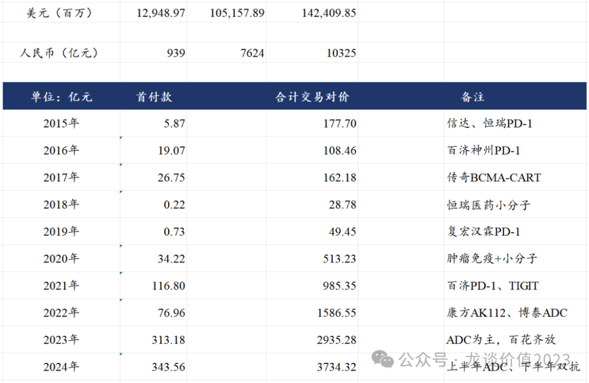
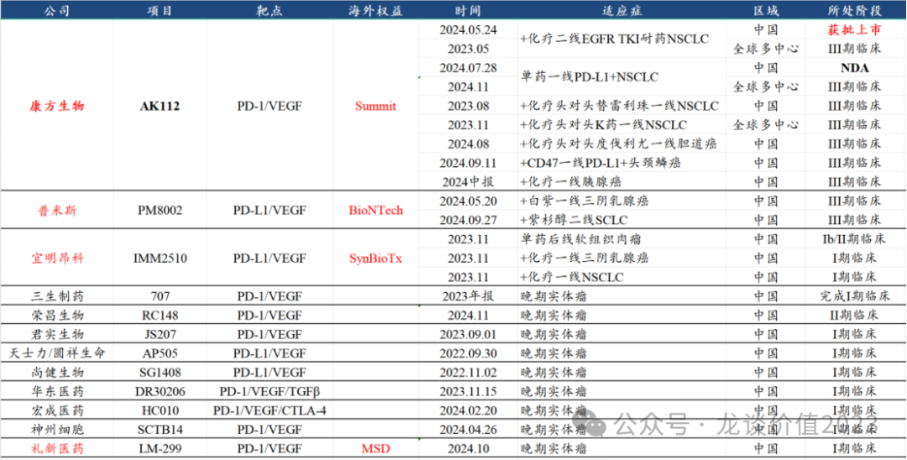
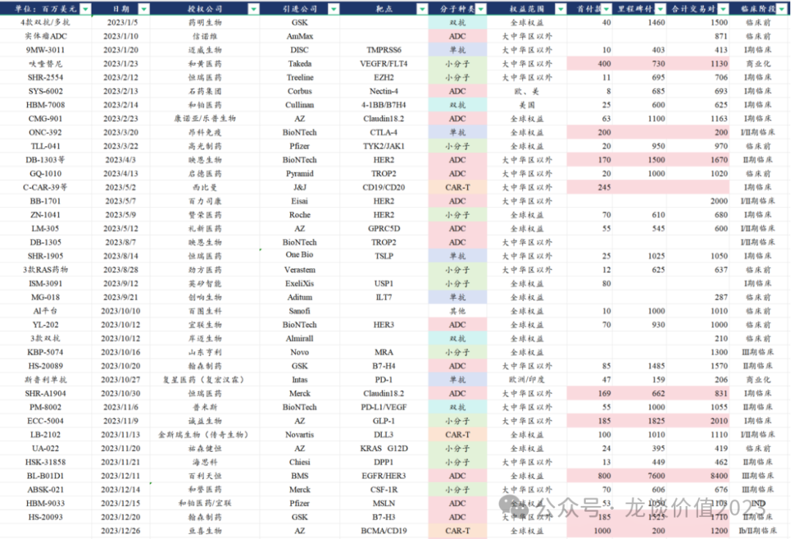
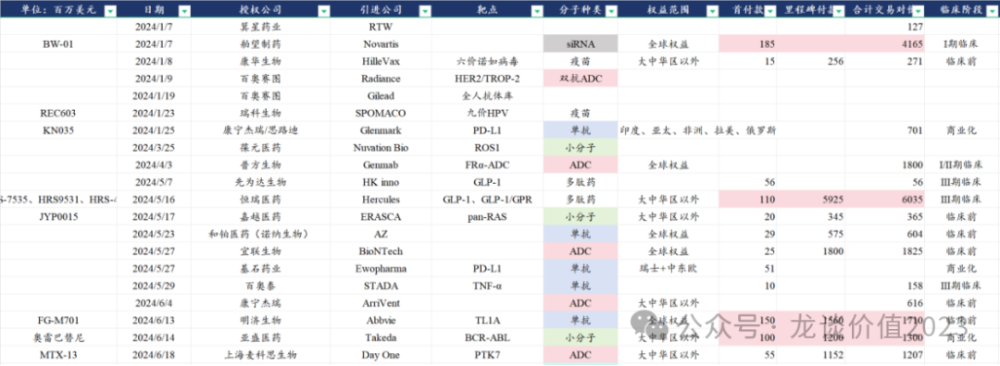
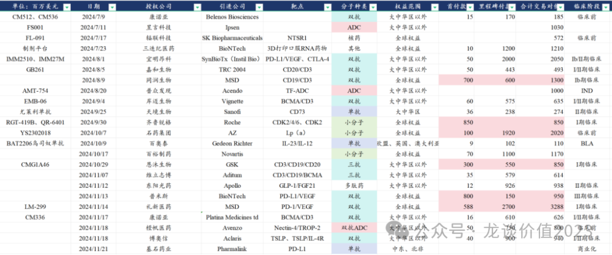

# 中国医药历史性事件

大家好，我是龙哥。

前面一篇文章《[**最好的医药投资标的**](https://mp.weixin.qq.com/s?__biz=MzkyMzQ3MDc3Mw==&mid=2247484001&idx=1&sn=e4e8c55d7ec1a4c25ceaae302829b009&scene=21#wechat_redirect)》中给大家聊到，创新药公司的市值占比在持续提升，尤其是创新药出海的龙头公司市值提升更加明显，那么中国创新药出海到底有多大体量了呢？这篇文章给大家答案。

截止到2024年11月底我统计到的数据（会有少量很小的标的没统计到），**中国创新药海外授权总的首付款规模高达129.49亿美元，总的交易对价合计1424.1亿美元，按当前人民币兑美元汇率7.25计算，首付款合计为939亿元，而总的交易对价则已经高达10325亿元，中国创新药出海BD规模突破万亿！**

这里我对每年BD交易的情况做了大致的总结，大致可以分为3个阶段：

**①2015-2019年算是中国创新药的萌芽期，海外BD授权都是比较零星的产品，****其中最有代表性的一款全球BIC的产品是传奇生物的BCMA-CART**，我们知道这款产品2022年上市后快速商业化放量，今年将达到10亿美元销售，强生预计该产品峰值达到50亿美元，海外大行预计销售峰值预计达到70亿美元。

**②2020-2021年是中国创新药海外授权井喷的第一个阶段，但海外授权的产品是以肿瘤免疫相关靶点为主，基本还是PD-1的后时代**，大家都希望找到“第二代的PD-1”，而我们知道2018-2020年在港股18A确实也IPO上市了一批做肿瘤免疫的公司，有的至今还是耳熟能详如百济、信达、君实、复宏汉霖、康方等等，有的则是已经较为低迷乃至折戟沉沙如基石药业、康宁杰瑞、天境生物。当然到今天我们看到更多“下一代PD-1”的潜在机会。

**③2022H2至今是第三个阶段，**在肿瘤免疫面临一众失败、信达生物信迪利单抗/和黄医药索凡替尼等几个国产新药出海失败、多个海外授权项目被退货之下，国产创新药出海阶段性沉寂。**2022年下半年，行业低迷之际，科伦博泰和康方生物两个明星冉冉升起。**

科伦博泰在2022年下半年连续与默沙东达成了3笔ADC药物的海外授权合作，一举奠定了科伦博泰的中国ADC龙头地位，3笔合作合计拿到2.57亿美元首付款，合计交易对价高达114亿美元，为中国创新药海外BD授权总交易对价最高的公司（单品种最高的是百利天恒）。

康方生物在那年更是惊艳，从Summit手中拿到5亿美元首付款+45亿美元里程碑付款的合计50亿美元交易对价，**AK112实现被投资人从看不上、到看不懂、到追不上的蜕变**，并随着卓越的临床数据持续的发布，引领了一波PD-1/L1\*VEGF双抗的研发热度和BD交易。

**但这并不是中国创新药出海的高点。在随后的2023-2024年，让我们真正看到中国创新药出海的热度：**

2023年中国创新药达成了合计313亿元首付款、2935亿元总交易对价的海外BD授权，ADC出海全面井喷，更是出现了百利天恒的EGFR/HER3 ADC以8亿美元首付款、84亿美元总交易对价授权BMS的超大规模BD，同时还出现了两款CAR-T疗法、4款双抗、多款单抗和小分子、一个AI制药技术平台的海外授权，创新药授权开始百花齐放。

（交易对价标红底为首付款超过1亿美元）

原以为2023年的海外授权就是一个近几年的高点，但是，还有高手！

2024年截止到11月底，创新药海外授权的首付款344亿元、总交易对价3734亿元已经全面超越2023年。其中比较惊艳的交易，包括开年信瑞诺以35亿美元被诺华并购，且时隔几日诺华接着以41.65亿美元的总交易对价引进舶望制药的siRNA药物；5月份恒瑞医药的GLP-1、GLP-1/GIPR系列产品以Newco方式出海，总交易对价高达60.35亿美元；宜明昂科、礼新医药两家公司分别以20.5亿美元和32.88亿美元的总交易对价实现PD-1/L1\*VEGF双抗的海外授权。

2024年上半年和下半年，创新药海外授权呈现出非常明显的跟随技术趋势的特点，2024年上半年基本延续2023年的趋势，以ADC为主、其他新分子类型为辅：

**2024年下半年则是TCE和PD-1/L1\*VEGF等双抗进入井喷期：**

另一个有意思的地方，是大量的项目开始通过Newco的方式出海，早期项目的价值具有极大的不确定性，可能天堂、可能地狱，因此早期项目能拿到的首付款一般都比较少，一旦项目的价值被重新发现，估值可能有天翻地覆的变化，最典型的就是在《[**医药行业离谱事件**](https://mp.weixin.qq.com/s?__biz=MzkyMzQ3MDc3Mw==&mid=2247483848&idx=1&sn=aa0791f438ad4b17069d48348913448b&scene=21#wechat_redirect)》文章里第三条的“最黑中间商”，时隔4个月转手一卖赚了10亿美金，因此，Newco方式出海的模式，资本做局、授权方拿部分持股，不失为一种好的模式。

作为有幸经历中国创新药从资本市场放开（港股18A和科创板第五套规则），到一大批优秀品种海外授权；经历了4年的医药熊市，也见证了一批具有优秀产品力的创新药出海企业股价逆势腾飞；**站在当下，创新药出海仍是风光无限，未来可期。**

*风险提示：本文仅讨论行业/公司经营情况，投资需综合考虑公司经营、估值、管理层等多方面因素，建议读者审慎参考，本文不作为投资依据，不建议大家根据本文做出投资计划。*

<!-- wxmp-comments-begin -->

---

## 留言（11 条，含回复共 23 条）

- **大庆** 👍4 · 2024-11-29 11:48
  什么板块都涨，就是医药器械板块不涨，涨的少，跌的凶[发怒]
  - ↳ **作者** · 2024-11-29 11:54
    医疗器械之前多次说过，定价体系尚未明确，仍是集采主导的价格体系就很难做投资。
- **英丹** 👍3 · 2024-11-29 10:18
  龙哥，请问海吉亚还能看吗？
  - ↳ **作者** · 2024-11-29 10:26
    海吉亚的扩张也开始放缓，医疗服务的商业模式决定经营现金流很好，如果后续投资现金流快速下来，意味着公司将开始加大股东回报力度，未来就是基于企业现金流和价值来看。短期市场是过于悲观的，对于当前后线城市的医保压力带来的坏账客观存在，企业也在积极应对。
- **西瓜放微波炉** 👍2 · 2024-11-29 10:45
  龙哥，能分析下京东健康吗，长期的话，是否可以持有。
  - ↳ **作者** · 2024-11-29 11:20
    可以看看上上篇文章吧，前面大致讲到了。
- **青衫书生** 👍2 · 2024-11-29 14:02
  恒瑞和豪森应该来个世纪大合并[呲牙]
  - ↳ **作者** · 2024-11-29 14:26
    你说的有道理，他俩管线重合度还是比较低的，是可以互补的，而且本来就是一家人，连云港的厂都是邻居，中间围墙拆了就行了，干嘛还分两家呢，趁着现在鼓励并购重组，不如一把合并了算了，哈哈😂😂
- **Benjamin** 👍1 · 2024-11-29 10:38
  龙大，个股不好把握，买创新ETF怎么样？
  - ↳ **作者** · 2024-11-29 11:03
    我前面的文章一直在说定投医药etf还可以的，医药这么这么垃圾的行情，也跟着大盘稍微一反弹就解套了，可以看上上篇文章。
- **Grace白** 👍1 · 2024-11-29 10:42
  百济后续咋样呀？龙哥
  - ↳ **作者** · 2024-11-29 11:21
    百济btk海外份额仍在逐季度提升。
- **徐海东** 👍1 · 2024-11-29 10:43
  文章很好！请问对恒瑞医药纳入国家医保目录和未来国际化发展预期怎样？
  - ↳ **作者** · 2024-11-29 11:21
    恒瑞和翰森这俩，这两年国际化的进展还是挺大的，文中也提到了恒瑞60亿美金的GLP-1相关资产的交易。国内医保目前倒是没看到恒瑞这边特别亮眼的品种。
- **上水** 👍1 · 2024-11-29 10:53
  龙哥，绿叶制药有没有反转的机会，貌似除了现金流其他都挺好啊
  - ↳ **作者** · 2024-11-29 11:19
    新产品放量还是值得期待的，尤其看帕利哌酮明年美国卖的咋样。
- **Jeffery** 👍1 · 2024-11-29 11:14
  然而医药ETF定投2年&nbsp;还亏损中···
  - ↳ **作者** · 2024-11-29 11:18
    那应该前面买的位置确实高了点，以及最近又跌了一波[流泪]
- **江南小宝贝** 👍1 · 2024-11-29 13:13
  龙大&nbsp;康方现在是不是适合长拿？
  - ↳ **作者** · 2024-11-29 13:20
    那得看你拿多长，如果想特别长周期的长拿做价值投资，那我建议别选创新药。创新药行业的特点本身就是技术在快速变化和更新，对于创新药公司每一个个体来说，我今天给你说的东西，可能下周就会被一个新技术颠覆掉，需要持续的跟踪观察，绝大多数的创新药公司都是阶段性投资机会。
  - ↳ **作者** · 2024-11-29 13:21
    如果你说的长拿是看明年，那我基于当下的判断，是愿意拿着去等待明年的海外进展的。
- **六爻** · 2024-11-29 14:58
  希望益方的几个也可以尽快出海[委屈][委屈][委屈]
  - ↳ **作者** · 2024-11-29 15:01
    益方生物我前几天也刚去过调研，看下来我自己感觉都要到明年下半年海外可能有进展

<!-- wxmp-comments-end -->
