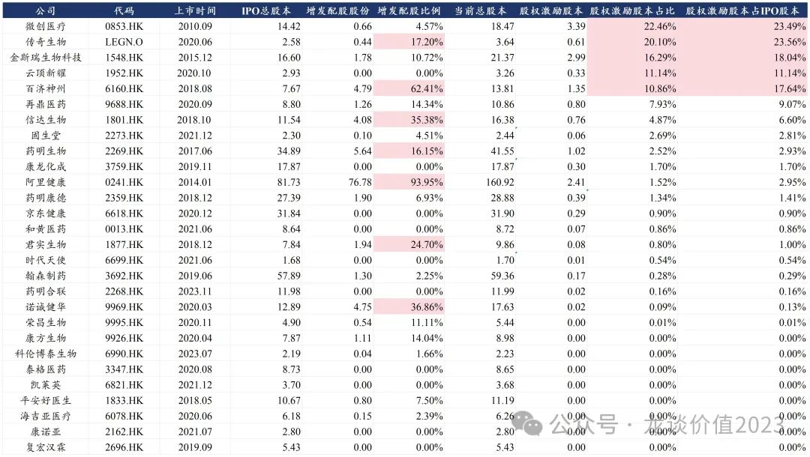

# 是谁在掏空上市公司

**当管理层的利益与股东利益不完全一致的时候，就会存在管理层套取上市公司利益的情况**，方式有很多，例如通过一些日常经营上的关联交易，或体外资产注入、重大并购重组，**再或者还有一种方式——股权激励**。

股权激励原本是一种将管理层与上市公司股东利益相互绑定的方式，通过将部分薪酬或奖励以股权的方式授予管理层，股价涨了则公司股东和管理层都能受益。

但在某些情况下，过度的进行股权激励，会导致公司股东的股份被摊薄，且由于股权激励往往不属于上市公司的现金支出，费用一般分几年去摊销，因此在利润表的影响相对可控、在现金流量表上也不体现，往往容易被大家忽视，但这确实切切实实摊薄股东权益的事情。

因此，**我们统计了港股医药行业部分市值靠前公司的股权激励占股本比例。**

这里先做一个解释，上市公司的股本变化一般有几种情况：定向增发/配股（包括在其他市场如A股上市）、回购注销、派发红股/转增股本，我们以下的测算，是以公司在港股/美股IPO后的总股本到最新总股本的变化，扣除配股、其他市场增发、派发红股和回购注销部分后，认为其他股本的增加就来自股权激励授予的股份。

这其中没有包含的股权激励股份包括：①已经发了股权激励但直到现在还未授予的；②通过回购股份方式授予的。

因此以下统计是有局限性的——但实际只会更多而不会更少。

由于港股的股权激励大部分是通过增发股份方式，因此我们可以认为以下数据可以代表大部分公司的情况。

具体统计结果如下，按股权激励占总股本比例排序：

**当大家看到这张图，就能明白为什么有些公司基本面不错、股价走的像快破产，也能理解为什么有些公司明明有那么好的基础、却能把公司拆的一塌糊涂。**

**股权激励规模少并不能代表上市公司管理层一定道德水平非常高，我也一直认为适当的进行一些股权激励是有利于公司经营的，但股权激励占比过高一定是有问题的。**

***风险提示：本文仅讨论行业/公司经营情况，投资需综合考虑公司经营、估值、管理层等多方面因素，建议读者审慎参考，本文不作为投资依据，不建议大家根据本文做出投资计划。***

<!-- wxmp-comments-begin -->

---

## 留言（2 条，含回复共 3 条）

- **Bryan** 👍8 · 2024-12-02 11:55
  1.&nbsp;基本面不错、股价走的像快破产-&gt;传奇/金斯瑞；-&gt;真不知道这么高...考虑认栽，放低预期吧...
  
  2.&nbsp;也能理解为什么有些公司明明有那么好的基础、却能把公司拆的一塌糊涂-&gt;微创系
  
  我觉得绝对值2%就不好了，好几家知名公司这么高...又或者你业绩超级优秀啊，例如马斯克的股权激励我就服...
- **知行** 👍1 · 2024-12-02 12:06
  创新药公司缺钱，不得不想法设法配股增资…摊平股东权益
  - ↳ **作者** · 2024-12-02 12:07
    对外融资投研发是一码事，大幅股权激励给管理层发钱是另一码事。

<!-- wxmp-comments-end -->
