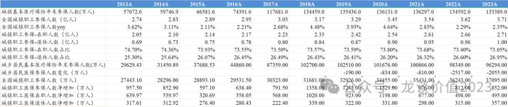
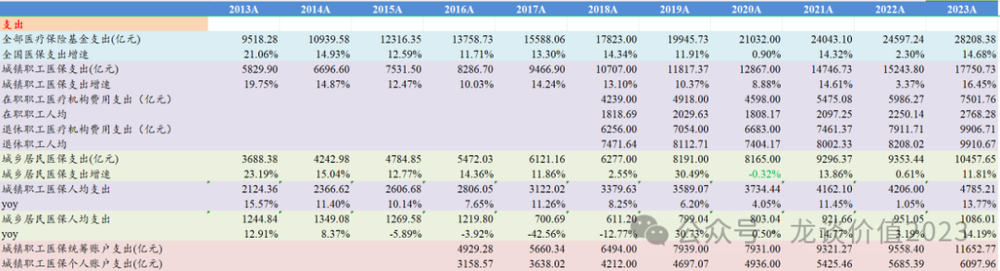
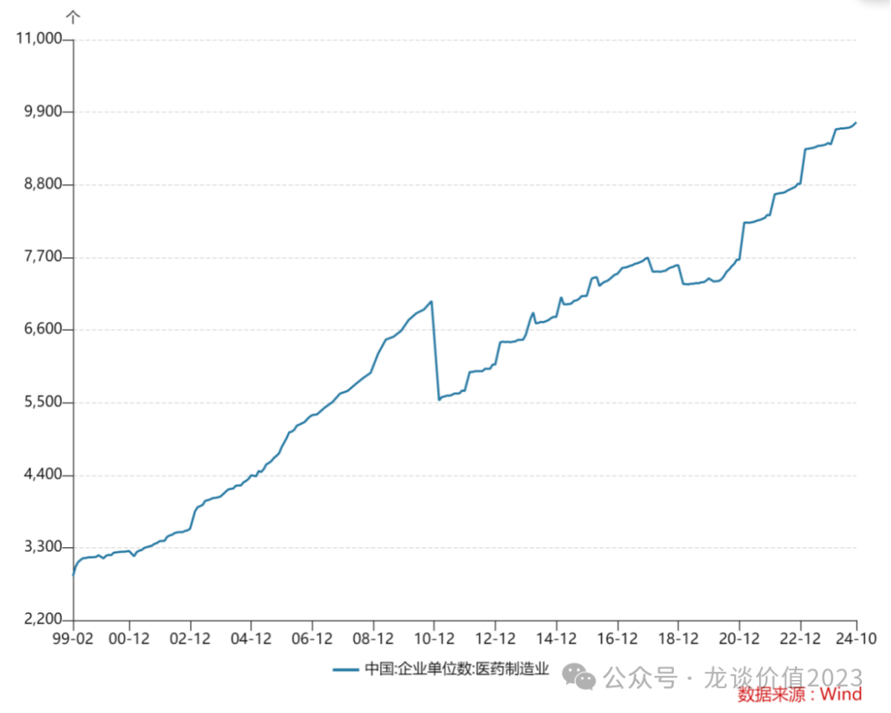
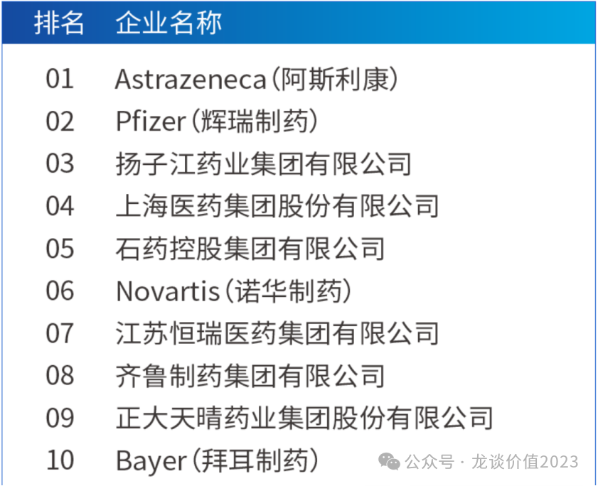
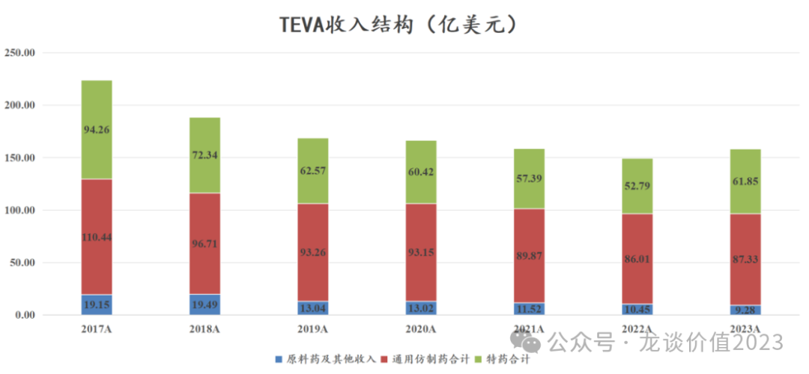

# 非典型利空

大家好，我是龙哥。

昨天，第十批全国药品集采正式落地，被比较多的媒体报道，尤其是由于本次集采规则相对严格，导致一些品种的降价幅度比较大，多个品种降幅甚至在95%以上，也有如阿司匹林这种个别品种最低价降到3分钱一片。由此，又引发了一些讨论和担忧。

实际上仅仅就本次集采而言没有必要单独写一篇文章，但由于前段时间还有些传闻认为国家级的集采将会逐渐放松，因此还是借今天这篇文章来聊聊我的观点。

（文末赠资料）

***01***

**集采长期趋势不可逆**

大家知道龙哥这里经常发的几份对国内医疗行业长期跟踪的数据，比如国内创新药企业创新药收入汇总，中国医疗费用结构、医保数据，历年医保谈判重点品种价格，当你长期跟踪把这几份数据放在一起看，就会对行业的发展趋势有很清晰的认识。

我们看一个非常基础的数字——国家医保参保人数，2021年达到了峰值13.63亿人，随后连续两年下降，2023年是13.34亿人，减少了接近3000万人，而职工医保参保人数可以看出退休人数占比自2020年以来在持续提升，2023年已经创下历史新高，达到26.95%，可预见的是未来还将进一步提升，随着人口老龄化，居民医保也必然是和中国医保类似的趋势。因此，**医保缴纳人数和使用人数的剪刀差将会持续扩大，医保支出端的增速将长期受制于经济总量增速和劳动力数量变化**。

与之相对的，我们统计了**上市的中国创新药企业大致的创新药收入规模，在2021-2024年分别是500多亿、600多亿、800多亿和1100多亿，23-24年行业呈现30%-40%的高增长，25年预计仍会有一个较高的增速**。

创新药械的快速放量的背景，是医保支出增速的放缓——**2020-2023年医保支出复合增速只有9.05%，低于2013-2019年的13.12%的复合增速**，而这其中压力尤其大的是城乡居民医保，我们知道居民医保现在是每人交400块，则年缴纳金额不到4000亿，而23年的支出是1.05万亿，剩下的6000多亿就是财政补的部分，对于后线城市来说这是巨大的资金压力。

在整个医保支出增速放缓的同时，药占比还在持续下降，门诊病人的药费支出占比由2012年的50%下降至2019年的40.61%、并进一步下降至2023年的36.92%，住院病人的药费支出占比由2012年的41%下降至2019年的27.52%、并进一步下降至2023年的22.86%，可见药品市场规模的增速实际上还要再显著慢于整个医疗行业总盘子的增速。

结构上还有另一点变化，就是由于21年以来对中药的大力支持，部分原本被限制医保支付范围的中成药也陆续得到医保支付的解禁，多个中药注射剂品种在这两年实现爆发式的放量。

因此我们可以判断：**创新药增速＞中药行业增速＞检查检验费用增速＞医保支出增速≥医疗卫生总费用增速＞药品行业增速。**

**那么问题来了，在创新药行业高增长、中药行业政策全力支持、药品行业总盘子不增长的情况下，谁来承担创新药/中药的增量？**

**——毫无疑问，只能是传统的成熟药物。这就像一个跷跷板，撬起来这头、那头就必然会落下去，医保的总盘子就这么多，还要为未来的深度老龄化做储备。因此集采的长期趋势，可能会有波折反复，但长期趋势不可逆，大部分竞争激烈的成熟药品未来长期都应该是成本加成定价。**

***02***

**价格合理吗？**

药品价格降那么多，甚至到几分钱一片，合理吗？药品质量能得到保障吗？这是大部分老百姓内心最大的疑惑和担忧。

**——不合理，但也很合理。**

说不合理，因为唯价格论对于极其严谨和直接关乎广大老百姓身体健康的药械行业是不合适的，尤其是大量的药品还伴随着医生教育、患者教育、长期慢病管理、副作用管理等服务，并非单纯的制造成本，即便是制造成本，质量管理的上限和下限也有很大操作空间。

但目前的集采框架，本质上没有脱离市场化竞价的范畴，价格的恶性竞争来自较差的竞争格局，第十批集采的品种降幅很大，背后是这些品种中，竞争格局最好的也有6家仿制药+1家原研药，竞争格局最差的有36家仿制药，如此多的竞品去争夺市场，最终结果就是变成成本加成定价。

100块去买90%疗效的药和1块去买70%-80%疗效的药，对于患者来说是0和1的选择，对于支付方来说则是权衡经济价值。

**——药品质量如何是药监局的事情，药品竞价规则制定是医保局的事情，国内药企疯狂重复研发，药监局大批量审批，医保局的市场化竞价则是阳谋。**

低价来自极差的竞争格局，医药供给端过剩的问题非常严重，中国医药制造业企业的数量，截至2024年10月，合计是9748家，相较2018年底开始集采时又增加了2400家，集采的6年，医药制造业非但没有出清，反而仍在逆势扩张。

此前我们复盘日本医药行业的时候曾经讲到，日本医药行业经历了非常长周期的行业出清。

日本药企数量从1975年的1359家下降至2000年的1123家（减少17%），再到2010年的370家（减少67%，主要是2005年实施的药事法对药品制造和销售的职能进行分离），再到2015年的305家（减少17%），行业经历了非常残酷的重组和淘汰，**1975年-2015年的40年间，日本制药企业数量合计减少了78%。**

**最终，日本制药行业前五大药企的市占率CR5从90年代的21.3%提升到2024年的47.8%，CR10从34.1%提升到60.8%。**

CR10达到60%是什么概念呢，按米内网的数据，2023年我国三大终端六大市场的药品销售规模合计18865亿元，其中**TOP1的阿斯利康2023年中国区收入是416亿元，市占率约为2.2%，**排名第四、第五、第七的上海医药、石药集团、恒瑞医药2023年的医药工业收入分别为263亿元、256亿元、224亿元，市占率分别为1.4%、1.36%、1.2%，**也既中国医药行业CR10不到15%。**

**即便药品行业的总规模增速放缓，如果未来国内医药行业集中度能提升一倍，CR10提升到30%左右，叠加海外收入占比大幅提升，将带来头部药企的收入规模扩张3-4倍或更多，这不可能是仿制药拉动，**即便是欧美市场的仿制药龙头TEVA也经历了多年的仿制药收入下滑。

**以上这些内容，对于投资人来说，原本是在2018年集采之初就想明白的问题，但直到今天，仍有大量的投资人盯着药品集采价格来讲医药行业利空。**

**是利空吗？是存量品种的利空，是利益品种的利空，但却是创新药的盛世。**

**对于我来说，集采早已经是医药行业的“非典型利空”。**

***03***

**第十批集采短期影响谁？**

①多柔比星脂质体市场规模30亿+，本次集采降价96%-97%，集采前石药占68%份额（未中标）、复旦张江占15%。

②去甲肾上腺素市场规模20亿+，本次集采降价80%-95%，集采前远大医药占71%份额。

③哌拉西林注射液市场规模20亿+，本次集采降价80%-90%，集采前复星旗下苏州二叶19%份额，科伦药业8%份额。

④钆特酸葡胺市场规模5亿+，本次集采降价70%-75%，恒瑞医药89%份额未中标。

⑤哌柏西利降价71%-97%至最低5.6元/片，而恒瑞医药的达尔西利——哌柏西利的me too药物——医保价格205元/片。

————————

**文中的医保数据、医疗费用结构数据，可以免费分享给大家：**

**①关注龙哥满1年 或 有过赞赏文章（任意金额）。**

**②符合条件①的读者，在文末留言或后台私信留下邮箱，2日内发送。**

**③有我微信好友的读者直接私信我发，别留邮箱了。**

***风险提示：本文仅讨论行业/公司经营情况，投资需综合考虑公司经营、估值、管理层等多方面因素，建议读者审慎参考，本文不作为投资依据，不建议大家根据本文做出投资计划。***

<!-- wxmp-comments-begin -->

---

## 留言（20 条，含回复共 40 条）

- **摆渡3752** 👍8 · 2024-12-13 16:47
  [叹气]现在好多药强推仿制药，但是效果又很差，没办法，都是自己上网买
  - ↳ **作者** · 2024-12-13 16:52
    是这样，因为有集采的报量指标要完成，有经济条件的患者想要效果更好，就是自费买原研。
    
    另外，为什么视频号可以留言呀。
- **魏小魏** 👍6 · 2024-12-13 16:33
  FF+集采，让我远离了医药股
  - ↳ **作者** · 2024-12-13 16:41
    远离了医药股，还能关注我这个号，真不容易
  - ↳ **作者** · 2024-12-13 16:44
    关注是因为在医药这个领域，确实你写的非常好了
- **邱建** 👍2 · 2024-12-13 16:49
  余大嘴说的模仿是没有未来的
- **麦** 👍2 · 2024-12-13 16:57
  不知道什么药企能起飞，就定投医疗指数吧。医药春天总会来，慢慢存子弹好了
- **施创** 👍1 · 2024-12-13 16:32
  现在的医疗体系，是医院的问题，是医生的问题，一种药明显还没吃完，又再新开一堆，这样的医疗资源浪费，是谁造成的呢？
  - ↳ **作者** · 2024-12-13 16:34
    你说的这个问题明显属于医生患者沟通不到位的问题，在医疗行业都算是小问题了。
- **洪易** 👍1 · 2024-12-13 16:32
  吃药只敢吃原研的了，国内的仿制药该说不说效果很差
  - ↳ **作者** · 2024-12-13 16:35
    这个还是文中提到的，对药物的选择，对患者来说是0和1的区别，对支付方来说是算经济账的。
- **知行** 👍1 · 2024-12-13 16:41
  港股创新药好难熬啊，是真的不涨啊，一动不动，市场不认，三年多没有医药的利好消息了。。。。
  - ↳ **作者** · 2024-12-13 16:43
    今年港股头部创新药还可以，主要是年初CXO实在是太拉了，对指数的负面影响很大。
- **sgc** · 2024-12-13 16:21
  可以占龙哥一个好友位嘛，哈哈
  - ↳ **作者** · 2024-12-13 16:46
    既然你提了，可以吧，哈哈。
    读者里我加好友的，基本就几类，同行或产业人士、我司客户、平时留言和后台交流互动较多的读者。
- **阿白** · 2024-12-13 16:35
  龙哥，康方生物咋看
  - ↳ **作者** · 2024-12-13 16:37
    康方市场共识那么一致，还能咋看，等明年海外第一个III期数据，以及AK104的海外进展吧。
- **晓风残月** · 2024-12-13 16:38
  迈瑞现在风险很大吗？20日线不断下滑[捂脸]
  - ↳ **作者** · 2024-12-13 16:40
    迈瑞医疗大概还需要2个季度来消化渠道库存和前期的业绩高基数吧。
- **让我重返战场的是信念的力量** · 2024-12-13 16:57
  写留言的时候点击头像可以更换留言身份，哈哈
  - ↳ **作者** · 2024-12-13 16:58
    现在微信公众号这么会玩吗，哈哈
- **包杰** · 2024-12-13 17:01
  怎么看安徽ivd发光行业的集采
  - ↳ **作者** · 2024-12-13 17:03
    在这几年院内药费得到大幅的控制后，检查检验费用的占比显著提高，这点和大家很多切身感受是一致的，就是去医院先开很多检查，并且有不少是重复或没必要的，因此这两年检查检验费用也开始陆续控制，不管是前端的集采还是后端收费的调整。
  - ↳ **作者** · 2024-12-13 17:05
    化学发光前面集采的几项像传染病这些，对国产的影响相对还好，份额有所提升，外资相对没有很激进的竞争，而这次肿标的集采，规模更大，涉及到外资巨头的基本盘，具体情况就要等落地再看了，并不是那么确定。
- **星移无痕** · 2024-12-13 19:37
  疗效已经退居末位了
  - ↳ **作者** · 2024-12-17 17:02
    所以要看创新药呀，创新药监管政策和定价体系，现在还是在逐步完全的
- **李千一@国盛策略** · 2024-12-13 22:22
  感觉国内创新药的一个很大问题是在国内同一个靶点，一堆企业都在搞，名义上是创新药，搞了几年就成了仿制药了，就比如PD-1，GLP-1这些全球的大单品，所以还是得出海。但出海过程太慢了，而且中美关系，也是一个很大的问题，就像CXO，这次是没事了，那下次呢，不怕贼偷就怕贼惦记啊
  - ↳ **作者** · 2024-12-17 17:01
    就是我们一直说的重复低水平研发的问题，需要尊重专利、CDE收紧审批、行业出清才可以。
- **刘较瘦** · 2024-12-13 22:51
  万东龙哥怎么看？
  - ↳ **作者** · 2024-12-17 17:01
    万东要看美的的运作，现在我看不太清晰哎
- **欢乐马** · 2024-12-14 00:17
  先声咋样&nbsp;有前途吗
  - ↳ **作者** · 2024-12-17 17:00
    先声不太好评价，他要把肿瘤创新药的资产独立出来融资和上市， 感觉会对集团公司的价值有很大的影响。
- **风的影子** · 2024-12-14 01:14
  绿叶🈶新药上市，股价却悄悄的新低了[流泪]
  - ↳ **作者** · 2024-12-17 17:00
    绿叶还不是新药的事，他是因为血脂康集采了，中成药集采逐渐扩面，这些独家品种也都受到影响，其实从行业角度我认为是好事，对个别公司的影响确实要独立去看。
- **包包** · 2024-12-15 19:39
  龙哥能否分析一下健康元？这次集采对其营收业绩影响大吗？
  - ↳ **作者** · 2024-12-17 16:59
    健康元比较大的呼吸科和抗生素的品种之前都集采过了。
- **zhz** · 2024-12-16 09:43
  龙哥，澳华内镜和微电生理为啥业绩忽上忽下，啥时候能步入正轨
  - ↳ **作者** · 2024-12-17 16:58
    澳华内镜受国内招标影响比较大，电生理的业绩和国内集采的节奏有关系。都是收入体量还小、成长期业绩不稳定也是正常的。
- **木木_森林** · 2024-12-17 16:47
  龙大，恒瑞明明不缺钱，怎么还要跑去香港融资上市？打开国际市场一定要在香港上市？我有点不信哦！
  不过今年到第三季度的利润除去授权的1.6亿欧元，基本上是与去年持平，是不是因为集采连恒瑞这样的巨头赚不到钱后&nbsp;&nbsp;也得跑去圈钱才能养活公司呀？[捂脸][捂脸]
  - ↳ **作者** · 2024-12-17 16:57
    港股融资俩原因嘛，一个是拿钱投创新药研发，一个是HK毕竟是国际市场，在HK上市有助于他的国际化。

<!-- wxmp-comments-end -->
