# 长期思维模式转变2

大家好，我是龙哥。

文初先说一下，上一篇文章里给大家免费分享的数据资料，凡是我看到留言的都已经发送，如果有遗漏的可以再留言说一下。

10月的一篇文章《**[长期思维模式的转变](https://mp.weixin.qq.com/s?__biz=MzkyMzQ3MDc3Mw==&mid=2247483991&idx=1&sn=43e008e34a2fad41a09d27ace8fb3db7&scene=21#wechat_redirect)**》里和大家聊到投资红利的本质，我认为这不是一种短期的市场风格或者主题炒作，追求股东回报是一种长期思维模式的转变，这种思维模式的转变与过去的主题炒作、产业链景气度投资都有巨大的差异。

过去我们看到诸多行业的起起落落，大量的资本开支投进去带来一段时间的高成长期，产能过剩又带来全行业的亏损，在扩张期企业说我们要把钱拿来扩产能、投研发，在下行期企业说我们要把钱拿来保存实力、度过寒冬，总之股权融资拿钱的时候找机构和小股东，赚钱了从不提给小股东分红，最终小股东们在一轮轮的行业周期里起起落落，终无所得。

而当前时点又是一个比较特殊的时点，在今年11月我国10年期国债突破2之后，近期迅速突破了1.7，下行的斜率非常陡峭。

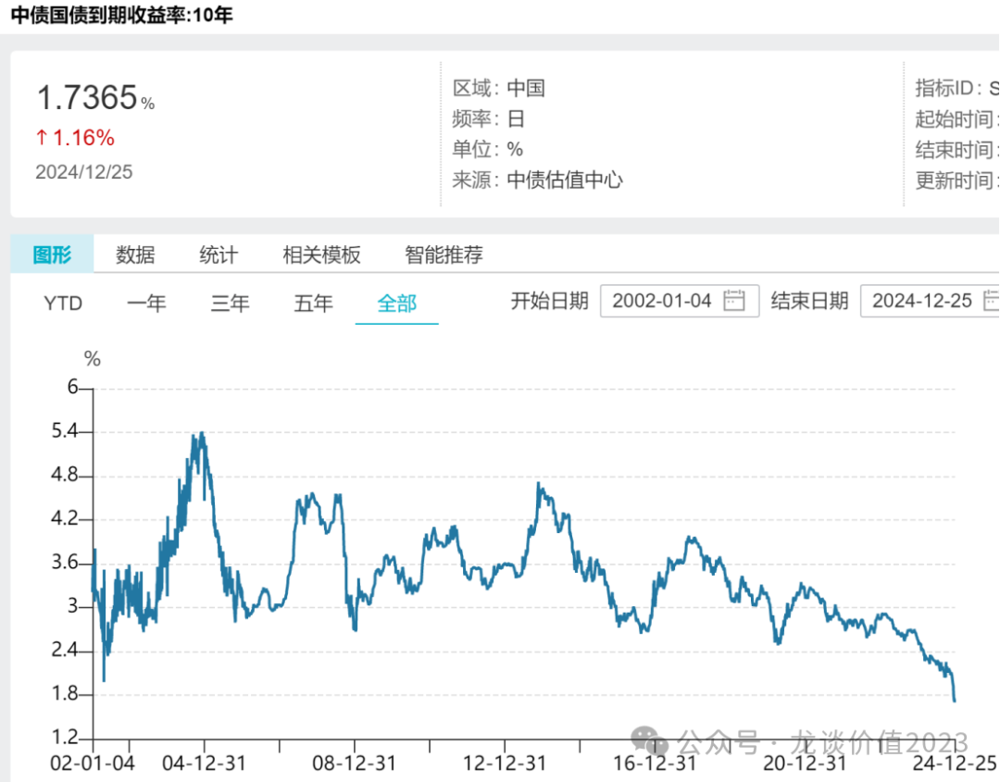

之所以利率会下的这么快，临近年底，很多大资金需要布局明年的配置计划，利率下行的背景下，谁先配置谁的收益率就高，明年的业绩就有保障，再叠加上最近的经济数据的确差强人意，消费的复苏不是一蹴而就，需要收入的提升叠加各项政策加大力度可能才能发挥合力的效果，且目前的PPI仍然在0以下，整体经济体仍然处于通S，要走出通S，降息是必须的工具。

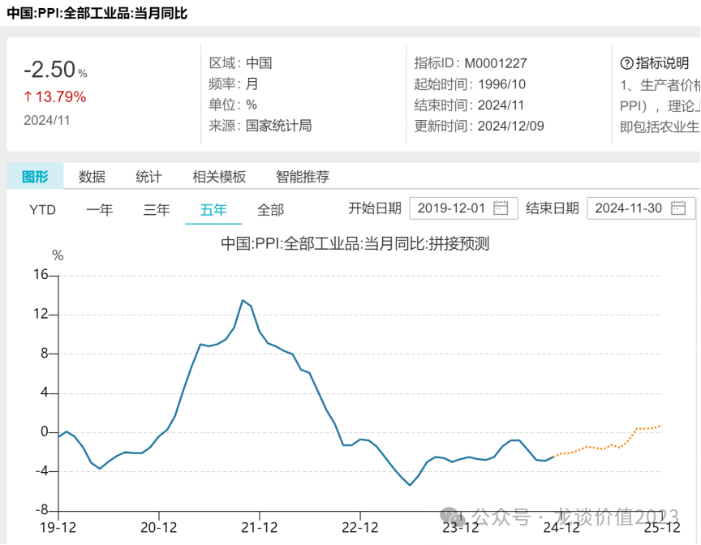

因此在当前这个时间点，我们还是要再次重提红利资产的价值，**以相较大盘指数跑出显著超额收益的港股央企红利ETF(513910) 为例**。

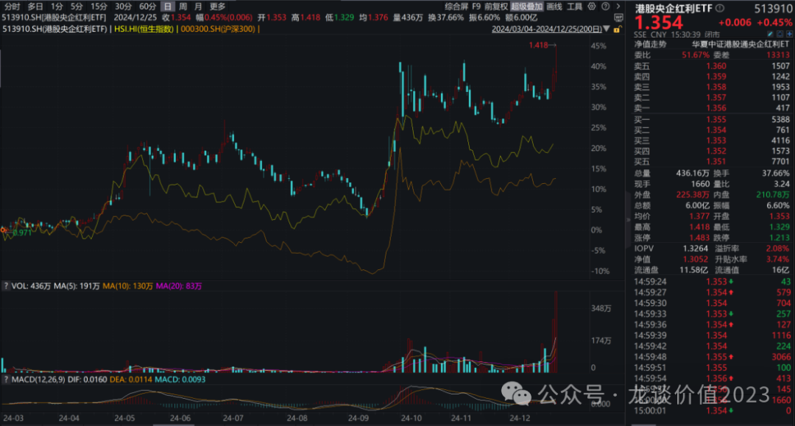

***01***

**低利率时代缺少高收益稳定类资产**

利率快速下行，带来的问题就是大资金的配置越来越难找收益，不止大资金，各位读者应该也有类似的感受，各类资产收益率下行的速度之快。**保险资金在债券的配置在23年仍有12万亿**，24年的业绩是非常漂亮了，但是看到25年可能债券投资收益做到3%都非常困难。

我们看到日本在1998年10年国债收益率突破1.7之后，利率基本在0-2之间波动，甚至在16年出现过短暂的负利率。

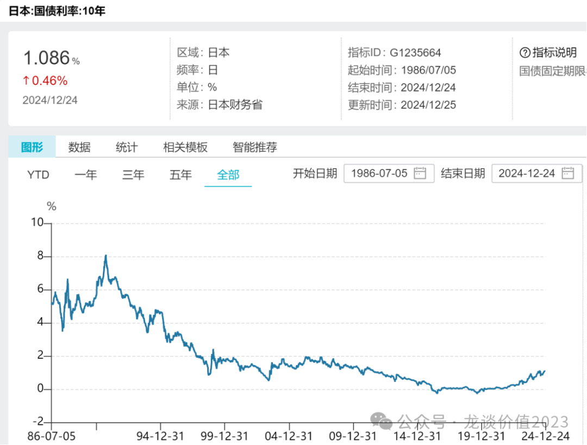

利率下到这个水平之后，进一步降低的空间就不大了，也降低了固收类资产的后续配置价值，不论是对于险资在内的大型长线资金，还是对于广大的个人投资者，都需要配置有不错的收益率且稳定性相对较高的资产，而高分红的港股红利就是重要的选择方向。也是因此，**我们看到今年南向资金流入港股已经高达7855亿。**

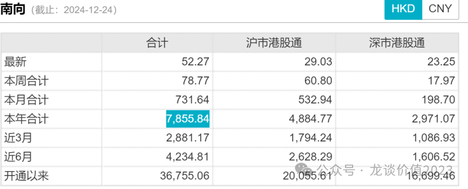

从趋势看，今年南向的流入明显加速，即便在924市场上涨之后，南方资金流入的势头并没有降低，反而近期有所加速。**与此同时AH溢价仍处于历史高位附近，H股的估值性价比仍然突出。**

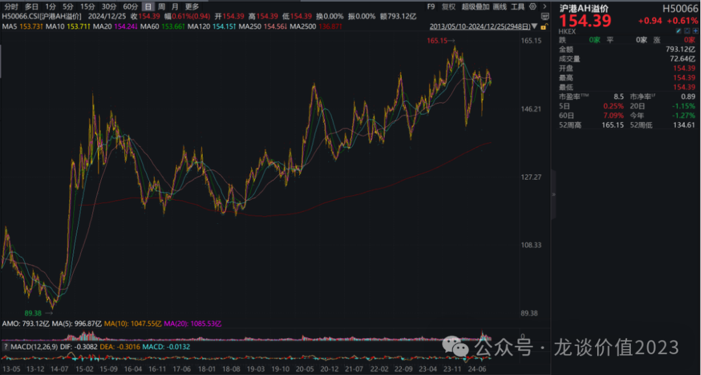

展望明年，在1.7%利率的新时代，这个趋势很可能继续延续，而且国内监管机构正在考虑减免内地个人投资者通过港股通投资香港上市公司时所需缴纳的所得税（20%~28%），若这部分较高的红利税减免能够实施，预计将进一步激发内地投资对港股高分红板块的投资兴趣。

***02***

**国际公认的有效策略**

**高成长不一定能让你赚钱，高股息大概率让你赚钱。**自入市以来投资过成长股和红利股的读者对这句话应该有很深的感受。

高股息策略的长期有效性可以从股利再投资收益、低估值和“填权”行情三方面理解：

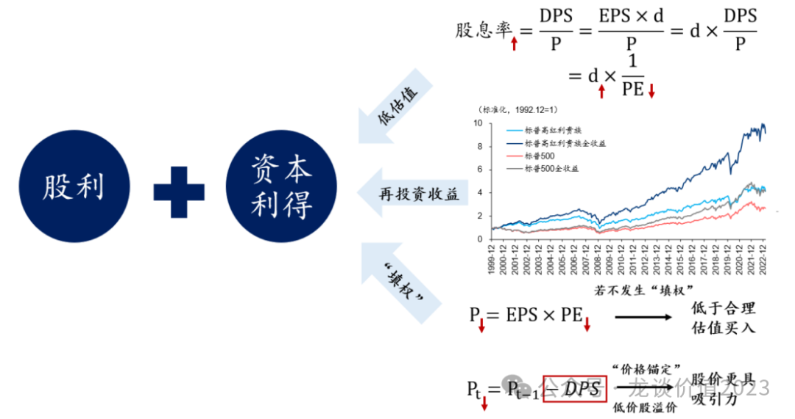

**1）长期来看，高股息策略能够获得更高的股利再投资收益：**资本利得和股利是股票投资收益的两大来源，一方面，高股息对应更高的股利收益，能够平滑股价波动对资本利得的影响；另一方面，当除权除息或市场下跌时，股利再投资可以降低平均持仓成本，获得更大的向上弹性。

**2）高股息股票通常具备低估值、低业绩增速、低波动的特征：**

股息率=DPS/P=d\*EPS/P=d\*1/PE（其中 DPS为每股股利,P为股价,EPS为每股收益,d为股利支付率,PE为市盈率），与分红率正相关、与 PE负相关，因此高股息股票常常具备低估值的特征。**大多数时候投资人并不是买不到好公司，而是买不到好价格，测算股息率则是给了投资人一个基本的判断企业价值的锚。**

同时，较高的分红率往往意味着稳健的盈利和现金流，一般多见于成熟期或减速期的企业，扩大经营的意愿较低（留存收益再投资的回报低于 ROE），且有较强的回报股东的意愿。这里要注意，**并不是所有低估值、稳增长的公司都愿意把盈利分配给股东**，尤其是在A股市场有这种股东回报意识的公司并不普遍。

**3）“填权”行情中高股息股票更加受益：**“填权”是指除权除息后，投资者看好并介入、推升股价至基准价甚至更高的行情，其解释有二，①投资者对公司未来业绩稳定增长的信心下预期 PE维持稳定；②行为金融学理论指出，受“价格幻觉”影响，投资者会认为除权除息后的股价更具吸引力。

典型的填权行情就以最近的平安好医生为例，其把IPO和增发募集的100亿现金一把分红分掉，企业本身还处于下滑和亏损中，但股价却在短期实现了较大幅度的填权行情涨幅。

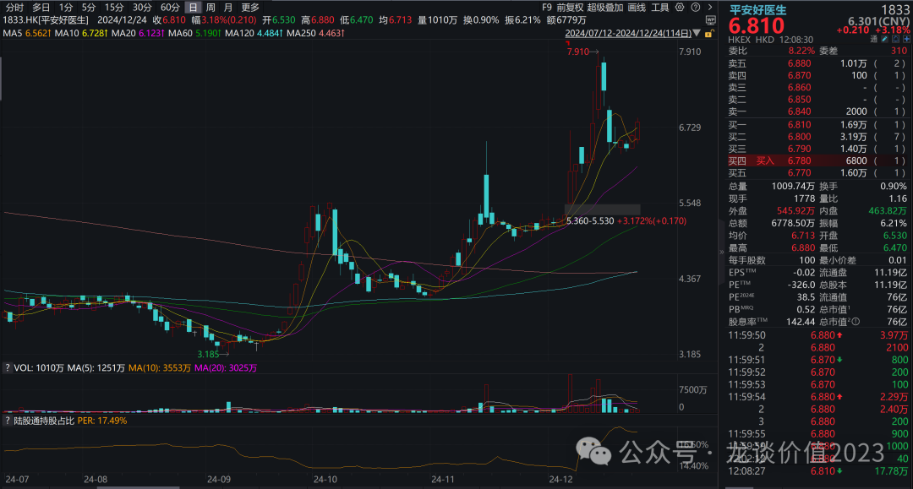

高股息策略在海外成熟市场也是长期有效。2000年至今，标普高收益红利贵族指数累计收益315.5%（年化6.3%），跑赢标普500指数，要知道标普500指数这十几年来美国鲜有主动管理基金能跑赢；07年以来花旗日本高股息指数累计收益105.5%（年化4.4%），相对日经225超额收益32.9%（年化1.1%）。

***03***

**细看港股央企红利ETF持仓**

我在给大家讲投资方向的时候，**最重要的环节是分析我们将要投的到底是什么**，过去给大家聊医药ETF也是，要讲明白买的各个医药ETF里到底是什么资产。龙哥给大家讲的是各个方向好的资产让读者可以按需选择，而不是分析一堆红利的逻辑，然后按名字里带红利的ETF选几个一股脑的推给读者。

就港股央企红利ETF为例，从行业分布上看，指数主要布局传统行业和高股息概念板块，我们以中信一级行业分类为标准，中证港股通央企红利指数共覆盖14个中信一级行业：**指数覆盖的行业中，银行权重最高，达21.09%，合计数量为9只；非银金融权重达10.55%，合计数量为7只；剩余行业覆盖石油石化、通信、交通运输、建筑、房地产等，合计权重达68.36%，数量共计34只。**

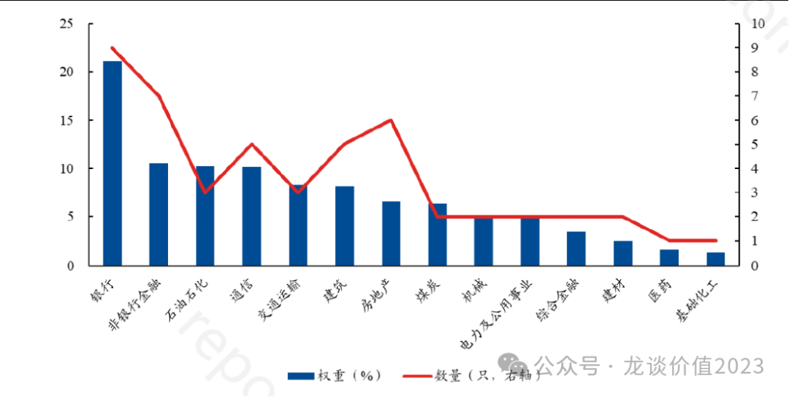

**截至2024年12月20日，港股通央企红利前十大权重股占比合计为31.26%，**整体而言较为分散；从细分行业分布来看，前十大权重股分布于交运、石油石化、煤炭、银行、非银金属等细分行业；从市值来看，**前十大权重主要为各细分行业的龙头公司，前十大权重股平均市值为3147.54亿元**，包含中远海控、中国海洋石油、中国神华等各行业的高股息龙头标的，股息率基本超过6%。

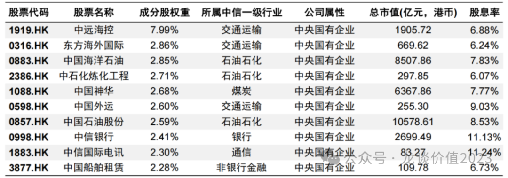

截至2024年12月13日，中证港股通央企红利指数的市盈率处于37.08%分位点，整体估值处于历史低位。

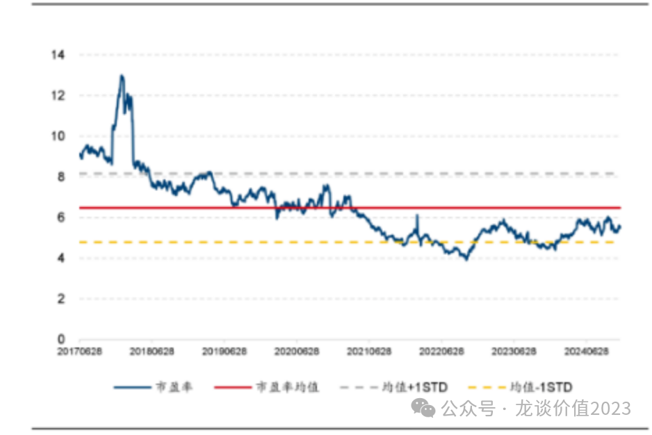

截至2024年12月13日，中证港股通央企红利指数的股息率为6.89%，处于发布以来69.67%分位点，指数的股息率仍处于历史相对高位。

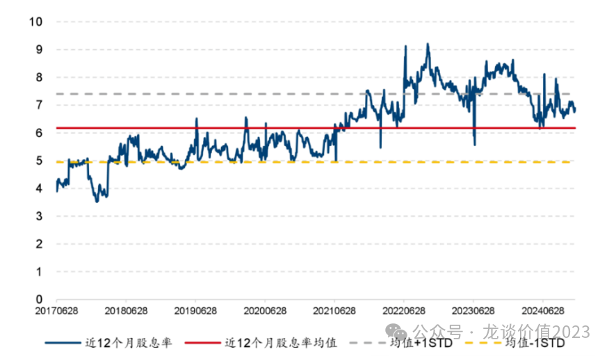

整体央企的盈利较为稳健，也是高分红的基础，2023年港股通央企红利指数的归母净利润增速为8.11%，在目前经济尚未企稳的情况下，8%的增速已经是较高的水平。

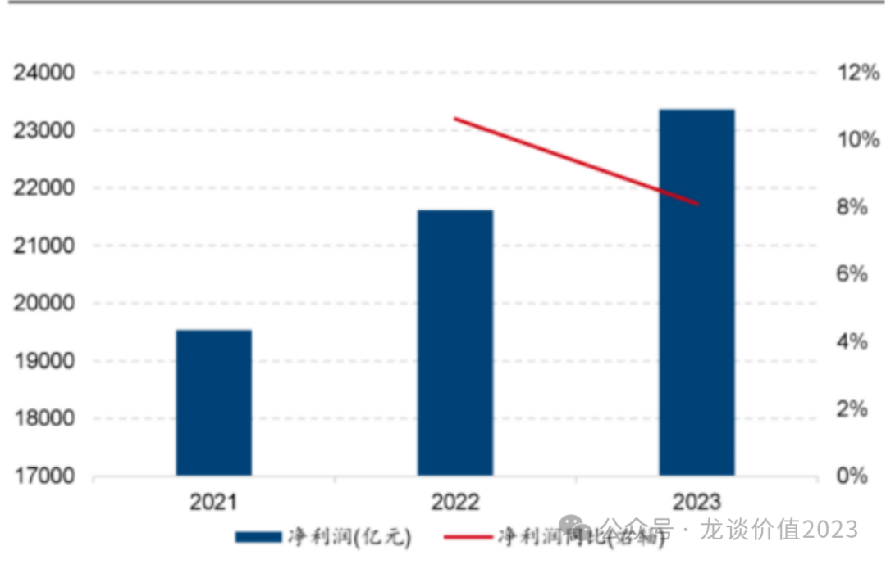

**也因此，即便在今年红利资产已经有较好表现的情况下我们仍然可以看到，港股央企红利ETF（513910）还是一个估值历史偏低水平、股息率历史偏高水平、利润增长稳健的资产组合。**

**与此同时如前文所述，我们面临的是一个快速降息、经济仍处通S的环境，也因此，红利资产的价值回归，我认为不会是短期一蹴而就的主题炒作，而是会逐渐成为主流正统的长期价值投资标的之一。**

***风险提示：本文仅讨论行业/公司经营情况，投资需综合考虑公司经营、估值、管理层等多方面因素，建议读者审慎参考，本文不作为投资依据，不建议大家根据本文做出投资计划。***

<!-- wxmp-comments-begin -->

---

## 留言（8 条，含回复共 16 条）

- **风调雨顺** 👍5 · 2024-12-26 14:16
  龙哥，科伦药业怎么这么弱，估值很便宜呀
  - ↳ **作者** · 2024-12-26 15:10
    科伦也是成为集团控股公司，最核心的创新药资产科伦博泰在港股，川宁也已经分拆出来，相当于集团体内主要是大输液和仿制药，没什么增长还有集采。
- **求索者** 👍4 · 2024-12-26 13:55
  龙哥创新药仓位降了？
  - ↳ **作者** · 2024-12-26 15:12
    全行业资产配置和创新药仓位没关系呀，投资人也不可能all in创新药。
- **BO** 👍4 · 2024-12-26 14:15
  可是这持仓股要是明年加关税的问题导致出口萎缩&nbsp;然后可能航运&nbsp;煤炭&nbsp;甚至可能石油&nbsp;都得降价&nbsp;这个人红利的个股不知道会不会业绩不及预期而跌
  - ↳ **作者** · 2024-12-26 15:11
    大宗商品都是全球定价的东西。
  - ↳ **作者** · 2024-12-26 15:18
    是全球定价&nbsp;但是关税如果恶化了国内经济&nbsp;我们经济不好肯定会影响大宗商品的行情
- **ÉTINCELLE** 👍3 · 2024-12-26 21:23
  龙哥好，新人二级买斗胆讲一下自己看法：明年投资者风格还是会继续撕裂，柚子机构散户互不信任，各自守着自己三亩地，因此市场风格还是杠铃型，科技+红利是最强的主线，二选一坚定做多就好，反复横跳不坚定反而很不利，个人层面也比较偏好高股息
- **郑** 👍3 · 2024-12-26 22:48
  康波萧条期，稳健红利必然收益。或许还能持续5年。不过绝不能简单拿日本那20年对比，人口、地产、债务等等，似是而非最具误导性，日本错过了无数个新产业大趋势，比如互联网、移动互联网、新能源车、光伏等等等等……
- **徐海东** 👍2 · 2024-12-26 15:27
  龙哥，恒瑞医药开启香港上市国际化，您对此怎么看？
  - ↳ **作者** · 2024-12-26 15:29
    这个我感觉是可能压制估值的，港股医药的估值中枢摆在这里，但因为发港股的流通盘应该不大，也未必影响很大，最终还是看公司基本面啦。
- **知行** 👍1 · 2024-12-26 15:47
  减免内地个人投资者通过港股通投资香港上市公司时所需缴纳的所得税（20%~28%），这个是分红扣税么？还是盈利所得税？
  - ↳ **作者** · 2024-12-26 15:49
    分红的税，就是你现在通过港股通拿港股刚起的分红要扣税的，而且税很高。
  - ↳ **作者** · 2024-12-26 17:12
    这个双重收税是真的很坑，又坑又高，我都只希望我的港股回购注销，而非分工
- **美克眼镜视光顾问** 👍1 · 2024-12-26 17:13
  龙哥，6.89%股息分红扣20%，就剩下5.5%，很多A的高股息，拿一年以上股息比这个更高，那岂不是港股央企也没啥吸引力了
  - ↳ **作者** · 2024-12-26 19:24
    主要是etf相对分散，个别公司业绩波动不影响总体

<!-- wxmp-comments-end -->
