# 全球顶级大品种

大家好，我是龙哥。

全球制药巨头的2024年年报，大部分已经披露完毕，我们研究了这些全球MNC药企的财报，梳理了一众全球TOP的大品种，今天来展示一下24年的大品种和增长趋势。

首先文初要吐槽一点，我们在读MNC的财报的时候，实际上是非常舒服的，虽然全英文的财报读起来不如国内公司中文财报读起来流畅，但海外药企的财报基本非常简洁明了，基本就是核心财务数据、重点品种季度/年度销售额、下一季度/年度业绩指引、研发管线和进展、财务报表。

例如：礼来（Q4业绩第一页，多么清晰明了，收入，EPS，25年指引）：

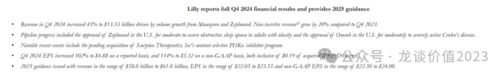

例如：阿斯利康（几乎所有MNC的财报都会有，产品销售列表）：

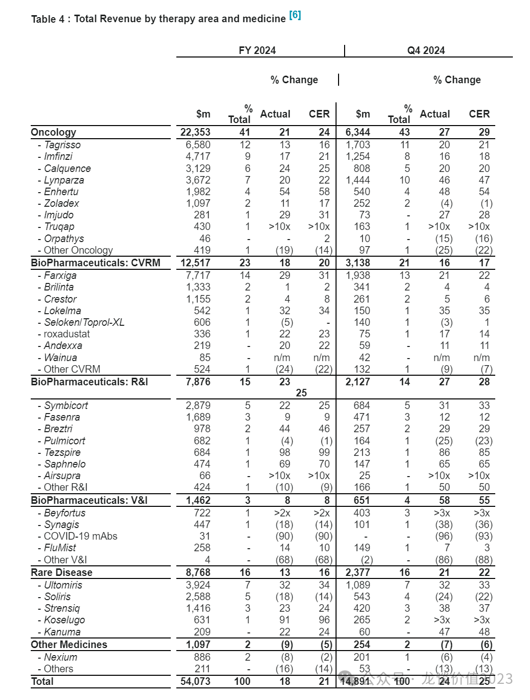

而国内的药企，尤其是传统药企，对其产品销售数据，大多都是藏着掖着，生怕被人知道，拆个模型要费尽心思的去调研、聊专家、打听，然后依然可能有不小的偏差。

为什么会形成这种差异？我个人粗浅的认为，核心原因就是其产品收入情况“见不得光”，要么是收入结构差、怕投资人看到，要么是某些品种（或者是利益品种）卖的多、怕医保局看到。

**一众头部和重点企业如果对投资人、对医保局都不能做到光明磊落的披露产品销售数据，又如何让投资人信任中国药品行业能有大的投资机会呢？**

好在，随着一众新兴biotech、biopharma的崛起，情况逐渐开始有改观，这些品种优秀的biotech/biopharma会更直观的披露具体产品销售数据，让我们看到真正优秀国产新药的表现。

......

回归正题。

**2024年全球药品销售额TOP100合计约为5000亿美元出头**，同比2023年TOP100销售额**增长10.34%**，同比2020年TOP100销售额增长43.28%，**4年的复合增速9.4%**。

进入全球TOP100的**门槛提升至18.17亿美元**，同比23年的17.85亿美元增长1.8%，而2020年这个门槛是15.4亿美元，**4年间这个门槛提升了18%左右**。

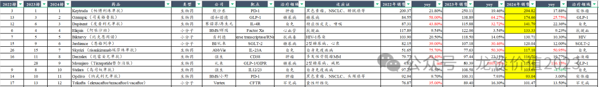

2020年全球仅有3个百亿美元大品种，而**2024年预计将有12个百亿美元大品种，更是出现2款接近300亿美元的超级大品种**。

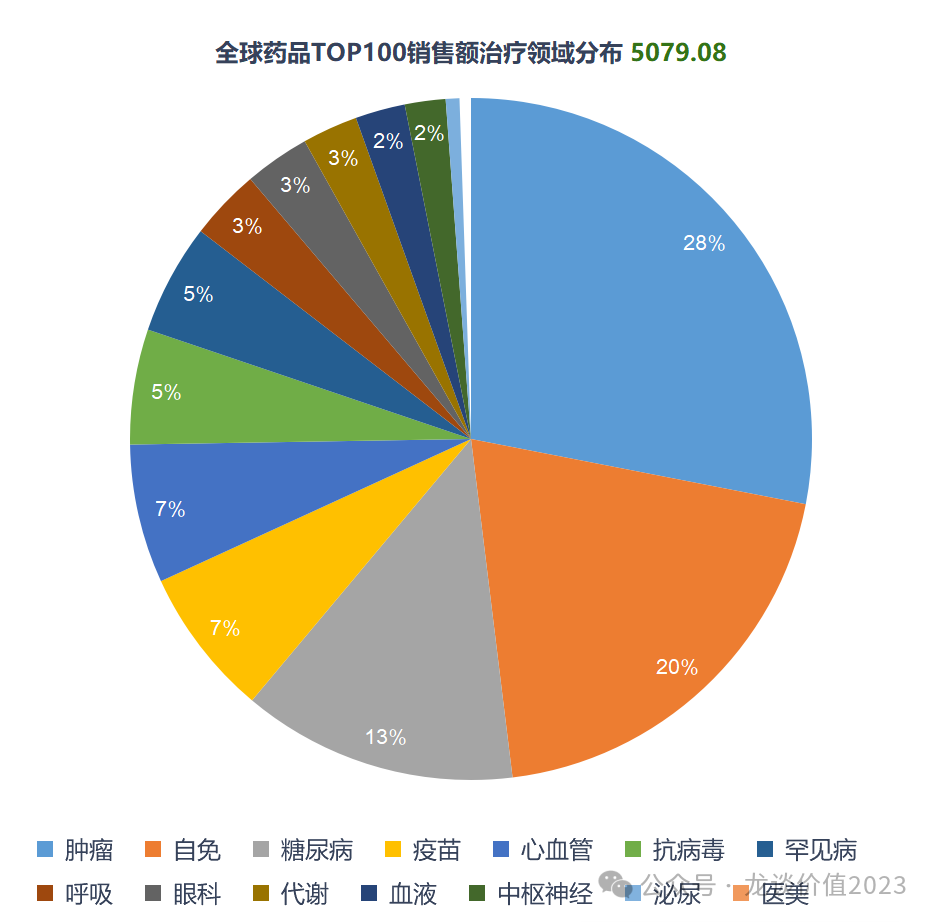

治疗领域来看，**肿瘤连续多年都是第一大治疗领域，24年的占比约为28%**，近年还在持续提升，23年为26%，22年为23%（剔除新冠药/疫苗为27%），21年为25%。

**自免领域也依然连续多年为第二大疾病领域，占比稳定在20%左右**，哪怕有200亿美金超级大品种阿达木单抗专利到期后的大幅下滑也没有对该领域形成显著冲击，反而是后续重磅品种持续接力。

**与往年相比最大的差异在于糖尿病及代谢领域，23年糖尿病+代谢领域的占比还只有8%，24年就已经提升至16%，爆发来自大家耳熟能详的两款降糖/减重的GLP-1类药物——司美格鲁肽、替尔泊肽**。

我们这里分几大疾病领域来看看全球24年销售额的情况。

（以下2024年销售额中，黄底为已披露24年财报数据，白底为尚未披露的、根据24前三季度销售额的预测值）

**1、肿瘤领域**

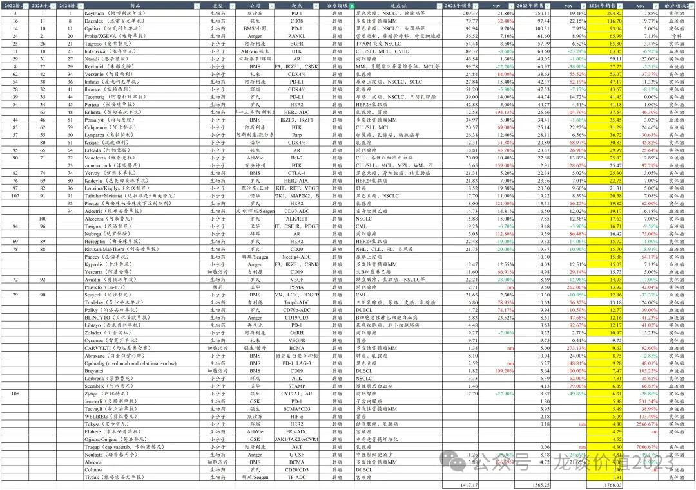

**两个百亿超级大品种**——默沙东K药帕博利珠单抗（PD-1）全球295亿美元+18%，强生的达雷妥尤单抗（CD38）全球117亿美元+20%。

CDK4/6，礼来阿贝西利53亿美元+37%，诺华瑞波西利30亿美元+46%。

ADC，阿斯利康/第一三共明星品种德曲妥珠单抗（HER2-ADC）全球37.54亿美元+46%。8款主要的ADC品种合计贡献127亿美元销售额（吉利德TROP2-ADC为预计，尚未披露财报）、增长超过30%。

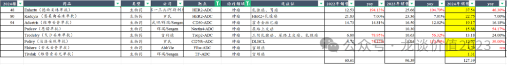

**百济神州泽布替尼预计25.5亿美元+97%（尚未披露财报）。传奇生物Carvykti全年9.63亿美元+93%。中国两款血液瘤重磅炸弹药物均接近翻倍增长。**

**2、自免领域**

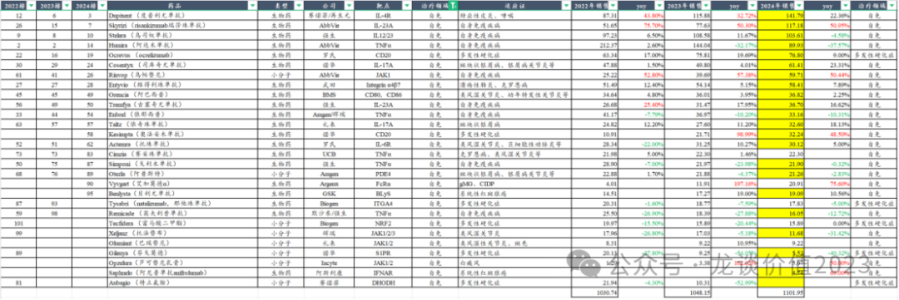

**三个百亿超级大品种**——赛诺菲Dupi（IL-4Rα）全球142亿美元+22%，艾伯维IL-23p19单抗全球117亿美元+51%，强生乌司奴单抗全球104亿美元-4.6%（专利到期）。

艾伯维JAK1全球60亿美元+50%。

IL-17A，诺华IL-17A全球61亿美元+23%，礼来IL-17A全球32.6亿美元+18%。

CD20，罗氏CD20单抗76.8亿美元+9%，诺华CD20单抗32.2亿美元+48.5%。

多款重磅自免药物在24年实现加速增长，从前两年的新冠低基数中走出来，IL-4Rα、JAK1、IL-23p19等大品种的高增长抵消了TNFα下滑的影响，自免领域仍有所增长。

**3、抗病毒药物及疫苗领域**

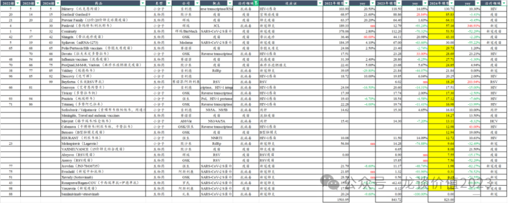

**一个百亿超级大品种**——吉利德比克恩丙诺。

新冠药、新冠疫苗Q3-Q4呈现明显季节效应开始企稳，辉瑞/BioNTech、Moderna或许未来可获得部分新冠常态化收入。

RSV疫苗24年大幅低于预期，赛诺菲/AZ长效RSV中和抗体爆发、全球18.3亿美元+204%。

**4、糖尿病及代谢领域**

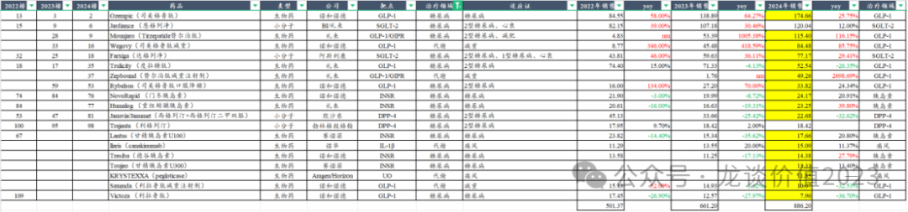

**三个百亿超级大品种**——诺和诺德司美格鲁肽全球293亿美元+38.5%，礼来替尔泊肽全球165亿美元+208%，礼来/BI恩格列净（SGLT-2）全球预计120亿美元+12%。

阿斯利康达格列净全球77.2亿美元+29.4%。

礼来、诺和、赛诺菲三家的胰岛素销售在24年也实现大幅反弹。

糖尿病代谢领域成为23-24年全球最火热和具有爆发力的领域，国内也实现多款分子海外授权。

**5、罕见病领域**

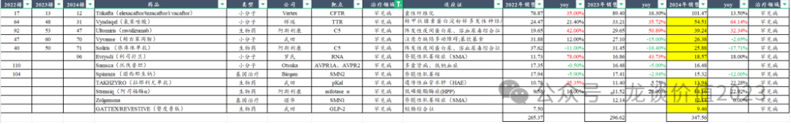

**一个百亿超级大品种**——福泰制药Trikafta。

辉瑞氯苯唑酸全球54.5亿美元+64%。

阿斯利康C5单抗全球39亿美元+32%。

Biogen、诺华的两款SMA基因治疗药物增长停滞。

**6、心血管领域**

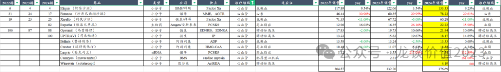

**一个百亿超级大品种**——BMS/辉瑞阿哌沙班全球133.3亿美元+9.2%。

沙库巴曲缬沙坦全球78.2亿美元+30%，但即将专利到期，达峰前维持高增长。

PCSK9，安进依洛尤单抗22.2亿美元+36%，诺华英克司兰钠（siRNA）全球7.54亿美元+112%，半年给药一次，PCSK9靶点中潜力最大。

**7、眼科领域**

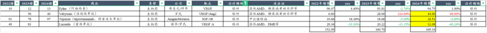

再生元/拜耳阿柏西普全球预计95亿美元左右增长停滞。

罗氏法瑞西单抗（VEGF/Ang2）全球44亿美元+68%，有潜力成为眼科百亿超级重磅品种。

总体来看24年MNC年报中值得关注的表现亮眼的品种主要是肿瘤里的血液瘤产品、CDK4/6、ADC药物，自免里的IL-23p19、JAK1、IL17A等，抗新冠药物和疫苗，GLP-1减重药，眼科双抗。

***风险提示：本文仅讨论行业/公司经营情况，投资需综合考虑公司经营、估值、管理层等多方面因素，建议读者审慎参考，本文不作为投资依据，不建议大家根据本文做出投资计划。***

<!-- wxmp-comments-begin -->

---

## 留言（11 条，含回复共 22 条）

- **軍** 👍7 · 2025-02-10 13:09
  好久不见
  - ↳ **作者** · 2025-02-10 13:17
    好久不见，新年好~
- **魏小魏** 👍5 · 2025-02-10 13:01
  专业性太强，没看懂。&nbsp;总体感觉这些都挺牛的！
  - ↳ **作者** · 2025-02-10 13:17
    看全球重磅药品以及MNC的研发趋势对研究和投资创新药还是非常重要的。另外，未来，全球重磅药里应该会越来越出现中国企业的身影，目前有一家百济神州，25年会增加一家传奇生物，未来的康方、博泰等等都有机会。
- **和** 👍4 · 2025-02-10 13:10
  恒生医药ETF可以加仓了吗
  - ↳ **作者** · 2025-02-10 13:19
    恒生医药ETF总体还是跑赢AH医药指数的，投ETF还是适合分散定投，底部积累仓位，情绪火热的时候我不好评价让大家去追涨
- **L** 👍3 · 2025-02-10 13:25
  龙老师，港股创新药现在估值怎么样，算是低位吧
  - ↳ **作者** · 2025-02-10 13:30
    看个股吧，每年会有几个核心标的表现很好，看指数就会弱很多。
- **儒将 小董O** 👍3 · 2025-02-10 13:50
  是否看好信达生物，今年起陆续有爆品上市
  - ↳ **作者** · 2025-02-10 14:20
    今年三款重点产品上市，玛仕度肽，IL-23p19，IGF-1R，后续减重药上市和商业化可能我会观察一下吧，司美在国内的销售有压力，或许意味着双靶更大的潜力，也或许意味着国内减重药市场的局限。
- **徐海东** 👍3 · 2025-02-10 13:57
  恒瑞医药大药都没份，创新能力不行啊？
  - ↳ **作者** · 2025-02-10 14:18
    恒瑞的出海也还处于早期，从海外BD授权的数量来说恒瑞是目前国内最多的。后续要看海外研发的落地情况。
- **六爻** 👍2 · 2025-02-10 13:20
  龙哥觉得益方生物的口服药是不是会比其他市场的更好？看了数据是好很多哦，但是总觉得可信度不高
  - ↳ **作者** · 2025-02-10 13:28
    数据挺不错的，我去调研也了解过，从目前了解的信息来看银屑病II期临床的数据还是靠谱的，和武田比是可以正面pk的实力的。要看出海的潜力的话，今年下半年可能的UC的II期数据更关键。
- **何勇** 👍2 · 2025-02-10 13:21
  龙哥&nbsp;新年好！
  - ↳ **作者** · 2025-02-10 13:28
    新年好，祝25年账户长虹[呲牙]
- **老加仓** 👍2 · 2025-02-10 13:24
  国内有哪几家可能入选？赛道太卷了
  - ↳ **作者** · 2025-02-10 13:29
    目前百济和传奇是明确的，其他的还要看成药，如博泰的trop2和康方的PD-1/VEGF
- **廖书豪** 👍2 · 2025-02-10 13:46
  新年好，请问龙哥有24年到25年Q1的医药融资数据吗，想知道今年能看到拐点吗
  - ↳ **作者** · 2025-02-10 13:47
    这不才2月嘛，海外去年已经很明显的拐点了，今年的我晚点整理下，下篇文章可以发下
- **何惧几分秋凉** 👍1 · 2025-02-10 15:56
  和黄&nbsp;还能看吗
  - ↳ **作者** · 2025-02-10 16:43
    能看啊，和黄去年Q3以来确实够背的，几项不顺利的进展，股价跌了这么多，今年呋喹海外继续放量，赛沃egfr tki经治患者的新适应症申报，卖掉上海和黄药业以后账上100亿现金，我觉得这估值问题不大

<!-- wxmp-comments-end -->
