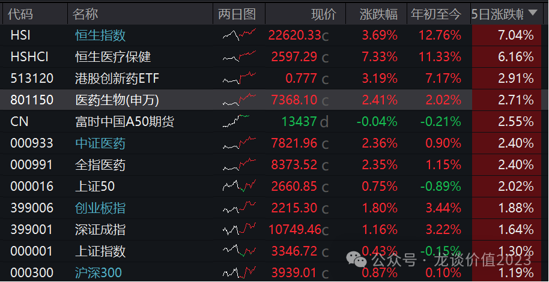
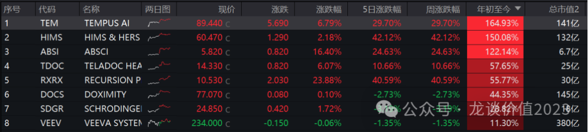
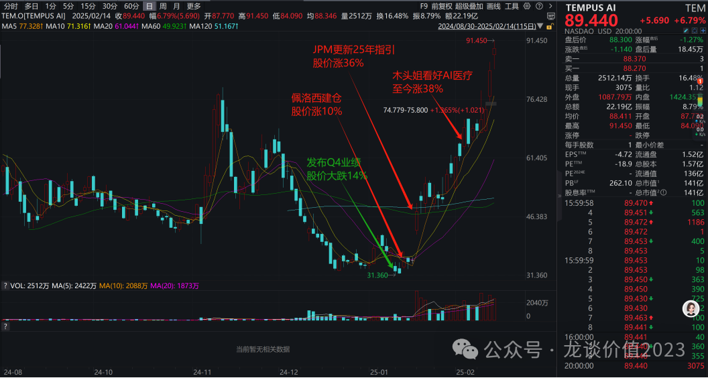
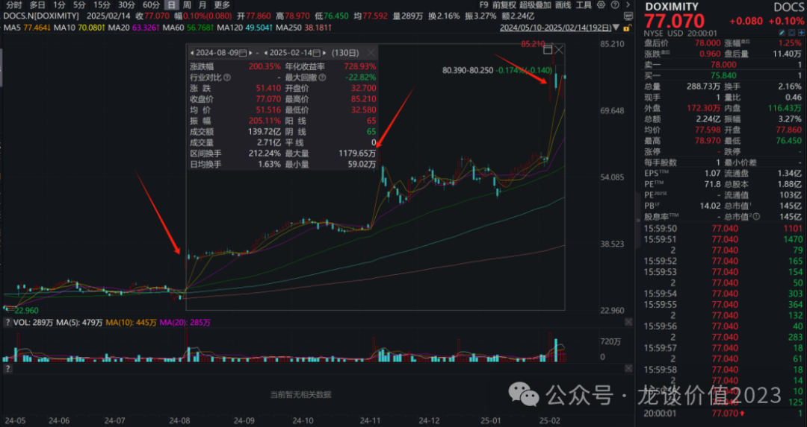

# 医疗AI大爆发

大家好，我是龙哥。

自春节后以来，医药行业表现非常强劲，虽然从年度来看医药指数、尤其是A股医药指数的涨幅并不算大，但其中细分领域的表现差异巨大，在AI加持下，自疫情后基本面及股价都低迷了较久的IVD/ICL、医疗设备、医疗服务、CXO以及互联网医疗等板块均表现强势。

AI是十年维度的产业逻辑。

虽然各个领域的应用的市场潜力、时间节奏会略有差异，但总体医疗领域AI的应用是较为值得期待的。

今天就简单聊聊医疗AI目前的美股映射情况，实际上，有条件买美股的读者，可以优先考虑“正股”而非映射标的。

首先我们看美股AI医疗主要标的今年以来股价表现及市值：

AI检查检测：Tempus AI（TEM，141亿美元）

AI线上诊疗：Hims&Hers Health（HIMS，132亿美元）、Teladoc Health（TDOC，25亿美元）

AI制药：Recursion（RXRX，30亿美元）、ABSCI（ABSI，7亿美元）、Schrodinger（SDGR，18亿美元）

AI数字营销：Doximity（DOCS，145亿美元）

云服务：Veeva Systems（VEEV，380亿美元）

最纯正的标的→Tempus AI，今年以来股价涨幅已经高达165%：

AI在医疗保健的应用方向：AI检查检验、AI制药、AI线上诊疗、AI数字营销；其他如AI慢病管理等。

1、AI检查检验：

映射美股：Tempus AI（代码TEM，市值141亿美元，周涨幅30%）、Tempus AI的业务涉及基因组学、精准诊断及临床决策，数据服务，临床试验服务等。Tempus AI此前披露快报，2024年收入预计6.93亿美元，另外收购Ambry预计24年收入约为3亿美元，公司指引25年合并收入12.3亿美元+75%，考虑合并报表后的增速约为25%，其中内生增速接近30%，adjusted EBITDA有望转正。最新估值11.5倍PS；尚且大额亏损、无利润和PE估值。

盈利模式：①设备厂商配套卖系统/软件，或独立厂商卖单独系统/软件（国内不给单独收费项目）；②ICL、医院使用提高效率和准确性；③数据服务和数据交易；④独立收费项目（国内尚早）。

获益/相关公司：

①医检服务龙头：金域医学、迪安诊断、美年健康等，有大量真实世界的检验数据和病理数据，更重要的是数据标准化、质量高，最早我们认为能拿到大量医院数据的公司更有价值，但实际来看医院端的数据质量未必很高，反而是较早进行系统和数据标准化处理的三方医检龙头在这方面更有优势；模型开源接入DeepSeek，可以利用AI模型提高准确度和效率，未来也有望类比海外实现收费项目拓展。

②华大系：华大基因发布面向临床的基因检测多模态大模型GeneT，其业务范围和模式高度对标Tempus AI，覆盖基因检测、癌症早筛、质谱、生物信息分析等领域。华大智造还同时受益illumina被纳入不可靠实体名单，我们此前测算仅illumina退出国内市场带来的设备端的直接增量就可能贡献25%左右的总收入弹性，以及后续还会有耗材、服务的持续性的收入。

③润达医疗：与华为最早全面深入合作，国资背景IVD流通商，接入华为盘古大模型做智慧医疗，此前较早布局AI诊断，国资背景使得其可以拿到医院数据。

④医疗设备：迈瑞医疗、联影医疗两家龙头较早开始布局AI在医疗设备的应用，迈瑞医疗有三瑞生态，进行院内智慧互联，较早布局院内信息化和智能化；联影AI布局也较为靠前，所有产品都有AI赋能，设备端提高扫描效率和准确度、医院端落地影像识别解读模型。其他公司如理邦仪器、祥生医疗、汕头超声、乐心医疗、乐普医疗较早布局AI融合医疗设备用于超声AI诊断、可穿戴设备AI监测等。

2、AI制药：

映射美股：RECURSION PHARMACEUTICALS（代码RXRX，市值30亿美元，周涨幅40%）

盈利模式：①CRO服务、CDMO服务。②分子/技术平台授权。③药企in house研发。不过AI制药最终价值兑现靠效率提升或创新药研发成功，BD授权模式估值仍要基于创新药研发成功，上临床后的失败风险客观存在。

1月6日，FDA首次针对 AI 在药物和生物制品研发中的使用发布相关指南草案-《关于使用 AI 支持药品和生物质品监管决策的考量》，本次指南是为了提供有关 AI 对药品和生物制品安全性，有效性和质量的监管决策中的使用建议，有望提升药品和生物制品申报中使用 AI模型的可信度。

获益/相关公司：

①英矽智能（美股IPO）、晶泰控股：最纯粹的AI制药公司，通过AI模型筛选分子并BD授权，英矽智能首个AI研发的抗纤维化药物已经完成II期临床，晶泰科技则尚未有项目推进至II期，晶泰科技未来更倾向于扩展新材料领域——先摘低垂的果子。

②CXO龙头公司药明系等：药明系对AI投入也较早，药明康德早在2022年就有37%的研发管线为AI参与项目，其他CXO公司或多或少也都有应用。

③CXO二三线公司泓博医药/成都先导/睿智医药/药石科技等：泓博医药是最早开发药物早期研发AI模型（PR-GPT）的公司之一，此前调研情况来看，在早期分子发现时应用AI模型可以大幅提高效率，可以加快几周到几个月不等的早期研发时间。

3、AI线上诊疗及数据服务：

映射美股：HIMS&HERS HEALTH（代码HIMS，市值132亿美元，周涨幅42%）

获益/相关公司：

平安好医生：AI辅助诊断系统覆盖3000+病种，在线问诊准确率达98%，2023年AI驱动的健康管理服务收入同比增长67%。

阿里健康：医药电商龙头+线上诊疗。

京东健康：医药电商龙头+线上诊疗。

4、AI数字营销：

映射美股：Doximity（代码DOCS，市值145亿美元，周涨幅-2.73%，上周五单日+36%，连续三个季报业绩超预期、股价大幅跳涨）、日股M3（代码2413，市值80亿美元，周涨幅30%）

获益/相关公司：

医脉通：国内药品线上数字营销龙头，较早应用AI在营销推广业务中。医脉通是中国最大的在线专业医生平台和最大的数字医疗营销平台，截至2024年中报，医脉通注册用户数700万人，注册医师数400万人，注册医师覆盖数达到88%。其商业模式是药企投销售费用给医脉通，医脉通定向推送药品学术教育文章给相应专科的医生。而在实际AI应用来看，广告分发方面的应用是较为直接获益AI带来的精准营销、降本增效的。

5、医疗信息化：

讯飞医疗科技、卫宁健康、久远银海、创业慧康等。

......

医药行业在AI助力下的迅猛的爆发，身处市场上要接受乃至享受的是，新兴科技从0到1的过程，必然充满主题炒作和泡沫，即使待到潮水褪去仍可能一地鸡毛，不妨碍产业趋势的滚滚向前，不妨碍一定会有几家乃至更多的个细分领域优秀企业走出来，各位读者无非是在市场狂热中留一分清醒，跟随产业趋势、跟随持续兑现的企业共同前行。

风险提示：本文仅讨论行业/公司经营情况，投资需综合考虑公司经营、估值、管理层等多方面因素，建议读者审慎参考，本文不作为投资依据，不建议大家根据本文做出投资计划。

<!-- wxmp-comments-begin -->

---

## 留言（6 条，含回复共 12 条）

- **嗯** 👍4 · 2025-02-17 10:11
  局部高点推荐，不如等一波调整再发文效果好！
  - ↳ **作者** · 2025-02-17 10:35
    关注我久一点的读者都知道，主题投资我都是应大家的需要给大家梳理，肯定不会主动去推荐。医疗AI带动了整个医药的情绪，虽然短期板块内部交易和之前有较大变化，也导致比如创新药等大幅跑输指数甚至逆势回调，但让大家对医药医疗的信心重新提升了，我认为总归是好事。
- **暮逸尘** 👍4 · 2025-02-17 10:20
  龙哥好久不见，死气沉沉的医疗因为AI焕发活力，个人还是很看好AI在CT&nbsp;MR等影像学的应用。能够更快的辨别相关疾病，避免人工误差。
  - ↳ **作者** · 2025-02-17 10:34
    这也是一个应用的方向，在海外市场这个逻辑可能更通顺一些，国内的话还需要进一步打通支付路径，医保局现在对这些新技术的定价还是高度重视真实临床价值的。之前去联影调研，他们对AI技术在大型影像设备的应用也是非常积极的推动的。
- **齐华** 👍3 · 2025-02-17 09:48
  龙哥好
  - ↳ **作者** · 2025-02-17 10:36
    早上好~
- **Bryan** 👍1 · 2025-02-17 13:15
  谢谢主题炒作，让我终于有沾边的持股可以高抛一点[生病]，可惜早上开会，错过去药名生物和固生堂出货
  - ↳ **作者** · 2025-02-17 13:40
    是的，同样是主题炒作，有人可以借此高抛，有人可以交易短线主题赚钱，核心还是自己的框架和目标。
- **叶** 👍1 · 2025-02-17 14:05
  金域会不会比润达这些更有优势
  - ↳ **作者** · 2025-02-17 17:31
    本来我觉得润达有数据优势，但和金域聊完我觉得金域的数据质量更高，应该更能受益。
- **俏皮的货船** 👍1 · 2025-02-17 15:25
  定期接受龙哥专业的知识普及，一直坚持到现在，虽然大势一直跌了几年，但时不时做个小波段，始终是盈利的，也相信终究会有吃药行情的一天！坚持！谢谢龙哥！
  - ↳ **作者** · 2025-02-17 17:31
    坚持几年不容易[抱拳][抱拳]

<!-- wxmp-comments-end -->
