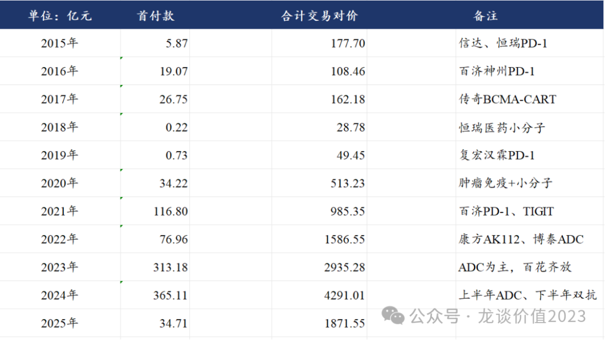
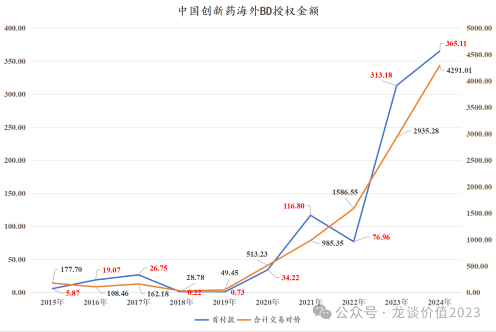
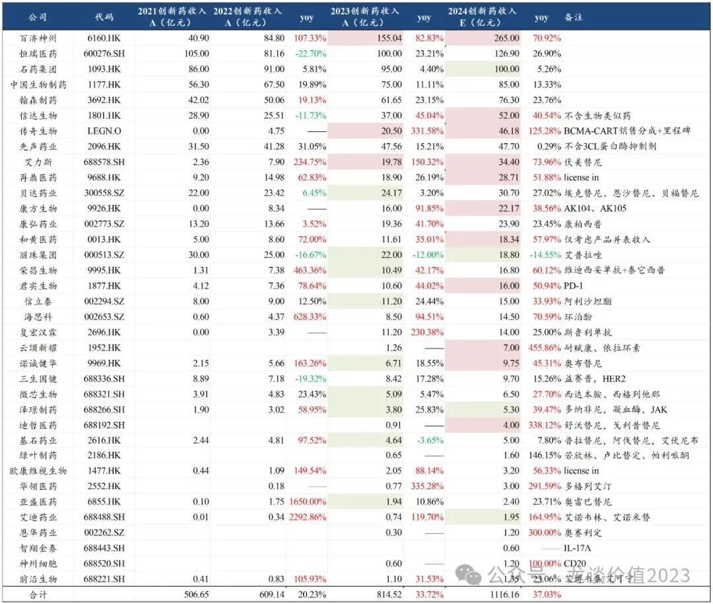
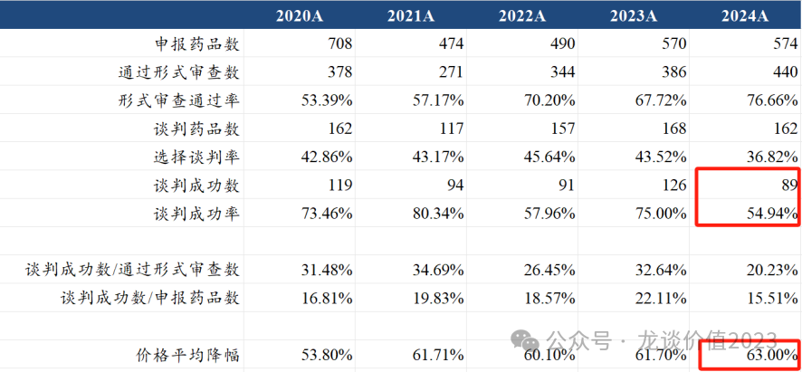
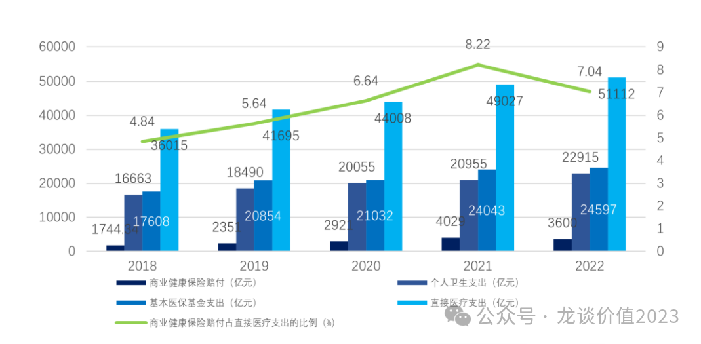
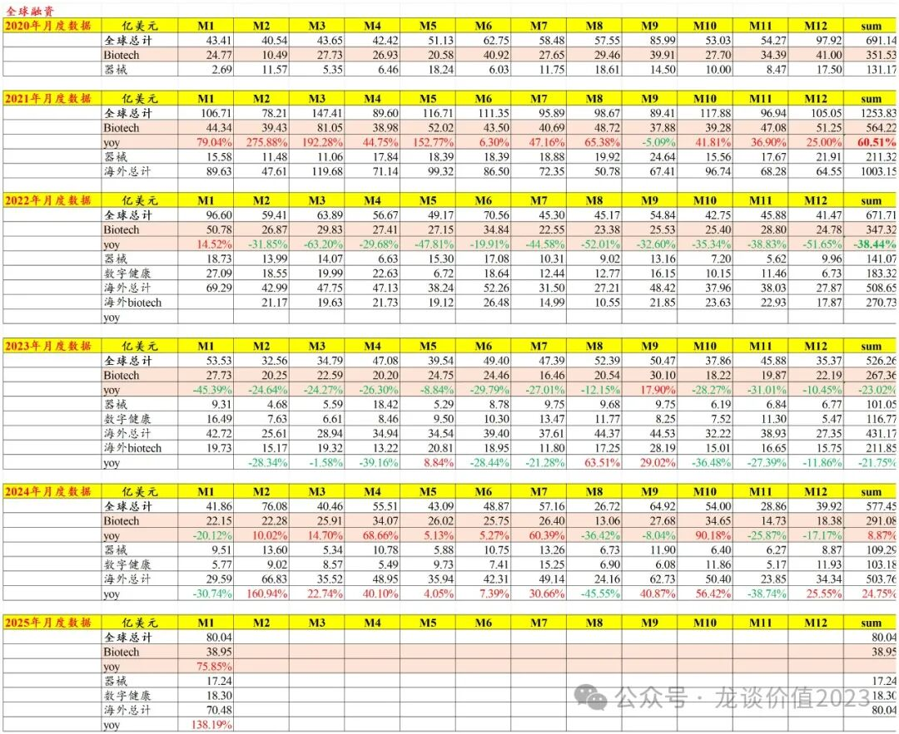
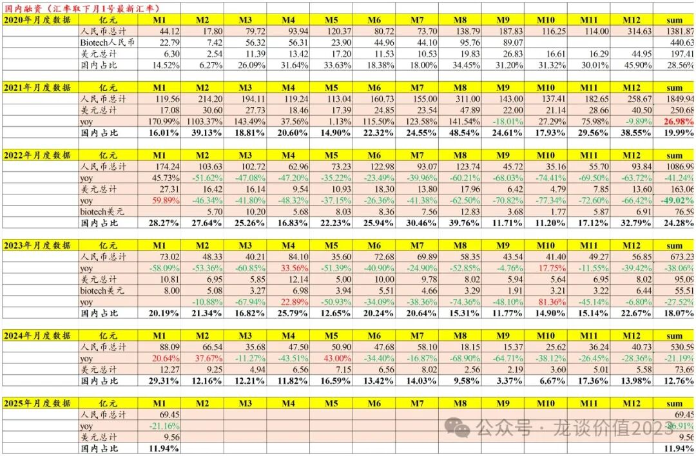

# 医药行业趋势展望

大家好，我是龙哥。

近期大家对医药行业的讨论增加，如上一篇文章为大家梳理的医疗AI海外映射的各个细分领域，近期交易热度很高，回归行业当前的基本面，到底产业趋势如何、基本面数据如何，待我们本文给大家聊聊。

***01***

**创新药出海持续爆发**

2024年，中国创新药及生物类似药海外授权总交易对价突破4200亿元，拿到首付款超360亿元，均创历史新高。

过去我一直给大家放的是这个表格，可能大家对其中的变化看起来不够直观，如果看下面这个图是不是会更加直观？

我们知道在创新药授权交易中，一般包含首付款、研发里程碑付款、销售里程碑付款、销售分成/特许权使用费，首付款就是在创新药海外授权中基本确定能很快拿到的现金，是确定性的部分，而研发和销售里程碑付款都是有一定不确定性的，药物是否持续推进、是否能成药、销售是否能符合预期、竞争格局等都会对其影响较大，因此里程碑付款一般都会有较大比例是拿不到的，总的交易对价包含首付款和里程碑付款，但还未包含的就是销售分成，也就是药物成功获批上市后可以按销售额从中拿到部分的分成，这个比例在大多数的项目中都是从低个位数到高双位数不等，大部分是5%-20%的区间，当然也有类似传奇生物这样是权益五五开、费用和利润共担。

上图中，蓝色线是首付款金额，对应左边的坐标轴，黄色线是首付款+里程碑付款的总交易对价，对应右边的坐标轴，这个向上的趋势起始于2020年，但从项目质量、交易对价来说真正形成质变的还是23-24年。

如果说对于23年大规模海外BD授权还有不少人认为是前期资本市场火热阶段研发的存量项目的授权，那么24-25年以来的大规模授权就在打破这种认知。

从授权的分子类型和方向来看，产品授权越来越倾向于早期项目，呈现跟随技术发展趋势的特点，23年的ADC为主，到24年ADC、双抗ADC、TCE双抗、PD-1/VEGF双抗等紧跟研发趋势，围绕肿瘤、自免、代谢三大国内研发较为集中的方向，从中也可以看出，在全球几大疾病领域中，体量最大的三大疾病领域已经是国内对外授权的主要方向，而抗病毒药物、疫苗、中枢神经和心血管这大疾病领域则是国内创新药研发和授权还相对欠缺的。

对于创新药出海，我们做了一个较为乐观的远期愿景的畅想（也可以称之为宏大叙事或者终局思维），创新药海外授权目前每年可以达到50个以上，而美国FDA每年批准新药50个左右，假设我们按照出海授权的分子20%成功率、未来每年60-70个或更多，中国创新药授权出海占欧美药品市场约25%-30%份额，从另一个角度来说，如按产业此前认为美国50%的早期创新药新分子来自中国市场，则这个比例会更高。

那么在这个模式的成熟期，按25%-30%的份额计算，将为中国创新药行业贡献每年60-70亿美元首付款、120亿-140亿美元里程碑付款、250亿-300亿美元销售分成，合计430亿-510亿美元，对应约3100亿-3700亿元利润。

而根据国家统计局发布的数据，2024年中国医药制造业利润总额是3420.7亿元同比下降1.1%。

出海再造一个中国医药工业市场！

***02***

**创新药国内高增长**

中国已上市创新药企业2024年创新药产品收入合计约为1116亿元同比增长37%左右。

我们预计，2025年国内上市药企创新药商业化销售1450亿-1500亿元（部分为海外销售，部分为license in品种）同比增长30%左右，从医药行业的总量来看，创新药依然是唯一处于高增长阶段的医药核心子行业，也是医药众多子行业中的罕见α。

同时我们预计，传奇生物、信达生物、康方生物、云顶新耀、泽璟制药、迪哲医药、绿叶制药等公司的创新药收入增速超过50%；贝达药业、康方生物、微芯生物、泽璟制药、绿叶制药等由于新品种或新适应症的贡献将会出现收入显著的加速；从PS估值来看，头部biopharma中百济仍显偏低，荣昌生物在一众Biopharma中的PS估值最低主要是资金压力和出海受阻。

对国内创新药市场，我们同样做了一个较为积极乐观的假设，假设2035年中国药品市场规模3万亿（行业复合增速约4%，预计与医药行业、GDP增速匹配），创新药占比假设30%左右（美国80%，国内不可能达到那么高，且中药会切掉20%-30%），则国内创新药总量约为9000亿元，其中国产创新药份额三分之二约6000亿（当前50%左右，在快速提升），行业十年复合增速约20%。

***03***

**24年医保谈判符合预期**

24年医保谈判成功率低于往年，谈判价格平均降幅高于往年，看表观结果并不算好。

但对于医保谈判我们一直说，要看的是绝对价格而不是降幅，因为企业端目前也形成了比较成熟的应对医保谈判的模式，在药品上市初期定一个非常高的初始价格，并通过赠药的方式给患者降低支付压力，而医保谈判时的表观降幅就会显得非常大。

至于谈判成功率低于往年，一方面医保局可能收紧了纳入医保的门槛，另一方面企业方也不是一定要选择大幅降价纳入国家医保，而是也越来越多的寻求先在医保外销售或谋求商保的支付。

我们从具体纳入的品种和价格来看尚可：

其中，德曲妥珠单抗、法瑞希单抗、依沃西、卡度尼利等全球FIC/BIC品种得以纳入且价格较好。

康方生物卡度尼利和依沃西均以15万左右年用药费用纳入，对比当前PD-1单抗的年用药费用仅有3-4万元是较大的提升，纳入医保的价格也显著高于PD-1单抗首次谈医保时的10万左右的年用药费用。

全球BIC的德曲妥珠单抗医保谈判年用药费用23-24万元，在乳腺癌这个大癌种里也已经是较高的价格，预计德曲妥珠单抗不仅在海外、也将会成为国内的乳腺癌领域的重磅药物。

至于医保收支方面我们此前也已经聊的比较多，医保收支压力客观存在，支出端双位数增长，收入端受制于经济总量增速，居民医保临近入不敷出，亟需财政资金的大力支持。职工医保覆盖3.71亿人，目前收支状况尚可，但当年结余也已见顶。

2022-2023年国家医保对创新药支付金额分别为481.89亿元、900亿元，相较2019年的59.49亿元实现15倍增长。我们看到除创新药以外的医药几乎所有子领域过去几年都在面临医保收紧和集采——仿制药、中成药、IVD、设备、高低值耗材、医疗服务、连锁药店。

商保方面，国内商业健康险总体收入规模9000亿左右，赔付率仅40%左右，剔除重疾险等之外的赔付率也仅有60%，显著低于国家医保的85%和惠民保的90%-100%的赔付率，也显著低于欧美的商业健康险赔付比例。

鼓励商业健康险来补充国家医保的缺口不能仅仅指望来百姓主动掏钱去买商业险，而是应该进一步完善商业健康险的行业运行规则。

***04***

**全球创新药融资持续转暖**

2024年全球医疗健康领域一级市场融资合计577亿美元同比增长9.7%，其中生物医药融资291亿美元同比增长9%，不算国内的医疗健康领域一级市场海外融资合计504亿美元同比增长25%，已经出现较为显著的修复。

2025年1月全球医疗健康一级市场融资金额合计80.04亿美元同比增长91%，其中纯海外部分为70.48亿美元+138%，全球生物制药领域一级市场融资38.95亿美元同比增长76%，

而反观国内市场则表现仍然偏弱，2024年中国医疗健康领域一级市场融资合计531亿元同比下滑21.19%，也是连续第3年同比下滑，22-23年则是分别下滑41%和38%。

在巅峰时中国医疗健康领域一级市场融资金额占全球的比例曾经高达28.6%，单月更是曾经高达48.5%，但22-24年持续回落至24%、18%、13%。

2025年1月中国医疗健康领域一级市场融资合计69.45亿元同比下滑21.16%，但环比已经连续4个月回升，2月基数会较低，后续3-6月可关注该趋势是否持续。

除了一级市场融资以外，在这里还要再次强调上文所讲到的创新药海外BD的重要性，在不考虑里程碑付款的情况下，2023-2024年中国创新药海外授权分别为313亿元和365亿元，可以看到首付款金额相比一级市场融资金额已经是非常大的一块增量资金——占23-24年的整个医疗健康行业一级市场融资额的46.5%和68.8%，对行业的资金支持至关重要。

......

总体来看，创新药行业已经处于量变到质变的拐点，医疗AI带动了行业情绪和热度，但医药行业不仅只有主题投资，还有诗和远方！

风险提示：本文仅讨论行业/公司经营情况，投资需综合考虑公司经营、估值、管理层等多方面因素，建议读者审慎参考，本文不作为投资依据，不建议大家根据本文做出投资计划。

<!-- wxmp-comments-begin -->

---

## 留言（12 条，含回复共 28 条）

- **Hawk16H** 👍1 · 2025-02-19 21:02
  龙哥写的好，什么时候再写写创新器械
  - ↳ **作者** · 2025-02-19 21:10
    这个问题说实话也是老生常谈了，为啥我这两年基本大部分文章都在写创新药和指数投资、创新器械写的很少，不是我不想写，而是“医保局不给机会”，我们知道至少在药这边，我们是可以明确区分创新药和仿制药，仿制药有集采，创新药有国谈，政策层面区别很大。而器械这边，虽然也有创新器械绿色通道，但实际上所有器械都是一股脑的、无穷无尽的集采，根本不区分创新器械还是仿制器械，那这个就没法做判断了。因此理论上说器械行业的政策转向尚未到来。我之前也曾很看好一些公司，类似归创通桥这种，业绩高增长兑现也都很好，估值非常低，但实际你看股价虽然下有底，但弹性就非常差。
- **金李成** 👍1 · 2025-02-19 21:23
  请问有没有不参加集采的医疗器械产品呀？
  - ↳ **作者** · 2025-02-19 21:24
    比较少，类似隐形正畸、OK镜、种植牙这种过去认为不用医保的、消费医疗的产品都要集采。
- **恋家生活超市18679913579** 👍1 · 2025-02-19 21:23
  龙哥好，CRO的药明康德还是有来自对岸的风险吧？
  - ↳ **作者** · 2025-02-19 21:27
    还是有的，包括我们说创新药现在海外授权的量这么大，占比这么高，未来同样有被关注到和潜在政策压制的风险，这对于所有医药出海欧美来说都是不能完全避免的风险。
- **法律人** 👍1 · 2025-02-19 21:24
  感谢龙哥陪伴度过2020-2024的医药股票投机的艰难时刻
  - ↳ **作者** · 2025-02-19 21:27
    康方，百济，信达之外还有哪些值得关注哈？
  - ↳ **作者** · 2025-02-19 21:28
    传奇、益方、诺诚、和黄、康诺亚、和誉、翰森、科伦博泰等等等，很多啊
- **和** 👍1 · 2025-02-19 22:18
  甘李药业是不是要完蛋了？胰岛素不行吗？
  - ↳ **作者** · 2025-02-19 22:24
    甘李药业270亿市值，40多倍PE，你这何出此言啊[捂脸]
- **江油褀源电脑-复印机打印机维修站** 👍1 · 2025-02-19 23:11
  迈瑞爱博守了几年，今年有机会吗？
  - ↳ **作者** · 2025-02-19 23:40
    爱博这几年成长一直没的说，就是持续消化估值，不知道还有没有人记得我在2020年爱博上市的时候说爱博可能得用3年消化估值，谁知道消化了4年多了，当然这过程中ok镜业务受消费降级影响降速比较明显。
  - ↳ **作者** · 2025-02-19 23:51
    每次想卖了，却又舍不得。真是好公司
- **ONE** 👍1 · 2025-02-19 23:40
  恒瑞香港上市后，会不会给到创新药的估值，带动A股上行
  - ↳ **作者** · 2025-02-19 23:41
    大哥，恒瑞A股那么高的估值不是创新药的估值吗，一般都是A股估值显著高于港股，你有见过港股估值带动A股估值提升的吗[裂开]
- **Marx** · 2025-02-19 20:55
  龙哥晚上好，创新药专业性太强，配置了港股通医药ETF，但是还是感觉主题不突出，请问有没有比较纯正的创新药ETF呢，想一件配置，产业趋势必须重视
  - ↳ **作者** · 2025-02-19 21:07
    我晚点可以再写一篇梳理医药ETF的，很久以前写过，估计大家都忘记了。但即便是创新药ETF也基本都会有不少CXO，纯创新药的确实没有，你也可以看看那些主动基金，对着持仓找高仓位配置创新药的。
  - ↳ **作者** · 2025-02-19 21:22
    是的，如果你想同时把医疗AI配置上，那就要考虑覆盖这些互联网医疗公司、CXO公司，那就可以直接买全行业的ETF或者也配置医疗ETF
- **迷雾** · 2025-02-19 21:15
  龙哥，药名生物借住AI还能回到过去的高增长吗
  - ↳ **作者** · 2025-02-19 21:26
    AI对CXO的降本增效，我认为会是行业性的，药明必然从中受益，但想要那么显著的加速增长还是不容易的，毕竟是卖水人，还是要看行业需求的
- **禁止的鱼** · 2025-02-19 22:58
  龙哥，请教一下：（1）百济这种适合给几倍PS啊？（2）如何看迪哲这种差异化创新、空间相对小的标的？
  - ↳ **作者** · 2025-02-19 23:34
    倒不是说一定给几倍ps，总体估值框架肯定是管线估值，只是我们对比美国MNC可以发现，百济当时才不到4倍ps，还有非常高的增速，还有大量的有价值的后续管线，这都不需要其他的，常识判断就是显著低估。
  - ↳ **作者** · 2025-02-19 23:35
    迪哲这种也是管线估值，只是加上增发之后确实不便宜，要看海外兑现水平了。
- **常** · 2025-02-19 23:24
  恒瑞创新药进不了前排吗
  - ↳ **作者** · 2025-02-19 23:37
    是看漏了吗，文中那个创新药收入的表里恒瑞在百济下面第二啊
- **老加仓** · 2025-02-20 10:57
  龙哥，国内大A创新药一般能给到多少估值？50倍？
  - ↳ **作者** · 2025-02-20 11:01
    这个我历史文章有详细的写过创新药估值体系，至少绝不是简单用PE估值

<!-- wxmp-comments-end -->
