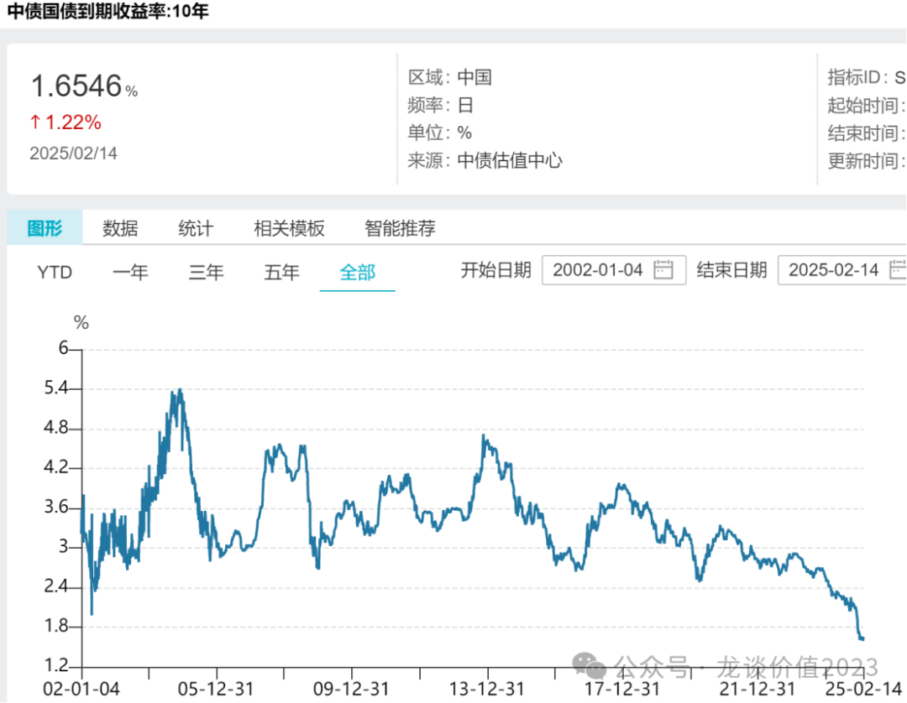
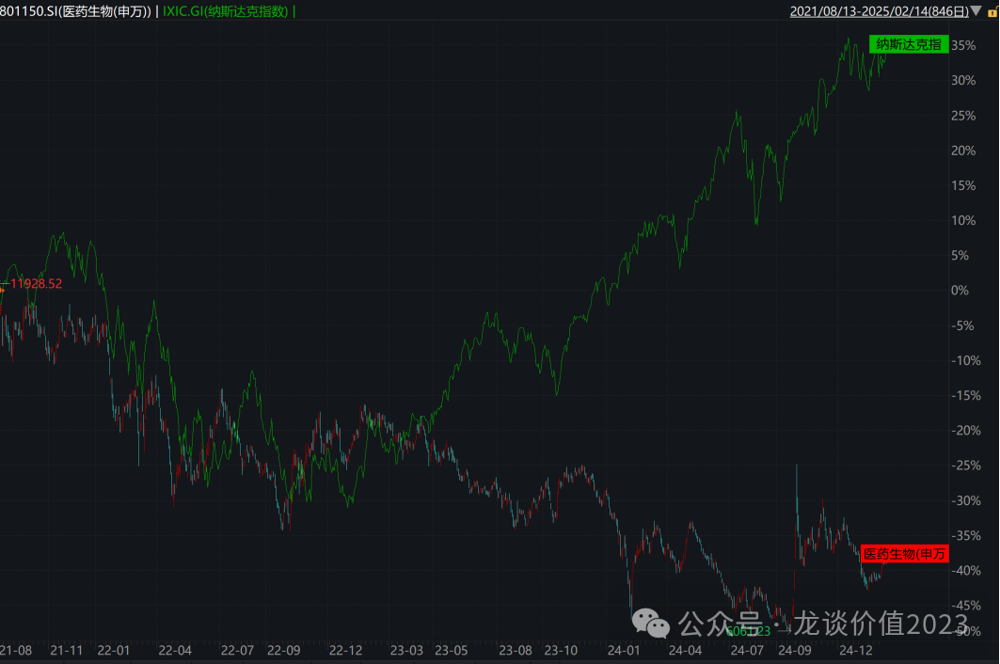
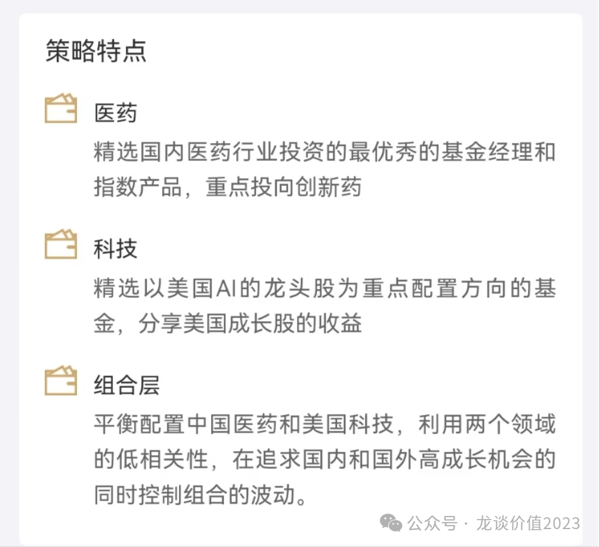
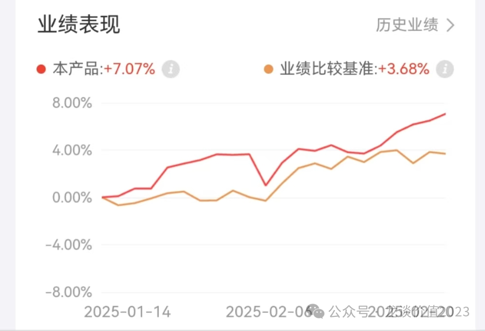
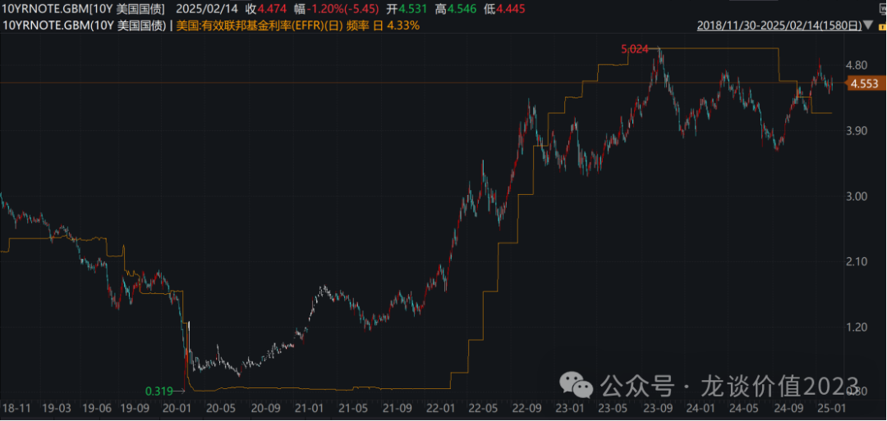
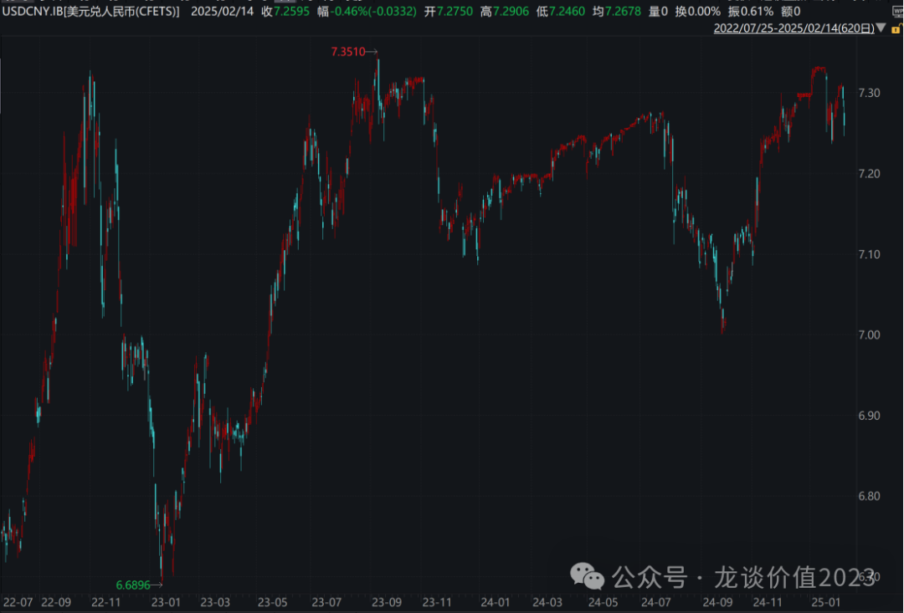
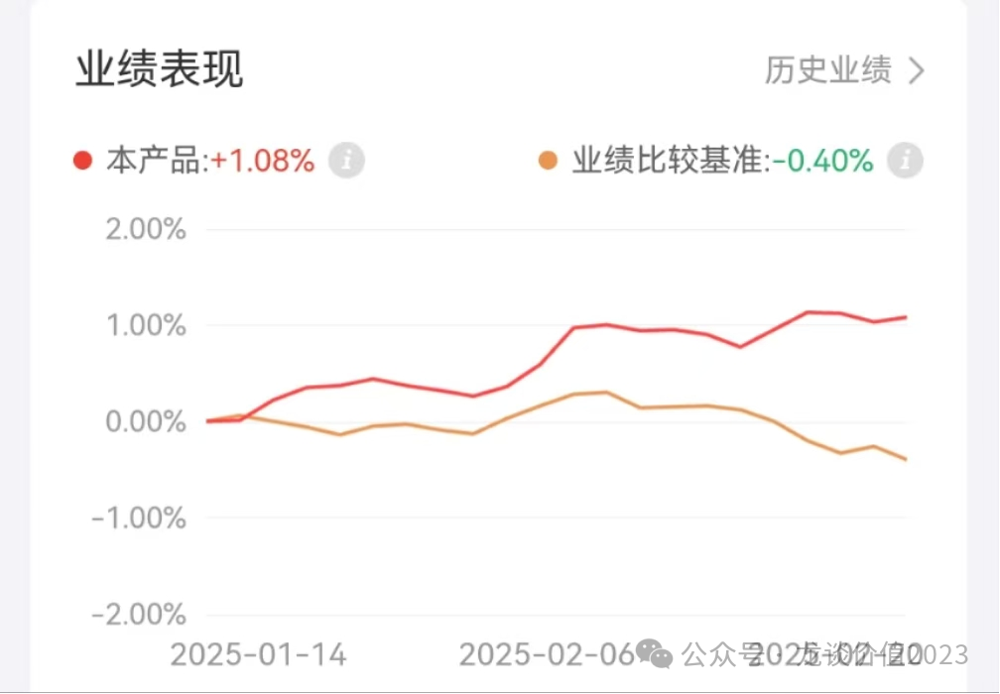

# 两个资产配置的重点方向

大家好，我是龙哥。

关注我足够久的读者（至少要4-5年那么久）可能会记得，在那时我多次讲过这个公众号的初衷，第一是分享医药行业投资相关的内容，第二是分享医药行业知识、减少行业信息差，实际上由于这两年把绝大部分精力放在公司内部，更新频率降低，也只能在每次更新中尽量简明扼要的讲最新的对行业投资的观点。

但经历了这一轮的医药牛熊、大起大落，也确实让我认识到，即便是不考虑市场因素的背景，相当一部分投资人其实根本没有承担股票价格波动的意愿和能力，也因此，对内容的分享也从过去的以行业和公司为主，转变为以行业和指数投资为主，其中的原因，跟了几年的读者应该深有体会。

那么在当前时点，从短中长期的几个趋势还要再和大家聊聊，也由此聊聊未来大家在这个公众号还能得到什么，以及大家可以在留言中说说想要得到什么。

1、熊牛切换，医药机会增加

接下来还会有越来越多的文章来给大家聊一些具体的公司，在熊市中指数化投资可以让风险相对可控、下跌相对有底，在牛市中则是可以更积极的寻找个股。

前面的几篇文章，也给大家讲到了行业当前面临的变化，《[医药行业趋势展望](https://mp.weixin.qq.com/s?__biz=MzkyMzQ3MDc3Mw==&mid=2247484101&idx=1&sn=febb0b581f3311f2fb2477ef02efdb50&scene=21#wechat_redirect)》，《[医疗AI大爆发](https://mp.weixin.qq.com/s?__biz=MzkyMzQ3MDc3Mw==&mid=2247484088&idx=1&sn=e2ebcdb46098eb9eda92d51b0c6d76bc&scene=21#wechat_redirect)》（点击链接直接查看文章）。

创新药的全球竞争力和国内政策转暖是非常清晰且已经持续了2年的趋势，当前趋势进一步确立，龙头公司逐步有一些走出历史新高，短期涨一两倍甚至三五倍的小biotech又陆续出现，如果说过去医药大熊市中创新药的研究性价比偏低，现在则可能是弹性的来源。

AI对医疗行业的影响在快速的发生，哪怕短期商业模式的跑通还不会那么快，但积极的影响已经在发生，近期我们也花了很多时间去跑各家医疗AI相关公司的调研，对行业的理解也在加深。

2、指数化投资时代不可逆

我们去研究了美股的资管行业的发展趋势，美股近十几年的ETF占比在持续提升，早已显著超过主动管理的规模，且从近十几年的表现来看，主动管理基金相较ETF的累计超额收益在收窄。

实际上我们在与一些专业做FOF的同行深度交流后，发现选择主动管理基金是一项难度并不显著低于选股的事情，且不说投资水平，首先基金经理的道德水平就是很难评估的一件事情，再加上投资方面也会存在大量的言行不一。最简单的、各位都知道的一个例子，例如医药行业某知名基金，给投资人带来了巨额亏损，其在行业高度泡沫化的阶段疯狂募资，相较其他有基本道德底线的基金经理则是选择封闭基金、限制申购。

因此，未来龙哥还是会用一定的篇幅，给大家聊指数投资的内容，我相信这对于大部分的投资人来说是好的选择。

3、全球资产配置

10年期国债收益率最新已经下行到1.65%，这意味着对于中国国债投资的性价比下降的非常严重，同时，整体存款类、理财类的产品的底层都是和利率挂钩的，收益率越来越低，这意味着从股票、债券、商品的性价比对比角度看，传统的债券类产品收益空间大幅下行，投资人不得不考虑的两个问题是：①提高权益资产的比例；②全球资产配置寻求高收益率资产。

所以在近期研究了各种组合产品之后，在京东金融的平台上选出了两个组合作为我自己的资产配置可选标的，这里也给大家聊聊。

①龙谈医药科技组合

配置50%中国医药+50%美股科技。

整体这个组合配置思路非常巧妙，中国医药和美股科技从23年4月开始表现分道扬镳，相关性非常低，背后的逻辑是驱动逻辑的不同，美股科技受到AI产业的发展走势良好，中国医药受到行业反腐、美国生物安全法案等因素导致持续走弱。

但如果把视角拉长，这两个板块的长期配置价值较高。

医药这边，上一篇文章《[医药行业趋势展望](https://mp.weixin.qq.com/s?__biz=MzkyMzQ3MDc3Mw==&mid=2247484101&idx=1&sn=febb0b581f3311f2fb2477ef02efdb50&scene=21#wechat_redirect)》里我们讲到，创新药出海的趋势已经形成，全球竞争力较为明确，不再仅仅是赚中国市场的钱，未来出海可以再造一个中国医药工业产业。叠加AI对医疗领域的赋能，政策面的进一步趋暖，行业中期向上趋势也值得期待。

科技这边，美国在当下的AI的全球化浪潮中仍处于引领者的地位，Deepseek的横空出世让A股的AI发展也更有信心，但是整体暂时还无法全面撼动美国的领先地位。但短期来看，全球的资金都淤积在美股，良好的基本面带来的是较高的估值和较为拥挤的资金面，整体市场的波动在放大。

所以把这两个板块搭配起来就非常巧妙，中长期的基本面都还可以，短期美股在右侧，医药刚刚走出右侧，同时发生大幅调整的风险较小，很好的获取长期收益，降低短期波动。

当然除了以上对行业的判断以外，还有一个很重要的原因，很多读者只在AH投医药，这几年的波动幅度过大，显然不符合很多读者的资产配置需要，另一边是想投美股的科技、但缺乏渠道和产品。

今年1月14日组合建仓以来累计收益率7.07%，在今年美国波动巨大的情况下，组合的整体波动较小，较好的起到板块之间对冲的效果。

**②****龙谈美元债组合**

美债的逻辑非常简单，中国10年期国债的收益率是1.65%，美国10年期国债的收益率是4.5%，处于过去10年的高位，目前预期今年还要2次降息。对于投资10年期美债，降息1%,带来的收益大概是4.5%票息+8年久期\*1%带来的资本利得=12.5%，当下的美债的投资性价比还是不低的。

唯一需要承担的是汇率的波动风险，目前中美利差较大，人民币是有贬值动力的，如果中国今年在多重经济压力之下刺激经济相比美国更加积极的降息，人民币更有贬值的动力，或者为了保住出口，人民币最好也是贬值。

大部分国内投资人，总体持仓还是人民币资产较多，如果多一点美元资产，是对风险的分散。

组合投资以精选的美元债QDII基金为主，这些基金的额度都越来越小，所以我的家庭资产配置中要求低风险的部分，近期也有大力跟投这个组合。

目前这个美元债组合1月14日建仓以来，已经获取了1.08%的绝对收益，整体波动也较低。

以上两个组合，感兴趣的读者也可以在京东金融里了解看看，点击链接或者扫码：

https://show.jd.com/m/WdajVEdQ6DYZNRgk/?pageKey=WdajVEdQ6DYZNRgk&fundUtmSource=1440&fundUtmParam=VsocialLTJZ2023\_user30

具体操作流程：

第一步，登录京东账号，输入手机号，用验证码登录。

第二步，领福利。

① 领权益卡，30天内免组合和基金申购费（找京东的朋友帮忙申请的）；

② 领99元财运券，至高6.6w-99元。

第三步，点击组合即可查看组合情况（策略、业绩、持仓）。

以上两个组合也都可以选择采用跟车定投的模式，管理人会自动根据情况确定发车金额，降低个人被市场情绪影响择时的操作。

京东金融APP： 搜【龙谈价值2023】同样可找到福利地址。

......

最近也在疯狂学习AI相关的内容，也在做各类投资品种的选择，这一轮AI的产业革命，叠加医药走出熊市的新一轮历史机遇，希望至少再陪大伙一轮牛市！

<!-- wxmp-comments-begin -->

---

## 留言（18 条，含回复共 34 条）

- **-Jasper** 👍15 · 2025-02-21 13:22
  龙哥，可以攒个医药机构小伙伴交流群啊[呲牙]
  - ↳ **作者** · 2025-02-21 13:23
    有这需求吗，哈哈
- **Bryan** 👍6 · 2025-02-21 14:39
  从23年7月份开始投港股创新药，中间主要踩了一个康宁杰瑞的坑，其他个股投资都经历过多轮过山车，所以回撤30-50%其实经历过多次，但如果基本面没出大问题，倒也不慌，而且价值投资就是逆向投资，反而操作上会很舒服。反倒上涨的时候会择机卖出，而且一定会卖飞，反而有点难受。
  应该要把有限的精力多分配给工作和生活，所以继续上涨我会继续卖，以后不但买ETF,&nbsp;甚至买私募。可惜，港股账户不错（创新药），A股账户拉跨（没泛AI）。。。
- **张洪亮** 👍4 · 2025-02-21 13:29
  早说啊，马上跟上。[微笑]
  - ↳ **作者** · 2025-02-21 13:33
    产品是早就选出来了，这不是起码得有段业绩表现能给大伙看看嘛
- **十年澍木** 👍4 · 2025-02-21 14:15
  医疗医药简直就是一个微缩版的A股，太复杂了。还是直接用etf省心省力，跌到市场哭爹喊妈的时候，仍然有勇气补仓[旺柴]
- **Ron** 👍2 · 2025-02-21 13:00
  龙哥，我看各个大V都在推自己在平台上的产品组合；我想请教一下粉丝买入这种组合的本质是什么？是您按优选一部分基金并给予权重，然后粉丝一键自动化抄作业按权重买入多支基金吗？如果您的组合后期做了调仓，例如选择持币或更换持仓，那我们粉丝的账户，平台也会实时帮我们自动完成调仓吗？我们的管理费是交给您，还是交给持有的底层基金呢？
  - ↳ **作者** · 2025-02-21 13:07
    1、 你可以设置自动跟投，组合的管理人调仓时，跟投的投资人会自动跟随调仓。
    2、管理费肯定不会是我收，是平台收。
    3、可以认为本质上是抄作业，不用太多费心。持仓你是可以打开链接看到的，平台、持仓都很透明。
- **张景涵** 👍2 · 2025-02-21 13:02
  龙哥，百济神州股为啥涨这么好？是啥理由？
  - ↳ **作者** · 2025-02-21 13:10
    我们去年底判断，百济是今年创新药首选标的、胜负手标的，24年的创新药胜负手是康方、博泰，25年的胜负手百济一定是最重要的一个，从所有医药大市值公司来看百济也该是首选。主要原因有二，其一是盈利拐点到来，商业模式跑通，不管是基本面还是资金面都迎来改善，其二是今年百济将会有几个重磅的研发方面的进展，包括Bcl2抑制剂读出注册临床数据，以及BTK CDAC开头对头礼来三代BTK的注册临床，CDK4在ASCO读出早期数据，一系列早期分子的临床早期推进等等。
- **唯一视觉一大鹏** 👍1 · 2025-02-21 12:49
  想了解医药医疗细分的主动被动适宜的基金，行业内走结构性行情好对应上。[抱拳]
  - ↳ **作者** · 2025-02-21 12:50
    医药的被动基金我之前写过一些，最近会再写一篇各细分梳理的
- **何勇** 👍1 · 2025-02-21 14:10
  龙哥&nbsp;创新药会成为中美谈判筹码？
  - ↳ **作者** · 2025-02-21 14:17
    不知道会不会涉及创新药授权这块。
- **大内总管** 👍1 · 2025-02-21 23:08
  龙哥&nbsp;可以定期或者季度为单位&nbsp;出一些行业的文章吗~创新药、耗材&nbsp;行业最近的前景&nbsp;
  不过感觉这些细分都很多&nbsp;&nbsp;挺难全面的[抱拳]
  - ↳ **作者** · 2025-02-21 23:22
    创新药是可以的，其他的不太容易，像高值耗材、医疗设备，细分领域太多，每个领域截然不同。
- **妙蛙** · 2025-02-21 13:05
  龙哥，从上一个号跟过来的，也有两年了。一直在定投恒医，目前大幅回血还浮亏10个点左右，现在性价比怎么样是建议显著继续定投，还是拿着不动比较好。&nbsp;&nbsp;还有龙哥怎么选了京东，弄个支付宝方便跟投，高低要跟[愉快]。
  - ↳ **作者** · 2025-02-21 13:15
    本身就是中长期的定投的话短期这种暴涨我觉得就是放慢加仓节奏，其他也没啥。京东金融做的也还可以，反正我自己几个大平台都用，也还挺方便。
- **求索者** · 2025-02-21 13:10
  确实很多人承受不了下跌
  - ↳ **作者** · 2025-02-21 13:20
    买股票的方差太大了，很多人可能也没想明白自己能承受多大的回撤就冲了，对大部分个人投资者，买指数（不管是行业还是宽基）都是更容易赚钱、控风险的。
- **张洪亮** · 2025-02-21 13:36
  龙哥，这个可以下载一个京东金融APP吗？
  - ↳ **作者** · 2025-02-21 13:39
    当然可以啊，文章最后也有提到这个，下载APP直接搜龙谈价值2023，也可以领理财黑卡的，产品也都是一样的
- **蓝天白云** · 2025-02-21 14:28
  龙老师，金斯瑞生物25年可以期待吗？
  - ↳ **作者** · 2025-02-21 14:51
    看你基于什么逻辑买，如果只是看好他细胞疗法这块就买传奇就好。
- **范征** · 2025-02-21 15:32
  龙哥，迪哲医药目前市值是不是已经打入舒沃哲和戈利昔替尼全球的预期了？目前的预期差只有一线获批以及DZD8586了？谢谢
  - ↳ **作者** · 2025-02-21 15:34
    嗯，我觉得200多亿的估值是包含的
- **无财作力** · 2025-02-21 16:39
  消费被你唾弃了
  - ↳ **作者** · 2025-02-21 16:43
    没有啊，我只是讲我看好的方向，谁也没有唾弃
- **Frank** · 2025-02-21 16:40
  龙哥，我葛兰的基金要不要割肉，亏了40%。另外迈瑞医疗和爱博医疗您怎么看，未来有机会吗？谢谢
  - ↳ **作者** · 2025-02-21 16:43
    专业做fof的投资人都知道，绝不能买明星产品，尤其是规模百亿以上的明星产品，一定没有超额，买啥啥接盘。
- **悠然自得** · 2025-02-21 22:43
  龙哥，为什么天坛生物、博雅生物等公布业绩不错的年报快报，反而这些血制品公司股票却集体跌跌不休？
  - ↳ **作者** · 2025-02-21 23:23
    重组白蛋白竞争风险，行业供需格局转向。
- **君莫笑** · 2025-02-22 02:56
  龙哥，请教下三生制药，关于他们家的707您能谈谈您的看法么，这公司算不算仿转创里面有预期差的呢，谢谢
  - ↳ **作者** · 2025-02-22 19:48
    PD-1/VEGF今年年中会发个II期肺癌PFS的数据，可以关注下，之前只有ORR的数据。主打的就是个估值便宜、现金流好，新产品可以关注下数据

<!-- wxmp-comments-end -->
