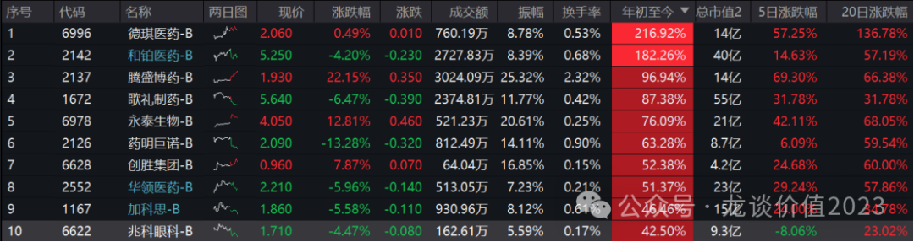
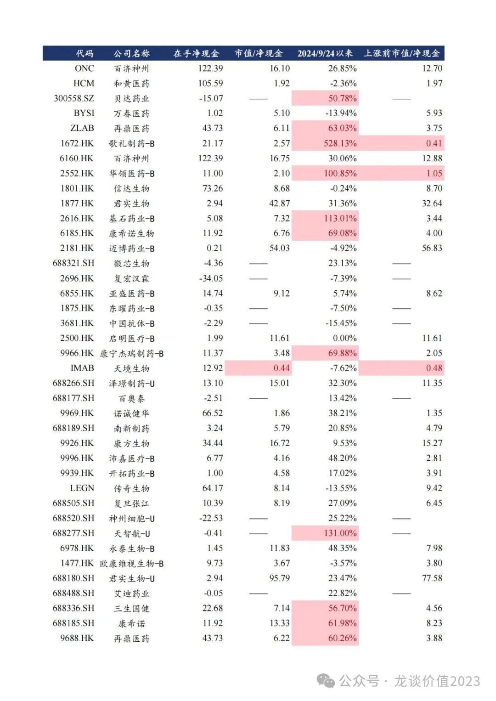
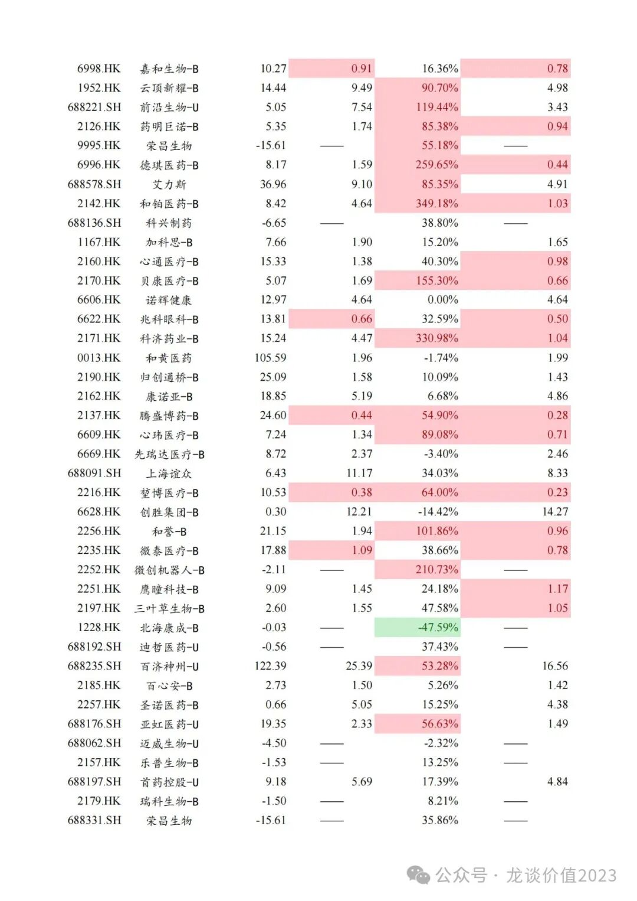
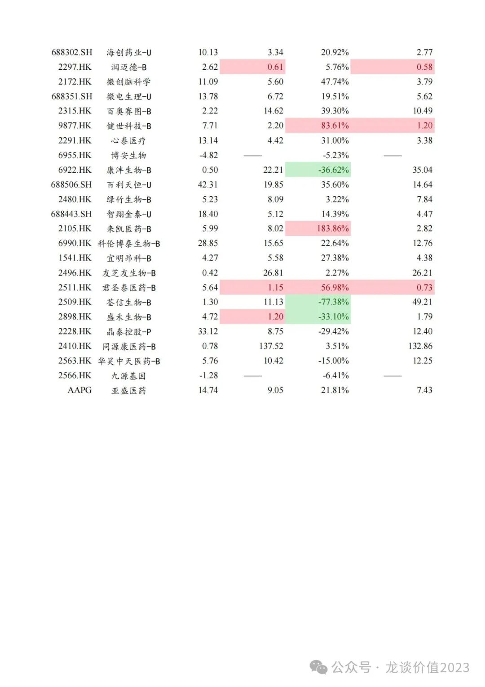
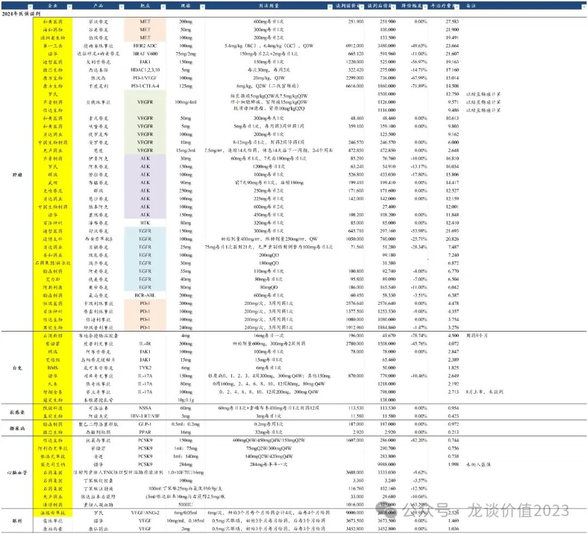

# 生物科技的狂欢

大家好，我是龙哥。

最近越来越多读者在后台问到，一些小biotech为何短期涨幅如此巨大，例如歌礼制药去年底部起来最大涨幅7倍，和铂医药12月下旬以来涨了3.6倍，德琪医药1月下旬以来涨了2倍，还有腾盛博药这种无人问津的小biotech短期快速翻倍。

行业发生了什么？

今天来和大家聊聊我看到的一些数据和我的观点。

***01***

**估值修复**

估值修复是个很宽泛的概念，不是估值低就能估值修复，尤其是创新药biotech的估值对很多非医药投资人来说堪比玄学。那么，怎么样算是估值低呢？又是如何出现行业性的估值修复呢？

首先，我们还是先来看数据，这是A股、H股、美股所有中国创新药公司截止最新财报的现金情况、市值/净现金的估值情况，包含了多个同一家公司在A股、H股、美股两地甚至三地上市的情况。

从上图里可以看出一个关键词——净现金价值。

我们以几个典型的涨幅巨大的biotech为例：

①歌礼制药：在手净现金21亿元，最低市值跌到不到7亿元，本轮起涨之前的市值/净现金只有0.41倍，这个估值意味着市场认为其所有管线都没有任何价值、未来几年的投入也都没有价值、对估值是大幅的负贡献。随着公司2款减重药（一款GLP-1小分子+长效注射，一款减重增肌药物）被市场认知、且陆续发布临床前和早期数据，公司估值一飞冲天。

②和铂医药：在手净现金8.4亿，本轮起涨之前的市值/净现金1.03倍，相当于市场只给了公司净现金价值，而公司与阿斯利康、石药集团、Moderna、辉瑞/Seagen等国内外big pharma有多项创新药BD合作，且公司在25年1月又将与科伦博泰合作开发的长效TSLP单抗达成海外授权，FcRn单抗——巴托利单抗有望25年国内启动商业化，公司全人源纳米抗体技术平台涉及与安进的诉讼也将在今年落地，可能获得安进的侵权赔偿。

③德琪医药：在手现金8.2亿，本轮起涨之前的市值/净现金0.44倍，除了现金以外公司有9款创新药临床管线，一款XPO1抑制剂塞利尼索商业化销售。

④科济药业：在手净现金15.2亿，此前市场也是只给了现金价值，公司BCMA-CART进入商业化，通用CART平台开临床上人体试验，对估值拉动巨大，本轮行情累计涨330%，1.04倍涨到4.47倍，

除了以上4家典型公司，还有其他比较有代表性的，华领医药涨101%，1.05倍涨到2.1倍，1款糖尿病创新药商业化；药明巨诺涨85%，0.94倍涨到1.74倍，1款血液瘤CD19 CART细胞疗法商业化；贝康医疗涨155%，0.66倍涨到1.69倍；腾盛博药涨55%，0.28倍涨到0.44倍；心玮医疗涨89%，0.71倍涨到1.34倍；堃博医疗涨64%，0.23倍涨到0.38倍；和誉涨102%，0.96倍涨到1.94倍。

截止到目前仍有嘉和生物（0.91倍）、兆科眼科（0.66倍）、腾盛博药（0.44倍）、堃博医疗（0.38倍）、润迈德（0.61倍）等市值显著低于净现金。

创新药估值本质上还是要看管线是否有价值，对于有商业化、有现金流、有一定管线的biotech/biopharma来说，净现金是可以作为估值的安全垫的。

但也不是所有情况都可以按净现金做估值底，上一轮熊市中跌破净现金的biotech也比比皆是，例如TSBY这种本轮大涨后仍只有0.44倍净现金估值，核心原因是其管线失败风险已经较大，管理层又偏佛系，的确有可能就是长期浪费资金而不创造价值，而公司又不分红，自然就是要跌破净现金。

***02***

**政策转向**

对于创新药领域政策的转向，我们过去也谈了比较多。

我一直和大家说，对于企业也好、对于监管部门也好，不要看他怎么说，要看他怎么做，监管部门哪怕再怎么强调支持鼓励创新药行业发展，20年-21年把PD-1的年用药费用全给干到三四万的水平，谈何支持创新药？

而自22年底的医保谈判到23-24年的医保谈判，我们每年都看到医保价格谈判的趋于温和，看到国产和海外优秀的创新药品种可以获得不错的医保定价，即使他什么也不说，我们也能感受到变化已经出现。

当然，政策面的变化，不仅于此，如我们去年的文章《[真·反转](https://mp.weixin.qq.com/s?__biz=MzkyMzQ3MDc3Mw==&mid=2247483881&idx=1&sn=a8503ed8723c3ae9c0e7b7dba53ccd6e&scene=21#wechat_redirect)》、《[全链条支持创新药政策落地](https://mp.weixin.qq.com/s?__biz=MzkyMzQ3MDc3Mw==&mid=2247483952&idx=1&sn=ca7d0770360f7b0059445284dd6e2568&scene=21#wechat_redirect)》等，都已经在明确政策制定者在逐渐的制定和推出一系列的政策来支持创新药行业的发展。

政策面的转变其实很容易理解。

我个人理解有两大核心逻辑：

- 其一是我国经济转型需要发展众多高科技产业，高科技不仅是AI、半导体、计算机这些，生物科技本身也是尖端科技，是可以创造高价值就业岗位、拉动GDP高质量发展的产业。
- 其二是从我此前的文章《[中国医药历史性事件](https://mp.weixin.qq.com/s?__biz=MzkyMzQ3MDc3Mw==&mid=2247484024&idx=1&sn=4d42f6d88e255b20f426271c9be37b88&scene=21#wechat_redirect)》可以看到，创新药出海是真的可以赚外汇，可以可以赚很多！我国创新药已经具备全球竞争的实力。

再到近期，24年11月上旬，医保局发布了医保基金预付制度的通知，24年11月下旬以来，鼓励商保和推出丙类目录的传闻陆续出现和落地，最近几天，更是连续传出两个重磅的文件，《关于完善药品价格形成机制的意见（征求意见稿）》和《关于医保支付创新药高质量发展的若干措施》。

在前一个文件中提到一点大家关注度很高的（以下为原文）：涉创新药权益类投资规模达到上季度末总资产5%的，视为创新支持型商业保险公司，可获得税收政策优惠、大病保险承办、城市定制型商业健康保险合作、探索允许职工医保个人账户购买其覆盖高水平创新药的保险产品等支持政策，并在有关商保产品结算支付一站式清分、医保商保同步结算、医保商保数据共享等方面给予支持。

根据公开数据，截至23年底险资总规模33万亿（24年停止更新了），按正常规模增长可能在34-35万亿元左右，截至23年底的权益资产仓位是12%，也既4万亿元左右。如5%口径是总管理规模，则意味着创新药占权益资产仓位要达到40%以上，不太符合常识。

因此判断大概率要求是达到权益资产的5%，医药行业标配的行业比例是8%左右，目前险资对医药行业的判断基本是标配及以上，有足够的仓位可以去增配创新药。按权益仓位的5%计算约为2000亿元，可能带来的实际增量资金在千亿以上。

目前整个AH医药股中所有创新药公司及传统仿制药转型创新药公司的自由流通市值合计为9000亿左右，扣除部分大股东持股和长期资金持股，实际流通盘还要小的多，这个增量资金非常可观。

那么商保公司是否愿意配合？

我认为以上政策如能落实，对商保公司有一定吸引力，对于减税、个账买商保、城市定制商业健康险合作等获益还是次要，更重要的是可以获得医保局的数据共享，这点对商保公司设计产品、提高效率和效益影响重大。

对于第二个文件，大致总结一下重点增量信息：

①商保、丙类目录：鼓励商保优化和开发产品支持创新药发展，建立丙类目录，丙类目录药品价格由医保局组织商保企业与药企平等协商确定，丙类目录药品入院管理与甲乙类基本医保目录相同待遇。丙类目录不纳入DRGs、按项目付费。

②定价体系：药企向非医保定点医疗机构供应谈判药品的市场价格不受支付标准约束。

③进院：不得以总额限制、医疗机构药品数量限制、次均用药费用、药占比等影响创新药进院。

④医保结算：25年基本实现目录内创新药和集采药品的医保基金——药企直接结算；创新药纳入医保4年内，医保按年度预计发生费用的80%提前预付。

总体来看这次的政策文件上，在政策层面力所能及的方方面面都做出较为明确的设定，可以认为是除了大幅增加财政在医疗领域开支以外的能帮助行业的政策都尽量推出了。

政策制定部门对创新药支持的态度非常明确，尤其是在医保预付结算、进院、定价体系上做了较大程度的放宽，对创新药行业是不错的正面政策，对创新药的国内快速放量、稳定长期价格和市场的预期会有积极帮助。

***03***

**集体扭亏**

Biopharma密集走到盈亏平衡的拐点、商业模式彻底跑通，这也是行业投资至关重要的一点，在去年8月我曾撰文写到该逻辑，至今仍在一一兑现。

原文在这里点击链接可以查看《[最重要行业拐点](https://mp.weixin.qq.com/s?__biz=MzkyMzQ3MDc3Mw==&mid=2247483961&idx=1&sn=a6c753e24d874e551a8d2eebbfb515dd&scene=21#wechat_redirect)》，在本文中我不再赘述，国内biopharma们披露完24年报后我会再做一个统一的更新。

今年头部biopharma中表现最强的百济神州，A股以超过2000亿的市值、H股以超过1600亿的市值、今年以来涨幅超过40%，领涨创新药板块。

作为国产创新药的领军企业，百济神州早在22-23年创新药收入就已经超越恒瑞医药，24年创新药收入更是预计要达到恒瑞的2倍以上，即便如此，百济A股本轮大涨后也仅是堪堪达到和恒瑞持平，H股估值仍要低30%。

截至24年底的公募基金持仓来看，对恒瑞医药的持股市值达到300亿元，而对百济神州的持股市值则只有40多亿元，二者相差7倍。

最核心的原因就是恒瑞医药有利润、百济神州没利润，而随着百济神州今年的扭亏，或许我们将看到公募持仓的显著变化。

.......

最后感慨一下，有些读者很喜欢问的问题就是，行业见底了吗？政策拐点了吗？政策支持创新药了吗？

如果你一定要问那个拐点，我认为那个拐点出现在2022年底的医保谈判，但那时候我告诉你创新药的政策见底了，绝大部分投资人并不相信，能让大部分人相信的拐点，一定是随着股价暴涨才会去寻找逻辑解读股价的表现。

但我想说的是，行业的拐点，藏在这两年的公众号每一篇文章里，藏在我们日积月累的数据积累和分析中，当大多数人反应过来行业真的有变化的时候，股价早已今非昔比，你可能也不会再拿到那个好的价格。

风险提示：本文仅讨论行业/公司经营情况，投资需综合考虑公司经营、估值、管理层等多方面因素，建议读者审慎参考，本文不作为投资依据，不建议大家根据本文做出投资计划。

<!-- wxmp-comments-begin -->

---

## 留言（12 条，含回复共 24 条）

- **法律人** 👍7 · 2025-02-24 15:41
  但我想说的是，行业的拐点，藏在这两年的公众号每一篇文章里，藏在我们日积月累的数据积累和分析中，当大多数人反应过来行业真的有变化的时候，股价早已今非昔比，你可能也不会再拿到那个好的价格。======好文笔，好文采哈[强][强][强]
- **偏偏逐晚风** 👍4 · 2025-02-24 15:33
  以后龙头会易主么，我觉得暂时几年内应该不太可能吧
  - ↳ **作者** · 2025-02-24 15:36
    我后面可以写一下复盘医药市值TOP企业的变迁，让大家知道几年时间行业的变化能有多大。核心还是跟随产业趋势，然后具体到企业的战略方向和管理，有些企业，收入利润还没掉队，市场早已反映未来掉队的预期。
- **瀛洲小喽啰** 👍3 · 2025-02-24 16:26
  一朝被蛇咬，十年怕草绳...自从经历了港股诺辉之后，对于港股的小公司，一概不然碰了
  - ↳ **作者** · 2025-02-24 16:36
    小公司不碰这没啥，这些小公司本身流动性也差，主要是小公司的暴涨间接反映了市场情绪和热度
- **建东** 👍2 · 2025-02-24 15:21
  龙哥&nbsp;国内创新药慢慢好起来&nbsp;tiger迎来新的机遇？
  - ↳ **作者** · 2025-02-24 16:06
    基本面应该也会有回暖，后面还有AI助力降本增效。
    不过可以看下我上一篇文章的数据，国内整个创新药一级市场融资还没完全回暖，对上游的传导可能会慢一点。
- **田清源** 👍2 · 2025-02-24 15:54
  周日不是刚刚被川普的政令打压了？
  - ↳ **作者** · 2025-02-24 16:00
    CXO的政治风险从未消失
- **一笑而过（王sir）** 👍2 · 2025-02-24 20:28
  老美限制对中国的投资很多，包括半导体，Ai等很多高科技，为什么只有生物医药跌呢？
  - ↳ **作者** · 2025-02-24 20:29
    因为半导体和AI可以纯靠内需，而生物医药要靠外需[撇嘴]
- **迷雾** 👍1 · 2025-02-24 15:19
  龙大，看一下药名生物，现在的位置是低估还是
  - ↳ **作者** · 2025-02-24 16:07
    看表观估值十几倍PE是低的，不过CXO尤其是药明系总归还是要反复博弈中美政治因素。
- **求索者** 👍1 · 2025-02-24 15:55
  涨幅逆天的无一例外都是小市值biotech，有些日成交量只有一千万甚至创胜今天只有一百万，纯属创新药行业转暖的炒作。
  - ↳ **作者** · 2025-02-24 15:59
    以前牛市都是消灭破净股，现在医药行业回暖先消灭破净现金的[捂脸]
  - ↳ **作者** · 2025-02-24 16:04
    这些公司能跌到跌破净现金，不仅是基本面的因素，还有失去流通性导致的流通性折价。
- **张洪亮** 👍1 · 2025-02-24 16:14
  为啥我京东金融跟投龙哥一个没有限额，另一个就600元限额😓
  - ↳ **作者** · 2025-02-24 16:16
    哪个限额600啊，是美债那个吗，现在美债的QDII确实有限额，如果是的话我去问问基金公司
- **钟凯文 | 笨拙的荆棘鸟** 👍1 · 2025-02-24 16:27
  分析的非常好啊！[强]和黄医药的在手现金是如何得知或者计算出来的呢？应该是算上了出售中药的45亿人民币吧。
  谢谢！
  - ↳ **作者** · 2025-02-24 16:35
    是的呀，不然没那么多，加上卖上海和黄药业的钱是100多亿
- **来去自如** 👍1 · 2025-02-24 16:36
  龙大&nbsp;像罗欣药业这样的创新药推广成本高导致巨亏损的股票该如何取舍？[抱拳]
  - ↳ **作者** · 2025-02-24 16:43
    他这个亏损也不只是创新药推广成本高，光创新药推广成本咋可能亏这么多，还是原有业务还没完全出清吧。
- **翰林** 👍1 · 2025-02-24 22:08
  荣昌生物现金不行
  - ↳ **作者** · 2025-02-24 22:34
    所以他才会呈现行业最低的ps估值[捂脸]

<!-- wxmp-comments-end -->
