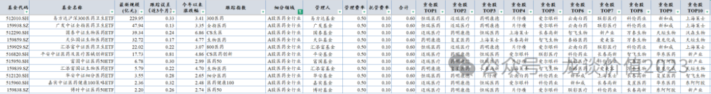
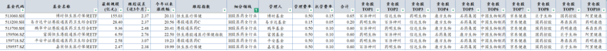
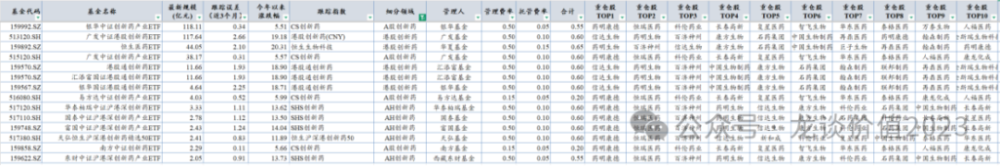
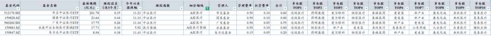
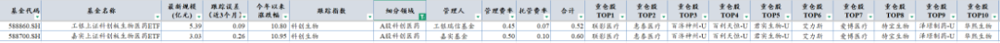
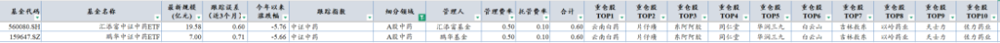

# 最全ETF梳理

大家好，我是龙哥。

读者们多次提到让我梳理医药行业有哪些ETF，尤其是细分领域的ETF，今天就一篇文章给大家讲明白。

文初先提两点：

①本文记得收藏（也可以同时转发一下）。

②文末赠完整数据。

......

首先，我们统计了全市场目前合计61个医药行业的ETF基金，截至最新的总规模是1355亿元，包含5个规模超过百亿的ETF和18个规模超过10亿的ETF。其中规模最大的是华宝中证医疗ETF（262亿）和易方达沪深300医药卫生ETF（230亿）。

但以上62个ETF并不是都适合做投资，首先我们筛选掉了规模小于2亿元的ETF，原因是规模较小的ETF一方面是流动性会比较差，另一方面是规模太小的话相对来说跟踪误差也可能更大，因此我们就以规模在2亿元以上的39个医药ETF为基础，给大家梳理一下。

***01***

A股医药全行业ETF

A股医药全行业共有11个ETF，11个ETF的费率清一色都是0.60%，在费率上没有差异了，那主要还是看规模和持仓这俩因素。

全行业的医药ETF的重仓股基本都会包含恒瑞医药、迈瑞医疗、药明康德、片仔癀、爱尔眼科等，以及联影医疗、长春高新、上海莱士、复星医药、科伦药业等医药权重股也会比较常见。

这里面会稍微特殊一点的，像159859跟踪的是生物医药指数，结果其持仓竟然不包含恒瑞医药，可能恒瑞医药在行业分类上属于化学制药......

再比如516820跟踪的是CS医药创新指数，主要覆盖医药及医疗器械，不含中药和医疗服务，可以作为一个有该方面需求的备选。

以及512290国泰中证生物医药ETF跟踪的CS生医指数，包含了较多的血制品、疫苗和生长激素等生物制品，这些持仓是上一轮医药牛市最牛的品种，但着眼当下就.....

其他ETF嘛，在持仓、跟踪误差、费率等都基本一致的情况下，就可以按规模和流动性来选，规模最大的易方达沪深300医药卫生ETF是230亿，广发中证全指医药卫生ETF规模48亿，汇添富中证医药卫生ETF规模22亿。

***02***

**H股医药全行业ETF**

H股全行业的ETF共有6支：513060、513200/513700、159506、159718、159557

这6支ETF分别跟踪3个指数，恒生医疗保健指数、港股通医药C指数、恒生港股通医疗保健指数，跟踪误差都在2%-3%之间，大伙会发现港股ETF的跟踪误差通常会显著大于A股ETF的跟踪误差，这是因为港股有些标的不在通或者流动性确实太差导致的。

这6支ETF的持仓也高度一致，前十大重仓股百济神州、药明生物、信达生物、康方生物、石药集团、中国生物制药、京东健康前7个一模一样，后3个稍有差别，包含国药控股、阿里健康、巨子生物、再鼎医药、药明康德。

规模方面，博时恒生医疗保健ETF的规模最大，达到155亿。

费率方面，规模第二大的513200（28.4亿）的费率最低，仅有0.20%，而其他5个的费率都是0.60%-0.65%。

***03***

**创新药ETF**

创新药领域的医药ETF合计有13个，可以大致分为3类，分别是A股创新药、港股创新药和AH创新药。

①A股创新药共有4个ETF：159992、515120、516080、159858

跟踪的指数都是CS创新药，前十大持仓是药明康德、恒瑞医药、科伦药业、长春高新、复星医药、智飞生物、华东医药、泰格医药、万泰生物、人福医药。

纯A股的创新药ETF实际上不算太纯粹，前十大重仓股里，3个生物制品/疫苗，2个CXO，1个仿制药麻药，剩下4个是传统仿制药企业转型创新。

4个ETF中，银华中证创新药产业ETF的规模最大，达到118亿元，广发中证创新药产业ETF规模其次，达到38亿元，这俩ETF的跟踪误差都在0.3%左右，费率合计是0.55%和0.60%，是行业中规中矩的水平。

而另外两支，易方达中证创新药产业ETF和南方中证创新药ETF，规模分别只有4亿和2亿，跟踪误差0.52和0.11，但这两支的费率均只有0.20%，属于低价抢市场的策略。

②港股创新药ETF有4支：513120、159892、159570、159567

4支ETF跟踪了3个指数，分别是港股创新药指数、恒生生物科技指数、港股通创新药指数，但前十大重仓股差别并不大，基本都是信达生物、药明生物、百济神州、康方生物、中国生物制药、石药集团这前6大，后面的翰森制药、药明康德、再鼎医药、金斯瑞生物科技也重复度较高，唯一不同的是巨子生物和联邦医药。

因此总体还是认为这4支基金的持仓是相对较为一致的，没有太大的差别，非要说差别就是512120由于跟踪指数是港股创新药，会存在偏离误差略大于港股通创新药的问题，但也不是什么大问题。

另外，4支ETF的费率也差不多，在这个情况下，就可以优先考虑规模大的两个ETF。

③AH创新药共有5支ETF：517120、517110、159748、517380、159622

跟踪指数包括SHS创新药和恒生沪深港创新药50这俩指数，前十大重仓股是药明康德、恒瑞医药、百济神州、药明生物、信达生物、康方生物、科伦药业、复星医药、石药集团、中国生物制药、长春高新等。相对来说517380的持仓更偏重A股医药权重，因此就创新药ETF来说相对没那么纯。

5个ETF规模都很小，2-3亿之间，跟踪误差都在1%左右，费率都在0.55%-0.60%，没有太大差别。

***04***

**A股医疗ETF**

A股医疗共有5个ETF：512170、159828、560260、159883、159847

跟踪指数方面，包括4个跟踪中证医疗的ETF和1个跟踪医疗器械的ETF，主要差别就是前者是医疗器械+医疗服务，后者是纯医疗器械。

持仓方面，4个中证医疗ETF的前十大重仓股统一是迈瑞医疗、药明康德、爱尔眼科、联影医疗、泰格医药、爱美客、新产业、康龙化成、鱼跃医疗、惠泰医疗。医疗器械ETF（159883）的持仓则是迈瑞医疗、联影医疗、新产业、爱美客、鱼跃医疗、惠泰医疗、山东药玻、九安医疗、乐普医疗、健帆生物。

跟踪误差方面，5个ETF的跟踪误差在0.26-0.44之间，也是A股医药ETF的正常水平，跟踪误差最低的是广发中证医疗ETF。

费率来看，规模最小的易方达中证医疗ETF（9亿规模）的费率最低，只有0.20%，而其他家都是0.55%-0.60%的费率。

规模来看，规模最大也是大家最熟悉的是华宝中证医疗ETF——高达262亿的规模，是医药行业规模最大的ETF，与上文提到的生物医药ETF一起都是上一轮医药牛市最火的赛道——当然也是跌的最惨烈的。

***05***

**A股科创医药ETF**

A股科创医药跟踪的是科创生物指数，共有2个ETF，分别是588860和588700。

两个ETF跟踪同一个指数，持仓也很一致，前十大重仓股是联影医疗、惠泰医疗、百济神州、百利天恒、君实生物、艾力斯、爱博医疗、特宝生物、泽璟制药、华熙生物。

对比来看工银上证科创板生物医药ETF规模5.4亿、费率0.52%、跟踪误差0.09%，嘉实上证科创板生物医药ETF规模3.0亿、费率0.60%、跟踪误差0.26%。

***06***

**A股中药ETF**

这是前两年中药火爆的时候出现的两个产品，也是以上39个医药ETF里今年唯二下跌的ETF......

两个ETF分别是560080和159647，跟踪指数是中证中药，前十大持仓是云南白药、片仔癀、东阿阿胶、同仁堂、华润三九、白云山、吉林敖东、以岭药业、天士力、佐力药业。

两个ETF的费率都是0.06%，跟踪误差汇添富中证中药ETF是0.60%、鹏华中证中药ETF是0.71%，规模前者20亿、后者7亿。

......

以上就是为大家梳理的合计39个规模2亿以上医药行业ETF的情况。

公众号发图片可能会有点模糊，如果需要完整数据的读者，可以对本文点赞、推荐、分享三连，然后在文末留言或后台私信留下你的邮箱，我会在晚些时候把完整数据表格抽空发到你的邮箱。

（有我微信的读者就别留言了，直接给我发微信~）

风险提示：本文仅讨论行业/公司经营情况，投资需综合考虑公司经营、估值、管理层等多方面因素，建议读者审慎参考，本文不作为投资依据，不建议大家根据本文做出投资计划。

<!-- wxmp-comments-begin -->

---

## 留言（13 条，含回复共 25 条）

- **Jeffery** 👍12 · 2025-02-26 11:47
  龙大，不能删文章哈~
  - ↳ **作者** · 2025-02-26 11:51
    好的好的[呲牙]
  - ↳ **作者** · 2025-02-26 12:01
    对了，我看文末留言邮箱容易被系统屏蔽，你们需要资料的话最好是私信留邮箱，以及如果留了邮箱我2天之内都没给你发的话，可以再来重新发一下
- **知行** 👍6 · 2025-02-26 11:47
  先赞后看
  - ↳ **作者** · 2025-02-26 11:51
    好习惯[呲牙][呲牙]
- **俏皮的货船** 👍5 · 2025-02-26 19:09
  终于盼到了龙哥的ETF精华！近半年一直逐步有加仓ETF，最近终于见到肉🥩了，坚持下来真不容易啊，谢谢龙哥！
- **金色田野** 👍5 · 2025-02-26 22:10
  终于明白了，基金太多傻傻分不清，谢谢老师分享！收藏了。
- **嘀嗒** 👍3 · 2025-02-26 11:55
  心脉暴跌是有啥雷吗？
  - ↳ **作者** · 2025-02-26 11:59
    河北联盟又要搞主动脉集采，之前预期降价以后几年内不搞集采了。还是我前面讲的，我也不太明白为啥对创新药和创新器械的态度差别这么大，对创新药现在支持态度非常明确，各种支持政策层出不穷，对器械就是毫不留手，一直下死手的搞
- **大庆** 👍3 · 2025-02-26 12:23
  大家可以把文章直接加入到腾讯IMA个人知识库，再也不怕龙少删文章了[呲牙]
  - ↳ **作者** · 2025-02-26 12:37
    ima&nbsp;这个如果原文删了一样会没有，我上次存的一个公众号文章就因为原文删了就没有了。有道云笔记好像是可以的，不过是保存了自己再编辑一下内容
- **邦** 👍1 · 2025-02-26 17:27
  龙大，我也不知道我关注您多久了，自从医药行业一蹶不振后就只关注恒瑞和百济的动向了，您的文章也一直有在看，也从您的文章中学到很多，相信创新药会重新回到它应该得到的估值，希望能一直看到您的干货分享和思考方法。
  今天文章的数据也希望能得到进一步研读，我的邮箱是：461497055@qq.com，再次感谢您的分享[强][强][强]
  - ↳ **作者** · 2025-02-26 22:37
    已发，以后可以多留言交流~
- **廖宏** 👍1 · 2025-02-27 22:16
  龙大，泽璟，诺诚最近有什么新闻吗
  - ↳ **作者** · 2025-02-28 00:15
    诺诚Bcl-2开III期，奥布今年增加一线CLL，24年销售和25年增长趋势都不错，CD19今年获批，NTRK今年申报，3个自免分子在III期，账上七八十亿现金，还需要啥新闻嘛
- **星移无痕** · 2025-02-26 12:03
  爱博又又又莫名暴跌，是机构逃了吗。。。
  - ↳ **作者** · 2025-02-26 12:13
    参照另一条留言，感觉是又被心脉集采吓的？
- **谢东颖 Donyyy Tse** · 2025-02-26 13:08
  恒瑞被超越了
  - ↳ **作者** · 2025-02-26 22:38
    实属必然了，可以看上一篇文章以及再往前的梳理行业创新药收入的文章。
- **DDdd** · 2025-02-26 19:58
  费用主要是什么决定的啊
  - ↳ **作者** · 2025-02-26 20:04
    基金公司决定的
- **夏天** · 2025-02-26 22:14
  龙哥，请教丽珠集团基本面有变化么？它的增长和风险点在哪里呢？
  - ↳ **作者** · 2025-02-26 22:36
    丽珠集团和石药集团共同存在的问题，就是存量大品种的下滑，新品种暂时又没承接上，有点像几年前的恒瑞。
- **云淡风轻** · 2025-02-27 08:29
  双鹤有什么风险吗？业绩没有下滑，为啥股价一直喋喋不休没完没了啊
  - ↳ **作者** · 2025-02-28 00:13
    大输液竞争还挺激烈的，业绩也没什么增长，后面如果集采加压也有问题。之前炒国企中特估拉了一波估值，股息率也不高，就跌回来了。

<!-- wxmp-comments-end -->
