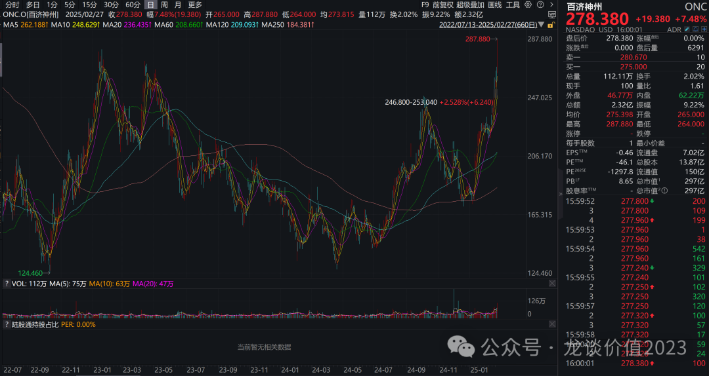
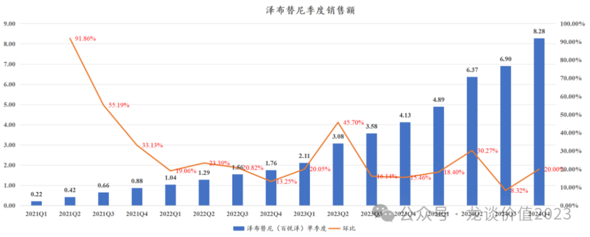
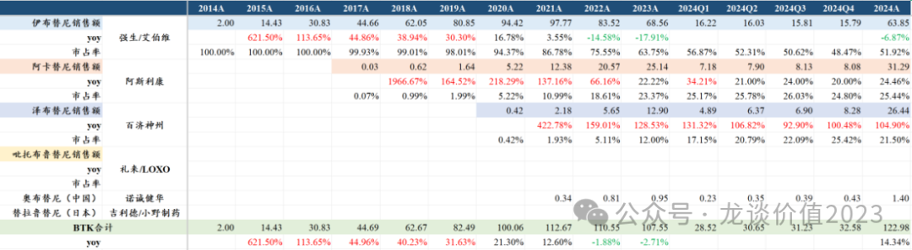
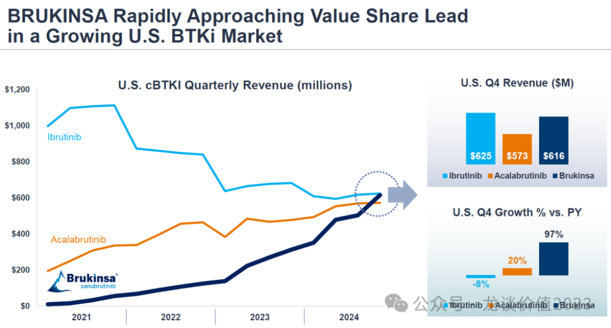

# 创新药巨头狂飙

大家好，我是龙哥。

原本今天是想写写大家最近问的一个问题——百济市值首次超预恒瑞登顶创新药一哥的问题，但由于百济昨晚发布的24Q4业绩太过惊艳，因此今天趁着百济国内业绩会之前也聊一下百济的业绩，下周再说恒瑞的事。

首先看昨晚美股百济的表现，在昨晚美股总体表现较差的情况下，百济逆势大涨7.5%，盘中涨超11%，可见美股投资人对百济这份财报的激动。

根据百济神州昨晚发布的2024年业绩快报，2024年全年收入272.14亿元+56.19%，其中产品收入269.94亿元+74.11%，Q4单季度收入80.78亿元+77.61%，单季度产品收入80.07亿元+77.14%，季度增速相较Q2Q3有所提速，环比增长13.11%，季度收入超预期约5亿元/6%。

1）核心产品及收入指引

①泽布替尼：

泽布替尼是大家比较熟悉的品种了，是海外第一个获批的中国国产BIC新药，全球首个在头对头III期临床中战胜泽布替尼的BTK抑制剂。

泽布替尼2024年全年收入26.44亿美元+104.9%，位居全全球重磅药物第70名的位置，25年有望进一步提升至50名左右。Q4单季度泽布替尼销售8.28亿美元同比增长100.48%、环比增长20%大超市场预期，此前市场预期泽布替尼全年收入25亿-25.5亿美元，实际超预期1亿美元。

分区域来看，Q4单季度，美国市场收入6.16亿美元+97%环比显著加速，欧盟销售1.13亿美元+148%，国内销售4.98亿元同比+38%、环比+2.68%。

全球份额来看，泽布替尼2024Q4的全球市场份额为25.42%、环比提升3.33%，首次超越阿斯利康的阿卡替尼位居全球第二，次于伊布替尼的48.5%。

泽布替尼24年全年的全球份额为21.5%同比提升9.5%，Q1-Q4的全球份额分别为17.15%/20.79%/22.00%/25.42%，逐季度快速提升。24全年伊布替尼全球销售同比下滑6.87%，阿卡替尼销售同比增长24.46%，都远低于泽布替尼的104.9%。

而根据昨晚百济美股英文业绩会的PPT显示，泽布替尼在美国市场的单季度销售额已经超越阿卡替尼，且仅仅略低于伊布替尼（泽布6.16亿美元VS伊布6.25亿美元），在新患持续占据领先优势的情况下，预计25年美国销售额将显著超越阿卡替尼和伊布替尼。

此前市场预期25年泽布替尼全球销售额35亿美元，由于24年报超预期，也将被显著上调。

②替雷利珠单抗：

替雷利珠单抗虽然已经在海外获批，但目前仍是以国内销售为主，是目前国内最畅销的PD-1单抗，其2024年累计销售额44.67亿元+17.37%，其中Q4单季度收入11.07亿元+19.81%，相较Q2Q3也有显著提速。

替雷利珠单抗已经在欧盟和美国陆续获批肺癌、胃癌、食管癌等多个癌种，预计25年仍将有一定增长。

③其他产品收入：

帕米帕利及其他代理品种收入合计36.68亿元+43%，预计其中地舒单抗销售超15亿元，其他卖的不错的品种还有代理安进的贝林妥欧单抗（CD19/CD3）、代理安进的卡非佐米等，具体品种收入还要等待百济神州披露完整业绩。

后续，地舒单抗可能面临几家生物类似药的竞争，不过短期一两年内应该还轮不到地舒单抗集采，代理绿叶制药的戈舍瑞林微球也值得期待放量。

公司指引2025年收入合计49亿-53亿美元同比增长28.1%-39.1%，我们预计其中泽布替尼贡献70%以上。

2）利润端

2024年全年归母净利润-49.78亿元同比减亏25.87%，净利率-18.29%同比提升20.26%。

24年全年经调整营业利润5.28亿元，23年同期为-51.76亿元，同比减亏57.04亿元，Q4单季度的经调整营业利润为4.76亿元，24Q3为6.44亿元，连续2个季度实现经营性盈利，且公司指引25年实现GAAP经营利润为正且经营活动现金流为正。

3）在研管线

①sonrotoclax（Bcl-2抑制剂）：

全球临床试验入组超1800人。

预计单药R/R CLL和单药R/R MCL两个适应症于2025H2以注册II期提交加速批准申请，预计2025H1完成R/R CLL、R/R MCL两个适应症全球III期首批患者入组。

联用泽布替尼一线治疗CLL的全球III期临床已经完成患者入组。

另外公司在推进WM的全球II期临床患者入组。

②BGB-16673（BTK CDAC）：

全球临床试验入组超500人。

预计R/R CLL潜在注册II期临床于2026年读出数据。

预计2025H1启动BGB-16673头对头医生选择的治疗方案用于R/R CLL的III期临床（本周已经启动）。

预计2025H2启动头对头礼来BTK抑制剂匹妥布替尼治疗R/R CLL的III期临床。

③内部实体瘤新分子：

CDK4抑制剂、CDK2抑制剂、B7-H4 ADC预计2025H1进行数据读出。

其中CDK4在计划联合内分泌药物二线治疗HR+/HER2- BC的III期临床。

④肺癌、胃癌后期品种：

AMG757（DLL3/CD3双抗）预计2025H1读出2L SCLC的III期数据。

欧司珀利单抗一线PD-L1高表达NSCLC预计2025H2进行III期临床中期分析。

泽尼达妥单抗+替雷利珠单抗+化疗一线治疗HER2+ 胃癌预计25H2读出III期PFS数据。

......

总体来看，百济神州市值超越恒瑞医药，背后靠的是强劲的产品销售兑现和强大的管线支撑，这里并不是说恒瑞不好，而是二者本身也初步基本面不同的兑现阶段，百济的业绩爆发不需要卷内幕消息，而是到了业绩兑现的时间点、藏都藏不住。

有些读者问为什么我们去年底判断百济是今年的胜负手，这篇文章里，答案已经初现端倪。

风险提示：本文仅讨论行业/公司经营情况，投资需综合考虑公司经营、估值、管理层等多方面因素，建议读者审慎参考，本文不作为投资依据，不建议大家根据本文做出投资计划。

<!-- wxmp-comments-begin -->

---

## 留言（10 条，含回复共 21 条）

- **俏皮的货船** 👍6 · 2025-02-28 10:00
  等了几年的医药，终于来了，好饭不怕晚。科技下来后，这两天消费和白酒也起来了，真实那句话，牛市都会轮流来一遍，关键有业绩支撑，持有还是不担心，等风来！再次谢谢龙哥这么早发文解读。
  - ↳ **作者** · 2025-02-28 10:40
    2024年8月29日的文章《最重要行业拐点》，大家记得再回去读一读[加油]
  - ↳ **作者** · 2025-02-28 10:49
    嗯，一直有关注龙哥的文章，美篇必读，特别喜欢医药，虽然几年来行情不好，但证明后市肯定会有反转，所以一直有坚持，顺势而为，不亏还有赚[呲牙]
- **JMTerry** 👍5 · 2025-02-28 09:11
  龙哥最近输出力度很大
  - ↳ **作者** · 2025-02-28 09:15
    老读者，是不是上一轮医药牛市熟悉的感觉[悠闲]
- **王熙** 👍3 · 2025-02-28 09:20
  专业的基本面分析
  - ↳ **作者** · 2025-02-28 10:31
    [抱拳][抱拳]
    借这条再说一下，历史几篇文章里赠送资料的，如果有发了邮箱我没有发送资料的， 记得再发一遍，因为系统有时候会屏蔽发邮箱的留言和私信，会导致我错过消息。
- **陈钢** 👍3 · 2025-02-28 10:23
  龙哥，拿了恒瑞快5年了，刚刚靠牛市变红，又被老二超越了，感觉前途未卜啊
  - ↳ **作者** · 2025-02-28 10:29
    市值超越和恒瑞又没啥关系，这种市值对比对公司本身没太大意义，核心还是看公司本身的基本面
- **夕仁** 👍2 · 2025-02-28 09:17
  请教一下，您对恒瑞业绩放量时间，有大致预期么？还是说，依然要看天意？
  - ↳ **作者** · 2025-02-28 10:17
    看天意是啥[捂脸]看天意的话那还怎么投资。。肯定是要基于公司的品种集采和放量节奏具体分析啊。下周会写写对恒瑞现在的看法。
- **也无风雨也无晴** 👍1 · 2025-02-28 09:22
  好久没看到龙大这么激动了，哎，医药人这几年狗都不理。。。希望龙大多多分享
  - ↳ **作者** · 2025-02-28 10:14
    这分享频率够多了吧[旺柴]
- **张洪亮** · 2025-02-28 09:19
  龙哥问了京东金融了吗？什么原因只每天能买600元呢？
  - ↳ **作者** · 2025-02-28 09:22
    稍等几天哈，管理人在调整组合，因为有个QDII基金每天限售600，导致整个组合被限售，需要几天调整。调整完就可以了。
- **卢光明** · 2025-02-28 09:21
  龙大，医疗被锤了四年了，现在是春天播种季吗？
  - ↳ **作者** · 2025-02-28 10:16
    看我前面的文章，别的不说，创新药都快到夏天了，播种季肯定是过了，现在是收获期。
- **zhz** · 2025-02-28 09:24
  美国生物制裁威胁摆着，导致都不敢拿创新药了，一直没上车
  - ↳ **作者** · 2025-02-28 10:14
    这不是主要影响制造端吗，和创新药一直没太大关系啊。。。。
- **孙小山** · 2025-02-28 11:06
  龙哥，怎么看金斯瑞，传奇的销售峰值能到&nbsp;70&nbsp;亿么
  - ↳ **作者** · 2025-02-28 11:12
    传奇是传奇，金斯瑞是金斯瑞，传奇的销售要边走边看，就目前的趋势和强生的策略来说我认为达到70亿美元峰值的概率在提升，当然我们也还要看ACLX后续的数据和商业化的情况。金斯瑞的话，如果传奇不被收购那他就没有价值兑现的渠道，依然会长期折价。如果传奇可以被收购，那传奇和金斯瑞或许可以双赢。

<!-- wxmp-comments-end -->
