# 中国创新药出海之王

大家好，我是龙哥。

文初提醒一下，最近有几位朋友和我吐槽，更新了几篇很不错的文章都没能及时看到，主要是微信推送公众号文章模式的问题，大家如果想要避免错过好文，可以把龙哥公众号加个星标：

创新药出海是如此重要，对于企业来说一个好的品种只有出海才是利益最大化的选择，真正优秀的品种必然选择出海（对应无法出海的品种则意味着......），国内市场与海外市场的竞争环境、市场环境天壤之别，一款优秀的药物在海外可以卖到数十亿美金，在国内则可能只有小几十亿甚至几亿人民币，支付方的差距是一方面，以及国内大量的低效重复研发使得很难有竞争格局很好的大品种。

在去年11月底的时候给大家写过一篇文章《[中国医药历史性事件](https://mp.weixin.qq.com/s?__biz=MzkyMzQ3MDc3Mw==&mid=2247484024&idx=1&sn=4d42f6d88e255b20f426271c9be37b88&scene=21#wechat_redirect)》，中国创新药出海BD授权总交易对价突破万亿元，首付款近千亿元。创新药不仅是关乎老百姓健康的领域，更是成为产业升级和出口赚外汇的利器。

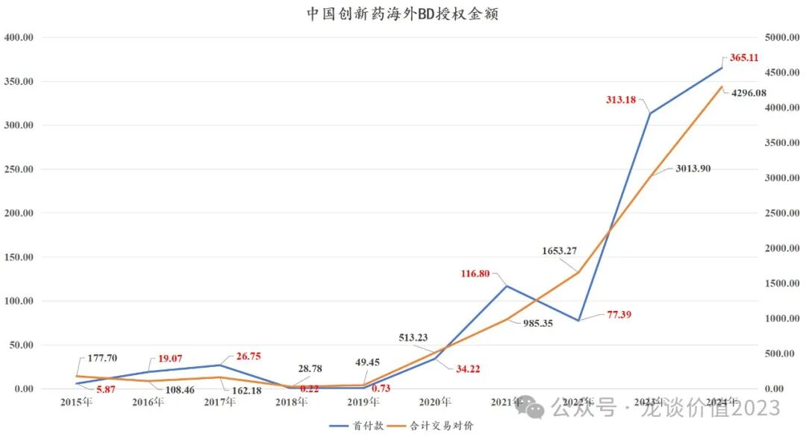

如果说23年的BD爆发，很多投资人还认为是前一波创新药投融资泡沫中研发的早期分子呈现批量授权，那么24年以来持续的跟随技术趋势的创新药海外授权，则是彻底明确了中国创新药开发在全球的竞争力。

那么在21年以来持续爆发的中国创新药出海浪潮中，哪些公司是海外BD授权的无冕之王？今天就从交易数量和交易对价角度来给大家梳理一下。

1、恒瑞医药

从创新药海外授权的交易次数来说，恒瑞医药累计13笔BD交易授权排在首位，恒瑞对外授权了2款单抗、1款双抗、5款小分子、2款ADC以及1款多肽药物，其中有3笔交易发生在2018年及以前，3笔交易发生在2020年，7笔交易发生在2023-2024年。

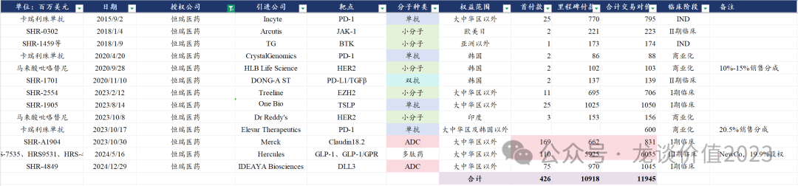

以上恒瑞医药的13笔海外BD授权，合计给恒瑞医药带来4.26亿美元的首付款——约30亿元人民币，而我们知道恒瑞在21-23年每年利润才40亿元上下。总的交易对价119.45亿美元、位居国内第一，这其中GLP-1系列分子的海外newco合作占了超过60亿美元。

交易中有两笔让人尤其印象深刻：

其一是2023年8月的恒瑞的长效TSLP单抗的海外授权，这笔交易恒瑞医药拿到2500万美元首付款和10.25亿美元的潜在里程碑付款，这笔交易做的有多拉胯呢，仅仅4个月后的2024年1月，GSK以10亿美元现金+4亿美元里程碑付款的对价收购了引进恒瑞TSLP单抗的Aiolos Bio公司......转手卖了10个亿、一生一世花不完（《[医药行业离谱事件](https://mp.weixin.qq.com/s?__biz=MzkyMzQ3MDc3Mw==&mid=2247483848&idx=1&sn=aa0791f438ad4b17069d48348913448b&scene=21#wechat_redirect)》）。

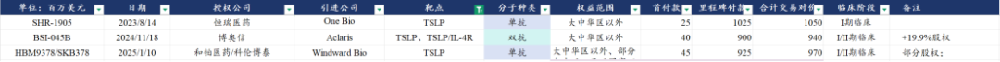

即便是和后续的TSLP抗体的授权比起来，博奥信和和铂的TSLP抗体也拿到了4000万美元和4500万美元的首付款。

不知道恒瑞做这笔交易的BD人员有没有被开除。但就这笔交易能让恒瑞在中国BD历史上“青史留名”。

其二是GLP-1系列产品组合的海外授权，这笔交易的总规模60.35亿美元，是6笔中国GLP-1系列资产海外授权中最大的一笔，这笔交易恒瑞医药拿到1.1亿美元的首付款依然不算多，但这次恒瑞学聪明了，以Newco的方式保留了19.9%的股权，防止再被“最黑中间商”赚走巨额差价。

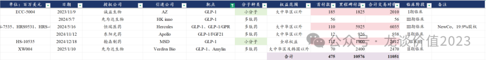

从恒瑞医药对外授权的分子来说还是能感受到恒瑞医药研发端的进步，23年以来的几笔交易对应着TSLP、GLP-1/GIPR、DLL3-ADC等几个潜在全球重磅品种。

2、和铂医药

和铂医药是去年底以来涨幅最大的biotech公司之一，底部至今涨幅达到3.8倍。除了24年2月与Boostimmune的药物发现合作以外，和铂医药的海外BD授权有8笔、仅次于恒瑞医药，包括3款双抗、3款单抗、1款ADC和一个核酸药物领域的合作。

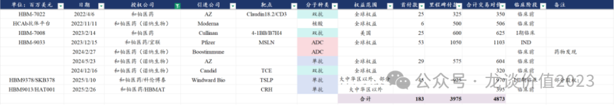

8笔交易合计给和铂医药带来了1.83亿美元的首付款，主要是和铂医药授权的分子普遍处于非常早期（大半分子都是临床前）；总交易对价49亿美元，且和铂医药依靠其全人源纳米抗体技术平台，后续还有持续的高质量分子发现和海外BD授权的潜力。

3、科伦博泰生物

科伦博泰的海外授权虽然只有4笔，但是总交易对价高达116.5亿美元，在中国创新药海外BD授权总交易对价中仅略微低于恒瑞医药、位居第二。

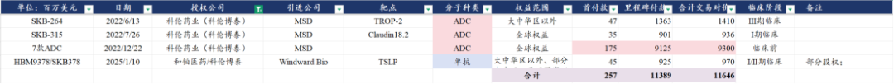

其创新药海外BD主要是2022年与默沙东合作的3笔ADC药物的交易，先后助力了科伦药业和科伦博泰的股价腾飞。

首笔交易是2022年6月对SKB264（Trop2-ADC）的合作，也是科伦博泰梦开始的地方，截至2025年2月，默沙东已经启动了12个Trop2-ADC单药或联用的全球III期临床，预计累计需要入组患者接近1万人，意味着仅该药物相关临床试验费用就要花费数十亿美元，可见默沙东对该分子的重视程度。

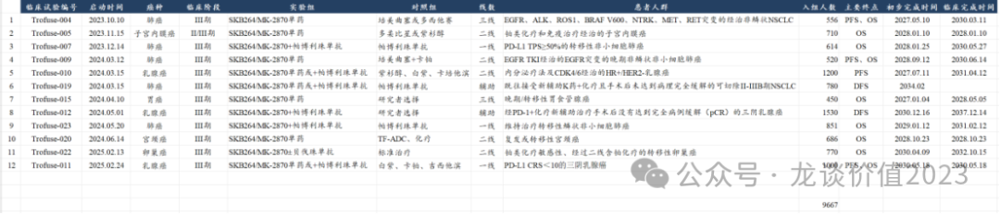

另一笔惊艳的交易是2022年12月科伦博泰以合计93亿美元总交易对价授权的7款ADC分子，其中有个别分子如SKB571双抗ADC默沙东已经行权，也有2款临床前分子的权益被退回。

4、映恩生物

ADC领域，科伦博泰珠玉在前，映恩生物怀璧其后。

映恩生物合计5笔ADC药物的海外BD合计带来2.5亿美元的首付款和54亿美元的总交易对价。

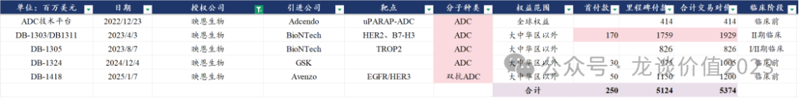

其中最核心的合作是与BioNTech的两笔交易，授权了HER2-ADC、Trop2-ADC和B7-H3 ADC等3款分子，目前BioNTech已经将HER2-ADC推进到全球III期临床，映恩生物预计最快25年以注册II期临床在美国申报EC适应症的上市申请。

除以上5笔交易外，映恩生物在23年7月还将B7-H4 ADC的全球权益授权给百济神州，并获得了4000万美元首付款和13.27亿美元的总交易对价。

5、康方生物

康方生物有两笔海外BD授权，分别是2015年将CTLA-4单抗授权给默沙东（目前在III期临床）和2022年12月将PD-1/VEGF双抗授权给Summit，并在2024年6月进一步扩大了合作区域范围。

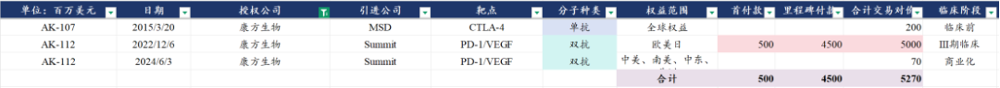

康方与Summit的这笔合作如此重要，对于中国创新药行业都有重要的历史意义：其一是在2022年底创新药行业大熊市一片萧条中给出了国产创新药出海的新希望，康方生物、科伦博泰、和黄医药三家公司在22年底前后的BD授权对于行业信心的修复至关重要，尤其是康方当时拿到5亿美元的首付款、50亿美元总交易对价，在当时来说已经是天价。

其二是康方生物同时还带动了PD-1/L1\*VEGF双抗的全球研发热潮，在24年9月康方生物在世界肺癌大会上发布首个AK112头对头K药的PFS显著优效的临床数据后，行业彻底被点燃。

康方之后该领域的5笔交易合计带来了20亿美元的首付款和合计124亿美元的总交易对价，BioNTech更是直接把自普米斯引进的PD-L1/VEGF双抗放到最重要的位置，all in的开了两个肺癌全球大III期，并且又开始探索与其同样自国内映恩生物引进的ADC药物的联用。

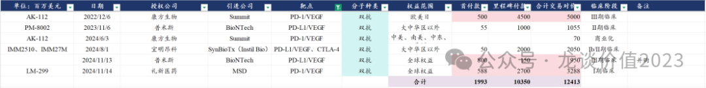

6、百利天恒

谈到康方生物就不得不谈到百利天恒，同样是泛癌种的双靶点分子，百利天恒的EGFR\*HER3双抗ADC以8亿美元首付款+76亿美元里程碑付款的对价授权给BMS（研发费用各半承担），在整个国内创新药BD授权历史上仅次于齐鲁锐格授权罗氏CDK2和CDK2/4/6时的8.5亿美元首付款，就单个分子而言无论是首付款还是总交易对价都是国内第一。

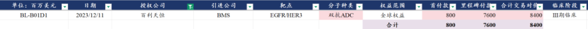

针对该分子，百利天恒已经启动了8项国内的III期临床，其中包括4项肺癌领域的III期临床、2项乳腺癌领域III期临床以及鼻咽癌和食管鳞癌领域各1项。但目前BMS在海外的开发并没有过于激进，还是从早期剂量探索开始做。

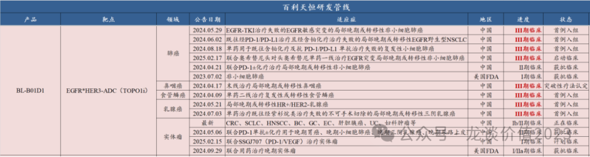

7、康诺亚

康诺亚累计进行了5笔海外BD授权，包括1款ADC药物授权给MNC阿斯利康，以及3款双抗、1款单抗均以Newco方式授权给biotech、并持有少数股权。

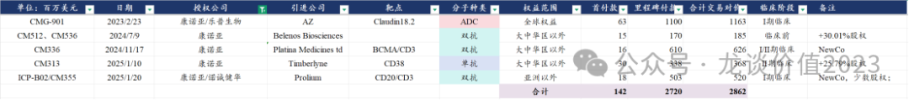

5笔交易合计获得1.42亿美元首付款（CD20/CD3与诺诚五五开），总交易对价28.62亿美元。

8、百济神州

百济神州目前海外新药开发已经不需要通过BD授权的模式，其自己拥有强大的全球新药开发、临床、生产和商业化团队，但我们看百济历史上的几次BD交易还是挺有意思。

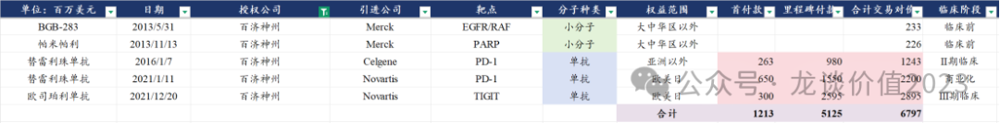

百济曾在2016年将PD-1单抗授权给新基，拿到2.63亿美元的首付款，但由于BMS将新基收购、而BMS本身有一款PD-1单抗——纳武利尤单抗，因此将其权益退回给百济；随后2021年百济又将PD-1单抗授权给同样缺乏IO疗法的诺华，拿到了6.5亿美元的首付款，并在2021年12月又将TIGIT单抗授权给诺华，拿到3亿美元首付款，但随后23年7月和9月分别被退回TIGIT单抗和PD-1单抗的海外权益。

百济的这3笔BD授权交易虽然都以失败告终，但仅首付款就拿到超过12亿美元，这两款分子百济累计的研发投入是84亿元/12亿美元，也即百济靠着失败的BD交易收回了两个分子的研发成本，而目前百济的替雷利珠单抗是国内最畅销的PD-1单抗，年度销售额达到6.2亿美元且仍在增长。

9、石药集团

石药集团近年在新药研发和出海方面有显著的进步，近5年实现了5款早期分子的海外授权，包括3款ADC、1款小分子和1款单抗，合计拿到1.58亿美元首付款、58亿美元的总交易对价。

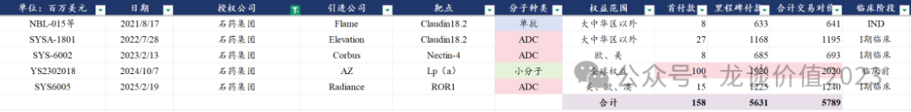

石药集团对外授权交易中，最值得关注的是24年底授权给阿斯利康的一款降血脂药物YS2302018，这是一款石药集团基于AI药物设计平台开发的分子，本次授权拿到1亿美元首付款和20亿美元总交易对价，改变了石药集团BD授权只能低价授权给小biotech的历史。

10、传奇生物

作为国内细胞治疗领域的领军企业，传奇生物达成了国内7款CAR-T疗法海外授权中的2款，分别是BCMA-CART（Carvykti）和DLL3-CART，分别授权给强生和诺华。

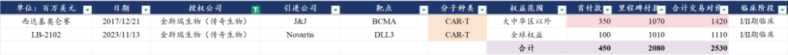

传奇生物合计拿到4.5亿美元首付款和25.3亿美元总交易对价，Carvykti的海外权益是与强生五五开，国内权益则是三七开。随着Carvykti的临床开发和商业化推进，传奇生物自强生陆续拿到里程碑付款和销售分成，24年Carvykti全球销售9.63亿美元，公司预期25年全球销售再翻倍。

......

理想的全球创新药商业化模式是百济神州这样的模式，但是百济模式不可复制，其历史上烧钱规模之巨，前无古人、后也很难有来者。海外BD授权还是中国创新药走向国际化的主流模式，随着和黄医药、传奇生物等公司商业化兑现，以及和誉、复宏汉霖等公司临近商业化兑现，国产创新药出海将在未来几年逐渐进入商业化的收获期。

......

近期重点文章：

《[创新药巨头狂飙](https://mp.weixin.qq.com/s?__biz=MzkyMzQ3MDc3Mw==&mid=2247484144&idx=1&sn=0b26f935e3f7a1a6248b091a6c0ec916&scene=21#wechat_redirect)》

《[生物科技的狂欢](https://mp.weixin.qq.com/s?__biz=MzkyMzQ3MDc3Mw==&mid=2247484124&idx=1&sn=233fb7eda9c948a508908c6a66a6a4d0&scene=21#wechat_redirect)》

《[两个资产配置的重点方向](https://mp.weixin.qq.com/s?__biz=MzkyMzQ3MDc3Mw==&mid=2247484114&idx=1&sn=9d862ed9cfbfe39f4608466e3943f3e8&scene=21#wechat_redirect)》

《[医药行业趋势展望](https://mp.weixin.qq.com/s?__biz=MzkyMzQ3MDc3Mw==&mid=2247484101&idx=1&sn=febb0b581f3311f2fb2477ef02efdb50&scene=21#wechat_redirect)》

《[医疗AI大爆发](https://mp.weixin.qq.com/s?__biz=MzkyMzQ3MDc3Mw==&mid=2247484088&idx=1&sn=e2ebcdb46098eb9eda92d51b0c6d76bc&scene=21#wechat_redirect)》

《[全球顶级大品种](https://mp.weixin.qq.com/s?__biz=MzkyMzQ3MDc3Mw==&mid=2247484077&idx=1&sn=fd9b368f99a395862f03dd9f6be342b3&scene=21#wechat_redirect)》

《[中国医药历史性事件](https://mp.weixin.qq.com/s?__biz=MzkyMzQ3MDc3Mw==&mid=2247484024&idx=1&sn=4d42f6d88e255b20f426271c9be37b88&scene=21#wechat_redirect)》

《[最全ETF梳理](https://mp.weixin.qq.com/s?__biz=MzkyMzQ3MDc3Mw==&mid=2247484135&idx=1&sn=2a8555f0200922f90e82d51562574545&scene=21#wechat_redirect)》

风险提示：本文仅讨论行业/公司经营情况，投资需综合考虑公司经营、估值、管理层等多方面因素，建议读者审慎参考，本文不作为投资依据，不建议大家根据本文做出投资计划。

<!-- wxmp-comments-begin -->

---

## 留言（11 条，含回复共 23 条）

- **Jeremy💎** 👍6 · 2025-03-03 15:41
  龙大，恒瑞还值得长期持有吗，中远期估值多少合理[合十]
  - ↳ **作者** · 2025-03-03 15:49
    这周三或者周五写恒瑞吧。
- **范征** 👍5 · 2025-03-03 15:38
  最近简直的高产啊！！！
  - ↳ **作者** · 2025-03-03 15:49
    喜欢高产的感觉吗，哈哈
  - ↳ **作者** · 2025-03-03 15:50
    感觉真是太棒啦[呲牙]
- **听雨** 👍5 · 2025-03-03 15:54
  如果要选一个中国创新药出海最具代表性的产品会选谁？
  - ↳ **作者** · 2025-03-03 15:55
    那必然是康方，毕竟康方生物的AK112被海外誉为中国医药领域的DeepSeek时刻。高盛刚刚发了一篇Summit的首次覆盖深度报告，给的目标价是42美元，对依沃西的销售峰值是2041年达到530亿美元。。。
  - ↳ **作者** · 2025-03-04 09:20
    卖方写报告嘛看看就好，关键是可以看到海外机构和产业对这个药的重视程度，这是能提升海外投资人对国产新药信心的药。
- **Bryan** 👍4 · 2025-03-03 15:48
  1.&nbsp;大白马其实做好基本面跟踪，以及测算好的空间，买点就好了，港股通最不友好的就是挂单限价，有些事件性下跌的买入窗口期太短，很容易把握不到（去年科伦博泰的长下影线）。
  2.&nbsp;至于小的biotech&nbsp;，结合上周文章，想到美股好像就是专门投中小市值生物制药公司的基金，查了下好像是标普生物，行业转暖可以作为高弹性彩票去买的。和铂是23年买过的公司，但后来都集中到几个确定性，流动性更好的公司去了，12.27大涨哪天看到了新的BD，但偷懒没去分析了，一则自己能力不够短期弄明白，二则和铂不时有BD的，真的没想到涨这么多[捂脸]，包括其他几个跌幅过多的
- **Be Better** 👍3 · 2025-03-03 16:16
  老师&nbsp;，石药的估值感觉已经很低了。为什么这次反弹底部几乎没什么参与，下跌缺不缺席。。。
  - ↳ **作者** · 2025-03-03 16:20
    石药过几天写完恒瑞我也会写一下，跌的逻辑非常经典，而且可以和另外一家——丽珠集团一起讲。
- **宇文大大爷** 👍2 · 2025-03-03 15:51
  百利天恒因为这个授权股价上天，如果后面进展不顺，会不会回到原点？
  - ↳ **作者** · 2025-03-03 15:53
    那就要看这个分子成药的情况，公司现在猛开III期，是信心十足，后续如果像你说的出现一些海外的不顺利，那即使还有其他几个管线，仅靠国内估值肯定是支撑不了现在的市值的，不过应该也不至于回到原点。
- **yang** · 2025-03-03 16:06
  请问港股乐普今年有交易机会么？
  - ↳ **作者** · 2025-03-03 22:17
    你要说交易机会的话，乐普生物今年有EGFR-ADC的获批上市，早期管线预计也会有新的数据，交易机会那肯定是会有的。
- **风的影子** · 2025-03-03 20:28
  绿叶制药还有没有坚守的必要呢？不是新低就是在新低的路上，反弹也是弱的一匹
  - ↳ **作者** · 2025-03-03 22:16
    绿叶去年下半年以来股价弱的出奇，存量中药品种血脂康集采降价超三成是一方面，再就是也有投资人质疑其大存大贷的财务风险。如果要股价有很积极的正面表现，还是需要看到收入端的显著改善和还债，血脂康集采之下收入端要想显著改善，意味着帕利哌酮海外商业化需要有不错的表现，后续主要看这点。
- **彤妍** · 2025-03-03 21:24
  老师晚上好！您是医药领域的专家；想请教您一下安科生物怎么样？
  - ↳ **作者** · 2025-03-03 22:13
    生长激素长期来看受到竞争格局恶化、集采、新生儿减少——需求减少等负面影响，长逻辑会比较有问题，不算好的方向。
- **林烨 Leo** · 2025-03-03 22:54
  微创医疗出海也不错
  - ↳ **作者** · 2025-03-03 23:08
    微创医疗集团如果剔除掉收购了多年、持续严重拖累业绩的骨科和CRM以外，出海做的也只能说是一般般，体系里心脉算是做的比较不错的，带上收购也就只有十几个点的海外收入占比。倒是去年以来微创机器人出海开始有一些突破还值得关注一些。
- **西城老舅** · 2025-03-04 20:24
  再鼎医药怎么样？看研发管线好像很厉害的样子
  - ↳ **作者** · 2025-03-04 21:34
    再鼎目前管线确实挺强的，BD引进的品种质量非常优秀，之前是纯国内，现在也有in house的管线具有出海潜力，值得高看一眼

<!-- wxmp-comments-end -->
