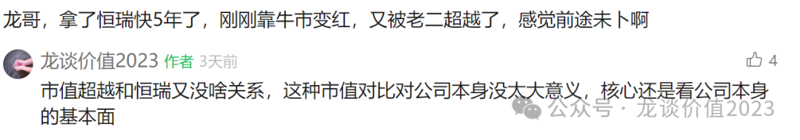
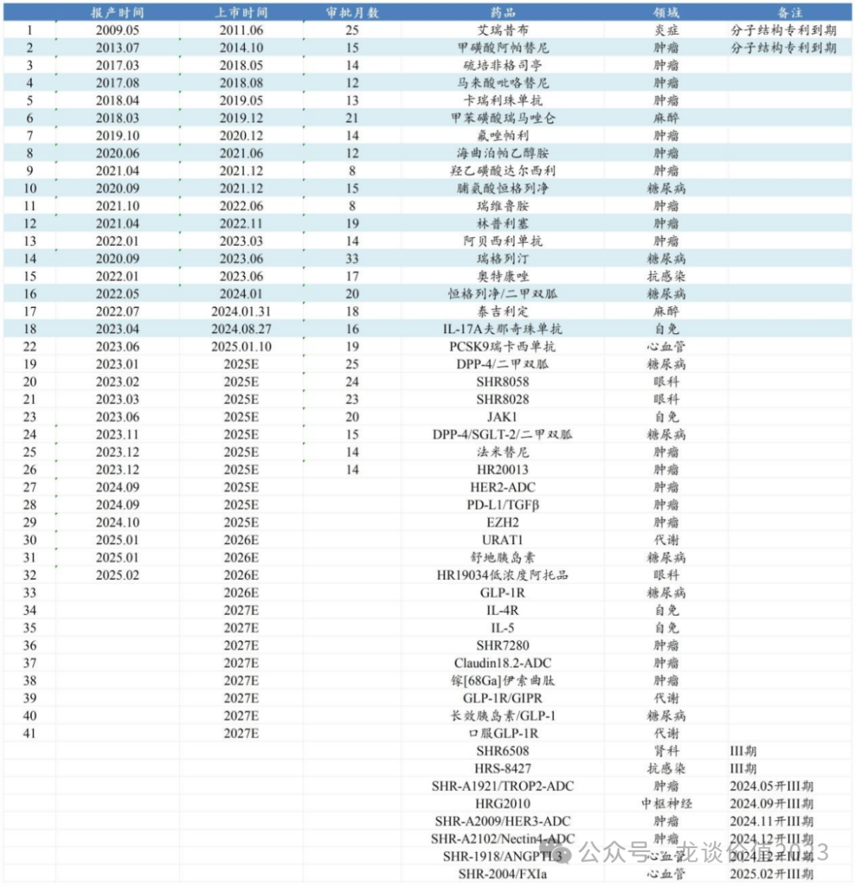
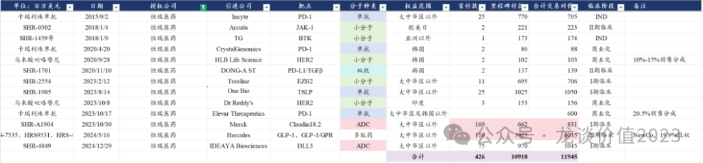
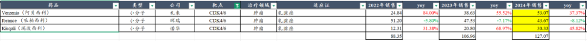

# 巨头黄昏还是黎明前的黑暗

大家好，我是龙哥。

文初提醒一下，最近有几位朋友和我吐槽，更新了几篇很不错的文章都没能及时看到，主要是微信推送公众号文章模式的问题，大家如果想要避免错过好文，可以把龙哥公众号加个星标：

恒瑞医药，在过去这么多年里，一直是国内医药行业创新药领域的高山，这座高山有多高呢，就恒瑞医药的创新药收入、创新药管线数量而言，至少未来5-10年，国内大概率看不到能和恒瑞掰掰手腕的传统药企，更不用说恒瑞还有一家“夫妻店”兄弟公司——在连云港与恒瑞医药仅有一墙之隔的翰森制药——同样是国内创新药pharma的高山之一。

但是，传统药企以外，在新兴的biopharma中，已经率先走出第一家——百济神州，不论在创新药收入、还是管线创新实力、亦或者是市值，均超越了恒瑞医药，上周五的文章专门讲了百济神州大超预期的24Q4业绩。

于是有些看好或持有恒瑞的读者就很焦虑，觉得市值被百济超越成为行业第二了，是不是就不行了？

虽然我们很看好百济神州今年的市值表现，但恒瑞是恒瑞，百济是百济，市值是市场交易的结果，市值被超越不代表基本面好或者不好，也不能单一的指引未来的发展潜力和股价潜力，因此本文我们来聊聊对恒瑞的一些观点更新。

1、创新药研发

首先我们来看恒瑞这些年在创新药领域干了什么：

截止到最新的日期，恒瑞医药合计有19个新药获批上市，还有13个新药处于申报上市阶段，合计是32个新药，另外还有17个新药处于III期临床阶段，这样恒瑞医药处于临床后期及商业化阶段的新药合计是49个，国内没有任何一家药企能望其项背。

质量不够、数量来凑......

由于绝大多数分子都是国内市场的fast follow，恒瑞医药已经算是研发效率还比较高的pharma，但也客观的面临竞争格局较差的问题。

或许大伙还能记得，18-21年那波恒瑞医药大象狂奔——2倍的股价涨幅，对应的是硫培非格司亭、吡咯替尼、卡瑞利珠单抗3个品种的商业化放量带来的收入加速，2021Q2开始收入大幅降速、利润下滑，股价于2021年1月见到历史高点。

2020年恒瑞医药277亿元的收入规模，时隔四年直到2024年预计营收在270亿元左右，仍未能跨越——即便恒瑞医药获批商业化的创新药数量已经从7个增加到18个，2024年恒瑞医药的创新药收入（含税）预计130亿-140亿元，同比增速在30%左右（23年增速仅有20%多），报表上的创新药收入占总收入比重仍不到50%，而相比之下表现较好的“夫妻店”——翰森制药，24年创新药收入占比预计在65%左右，25年预计会进一步提升到75%以上。

一边是创新药新品种的增量，另一边是硫培非格司亭、阿帕替尼、卡瑞利珠单抗等大品种的下滑压力，使得创新药数量的暴增并没有反映在收入的加速。

但值得注意的是，2018-2024年，恒瑞医药每年获批上市的新药数量分别是2个、2个、1个、3个、2个、3个、3个，而25-26年预计恒瑞医药可能会有15个左右创新药品种获批上市，27年预计还会有5-8个创新药获批上市。

不仅是数量，从质量来看，JAK1抑制剂、HER2-ADC、GLP-1/GIPR等品种的市场潜力要显著大于前两年上市的这些品种。考虑到医院准入、谈判进医保等时间，26-28年，大概率看到恒瑞医药创新药收入的显著加速。

2、仿制药集采

仿制药集采是恒瑞医药近几年持续的痛。

相较于华东医药、信立泰等传统仿制药公司只有少数1个或几个大品种，集采落地出清大概集中在那么1-2年的时间，恒瑞医药的仿制药大品种众多，从20年以来包括白紫、环磷酰胺、伊立替康、阿曲库铵、碘克沙醇、非布司他等一系列的仿制药大品种集采持续的影响着恒瑞医药的收入，而直到现在仍然有七氟烷、碘佛醇、布托啡诺等三个超10亿乃至超20亿的重点品种的集采尚未出清。

这也是为什么这些年恒瑞医药创新药总归是还能有20%-30%的增长、但总收入的增长始终承压。

以上三个重点品种，24年开始陆续受到一些省级集采的影响，但国采的影响毕竟尚未落地，还将在25-26年持续的拖累公司的业绩。恒瑞医药的集采出清，竟然整整拖了20年-26年这7年时间。

3、创新药出海

在上一篇文章《[中国创新药出海之王](https://mp.weixin.qq.com/s?__biz=MzkyMzQ3MDc3Mw==&mid=2247484173&idx=1&sn=52dcb6390d13960d7ec157efb9ec76f6&scene=21#wechat_redirect)》里我们介绍了中国创新药海外BD的头部公司，其中第一家介绍的就是恒瑞医药。

恒瑞医药累计13笔海外BD交易授权，超4亿美元首付款和近120亿美元交易对价，包括2款单抗、1款双抗、5款小分子、2款ADC以及1款多肽药物，其中有3笔交易发生在2018年及以前，3笔交易发生在2020年，7笔交易发生在2023-2024年。

恒瑞医药这家公司向来喜欢in house研发，因此从18-20年就陆续对外授权公司过去开发的一系列单抗和双抗分子，包括卡瑞利珠和吡咯替尼等恒瑞的代表作。

2021年，由于公司受到仿制药集采和创新药降价影响，收入端下滑的压力逐渐加大，公司开始寻求国内临床后期分子的license in。2021年公司进行了3笔license in，但都比较失败，一笔是引进大连万春的普那布林，最终没能成药，2亿首付款打水漂，另外两笔分别是引进天广实的MIL62（CD20单抗）和基石药业的CS1002（CTLA-4单抗），两个分子目前也都推的很慢，至今也均未进入III期临床。

2022年是恒瑞医药的至暗时刻，集采影响和创新药降价的影响导致收入当年下滑18%，同时公司砍团队、砍管线，内部调整幅度较大，2022年恒瑞医药既没有license in也没有license out。

2023年恒瑞医药业绩企稳重拾升势，在BD上也开始重新发力，2月-10月谈了5笔交易，尤其是10月一个月就谈成了3笔，将EZH2、TSLP、PARP1、PD-1、吡咯替尼在全球不同地区的权益对外授权，23年的5笔交易给恒瑞带来超过2亿美元的首付款和33亿美元的交易对价。

进入到2024年，恒瑞医药年中谈成GLP-1系列资产的60亿美元的deal，年底又谈成一个临床前的DLL3-ADC分子的授权，成果斐然。

23年以来恒瑞医药在创新药出海BD上的进展，就是中国创新药在23-24年海外BD突破性进展的缩影，是新药分子质量提升的表现，也是全球药企和投资人对中国新药开发能力的认可。

4、研发管线亮点

恒瑞医药的研发管线太过于庞大和复杂，如果要梳理下来可能一万字的文章都不够，这里只给大家聊几点我跟踪恒瑞多年来，这两年对恒瑞研发管线印象最深刻的地方或者说我最关注的地方，以上分析中已经提到的就不再复述了。

①CDK4/6：乳腺癌是全球最大的癌种之一，2023年全球新发乳腺癌患者高达240万人，其中中国新发乳腺癌患者超过36万人。乳腺癌患者中占比约60%左右的HR+/HER2患者，在新辅助治疗、辅助治疗、一线及二线治疗中可能用到CDK4/6抑制剂，可以说CDK4/6是乳腺癌中市场潜力最大的靶点之一，2024年全球3款CDK4/6抑制剂的销售额合计127亿美元，且仍在高速增长。

此前我们对恒瑞医药的CDK4/6抑制剂达尔西利的认识，一直是将其作为一个市场竞争力不算太强的哌柏西利的me too药物来看，而上个月23号恒瑞医药发布的达尔西利用于HR阳性乳腺癌辅助治疗III期临床达到主要终点，让我对其刮目相看。

这是一个5000人、持续4年的大III期，在2020年恒瑞医药启动该III期临床的时候我还认为该临床具有不小的风险，如此大规模、高成本、高难度的临床试验，恒瑞医药最终取得成功，是一个比较鼓舞人心的创新药行业性的事件。

②PD-L1/TGFβ：近5年，肿瘤免疫流的血和泪毕竟是太多了。对行业影响巨大的三个靶点，TIGIT、CD47、PD-L1/TGFβ都是曾经有一众药企倾注心血、投入巨额研发投入、期待成为继PD-1/L1后的下一代肿瘤免疫疗法的靶点，最终一一击碎大家的梦想。

如今，PD-L1/TGFβ几乎只剩恒瑞医药还在推进，恒瑞曾经也对这个分子充满期待，一度开了二线TKI耐药EGFRm NSCLC、一线胃癌、胃癌新辅助、一线肾癌、一线结直肠癌、一线宫颈癌等6大适应症的III期临床或者II/III期临床，最终几乎全部剁掉，只剩一个一线胃癌推进到商业化阶段。

胃癌一线IO+化疗除了PD-1以外，目前增加一个康方的AK104（PD-1/CTLA-4双抗）和25年预计增加恒瑞的SHR1701（PD-L1/TGFβ）两个品种都没有做与PD-1的头对头，最终卖的怎么样，就看实际临床使用效果和推广情况了。

③ADC分子：24年恒瑞医药ADC分子全面开始进入注册III期临床阶段，包括SHR-A1904（Claudin18.2-ADC）国内第三家进入III期临床（信达、康诺亚前二家），HER3-ADC国产第一家进入III期临床，Trop2-ADC国内第五家、国产第三家进入III期临床（博泰、诗健前二家），Nectin4-ADC国产第二家进入III期临床（迈威首家）。恒瑞夫妻店基本覆盖了当前多数成药确定性高的主流ADC靶点，并分工去做不同靶点。

④RGL-193：恒瑞医药在2024年7月申报了双基因AAV疗法RGL-193的临床申请，用于治疗帕金森，这是恒瑞医药对中枢神经领域创新疗法的一次探索，不再局限在过去以fast follow为主的靶点，且攻向失败风险极高、国内药企几乎无人问津的中枢神经创新疗法领域，当是让我刮目相看，也期待其后续临床进展。

......

很多读者对企业的判断，只想要一个结论——这公司还行不行？行或者不行？

但对一个企业的评估是如此的复杂，尤其是对恒瑞这样管线极其复杂和庞大的企业。但即便再复杂的企业，也有一个基本的框架去判断其业绩趋势，恒瑞已经低迷了4年，加上今年是第5年，26年终将有机会迎来曙光，看到收入和利润端的显著加速。

......

近期重点文章（可直接点击下列链接查看）：

《[中国创新药出海之王](https://mp.weixin.qq.com/s?__biz=MzkyMzQ3MDc3Mw==&mid=2247484173&idx=1&sn=52dcb6390d13960d7ec157efb9ec76f6&scene=21#wechat_redirect)》

《[创新药巨头狂飙](https://mp.weixin.qq.com/s?__biz=MzkyMzQ3MDc3Mw==&mid=2247484144&idx=1&sn=0b26f935e3f7a1a6248b091a6c0ec916&scene=21#wechat_redirect)》

《[最全ETF梳理](https://mp.weixin.qq.com/s?__biz=MzkyMzQ3MDc3Mw==&mid=2247484135&idx=1&sn=2a8555f0200922f90e82d51562574545&scene=21#wechat_redirect)》

《[生物科技的狂欢](https://mp.weixin.qq.com/s?__biz=MzkyMzQ3MDc3Mw==&mid=2247484124&idx=1&sn=233fb7eda9c948a508908c6a66a6a4d0&scene=21#wechat_redirect)》

《[两个资产配置的重点方向](https://mp.weixin.qq.com/s?__biz=MzkyMzQ3MDc3Mw==&mid=2247484114&idx=1&sn=9d862ed9cfbfe39f4608466e3943f3e8&scene=21#wechat_redirect)》

《[医药行业趋势展望](https://mp.weixin.qq.com/s?__biz=MzkyMzQ3MDc3Mw==&mid=2247484101&idx=1&sn=febb0b581f3311f2fb2477ef02efdb50&scene=21#wechat_redirect)》

《[医疗AI大爆发](https://mp.weixin.qq.com/s?__biz=MzkyMzQ3MDc3Mw==&mid=2247484088&idx=1&sn=e2ebcdb46098eb9eda92d51b0c6d76bc&scene=21#wechat_redirect)》

《[全球顶级大品种](https://mp.weixin.qq.com/s?__biz=MzkyMzQ3MDc3Mw==&mid=2247484077&idx=1&sn=fd9b368f99a395862f03dd9f6be342b3&scene=21#wechat_redirect)》

《[非典型利空](https://mp.weixin.qq.com/s?__biz=MzkyMzQ3MDc3Mw==&mid=2247484042&idx=1&sn=7f0001decb5fca1b658ec50e1c995893&scene=21#wechat_redirect)》

《[中国医药历史性事件](https://mp.weixin.qq.com/s?__biz=MzkyMzQ3MDc3Mw==&mid=2247484024&idx=1&sn=4d42f6d88e255b20f426271c9be37b88&scene=21#wechat_redirect)》

《[最重要行业拐点](https://mp.weixin.qq.com/s?__biz=MzkyMzQ3MDc3Mw==&mid=2247483961&idx=1&sn=a6c753e24d874e551a8d2eebbfb515dd&scene=21#wechat_redirect)》

风险提示：本文仅讨论行业/公司经营情况，投资需综合考虑公司经营、估值、管理层等多方面因素，建议读者审慎参考，本文不作为投资依据，不建议大家根据本文做出投资计划。

<!-- wxmp-comments-begin -->

---

## 留言（13 条，含回复共 28 条）

- **思远笃行** 👍16 · 2025-03-05 17:29
  功底深厚[强][强][强]
  - ↳ **作者** · 2025-03-05 17:42
    [抱拳][抱拳][抱拳]
- **黄磊** 👍15 · 2025-03-05 17:41
  我们的龙哥又回来了！最喜欢龙哥逐公司的分析！！
  [抱拳][抱拳][抱拳]
  - ↳ **作者** · 2025-03-05 17:43
    [加油][加油]毕竟恒瑞是从入行以来跟了这么多年的公司
- **周泽洋** 👍6 · 2025-03-05 18:05
  龙哥客观[强]
- **书意万重** 👍3 · 2025-03-05 17:26
  龙哥，啥时谈谈迈瑞，迫切需要靠一下[大哭]
  - ↳ **作者** · 2025-03-05 17:28
    迈瑞估计要到出年报写点评了，25q1估计还是会有些压力。
  - ↳ **作者** · 2025-03-05 17:47
    他之前渠道库存有点高，之前说消化渠道库存要到Q1，所以招标数据到确认报表的收入会有点差别吧。
- **caoguoan** 👍1 · 2025-03-05 17:38
  龙哥，可以写一下贝达吗？
  - ↳ **作者** · 2025-03-05 17:42
    可以，我给排上，大家想看的公司我挨个写[加油]
- **JMTerry** 👍1 · 2025-03-05 17:53
  龙哥最近输出火力很猛啊
  - ↳ **作者** · 2025-03-05 18:00
    上一轮医药牛市是每周四篇，周一周二周四周日，现在是周一周三周五三篇，够看了嘛
  - ↳ **作者** · 2025-03-05 18:16
    每天都写对应的可能是文章质量下降，很多口水文和市场常规点评，所以......
- **Michel Wang** 👍1 · 2025-03-05 17:57
  龙哥，我看你写信达写的比较少，是不是不太看好呢？
  - ↳ **作者** · 2025-03-05 17:58
    也没有很少，以前是常写到信达的，但信达生物24年确实缺少股价上涨的驱动力，而且又有生物类似药集采和之前管理层道德问题的压制，所以这阵子就没咋提。但既然你提到了，刚好说一句，下一篇文章就会写到信达生物，记得来看。
- **求索者** 👍1 · 2025-03-05 18:08
  恒瑞缺的是能出海的重磅分子，不然在创新药领域不行，前年被人赚大差价那事也说明恒瑞对创新药的认知还差太远。
  - ↳ **作者** · 2025-03-05 18:17
    TSLP的那笔BD，肯定是要被钉在耻辱柱上的，他们对这个分子的价值认知不足，BD人员更是有很大的问题
- **灵感自在** 👍1 · 2025-03-05 18:32
  龙大什么时候安排一下艾德，总觉得伴随诊断也是非常受益于创新药大发展的，也不走医保，竞争格局也好
  - ↳ **作者** · 2025-03-05 18:44
    总归未来都是纳入DRGs管理的，这种常规治疗刚需的严肃医疗产品，不走医保并不一定是好事，未来也随着竞品也会增加，不能排除集采的可能性吧。
- **林华平18858103080** 👍1 · 2025-03-06 01:35
  弄大，恒瑞股价一直不给力，是不是估值太高了还是有别的原因？
  - ↳ **作者** · 2025-03-06 14:07
    所以我这篇文章在写啥[捂脸]
- **路远** 👍1 · 2025-03-06 05:39
  龙哥，可以写一下金域医学吗？AI医疗会长远吗
  - ↳ **作者** · 2025-03-06 14:06
    AI对医疗行业的影响必然是已经开始出现、并且必然会有长远的影响，但你要说马上兑现业绩也不会那么快，所以行情必然是会反复和波折的。
- **翰林** · 2025-03-05 18:36
  龙哥，华东、信立泰的股价也不给力，是不是仿制药还没出清压制？
  - ↳ **作者** · 2025-03-05 18:40
    仿制药集采是出清了，新产品不够给力，估值又一直偏高，华东是之前医美业务撑着估值，这两年医美受消费环境影响很大，信立泰有一批忠实粉丝非常看好心血管慢病管线，估值也一直顶着。
- **夏延** · 2025-03-06 13:52
  龙哥，A1811用于既往接受过至少一种系统治疗的局部晚期或转移性HER2突变成人非小细胞肺癌，应该今年能上市吧
  - ↳ **作者** · 2025-03-06 14:05
    嗯，恒瑞A1811的第一个适应症HER2+ NSCLC是比较有机会今年上市的。
  - ↳ **作者** · 2025-03-06 14:07
    谢谢，看了你的公众号很久了，很大收获，创新药研究道阻且长，行业这几年alpha不景气，能坚持下来都是热爱，期待你更多的新鲜观点，祝顺利

<!-- wxmp-comments-end -->
