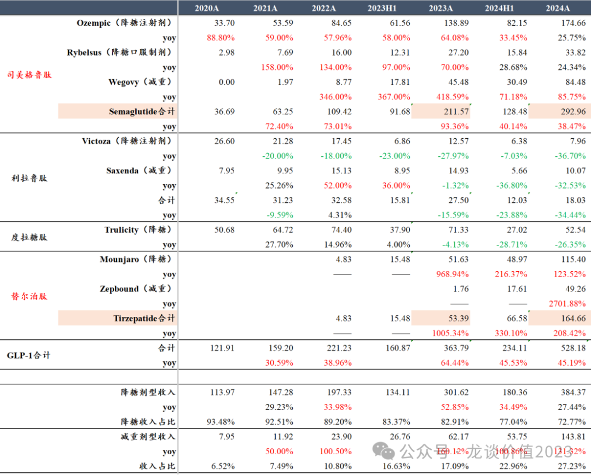
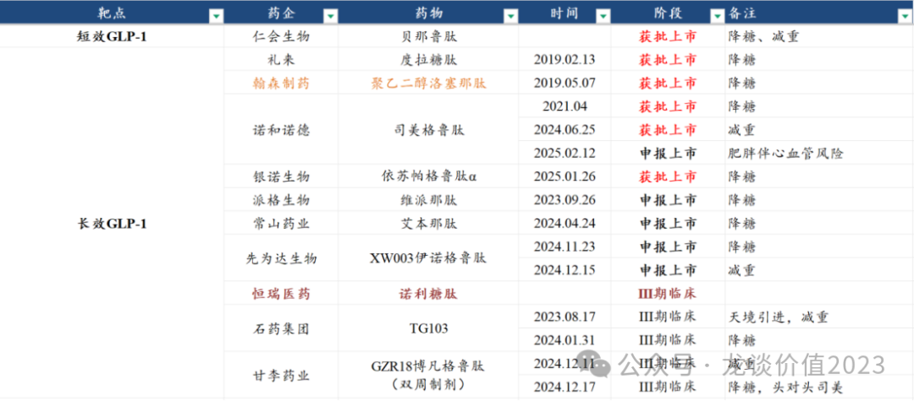
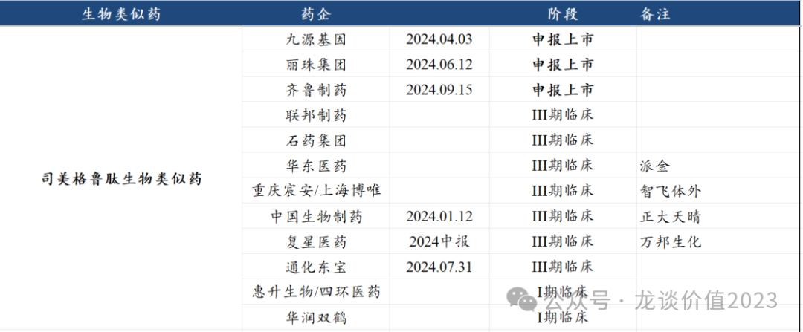
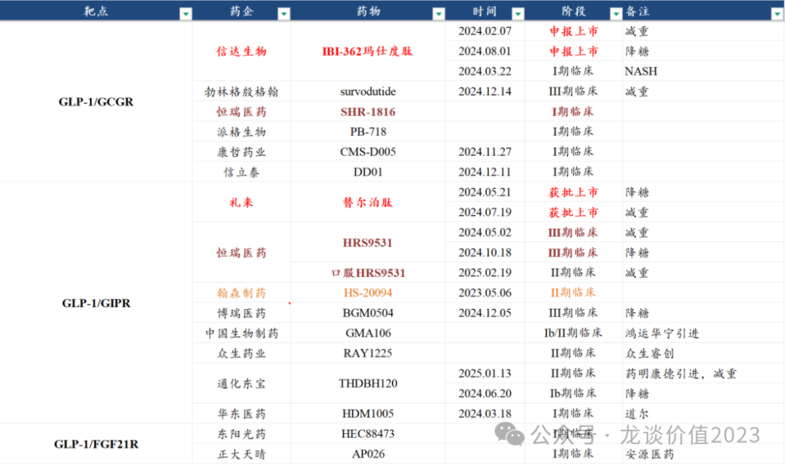
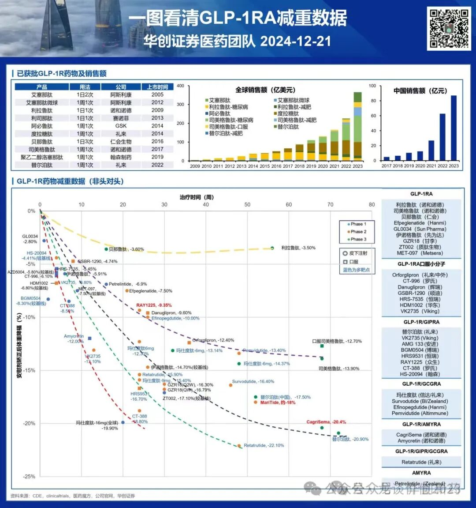
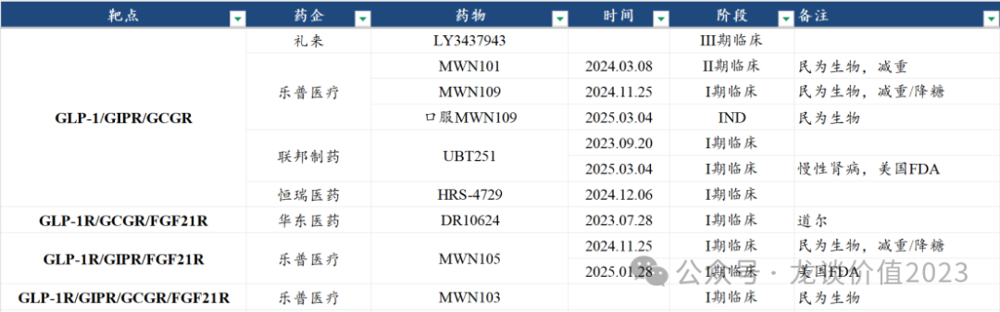
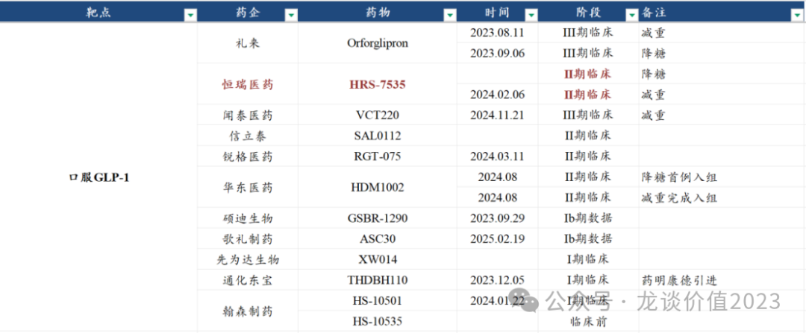
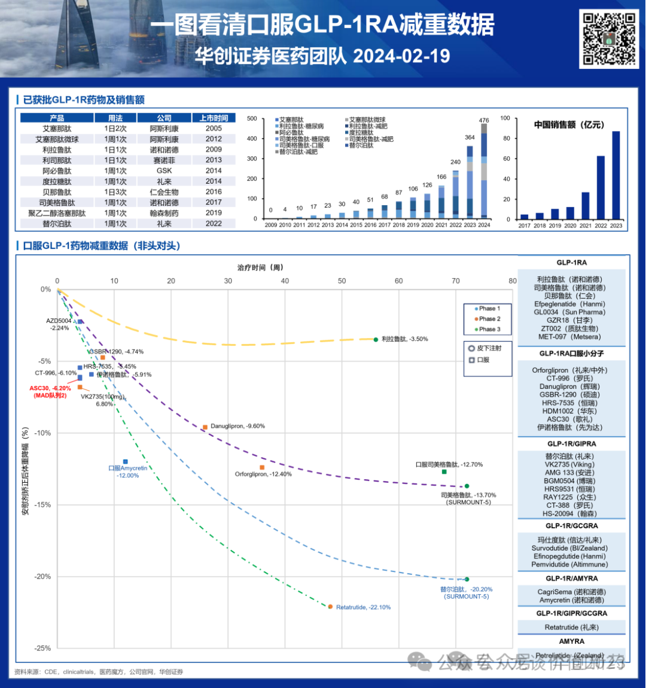
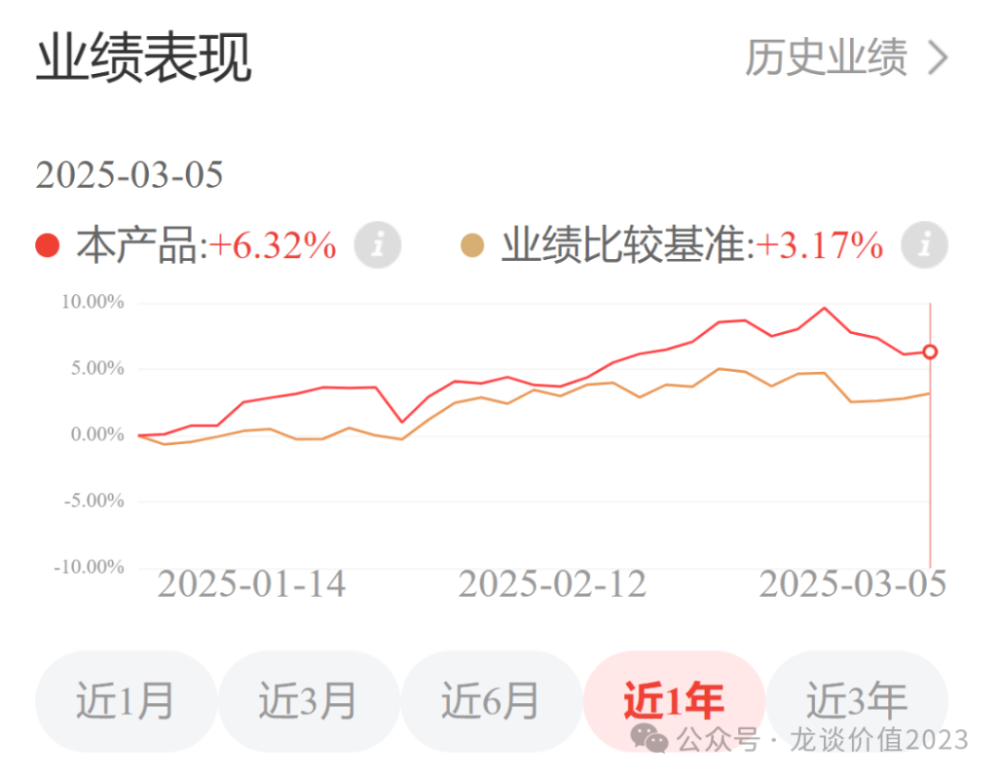
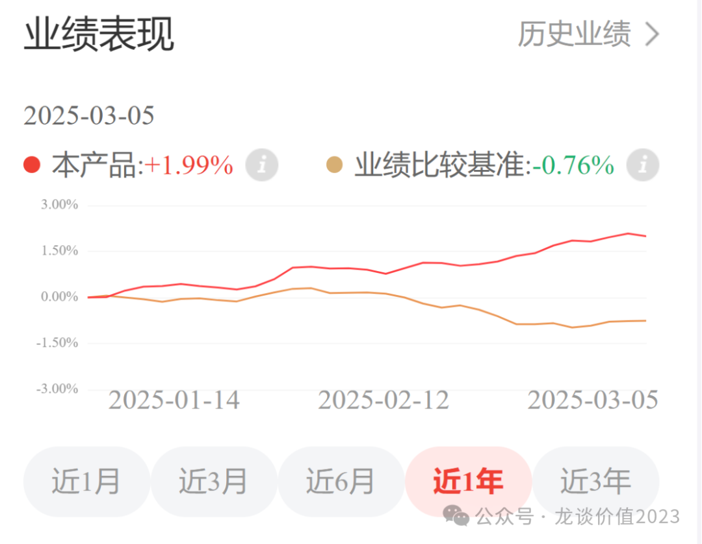

# 药王竞争白热化

大家好，我是龙哥。

文初提醒一下，最近有几位朋友和我吐槽，更新了几篇很不错的文章都没能及时看到，主要是微信推送公众号文章模式的问题，大家如果想要避免错过好文，可以把龙哥公众号加个星标：

说到药王，不管是否关注医药的投资人和读者，应该都知道这两年国内外火了一个“减肥神药”——司美格鲁肽，带火了整个全球及国内的GLP-1激动剂领域的研发和投资。在首个信达/礼来的国产GLP-1/GCGR双靶激动剂临近上市之际（预计二季度），也再给大家梳理一下减重药的市场竞争格局。

首先我们从全球市场看GLP-1系列产品的销售有多火呢，2024年诺和诺德和礼来的四款GLP-1单靶点及双靶点激动剂的全球销售额是528.18亿美元，按人民币兑美元汇率7.2计算是3800亿元。

没错，你没看错，国内通常单品种销售额30-50亿就要被医保局重点监控，海外4款GLP-1类产品一年卖了接近4000亿，更恐怖的是这么大体量下还有45%的增长速度。

以上四款产品中，销售额的增长来自长效GLP-1周制剂司美格鲁肽和长效GLP-1R/GIPR双靶点激动剂替尔泊肽，两款产品2024年分别销售293亿美元+38%和165亿美元+208%，2017年上市的司美格鲁肽预计将在2025年正式超越2014年上市的帕博利珠单抗而登顶全球药王。

更离谱的是替尔泊肽，2022年上市的替尔泊肽，仅上市不到3年，就在24年实现165亿美元的销售额，这在几年前全球一共只有两三个百亿品种的时候是难以想象的。

2025年替尔泊肽可能会继续创造奇迹，挑战250亿-300亿美元销售额——礼来对25年的总收入指引是580亿-610亿美元，相较2024年的收入450亿美元增长130亿-160亿美元，要知道礼来销售额52.5亿美元的度拉糖肽还会有不小幅度的下滑，除了阿贝西利以外增长的绝大部分都将来自替尔泊肽......

国内市场，竞争格局远差于海外。

恭喜各位读者未来都能用上低价的GLP-1，但对我们投资来说，情况就变得复杂的多了。

本文简单梳理下国内GLP-1领域目前的竞争格局。

1、单靶点GLP-1激动剂

所有单靶点的GLP-1，都将正面面对司美格鲁肽的竞争，预计未来都很难有大的市场潜力，除了上市时间较早的翰森制药的聚乙二醇洛塞那肽还卖出了一定体量以外，后面的几家预计都不会有太大的机会。

司美格鲁肽国内的专利在2026年即将到期，司美格鲁肽本身已经是单靶点GLP-1激动剂的巅峰之作，在一系列国产生物类似药上市后预计价格又将下降比较多，这就意味着该领域的厮杀对于新的创新药来说是极其艰难的——既要在价格上和司美的低价生物类似药竞争，又要在司美品牌力已经很强的情况下去投入市场营销费用推广产品。

因此以上单靶点GLP-1中未来唯一还可关注的就是甘李的GZR18双周制剂，算是和司美格鲁肽还能有差异化竞争的产品，最终也还要看头对头司美的临床数据。

司美格鲁肽的生物类似药方面，前三家已经申报上市，包括港股新上市的小biotech九源基因，还有传统药企丽珠集团（后面也会单独写一篇聊聊），以及国内生物类似药巨头齐鲁制药，后续还有近10家公司在III期临床阶段。如果参考贝伐珠单抗的情况，先上市的2-3家有望分到最大的市场份额，后续的公司则可能只能喝喝汤。

2、双靶点GLP-1激动剂

双靶点是未来几年GLP-1系列产品竞争的主战场。

GLP-1双靶在减重疗效数据上显著好于司美格鲁肽在内的单靶点GLP-1激动剂。

首家双靶点礼来的替尔泊肽已经在去年5月在国内获批上市降糖适应症、7月获批减重适应症，后续还有持续的适应症拓展。

国产首家双靶点是信达生物的玛仕度肽——已经在去年2月递交上市申请——这同样是一款礼来开发的分子、授权给信达生物国内权益，玛仕度肽将在25年启动国内的商业化，未来2年国内将是替尔泊肽和玛仕度肽竞技的市场。

原本想在这里展开介绍一下信达生物，但写着写着篇幅太长了，只好放到下一篇文章里单独介绍，这篇文章还是主要给大家汇总梳理GLP-1相关的公司。

除了信达生物以外，国内GLP-1双靶点进展最快的是恒瑞医药和博瑞医药，两家公司在2024年先后已经启动双靶点激动剂的III期临床，另外恒瑞医药除了皮下注射HRS9531（GLP-1/GIPR））以外，还开发了口服的HRS9531，已经首家推进到II期临床。

双靶点的竞争在疗效上想要比替尔泊肽更进一步有显著的优效是有比较大的难度的，加剂量大力出奇迹也未必获得好的效果——减重药的安全性也是至关重要的。因此要么是拼速度——不能比替尔泊肽和玛仕度肽落后太多，要么是需要有其他差异化竞争的优势——长效给药、安全性更优等。

双靶点激动剂中另一家比较有特色的，是众生药业的RAY1225——GLP-1/GIPR双靶点双周制剂，类似甘李的GLP-1R，都是每两周给药一次，给药间隔延长一倍，差异化的竞品使得其即便进度落后一些也有差异化竞争的能力，在全球市场来看也会有BD的潜力。

另外全球市场来看安进的GLP-1/GIPR融合蛋白启动了首个III期临床用于减重适应症，这款大分子的融合蛋白可以实现每月给药一次的超长给药间隔。

3、三靶点GLP-1激动剂

三靶点GLP-1激动剂，领军企业依然是礼来，其目前有近10个全球III期临床正在推进中，将是替尔泊肽之后的下一个迭代产品，减重效果更好，48周平均减重超22%，但后续还要关注III期临床的安全性数据。

国内市场，三靶点及四靶点GLP-1激动剂是乐普医疗/民为生物的舞台，其基本是做排列组合的方式把能做的4个靶点排列组合做了一遍，主打一个大力出奇迹。

除此以外还有联邦医药、恒瑞医药、华东医药有所布局。

目前礼来GLP-1双靶点激动剂高剂量组的减重效果已经可以达到一年左右减重20%+，仅从减重效果来说已经是比较“够用”的水平，未来减重药的开发除了在疗效上的提升外，更重要的应该是延长给药间隔、提高安全性、减重增肌、开发口服制剂等方向，继续拓展靶点数量不能说没有效果，只是在临床上的获益还要综合评估。

4、口服小分子GLP-1

长效GLP-1的给药间隔是每周一次皮下注射，即便现在如甘李、众生等开发双周制剂，依然是无法避免需要皮下注射，对于一部分恐针的患者来说，依然会对口服制剂的需求，哪怕口服制剂需要每天口服用药。

口服GLP-1除了司美格鲁肽和利拉鲁肽以外的临床数据都还不太成熟，口服司美的减重效率略弱于皮下注射司美，后续开发的口服GLP-1数据波动还比较大，其中表现较好的如歌礼制药的Ib期临床2个队列的数据展示较好的早期效果，但数据量确实还太少，还需要更多数据的支撑。

从文初GLP-1销量的统计来看，口服司美的销量与皮下注射司美的差距还是相当大的，预计未来口服GLP-1减重药也更多是作为皮下注射制剂的补充，很难占据主流市场。

5、减重增肌药物

为什么要有减重增肌的需求呢，因为我们看司美格鲁肽的减重效果中，减掉的体重中有40%是减掉的肌肉、60%是脂肪，而一旦停药、且恢复过去的饮食习惯后很容易出现复胖，复胖长回来的体重绝大多数都是脂肪。

因此会导致，使用司美→停药→复胖这个过程一旦出现，可能导致停药后的身体健康状况更差。因此减重药下一步的开发的确可能会考虑减脂的同时尽量多的保留肌肉，哪怕最终体重下降效果没那么好，最终长期临床价值可能会更高。

国内目前做减重增肌药物的主要是2家公司，分别是来凯医药（LAE102，靶向ActRIIA）、歌礼制药（ASC47，靶向THRβ），可以期待后续两家的临床数据，另外也陆续开始有大药企和小biotech公司开始跟进ActRIIA等靶点。

......

另外再提一下我自己在持续定投的两个组合，在文章《[两个资产配置的重点方向](https://mp.weixin.qq.com/s?__biz=MzkyMzQ3MDc3Mw==&mid=2247484114&idx=1&sn=9d862ed9cfbfe39f4608466e3943f3e8&scene=21#wechat_redirect)》里有详细的介绍。

第一个组合是50%的AH医药+50%的美股科技的组合，这个行业搭配以及对应基金的配置是管理人比较巧妙的考虑，可以同时满足投资人想要配置A股医药、港股医药、美股科技的需求。

大家也知道最近美股科技股回调了不少，尤其是七巨头除了Meta以外今年都有下跌，跌幅最大的特斯拉甚至2个多月就跌了30%。

但通过在AH医药的敞口做到了净值依然为正，且能做到持续显著跑赢业绩基准的A股宽基指数。

同时大家今年看着医药这边个股比较热闹，实际上A股医药指数的涨幅仅有两三个点，很多主要投A股医药的投资人看着医药行情热闹却没赚到钱，因此该组合也可以满足配置港股医药的需求。

第二个组合是美元债的组合，这个相信不用我再过多介绍，2个月的时间做了2%的收益率，要知道这是一个固收产品组合，而同期国内的业绩基准则是-0.76%，国内国债收益率已经低到比较极致，因此近期有所反弹。美元债目前年化4.5%的基础利率+未来降息预期带来的上涨空间，从各位读者资产配置中固收资产配置的角度，不失为一个好的选择。

.......

近期重点文章（可直接点击下列链接查看）：

《[黎明前的黑暗](https://mp.weixin.qq.com/s?__biz=MzkyMzQ3MDc3Mw==&mid=2247484184&idx=1&sn=55ec711da3240320949b76ae746cc139&scene=21#wechat_redirect)》

《[中国创新药出海之王](https://mp.weixin.qq.com/s?__biz=MzkyMzQ3MDc3Mw==&mid=2247484173&idx=1&sn=52dcb6390d13960d7ec157efb9ec76f6&scene=21#wechat_redirect)》

《[创新药巨头狂飙](https://mp.weixin.qq.com/s?__biz=MzkyMzQ3MDc3Mw==&mid=2247484144&idx=1&sn=0b26f935e3f7a1a6248b091a6c0ec916&scene=21#wechat_redirect)》

《[最全ETF梳理](https://mp.weixin.qq.com/s?__biz=MzkyMzQ3MDc3Mw==&mid=2247484135&idx=1&sn=2a8555f0200922f90e82d51562574545&scene=21#wechat_redirect)》

《[生物科技的狂欢](https://mp.weixin.qq.com/s?__biz=MzkyMzQ3MDc3Mw==&mid=2247484124&idx=1&sn=233fb7eda9c948a508908c6a66a6a4d0&scene=21#wechat_redirect)》

《[两个资产配置的重点方向](https://mp.weixin.qq.com/s?__biz=MzkyMzQ3MDc3Mw==&mid=2247484114&idx=1&sn=9d862ed9cfbfe39f4608466e3943f3e8&scene=21#wechat_redirect)》

《[医药行业趋势展望](https://mp.weixin.qq.com/s?__biz=MzkyMzQ3MDc3Mw==&mid=2247484101&idx=1&sn=febb0b581f3311f2fb2477ef02efdb50&scene=21#wechat_redirect)》

《[医疗AI大爆发](https://mp.weixin.qq.com/s?__biz=MzkyMzQ3MDc3Mw==&mid=2247484088&idx=1&sn=e2ebcdb46098eb9eda92d51b0c6d76bc&scene=21#wechat_redirect)》

《[全球顶级大品种](https://mp.weixin.qq.com/s?__biz=MzkyMzQ3MDc3Mw==&mid=2247484077&idx=1&sn=fd9b368f99a395862f03dd9f6be342b3&scene=21#wechat_redirect)》

《[非典型利空](https://mp.weixin.qq.com/s?__biz=MzkyMzQ3MDc3Mw==&mid=2247484042&idx=1&sn=7f0001decb5fca1b658ec50e1c995893&scene=21#wechat_redirect)》

《[中国医药历史性事件](https://mp.weixin.qq.com/s?__biz=MzkyMzQ3MDc3Mw==&mid=2247484024&idx=1&sn=4d42f6d88e255b20f426271c9be37b88&scene=21#wechat_redirect)》

《[最重要行业拐点](https://mp.weixin.qq.com/s?__biz=MzkyMzQ3MDc3Mw==&mid=2247483961&idx=1&sn=a6c753e24d874e551a8d2eebbfb515dd&scene=21#wechat_redirect)》

风险提示：本文仅讨论行业/公司经营情况，投资需综合考虑公司经营、估值、管理层等多方面因素，建议读者审慎参考，本文不作为投资依据，不建议大家根据本文做出投资计划。

<!-- wxmp-comments-begin -->

---

## 留言（15 条，含回复共 31 条）

- **山水生** 👍2 · 2025-03-07 09:15
  普利制药怎么样？也是减肥药吧
  - ↳ **作者** · 2025-03-07 09:19
    这公司不是财务造假吗[尴尬][尴尬][尴尬]
- **美克眼镜视光顾问** 👍2 · 2025-03-07 09:26
  龙哥早就想上车你的产品，但门槛不够，京东金融还要下载个app才能买么，有没有其他平台
  - ↳ **作者** · 2025-03-07 09:32
    下载个京东金融这种正规大平台的APP来跟投挺好的啊，或者不想下载的话在微信小程序也可以，之前我是在天天基金和京东等几个大平台里选一个，选京东主要是他们还能给读者一些福利比如理财黑卡啥的。
    另外我选的产品我自己也投，所以起码要在平台的安全性上让大家放心吧。
- **MEPHISTO** 👍1 · 2025-03-07 08:39
  哥，华东给捎带指点两句？
  - ↳ **作者** · 2025-03-07 09:10
    百令不出大问题的话，这几年应该还是可以平稳增长，目前也看不到啥大的业绩弹性，但陆续也能有一些增量品种出来。
- **CasperTree** 👍1 · 2025-03-07 08:51
  常山药业怎么样呢
  - ↳ **作者** · 2025-03-07 09:09
    股性挺好的，每次炒减肥药主题都能炒到他，但后面的业绩兑现嘛，参照文章第一条的内容。毕竟当年说4亿中国男人ED的也是这位，历史上一直爱蹭概念主题。
- **丁山** 👍1 · 2025-03-07 08:54
  开始建仓了龙哥推荐的2个组合，后续会持续加仓，希望跟着龙哥再走一轮牛市。另外，上次龙哥梳理的几十个医药ETF，哪几个ETF适合定投呢？
  - ↳ **作者** · 2025-03-07 09:13
    ETF是工具，他不像我在这个文章里的组合就是我自己本身在定投的。所以给大家梳理ETF工具，核心是让大家可以根据各个ETF的特点，选适合自己的品种。如果你让我再具体的说，那就是看你主要是想综合配置整个医药行业还是主要投哪些细分，比如你很看好创新药这个细分，那就从创新药ETF里选，如果你对细分行业的研究也不深，只是想配置医药行业，那就从AH的医药指数ETF里选。
- **水木二师兄** 👍1 · 2025-03-07 08:54
  龙大，来凯医药的减肥药前景如何
  - ↳ **作者** · 2025-03-07 09:14
    要根据临床数据边走边看，如果现在展示的临床前的表现能在上人体的临床试验中持续兑现，那未来市场潜力必然是不可限量的，目前来凯也在和礼来合作做联合的临床探索。
- **无眠** 👍1 · 2025-03-07 08:56
  老师说的甘李，是不是甘李医药？
  - ↳ **作者** · 2025-03-07 09:15
    甘李药业
- **一一得一** 👍1 · 2025-03-07 09:07
  都说信达的药是礼来剩下来的渣渣[破涕为笑]
  - ↳ **作者** · 2025-03-07 09:18
    也说不上是剩下的渣渣，毕竟礼来看到信达的一系列临床数据以后也在海外又开起来玛仕度肽的II期临床。从目前减重的效果来看6mg剂量组的减重数据确实不如替尔泊肽，所以信达就继续加剂量做高剂量组想要大力出奇迹，另外GCGR靶点还是有可能在MASH上更具潜力的。
- **张洪亮** 👍1 · 2025-03-07 09:10
  不在有600元限制了吗？
  - ↳ **作者** · 2025-03-07 09:19
    这周调完，你可以再看一下，美股基金确实很容易限额，一个基金限额就导致整个组合限额
- **禁止的鱼** 👍1 · 2025-03-07 09:23
  龙哥，请教一下，II期临床项目期中分析数据读出后可以给估值吗？如果市场到给II项目估值，是不是反映整体估值偏高了
  - ↳ **作者** · 2025-03-07 09:35
    II期好的数据也可以给点估值，也不是肯定就估值高了，上一轮医药牛市级的创新药估值泡沫，比较显著的是从I期项目就按药物成功来拍估值，最近倒是某些个别公司的小作文又开始这样写了。。。但大多数还谈不上估值泡沫吧，大多还是主要按3期项目估值的。。
- **刘浪** 👍1 · 2025-03-07 09:24
  龙大，说说健帆生物，最近走势咋的跟不上大盘。
  - ↳ **作者** · 2025-03-07 09:42
    健帆生物他们自己掌控发货节奏调控季度收入，我不太敢搞，除非是核心圈子的，不然有点与狼共舞的感觉。
- **wjl** 👍1 · 2025-03-07 09:34
  龙哥，京东健康的业绩和观点点评一下呗
  - ↳ **作者** · 2025-03-07 09:41
    业绩符合预期吧，我原本预计的Q4收入165亿，实际165.14亿，利润要略高于预期，业务结构变化导致毛利率有提升。现金流依然很不错，截止24年底在手现金接近600亿元了。
    这公司就是估值下有底，估值弹性不会那么大，要是能回调幅度大点也可以多看看。今天大跌我感觉是不是前两天有资金搏业绩，今天兑现了？
- **俏皮的货船** 👍1 · 2025-03-07 09:42
  龙哥上午好。最近真是高产啊，不用以前那样期待中才能盼来一篇，现在只需等待就好了[色]这么高产，看来吃药的行情真的来了！谢谢！
  - ↳ **作者** · 2025-03-07 09:43
    [呲牙][呲牙]
- **简** 👍1 · 2025-03-07 09:53
  龙哥，人工智能对制药来说有没有巨大发展，这里面逻辑大概是怎样，可否专门说说。这医药股一直不涨啊
  - ↳ **作者** · 2025-03-07 09:57
    AI制药对新药开发的效率提升肯定是有帮助的，对CXO公司的降本增效也是有帮助的，只是毕竟现在新药开发还是无法跳过人体临床试验，那就意味着能节约的时间在整个新药开发的10年纬度的周期里还是相对局限。
  - ↳ **作者** · 2025-03-07 09:57
    另外前面有篇文章梳理了AI医疗。
- **Be Better** 👍1 · 2025-03-07 11:13
  龙哥不是说这篇写石药么[坏笑][坏笑][坏笑]
  - ↳ **作者** · 2025-03-07 11:16
    石药和丽珠在排队，下一篇信达，要再往后排，大家需求挨个满足[破涕为笑][破涕为笑]

<!-- wxmp-comments-end -->
