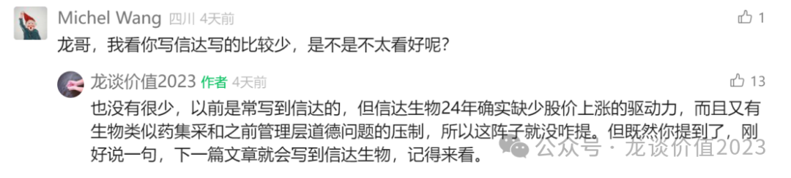
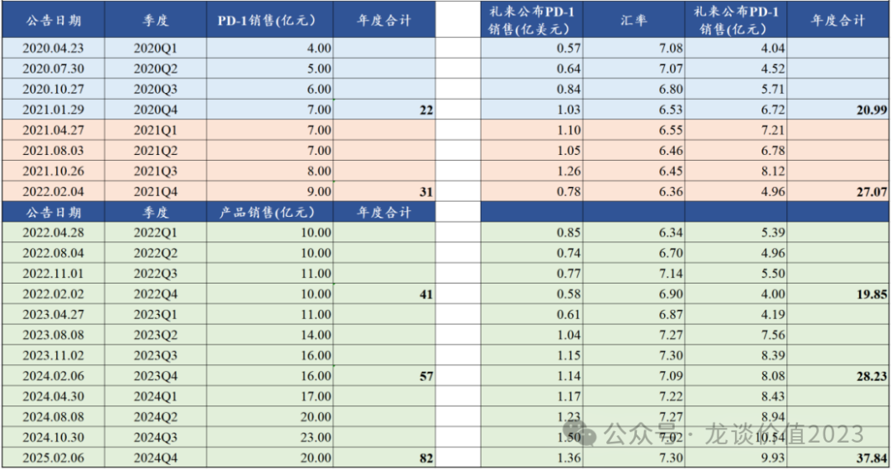
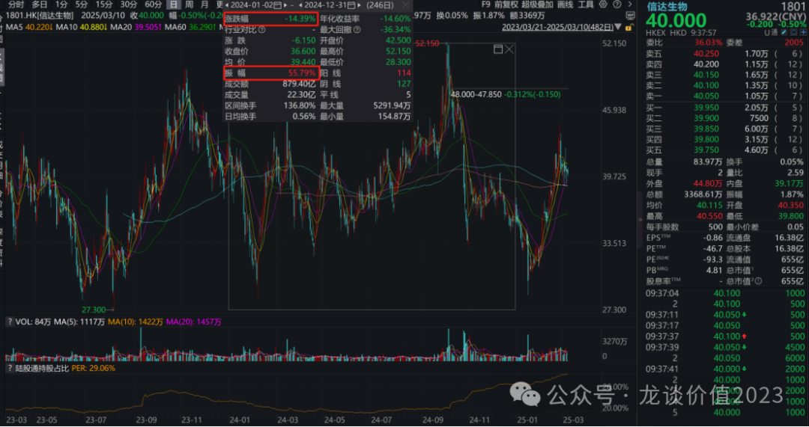
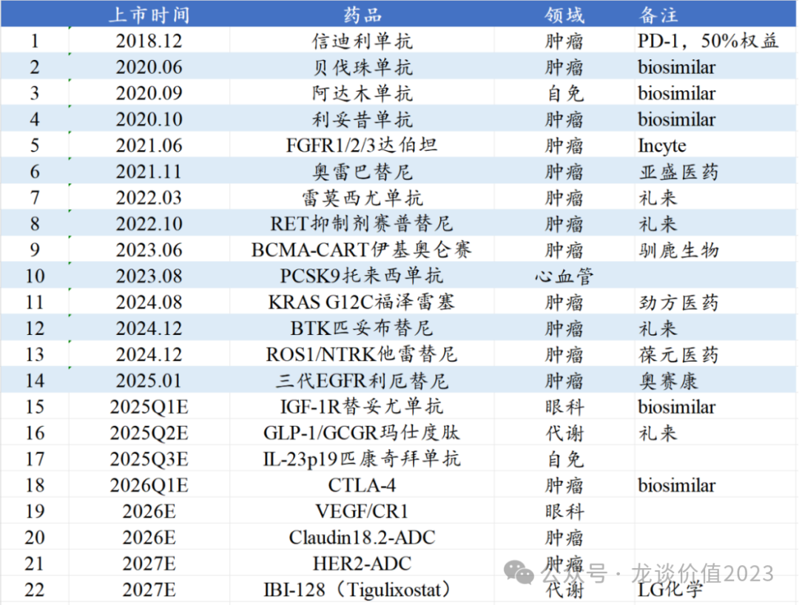
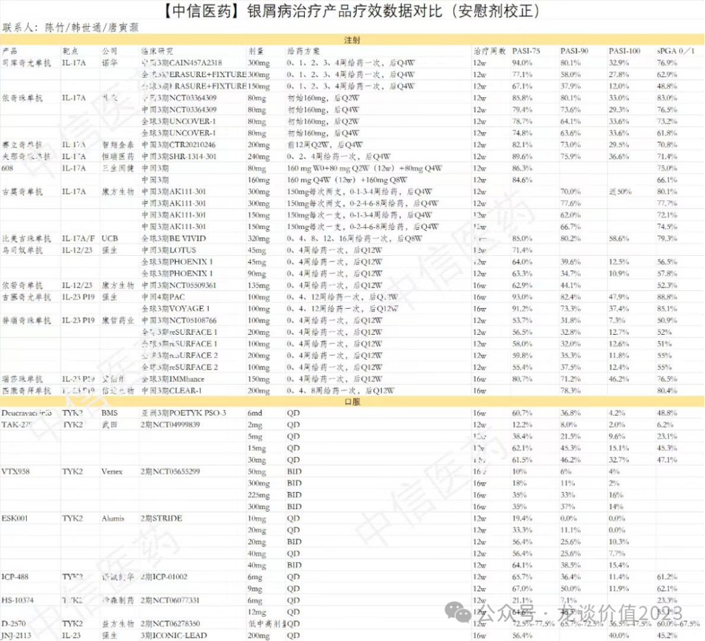
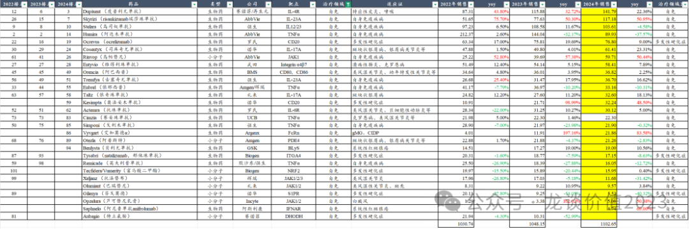
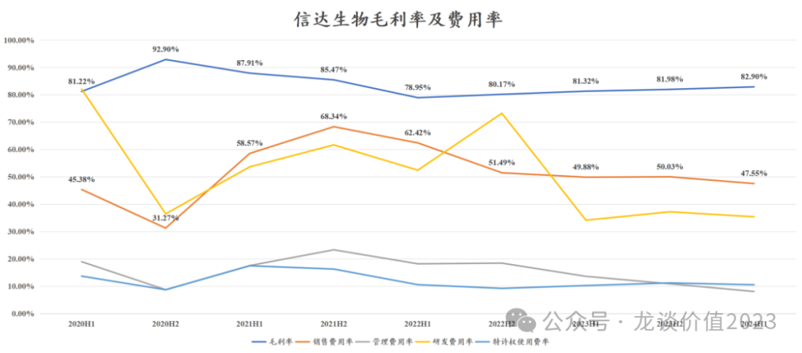

# 生物药龙头关键年

大家好，我是龙哥。

上周三的文章里，有读者问到为什么写信达生物写的比较少，是不是不太好看，实际上我曾经是经常写信达生物的，但24年确实写的比较少，在文章《[最重要行业拐点](https://mp.weixin.qq.com/s?__biz=MzkyMzQ3MDc3Mw==&mid=2247483961&idx=1&sn=a6c753e24d874e551a8d2eebbfb515dd&scene=21#wechat_redirect)》里还是重点提到了包括百济、信达在内的biopharma在25年密集扭亏和进入正向循环。

那为什么24年我们不太看好信达生物的投资机会呢，主要是我们从产品研发和商业化的周期的来看，信达生物在24年的确是缺少股价上涨的驱动力。

我们在24年初对信达生物24全年的产品收入预期只有73亿左右，而整个24年实际上信达生物的销售在持续的超预期，从年初的73亿一路上调到80亿以上，在公司发布24Q4产品销售数据以前我们甚至已经把全年产品销售预期上调到了83亿，最终公司披露的是全年产品收入超过82亿元。

即便是信达生物24年的产品收入持续超预期，可以看到24年信达生物的股价还是经历了一个比较大的过山车，最终全年股价收跌-14.4%，虽然说最终是跑赢了恒生医疗保健的-19%，但相较其他港股biopharma龙头公司来说还是弱的多。

股价表现的弱这其中的原因比较复杂，比如24年到25年初对信达生物股价一度带来巨大压力的两个利空因素：一个是公司将海外业务子公司的股权以极低价派发给管理层、尤其是在其DLL3-ADC海外BD授权前夕，吃相极其难看，在后续市场用脚投票和股东施压下最终作罢；另一个则是生物类似药集采即将临近，对公司销售体量较大的贝伐珠单抗、利妥昔单抗会有所影响。

而除了以上两个因素以外，公司股价与业绩增长趋势并不匹配的核心原因，还是公司24年超预期的增长依然是来自信迪利单抗和贝伐珠单抗两个品种，贝伐珠的销售超预期主要是销售体量最大的齐鲁制药有一些调整，给了其他贝伐珠生物类似药厂家抢占更大市场份额的机会，而信达生物的份额仅次于齐鲁，生物类似药集采的达摩克利斯之剑使得贝伐珠卖的再好也很难给到高估值；信迪利单抗的销售超预期对于市场来说同样很难给上一个高估值，PD-1单抗国内已经十几家的竞品，潜在的下一代肿瘤免疫基石疗法如康方生物的AK112也已经获批上市。

因此，如果我们纵观信达生物的产品管线，可以看出2025-2026年对信达生物的确是至关重要的时间段：

公司自2018年首个自研创新药信迪利单抗获批上市后，随后上市了3个生物类似药，以及BD引进了5款创新药的国内商业化权益，直到2023年8月才迎来第二个自研创新药PCSK9单抗的上市，在这期间信达生物BD引进的多款国产或进口小分子、大分子、细胞疗法等创新药的国内权益，普遍销售规模较为有限。

24年下半年-25年初，信达生物另外有4款外部引进的肿瘤小分子靶向药获批上市，这4款药物由于都赶不上24年的医保谈判，预计都会在25年底参加医保谈判，可能在26年开始商业化放量。

25年如不考虑新的外部BD品种，预计会有3款重磅产品进入商业化，分别是预计25Q1获批的国内首款IGF-1R单抗，这是一款治疗甲状腺眼病的生物类似药，预计国内有潜力做到10亿元的体量；第二款是预计25Q2获批的减重药重磅产品玛仕度肽，也是大家已经对信达生物期待了2年的一款新药；25年Q3预计会是信达生物第三个自研创新药产品IL-23p19单抗匹康奇拜单抗的上市。

①玛仕度肽

市场瞩目的GLP-1/GCGR双靶点激动剂预计在25Q2获批上市，这个品种应该要给礼来低个位数的销售分成，算是分成比例很低的BD引进品种。这也是除了PD-1单抗和贝伐珠生物类似药以外，信达生物管线里下一个有望成为数十亿元超级大品种的产品，对信达生物的重要性可想而知。

上一篇文章《[药王竞争白热化](https://mp.weixin.qq.com/s?__biz=MzkyMzQ3MDc3Mw==&mid=2247484201&idx=1&sn=7d33aa996fccc6637bfa8b20d58ca64b&scene=21#wechat_redirect)》，我们先介绍了减重药在全球销售之疯狂，以及国内市场GLP-1系列产品的竞争格局。

2024年司美格鲁肽中国区销售额68亿元同比增长约30%，增速有些低于预期，第一批使用司美的人已经逐渐停药和复胖，这是双靶点激动剂的机会，替尔泊肽在国内已经开始有成为下一个爆款的趋势，在司美专利到期、除礼来外其他GLP-1双靶进度比信达落后1年多到2年左右的情况下，25年的获批和商业化对信达来说至关重要。

信达生物的GLP-1/GCGR除了降糖和减重适应症外，目前也开始开发非酒精性脂肪肝等代谢领域新适应症，除此以外在此前的临床中信达生物还发现玛仕度肽的降尿酸的效果不错，虽然公司并不打算单独开发降尿酸的适应症，但可以作为未来推广代谢领域适应症的亮点，毕竟对于肥胖、脂肪肝的患者来说大多还会合并高尿酸。

②匹康奇拜单抗

另一个自免领域的大品种IL-23p19对信达生物同样重要，我们在23年初的文章《[一个快速爆发的创新药领域](https://mp.weixin.qq.com/s?__biz=MzkyMzQ3MDc3Mw==&mid=2247483702&idx=1&sn=3e8b02b6c2f05756ff637d862171e81a&scene=21#wechat_redirect)》曾给大家介绍自免领域的投资机会。

匹康奇拜单抗是一款可以每隔12周注射一次的IL-23p19单抗，在银屑病等自免大病种的治疗中，给药间隔上显著好于每4周给药一次的IL-17A单抗，给药间隔时间延长3倍，对患者来说还是颇具意义的。

同时IL-23p19也几乎是一款银屑病领域“杀死比赛”的产品，艾伯维的IL-23p19瑞莎珠单抗同样是Q12W的给药间隔，全球III期临床数据显示可以做到71.2%的PASI90（银屑病治疗中症状改善——皮损严重程度、面积——超过90%）和46%的PASI100（银屑病治疗的理想效果，病情改善达到100%，皮损完全消失），信达生物的匹康奇拜单抗中国III期临床则是78.3%的PASI90，非头对头对比还要略好于艾伯维的临床数据。

从全球市场来看，IL-23p19和IL-4Rα将是未来5年自免领域最大的品种，预计均将突破200亿美元的销售额，艾伯维的Skyrizi（瑞莎珠单抗）在2024年销售117亿美元+51%，这个体量下的增速甚至比IL-4R更快，且IBD适应症才刚开始贡献收入，市场潜力极其巨大。

艾伯维对IL23p19+JAK1两款药物原本的预期是超过阿达木单抗的200亿美元，而24年报中对其预期已经上调到合计达到310亿美元的销售额，目前来看都很可能还是打不住。

国内市场，诺华的IL-17A司库奇尤单抗已经卖到50-60亿元，银屑病也有足够的市场潜力，国内药企和biotech做IL-17A的有20多家，大家一窝蜂的扎堆在这个靶点，而IL-17A的专利将在26年到期，最终这个靶点大概率还是一地鸡毛，而信达生物在自免领域选择的靶点则是IL-23p19，眼光可见一斑。

③ADC

ADC领域，信达生物是快速追赶者，Claudin18.2-ADC公司2022年10月进临床，进度并不算领先，但在24年2月全球首家启动III期临床；HER2-ADC公司2022年2月注册IND，2025年2月启动卵巢癌的III期临床。

另外信达生物还有Trop2-ADC、B7-H3 ADC、HER3 ADC、EGFR/B7-H3 ADC、DLL3-ADC、Trop2-ISAC以及其他双抗ADC在I/II期临床中，不知不觉信达生物已经构建了较为庞大的ADC在研管线。

④自免及代谢

自免及代谢领域，除以上所述的GLP-1/GCGR和IL-23p19外，公司还有OX40L、CD40L、IL-4R/TSLP双抗等分子在研，公司前首席科学家刘勇军帮助信达生物“摸着赛诺菲过河”，强化了其在免疫领域的管线布局。

⑤眼科

眼科方面，公司的眼底病双抗分子的临床推进始终偏慢，但首个眼科项目IGF-1R单抗生物类似药以较高的效率快速完成临床并申报上市，预计也将在25年正式上市。眼底病双抗新药IBI-302在23年10月启动头对头阿柏西普的III期临床首例入组，考虑患者入组和52周的随访时间，预计2025年也有望看到临床结果。

......

财务状况方面，截至24年中信达生物的在手现金105亿元，有息负债32亿元，净现金73亿元，基本不缺钱，23年经营现金净流量为正，24年预计也有望为正，基本不太需要依赖外部融资可以实现内生的正向循环。

费用率方面销售费用率的下降速度还是有点慢于预期，目前仍在接近50%的水平，应该有玛仕度肽商业化之前的前置的销售费用投入；研发费用率23年以来基本稳定在35%上下，管理费用率已经从20%左右下降到10%以下，特许权使用费的比例稳定在10%左右。

如果按毛利率减去以上四项主要费用的费用率，22年在-70%左右（报表净利率-48%），23年在-27%左右（报表净利率-17%），24H1则是-19%左右（报表净利率-10%），25年较大概率实现报表端的经营性盈利。

报表端的经营性盈利从管线估值的角度来说可能并没有太大的影响，但现实意义还是客观存在的，一方面是正式验证其商业模式跑通和进入正向循环，企业也只有真正赚取利润后才能回报股东，另一方面是在交易层面有大量的机构资金是不会配置亏损公司的股票的，扭亏可以带来潜在的增量配置资金。

......

2025年，对于中国的创新药行业的确会是至关重要的一年，头部biopharma的密集扭亏，头部传统pharma的经营拐点，国产创新药行业连续3年30%-40%的行业增速，必将对应诸多牛股陆续走出来，依然是非常值得大家持续关注和投资的方向。

风险提示：本文仅讨论行业/公司经营情况，投资需综合考虑公司经营、估值、管理层等多方面因素，建议读者审慎参考，本文不作为投资依据，不建议大家根据本文做出投资计划。

<!-- wxmp-comments-begin -->

---

## 留言（16 条，含回复共 36 条）

- **范征** 👍1 · 2025-03-10 11:11
  龙哥，这种管理层存在巨大隐患的公司真的值得长期投资嘛？更何况当前价格也并无明显的折价去包含这一个隐患，虽然公司确实好，我也一度非常喜欢，但是管理层的问题实在影响下重仓。
  - ↳ **作者** · 2025-03-10 11:15
    第一，绝大部分的创新药公司，都不值得长期投资，因为创新药行业的技术变革太快，创新药研发的成功又具有很强的偶然性，因此绝大部分的创新药公司都是阶段性成长、阶段性投资机会。
    第二，管理层的问题肯定是客观存在，大家自行选择能不能接受就好。大部分公司，你也不要把他管理层当成白莲花，管理层想收割小股东在国内上市公司中是极其常见的，只是很多你不知道或者没那么直白，真要洁癖的话没几个公司能投。
- **李一** 👍1 · 2025-03-10 11:14
  牛
  - ↳ **作者** · 2025-03-10 11:16
    再提一下，大家记得把公众号加星标，防止看不到推文更新~
  - ↳ **作者** · 2025-03-10 11:20
    
- **Bryan** 👍1 · 2025-03-10 11:25
  龙哥，我比较贪心，也提几个，
  1.&nbsp;荣昌生物，资金压力大，近期能获批顺利融资吗？资金压力对公司本身的销售，研发影响有多大？不知道会不会有困境反转？
  2.&nbsp;诺成健华，本以为安全性高，弹性不足的公司，近期临床好消息不断，我甚至觉得涨幅有点过大了，您怎么看？
  3.&nbsp;和誉-B，这个公司是关注过，但实在是不熟，您如果有跟踪，也可以考虑写写
  [抱拳]
  - ↳ **作者** · 2025-03-10 11:40
    荣昌生物不仅是资金压力的问题，也有管线研发进展始终还是偏慢的问题，出海的进展也一直低于预期。资金压力方面，公司实际上早就已经展现资金的问题，但一直没有积极的进行降本控费，在效率偏低的情况下还是维持高支出、高额亏损，管理上的问题也不小，不能光怪行业β和融资环境的。仅看国内销售的话，泰它西普确实卖的还不错。
    诺诚健华是我去年挖掘的一个很好的翻倍股，现金充裕有估值底，当时跌到净现金附近，一个奥布替尼销售持续上调，销售端的改善明显，研发端也是有一些积极的进展，3个自免分子在III期，2个实体瘤分子在注册临床，今年奥布新增一线CLL适应症，以及CD19获批，今年公司目标至少做成一个海外BD授权，估值修复之后还是要看基本面的支撑。
    和誉也是我很看好的公司，前段时间刚去调研，在小biotech里算是比较有特色的一家，真正全球创新的biotech，而且即便股价涨了很多，徐博还在真金白银的增持。
  - ↳ **作者** · 2025-03-10 12:12
    诺诚去年比较难受的一段是A股诺诚先涨了一大截，H股诺诚一动不动，当然后面就都起来了。
- **@Sunny** 👍1 · 2025-03-10 12:48
  重仓梭哈创新药ETF躺平持有三年多亏近45%，满眼都是泪啊！[流泪]
  - ↳ **作者** · 2025-03-10 13:03
    你这真就很难评[撇嘴]
  - ↳ **作者** · 2025-03-10 13:27
    我是22年在恒生医疗跌了48%左右开始定投，现在终于小有盈利。
- **伟仔** 👍1 · 2025-03-10 14:01
  龙哥你好，可否写一下爱博啊谢谢你
  - ↳ **作者** · 2025-03-10 14:33
    和迈瑞一样，等出了24年年报写点评吧
- **yang** · 2025-03-10 11:20
  大佬，周末雪球上云顶吵的很激烈，您对云顶怎么看，谢谢
  - ↳ **作者** · 2025-03-10 11:27
    你说的是青侨那个吗，留言里那种比较极端的争吵和人身攻击已经脱离了正常的讨论。耐赋康国内有个几年时间的快速放量应该有机会，后面竞争格局的潜在变化也是要客观看待的，另外云顶治疗UC的依曲莫德也还不错。
    去年和今年的创新药行情还是略有变化的，今年很多后排国内商业化为主的biotech也可以有很好的股价表现，反映的是市场真正对国内政策反转的认可，和对国内创新药商业化预期的转向，前两年创新药投资还基本上是大部分只看出海的，去年以来国内的商业化也越来越多的得到认可，我们之前多次讲到的那个国内创新药商业化放量的表的含金量还在提升。
- **美羊羊** · 2025-03-10 11:21
  老师，新粉丝，[社会社会]医药领域现在是低股区，现在可以提前布局吗。得等多久
  - ↳ **作者** · 2025-03-10 11:35
    老读者应该都知道，我一直觉得大家只是我的读者、不是什么粉丝，我也一直不爱粉丝文化，所以记得以后不要说是龙哥粉丝。
    医药的布局现在肯定算不上是提前布局了，但行业基本面的拐点向上我认为是已经出现的，还是可以精选股的，如果你是单纯看好行业β的话，那就参照前两周的医药ETF的文章，从中选择适合你的标的。
- **烟花易冷** · 2025-03-10 11:26
  龙哥，有时间也谈谈医疗器械，跟创新药差距怎么这么大[抱拳]
  - ↳ **作者** · 2025-03-10 11:31
    每次发的文章内容是一方面，留言真的也要多看看，好多问题我回答过好多遍，还有读者一直问，像你这个问题就是典型，基本隔一两篇文章就要回答一次，还是反复有读者在问。
    医疗器械现在最大的问题，是没有形成可靠的创新器械价格形成机制，所有的器械不论创新还是仿制都是一股脑的放在一起集采，不像创新药和仿制药分别有国谈和集采的机制，这种价格体系的不确定，必然会影响对行业发展的预期和盈利预测。我个人也不太理解为什么医保局还不对创新器械定价体系进行调整，但我们不可能逆政策趋势去投资，只能等待。
- **观海青林** · 2025-03-10 11:28
  龙哥，天坛生物是赚钱的公司为啥股票长势不如那些年年亏损状态的公司。
  - ↳ **作者** · 2025-03-10 11:41
    血制品行业的问题在于供需格局的转向和重组白蛋白的潜在竞争，属于竞争格局的变化提前影响股价。
- **水木二师兄** · 2025-03-10 12:06
  龙大，来凯退出港股通，今天大跌，还值得长持吗
  - ↳ **作者** · 2025-03-10 12:11
    港股通调整会导致出通的公司股价巨幅波动这个不应该是早有预期的吗。
- **🎄** · 2025-03-10 12:34
  龙哥易明昂科这公司怎么样，他那个成药概率大吗
  - ↳ **作者** · 2025-03-10 12:36
    康方能成药的话后面的成药概率都还可以，宜明昂科那个主要还是推进的有点慢，也不敢开大适应症，先做个小适应症。
- **羚羊谷** · 2025-03-10 12:46
  龙哥：可以谈一下热景生物吗？我看🈶几款创新药在一期。
  - ↳ **作者** · 2025-03-10 13:01
    I期临床的项目直接按成功给估值，这是上一轮牛市巅峰创新药极度泡沫化时候的估值方式。
- **泛饭之辈** · 2025-03-10 13:52
  龙哥对百奥赛图有什么观点吗？业绩好像进收获期了
  - ↳ **作者** · 2025-03-10 14:33
    百奥赛图我觉得是挺不错的公司，也是行业里出海做的非常好的公司，他的业绩表现也显著好于做模式动物的同行药康和南模，也显著好于其他CXO的同行，只不过之前流通性太差了，对我们机构来说没什么意义，就没跟的很细，只是自己简单跟着看了。
- **川** · 2025-03-10 14:15
  请教龙哥，瑞莎珠在中国银屑病适应症上市有时间表吗？
  - ↳ **作者** · 2025-03-10 14:37
    这个不知道，估计要显著晚于信达的匹康奇拜单抗了，瑞莎珠今天在国内刚获批克罗恩病适应症，目前还有溃疡性结肠炎适应症递交了上市申请。
- **黄慧和** · 2025-03-10 15:33
  贝伐集采了吧
  - ↳ **作者** · 2025-03-10 15:34
    贝伐没有呢。利妥昔也只有省级集采降了10%
  - ↳ **作者** · 2025-03-10 15:36
    贝伐不是已经进目录了吗
- **fancy** · 2025-03-10 18:59
  龙哥，药明巨诺当前股价接近它的净现金，估计只够烧1年，怎么看待药明巨诺的CART前景及估值？
  - ↳ **作者** · 2025-03-10 19:14
    这种公司理论上没法估值，细胞治疗只在国内商业化也很难评估价值。

<!-- wxmp-comments-end -->
