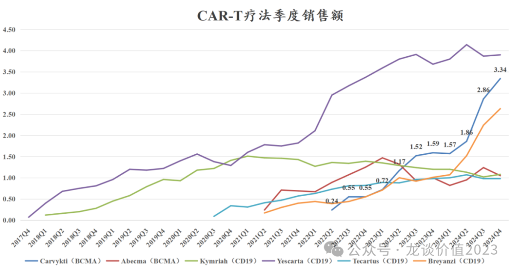
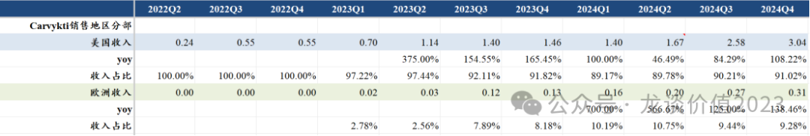
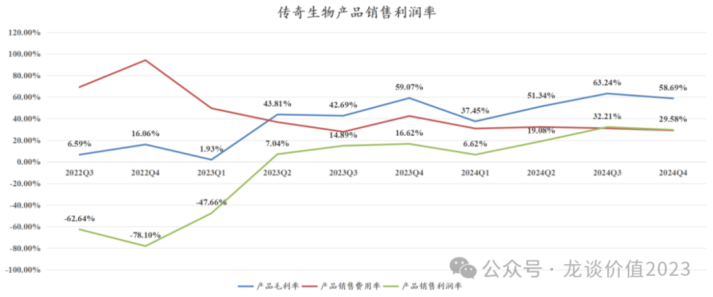

# 中国创新药出海双王已立

大家好，我是龙哥。

文初提醒一下，最近有几位朋友和我吐槽，更新了几篇很不错的文章都没能及时看到，主要是微信推送公众号文章模式的问题，大家如果想要避免错过好文，可以把龙哥公众号加个星标：

2月底和大家聊了百济神州的Q4业绩《[创新药巨头狂飙](https://mp.weixin.qq.com/s?__biz=MzkyMzQ3MDc3Mw==&mid=2247484144&idx=1&sn=0b26f935e3f7a1a6248b091a6c0ec916&scene=21#wechat_redirect)》，百济神州给出了非常好的产品收入和经营现金流表现，百济神州的第一款出海创新药泽布替尼在24年实现了26.4亿美元的全球销售额，创下中国创新药单品种销售额历史新高，可预计的泽布替尼在未来几年将陆续超越阿卡替尼和伊布替尼成为全球最畅销的BTK抑制剂。

昨晚中国创新药出海的“老二”传奇生物也发布了Q4业绩，传奇生物拥有目前全球最具市场潜力的细胞疗法Carvykti，用于治疗多发性骨髓瘤，因此今天我们再来聊聊传奇生物的业绩情况。

**1、产品销售**

首先我们来看全球上市的6款主要的CAR-T疗法的销售情况：

传奇生物Carvykti在2022年二季度在美国首次获批上市，强生负责Carvykti的全球商业化销售，二者在大中华区权益是传奇7：强生3，在大中华区以外的权益是五五开，收入、费用、利润共同承担和分享。

深蓝色这条线就是传奇生物的BCMA-CART疗法Carvykti的单季度全球销售额，肉眼可见的是2025年Carvykti将登顶细胞疗法的单季度全球最畅销产品，吉利德/Kite的CD19-CART疗法Yescarta已经增长停滞，对应的是BMS的CD19 CART疗法Breyanzi快速增长，25年Carvykti即将超越Yescarta。

比传奇生物的Carvykti要早4个季度上市的BMS的BCMA-CART疗法Abecma，也就是图中的红色线，在传奇生物的竞争下也已经增长停滞，传奇生物的Carvykti是在2022Q2首次在美国获批上市，而Abecma的销售在2022Q3单季度突破1亿美元、2023Q1达到单季度最高的1.47亿美元后，自2022Q3到2024年底，已经是10个季度在1亿美元左右的季度销售额波动。

传奇生物Carvykti的增长也不是一帆风顺的，2023Q3-2024Q1连续3个季度的单季度销售额在1.5-1.6亿美元之间波动，直到2024年4月二线治疗多发性骨髓瘤的适应症在美国获批上市，收入开始爬上新的台阶，24年Q2-Q4的季度环比增速分别是18.5%、53.8%、16.8%，单季度销售额一口气从1.6亿美元爬到3.3亿美元，由此，Carvykti在24年全年销售额达到9.63亿美元，同比增长92.6%。

从强生披露的Carvykti销售的区域分布来看，目前销售额仍然主要集中在美国市场，美国市场单季度销售额超3亿美元，占销售额的比重高达91%，以此推算欧洲的单季度治疗人数尚且不足100人（终端价近50万美元/人，报表口径超40万美元/人），欧洲仍处于放量的初期。

就美国市场而言，截止到24年三季度就已经覆盖美国97个治疗中心，到目前最新已经覆盖到104个；到24Q3有48%的患者在门诊完成治疗，而前一年同期这个比例是30%，是目前唯一在门诊广泛应用的CAR-T疗法，可以大幅提升治疗的便利性和降低治疗成本。

由于24年4月美国市场率先获批二线及以上MM适应症，美国市场的销售在Q3-Q4实现加速增长，到24Q3已经有一半以上的患者来自2-4线治疗且占比仍在快速提升，目前已经有60%的患者来自2-4线治疗，25年底可能提升至70%-75%。

另外，2024年8月，Carvykti在中国获批4线及以上的多发性骨髓瘤，虽然传奇生物/强生的产品在全球多发性骨髓瘤市场大杀四方，但在国内市场获批时间要晚于驯鹿生物/信达生物和科济药业/华东医药，且在国内市场相较另外两家也没有类似在欧美市场相较BMS的Abecma那样在疗效上的显著领先优势，因此国内市场大概率未来不会是能给Carvykti带来较多销售额的市场。

公司对25年的销售目标是做到再翻倍增长，也既25年做到19亿美元的全球销售额，成为继百济神州的泽布替尼之后又一个在全球市场达到10亿美元重磅炸弹品种的国产创新药，也将步入全球TOP100重磅品种之列。

**2、毛利率及费用率**

费用率方面，传奇生物/强生在24年也有不错的表现：

（注：图中销售利润率仅为产品毛利率-产品销售费用率）

①毛利率

首先是在产能仍在持续快速扩张的情况下，毛利率已经爬升到了60%以上，25-26年预计还会有不少新产能的投放，产能爬坡的过程意味着其毛利率可能不会提升的很快。根据公司的规划，25年美国工厂将获得FDA批准扩产，诺华CMO商业化产能已经获得批准，比利时的两个工厂有一个已经投产、另一个将在25年投产，即将开始供应临床产品，25年内还将启动商业化生产。

这样到25年底公司将达到此前指引的10000人份的年产能，25年的商业化产能预计相较24年翻倍，按平均出厂价40万美元左右计算，对应超40亿美金的产值，另外公司还指引27-28年达到2万人份的全球年产能。

②销售费用

销售费用方面，24Q4的产品销售费用率是29.11%同比下降13.33%、环比下降1.91%，美国血液瘤市场高度集中，销售费用率可以降到很低，例如百济的泽布替尼在美国仅靠200人销售团队可以实现近20亿美元的销售额，而如果按照国内肿瘤药人均单产300万元计算在国内做20亿美元销售额需要4800人的销售团队......

因此在强生本身就有强大的血液瘤、尤其是多发性骨髓瘤的销售团队和品牌基础的情况下，预计未来销售费用率还会持续下降。

③研发费用

研发费用方面，传奇生物近7个季度的研发费用都在1亿美元上下小幅波动，公司目前在进行的2个Carvykti一线治疗多发性骨髓瘤的全球III期临床，分别是CARTITUDE-5（不可移植）和CARTITUDE-6（可移植），其中CARTITUDE-5已经完成650例患者的全部临床入组，预计2026年可以读出III期临床数据，CARTITUDE-6也预计可以在25年完成III期临床患者入组。

因此后续26年随着2个大III期临床的推进基本结束，公司研发费用还有望进一步下降，当然这还要看公司后续管线的开发进度。

④管理费用

管理费用方面同样是趋于稳定，管理费用的增长也有显著放缓，管理费用自2022Q4的0.27亿美元增长至2024Q4的0.34亿美元，管理费用率自97%下降至20%，后续有望逐渐降至个位数。

⑤净利润

2024Q4单季度的净利润为2600万美元、去年同期为-1.45亿美元，单季度扭亏主要是因为汇兑等非经常性因素。2024Q4单季度公司经调整归母净利润为亏损5910万美元同比减亏33%，预计2025年有望实现单季度的经营性扭亏，如果公司产能投放导致毛利率略低，也可能到26年实现单季度的经营性盈利，公司指引则是25年底实现盈亏平衡、2026年全年实现经营性盈利。

3、竞品及后续管线

目前市场上有竞争力的竞品主要是Arcellx/吉利德的anito-cel，其此前发布的4线及以上患者的II期临床数据与传奇生物的5线及以上患者的I/II期数据非头对头的对比来看，mPFS为30.2个月VS34.9个月，ORR为95%VS 97.9%，CR率为62%VS82.5%，并且传奇生物披露的数据患者群体更大，理论上传奇生物可能具有更好的临床疗效。但Arcellx主打的是安全性好，其未有报告延迟性神经毒性（帕金森等），三级以上副作用发生率也要更低。

传奇生物目前在副作用管理方面也做出了很多努力和探索，CARTITUDE-4临床试验中200例患者仅有1例轻度1级帕金森，公司发现高肿瘤负荷可能导致T细胞快速和高度扩增从而引发CRS和神经毒性，因此在使用CAR-T前用桥接疗法降低基线肿瘤负荷、降低T细胞扩增峰值可以控制神经毒性的发生；另外还发现绝对淋巴细胞计数（ALC）与延迟性神经毒性存在直接关系，在第7-14天扩增时管理好ALC水平可预防该毒性，目前也有多个临床中心采取该措施，因此公司对产品安全性也是充满信心的。

除以上Arcellx的竞争外，未来还需要重点关注的还是通用CAR-T疗法的研发进展，通用CAR-T可以实现规模化生产从而大幅降低生产成本，且可以大幅缩短前期制备时间从而使得患者可以快速接受治疗。

传奇生物的后续管线有血液瘤和下一代MM的疗法，包括同种异体和体内CAR-T疗法；管线还包含实体瘤CAR-T疗法，其中传奇生物在23年底授权诺华的DLL3-CART，预计25年完成I期临床；另外传奇生物还在美国开Claudin18.2等的临床；传奇生物也在探索CAR-T疗法用于自免适应症，目前已经启动I期临床。

早期的临床项目，包括实体瘤和血液瘤的早期项目都会在今年陆续读出一些早期临床数据，在传奇生物完成Carvykti的大部分临床开发后，研发管线也将开始拓宽。

......

如果说百济的泽布替尼是首个Best in class的国产创新药，那么传奇生物的Carvykti则是在新兴技术领域第一次出现中国biotech领跑全球，目前市场对泽布替尼的全球销售峰值预期在60亿美元左右，而对传奇生物Carvykti的全球销售峰值预期则是在70亿-100亿美元不等，就单品种来看Carvykti的市场潜力更甚泽布替尼。

近期重点文章（可直接点击下列链接查看）：

《[生物药龙头关键年](https://mp.weixin.qq.com/s?__biz=MzkyMzQ3MDc3Mw==&mid=2247484213&idx=1&sn=e31cea42ba599a77117d7d7daf895fec&scene=21#wechat_redirect)》

《[药王竞争白热化](https://mp.weixin.qq.com/s?__biz=MzkyMzQ3MDc3Mw==&mid=2247484201&idx=1&sn=7d33aa996fccc6637bfa8b20d58ca64b&scene=21#wechat_redirect)》

《[黎明前的黑暗](https://mp.weixin.qq.com/s?__biz=MzkyMzQ3MDc3Mw==&mid=2247484184&idx=1&sn=55ec711da3240320949b76ae746cc139&scene=21#wechat_redirect)》

《[中国创新药出海之王](https://mp.weixin.qq.com/s?__biz=MzkyMzQ3MDc3Mw==&mid=2247484173&idx=1&sn=52dcb6390d13960d7ec157efb9ec76f6&scene=21#wechat_redirect)》

《[创新药巨头狂飙](https://mp.weixin.qq.com/s?__biz=MzkyMzQ3MDc3Mw==&mid=2247484144&idx=1&sn=0b26f935e3f7a1a6248b091a6c0ec916&scene=21#wechat_redirect)》

《[最全ETF梳理](https://mp.weixin.qq.com/s?__biz=MzkyMzQ3MDc3Mw==&mid=2247484135&idx=1&sn=2a8555f0200922f90e82d51562574545&scene=21#wechat_redirect)》

《[生物科技的狂欢](https://mp.weixin.qq.com/s?__biz=MzkyMzQ3MDc3Mw==&mid=2247484124&idx=1&sn=233fb7eda9c948a508908c6a66a6a4d0&scene=21#wechat_redirect)》

《[两个资产配置的重点方向](https://mp.weixin.qq.com/s?__biz=MzkyMzQ3MDc3Mw==&mid=2247484114&idx=1&sn=9d862ed9cfbfe39f4608466e3943f3e8&scene=21#wechat_redirect)》

《[医药行业趋势展望](https://mp.weixin.qq.com/s?__biz=MzkyMzQ3MDc3Mw==&mid=2247484101&idx=1&sn=febb0b581f3311f2fb2477ef02efdb50&scene=21#wechat_redirect)》

《[医疗AI大爆发](https://mp.weixin.qq.com/s?__biz=MzkyMzQ3MDc3Mw==&mid=2247484088&idx=1&sn=e2ebcdb46098eb9eda92d51b0c6d76bc&scene=21#wechat_redirect)》

《[全球顶级大品种](https://mp.weixin.qq.com/s?__biz=MzkyMzQ3MDc3Mw==&mid=2247484077&idx=1&sn=fd9b368f99a395862f03dd9f6be342b3&scene=21#wechat_redirect)》

《[非典型利空](https://mp.weixin.qq.com/s?__biz=MzkyMzQ3MDc3Mw==&mid=2247484042&idx=1&sn=7f0001decb5fca1b658ec50e1c995893&scene=21#wechat_redirect)》

《[中国医药历史性事件](https://mp.weixin.qq.com/s?__biz=MzkyMzQ3MDc3Mw==&mid=2247484024&idx=1&sn=4d42f6d88e255b20f426271c9be37b88&scene=21#wechat_redirect)》

《[最重要行业拐点](https://mp.weixin.qq.com/s?__biz=MzkyMzQ3MDc3Mw==&mid=2247483961&idx=1&sn=a6c753e24d874e551a8d2eebbfb515dd&scene=21#wechat_redirect)》

风险提示：本文仅讨论行业/公司经营情况，投资需综合考虑公司经营、估值、管理层等多方面因素，建议读者审慎参考，本文不作为投资依据，不建议大家根据本文做出投资计划。

<!-- wxmp-comments-begin -->

---

## 留言（7 条，含回复共 18 条）

- **TAU** 👍6 · 2025-03-12 15:17
  百济发完就一直跌到现在[捂脸]
  - ↳ **作者** · 2025-03-12 15:19
    这个倒是和基本面没关系，高瓴和Baker减持也不是我们能预判和影响的，以及短期业绩兑现后交易层面的事是另一码事，更何况讲完跌一段还能给大家研究和买入的机会，想要讲完就涨的公司，去找那种教你短线打板的公司，绝对带劲，天天都有票讲完就涨。
  - ↳ **作者** · 2025-03-12 15:25
    我倒觉得还算正常，百济这么大市值的票年初以来一把涨了50%，有一些分歧是好事，我还希望看到更多对百济质疑的点，我自己本身也有一些质疑的点，只是有些东西不能对外讲。回调一些也给更多投资人上车的机会，机构资金还有一批等着百济扭亏呢。总之，如果真的市场预期完全一致了才是灾难，有分歧是好事。
- **@Sunny** 👍4 · 2025-03-12 15:57
  期待，创新药治病救人[呲牙][呲牙][呲牙][呲牙][呲牙]
  - ↳ **作者** · 2025-03-12 16:02
    是啊，投资归投资，大家多了解了解创新药也有好处，创新药回归本质还是治病救人嘛
- **🎄** 👍3 · 2025-03-12 15:20
  金斯瑞也太低估了吧
  - ↳ **作者** · 2025-03-12 15:27
    我在金斯瑞上也吃了大亏，很难评，可以看看我去年12月那篇《谁在掏空上市公司》
  - ↳ **作者** · 2025-03-12 16:15
    昨晚看待传奇业绩，以为金瑞业绩预期下，也会大涨一波，居然大跌。
- **Bryan** 👍2 · 2025-03-12 15:42
  对了龙哥，固生堂还有关注嘛？最近波动剧烈，南下是因为AI医疗买入，获利盘再砸盘嘛？我倒是乘机做了一下高抛低吸，但也不敢太大仓位去交易，低估+消费医疗角度买的
  - ↳ **作者** · 2025-03-12 15:45
    固生堂不是因为获利盘砸盘，主要是北京联盟中药饮片集采的消息扩散开了，虽然是前一周的消息，但是前面炒医疗AI的时候好像大家没怎么关注，现在关注到了就开始担心集采的影响。之前关注固生堂的基本每次交流都会讨论集采的事，我感觉是不是这一波炒医疗AI的资金可能只是想短期炒一把，没想到中医馆还能受集采影响吧[捂脸]
  - ↳ **作者** · 2025-03-12 16:01
    不不不，饮片收入占比挺高的，他中医馆本来就50%-60%的收入是卖药赚钱，而且卖药的毛利率还要高于他的平均毛利率，贡献的利润比例更高的，所以客观来说影响肯定是有的，如果没有影响的话也不会这么高的增速之前才给到十几倍的PE。
- **迷雾** 👍1 · 2025-03-12 15:18
  龙哥，买金瑞斯是不是相当于买传奇
  - ↳ **作者** · 2025-03-12 15:22
    当然不是，除非传奇生物被MNC收购，金斯瑞可以实现价值兑现，否则的话集团控股公司会始终大幅折价，这点在港股一系列集团控股公司上持续体现。如果传奇生物无法被收购，可预期的未来几年传奇生物也不会分红，那传奇生物对于金斯瑞来说就始终是不能兑现股东价值的持股。
  - ↳ **作者** · 2025-03-12 16:22
    是不能用A股的经验套港股啊
- **Bryan** 👍1 · 2025-03-12 15:38
  要不是交易不便谁买金斯瑞啊[捂脸]，昨晚传奇大涨，今天金来个大跌...这阵子还是再弄点钱到富途去吧...
  - ↳ **作者** · 2025-03-12 15:39
    是的，这就莫名其妙，传奇的财务状况还不错，销售指引也挺好，昨晚XBI还是跌的，传奇生物股价逆势大涨9%，然后今天金斯瑞还大跌，真就难评。
- **饶鑫** 👍1 · 2025-03-12 15:48
  荣昌可以吗？管线是不是老了一些，看销售似乎又还可以，感觉明年现金流能转正
  - ↳ **作者** · 2025-03-12 15:56
    他们销售倒是还算正常放量，就是他们这破财务状况早就该降本控费了，还一直放飞自我的花钱，毫不控制，真是无语。

<!-- wxmp-comments-end -->
