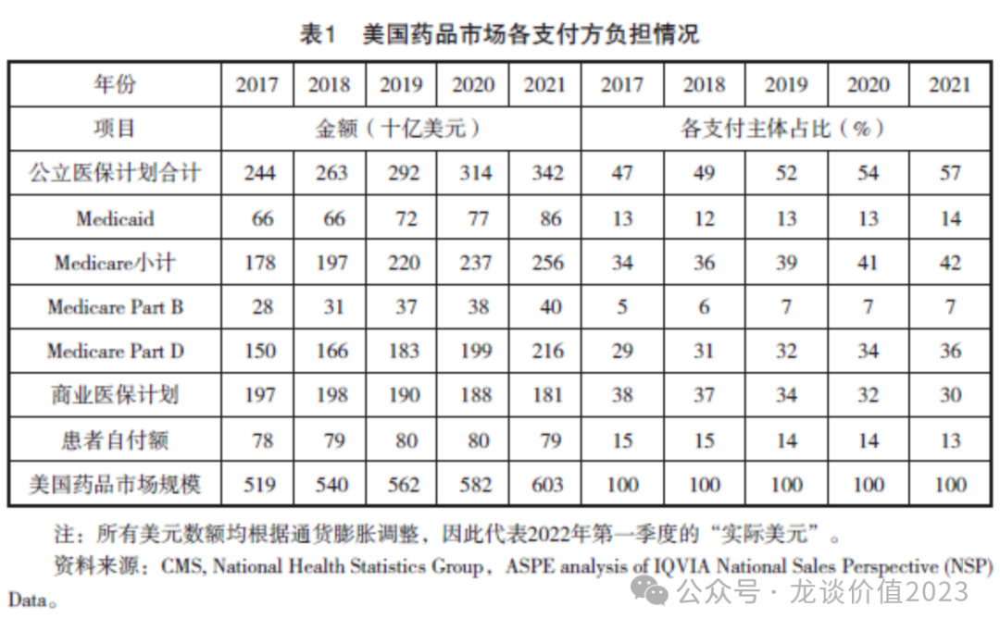
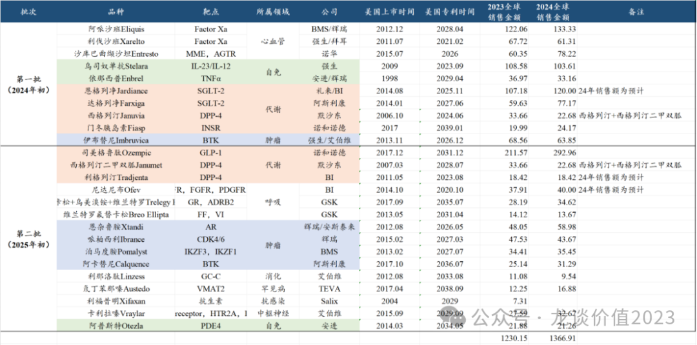
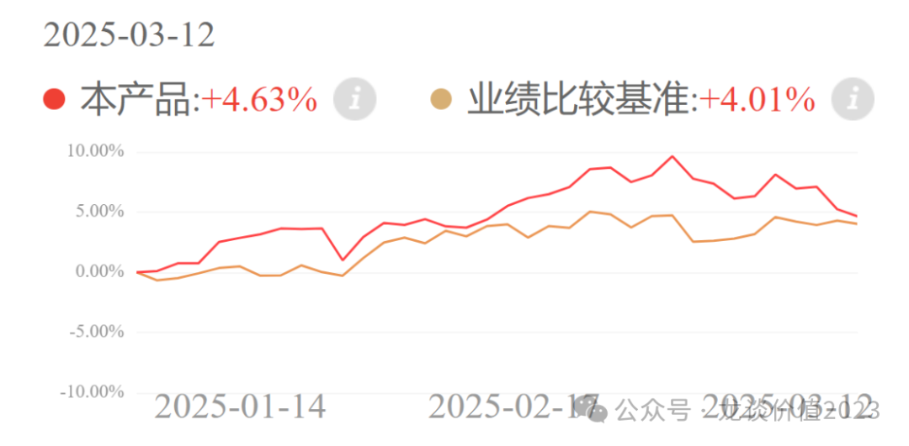
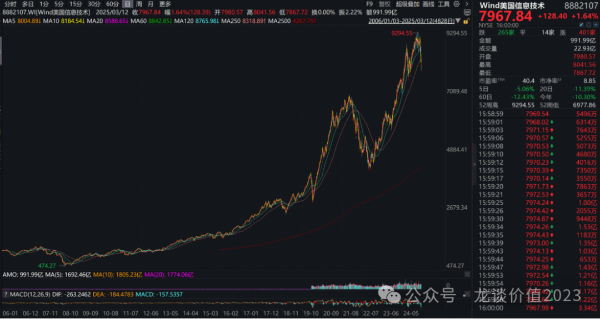
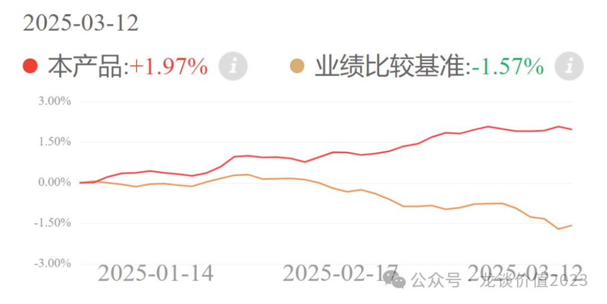

# 美国药品大降价

大家好，我是龙哥。

最近很多读者提到国内创新药出海的政治风险，对此我认为在产品海外授权方面的政治风险虽然客观存在、但还相对可控。

相比之下更值得关注的，是“美国版医保谈判”——通胀削减法案（IRA），IRA对美股医药的潜在影响程度、以及国产创新药出海的价值，可能其影响程度要更值得重视。

1、IRA法案概况

通胀削减法案最早是在2022年8月通过，核心内容就是允许政府部门与药企进行药品的价格谈判，并限制药品价格和医保支付价格的上涨幅度，从而控制增长过快的药品医保支出。

前面这条价格谈判估计大家都比较容易理解，关注医药行业的读者估计这些年已经对国内的药品集采和国家医保谈判非常熟悉了，只是现在变成美国版的国家医保谈判，按消耗医保资金金额排名从高到低的药品选择top品种参加谈判。

后面那条限制药品价格和医保支付价格估计很多读者会不太理解，因为国内的创新药价格基本从上市开始就是最高点，随后就是无穷无尽的谈判降价、市场竞争主动降价、集采降价。而欧美的药品价格是可以跟随通胀水平进行涨价的，一款新药从上市之初到专利到期甚至可以涨价几倍到十倍之多，因此IRA法案的目标之一就是限制药品价格和医保支付价格的涨幅超越通胀。

在此之前我们要先理解美国的医保对药品支付的资金结构，如上图所示，截至到2021年美国超过6000亿美金的药品市场中，约有57%来自公立医保支付，这也是IRA法案主要影响的部分，另外30%来自商保支付、13%来自患者自费，其中公立医保支付中占比36%的Part D的部分是政府出资、商保机构管理。

2、谈判药品品种选择

通胀削减法案中对选择品种进行价格谈判的标准、推进节奏等有明确的规定。

1）通胀削减法案推进节奏：

2023年选定10个Part D品种（2024年初已经公布），2025年选定15个Part D品种（2025年初已经公布），2026年选定15个Part B/D品种，2027-2029年各选择20个Part B/D品种。2029年以后是否还会持续选择新品种纳入，目前尚未明确。

2023年选定的品种2026年起效，2025年及以后选定的品种选定2年后起效。也既从2026年开始会正式开始对第一批选定的10个品种降价，

2）第一批10个品种选择标准：

①FDA批准上市至少7年、生物制品至少11年，且没有仿制药或生物类似药竞争。

②不包括孤儿药、低花费的医疗保险药品和血液制品。

③选择医疗保险总处方药成本最高的50个品种。

④按医疗保险总处方药成本总额排名。

⑤在50个符合谈判资格药物的排名列表中排除生物类似药上市的生物药后，选择医保支付成本最高的10个品种。

3）谈判降价目标：

选定品种后进行谈判降价，根据上市时间设定谈判降价幅度的底线，目标大幅压缩中间渠道价格、返利返点、通胀返点等，涉及整个支付体系改革。选定药品如不参加谈判，则会被收取极高的消费税。

拜登政府此前预计2026年首年可节省60亿美元，三者合计到2031年削减310亿美元支出，其中处方药价格谈判削减250亿美元支出。

4）第一批/第二批品种整理：

根据我们整理的第一批和第二批IRA法案选出的药品，主要包括以上品种，其中第一批的10个品种主要以心血管、代谢、自免等慢病领域为主，而第二批则是以代谢、呼吸等慢病以及肿瘤领域为主。

上述品种中包含了多个大家耳熟能详的大品种，包括目前心血管领域销售规模最大的3款抗凝血药物和抗心衰药物阿哌沙班、利伐沙班、沙库巴曲缬沙坦，也包括这两年全球最亮眼的品种司美格鲁肽，肿瘤领域则是纳入了3个销售体量较大的血液瘤品种和2个实体瘤品种，百济神州泽布替尼的两个主要竞品——伊布替尼和阿卡替尼都被纳入。

司美格鲁肽虽然是一款多肽药物，但由于其分子量较小、被列为小分子药物，因此在上市满7年就可以被纳入IRA的价格谈判范围，也是比较倒霉。

第一、第二批合计25个品种，2023年全球销售额合计1230亿美元，2024年全球销售额1370亿美元，占全球药品销售额约十分之一。

除了以上第一批和第二批已经明确纳入的品种外，从2026年开始选择的品种就会开始纳入Part B的生物药品种，也即上市时间已经超过11年、专利到期时间临近、销售体量巨大的几款生物药，如帕博利珠单抗（24年全球294亿美元）、达雷妥尤单抗（24年全球117亿美元）、纳武利尤单抗（24年全球预计100亿美元）等大品种也可能将被纳入。

5）降价幅度：

根据目前第一批10个品种的降价幅度来看，降幅最小的伊布替尼医保支付价格下降了37.6%，降幅最大的阿哌沙班则是下降了78.6%，平均降价幅度都在60%-70%。阿哌沙班2023年的全球销售额是122亿美元，其中美国销售84.8亿美元，而在2022.06-2023.05这一年中Medicare Part D对阿哌沙班的采购金额高达164.8亿美元......

3、长期影响

①目前市场认为价格的折让主要由中间渠道、医生回扣和PBM回扣承担，药企出厂价不受影响，实际还要观察是否能做到这么理想化，毕竟美国医药行业各环节利益关联方的政治关系都很硬。

②按照2031年削减310亿美元的成本计算，假设悲观情况下药企也需要承担三分之一的成本，约影响100亿美元收入，占美国药品市场1%出头、不到2%，总体影响可控。

并且以上影响主要在MNC药企，中小型的biotech可以获得豁免。

③另一影响在于药品以跟随或超越通胀的幅度每年涨价的逻辑可能被限制（涨价幅度不能超过CPI），从而可能导致DCF估值中长期现金流的增长和永续部分直接受损。

④对药企研发策略的影响：

由于小分子药物纳入的时间要显著快于大分子药物及其他创新疗法，药企开发小分子药物的动力可能被大幅减弱，转而更有动力开发新技术领域的创新疗法。

过去肿瘤药的开发策略常见的是先开发后线治疗的小适应症，药物成药上市后逐渐拓展至大适应症，而在IRA法案中对药物上市时间的计算是从第一个适应症首次上市开始，因此药企可能被迫更激进的优先开发大适应症，需要承担更大的研发风险和成本。

另外fast follow新药开发也会受到影响，晚几年上市的fast follow新药可能会被动跟随First in class新药的降价而降价，fast follow新药产品生命周期的投资回报率会被打更大的折扣。

⑤对我国创新药出海的影响：

小分子药物出海的难度可能会增加，先开发小适应症验证成药性的品种未来在海外BD中也会有局限性；授权给MNC虽然可以获得临床开发效率和商业化能力的加持，但同时也会受到IRA的限制，而授权给海外中小型biotech虽然风险更大、但不受IRA法案的限制，因此在谈BD授权时对对手方的选择也要根据品种特点来综合考虑。

......

另外再提一下我在定投的组合。具体介绍在《[两个资产配置的重点方向](https://mp.weixin.qq.com/s?__biz=MzkyMzQ3MDc3Mw==&mid=2247484114&idx=1&sn=9d862ed9cfbfe39f4608466e3943f3e8&scene=21#wechat_redirect)》。

龙谈医药科技组合是50%的美股科技+50%的AH医药，最近回撤一些主要是美股科技表现比较拉胯。

美股科技股虽然总体呈现长牛，每隔1-2年总归会有一两次大幅度的回调，回调幅度可以高达20%-40%，放在长期K线中不显著，但短期的回调幅度也可以很大。

这一波美股科技股的回调目前来看时间和空间都还不算大，美股信息技术板块近期回调幅度在13%左右，和纳斯达克指数的回调幅度差不多（当然部分个股的回调幅度要远大于此）。因此，当前位置对于投资美股而言仍然适合分散定投，不是可以重仓投入的时候。

龙谈医药科技组合通过相关性极低、但长期价值又都较高的美股科技+AH医药的组合，很大程度上控制了回撤幅度，在今年美股科技表现较差的情况下仍有4.6%的涨幅，且仍跑赢国内的宽基指数。

另一个组合——龙谈美元债组合，净值表现尤其亮眼，这也是我当初选择这个组合的初衷，在今年仅仅2个月的时间，国内债券的业绩基准跌了1.57%，对于固收产品来说是较大幅度的回撤了，而配置美元债的组合两个月实现了2%的回报率，对于固收产品来说是较大幅度的短期收益了。

中美债市近期波动幅度都很大，我们看好中长期美债高基本票息+未来降息带来的美债上涨空间，但短期还有另一个影响因素是汇率，汇率的波动对大家来说是独立在美债波动之外的盈亏，持有美债资产主要的风险是人民币大幅升值——美元大幅贬值的风险，但如果人民币大幅升值、美元大幅贬值，意味着美国经济衰退预期强烈，对应美债利率下行空间较大，而组合管理人选择的都是长久期的美债，美债下行带来的资本利得收益可以对冲美元贬值的损失，是的组合收益更加稳健。

直接扫描以下二维码可以查看和跟投以上两个组合。

风险提示：本文仅讨论行业/公司经营情况，投资需综合考虑公司经营、估值、管理层等多方面因素，建议读者审慎参考，本文不作为投资依据，不建议大家根据本文做出投资计划。

<!-- wxmp-comments-begin -->

---

## 留言（11 条，含回复共 22 条）

- **建东** 👍6 · 2025-03-14 09:05
  建东北京刚刚不得不说&nbsp;龙哥的文章含金量都很高
  - ↳ **作者** · 2025-03-14 09:21
    [抱拳][抱拳]多多转发
- **酩酊知丘** 👍2 · 2025-03-14 09:10
  老美把中国的集采也学去了[偷笑]
  - ↳ **作者** · 2025-03-14 09:20
    不算集采，算是医保谈判吧。美国医疗支出占GDP比重干到接近20%，人均预期寿命在发达国家里反而倒数，医疗体系的效率是非常差的，中间利益环节拿走太多，药企本身也没拿到那么多，医保支出占据过多的财政支出，所以降本控费的出现其实是必然。
- **木木_森林** 👍2 · 2025-03-14 09:15
  投美股纳指，把去年赚的钱都还回去了！！！[微笑]
  - ↳ **作者** · 2025-03-14 09:25
    如文末内容所说的，美股科技这么多年虽然长牛，但每隔1-2年总归会有一次20%-40%不等的回调，所以这两年大家一直说美股每次回调20%就开始买。
- **徐海东** 👍2 · 2025-03-14 09:22
  龙哥，那恒瑞医药惨了，他主要是小分子药，出海逻辑有变化？
  - ↳ **作者** · 2025-03-14 09:30
    恒瑞也越来越多的大分子药物出海，ADC药物、抗体药
- **迷雾** 👍2 · 2025-03-14 09:47
  龙哥，那对做大分子生物药的药名生物是大利好吧
  - ↳ **作者** · 2025-03-14 09:59
    算是边际上利好吧，欧美药企也要面对政策面积极调整研发策略，已经有MNC砍部分竞争力不够强的小分子管线了。
- **Bryan** 👍2 · 2025-03-14 09:57
  可能美国是小政府，没有医保局这样的机构，所以催生了PBM？之前看视频介绍，有印象PBM的存在，就感觉很难评...
  - ↳ **作者** · 2025-03-14 09:58
    他们过去是不允许政府和药企进行药品价格谈判的，现在也开始谈了，现实问题总归是要面对的。
- **听雨** 👍2 · 2025-03-14 13:18
  白云山昨晚年报业绩算中规中矩嘛
  - ↳ **作者** · 2025-03-14 13:24
    白云山确实情况相对复杂，从几大业务板块来看：医药流通板块中规中矩。
    中成药板块这几年算是相对稳定，但24年也同比下滑了3%。
    最拉胯的是化药板块，西地那非（金戈）量价下滑，这个90%多毛利率的品种贡献了化药板块一半的毛利，其他化药品种大多受集采冲击下滑，同时化药这块研发又很拉，没几个靠谱的新品种。
    王老吉这边从19年达峰之后，20年受疫情影响比较大，21-23年在100亿上下震荡，24年掉到88亿，利润少了接近4个亿。
    当年觉得最没有价值的医药商业反而现在是白云山的顶梁柱，其他业务都是压力巨大，公司现金流还算丰厚，又没有像华润系这样去市场上收购整合一些好的中药资产，总体短期确实没看到拐点，后续观察下25Q1的情况再说吧。
- **Doki** 👍2 · 2025-03-14 13:28
  再鼎医药今年还有什么看点嘛，龙哥
  - ↳ **作者** · 2025-03-14 13:31
    再鼎医药今年主要就是Bema一线胃癌的III期临床数据读出，这个可能是改变一线胃癌标准疗法的一个突破性的药物，非常值得重视，除此以外就是看艾加莫德的商业化了。然后26年还有KarXT和TF-ADC的国内获批。再鼎的BD眼光在国内所有phaama和biotech中再没有一家能望其项背，在国内创新药政策环境改善的背景下实际上边际收益会比较明显。
- **峰回路转** 👍1 · 2025-03-14 09:33
  龙哥好，港股的维昇药业在赛道内的竞争力如何，可以入手不
  - ↳ **作者** · 2025-03-14 09:54
    长效生长激素我感觉没太大意思哎，商业化上很难和金赛这些传统龙头竞争，就算能切一小块市场，还要面临整个长效生长激素行业竞争者增加的问题。
- **向阳而生** · 2025-03-14 09:22
  龙大开立医疗国产替代还有希望么
  - ↳ **作者** · 2025-03-14 09:27
    可以观察一下设备集采实际对财务报表的影响，企业端像开立、迈瑞、联影这些细分领域龙头公司一直对集采加速国产替代还是挺乐观的。
- **Ray** · 2025-03-17 16:06
  龙哥，可不可以在天天基金上增加投顾？华宝证券有投顾在的，谢谢
  - ↳ **作者** · 2025-03-17 16:09
    在京东投，主要是京东现在给免很多费率，而且京东的平台也一样比较安全

<!-- wxmp-comments-end -->
