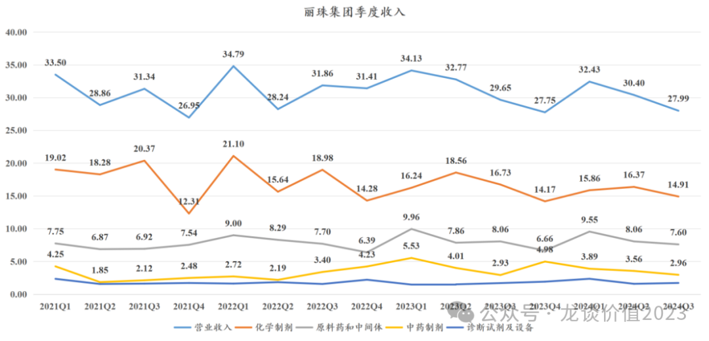
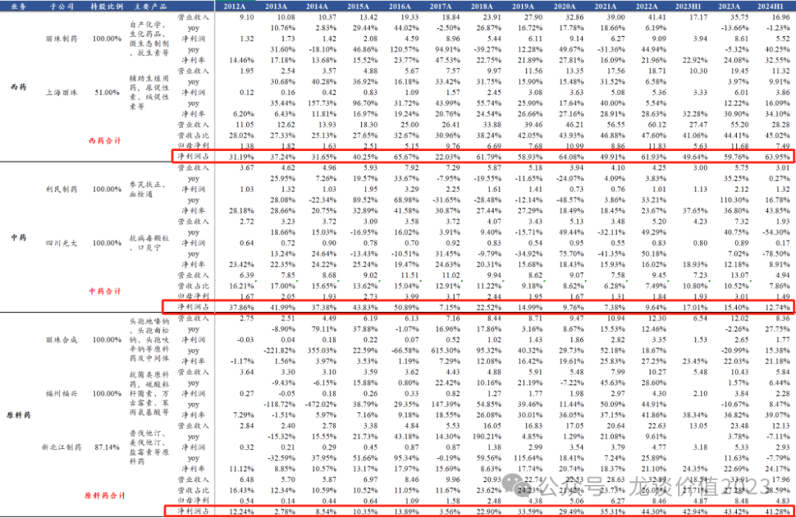
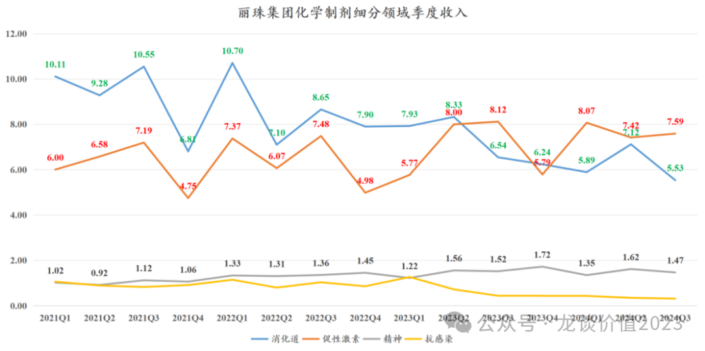
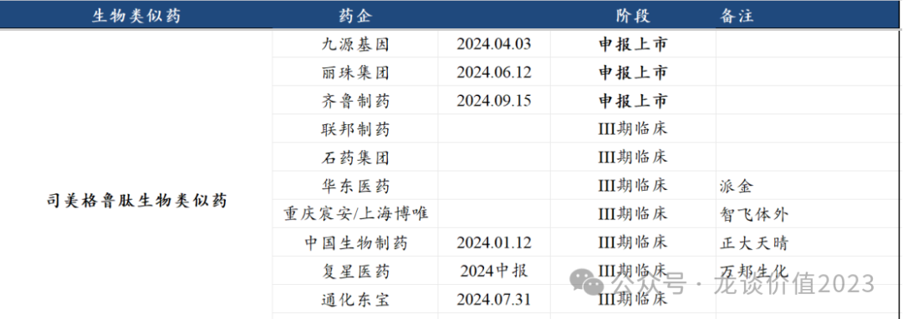

# 医药小甜甜变成牛夫人

大家好，我是龙哥。

前几天有读者问到丽珠集团，我说要专门写篇文章聊聊丽珠集团和石药集团这两家公司目前存在的共同的问题，当时也有读者说到，以前还说丽珠是稳稳的幸福，现在就......

记得在2020年初的时候，龙哥确实是专门写过《稳稳的幸福》来聊丽珠集团。但是，往中短期说，企业的经营是动态的，基于历史的经营情况和当时的在研管线我们可以做出一些积极的判断，但同时要持续的跟踪企业的经营情况是否能如期进展。往中长期说，制药企业哪怕在全球市场，也从来都不是一个能长期稳定的股价K线一路向上的商业模式，创新药的研发本身具有很强的偶然性，成熟的一二线pharma一般各有所长、大多不会轻易被行业淘汰，但大多还是会存在跟随核心产品周期而出现“各领风骚几年”的特点，因此谈到丽珠当下面临的问题，是复盘，是警示，也是思考。

1、增长难题

首先我们来看丽珠集团近年的季度收入和业务结构，虽然2020年以来丽珠集团的中药和诊断业务一直受到新冠的影响波动比较大，但总体是算不上核心业务板块的，丽珠集团的核心业务板块一直就是化学制剂和原料药及中间体两大块。

季度收入来说，近4年间丽珠的季度收入一直在27亿-35亿之间震荡，对利润贡献最大的化药板块从单季度收入20亿左右震荡向下到单季度收入15亿左右，原料药板块的单季度收入近几年的收入也大致稳定在7-8亿上下，由于内部产品结构存在一些调整，总体净利率有所提升，因此看利润端的表现实际上要显著好于收入端。

如果我们对丽珠集团的核心子公司进行拆分，在不考虑诊断业务和丽珠单抗的情况下，可以看到对公司利润贡献最大的同样是化学制剂和原料药这两个业务板块，化药板块的收入占比从2012年的28%提升到2023年的44%，利润占比从31%提升到60%，原料药板块的收入占比从2012年的16%提升至2023年的27%，利润占比从12%提升至43%，而丽珠曾经核心的中药板块收入占比从16%下降至13%（还是在新冠+流感刺激了抗病毒口服液销售的季节性影响下），利润占比从38%下降至15%。另外就是做生物药开发的丽珠单抗每年贡献大量的亏损、但目前创收还较为有限。

具体到化药板块，可以更清晰的看出为什么丽珠集团的化药板块单季度收入从20亿上下掉到了15亿上下，其中促性激素板块的收入总体还是较为稳健，收入占比最大的亮丙瑞林虽然有省级集采纳入，但由于竞争格局还可以，对丽珠的影响并未显现。

消化道板块，作为丽珠集团唯一一个曾经的30亿大品种——艾普拉唑——所在的板块，近年受到其他PPI抑制剂竞品集采大幅降价、医疗反腐、雷贝及其他品种集采等诸多负面因素的影响一直不小，尤其是可以看到消化道板块在23Q3开始季度销售有一个断崖下跌，从单季度8亿左右下到单季度5-6亿，与医疗反腐的时间点刚好吻合......

精神板块和抗感染板块，对丽珠来说都是仿制药为主，靠着有原料药制剂一体化的优势还能贡献一些收入，但总体难成大器，后续可能会上一个阿立哌唑微球的月制剂，可能可以把精神神经板块的收入再往上托一托。

因此我们就存量业务来看，丽珠自23年以来确实处于压力非常大的两年，这还是在亮丙瑞林作为一个15-20亿的品种一直还没太受到集采影响的情况下的表现。

2、在研产品管线

近5年丽珠集团获批上市的主要增量产品实际上就只有4款，分别是重组人绒促性素、托珠单抗生物类似药、曲普瑞林微球和新冠融合蛋白疫苗，前两款生物药分别是在21年4月和23年1月获批上市，目前销售额合计也不到2亿元，而新冠重组蛋白疫苗，公司耗费大量的资金研发，最终不但没赚钱、而且带来的是大几亿的无形资产和商誉减值。

就丽珠集团的3个业务板块来看，微球板块、生物药板块和化药板块的研发可以说是普遍的要慢于预期，对于没有绝对的疗效优势的fast follow或者me too药物来说，开发的速度直接决定市场价值。

①微球板块

在19-20年的丽珠，公司除了一个销售颇具体量的亮丙瑞林微球（1个月）外，有醋酸曲普瑞林微球（1个月）、阿立哌唑微球（1个月）、亮丙瑞林微球（3个月）、双羟萘酸曲普瑞林微球（3个月）、丙氨瑞林微球（1个月）、戈舍瑞林植入剂等6个微球管线，在国内是遥遥领先。

由于微球制剂的规模化生产的工艺壁垒并不低，国内竞争格局一直还算不错，上市公司里有竞争力的也就是丽珠集团、绿叶制药、长春高新三家。

但是微球的工艺壁垒也同时难住了丽珠，经过5年时间以上6个产品线只有2个推进到产品注册，丽珠集团21年9月申报注册的醋酸曲普瑞林微球（1个月）在23年5月首次获批，阿立哌唑微球是与CDE沟通豁免了III期临床得以在23年9月申报NDA，公司预计24年底到25年初获批，且预计是10-20亿的品种，目前注册时间又晚了一些。

随着这两款微球的商业化，丽珠集团的微球板块总归是带来了一些新的增量，但后续仍需要关注亮丙瑞林集采的情况。

②生物药板块

丽珠的生物药板块最是让人唏嘘，丽珠单抗也算是国内起步非常早的一批做抗体的公司了，但一早立项的一系列的生物类似药和PD-1单抗大多是陆续被剁掉，如16年拿到临床批件的CD20单抗，17年拿到临床批件的地舒单抗生物类似药、PD-1单抗，19年拿到临床批件的OX40单抗以及其他多个品种，都是无疾而终。

最终截至到目前才仅有重组人绒促性素、托珠单抗生物类似药上市，重组人促卵泡素在25年1月申报上市，3个品种的市场价值量都相对有限。

再进一步，丽珠集团较早的布局了司美格鲁肽的生物类似药，虽然是国产第二家申报上市、且商业化能力应该要强于第一家的biotech公司九源基因，但后续跟随者同样众多，司美的专利到期要到26年，到时丽珠相较后续的竞争者也未必能拉开足够的领先优势。

在丽珠集团所有的生物药管线里唯一的看点，就是其IL-17A/F单抗。诺华的IL-17A司库奇尤单抗全球销售额超过61亿美元、同比增长超20%，IL-17A/F双靶点则是相较IL-17A更进一步的下一代品种，UCB的IL-17A/F单抗——Bimekizumab在银屑病中表现出显著高于司库奇尤单抗的PASI100（完全清除皮损），UCB对该品种的销售峰值预期是不低于40亿欧元。

司库奇尤单抗在国内的年销售额已经达到60亿元，IL-17A单抗的国产竞争已经尤为恶劣，丽珠集团开发的IL-17A/F在国产中还算是独树一帜，但仍要关注其商业化的表现，截至24年中丽珠已经完成了银屑病和强直性脊柱炎的III期临床患者入组。

③化药板块

丽珠的化药板块以外部BD引进品种为主，目前2款处于III期临床的品种，分别是消化道领域的P-CAB药物Zastaprzan和一款口服的GnRH拮抗剂艾拉戈利钠片。

P-CAB（钾离子竞争性酸阻滞剂）用于丽珠集团比较擅长的消化道领域，通过竞争性结合胃壁细胞 H+/K+-ATP 酶的钾离子位点，直接阻断胃酸分泌的最后一步，所以抑酸效果会比PPI抑制剂更快，抑酸更持久，是全球市场的PPI普遍专利到期后下一代的主流强效抑酸剂。目前全球市场主要有武田制药的伏诺拉生、韩国Yuhan的瑞伐拉生、大冢制药的泰妥拉唑三款P-CAB药物获批。

国内市场，武田的伏诺拉生已经专利到期，伏诺拉生仿制药开始陆续获批上市，国产竞品目前上市的主要有山东罗欣的替戈拉生和复星医药/南京柯菲平的凯普拉生两款药物获批上市，其中罗欣的替戈拉生是国内唯一获批幽门螺杆菌（Hp）根除的P-CAB。

Zastaprzan（JP-1366）是丽珠集团在2023年3月自韩国Onconic Therapeutics Inc.引进的一款产品，目前反流性食管炎（片剂）和消化性溃疡出血（注射剂）处于III期临床阶段，也既P-CAB口服制剂1类新药丽珠集团是国产第三家，注射剂则是仅次于罗欣的国内第二家。

3、高股东回报

丽珠集团近年在业绩增长方面没有什么太多的亮点，经营现金流和账上现金又非常充裕，因此进行了大规模的回购和分红，这也是其股价虽然表现不强、但总体也没有跌很多的原因。

截至2024年三季度公司在手现金是118亿元，有息负债是40亿元，在手净现金是78亿元，这两年的经营现金净流量更是在30亿元上下。

分红方面，丽珠集团2018年-2023年的6年间股利支付率都在60%-80%之间，分红比例还是非常高的，按65%的股利支付率计算24年的分红额大概是13.3亿元，对应丽珠集团A股和H股的股息率分别是4.2%和5.9%。

回购方面，2019年及以前，丽珠集团和健康元的股份回购主要用于股权激励，而2021年以来丽珠集团多次回购注销股份：

A股回购：

- 2022年10月25日公告回购方案，计划回购4-8亿元，回购价格不超过40元/股。2023年10月25日公告回购完成，合计回购1161.45万股，占总股本1.24%，回购价格32.25元/股-37.34元/股，回购金额4.02亿元。2023年12月5日公告回购股份完成注销。
- 2023年10月30日公告回购方案，计划回购4-6亿元，回购价格不超过38元/股。2024年12月09日公告回购完成，合计回购1647.46万股，占总股本1.78%，回购价格32.95元/股-37.96元/股，回购金额6.00亿元。2024年12月26日公告回购股份完成注销。
- 2024年12月24日公告回购方案，计划回购6-10亿元，回购价格不超过45元/股。截至2025年2月8日回购942.6万股，占总股本1.03%。

H股回购：

- 2021年累计回购H股1003.30万股，占总股本1.07%。
- 2024年累计回购H股935.25万股，占总股本1.01%。
- 2025年以来回购H股27.16万股，占总股本0.03%。

因此当前位置的丽珠集团总体的股东回报率，A股回购+分红大概是6%-7%，H股回购+分红大概是8%-9%。

......

近期重点文章（可直接点击下列链接查看）：

《[美国药品大降价](https://mp.weixin.qq.com/s?__biz=MzkyMzQ3MDc3Mw==&mid=2247484234&idx=1&sn=28cf6165faae82f398c9afb5f39bd641&scene=21#wechat_redirect)》

《[中国创新药出海双王已立](https://mp.weixin.qq.com/s?__biz=MzkyMzQ3MDc3Mw==&mid=2247484223&idx=1&sn=8607586f00583da6b063edd81ede3f5b&scene=21#wechat_redirect)》

《[生物药龙头关键年](https://mp.weixin.qq.com/s?__biz=MzkyMzQ3MDc3Mw==&mid=2247484213&idx=1&sn=e31cea42ba599a77117d7d7daf895fec&scene=21#wechat_redirect)》

《[黎明前的黑暗](https://mp.weixin.qq.com/s?__biz=MzkyMzQ3MDc3Mw==&mid=2247484184&idx=1&sn=55ec711da3240320949b76ae746cc139&scene=21#wechat_redirect)》

《[中国创新药出海之王](https://mp.weixin.qq.com/s?__biz=MzkyMzQ3MDc3Mw==&mid=2247484173&idx=1&sn=52dcb6390d13960d7ec157efb9ec76f6&scene=21#wechat_redirect)》

《[创新药巨头狂飙](https://mp.weixin.qq.com/s?__biz=MzkyMzQ3MDc3Mw==&mid=2247484144&idx=1&sn=0b26f935e3f7a1a6248b091a6c0ec916&scene=21#wechat_redirect)》

《[最全ETF梳理](https://mp.weixin.qq.com/s?__biz=MzkyMzQ3MDc3Mw==&mid=2247484135&idx=1&sn=2a8555f0200922f90e82d51562574545&scene=21#wechat_redirect)》

《[生物科技的狂欢](https://mp.weixin.qq.com/s?__biz=MzkyMzQ3MDc3Mw==&mid=2247484124&idx=1&sn=233fb7eda9c948a508908c6a66a6a4d0&scene=21#wechat_redirect)》

《[两个资产配置的重点方向](https://mp.weixin.qq.com/s?__biz=MzkyMzQ3MDc3Mw==&mid=2247484114&idx=1&sn=9d862ed9cfbfe39f4608466e3943f3e8&scene=21#wechat_redirect)》

《[医药行业趋势展望](https://mp.weixin.qq.com/s?__biz=MzkyMzQ3MDc3Mw==&mid=2247484101&idx=1&sn=febb0b581f3311f2fb2477ef02efdb50&scene=21#wechat_redirect)》

《[医疗AI大爆发](https://mp.weixin.qq.com/s?__biz=MzkyMzQ3MDc3Mw==&mid=2247484088&idx=1&sn=e2ebcdb46098eb9eda92d51b0c6d76bc&scene=21#wechat_redirect)》

《[非典型利空](https://mp.weixin.qq.com/s?__biz=MzkyMzQ3MDc3Mw==&mid=2247484042&idx=1&sn=7f0001decb5fca1b658ec50e1c995893&scene=21#wechat_redirect)》

《[中国医药历史性事件](https://mp.weixin.qq.com/s?__biz=MzkyMzQ3MDc3Mw==&mid=2247484024&idx=1&sn=4d42f6d88e255b20f426271c9be37b88&scene=21#wechat_redirect)》

《[最重要行业拐点](https://mp.weixin.qq.com/s?__biz=MzkyMzQ3MDc3Mw==&mid=2247483961&idx=1&sn=a6c753e24d874e551a8d2eebbfb515dd&scene=21#wechat_redirect)》

风险提示：本文仅讨论行业/公司经营情况，投资需综合考虑公司经营、估值、管理层等多方面因素，建议读者审慎参考，本文不作为投资依据，不建议大家根据本文做出投资计划。

<!-- wxmp-comments-begin -->

---

## 留言（12 条，含回复共 25 条）

- **Doki** 👍4 · 2025-03-17 17:44
  看到龙哥帮忙整理了历史文章合集，开心[偷笑]
  - ↳ **作者** · 2025-03-17 22:30
    今天刚搞好，被你发现了😂公众号主页下方有链接，点进去直接能看到历史文章分类整理的情况。
- **罗焕杰** 👍3 · 2025-03-17 15:54
  丽珠集团有个特别麻烦的事，虽然早些年带金销售在行业内是司空见惯的事，但2023年国家审计署把丽珠集团和一品红打为医药反腐的典型，在这种高压监控下，销售模式转型切换的压力更大，从而很难平滑好经营节奏。
  - ↳ **作者** · 2025-03-17 15:57
    嗯，业绩上已经在体现了。
- **旺扎** 👍3 · 2025-03-17 16:02
  你好，能谈谈迈瑞医疗吗？走势好弱是什么原因呢？
  - ↳ **作者** · 2025-03-17 16:07
    迈瑞这个重复好多次了啊，之前一直说的是Q1前后渠道库存出清，业绩有望在Q2开始企稳，短期还是偏弱的，可能要年报和一季报出来以后看，我也会在年报和一季报发布后聊聊迈瑞。
- **ÉTINCELLE** 👍2 · 2025-03-17 15:42
  25年还是丽珠维稳期，艾普方面片剂受到P-CAB挤压+石药仿制影响&nbsp;这里大概影响10亿销售额，注射剂和口服片剂使用场景还是有点差异的，P-CAB注射剂方面丽珠也不落后，26年开始阿立哌唑+IL17A/F+司美同时开始卖应该能开始陆续进入新药周期，丽珠的优点是分红多+业务线多东边不亮西边亮，整体看还是很稳健的
  - ↳ **作者** · 2025-03-17 15:59
    阿立哌唑能不能卖起来还要看，今时不同往日了。IL-17A/F目前看很可能到27年上市，司美估计26年中前后开始卖，如果诺和专利没其他意外的话。
- **涱泩🐳** 👍2 · 2025-03-17 16:12
  龙大，康龙有空说说贝
  - ↳ **作者** · 2025-03-17 16:16
    反正也快出财报了，这个要不也等财报时候对比药明康德一起聊聊吧
- **竹子** 👍1 · 2025-03-17 15:24
  龙哥啊，我还拿着CRO呢，4年了…-50%…难啊，啥时候能看到希望[苦涩]
  - ↳ **作者** · 2025-03-17 16:05
    CRO具体啥呢，头部公司随着行业起来了还是逐渐能起来的，后排的小公司就是当年风口上的猪，风口没了、猪掉下来摔了个大残。
- **Ebby** 👍1 · 2025-03-17 15:29
  龙大，和黄还值得持有吗
  - ↳ **作者** · 2025-03-17 16:11
    和黄短期有一个情绪面比较大的压制因素，就是他们背后的老板不是把那个运河卖给美国资本了嘛，然后现在被口诛笔伐的。
- **执着如呆** 👍1 · 2025-03-17 15:33
  感觉有点无味，华东的情况是否比他家好一点？
  - ↳ **作者** · 2025-03-17 16:04
    华东医药和丽珠都是自研比较差的，不过华东更早进行密集的产品BD引进，目前有几个创新药陆续进入商业化，还有一块医美板块，医药商业板块也相对稳健，算是相对好一点，但其实也在二者的估值差距上反映了。
- **春风吹又生** 👍1 · 2025-03-17 15:35
  看了感觉丽珠没有啥想象力啊[捂脸]
  - ↳ **作者** · 2025-03-17 16:02
    严格意义上说大部分的传统药企都想象力不大，仿转创不是不行、但也没大家想的那么容易，一边要抗住传统业务的下滑、团队的大幅波动，另一方面新药研发持续投入，投入方向选择上很考验企业的，比如丽珠如果和其他公司一样也去做IL-17A，那这个分子可能也就是被剁掉的诸多分子之一了。
    丽珠比较特殊一点的也就是股东回报比较高，其他的确实很难指望有大的弹性。
- **fancy** 👍1 · 2025-03-17 16:01
  龙大，那怎么看跌了很久的石药哦？面临的经营挑战及转型是否有改善呢？
  - ↳ **作者** · 2025-03-17 16:03
    石药后面有机会也会单独写一下，面临和丽珠类似的问题，传统的成熟品种没有在上一轮的集采中出清，出清的时间延后到这两年，所以业绩表现和其他传统pharma就有错位。
- **听雨** 👍1 · 2025-03-17 16:30
  三生制药感觉也没到新产品的密集兑现周期，股价走的好强
  - ↳ **作者** · 2025-03-17 16:32
    三生制药属于便宜的比较极端，然后有一些重磅在研管线稍微给点预期，股价弹性就比较大，三生制药今年以来的涨幅是56%，然后今年的估值仍然不到10倍PE，还有双位数的增长，加上PD-1/VEGF的早期数据读出、年中读出一线肺癌II期临床的PFS数据。
  - ↳ **作者** · 2025-03-17 19:39
    主要是后面的竞品都是长效了，大家不做短效了[破涕为笑]
- **程程** · 2025-03-17 17:15
  老师，华润一直套着，还需要坚持吗
  - ↳ **作者** · 2025-03-17 22:33
    华润医药吗？这票是啥时候套的，要是看低估值高股息的话就当红利股拿着，总归不会亏啥钱，但除非是再有一波去年924那种普涨，不然也不会有太大的弹性。

<!-- wxmp-comments-end -->
