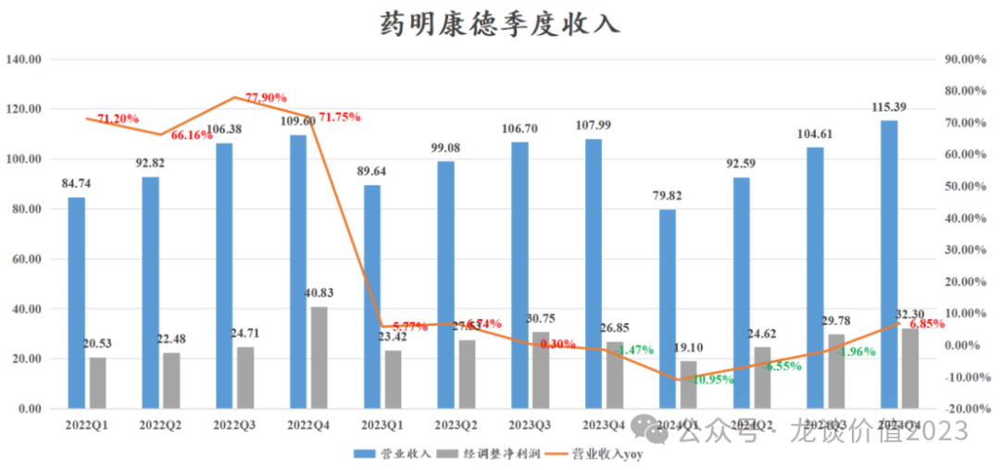
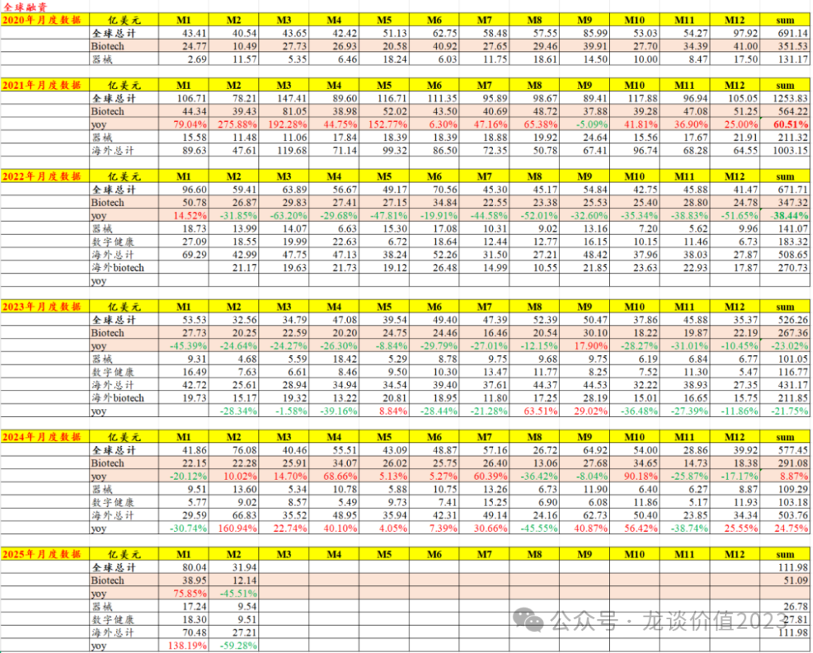
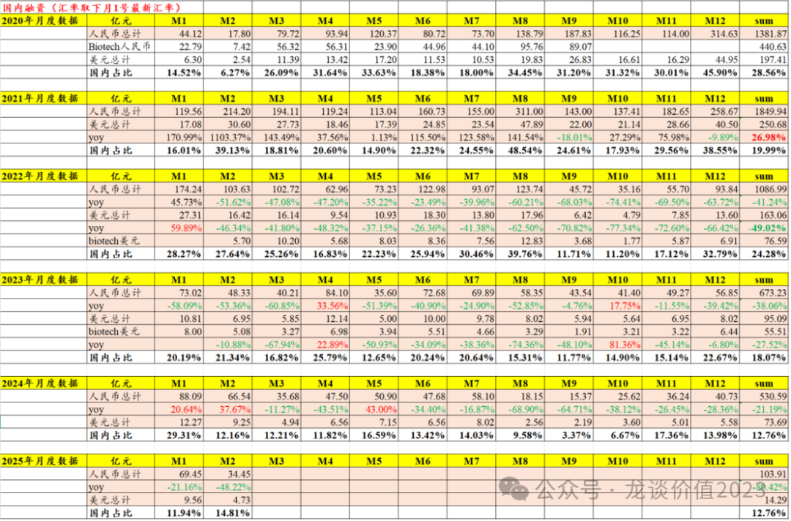

# CXO王者归来

大家好，我是龙哥。

昨晚CXO龙头药明康德披露了24年的财报，今早一早听了他们的业绩会电话会议，今天和大家聊聊药明康德的年报情况。

24年的药明康德乃至整个药明系，都是经历了较为艰难的一年，整个行业的下行期带来的订单价格压力、中美政治因素对其订单和经营层面的影响、新冠的高基数等，都直观的显现在业绩上，使得24年海外创新药一级市场融资虽然开始触底修复，但CXO公司的业绩、尤其是早期研发CRO业务并未有显著修复、还在持续承压。

在此背景下，如何看待公司后续的业绩趋势呢，待我们本文聊聊看。

1、总体业绩情况

药明康德2024年收入392.41亿元同比-2.73%（指引383亿-405亿，基本位于中位数附近），经调整归母净利润105.8亿元同比-2.53%，经调整净利率26.96%同比持平（指引持平），毛利率41.48%同比提升0.30%。

Q4单季度营收115.39亿元+6.85%创历史新高，这也是继过去连续4个季度的收入下滑后首次收入转正，经调整净利润32.3亿元+20.3%，同样是下滑4个季度后的首次转正，但还未能突破新冠商业化大单带来的利润高点。Q4单季度毛利率43.47%同比提升2.62%，经调整净利率27.99%同比提升3.13%。

表现更亮眼的是订单方面，截至24年底公司在手订单493.1亿元同比增长47%，其中TIDES业务的在手订单同比增长103.9%，应该是贡献了重要的增量。

24H1/24Q3/24年底的在手订单分别为431亿+33.2%、438.2亿+35.2%、493.1亿+47%，Q4订单出现同环比的显著增长，不过公司表示不要过于关注季度波动、也与部分商业化生产的大单有关。

2、板块分部

①WuXi Chemistry

化学板块2024年收入合计290.52亿同比-0.41%，其中四个季度同比增速分别为-13.53%、-5.50%、+1.43%、+12.95%，增长趋势逐季度修复。

化学板块的增长全部来自TIDES部门（多肽和寡核苷酸）的贡献，小分子CDMO收入178.7亿元同比-1.87%、剔除新冠商业化大单后同比增长6.4%；TIDES部门收入58亿元+70.1%；以此计算，药物发现板块收入53.82亿同比-28.72%，估计是因为下滑太多，公司没有单独披露该业务板块的收入。

TIDES部门四个季度的收入分别是7.8亿、13.0亿、14.7亿、22.5亿，预计公司充分受益于GLP-1为主的多肽药的需求爆发，尤其是礼来替尔泊肽的生产需求，24年TIDES部门客户数同比+15%达到161个、项目数同比+22%达到326个。

药物发现板块Q1-Q4的同比增速分别-17.5%、-38.2%、-26.4%、-32.6%，单季度收入在13亿左右，尚未有复苏。

小分子CDMO项目数合计3377个，其中商业化项目数72个同比增加11个，III期项目数80个同比增加14个，III期和商业化订单合计增加了25个。

②WuXi Testing

测试业务板块2024年收入56.71亿元同比-13.29%，包含剥离了医疗器械测试业务。

其中实验室分析与测试收入38.6亿同比-19%、其中安评业务-13%，临床CRO/SMO收入18.1亿+2.84%。

分四个季度来看，测试业务的下滑仍在扩大，Q1-Q4的同比增速分别为+2.60%、-6.74%、-9.04%、-37.71%，总体实验室分析和测试业务仍在下滑、临床CRO/SMO业务表现相对稳定。

业绩交流中公司也表示订单价格因素对分析测试和临床CRO/CMO业务的影响还会持续到今年上半年，但目前新的签单已经看到订单价格的回升。

③WuXi Biology

生物板块2024年收入25.44亿元同比-0.34%，四个季度的同比增速分别为-2.81%、-6.08%、-0.06%、+8.38%，Q4也是首次收入同比转正，单季度收入创历史新高突破7亿元，24年新分子种类业务收入占比超过28%，非肿瘤业务收入同比增长29.9%。

总体来看三大业务板块中，化学板块的TIDES部门继续拉动公司业绩企稳，测试业务板块表现较差，生物板块基本符合预期。

公司24年剥离了细胞基因治疗CTDMO部门以及美国的医疗器械测试部门，这两项业务在24年合计贡献13.2亿收入和5亿的亏损，这两项业务目前已经完成交割，这样药明康德在25年的利润率还将获益于此而有所提升。

3、业绩指引

2025年的指引包括几个方面：

业绩方面，公司指引25年持续经营业务收入同比增长10%-15%至415亿元-430亿元，其中指引TIDES部门同比增长60%以上，也即TIDES部门收入要达到93亿元以上，贡献35亿元以上的收入增长，公司对25年可持续经营业务的增长目标合计是35亿元-50亿元（379亿元增长到415亿-430亿元），意味着TIDES部门仍然贡献大部分的收入增量；利润端预计25年经调整Non-IFRS归母净利率水平进一步提升（包含以上剥离亏损业务的影响）。按公司经调整归母净利润的指引计算，25年的估值大概在15.4倍PE。

资本开支方面，23-24年公司资本开支分别是55亿元和40亿元，公司预计25年资本开支70-80亿元（同比+75%-100%），且预计26年capax仍将维持在较高水平，主要是目前国内外都进入新一轮的产能密集建设期，新产能的投入绝大部分还是D&M的产能建设，其中就包括了瑞士的制剂产能扩产、美国新建制剂产能以及新加坡新建API产能，美国制剂产能预计26年投产、新加坡API产能预计27年投产，也是以此希望降低客户对全球化产能布局和降低政治风险的担忧。

公司预计25年自由现金流40-50亿元，对应经营现金流110亿-130亿元，与23-24年接近的水平。

公司同时推出25亿港元的H股奖励信托计划，25年收入达到420亿元时可授予15亿港元，收入达到430亿元可授予全部25亿港元，授予的股份将回购H股股份实现；公司另外计划回购10亿元A股，可能用于股份注销。

药明康德2024年Q1收入占全年20.34%，公司预计25Q1的收入占全年也是20%左右，以此计算Q1单季度的收入同比增速可能在7%-8%左右，剥离亏损业务导致的亏损减少可能使得Q1的利润增速还要略好一点。

4、风险点

公司目前风险点主要有3点，主要还是围绕政治风险。

第一是生物安全法案，自从去年没有通过夹带方案通过后，至今没有新的进展，阶段性的市场预期是好转的，不过并不是高枕无忧，还要持续关注。

第二是关税的影响，这个公司认为是全球所有公司的不确定性、不只是公司一家的问题，对业务的影响目前公司也说不准。

第三是公司增长最快的多肽药物方面核心驱动力就是GLP-1相关药物、尤其是替尔泊肽，而礼来目前投入重金自建产能，公司认为海外MNC的产能建设、能力建设再到产能投产都还需要较长的时间。

5、行业融资数据

最后更新一下全球一级市场融资数据的情况。

......

近期重点文章（可直接点击下列链接查看）：

《[医药小甜甜变成牛夫人](https://mp.weixin.qq.com/s?__biz=MzkyMzQ3MDc3Mw==&mid=2247484243&idx=1&sn=f7fc900d2a6c1f8101fd8cb3c572425a&scene=21#wechat_redirect)》

《[美国药品大降价](https://mp.weixin.qq.com/s?__biz=MzkyMzQ3MDc3Mw==&mid=2247484234&idx=1&sn=28cf6165faae82f398c9afb5f39bd641&scene=21#wechat_redirect)》

《[中国创新药出海双王已立](https://mp.weixin.qq.com/s?__biz=MzkyMzQ3MDc3Mw==&mid=2247484223&idx=1&sn=8607586f00583da6b063edd81ede3f5b&scene=21#wechat_redirect)》

《[生物药龙头关键年](https://mp.weixin.qq.com/s?__biz=MzkyMzQ3MDc3Mw==&mid=2247484213&idx=1&sn=e31cea42ba599a77117d7d7daf895fec&scene=21#wechat_redirect)》

《[黎明前的黑暗](https://mp.weixin.qq.com/s?__biz=MzkyMzQ3MDc3Mw==&mid=2247484184&idx=1&sn=55ec711da3240320949b76ae746cc139&scene=21#wechat_redirect)》

《[中国创新药出海之王](https://mp.weixin.qq.com/s?__biz=MzkyMzQ3MDc3Mw==&mid=2247484173&idx=1&sn=52dcb6390d13960d7ec157efb9ec76f6&scene=21#wechat_redirect)》

《[创新药巨头狂飙](https://mp.weixin.qq.com/s?__biz=MzkyMzQ3MDc3Mw==&mid=2247484144&idx=1&sn=0b26f935e3f7a1a6248b091a6c0ec916&scene=21#wechat_redirect)》

《[最全ETF梳理](https://mp.weixin.qq.com/s?__biz=MzkyMzQ3MDc3Mw==&mid=2247484135&idx=1&sn=2a8555f0200922f90e82d51562574545&scene=21#wechat_redirect)》

《[生物科技的狂欢](https://mp.weixin.qq.com/s?__biz=MzkyMzQ3MDc3Mw==&mid=2247484124&idx=1&sn=233fb7eda9c948a508908c6a66a6a4d0&scene=21#wechat_redirect)》

《[两个资产配置的重点方向](https://mp.weixin.qq.com/s?__biz=MzkyMzQ3MDc3Mw==&mid=2247484114&idx=1&sn=9d862ed9cfbfe39f4608466e3943f3e8&scene=21#wechat_redirect)》

《[医药行业趋势展望](https://mp.weixin.qq.com/s?__biz=MzkyMzQ3MDc3Mw==&mid=2247484101&idx=1&sn=febb0b581f3311f2fb2477ef02efdb50&scene=21#wechat_redirect)》

《[医疗AI大爆发](https://mp.weixin.qq.com/s?__biz=MzkyMzQ3MDc3Mw==&mid=2247484088&idx=1&sn=e2ebcdb46098eb9eda92d51b0c6d76bc&scene=21#wechat_redirect)》

《[非典型利空](https://mp.weixin.qq.com/s?__biz=MzkyMzQ3MDc3Mw==&mid=2247484042&idx=1&sn=7f0001decb5fca1b658ec50e1c995893&scene=21#wechat_redirect)》

《[中国医药历史性事件](https://mp.weixin.qq.com/s?__biz=MzkyMzQ3MDc3Mw==&mid=2247484024&idx=1&sn=4d42f6d88e255b20f426271c9be37b88&scene=21#wechat_redirect)》

《[最重要行业拐点](https://mp.weixin.qq.com/s?__biz=MzkyMzQ3MDc3Mw==&mid=2247483961&idx=1&sn=a6c753e24d874e551a8d2eebbfb515dd&scene=21#wechat_redirect)》

风险提示：本文仅讨论行业/公司经营情况，投资需综合考虑公司经营、估值、管理层等多方面因素，建议读者审慎参考，本文不作为投资依据，不建议大家根据本文做出投资计划。

<!-- wxmp-comments-begin -->

---

## 留言（8 条，含回复共 16 条）

- **ava** 👍5 · 2025-03-18 10:19
  最近高产似...大神[旺柴]
  - ↳ **作者** · 2025-03-18 10:26
    高产似什么，你好好说，别打错字啊[旺柴]
    借你这条再说一下，大家记得把公众号加星标啊。以及给大家分类整理好了历史文章，就在公众号主页，请鉴赏[呲牙]
- **Anna Tian** 👍4 · 2025-03-18 10:16
  龙大恒生etf回本了[调皮][调皮][调皮]
  - ↳ **作者** · 2025-03-18 10:22
    不容易，看了下历史留言，去年9月最悲观的时候你在留言问医药etf还有救吗，当时能想到时隔不到半年能这样逆转吗[加油]
- **君莫笑** 👍2 · 2025-03-18 10:13
  龙哥，刚好最近想请教您关于CXO这个行业的问题，ADC&nbsp;CDMO这个细分赛道值得高看一眼吗，我看港股里面的东曜药业，目前市值连药明合联的1/30都不到，是这个行业的马太效应导致的吗，这里面有没有预期差呢，谢谢
  - ↳ **作者** · 2025-03-18 10:21
    这两年我们一直说CXO就俩高景气赛道，一个ADC，一个多肽，高不高看一眼也不是现在才去考虑的事。但你看ADC CDMO都看到东曜了，确实有点小众，东曜收入绝大部分还是来自贝伐珠。
- **fengzhy** 👍1 · 2025-03-18 10:16
  龙哥最近高产呀[呲牙]信心回来了
  - ↳ **作者** · 2025-03-18 10:51
    [呲牙]
- **Andy² º ²  ⁶** 👍1 · 2025-03-18 10:20
  测试和器械测试会什么会下滑这么多呢
  - ↳ **作者** · 2025-03-18 10:26
    量价齐跌，尤其是价格因素影响比较大。
- **水木二师兄** 👍1 · 2025-03-18 11:58
  龙哥，药明生物是ADC吗
  - ↳ **作者** · 2025-03-18 12:16
    药明合联。药明生物是控股药明合联。
- **谢东颖 Donyyy Tse** · 2025-03-18 11:59
  龙哥这个
  龙哥这个是关注第几年？
  - ↳ **作者** · 2025-03-18 12:17
    这个号是2年，前一个号不知道你是什么时候关注的[笑脸]
- **江油褀源电脑-复印机打印机维修站** · 2025-03-18 12:25
  龙哥，15.4PE是截止昨天收盘价吗？
  - ↳ **作者** · 2025-03-18 17:31
    是的，A股的。H股还要再低点。

<!-- wxmp-comments-end -->
