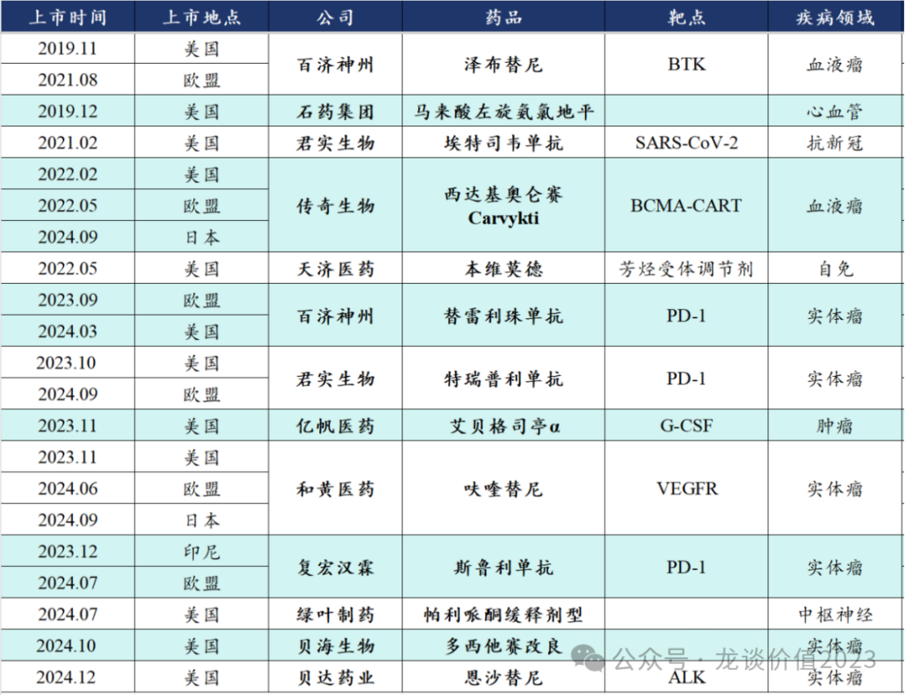
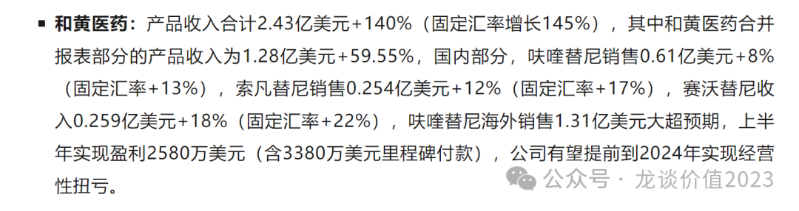
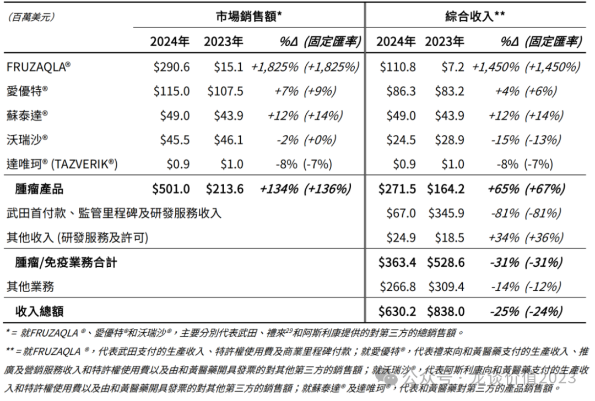
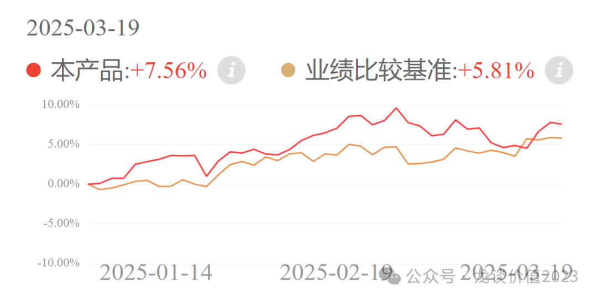
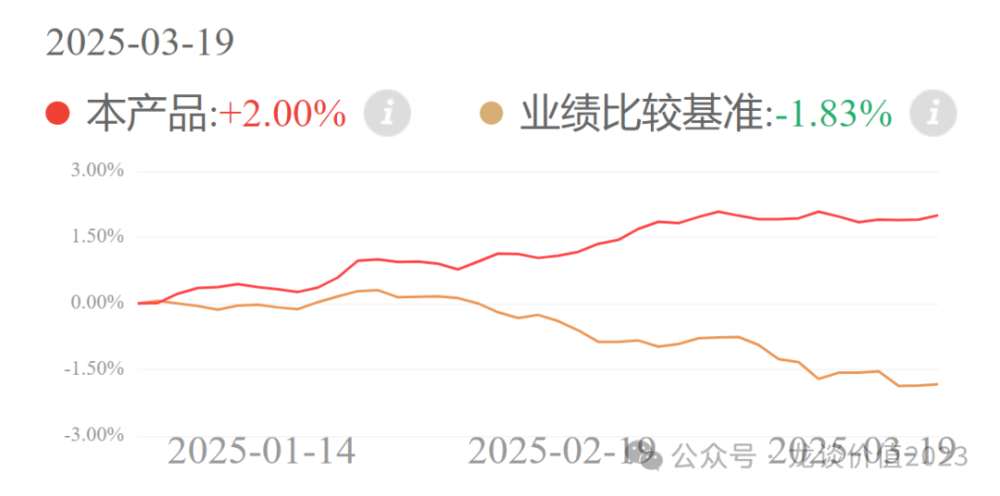

# 创新药出海，分歧时刻

大家好，我是龙哥。

大家如果读读龙哥的历史文章就知道，目前国产创新药的海外授权的规模已经相当之大，合计数量已经接近200个，但截止到目前，中国创新药真正在欧美市场获批上市的，仅有以下13个品种，而其中截止到24年底实现一定规模的商业化放量的品种，实际上只有三个，分别是百济的泽布替尼、传奇的西达基奥仑赛和和黄医药的呋喹替尼。

在前面的文章《[创新药巨头狂飙](https://mp.weixin.qq.com/s?__biz=MzkyMzQ3MDc3Mw==&mid=2247484144&idx=1&sn=0b26f935e3f7a1a6248b091a6c0ec916&scene=21#wechat_redirect)》、《[中国创新药出海双王已立](https://mp.weixin.qq.com/s?__biz=MzkyMzQ3MDc3Mw==&mid=2247484223&idx=1&sn=8607586f00583da6b063edd81ede3f5b&scene=21#wechat_redirect)》里分别聊了百济、传奇的24年财报情况，今天再聊一下创新药出海商业化放量的第三家——和黄医药24年的财报。

1、业绩情况

公司2024年收入合计6.30亿美元同比-24.80%，归母净利润0.377亿美元同比下降62.60%，净利率5.98%，考虑23年扭亏主要是收到较多呋喹替尼海外授权的首付款，24年为和黄医药首次凭借产品销售实现经营性扭亏。

《[最重要行业拐点](https://mp.weixin.qq.com/s?__biz=MzkyMzQ3MDc3Mw==&mid=2247483961&idx=1&sn=a6c753e24d874e551a8d2eebbfb515dd&scene=21#wechat_redirect)》的含金量还在提升......

和黄医药的收入分为三部分，分别是创新药产品收入、里程碑及研发服务收入、医药流通板块收入，前两部分构成公司核心的肿瘤/免疫业务分部。

2024年和黄医药肿瘤/免疫业务分部的收入为3.63亿美元同比下降31.25%，其中产品收入合计5.01亿美元同比增长134.55%、合并报表的产品收入合计为2.72亿美元同比增长65.35%，24H2为1.44亿美元+70.87%。另外医药商业部门收入2.67亿美元同比下降13.77%。

产品收入与和黄医药合并报表的产品收入有一定差距主要是因为几款商业化产品与MNC的授权合作销售分成的影响。

海外呋喹替尼销售超预期带动公司下半年收入进一步加速增长，呋喹替尼24年合计销售额2.906亿美元，其中24H2销售1.60亿美元环比增长22%，日本、欧洲等美国以外核心区域刚开始商业化放量，欧盟是2024年6月获批，还要有欧洲各国谈判纳入医保的过程，实际商业化时间并不长，日本则是24年9月获批上市，这是呋喹替尼海外合作方武田制药的本土战场，欧盟和日本这两个市场在25年还会有较大的增长空间。

和黄在24年对呋喹替尼海外收入合并报表合计1.108亿美元，其中包括0.104亿美元的产品供应收入，占呋喹海外收入比重的3.6%，以及特许权使用费0.71亿美元，占终端销售额的24.4%。

全年的利润端略超预期，主要是毛利率提升+控费，公司24年全年毛利率44.64%，其中24H2的毛利率47.99%环比提升6.90%、同比提升5.71%；另外公司对销售及管理费用率进行了控费，按产品销售额计算的销售及管理费用率合计是41.58%同比下降了39.53%，在biopharma中已经是比较低的费用率水平，也主要是其呋喹替尼海外收入基本不需要费用支出；另外研发费用2.12亿美元同比下降30%，也基本符合公司指引。

2、研发管线进展

①赛沃替尼：国内一线MET+ NSCLC适应症获批上市，赛沃替尼24年受到几个竞品上市影响、销售是下滑的，新增一线适应症后25年有望重回增长；国内二线MET突变+EGFR TKI经治NSCLC达到III期终点并申报上市、预计25年底有望获批，海外达到注册II期终点；全球联合奥希替尼的一二线EGFRm NSCLC在III期临床入组中。

②呋喹替尼：24年12月新增二线子公司内膜癌适应症，25年3月二线肾癌达到II/III期终点也即将NDA。24年呋喹替尼国内遭遇重大失利，呋喹替尼原本预期国内最大的适应症——二线胃癌最终没能获批，呋喹替尼与进口的雷莫西尤单抗一样达到了PFS终点、未达到OS终点，但进口高价雷莫西尤单抗获批、国产呋喹替尼被拒，CDE的审批有时候也难以捉摸。

③索乐匹尼布：ITP适应症预计25年底获批上市，比预期的晚了1年时间，预计同时也可能会影响海外临床的推进速度，进而影响索乐匹尼布的海外BD授权，对和黄医药来说是24年比较大的一个负面影响因素；另外温抗性溶血适应症预计25H2完成II/III期临床患者入组。

④索凡替尼：联合卡瑞利珠单抗一线胰腺癌已经完成II/III期临床中的II期临床部分患者入组，预计2025年底公布II期临床数据。胰腺癌是非常难做的适应症，失败风险挺高的，所以虽然公司看到IIT研究很好的数据，还是先保守的看看II期数据再决定要不要推III期也是对的，更何况即便II期结果很好也未必表示III期就一定能成功。

⑤他泽司他：三线FL预计25年初获批上市，联合来那度胺+利妥昔单抗二线FL的全球III期中国部分在入组。这款和黄医药唯一外部BD引进的品种，市场空间相对局限。

⑥FGFR1/2/3抑制剂：完成FGFR2融合阳性肝内胆管癌的注册II期患者入组。

⑦IDH1/2抑制剂：启动二线IDH1/2突变的急性髓系白血病中国III期临床。

⑧OX40单抗（IMG-007）：这个分子的关注度不高，和黄医药在2021年把OX40单抗和BTK抑制剂两个自免领域的分子授权给了创响生物，和黄拿到创响生物7.5%的股权，并且每款药物和黄可以获得最高9250万美元的开发里程碑付款和1.35亿美元的商业销售里程碑付款，以及商业化后销售分成，合计里程碑付款4.55亿美元。创响生物在1月10日发布了IMG-007在特应性皮炎的IIa期临床数据，数据评估了来自美国和加拿大的13例患者，在第0/2/4周共3次给药，给药后第16周，EASI评分较基线平均下降77%，54%的患者达到EASI-75改善，IMG-007未来有望做到12周到24周的给药间隔，在给药间隔上可能实现较大的提升，由此有机会成为下一代较有潜力的特应性皮炎创新疗法。

3、业绩指引

公司对25年的肿瘤/免疫业务的收入指引是3.5亿-4.5亿美元，同比-3%-+24%，中位数4亿美元同比增长10%，给的指引比较保守。我对其25年收入预期是产品合并报表收入3.53亿美元+30%，肿瘤/免疫业务收入4.52亿美元+24%。

利润端有一个影响因素，和黄医药此前对上海和黄药业持股50%，24年贡献了0.47亿美元的合并报表的利润，而公司出售45%的股权后上海和黄药业贡献的联营企业经营利润会大幅减少。

截至2024年底在手现金60亿元、有息负债6亿元、净现金54亿元，公司于24年底公告出售上海和黄45%股权将获得44.8亿元，合计在手净现金98.8亿元，利息收入预计会增加一点。

不考虑100亿在手净现金的情况下，预计和黄医药当前产品合并报表收入对应的25-26年PS估值分别为7.6倍、5.9倍，且随着呋喹替尼海外的放量——销售分成几乎是纯利润——和黄的利润端将会看到快速的爆发，26年大家将会看到PE估值的和黄医药。

4、风险点

和黄医药在去年下半年以来股价走的非常纠结，一方面是国内的销售持续miss、24Q3又出现呋喹替尼海外环比没有增长，另一方面是如呋喹替尼二线胃癌、赛沃替尼海外用注册II期申报、索乐匹尼布国内获批等对和黄医药估值影响较大的关键性进展都失败或延后。

短期更大的分歧点，来自其和记黄埔的股东背景，背后的大老板近期卖港口的事情对舆情影响非常大，虽然和黄医药的经营是很独立的，但其大股东背景带来的舆情的持续性和长期影响还有待观察。

......

最后再提一下我跟投的两个组合：具体介绍在《[两个资产配置的重点方向](https://mp.weixin.qq.com/s?__biz=MzkyMzQ3MDc3Mw==&mid=2247484114&idx=1&sn=9d862ed9cfbfe39f4608466e3943f3e8&scene=21#wechat_redirect)》。

①龙谈医药科技组合：

龙谈医药科技组合是50%的美股科技+50%的AH医药，核心目的是投资具有长期成长价值、并且具有极低相关性的中美市场两大行业，从而提高组合抵抗单一市场回撤风险的能力。

专业的FOF管理人选择优质的AH医药基金+美股科技基金，在今年美股科技表现非常弱的情况下仍跑赢国内宽基指数。

②龙谈美元债组合：

在今年仅仅2个月的时间，国内债券的业绩基准跌了1.83%，对于固收产品来说是较大幅度的回撤了，而配置美元债的组合两个月实现了2.00%的回报率，对于固收产品来说是较大幅度的短期收益了。

中美债市近期波动幅度都很大，我们看好中长期美债高基本票息+未来降息带来的美债上涨空间，但短期还有另一个影响因素是汇率，汇率的波动对大家来说是独立在美债波动之外的盈亏，持有美债资产主要的风险是人民币大幅升值——美元大幅贬值的风险，但如果人民币大幅升值、美元大幅贬值，意味着美国经济衰退预期强烈，对应美债利率下行空间较大，而组合管理人选择的都是长久期的美债，美债下行带来的资本利得收益可以对冲美元贬值的损失，是的组合收益更加稳健。

风险提示：本文仅讨论行业/公司经营情况，投资需综合考虑公司经营、估值、管理层等多方面因素，建议读者审慎参考，本文不作为投资依据，不建议大家根据本文做出投资计划。

<!-- wxmp-comments-begin -->

---

## 留言（6 条，含回复共 13 条）

- **王熙** 👍4 · 2025-03-20 11:46
  学习了，这种专业文章，一般地方都看不到
  - ↳ **作者** · 2025-03-20 12:03
    再次提示大家，公众号主页下方，帮大家整理了历史文章合集，会隔几天给大家更新一次合集~
- **听雨** 👍3 · 2025-03-20 11:53
  浩欧博怎么看，龙哥
  - ↳ **作者** · 2025-03-20 11:54
    就看你怎么对他做定性，我自己理解吧，如果作为1177在A股买了个壳，未来有一些资产注入的预期，那现在这五六十亿的估值客观来说也合理，你要说目标估值看到多少那得看1177后续具体的操作，但至少我不认为1177只是单纯想做IVD业务，毕竟前面还在剥离非药资产呢。
- **笑看风云** 👍2 · 2025-03-20 11:58
  感觉金斯瑞的业增速不明显，龙哥怎么看后续金斯瑞的发展空间，谢谢
  - ↳ **作者** · 2025-03-20 11:59
    传奇生物已经不再并表，后面价值兑现和股东回报就看对传奇生物股权的处理方式。传奇以外的业务，确实相对平淡，在CXO这么差的这几年他们生命科学业务还算是稳健的，但也缺乏弹性。
- **王晓洋 Rita** 👍2 · 2025-03-20 12:10
  还有基石的舒格利单抗PDL1
  - ↳ **作者** · 2025-03-20 12:14
    是的是的，整漏了[尴尬]
  - ↳ **作者** · 2025-03-20 12:19
    更新过的[机智]
- **旅行到地球的边缘** 👍2 · 2025-03-20 12:17
  请问医疗Etf,&nbsp;生物医药etf,&nbsp;创新药etf,&nbsp;医疗器械etf这几个哪个目前估值水平更低？未来更有潜力？
  - ↳ **作者** · 2025-03-20 12:23
    ETF的选择，可以翻翻前面的文章，专门写ETF的。
    细分行业选择上，创新药现在是国内外产业趋势都相对清晰的，因此去年下半年以来创新药普遍表现还是比较强的，在医药里算是领涨的。器械和服务这边，实际上估值也没有特别便宜，主要是政策面还没有出清，挑挑个股还是有些公司有看点的，板块性机会我感觉可能要看到政策面的变化。
- **H安逸** 👍2 · 2025-03-20 12:27
  恒瑞落后了？
  - ↳ **作者** · 2025-03-20 12:30
    翻翻前面的文章吧，这同一个问题也不能一直重复的问[捂脸]

<!-- wxmp-comments-end -->
