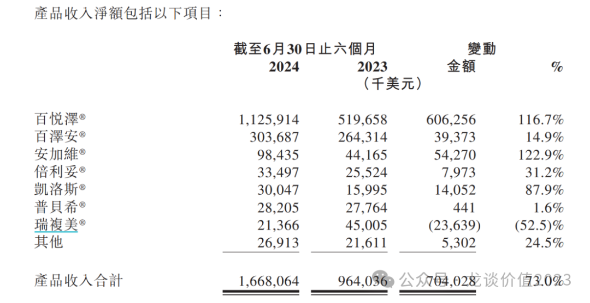
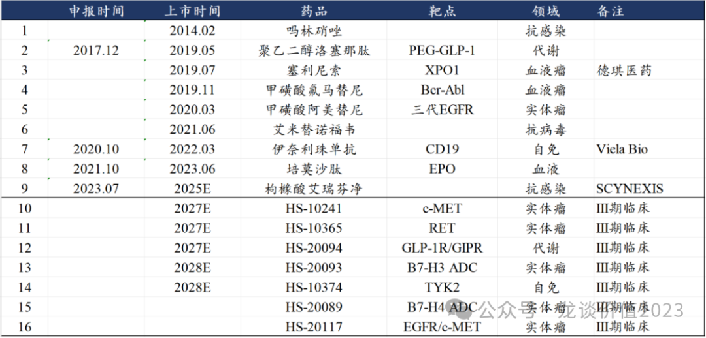
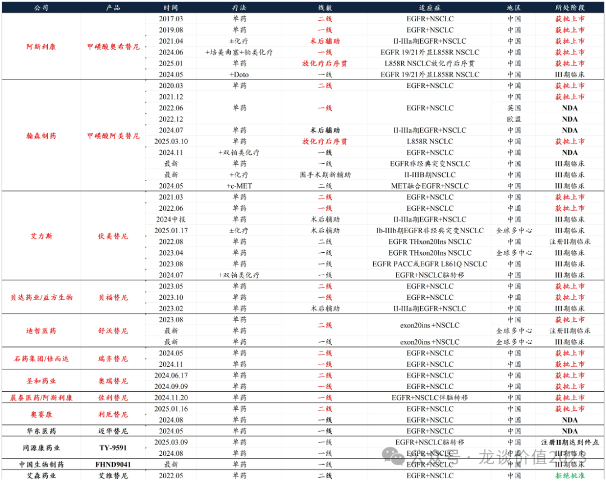
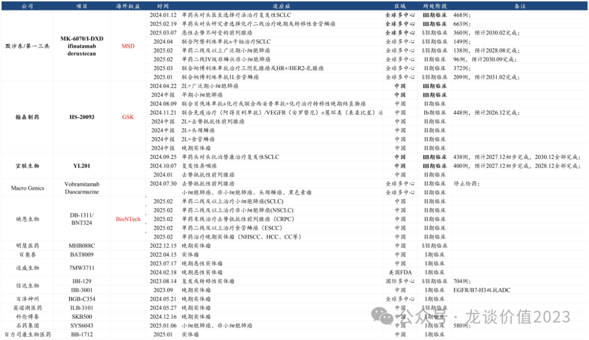

# 又一家百亿创新药巨头出现

大家好，我是龙哥。

继2023年百济神州创新药收入突破100亿、恒瑞医药创新药收入达到100亿后，2025年下一家国产创新药企业的创新药产品收入将突破100亿元大关，那就是恒瑞医药的“夫妻店”——翰森制药。另外传奇生物、中国生物制药、信达生物也将在26年前后陆续突破100亿的创新药收入。

国产创新药企业蓬勃发展！

以上公司中，百济神州和传奇生物已经是国产创新药出海的两大龙头，泽布替尼和西达基奥仑赛在25年预计分别达到35-40亿美元和19亿美元的全球销售额，而恒瑞医药和翰森制药在这两年也对海外授权了多个创新药分子。出海能力与其研发实力、创新药收入体量，呈现非常高的相关性。

即便是国内创新药政策面在近两年有非常大的改观，我们依然高度重视创新药出海的标的，主要有几点原因：

①创新研发实力：真正优秀的品种一定有很高的出海的价值。别给我讲什么海外研发成本高开不起临床，能在全球市场有竞争力的药根本不愁资本和海外药企不识货，在国内吹的再牛的Best in Class、海外没人要，那也是白搭。像最近某公司授权海外的所谓潜在BIC的Claudin18.2-ADC，海外I期临床数据过差导致被退回，也是很难看。

②透明化：看多了海外药企的财报，再看国内药企的财报，容易应激。创新药出海做的最好的百济神州，他的财报会和海外药企一样，把重点产品的销售额给你拆的明明白白，同样在美股上市的再鼎、和黄等也都能给你拆清楚。

国内传统药企，有一个算一个，产品收入得好好藏着掖着，生怕被别人拆清楚。新兴的biopharma和biotech，也只有一部分是愿意给你清晰的销售数据的。

如果连核心产品收入都不敢披露，左怕医保局查账、右怕竞争对手看到，还谈什么对国内创新药行业的信心。

③全球市场化竞争：创新药的竞争早已经不是国内市场和国际市场独立竞争，全球化市场竞争是必然的趋势。海外创新药在国内和欧美上市的时间差在持续的缩短，国内fast follow的空间在被压缩。如IL-17A等市场此前预期较高的大品种，待到国产同靶点的fast follow药物上市时、进口厂商已经接近达峰，国产还能拿到多少份额实属不确定。同样的道理，能放在全球市场竞争的品种，在国内市场的竞争力大概率也不会差。

......

闲话聊完，回到今天主题，聊下翰森制药的2024年报情况。

1、业绩情况

公司2024年收入122.61亿元+21.35%，其中产品收入106.88亿元+13.66%，创新药授权收入15.73亿元+124.75%。

产品授权收入的大头来自2023年12月将B7-H3 ADC授权葛兰素史克获得的1.85亿美元首付款，2023年产品授权收入是7亿元，主要是来自23年10月将B7-H4 ADC海外权益授权给葛兰素史克的0.85亿美元首付款。另外公司24年12月授权给默沙东的口服小分子GLP-1的交易对价并未在24年确认收入，其1.12亿美元的首付款将在25年确认收入，也既25年翰森制药的产品授权收入应该还会有至少10亿元左右，如果有其他新的项目授权则会更多。

产品收入中，创新药产品收入79.04亿元同比+28%（创新药收入合计94.77亿元，扣除产品授权收入的15.73亿元），仿制药产品收入27.84亿元同比-14.04%，创新药收入高于此前我预期的76亿元左右，其中阿美替尼销售预期持续上调，公司指引阿美替尼25年收入60亿元，峰值预期从60亿元上调至80亿元。

利润端，24年归母净利润43.72亿元+33.4%，其中在手现金240亿元贡献了9.95亿元利息收入，产品授权贡献15.73亿元收入、预计贡献约13.4亿元利润，扣除以上两项后产品销售利润约为20亿元出头。

公司指引25年业绩总体双位数增长、其中创新药产品收入达到100亿元同比增长25%，另外我们预计仿制药收入25亿元左右同比-10%、假设产品授权收入10亿元（如上文所述，暂不考虑其他新分子的海外授权收入），由此预计总收入135亿元+10%。

利润端考虑海外降息可能导致利息收入有所减少、产品授权收入减少等，预计利润端在持平附近，如果要达到10%的利润端的增长，则需要有新的重磅产品授权才能完成。

估值方面，预计25年归母净利润43亿-44亿元左右，当前估值25.3倍PE。截至2024年底公司在手现金240亿元。

2、创新药管线

翰森制药目前有8款创新药商业化、1款处于NDA阶段，其中有3款是引进的品种，包括自德琪医药引进国内商业化权益的塞利尼索，以及自Viela引进的CD19单抗、自Scynexis引进的艾瑞芬净。自研方面翰森制药的代表性品种是首个国产三代EGFR抑制剂阿美替尼（2020），另外还有吗林硝唑（2014）、洛塞那肽（2019）、氟马替尼（2019）、艾米替诺福韦（2021）、培莫沙肽（2023）。

①阿美替尼

EGFR是目前国内肿瘤靶向药中的天花板，支撑起了翰森制药（千亿市值）、艾力斯（350亿市值）、贝达药业（200亿市值）、迪哲医药（200亿市值）、同源康医药（100亿市值）等公司。

2025年国内EGFR TKI预计市场规模会达到200亿，包括阿斯利康奥希替尼50-60亿，翰森制药阿美替尼60亿，艾力斯伏美替尼45亿，贝达药业埃克替尼+贝福替尼20亿，迪哲医药舒沃替尼5-6亿，以上6个品种25年预计合计销售额约180-190亿元，另外三代EGFR TKI中石药集团/倍尔达、圣和药业、晨泰医药、奥赛康/信达生物等也会有部分销售，一代和二代的吉非替尼、阿法替尼、厄洛替尼等也均有部分销售。

翰森的阿美替尼除一二线EGFRm NSCLC外，在25年3月获批了第三个适应症——III期NSCLC放化疗后维持治疗，25年还将有术后辅助治疗NSCLC和联合化疗一线治疗NSCLC两个大适应症获批，都将贡献25-26年的持续增长。

除了第三代EGFR TKI阿美替尼外，翰森制药还布局了下一代的EGFR疗法，包括小分子c-MET抑制剂+阿美替尼联用、HS-20117（EGFR/c-MET双抗，II/III期临床）、HS-20122（EGFR/c-MET双抗ADC，临床前）、HS-10504（第四代EGFR TKI，I期临床）等。

HS-20117是翰森制药自普米斯生物引进的EGFR/c-MET双抗，也是国产厂商中排名第一的进度，原本贝达药业是国内第一顺位，效率偏低被反超。海外强生是首家上市的EGFR/c-MET双抗，强生对该产品的销售峰值预期是50亿美元。

总体EGFR产品线预计未来将给翰森贡献百亿以上的创新药收入，重磅大品种的利润率和现金流也都会非常好，将在未来5-10年维度作为翰森的基本面和估值的重要组成部分。

②TYK2抑制剂

翰森制药的TYK2抑制剂是国产第一顺位进入III期临床，紧随其后的是诺诚健华的ICP-332（III期）和ICP-488（25年启动III期），以及益方生物的D-2570。

此前诺诚健华和益方生物分别发布了TYK2抑制剂治疗银屑病的II期临床数据，其中益方生物的临床数据表现尤其亮眼，用药12周的安慰剂校正后的PASI75未72.5%-77.5%，PASI90为65.7%-72.5%，PASI100为36.5%-47.5%，好于武田制药和BMS的数据，也要好于诺诚健华的II期临床数据，是潜在BIC的TYK2抑制剂。

由此，翰森制药、诺诚健华的TYK2抑制剂的竞争优势只是在研发进度上的领先，临床疗效和安全性可能不占优势，当然这还要看后续III期临床的对比。

翰森制药目前在进行TYK2抑制剂治疗银屑病的III期临床，诺诚健华的两个TYK2分子分别开的是特应性皮炎和银屑病的III期，后续益方生物很快也会启动银屑病的III期临床。

TYK2抑制剂后续更值得关注的适应症是IBD，我们在《[生物药龙头关键年](https://mp.weixin.qq.com/s?__biz=MzkyMzQ3MDc3Mw==&mid=2247484213&idx=1&sn=e31cea42ba599a77117d7d7daf895fec&scene=21#wechat_redirect)》讲信达生物的IL-23p19单抗时候提到，IL-23p19作为一款12周给药间隔的强效生物制剂，几乎是银屑病领域“杀死比赛”的药物，口服药物已经很难从IL-23p19手中抢占银屑病的市场大头。而IBD目前还处于临床疗效有较大提升空间的疾病领域，TYK2能否在IBD领域崭露头角将是直接决定其全球市场潜力的因素。

③IL-23p19单抗

翰森制药在24年4月自荃信生物合作引进IL-23p19单抗（QX004N），公司预计25年下半年推进到III期临床，按照信达生物2023年2月启动III期临床、2025年底商业化的节奏，翰森制药25年下半年启动III期临床，预计在28年底到29年实现商业化。

④GLP-1/GIPR

在文章《[药王竞争白热化](https://mp.weixin.qq.com/s?__biz=MzkyMzQ3MDc3Mw==&mid=2247484201&idx=1&sn=7d33aa996fccc6637bfa8b20d58ca64b&scene=21#wechat_redirect)》中给大家梳理过GLP-1国内的竞争格局，目前双靶点激动剂中，礼来的替尔泊肽已经获批上市，信达生物的GLP-1/GCGR玛仕度肽（自礼来引进）预计25Q2获批上市，除此以外国产的双靶点激动剂中，恒瑞医药2024M5启动减重III期临床、2024M10启动降糖适应症III期临床，翰森制药2024H2启动减重适应症III期临床，博瑞医药2024年底获批进行降糖III期临床。

翰森制药作为国产第三家、国内第四家双靶点GLP-1激动剂，预计商业化时间与恒瑞差不多，在2027年前后，比信达生物晚2年左右，叠加翰森本身有不错的糖尿病代谢销售团队和产品基础，还有比较有机会占据部分市场份额。

除了GLP-1GIPR以外，翰森制药还有口服小分子GLP-1在研，并在24年底以1.12亿美元首付款、19亿美元里程碑付款的交易对价把处于临床前的另一款小分子GLP-1（HS10535）的全球权益授权给默沙东。

⑤ADC管线

翰森制药目前有5款ADC药物处于临床阶段，包括HS-20093（B7-H3 ADC）在24年启动了针对小细胞肺癌的2个III期临床，HS20089（B7-H4 ADC）在25年3月启动了针对卵巢癌的首个III期临床，另外HS-20105（Trop2-ADC）、HS-20124（CDH6-ADC）、HS20110（CDH17-ADC）等3款药物处于I期临床。

前两款ADC药物在全球研发顺位也比较靠前，因此这两款药物的海外权益被翰森授权给葛兰素史克。B7-H3 ADC授权给GSK拿到了1.85亿美元的首付款，翰森是继第一三共后全球第二家启动III期临床，第一三共/默沙东此前启动了小细胞肺癌和食管鳞癌的III期临床。

B7-H3类似科伦博泰的TROP2-ADC，是一个泛癌种的靶点，B7-H3在小细胞肺癌、非小细胞肺癌、胃癌、胰腺癌、乳腺癌、宫颈癌、卵巢癌、子宫内膜癌、前列腺癌等诸多大癌种高表达。

公司预计国内B7-H3 ADC可以在2028年实现商业化，海外GSK预计2025年底启动注册临床。

......

总体来看，翰森制药是传统药企中最先走出仿制药集采影响的公司，2025年创新药产品收入占产品收入比重预计在80%左右，加上创新药授权收入的收入占比达到82%，翰森制药已经是一家真正意义上的创新药公司。

大品种的放量，也将使得翰森制药的产品贡献的利润显著提升，出海方面授权GSK和默沙东两家欧美MNC巨头的BD交易也是非常经典，可见的未来几年翰森都是非常值得关注的一家国内创新药头部pharma。

......

近期重点文章（可直接点击下列链接查看）：

《[创新药出海，分歧时刻](https://mp.weixin.qq.com/s?__biz=MzkyMzQ3MDc3Mw==&mid=2247484272&idx=1&sn=a5850a6c1302ac8942030e1e7c5db971&scene=21#wechat_redirect)》

《[CXO王者归来](https://mp.weixin.qq.com/s?__biz=MzkyMzQ3MDc3Mw==&mid=2247484259&idx=1&sn=1bc93a5b4d6772af4068695f22d8f23f&scene=21#wechat_redirect)》

《[美国药品大降价](https://mp.weixin.qq.com/s?__biz=MzkyMzQ3MDc3Mw==&mid=2247484234&idx=1&sn=28cf6165faae82f398c9afb5f39bd641&scene=21#wechat_redirect)》

《[中国创新药出海双王已立](https://mp.weixin.qq.com/s?__biz=MzkyMzQ3MDc3Mw==&mid=2247484223&idx=1&sn=8607586f00583da6b063edd81ede3f5b&scene=21#wechat_redirect)》

《[生物药龙头关键年](https://mp.weixin.qq.com/s?__biz=MzkyMzQ3MDc3Mw==&mid=2247484213&idx=1&sn=e31cea42ba599a77117d7d7daf895fec&scene=21#wechat_redirect)》

《[黎明前的黑暗](https://mp.weixin.qq.com/s?__biz=MzkyMzQ3MDc3Mw==&mid=2247484184&idx=1&sn=55ec711da3240320949b76ae746cc139&scene=21#wechat_redirect)》

《[中国创新药出海之王](https://mp.weixin.qq.com/s?__biz=MzkyMzQ3MDc3Mw==&mid=2247484173&idx=1&sn=52dcb6390d13960d7ec157efb9ec76f6&scene=21#wechat_redirect)》

《[创新药巨头狂飙](https://mp.weixin.qq.com/s?__biz=MzkyMzQ3MDc3Mw==&mid=2247484144&idx=1&sn=0b26f935e3f7a1a6248b091a6c0ec916&scene=21#wechat_redirect)》

《[最全ETF梳理](https://mp.weixin.qq.com/s?__biz=MzkyMzQ3MDc3Mw==&mid=2247484135&idx=1&sn=2a8555f0200922f90e82d51562574545&scene=21#wechat_redirect)》

《[生物科技的狂欢](https://mp.weixin.qq.com/s?__biz=MzkyMzQ3MDc3Mw==&mid=2247484124&idx=1&sn=233fb7eda9c948a508908c6a66a6a4d0&scene=21#wechat_redirect)》

《[两个资产配置的重点方向](https://mp.weixin.qq.com/s?__biz=MzkyMzQ3MDc3Mw==&mid=2247484114&idx=1&sn=9d862ed9cfbfe39f4608466e3943f3e8&scene=21#wechat_redirect)》

《[医药行业趋势展望](https://mp.weixin.qq.com/s?__biz=MzkyMzQ3MDc3Mw==&mid=2247484101&idx=1&sn=febb0b581f3311f2fb2477ef02efdb50&scene=21#wechat_redirect)》

《[非典型利空](https://mp.weixin.qq.com/s?__biz=MzkyMzQ3MDc3Mw==&mid=2247484042&idx=1&sn=7f0001decb5fca1b658ec50e1c995893&scene=21#wechat_redirect)》

《[中国医药历史性事件](https://mp.weixin.qq.com/s?__biz=MzkyMzQ3MDc3Mw==&mid=2247484024&idx=1&sn=4d42f6d88e255b20f426271c9be37b88&scene=21#wechat_redirect)》

《[最重要行业拐点](https://mp.weixin.qq.com/s?__biz=MzkyMzQ3MDc3Mw==&mid=2247483961&idx=1&sn=a6c753e24d874e551a8d2eebbfb515dd&scene=21#wechat_redirect)》

风险提示：本文仅讨论行业/公司经营情况，投资需综合考虑公司经营、估值、管理层等多方面因素，建议读者审慎参考，本文不作为投资依据，不建议大家根据本文做出投资计划。

<!-- wxmp-comments-begin -->

---

## 留言（11 条，含回复共 25 条）

- **暮逸尘** 👍4 · 2025-03-24 17:06
  和铂医药&nbsp;真的很牛逼。
- **勇敢的心** 👍3 · 2025-03-24 15:32
  龙大，翰森的估值看到多少？另外，石药哭晕在厕所[捂脸]
  - ↳ **作者** · 2025-03-24 15:41
    翰森中性看现在这1000多亿的估值差不多吧，后面就要看在研管线的成药了
- **刘亮** 👍3 · 2025-03-24 15:39
  为啥好的医药公司大多在港股呢
  - ↳ **作者** · 2025-03-24 15:42
    也不是，器械和服务好的公司都在A股，只是创新药相当一部分好公司在港股，而且港股估值相对低很多，A股也不是没有好公司，都是高度溢价的状态，像百济港股2000亿、A股3100亿。
- **卢剑** 👍2 · 2025-03-24 15:57
  龙哥，2025年医药和医疗的拐点到没有
  - ↳ **作者** · 2025-03-24 15:59
    创新药政策拐点在2022年底，基本面拐点在2024年，公众号几十篇文章讲完了，25年没拐点了，25年医药牛市都走了半程了，还要啥拐点。
  - ↳ **作者** · 2025-03-24 16:05
    谢谢，医药和医疗ETF感觉不是很明显，所以请教一下
- **君莫笑** 👍1 · 2025-03-24 15:16
  龙哥，请教下，映恩生物递表港交所，这公司目前合理估值大概在多少呢，谢谢
  - ↳ **作者** · 2025-03-24 15:24
    映恩生物后面会单独写一篇，争取在上市前吧。映恩还是比较值得关注的ADC领域头部biotech，对海外授权6个ADC分子+一个ADC技术平台。
- **尹** 👍1 · 2025-03-24 15:28
  康龙化成还有未来不
  - ↳ **作者** · 2025-03-24 15:40
    其实你看药明康德就能看出来，我前两天刚写了他的年报解读，药明康德如果去掉多肽和寡核苷酸这块的话也是压力非常大的，增量基本全部来自GLP-1这边，康龙这块没法和药明比，肯定就要差很多，另外药明康德之前还有合联的相当比例的股权，ADC这块也是景气度很好的细分领域。
- **姜行者** 👍1 · 2025-03-24 15:46
  夫妻合体多好，成为一骑绝尘的老大！
  - ↳ **作者** · 2025-03-24 15:48
    其实我也觉得两家有合并的条件，本来就是邻居，老板又是一家人。国内的制药行业还没进入大的并购整合和出清的阶段，我之前有次放了个国内药企数量的图，还在快速扩张中，创新药总体还是一个快速增长的增量行业，未来大家也会看到并购整合的阶段的，到时候或许两家有机会合并。
- **陈夙卿** · 2025-03-24 16:02
  信达到不了吧！它生物类似药20几亿，你觉得26年就能补上这个坑吗
  - ↳ **作者** · 2025-03-24 16:12
    信达指引的27年要做200亿收入，要是26年创新药到不了100亿，那还做个der的200亿收入啊[捂脸]
  - ↳ **作者** · 2025-03-24 16:33
    其实问题并不在于他27年卖不卖到200亿，核心还是看产品管线，想要做200亿还不简单吗，账上100亿现金，出去买几个品种凑一凑就到了，像买奥赛康那个三代EGFR之类的，但这种都没太大意义，也给不上多少估值。
- **王宁** · 2025-03-24 16:10
  龙哥，时代天使业绩挺好的呀，出海进展顺利，为啥股价这么暴跌
  - ↳ **作者** · 2025-03-24 16:13
    海外增收不增利，销售费用太高，没能减亏，平均单价下降
  - ↳ **作者** · 2025-03-24 16:13
    另外交易层面这个票这一年多，每次都有不少资金蹲业绩，股价经常出现直线上下的情况。
  - ↳ **作者** · 2025-03-24 16:25
    他问题就是之前说海外人员固定成本比较高，然后销售团队到位以后费用投入增长应该会放缓的，但他这个扣除国内之后海外的费用率太高了，有点异常吧反正是。海外我们也没法验证收入和费用的真实性。
- **方健** · 2025-03-24 17:04
  龙哥，能否说说恒瑞双抗没通过美国评审的影响
  - ↳ **作者** · 2025-03-24 17:09
    没啥影响，本来也没啥预期，要非说影响那就是没啥竞争力又落后很多的me too就别去美国报
- **建东** · 2025-03-24 17:09
  龙哥&nbsp;和黄有些低估了吧
  - ↳ **作者** · 2025-03-24 17:10
    和黄上周也讲了。短期大家肯定还是会担心长实系的政治风险，这个不好评价的。

<!-- wxmp-comments-end -->
