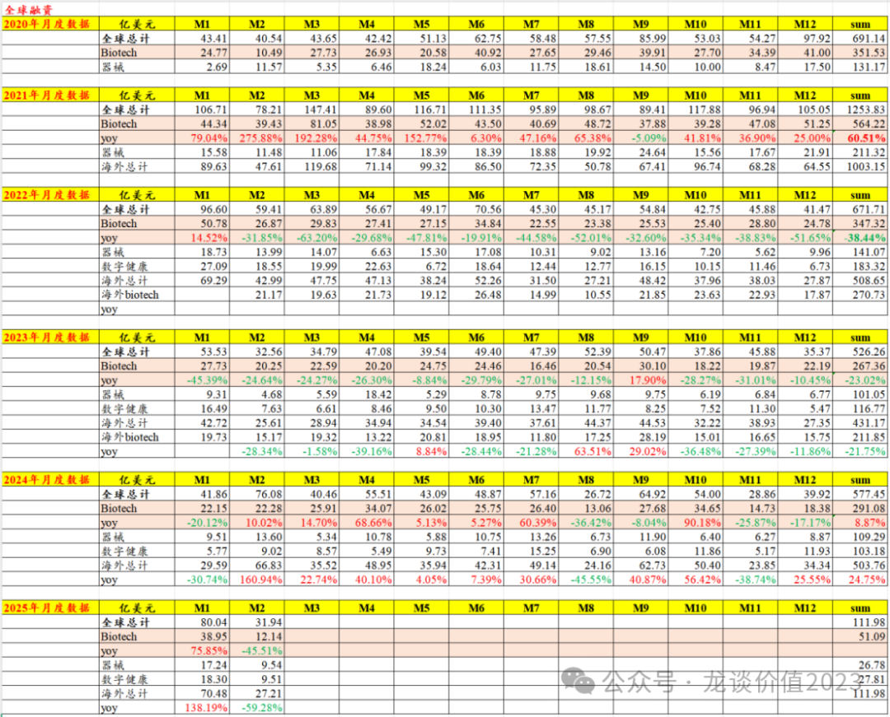
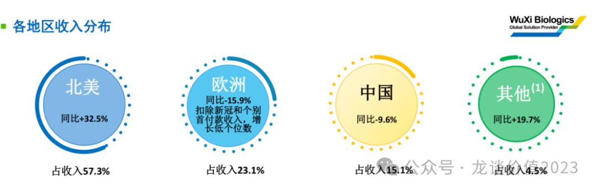
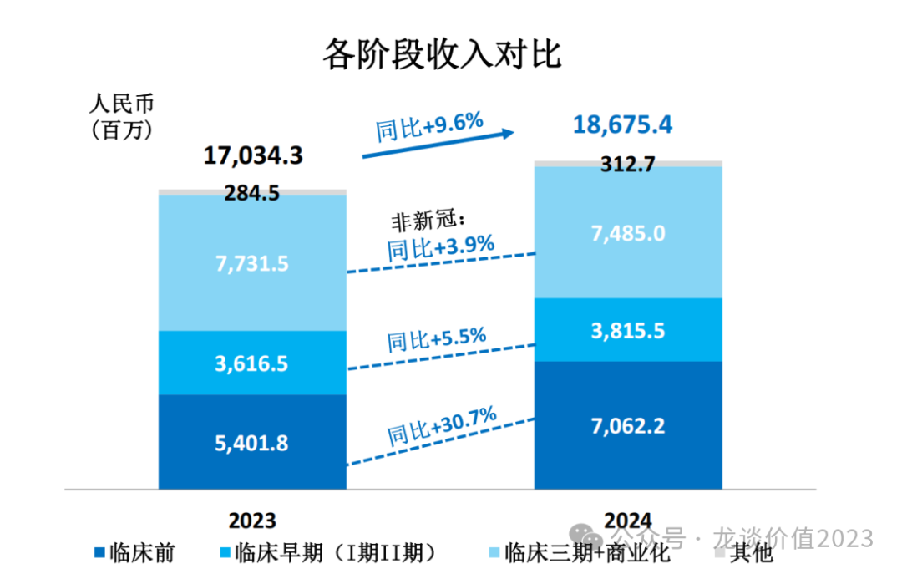
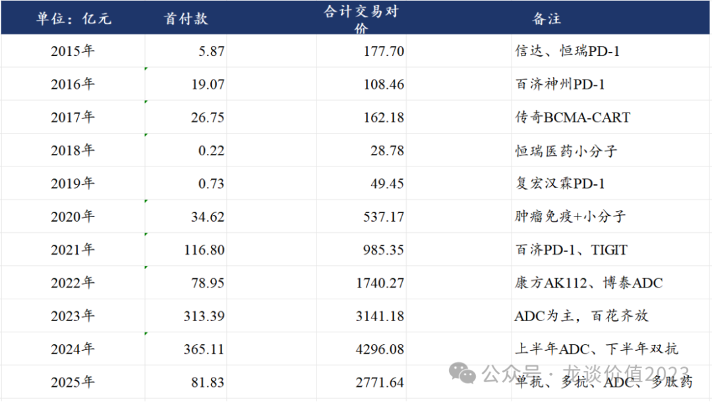
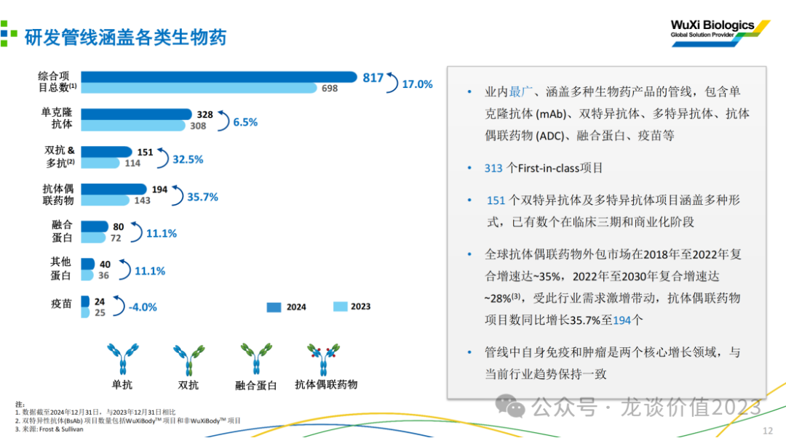
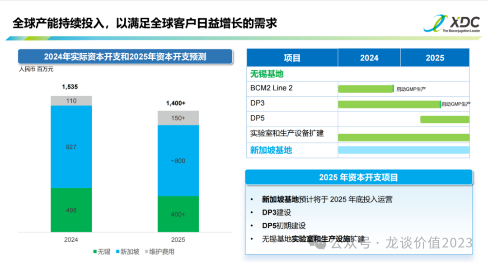
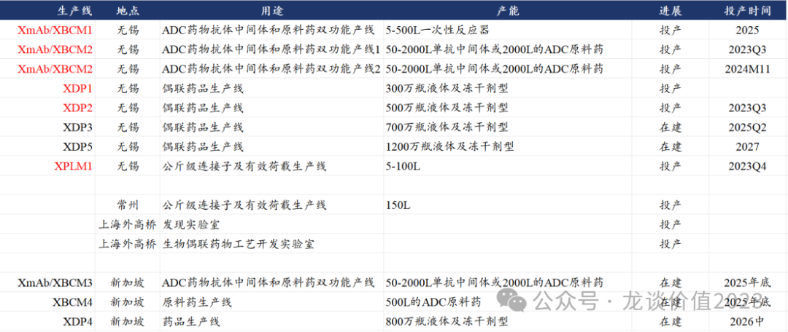
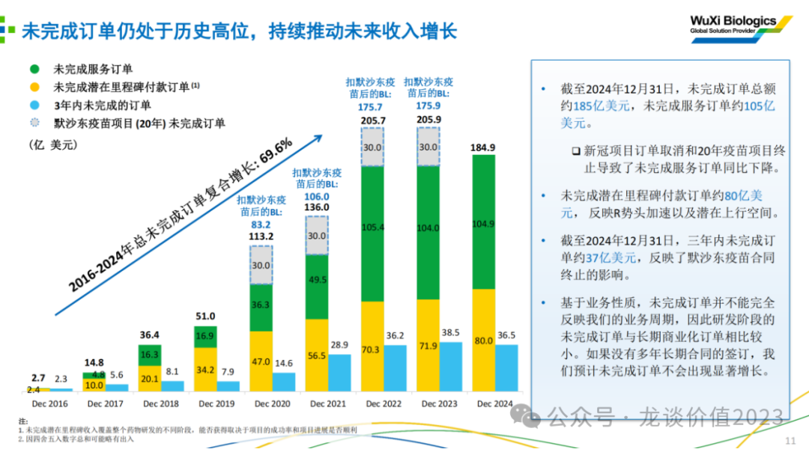
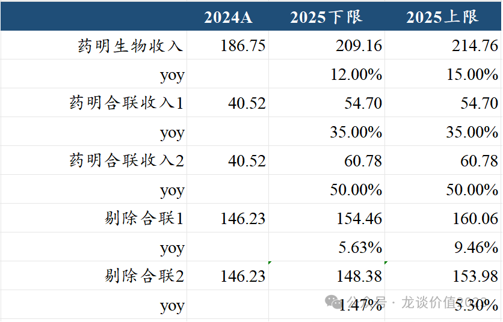

# 医药最高景气方向

大家好，我是龙哥。

前阵子给大家聊了药明康德的24年业绩情况和25年的指引，今天再聊聊药明生物和药明合联，之前我们说到CXO行业这两年有两个高景气的方向，分别是GLP-1类药物驱动的多肽药CDMO的需求和ADC类药物启动的XDC药物CDMO的需求。

药明康德在小分子药物CRO/CDMO有一定压力的情况下，借助多肽药CDMO/CMO的需求仍能实现正增长，药明生物同样如此，在单抗、疫苗药物CXO服务的需求承压的情况下，ADC药物和双抗药物的CDMO/CMO需求拉动其业务实现正增长。

这篇文章可能不会再梳理太多的财务上的数据，更多的想和大家聊聊产业趋势的问题，具体的财务数据，在药明系三家上市公司的24年报业绩PPT里非常详细，在文末分享给大家。

1、全球新药研发景气度修复

首先如果我们看全球创新药研发的景气度，最直观的指标，还是一级市场的融资情况，一方面资本投资的热情可以反映对行业的信心，另一方面biotech们拿到一级市场的资金才能加大研发投入。

如图所示，22-23年全球医疗行业融资的下滑幅度是非常大的，尤其是生物制药这边，22年同比下滑38%，23年同比下滑23%，国内的情况要比全球市场更惨烈，国内整个医疗行业的一级市场融资在22-24年分别下滑了41%、38%、21%，到2025年的前两个月依然同比下滑21%和48%。

但我们看到2024年开始海外的医疗领域融资已经出现了明显的企稳，全年全球生物医药融资同比增长9%，全年海外医疗行业融资同比增长25%。

与此同时我们看药明生物2024年的收入结构也可以与之对应上：

从地区分布来看，北美的增速最高、其次是日韩等其他市场，欧洲市场剔除新冠订单后也有个位数增长，而中国区则是有所下滑，中国区的收入在23-24年分别下滑16%和10%，已经是连续2年下滑。

从收入分部来看临床前的收入增速（与海外biotech一级市场融资→新增项目立项的关联度较高）最高，达到了30.7%，远高于临床和商业化项目的增速。同时我们测算临床前项目在24年给药明生物贡献的单个项目平均收入是1757万元同比增长10.25%，这个数字在2023年是同比下滑的，也既24年药明生物除了拿到了更多的项目数，早期项目的单价也恢复增长。

2、新药研发细分领域景气度高涨

从全球新药研发来说，可以从我国创新药海外BD授权的情况看到一些技术领域的发展趋势：

创新药的海外授权在技术领域上来说，2015-2021年这7年间基本是围绕小分子和单抗，从2022年的康方和科伦博泰两家公司的创新药出海开始，23-25年是我国ADC药物和双抗/多抗药物蓬勃发展的2年，在产品海外授权上也带来了数量级的提升，23-24年海外BD授权的总交易对价分别超过3000亿和4000亿，25年仅不到3个月就已经达到2700多亿。

海外药企愿意花大价钱BD引进的品种，实际上就能高度说明产业的风口和方向在哪里。也因此，我们看到即便在药明系有诸多经营以外的影响因素影响的情况下，药明生物2024年新增151个项目创历史新高，药明合联的综合项目数从143个增加到194个同比增长36%。

再具体来说，药明生物新增项目数中，增速最快的是抗体偶联药（XDC），项目数同比增长36%，其次是双抗/多抗，项目数151个同比增长33%，然后是融合蛋白和其他蛋白同比增长11%，单抗项目数则只有6.5%的增长。可以说药明生物最核心的增长来自ADC药物和双抗/多抗项目。

由此，如果我们看药明生物和药明合联的收入，药明生物24年收入186亿元+75%，其中XDC业务收入39.44亿元同比+106.91%，生物药业务收入147.31亿元同比-2.62%。而反映在单独上市的药明合联的报表上，其24年收入40.52亿元+90.8%、经调整归母净利润11.74亿元+185%，比前些年大家印象中高增长的药明生物的业绩增速更具爆发力，药明合联不再需要经历药明生物前期的积累客户和口碑的时间，而是直接可以获得客户的信任并大量的导入项目。

从竞争壁垒的角度来说各个技术领域也会有较大差别，如在单抗领域全球可能有30家CXO企业可以和药明生物竞争，在双抗/多抗领域全球可能有15家企业可以和药明生物竞争，而在ADC CDMO领域能和药明生物/药明合联竞争的CXO公司可能就只剩下7-8家，ADC药物需要CXO公司同时有强大的抗体、linker和小分子毒素的研发和生产能力，天然具有更高的壁垒。

3、资本开支恢复增长

订单的多少是由市场需求和企业赢单能力决定的，资本开支则是企业综合考虑经营情况做出的决定，是需要真金白银去投资固定资产从而为未来的业务扩张做准备的决策。

药明康德的资本开支巅峰在2022年，21-22年药明康德资本开支分别是69亿元和100亿元，而2023-2024年分别缩减至55亿元和40亿元，药明康德对25年的资本开支指引是75亿元，出现大幅提升。

药明生物的资本开支巅峰是在2021年，2020-2021年资本开支分别是60亿元和65亿元，随后2022-2024年持续萎缩，三年分别为54亿元、41亿元和39亿元，而药明生物对25年的资本开支指引是60亿元，同样出现大幅提升。

尤其是在政治风险的不确定性出现后，2024年药明康德和药明生物的资本开支、包括海外建厂的规划都有延后，2025年则是更加积极的推进海外建厂的计划，如药明合联这两年资本开支的大头实际上都投到了新加坡建厂，2025年底新加坡的ADC药物产能将会开始投产。

4、订单稳定、指引高增

与资本开支和对未来收入增长预期相对的是订单的增长，药明生物这边在手订单基本维持稳定，药明康德24年底在手订单493亿元同比增长47%，药明合联24年底的在手订单接近10亿美元同比增长71%。

药明生物对2025年的收入增长指引是12%-15%，药明合联对2024年的收入增长指引是35%，由于药明合联24年订单增长71%、员工人数增长73%，可以认为这是一个非常保守的指引。

根据以上指引可以做以下推算：

药明合联在25年仍将贡献药明生物非常重要的增长，药明生物25年总的收入增量预计大概在22亿-28亿，而药明合联的收入增量大概在14亿-20亿。

根据以上增长指引，药明康德、药明生物、药明合联25年的PE估值分别大概是16倍、17倍、25倍。

5、情绪面修复

药明系乃至整个CXO行业的业绩修复，对于医药行业来说影响是比较大的，不仅仅是这几家公司是否值得投资的问题，更重要的因素在于，大部分的投资人对于我们此前讲的比较多的创新药行业，实际上投资难度是很大的，创新药的未盈利、估值波动大、研究门槛高等问题，使得即便创新药港股相当一部分龙头公司已经涨了很多、乃至创了历史新高，大部分投资人还是没法在里面赚到钱。

而CXO行业的修复，除了其本身作为医药指数和医药ETF的成分股拉动指数上涨以外，还有就是其商业模式更容易被广大投资人所理解，更是上一轮医药大牛市里给大家赚到大钱的板块，因此CXO行业的修复，才更容易带动广大投资人对医药行业修复的信心和热情。

另外我们也可以看到，即便经历了这两年政治因素的波折，药明系的三家上市公司，在其各自的细分领域里的竞争力实际上都在还持续强化，行业龙头的领先优势在扩大而不是缩小，这两年国内创新药BD授权海外的诸多项目中有60%都是有药明生物的服务，其中还有一部分是使用了药明系的技术平台、未来要给药明系销售分成的。

可以说如果我们在高景气的细分领域去选择标的，多肽药CDMO领域由于药明康德总盘子太大，并未展现出来弹性，而ADC CDMO领域药明系已经把最好的成长性资产拿出来到港股上市，这是投资ADC药物领域不可能绕过的一家公司。

......

不知不觉来到3月底，这个月给大家分享了11篇文章四五万字，从国内到海外、从行业到公司，聊了很多干货，月底开一次赞赏，希望大家多多支持~

另外，文初说到的给大家分享药明系3家公司24年业绩展示PPT，大家可以在公众号主页（注意不是本文留言）发送【药明】即可获得。

风险提示：本文仅讨论行业/公司经营情况，投资需综合考虑公司经营、估值、管理层等多方面因素，建议读者审慎参考，本文不作为投资依据，不建议大家根据本文做出投资计划。

<!-- wxmp-comments-begin -->

---

## 留言（8 条，含回复共 16 条）

- **大浪淘沙** 👍6 · 2025-03-26 11:56
  虽然很多看不懂，但是感觉很厉害[强]
  - ↳ **作者** · 2025-03-26 13:18
    那就加星标多看[加油]
- **生而自由20151021** 👍5 · 2025-03-26 11:37
  高产似母猪
  - ↳ **作者** · 2025-03-26 13:17
    我谢谢你[裂开]
- **韩小平** 👍5 · 2025-03-26 13:01
  龙大的医药价值理念是新G前就关注的了，今天难得打赏！感谢分享[合十]
  - ↳ **作者** · 2025-03-26 13:11
    那是5年的老读者了，感谢感谢[抱拳][抱拳]
- **勇敢的心** 👍4 · 2025-03-26 12:48
  龙大，米国的生物医药答案对药明生物的潜在影响怎么看
  - ↳ **作者** · 2025-03-26 13:14
    你这个生物医药答案，想问的是生物安全法案吧。。生物安全法案去年没有能通过，但并不是这件事就结束了，依然存在再次推出的可能性，因此政治风险并未消除，依然要保持敏感。不过从目前的赢单情况来看，药明系受到的影响，要比我预期的小一些。
- **Link⁶ᴳ 墨脱༄ོ࿆** 👍2 · 2025-03-26 11:35
  龙大辛苦了！
  - ↳ **作者** · 2025-03-26 13:17
    为人民服务[好的]
- **低碳哥** 👍2 · 2025-03-26 11:39
  贝达还行不，看年线今年还是负值[微笑]
  - ↳ **作者** · 2025-03-26 13:17
    有些执行力强的公司，可以把进度不那么领先的项目拉到领先位置。有些执行力很差的公司，可以把非常好的基础和领先性消耗殆尽，这种公司就是时间的敌人。
    贝达这两年进入几个增量新品种放量的阶段，收入增速应该会看到显著的加速，股价也因此会有机会。但这个长期来看，类似荣昌，可能会成为比较平庸的公司。
- **德B** 👍2 · 2025-03-26 13:06
  能不能谈谈mryl增速何时才能恢复？
  - ↳ **作者** · 2025-03-26 13:11
    迈瑞要一季报出来再看，我也不知道他们去库存会影响到啥程度，所以我一直说一季报出来再聊迈瑞。
- **运财至叻星** 👍1 · 2025-03-26 13:37
  龙大你好，请教个问题，复宏汉霖营收有50多个亿，市值才160亿，按市销率算，是不是低估的？希望龙大能百忙之中解答一下，谢谢[玫瑰]
  - ↳ **作者** · 2025-03-27 16:06
    他收入大头是生物类似药，都是这两年很快要集采的，所以不能单纯看ps，还是得看研发管线的

<!-- wxmp-comments-end -->
