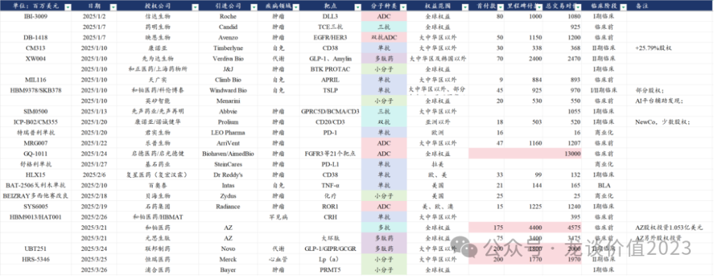
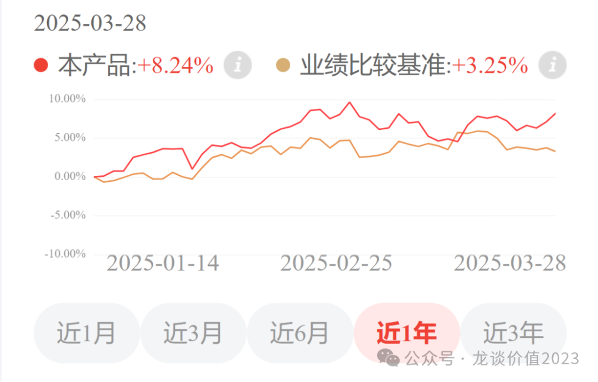
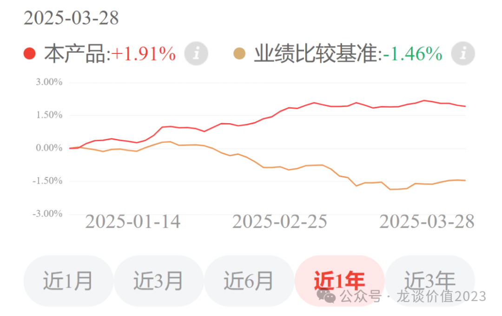

# CXO全面复苏

大家好，我是龙哥。

上周和上上周，分别给大家聊了药明康德、药明生物、药明合联的年报情况，药明系三家我们看下来不论是在项目数、订单、收入利润表现上，都要显著的好于行业，可以说过去几年CXO板块的波折之后，药明系作为行业龙头的领先优势是在扩大的。

但与此同时，行业内其他公司也陆续出现了基本面的复苏，在订单、收入、毛利率上逐渐显现，本文就再给大家梳理一下行业主要一二线公司的业绩情况，然后总结下我对行业当前的一些理解。

1、药明系

药明系的年报总结，在《[医药最高景气方向](https://mp.weixin.qq.com/s?__biz=MzkyMzQ3MDc3Mw==&mid=2247484299&idx=1&sn=c6677f52d0ea6ebfbc11420984b3636d&scene=21#wechat_redirect)》和《[CXO王者归来](https://mp.weixin.qq.com/s?__biz=MzkyMzQ3MDc3Mw==&mid=2247484259&idx=1&sn=1bc93a5b4d6772af4068695f22d8f23f&scene=21#wechat_redirect)》这两篇文章里有写到了，不再过多赘述，只罗列重点信息：

药明康德：截至24年底在手订单493.1亿+47%，25年指引持续经营业务同比增长10%-15%，且预计经调整利润率提升。

药明生物：截至24年底未完成服务订单105亿美元同比-21.61%，剔除默沙东30亿美元疫苗大单外基本持平，25年指引收入同比增长12%-15%，持续经营业务同比增长17%-20%。

药明合联：截至24年底在手订单9.91亿美元+71%，24年收入+90.8%、扣非归母净利润+240%，指引25年收入+35%。

2、康龙化成：

2024年收入122.76亿元+6.39%，扣非归母11.08亿元-26.82%，经调整归母16.07亿元-15.56%，员工人数21370同比+5.3%，资本开支20.41亿元同比减少8.24亿，活跃客户数3000个同比增加200个，新增客户数900个同比增加100个，新签订单同比增长20%。

Q4单季度收入34.6亿+16.13%创历史新高，2023Q3以来的过去6个季度的收入增速分别为+5.48%、+4.00%、-1.95%、+0.60%、+10.03%、+16.13%，季度收入增速回到15%以上且逐季度修复；经调整净利润4.99亿元回到历史新高附近（最高5.19亿），过去6个季度的经调整净利润增速分别为-6.91%、-3.04%、-22.66%、-28.88%、-13.07%、+1.72%，这是经调整净利润经历5个季度的同比下滑后首次同比转正。

实验室服务和小分子CDMO这两大核心业务板块基本呈现与收入相同的趋势，且毛利率也呈现逐季度修复的趋势。

3、凯莱英

2024年收入58.05亿元-25.82%，常规业务收入同比增长7.39%，毛利率42.36%同比下降8.7%。业务分部来看，小分子商业化CMO收入28.04亿元同比-45.15%，毛利率53.32%同比-6.75%，其中非新冠收入同比增长4.16%，小分子临床阶段CDMO收入17.67亿元+17.25%，自2022H2以来首次恢复正增长，毛利率39.42%同比下降1.32%；新兴业务收入12.26亿元同比增长2.25%，其中化学大分子收入4.59亿元+13.26%，化学大分子业务主要是GLP-1相关多肽药，凯莱英为信达生物的玛仕度肽做CDMO/CMO代工，2024Q4收入环比增长200%，预计是玛仕度肽临近上市做了备货生产。

2024年凯莱英在手订单10.52亿美元同比增长20.23%，新签订单同比增长20%，均恢复正增长，而2023年底的在手订单8.75亿美元同比下降23.91%。2024年凯莱英小分子CDMO/CMO项目数504个同比+18.31%，其中商业化项目48个同比+20%，临床III期项目73个同比+5.8%，临床阶段项目456个同比+18%。

2024年凯莱英净利润9.49亿元同比-58.2%，净利率16.35%显著低于新冠之前23%左右的净利率，主要是2024年凯莱英的固定资产周转率只有1.47，而新冠之前凯莱英正常的固定资产周转率是2.2-2.3，新冠期间建设的大量产能使得当前固定资产周转率偏低，净利率的修复还需要时间，预计25-26年的固定资产周转率会逐渐修复，对应净利率也有望逐渐修复，利润增速将高于收入增速。

4、博腾股份

2024年收入30.12亿元-17.87%，其中非新冠收入同比增长14%，毛利率24.59%同比下降16.1%，归母净利润-2.88亿元，净利率-9.56%，2024年固定资产周转率1.01相较2023年再度下降0.46。

公司出现上市以来的首次亏损，其中资产减值损失影响净利润1.33亿元，小分子制剂、细胞基因治疗、ADC等新业务领域合计亏损1.93亿元，这两部分导致亏损3.26亿元，剔除以上因素影响后的净利润是0.38亿元。

公司未披露新签订单和在手订单的情况，预计大概率恢复情况依然不佳，公司披露小分子原料药业务已签订订单数700个同比增长7%、24年交付项目626个同比增长6%，低水平的增长。

5、皓元医药

ADC CDMO二线公司，24年收入22.70亿元+20.75%，主要是后端生产这块的业务增速较低。公司前端的分子砌块和工具化合物业务已经受益于ADC的需求，24年收入合计14.99亿元+32.4%，该领域的激烈竞争和价格战也在24年告以段落，毛利率62.21%同比提升4%，是自2021年以来的首次提升，尤其是22-23年下滑明显，分别为61.89%和58.24%。后端业务包括创新药和仿制药的生产，24年收入为7.55亿元+2.49%，相较前几年40%以上的增长有所放缓，但随着新产能的投放，预计后端业务在25年开始会重回增长，24年后端业务的毛利率20.05%还是下降了2.63%。

利润端影响较大的还是资产减值损失，达到1.31亿元，占收入比重5.8%，这是前两年行业内公司大幅扩张渠道仓库导致的存货较多引起的。24年皓元医药的净利率8.88%同比提升2.1%，基本都来自毛利率的提升，相较高峰时20%的净利率仍有较大差距。预计公司25年利润率略有提升，但由于新产能投产带来的折旧摊销压力，25年大概率仍不是公司放利润的时间。

6、泰格医药

2024年收入66.03亿同比-10.58%，这是泰格医药上市以来首次收入下滑的年度，其中临床试验服务收入31.78亿元同比-23.75%，项目数831个同比增长10.51%，项目价格下降较多。

2024年泰格医药新签订单84.23亿元+7.3%，在手订单157.76亿元+12%，项目价格有触底的迹象，但可能不会太快反弹。

7、昭衍新药

2024年收入20.18亿元同比-15.07%，也是昭衍新药上市以来首次收入下滑的年度，临床前研究服务收入19.18亿元同比-16.96%，毛利率29.19%同比下降14.03%，24年归母净利润0.74亿元同比-81.24%。

昭衍新药24年新签订单18.40亿元同比-20%、在手订单22亿元同比-33.33%，对于昭衍来说订单的修复是更重要的，到24年下半年修复仍然不明显。

虽然国内市场表现较差，但昭衍海外收入下滑幅度更大，达到-24%，因此昭衍24年国内收入占比反而还提升了2.6%到78.25%。

......

总体来看，对于CDMO/CMO公司，特别是海外收入为主的公司，受到全球市场创新药投融资早于国内1年以上的修复的影响，在订单、收入、毛利率上都已经开始出现明显的修复。

尤其是在高景气度的GLP-1类药物、ADC类药物、双抗/多抗类药物领域已经呈现出非常高的景气度，行业龙头公司在复制上一轮CXO牛市中的业绩表现、甚至呈现更强的爆发力，原因是行业龙头已经经过过去多年在大分子和小分子领域的能力建设和客户口碑积累，在新的技术领域又做到了能力上的全球一线水平，因此可以快速的导入客户和订单、实现收入利润爆发。

ADC药物和GLP-1类药物CDMO/CMO服务的一线公司基本已经锁定是药明系，二线公司陆续在去年以来开始建成产能，后续也将开始享受细分领域的高景气度带来的增长。

对于临床CRO、尤其是国内业务为主的CRO公司，基本面的反转可能还需要更多时间，以及本身这些公司估值并没有更便宜。

我们之前较多次给大家分享创新药海外授权的情况，在23-24年创新药海外授权爆发的这两年，国产创新药分子的对外授权既包括一部分的上市公司项目，还包含大量的非上市公司，而25年以来我们看到一个明显的特点，有资金可以持续投研发的上市公司的下一代的分子还可以持续的对外输出海外BD授权，但是一级市场非上市公司的项目大幅减少，已经非常罕见，其中也就是先为达、元思生肽、启德医药等公司在多肽药和ADC药物风口上的公司有不错的项目对外授权。

换句话说就是，一级市场融资和情绪面的修复还需要比二级市场更久的时间，一级市场创新药biotech研发的确可能已经出现断档，这样会有两点影响：第一是对于已经上市的创新药公司来说是利好，可能意味着竞争格局的改善；第二是意味着国内新药研发的总项目数可能会受限，尤其是对CRO服务需求更高的一级市场biotech的项目数减少更明显，则国内为主的CRO公司的订单量、订单价格的企稳回升都需要更长时间。

......

最后，再提一下我自己在定投的两个组合：具体介绍在《[两个资产配置的重点方向](https://mp.weixin.qq.com/s?__biz=MzkyMzQ3MDc3Mw==&mid=2247484114&idx=1&sn=9d862ed9cfbfe39f4608466e3943f3e8&scene=21#wechat_redirect)》中，扫描以下二维码可了解组合的情况。

①龙谈医药科技组合

龙谈医药科技组合投资50%美股AI科技+50%AH医药行业，是相关性较低、但都具有较强长期潜力的方向，并通过管理人丰富的FOF投资经验选择优质的基金标的。通过这两个方向的搭配，使得组合不论是面对AH医药回调的时候还是最近美股的大跌，都能呈现相对平滑的业绩曲线，很适合作为长期定投的标的。对于大部分个人投资者来说，细分板块的暴涨暴跌很容易导致情绪的剧烈波动和交易的变形，平滑的曲线更容易长期获益。

2025年以来这个组合的累计收益率是8.24%，在美股大幅回调的情况下仍呈现5个点的相较A股大盘指数的超额收益。

②龙谈美元债

在今年仅仅2个月的时间，国内债券的业绩基准跌了1.46%，对于固收产品来说是较大幅度的回撤了，而配置美元债的组合两个月实现了1.9%的回报率，对于固收产品来说是较大幅度的短期收益了。

中美债市近期波动幅度都很大，我们看好中长期美债高基本票息+未来降息带来的美债上涨空间，但短期还有另一个影响因素是汇率，汇率的波动对大家来说是独立在美债波动之外的盈亏，持有美债资产主要的风险是人民币大幅升值——美元大幅贬值的风险，但如果人民币大幅升值、美元大幅贬值，意味着美国经济衰退预期强烈，对应美债利率下行空间较大，而组合管理人选择的都是长久期的美债，美债下行带来的资本利得收益可以对冲美元贬值的损失，使得组合收益更加稳健。

风险提示：本文仅讨论行业/公司经营情况，投资需综合考虑公司经营、估值、管理层等多方面因素，建议读者审慎参考，本文不作为投资依据，不建议大家根据本文做出投资计划。

<!-- wxmp-comments-begin -->

---

## 留言（9 条，含回复共 19 条）

- **軍** 👍6 · 2025-03-31 18:26
  请问一下拿了5年的乐普医疗套25个点，我都快坚持不住了[流泪]
  - ↳ **作者** · 2025-03-31 18:32
    器械这几年，日子过的比制药那边苦多了，制药那边创新药只要靠谱点的慢慢都起来了，器械这边就是被毒打，但器械领域的政策应该也临近拐点了，行业可以看起来了。
- **王熙** 👍4 · 2025-03-31 18:30
  在经济下行的大背景下，买行业第一名（药明系）肯定是最稳妥的选择。&nbsp;
  
  另外，请问下龙大，您是如何看待智飞生物这家公司的？它在2025年，或者2026年能迎来困境反转吗？
  - ↳ **作者** · 2025-03-31 18:38
    智飞实际上是比较考验消费复苏情况的，带状疱疹疫苗则是要考验老年人的高端消费能力，我感觉如果看好消费大的复苏，或许有更多纯消费的标的更前端。
- **涱泩🐳** 👍2 · 2025-03-31 18:31
  龙大，目前业绩和股价来看，康龙最具性价比？
  - ↳ **作者** · 2025-03-31 18:36
    第一呢，我理解这是行业性的需求回暖，但各个细分领域的景气度和增速有天壤之别，所以不要只追求性价比。
    第二呢，性价比也不能只看股价的位置，还是要看看实际的业绩和估值，或许你看起来涨的最多的反而估值最低呢。
- **@Sunny** 👍2 · 2025-03-31 18:39
  医药也该往上走了！但愿[合十]
  - ↳ **作者** · 2025-03-31 18:42
    前面先是创新药，然后CXO，再到后面创新器械，几个主要的大的细分板块信心逐渐修复回来了，行业自然就起来了。
- **婷小蔡👠** 👍2 · 2025-03-31 18:40
  百济A&nbsp;234想T一下，结果飞了，是不是接不回来了
  - ↳ **作者** · 2025-03-31 18:43
    这短线交易不好评价，但就百济A股这估值水平，我感觉也不用担心接不回来吧[捂脸]
- **风的影子** 👍2 · 2025-03-31 19:19
  龙大，能分析一下绿叶制药的年报吗？今天被爆锤。持有这个股，完美错过了这波创新药的上涨[流泪]
  - ↳ **作者** · 2025-03-31 19:39
    利润大幅低于预期，说好的降债也没降反而还有增加，这公司的年报很让人失望，25年有几个新品种的放量，还要看看25年的业绩能不能兑现好一点。
- **低碳哥** 👍1 · 2025-03-31 19:09
  龙大，君实生物今年转正的期望大不大，谢谢
  - ↳ **作者** · 2025-03-31 19:36
    君实生物今年二十三四个亿的产品收入预期，应该是不太可能能转正的，明年都还有点费劲，还得公司控控费。
- **着火了** 👍1 · 2025-03-31 19:45
  创新药和CXO确实动了，器械没有看到起色。
  - ↳ **作者** · 2025-03-31 19:52
    所以才说再到后面器械，今天已经有文件了，器械的政策拐点应该也不会很远了。
- **丁子豪** 👍1 · 2025-03-31 21:35
  龙哥亿帆医药是个什么情况，为啥美国市场迟迟无法获批
  - ↳ **作者** · 2025-03-31 21:51
    艾贝格司亭不是23年就在美国批了吗，你是说没发货？
  - ↳ **作者** · 2025-03-31 22:03
    长效升白这个本来也没多大市场机会，又不是一个优效的药，只不过为啥一直不发货美国我不知道，改天碰到公司的人我问问。

<!-- wxmp-comments-end -->
