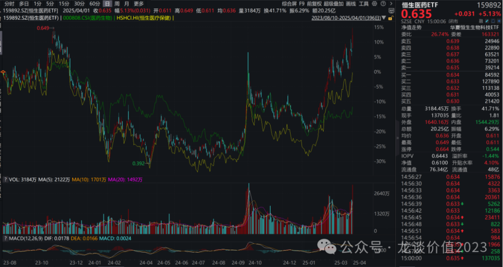
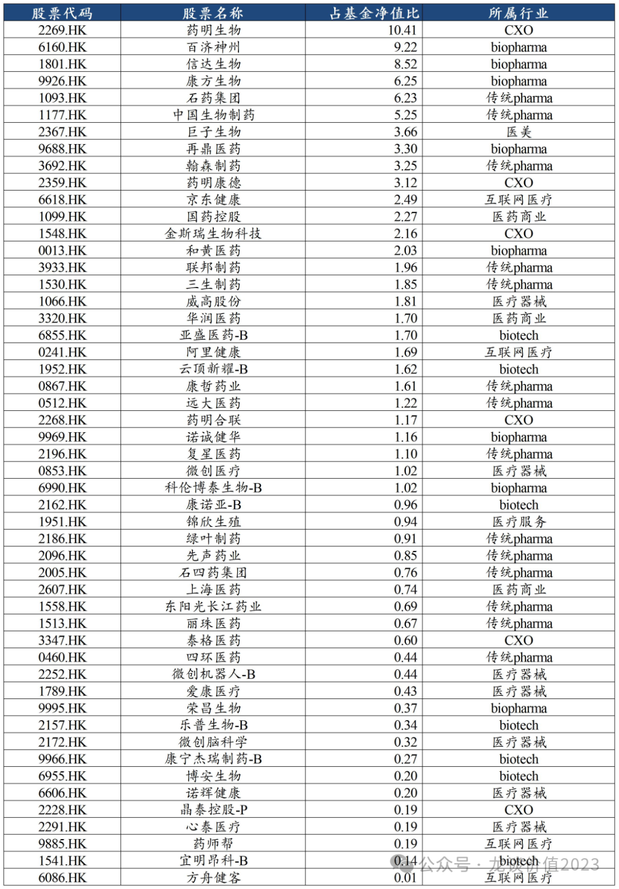
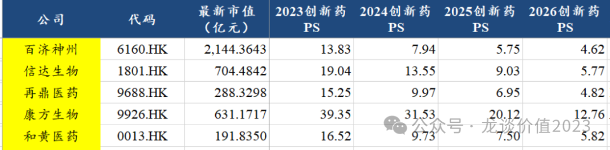

# 医药暴涨，估值贵了吗？

大家好，我是龙哥。

这两天医药板块大涨，尤其是整个24年以来我们反复反复再反复聊的创新药板块，尤其是港股创新药，以我之前一直提的下图中的159892恒生医药ETF为例，不管是拉到2年多的时间，还是从短期涨幅来说，都是跑赢恒生医疗指数（下图中黄线）和A股医药行业指数（下图中绿线）。

短期涨幅挺大，上周就有读者开始说港股医药见顶了，那当前医药的估值水平到底如何呢，我们本文以最现实的方式给大家聊聊——以恒生医药ETF重仓持股为代表来讲，原因是我如果给大家讲一堆全行业的平均估值处于什么水平之类的，第一是医药各个细分的逻辑、景气度和估值本身就差异巨大，全行业平均并不具有代表性，第二是介绍全行业的估值大家也大多不会去买全行业平均配置的基金，所以干脆就给大家聊看好方向的代表性ETF的重仓股。

恒生医药ETF合计有51个持仓标的，前10大重仓股占净值的59%，前20大重仓股占净值的79%，因此我们可以认为前20大重仓股的估值水平基本就能代表指数基金本身的估值水平，其基本面和估值会很大程度上决定指数基金本身的上涨空间。

1、药明生物/药明康德

药明系在基金净值中的占比合计是14.7%（包含合联），算是影响不小的一块，24年初行业ETF的下跌和药明系受到政治风险影响有很大的关系，当时CXO在其中的权重更高。

我们此前在文章《[CXO王者归来](https://mp.weixin.qq.com/s?__biz=MzkyMzQ3MDc3Mw==&mid=2247484259&idx=1&sn=1bc93a5b4d6772af4068695f22d8f23f&scene=21#wechat_redirect)》、《[医药最高景气方向](https://mp.weixin.qq.com/s?__biz=MzkyMzQ3MDc3Mw==&mid=2247484299&idx=1&sn=c6677f52d0ea6ebfbc11420984b3636d&scene=21#wechat_redirect)》中分析了药明系的基本面情况，在《[CXO全面复苏](https://mp.weixin.qq.com/s?__biz=MzkyMzQ3MDc3Mw==&mid=2247484308&idx=1&sn=3ecff125b0b85e5cd323cb99f646e2a3&scene=21#wechat_redirect)》总结了当前CXO行业的年报情况，因此基本面这块不再赘述，简单总结就是CXO行业呈现行业性修复，ADC和GLP-1驱动的细分行业景气度较高，药明系过去几年行业地位进一步强化。

估值方面，药明康德和药明生物25年盈利预测对应最新估值都在17倍PE左右，药明合联配股导致今天大跌，目前估值在28倍PE左右。当然各家之间的业绩增速差距也很大，不是直接横向比PE。

2、biopharma

前20大权重股中的Biopharma公司有百济神州、信达生物、康方生物、再鼎医药、和黄医药等5家，这5家中百济神州、信达生物、和黄医药在24年实现扭亏，再鼎医药预计25年底打平、26年扭亏，康方生物要看销售增长和费用投入情况，快的话25年、慢的话26年扭亏，因此国内第一批的优秀的biopharma在24-26年都陆续扭亏、意味着商业模式的跑通，这也是我们去年的文章中认为行业基本面拐点的核心判断（《[最重要行业拐点](https://mp.weixin.qq.com/s?__biz=MzkyMzQ3MDc3Mw==&mid=2247483961&idx=1&sn=a6c753e24d874e551a8d2eebbfb515dd&scene=21#wechat_redirect)》）。

对于这些biopharma来说，我们都有做管线估值，对于创新药公司来说是最直接的估值方式，但管线估值有点主观，每个人做的管线估值会有较大差异，因此我们在这里给大家展示PS估值。

除了康方以外的4家看25年大概在5-8倍PS，26年在4-6倍PS，另外百济、再鼎、和黄这三家都是同时有在美股上市的，可以认为估值也大致上是得到美股成熟创新药投资人认可的。

如果各位不太好理解PS估值，可以以这个PS水平按照创新药成熟期20%-40%净利率去倒推，可以算出假设成熟期盈利的PE水平，贵不贵就一目了然了。

3、传统pharma

传统药企在前20大权重里的有5家，分别是石药集团、中国生物制药、翰森制药、联邦制药和三生制药。其中石药集团的业绩压力还是比较大，核心的中枢神经和肿瘤药板块这两年承压；翰森制药我们此前的文章《[又一家百亿创新药巨头出现](https://mp.weixin.qq.com/s?__biz=MzkyMzQ3MDc3Mw==&mid=2247484285&idx=1&sn=c741f32eb039e33d3c3915a65dfb984f&scene=21#wechat_redirect)》里有介绍，是传统药企中第一家真正意义上完全转型成为创新药企的公司，创新药放量+海外BD使得业绩增长较好；中国生物制药也是已经基本走出仿制药集采的影响，生物类似药和创新药陆续进入放量期；联邦制药此前是受益于抗生素的大周期，业绩表现非常亮眼，股息率较高，目前抗生素周期见顶，但其进行了GLP-1领域三靶点创新药的布局和授权给全球GLP-1龙头之一的诺和诺德；三生制药此前最低只有6-7倍PE，极低估值、基本面稳健增长以及PD-1\*VEGF双抗发布II期临床数据等因素催化其短期的股价大涨。

由此可见，传统药企的基本面趋势也还是存在较大的差异，有已经在创新药走出来的翰森，有正在走出来的中国生物制药，也有还陷在传统存量品种里的石药集团。

估值方面：

预计石药集团25年仍会有一定增长压力，可能在个位数的收入利润增长，25-26年PE分别在13-14倍、12-13倍。  
预计中国生物制药是双位数业绩增速，25-26年PE分别在18倍左右和16倍左右。

翰森制药由于24年BD授权首付款基数较高，预计25年产品端双位数增长，但利润端我预计增速会有压力，除非有另外的大的BD落地，25年估值大概在30倍PE左右，其中包括了240亿在手现金贡献的预计约8亿左右利息收入，翰森也是传统药企中在手现金最多的公司之二，另一家是恒瑞。

预计三生制药高个位数到双位数增长，25-26年PE分别在13倍左右和12倍左右，后续几个外部BD引进的品种和三生国健的品种会陆续开始贡献收入增量，另外PD-1/VEGF双抗披露II期数据和后续开启III期临床也值得关注。

4、互联网医疗

互联网医疗的估值一直是个难题，尤其是当前又和AI医疗扯上关系，我们去年7月时高度看好的京东健康，主要是基于“傻瓜式”的逻辑，就是在双寡头垄断的互联网医疗领域，京东健康市值跌到600亿，在手现金560亿，经营现金流大概40-50亿每年，收入还有中双位数增长。

京东健康24年表观利润可能不会有增长，主要是40多亿的利润中有接近20亿是利息收入，而由于美国的降息，利息收入部分可能会有所减少，另外公司还会加大线下的投入和新技术的投入，其25年的估值大概在25倍PE左右，按经调整净利润计算则大概在20倍PE左右。

阿里健康由于没有那么多的在手现金和利息收入，表观估值要高一些，25年大概在45倍PE左右。

5、医疗器械

目前在前20大权重股中只有威高股份一家医疗器械公司，威高股份2024年是比较不易的一年，除了药品包材（就是玻璃瓶）以外的各项业务多少都有些压力，过去曾经利润占比高达22%的威高骨科业务，由于这几年的集采，目前利润占比只有7.7%了，但从2024年下半年开始威高骨科也逐渐走出集采的影响开始转正。

威高股份对25年的收入指引是增长10%-15%，假设利润率稳定的情况下25年估值大概11倍PE，仍然是估值洼地。

6、医药商业

前20大权重中还有两家医药商业公司，分别是国药控股和华润医药，这两家公司都在6-7倍PE，但我们知道医药流通的商业模式和有限的行业增速限制，使得其长期就是呈现低PE水平，基本是作为红利股来看，两家公司24年的股息率分别是3.5%和2.6%，在港股红利股来说确实不算有吸引力的分红率水平。

......

总体上，以恒生医药ETF（159892）为例为大家分析的港股医药指数的估值水平来看，板块估值相较底部肯定是有了一定水平的抬升，也有部分公司已经修复到了合理估值，但大部分公司都还谈不上很贵，相较20-21年医药行业泡沫化的估值更是还相去甚远。短期市场的交易火热，容易出现单日的暴涨暴跌剧烈波动，但大家对行业的基本面趋势和估值水平，还是要有一个基本的认识。

风险提示：本文仅讨论行业/公司经营情况，投资需综合考虑公司经营、估值、管理层等多方面因素，建议读者审慎参考，本文不作为投资依据，不建议大家根据本文做出投资计划。

<!-- wxmp-comments-begin -->

---

## 留言（14 条，含回复共 27 条）

- **郭文爵** 👍9 · 2025-04-02 11:42
  龙哥你好！目前器械类公司基本是医药行业估值洼地，如果后续考虑将部分创新药仓位兑现转战创新器械，选股是个难题，龙哥有空能不能讲讲微创系，特别是比较有想象空间的脑科学和机器人？
- **俏皮的货船** 👍8 · 2025-04-02 11:08
  还是龙哥最懂大家，大白话简单明了！就因为看了你的文章才一直坚定加仓医药到现在，感谢感谢！[抱拳]
  - ↳ **作者** · 2025-04-02 11:33
    [抱拳][抱拳]
    医药现在才是考验选股的时候了，前面行业的β，更需要的是对行业的理解深度和相信常识。
  - ↳ **作者** · 2025-04-02 11:43
    我没有选股能力，直接ETF！感觉挺好的！再次谢谢！
- **郑用平** 👍8 · 2025-04-02 11:41
  前天医药大跌。我就趁机建仓了医疗器械etf和一只个股。昨天就大反弹了，我希望还继续跌啊，我还有20%仓位&nbsp;&nbsp;没买完，20%仓位全干医疗器械方向。原因无他估值够低。
- **王熙** 👍5 · 2025-04-02 11:16
  龙大&nbsp;即讲基本面分析，又讲估值高低分析，跟着龙大学到很多东西，良心作者！
  - ↳ **作者** · 2025-04-02 11:43
    感谢感谢，多多指教[抱拳][抱拳]
- **Mocochan** 👍5 · 2025-04-02 11:17
  感谢龙哥一直坚持在这个赛道分享这么多高质量文章[玫瑰][玫瑰][玫瑰]医药守了两年了，今年有新的资金还在纠结底部上来这么多还能不能加仓了，看完分析觉得踏实不少哈哈哈
  - ↳ **作者** · 2025-04-02 11:34
    是的，行业的投资价值，需要综合评估基本面和估值，不是单纯看股价涨多少跌多少去决定的。
- **泛饭之辈** 👍5 · 2025-04-02 11:27
  龙哥，美股的XBI最近是在跌啥？以往和美国国债利率负相关的，但最近有些背离。是交易层面的原因还是有些产业上的变化
  - ↳ **作者** · 2025-04-02 11:36
    你有没有想过，XBI的商业模式就是biotech开发早期分子授权给MNC，现在欧美MNC疯狂从中国biotech来买分子，说明啥[旺柴]
- **胡言胡语hws** 👍4 · 2025-04-02 11:43
  请问什么时候才能轮到消费医疗？像牙科眼科OK镜生长激素这些还有机会吗，是不是要等到整个消费复苏之后才有表现？
  - ↳ **作者** · 2025-04-02 11:44
    是的呀，这些要看宏观环境、消费复苏情况。
- **俏皮的货船** 👍3 · 2025-04-02 11:12
  现在坐等医疗器械板块起来了，不知道何时能够到来？应该快反转了吧，谢谢！
  - ↳ **作者** · 2025-04-02 11:43
    我自己判断，觉得政策面今年会陆续看到一些变化，然后基本面的拐点会再往后1-2年。
- **雨化心声** 👍3 · 2025-04-02 11:40
  龙大，恒瑞马上也要进，HK，港股的医药估值会被整体，提高一个台阶。还是会对其形成，压制？
  另外，对于其夫妻公司，翰林，应该也是互利关系？
  - ↳ **作者** · 2025-04-02 11:42
    港股估值体系是相对独立的，不要想着靠一个恒瑞在港股上市能影响港股整个估值体系，AH公司的估值平均都会有30%左右的价差。
- **@Sunny** 👍3 · 2025-04-02 11:55
  我的创新药ETF没怎么涨啊[流泪]
  - ↳ **作者** · 2025-04-02 12:16
    那应该是买的A股创新药ETF，你是要反思一下了。关注2年了，我一直在说港股医药ETF[撇嘴]
- **阿宝** 👍3 · 2025-04-02 14:21
  每次龙哥都不讲亚盛，好歹也是持仓前20，这家公司存在感好低呀[委屈]
  - ↳ **作者** · 2025-04-02 14:37
    额，二三线的biotech太多了，讲不过来啊[破涕为笑]
- **雁素鱼笺** 👍3 · 2025-04-02 21:02
  也是看了龙哥的文章买了恒生医药ETF，比个股省心多了，也有了不少盈利[抱拳][抱拳][抱拳]
  - ↳ **作者** · 2025-04-03 09:04
    [抱拳][抱拳][握手]
- **初心琴行龚老师** 👍2 · 2025-04-02 11:26
  医药最近吃大肉了
  - ↳ **作者** · 2025-04-02 11:35
    [社会社会][社会社会]
- **隐隐** 👍2 · 2025-04-02 12:17
  不会选股，拿点创新药etf吧[苦涩]
  - ↳ **作者** · 2025-04-02 12:21
    挺好的啊

<!-- wxmp-comments-end -->
