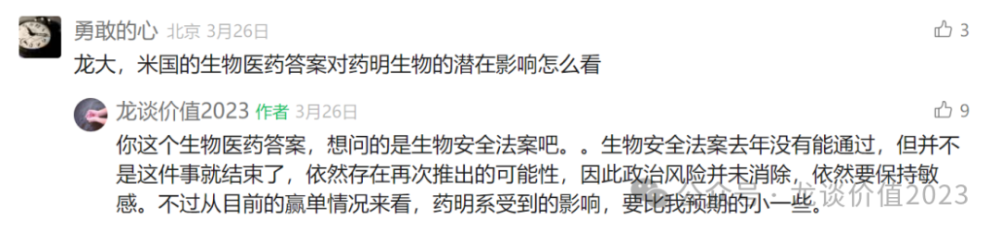
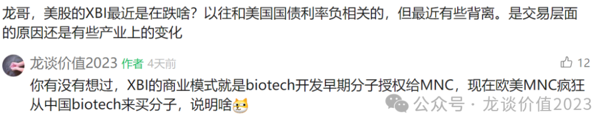

# 医药再迎政治风险考验

大家好，我是龙哥。

前几天写CXO行业年报梳理的时候，有读者就问到了下面这个问题，实际上每次只要讲到CXO，就一定有一个或几个读者问到政治风险的问题，主要是24年初政治风险对包括CXO在内的医药行业冲击太大、印象太深刻。

来到今天这个时间点，新的生物安全法案尚未推出，但新的政治风险的考验又出现，包括两个方面的政策，一方面是中美互加关税对行业的正面及负面的潜在影响，另一方面是美国考虑生物安全而可能推出的政策，这不仅仅是对CXO行业，是对整个医药行业的考验，包括多个行业，因此我们这篇文章主要讨论这个问题。

1、美国生物安全问题

大家比较关心的问题可能是关税的问题，但我先把涉及到美国生物安全法案的问题放在前面来讨论，原因主要是，加征关税的实质性影响是相对清楚和容易判断的，而生物安全法案的影响是目前不太清楚和相对难判断的，因此我们需要先讨论这个问题。

事情的具体情况，是美国国家新兴生物技术安全委员会（NSCEB，2022年由国防授权法案设立）将于2025年4月10日发布最终报告，报告的内容主要是维持美国生物技术领先地位的详细建议，有可能在7-8月推进立法、可能在25年底到26年初落地。其此前在2024年发布的中期报告中强调与中国的竞争加剧、强调生物技术对国家安全的重要性，目标是推进全球生物制药研发和制造回归美国、拉动美国生物科技领域资本开支重回高增长。

预计文件和政策的主要影响在于：①增加政府的研发开支、提供税收见面等政策鼓励美国本土生物制药研发和生产制造；②限制对华的技术转移，设立生物安全审查机制，防止美国医疗信息数据流入中国。

这个对国内的影响主要是创新药产业链，包括CXO和创新药公司。

CXO行业自然不必多说，生物安全法案的影响犹在眼前，虽然去年的生物安全法案未能落地，但对国内CXO企业尤其是药明生物订单的影响已经出现，药明康德和药明合联由于多肽药物和ADC药物的景气度摆在这里，订单表现反而是还非常不错。

后续基于生物安全而推出的法案，仍可能是对CXO尤其是CMO的影响最大，在行业性的影响之后，竞争壁垒最高、转移难度最大的ADC CDMO领域还是可能最先跑出来。

创新药方面，中国创新药出海的蓬勃发展，对于美国生物科技公司的竞争也是非常残酷的，同样一个靶点，MNC去买美国biotech公司的分子可能要花费十几亿到几十亿美元的价格去收购，而可能只需要花费几千万美元或者1-2亿美元就可以引进一款中国处于差不多研发阶段的分子，这对XBI指数中的美国biotech来说是对价值兑现逻辑的负面影响。因此，这就回到另外一个问题，XBI指数表现较差、甚至跌幅还要大于纳斯达克指数：

另一个角度来说，假如未来真的像我们此前理想情况下测算的那样，欧美30%的创新药分子来自中国，全球1万多亿美元的创新药市场中，中国出海授权的分子占据3000亿美元以上的市场，按10%-15%的销售分成计算，中国药企和biotech每年可以拿到300亿-450亿美元的销售分成，还不算首付款和里程碑付款，只需要开发早期分子、不需要管生产制造和销售......对于美国人来说可能也是很难接受的。

也因此，对于这种美国大批量的从中国引进创新药分子开发的模式，美国的业界和政客都已经关注到，这次的报告中也会对其做相应的讨论，具体会是什么样的讨论、给出什么样的结论、其做出什么样的应对，是我们现在不确定的。

从理性的逻辑分析的角度，从中国买早期的分子来开发，对于美国大药企来说是降低研发成本、提高研发效率的事情，是有利于控制美国当前快速增长、占GDP比重已经达到20%的医疗保健开支的事情，美国大药企也会对政策制定者施压，其本身也是一股不可忽视的强大力量。

但是，从理性逻辑分析的角度来说CDMO/CMO也是帮助美国降低新药研发和制造成本的事情，依然可以被以国家安全的名头加以限制，因此创新药海外授权方面，也要关注其政策面的变化，尤其是创新药过去1年的上涨，总体来看还是出海逻辑主导、内需和政策改善逻辑为辅。

因此，我们并不是说创新药出海一定受到什么样的影响——当前并无法判断，只是着眼当下、尤其是很多创新药标的已经涨了不少的背景下，更需要关注这方面的边际变化。

2、中美互加关税问题

上周美国对全球各国加征关税的事情大家应该已经看到比较多的消息，当时对药品行业是暂时豁免了关税，但是暂时的豁免并不代表药品行业不加关税，而是要和半导体都单独制定一个政策，因此关税避风港并不是永远的。

具体来看关税政策对医药各板块的影响：

①受益于国内对美加征关税的方向：

血液制品，内需逻辑+供给受限+进口被加关税，血制品产品市场占比一半以上的人血白蛋白有65%左右依赖进口，而美国是全球最大的血制品出口大国，国内对所有美国商品加征关税可能导致白蛋白供需错配，即便这两年国内采浆和供应产能有增加，但供给端的局限性仍客观存在、远不足以弥补进口白蛋白的庞大规模，因此可能会引起产品提价，另外重组白蛋白的价值可能也在提升。

②纯内需、短期受影响较小的方向：

连锁药店、医疗服务、消费医疗、医药商业。市场主要期待刺激国内经济的政策，对于内需的板块会有政策面的帮助，以及此前布局外需为主的方向的资金可能会有持仓的调整。

但同时还要注意，内需的方向最终业绩层面的兑现也会比较复杂，从内需角度去布局的话，在全行业来说未必一定要选择医药，医药内需的修复相对来说可能是滞后于其他相对容易被政策刺激的内需方向的。

③短期有部分影响、但会有结构性机会的方向：

创新药行业、医疗器械行业。既有出海的逻辑，又有国内市场国产替代的逻辑，创新药出海受到关税影响总体可控，一方面是创新药的BD授权属于技术服务的出口，不属于产品的出口，另一方面生产成本在创新药中的占比本身就很低，并且创新药海外BD以后的生产可以外包给海外的CDMO/CMO产能去生产，因此核心还是要看4月10日发布的报告内容，对于中国创新药出海是否会有进一步的限制。创新药方向选择上，首选国内为主，其次已经实现出海，再其次产品极具竞争力。

医疗器械大部分公司原本出海都处于早期、且能进入美国市场的出海就更少，因此相对来说出海的逻辑受影响会比创新药小一点，至于国内市场还可以有国产替代的逻辑，不过原本大量跨国医疗器械厂商也都在国内做了本地化生产，因此对于器械来说，实际的正面和负面的影响都不会那么大。

另外还有部分公司是BD引进欧美的品种在国内市场销售，实际上创新药的生产在美国本土的比例也不高，尤其是依赖CMO企业生产的很多是在欧洲，也不太会受到国内对原产地美国的商品加征关税的影响，只有个别品种确实会受到影响，因此总体也是相对可控。

④短期影响最大且不可控的方向：

原料药、CDMO/CMO、低值耗材。涉及到药品生产制造和医疗耗材生产制造的环节，对海外市场依赖度较高，短期即便药品的关税有豁免，后续可能会推出单独的关税政策，具有一定的局限性，情绪的释放可能不会短期马上结束，总体是规避为主的方向。

总体来说加征关税后的影响并没有脱离我们可判断的范畴，是相对容易理解和判断的，而涉及美国生物安全相关的政策短期是无法判断的，还需进一步的观察。

......

近期重点文章（可直接点击下列链接查看）：

《[医药暴涨，估值贵了吗？](https://mp.weixin.qq.com/s?__biz=MzkyMzQ3MDc3Mw==&mid=2247484317&idx=1&sn=28b1cabe165edbe8fe713987e79e3ee9&scene=21#wechat_redirect)》

《[医药最高景气方向](https://mp.weixin.qq.com/s?__biz=MzkyMzQ3MDc3Mw==&mid=2247484299&idx=1&sn=c6677f52d0ea6ebfbc11420984b3636d&scene=21#wechat_redirect)》

《[又一家百亿创新药巨头出现](https://mp.weixin.qq.com/s?__biz=MzkyMzQ3MDc3Mw==&mid=2247484285&idx=1&sn=c741f32eb039e33d3c3915a65dfb984f&scene=21#wechat_redirect)》

《[中国创新药出海之王](https://mp.weixin.qq.com/s?__biz=MzkyMzQ3MDc3Mw==&mid=2247484173&idx=1&sn=52dcb6390d13960d7ec157efb9ec76f6&scene=21#wechat_redirect)》

《[最全ETF梳理](https://mp.weixin.qq.com/s?__biz=MzkyMzQ3MDc3Mw==&mid=2247484135&idx=1&sn=2a8555f0200922f90e82d51562574545&scene=21#wechat_redirect)》

《[创新药巨头狂飙](https://mp.weixin.qq.com/s?__biz=MzkyMzQ3MDc3Mw==&mid=2247484144&idx=1&sn=0b26f935e3f7a1a6248b091a6c0ec916&scene=21#wechat_redirect)》

《[最重要行业拐点](https://mp.weixin.qq.com/s?__biz=MzkyMzQ3MDc3Mw==&mid=2247483961&idx=1&sn=a6c753e24d874e551a8d2eebbfb515dd&scene=21#wechat_redirect)》

风险提示：本文仅讨论行业/公司经营情况，投资需综合考虑公司经营、估值、管理层等多方面因素，建议读者审慎参考，本文不作为投资依据，不建议大家根据本文做出投资计划。

<!-- wxmp-comments-begin -->

---

## 留言（9 条，含回复共 16 条）

- **和** 👍6 · 2025-04-07 10:38
  只能干熬
- **隐隐** 👍6 · 2025-04-07 11:38
  今天一天回到解放前[破涕为笑]
- **草长莺飞** 👍4 · 2025-04-07 12:46
  龙哥，君实生物怎么看？
  - ↳ **作者** · 2025-04-07 13:42
    君实生物这两年PD-1由于几个大适应症的帮助，应该销售增长会还不错，但后续产品线目前仍然看不清楚有什么大的看点，基本都还是fast follow为主，目前仅靠PD-1可能很难看到市值空间。
- **迷雾** 👍3 · 2025-04-07 12:04
  龙哥，持有药名生物，唉，想问下，药名生物受到的打击是不是远远超过要我康德和合联，会不会就此归零
  - ↳ **作者** · 2025-04-07 13:07
    归零不至于，药明生物控股药明合联，就算美国业务受损也还有欧洲、日韩、中国业务。只是政治风险的影响程度是目前无法判断的。
- **建东** 👍2 · 2025-04-07 12:36
  创新药的出口关税到底怎么计算的&nbsp;龙哥清楚不&nbsp;[抱拳]
  - ↳ **作者** · 2025-04-07 13:04
    创新药目前是豁免关税的，后面还要看美国对这块的单独的政策怎么出
- **峰回路转** 👍1 · 2025-04-07 17:10
  老师好，京东健康账上现金充足，抗风险能力强，业绩扩张弹性大的逻辑还在么
  - ↳ **作者** · 2025-04-07 17:36
    确实是现金充裕，接近600亿的现金，经营现金流也不错，估值下有底。但业务扩张的弹性未必很大，还要看他线下布局的规划，以及在医疗AI中的受益。
- **叶** 👍1 · 2025-04-07 19:12
  这么看&nbsp;&nbsp;恒瑞要比百济风险小了
  - ↳ **作者** · 2025-04-07 22:26
    也没有吧，百济本质上已经是个美国公司，研发、生产、销售都在美国，恒瑞的产品全球价值兑现则是还要看后续产品出海授权的情况。
- **向阳而生** · 2025-04-07 18:00
  龙哥开立医疗国产替代的逻辑还在吗
  - ↳ **作者** · 2025-04-07 22:26
    在的，只是这两年相比国产替代的逻辑，他受国内设备采购周期和政策周期的影响更大一些。
- **低碳哥** · 2025-04-08 11:59
  近日，美国国家卫生研究院（NIH）主任办公室网站发布增强NIH受控访问数据安全措施，自4月4日起禁止中国（包括香港和澳门）、俄罗斯、伊朗、朝鲜等受关注国家机构访问
  
  龙大对此事，怎么看
  - ↳ **作者** · 2025-04-08 12:15
    这个就是美国提高医疗数据安全的体现，实质影响应该还好，翻个墙就能解决，但还是我本文讲到的，要看后续更直接的立法层面可能会有哪些东西

<!-- wxmp-comments-end -->
