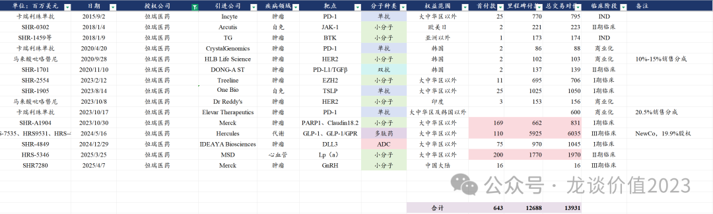

# 恒瑞医药火力全开

大家好，我是龙哥。

此前在《[巨头黄昏还是黎明前的黑暗](https://mp.weixin.qq.com/s?__biz=MzkyMzQ3MDc3Mw==&mid=2247484184&idx=1&sn=55ec711da3240320949b76ae746cc139&scene=21#wechat_redirect)》中和大家聊了恒瑞医药的情况。

自2025年以来，恒瑞医药在研发、BD授权和创新药审批方面可谓火力全开，经过几年仿制药集采和创新药降价的打击，恒瑞医药厚积薄发，进入新的产品商业化兑现期。

根据2025年3月30日恒瑞医药披露的2024年年报，2024年恒瑞医药实现创新药收入138.92亿元，同比增长31%，报表端预计在130亿元左右。

根据恒瑞医药2024年年报披露的信息，恒瑞医药预计未来三年2025-2027年每年新增11/13/23个项目获批上市，而刚刚过去1个季度多一点的时间，恒瑞医药就已经有6个新药/新适应症获批上市，4个新药/新适应症申报上市，还有一个标志性的大III期达到主要终点，新启动多个III期临床，实现3个创新药的出海BD授权。

这里梳理一下恒瑞医药25年以来的业务进展，展现一下恒瑞医药今年来“火力全开”的产品兑现能力。

1、产品获批

①2025年1月10日，瑞卡西单抗（PCSK9单抗）获批上市治疗原发性高胆固醇血症，目前国内已经有7家PSCK9靶点的药物获批，分别是安进、赛诺菲的两款进口PCSK9单抗，诺华的PSCK9的小核酸药物（半年给药一次），以及信达生物（2023M8）、康方生物（2024M9）、君实生物（2024M10）等3款国产PCSK9单抗，恒瑞医药是国产第4家。

②2025年3月14日，富马酸泰吉利定（MOR）获批新适应症，用于治疗骨科手术后中重度疼痛。除泰吉利定外国内还有一款恩华药业海外BD引进的一款MOR抑制剂奥赛利定获批上市。

③2025年3月21日，硫酸艾玛昔替尼片（JAK1抑制剂）获批上市，用于治疗强直性脊柱炎，这是首款获批上市的国产JAK1抑制剂，除了恒瑞医药目前国内还有艾伯维的乌帕替尼和辉瑞的阿布昔替尼获批上市，艾伯维的乌帕替尼2024年全球销售额59.7亿美元+50%，预计2026-2027年将成为超百亿美元的超级重磅炸弹药物。

④2025年3月31日，艾玛昔替尼片（JAK1抑制剂）获批第二个适应症，用于治疗中重度活动性类风湿性关节炎。

⑤2025年4月8日，夫那奇珠单抗（IL-17A）获批第二个适应症，用于治疗强直性脊柱炎适应症，为仅次于智翔金泰的国产第二家。

⑥2025年4月8日，艾玛昔替尼片（JAK1抑制剂）获批第三个适应症，用于治疗成人中重度特应性皮炎，这也是JAK1抑制剂市场潜力最大的适应症之一。

2、产品申报

①2025年1月9日，SHR4640（URAT1抑制剂）申报上市获得NMPA受理，这是首款申报上市的国产URAT1抑制剂，用于治疗痛风伴高尿酸血症，III期临床显示SHR4640联合非布司他的降尿酸效果显著好于非布司他单药。

②2025年1月23日，舒地胰岛素注射液申报上市，这是首个国产自主研发的长效胰岛素类似物。

③2025年2月15日，艾玛昔替尼乳膏申报上市获得NMPA受理，用于治疗轻中度特应性皮炎，艾玛昔替尼是首个获批上市的国产JAK1抑制剂，这也是首个申报上市的国产JAK1抑制剂乳膏剂。

④2025年2月17日，HR19034（低浓度硫酸阿托品滴眼液）申报上市获得NMPA受理，此前分别有兴齐眼药在2024年3月获批、兆科眼科在2025年1月申报上市，恒瑞医药为国产第三家。

3、启动III期临床

①2025年2月12日，恒瑞医药启动新型抗凝血药SHR-2004（FXI/FXIa单抗）的III期临床，为首个国产FXI抑制剂进入III期临床，目前全球有诺华、拜耳、强生/BMS和恒瑞医药等4款FXI/FXIa抑制剂处于III期临床。

②2025年2月14日，恒瑞医药启动SHR-A1811（HER2-ADC）的第七项III期临床，用于治疗铂类化疗敏感复发性卵巢癌。恒瑞医药的A1811为与DS-8201较为接近的HER2-ADC中的国产首家申报上市，阿斯利康/第一三共的DS8201在24年全球销售额37.5亿美元+46%。

③2025年3月17日，恒瑞医药启动SHR-A2102（Nectin4-ADC）第二项III期临床，也既联合PD-L1治疗膀胱癌的II/III期临床，此前2024年12月启动了2L UC的III期临床，恒瑞医药的Nectin4-ADC为国产第二家，仅次于迈威生物，24年Nectin4-ADC Padcex全球销售额已经高达15.88亿美元（+54%），目前已经获批一线治疗，预计会持续放量。

④2025年3月31日，恒瑞医药启动HRS7535（小分子GLP-1激动剂）用于减重适应症的III期临床，此前24年9月已经启动首个降糖适应症的III期临床，这是国内继闻泰医药、华东医药后第三家启动减重适应症的国产小分子GLP-1激动剂。

4、达到III期终点

①2025年2月23日，恒瑞医药宣布其羟乙磺酸达尔西利片（CDK4/6抑制剂）联合内分泌治疗用于HR+/HER2-女性乳腺癌的辅助治疗达到III期临床主要终点，这是一项入组人数超过5000人、持续时间超过4年的超级III期临床，恒瑞医药该III期临床的成功，对国内创新药研发来说，我认为都是具有里程碑意义的。

5、产品注册失利

2025年3月21日，恒瑞医药的卡瑞利珠单抗（PD-1）+阿帕替尼（VEGFR）一线治疗肝细胞癌未获得美国FDA批准，这是恒瑞医药第二次申报该联合疗法被FDA拒绝，也是恒瑞医药创新药出海的又一次失利，恒瑞医药后续还将重新申报该联合疗法。虽然该产品注册失利，但本身对该产品的海外市场也已经不抱什么预期。

6、产品海外BD授权

2024年12月29日，恒瑞医药将SHR-4849（DLL3-ADC）以7500万美元首付款+9.7亿美元里程碑付款的交易对价将其大中华区以外权益授权给IDEAYA Biosciences。

2025年3月25日，恒瑞医药将HRS-5346（Lp（a））以2亿美元首付款+17.7亿美元里程碑付款的交易对价将其大中华区以外权益授权给MSD，这也是恒瑞医药继23年10月将PARP1抑制剂海外权益授权德国默克后第二次将产品授权给国际MNC。

2025年4月7日，恒瑞医药将SHR-7280（GnRH）以1500万欧元首付款及后续里程碑付款的交易对价将中国大陆商业化权益授予德国默克，且德国默克有全球权益的优先选择权。这是恒瑞医药历史上第15笔海外BD授权。

风险提示：本文仅讨论行业/公司经营情况，投资需综合考虑公司经营、估值、管理层等多方面因素，建议读者审慎参考，本文不作为投资依据，不建议大家根据本文做出投资计划。

<!-- wxmp-comments-begin -->

---

## 留言（14 条，含回复共 30 条）

- **'AAA雪碧爱可乐** 👍10 · 2025-04-08 22:36
  我21年最高峰买的恒瑞&nbsp;&nbsp;拿到现在，当年我买的恒瑞，同事买的中心国际，他的去年大赚一倍走了&nbsp;&nbsp;今年是不是该我
  - ↳ **作者** · 2025-04-08 23:23
    同样高峰开始买的，现在也刚回本
- **迷雾** 👍2 · 2025-04-08 22:17
  龙哥，美国国会怎么又订上药名了，上次法案这次报告，
  - ↳ **作者** · 2025-04-08 22:20
    我昨天早上专门发了篇文章讲这个事啊，我们之前也说到，药明系和CXO的政治风险并未消失，只是去年生物安全法案没有通过，不代表这事就结束了，生物制药对他们来说目前是属于事关“国家安全”的事情，如果你看了今天那个NSCEB的报告原文就会发现，里面饱含诬陷、恶意猜测和偏见，但国与国之间的产业竞争就是如此。
- **姜行者** 👍2 · 2025-04-08 22:29
  海外BD和NewCo逻辑不受未来关税预期影响吗？
  - ↳ **作者** · 2025-04-08 22:31
    关税对创新药出海的逻辑影响本身就是比较有限的，我原本是对今天那个NSCEB的报告有点担心的，但今天盘中看到报告原文就赶紧阅读了一下，发现主要还是在攻击药明系，在寻求美国本土自建生物制药产业链，对创新药的BD授权基本没提到，也让我放了点心。
- **宇文大大爷** 👍2 · 2025-04-08 22:32
  集采这个大山，只要恒瑞国内混，再好的创新药也是灵魂砍价到骨折，连本也别想回来，没用的！
  - ↳ **作者** · 2025-04-08 22:33
    这都2025年了，怎么还有分不清创新药国谈和仿制药集采的读者啊？而且还是关注了2年多的读者。。。。
  - ↳ **作者** · 2025-04-08 22:38
    集采的也开始改变了&nbsp;&nbsp;保护创新了
- **和** 👍2 · 2025-04-08 22:33
  恒生医药ETF还有贸易风险吗？
  - ↳ **作者** · 2025-04-08 22:34
    CXO的政治风险是客观存在的，上周的文章，有分析ETF的持仓结构。
- **明城墙下** 👍2 · 2025-04-08 22:38
  港股创新药怎么了，ETF两个跌停了！
  - ↳ **作者** · 2025-04-08 22:39
    你没发现昨天港股恒生指数跌了13%、恒生科技指数跌了17%、恒生医疗保健指数跌了19%吗[捂脸]
- **魏小魏** 👍1 · 2025-04-08 22:20
  请教个问题，关于这夫妻两个，到底是买恒瑞好，还是隔壁翰森好阿&nbsp;。看了一周多了，也没做出选择[撇嘴]，好难阿
  - ↳ **作者** · 2025-04-08 22:23
    两个公司综合实力都很强，也都处于创新药销售快速增长、多个创新药产品海外BD授权的阶段，选择的话未必非要二选一，甚至也可以根据成长性和估值的匹配度在夫妻店之间做切换，觉得估值高了的可以切到另一个去
- **刘亮** 👍1 · 2025-04-08 22:24
  最近医药又跌麻了……
  - ↳ **作者** · 2025-04-08 22:24
    也别最近了，就是昨天嘛，政治因素导致的全市场出现恐慌性杀跌。
- ***成嘚** 👍1 · 2025-04-08 22:25
  最后那段是1500万美元，不是亿。。
  - ↳ **作者** · 2025-04-08 22:26
    笔误，已修正，感谢感谢[抱拳]
- **'AAA雪碧爱可乐** 👍1 · 2025-04-08 22:29
  是1500万欧
  - ↳ **作者** · 2025-04-08 22:31
    好的好的，有另一位读者提醒了，已经改正了，刷新一下应该就是更正后的了。
- **摆渡3752** 👍1 · 2025-04-08 22:50
  收到，明天开始下载各路小额贷APP[旺柴]
  - ↳ **作者** · 2025-04-08 23:13
    啊不至于不至于[捂脸][捂脸][捂脸]
- **Jeffery** 👍1 · 2025-04-08 23:22
  还能说啥，子弹已经射出8梭子，明天考虑再加1手[捂脸]，千万别搞那句，就差我这一手[捂脸]
  - ↳ **作者** · 2025-04-08 23:22
    哈哈[捂脸][捂脸]
- **大庆** · 2025-04-08 23:01
  龙少，关税战是不是利好爱博医疗，进口的都要加关税？
  - ↳ **作者** · 2025-04-08 23:14
    国产替代角度是的，不过药品和高值耗材这边是否会加征关税还要再看，美国那边对药品是豁免关税的，国内还不好说，毕竟医疗这边和民生的关联度很高
  - ↳ **作者** · 2025-04-09 09:25
    当地时间4月8日，美国总统特朗普发表讲话称，美国将对药品征收关税。
- **李白好白** · 2025-04-08 23:05
  恒瑞这个市值，和康方亚盛等港股相比，是不是偏贵了？另外恒瑞还上h股吗
  - ↳ **作者** · 2025-04-08 23:17
    恒瑞的估值确实谈不上便宜，尤其是他还有一部分研发投入资本化，实际上的PE要比表观的PE更高，但另一方面恒瑞医药拥有国内pharma里最丰富、最庞大、较为领先的产品管线，估值很难以短期的PE来衡量。
    H股应该还是要发的。

<!-- wxmp-comments-end -->
